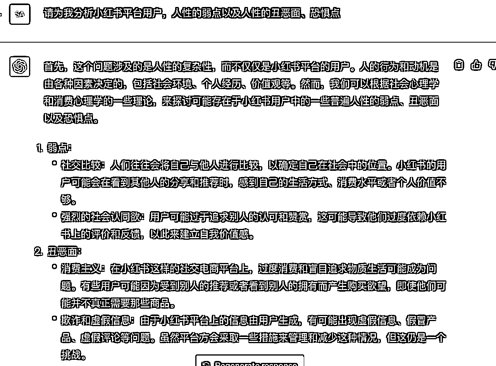

# 价值八千AI指令开发保姆级拆解

> 来源：[https://cvh0khn7xvb.feishu.cn/docx/C0F6dAOKDopAUdx2q3Mc6UEHnXd](https://cvh0khn7xvb.feishu.cn/docx/C0F6dAOKDopAUdx2q3Mc6UEHnXd)

# 零、前提介绍

大家好，我是王俊杰Justin，刚刚结束大二，已创业两年，致力于AI应用领域，项目在清华大学x-lab与校园VC举办的创业活动中获得冠军，得到了许多前辈的关注，并借此实现自己第一单AI指令变现，8000元，并陆续开展AI指令相关业务

自己是大一开始接触生财有术，作为一个只有一腔热情的小白，被社群里的帖子狠狠震惊，刷了一整个通宵，见识了许多市面上前沿的玩法，受益匪浅。

在社群真诚利他、开放包容的价值观影响下，我遇到了我的贵人，拱卒老师。带我一起做项目、参加活动，与我一起聊生意，让我在一年里，获得了难以想象的成长。

后来，遇到了北京的贵人，结识了现在的团队，自去年12月7日起开始做AI应用层落地，一开始先是用AI赋能原先业务的某个关键环节，后来持续的进行项目实战，坚信优质AI指令是打通大语言模型与实际应用场景的必经之路，自己的力量终归有限，在前进路上摸索出了应用级AI指令开发方法，赋能团队小伙伴，目前聚焦在为企业定制开发AI指令方向上

上周五，看到袁六伟大佬关于AI指令的分享，很受震撼，原来生财里也有这么多对AI指令变现感兴趣的伙伴，而自己刚好一直在做AI应用层研究，成功为企业开发“通人性的小红书AI指令”，赚到了该领域的第一桶金

看到很多朋友对这个话题感兴趣，刚好我们团队在深挖，感恩生财，本着真诚利他的原则，对我们开发过程进行了详细拆解，希望大家看完能有所收获

先上效果，经过调校后AI对人性的理解，已经超乎你的想象，并可直接用于小红书创作

“你不知道的，这些食物可能在悄悄伤害你的身体！”

“你是如何被完美身材误导的”

“他说他喜欢你，但是这些行为揭露了真相”

“你真的适合这份工作吗？5个警示信号”

以上内容均为经过我们训练后GPT的原创

做自媒体，内容方向决定了95%你会不会火，各位都是自媒体精英，应该明白这个道理。

现在，我们用四套提示词，做到了让AI从标题到可以直接复制粘贴到图片的文案，一条龙完成，并且高爆款率！

试想，企业要花多少钱，才能请到专业的人，为自己员工培训，让他们有生产小红书爆款的能力呢？我们这套提示词，从能创造的价值上来说，实属不贵，但是，我们写这套提示词，只用了四个小时。

现在，我将在这篇文章中，以第一环小红书指令开发过程为例，为大家详细拆解分析，如何写出一套值八千元的AI指令，真心希望这份拆解，能帮大家掌握编写AI指令，成为真正掌握AI的第一批人

# 一、明确目标

首先需要明确的是，一套好的指令，不是市面上讲的简单的套设定、任务描述种种模板，更不是一个个独立的词拼凑起来的，而是需要经过一个反复调教的过程，再总结提炼成一套简练的指令，是一个先发散，后收敛的过程

我们打磨的AI指令，最后的产出，也不是仅形式上，能满足要求的文案，而是真真正正能产生价值的东西。

只有坚持这条原则，明确这一核心目标，我们才能在这场各路神仙齐聚的战争中，长久赚钱。

以这套小红书提示词为例，我们最终要生成的，是一套从内容方向选择，到标准爆款文案制作的机器人。

最终做到，我们只需要给出需要在小红书上推广的行业、产品，就能得到极优质、容易爆的文案

# 二、目标拆分

很显然，一套提示词很难完成我们的目标：给出在小红书上推广的行业、产品，就能完成内容方向选择，到量产爆款文案制作的机器人。

所以，我们把这个目标，拆分成四个关键子目标，即：内容方向选择、内容方向——文案的生产、爆款元素融入文案、高质量批量二创，准备用四套提示词实现全过程

要注意，这个关键目标的拆分，建议由对这个行业有深刻理解的伙伴来做，或者自己在生财有术中找该行业的经验帖，来看经验贴是如何拆分这个行业的关键目标的，然后用AI去复刻

不得不说，生财当真为一座宝库！

我本人是小红书千人实战营合伙人，对小红书爆款逻辑有一定的理解，所以这里的目标拆分，实际上是复刻了自己对小红书爆款的感悟

总而言之，一套好的AI指令，需要专业能力+优质AI指令能力，要注意，有优质AI指令能力的人可以借助别人的专业能力完成这一步

下图为我们拆分完成的四套提示词框架：

框架搭建好之后，就是每一个小目标的实现过程了，下面，我将以“自媒体一环：内容方向生产”为例，详细拆解，我们是如何实现阶段性目标的

# 三、阶段性目标的实现

## 1、探索GPT认知边界，完成基础信息引入

众所周知，任何大语言模型都是基于过往的信息，对目标问题进行拆解分析，也就是说，大语言模型的信息库可能不足以回答我们所提出的问题

ChatGpt的信息库截止至2021年9月，如果我们向他提问“支付宝短视频”的相关知识，他可能回答不出来，因为支付宝短视频是2021年9月后发布的。

同样的，我们如何确定他知不知道小红书呢？很简单，直接问！

好了，现在我们可以放心了，ChatGpt知道小红书

有小伙伴可能会问，既然他知道小红书，我在下次使用的时候是不是就可以不问“你知不知道小红书”类似的问题了呢？

不是！

我们的提问，有两种作用

一是探索GPT的认知边界，如果出现他不了解的信息，我们就为他搜索，然后手动输入给他学习。

二是让他学习自己所说的内容，咱们用一次对话单独点出小红书，最后的输出结果就会比只在任务中提到小红书更优质，因为，GPT对你回答的每一句话，都会在后续的回答、交互中被参考

如果这一环，GPT说不知道小红书，我们就要手动为其输入信息，以供其学习（拿之前开发AI比赛评委的提示词展示）

经历了一波封号潮，只找到当时记录的飞书文档版

## 2、专业能力嵌入

基于我对小红书的认知，选好内容方向，首先需要明确自己写的内容是给什么样的人看的

同样是基于我对小红书的认知，一个好的内容方向，势必迎合了人性的弱点、戳中了人性当中的丑恶点、恐惧点，比如：“一个人的点菜水平，暴露了她的层次”

这是我在小红书上刷到一篇帖子的方向，当时就非常震惊，并决心一定要用GPT复刻这种能力！

于是，在让GPT完成用户画像分析后，我让GPT做了如下分析

截止于此，GPT已经掌握了创作好内容的内核，我们也成功实现了专业能力的嵌入，别看只有简单几十字的提问，却是数十万字学习，加持续实践凝练出的结果

对于没有所研究赛道专业能力的伙伴，我们也摸索出了一条复刻别人专业能力，给GPT的方法论，这里篇幅有限，先不展开了，感兴趣的小伙伴多的话，后面再单开一篇帖子

## 3、优秀案例引入

第二环节我们完成了专业能力的嵌入，这一环，我们要做的就是让拥有专业能力的GPT，学习优秀案例，打通由“知道”到“做到”的闭环

引入案例后，再进一步通过对专业能力的理解，启发GPT

GPT对人性的洞察不可谓不恐怖！

## 4、结果输出与调试

记得我们上面说过GPT的一个重要性质吗？只要他做出回答，就会在下文与你的交互中用到回答的内容

经过专业能力嵌入、优秀案例引入的机器人，已经具备了生产爆款内容方向的能力，现在我们需要的，就是给他输出模版，规范其输出

进行输出后，有什么问题就以列点式的方法，明确提供给ChatGpt

这时候的ChatGpt，输出结果已经非常可怕了！

“你是如何被完美身材误导的”

“他说他喜欢你，但是这些行为揭露了真相”

“你真的适合这份工作吗？5个警示信号”

试问，有多少自媒体博主，能有这样的内容方向输出能力？能有如此可怕人性洞察能力？

答案，凤毛麟角！

可以说，掌握这个AI指令工具的公司，在小红书营销方面，会降维打击其他公司，率先抢占小红书市场，这套提示词产生产生的价值，我们从中分一杯羹，就是8千元

当然，就提示词方面，你也可以加大ChatGpt利用爆点的强度

# 四、使用方法

## 1、批量生产，择优使用

核心，让GPT批量生成，再根据内容质量排序，供咱们使用，玩的就是堆数量，搏概率

等你觉得内容生产数量足够了，就可以让ChatGpt为你排名了！

然后，我们完成了第一阶段的内容目标，实现了爆款内容方向选择，我们再用第二环，生成爆款文案，往后再做三环、四环，就能得到一份完整优质的AI生产力工具

## 2、凝练成一套提示词

让ChatGpt直接为你生成一整套提示词，以便于嵌套进API，供公司内部人员使用

# 五、AI能力拓展

以上，就是一套价值8k的AI指令生产的全部过程，这是否就是ChatGpt的能力边界了呢？

当然不是！

## 向量数据库嵌入

试想一下，如果我们投喂给ChatGpt大量的学习案例，他是否会拥有更强的创作能力？

答案是肯定的，我们团队小伙伴已经实现了无代码/低代码为GPT做向量数据库嵌入工作，普通人也能为ChatGpt接入自己的数据集

有了优质的AI指令生成能力，再加上优质数据集，这样的AI指令开发，产生的价值会大大提高，能卖出的价格，也会大大提高

这里再挖个坑，如果大家感兴趣，后面我会整理分享（一篇文章两个坑哈哈哈）

最后就是要跟大家道谢啦～

非常感恩一路上遇到了如此多的良师益友，共同前行，希望能认识更多志同道合的伙伴，一起顺应AI大势所向披靡。

从自己开始关注生财，到被生财价值观影响，以真诚利他的思维去做事，思考问题，参加活动，再到第一次在生财发帖，两年来收获实在太多，祝愿生财有术越做越好，成为国内最大的创业者摇篮！

希望文章能对大家有所帮助，有问题可以留在评论区，看到了都会回复～