# 手把手教你安装Windows Copilot

> 来源：[https://cufj3zjdqv.feishu.cn/docx/CmDNdKpHNoIrBOxXbbPcZARnndo](https://cufj3zjdqv.feishu.cn/docx/CmDNdKpHNoIrBOxXbbPcZARnndo)

微软在今年5月底的 Build 大会上向世界宣布，微软即将发布 Windows Copilot，更新后的Windows将自动内置GPT助手，今后用户使用GPT将像夹菜一样简单！

6月30日，Windows Copilot的开发者预览版更新惊喜上线，小编火速体验了一把，如微软所说，私人GPT助手简直不要太香！

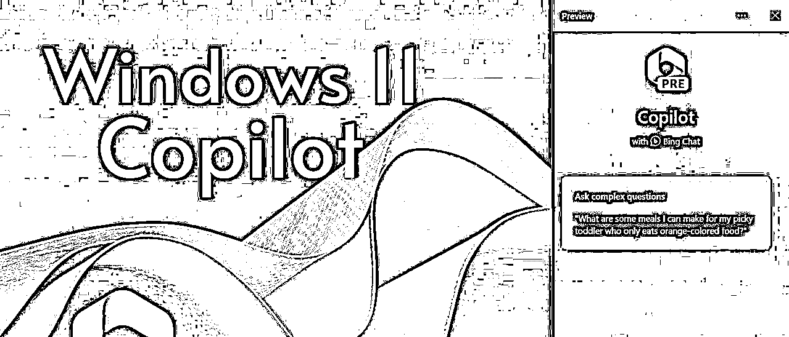

下面，小编就将详细的注册、安装的详细流程送给大家。

划重点：要想在这次开发者预览版中使用Copilot，需要同时满足以下条件

一是在开发者通道安装Windows 11 Build 23493或更高版本；

二是安装Microsoft Edge 115.0.1901.150或更高版本。

区域改成美国

首先，我们先将Windows区域改成美丽国。

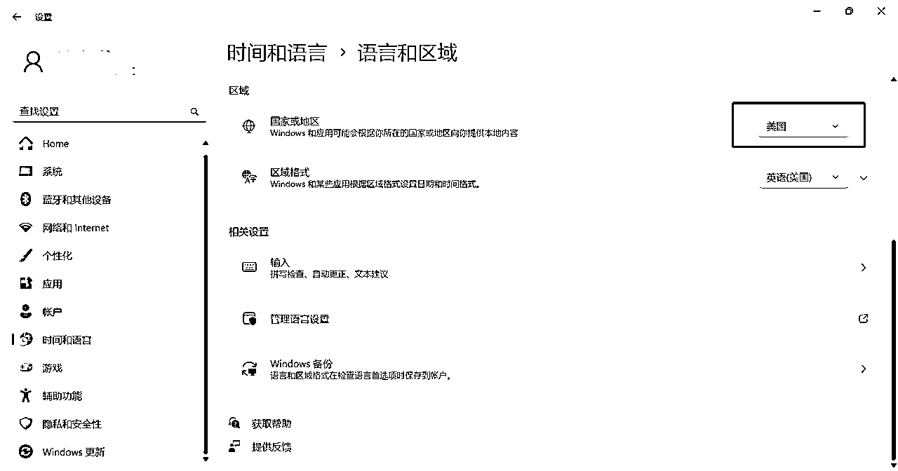

下载安装Windows 11 Inderside Preview 23493或更高版本更新文件

百度搜索windowsinsider，然后点击“Preview Windows now”，之后根据提示关联微软账号，成功后会提示“open settings”，进入windows 设置选项。

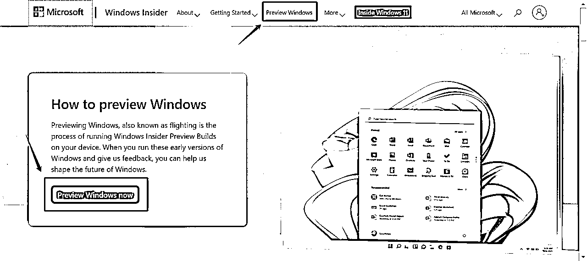

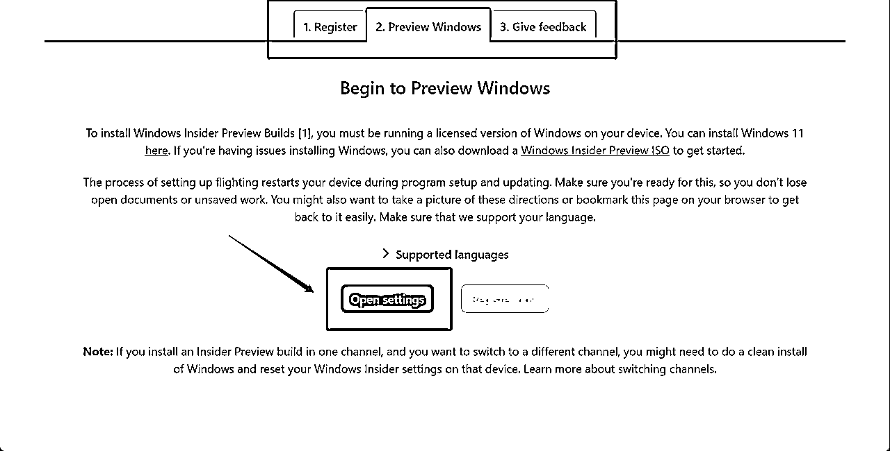

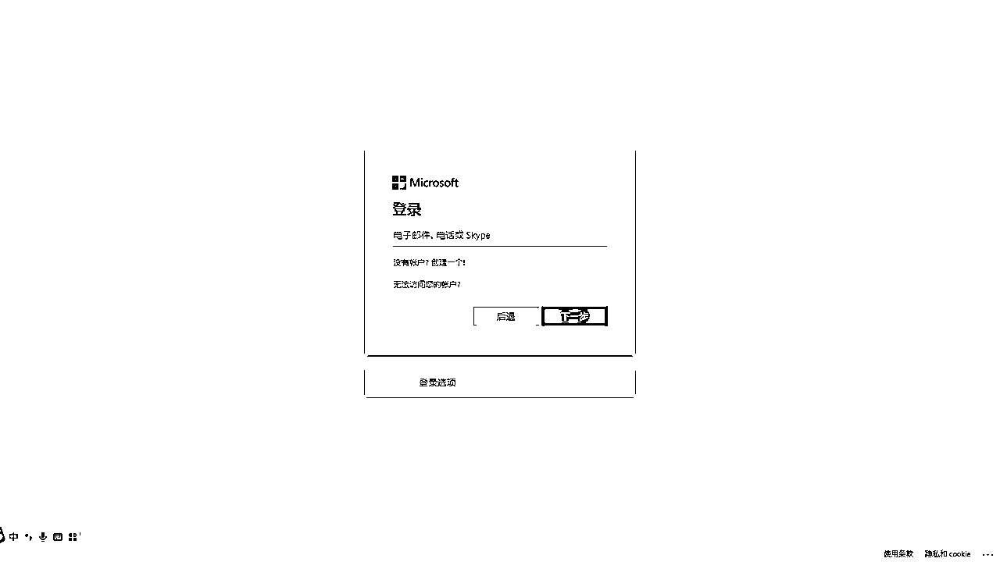

选择“即刻体验”Windows预览体验计划

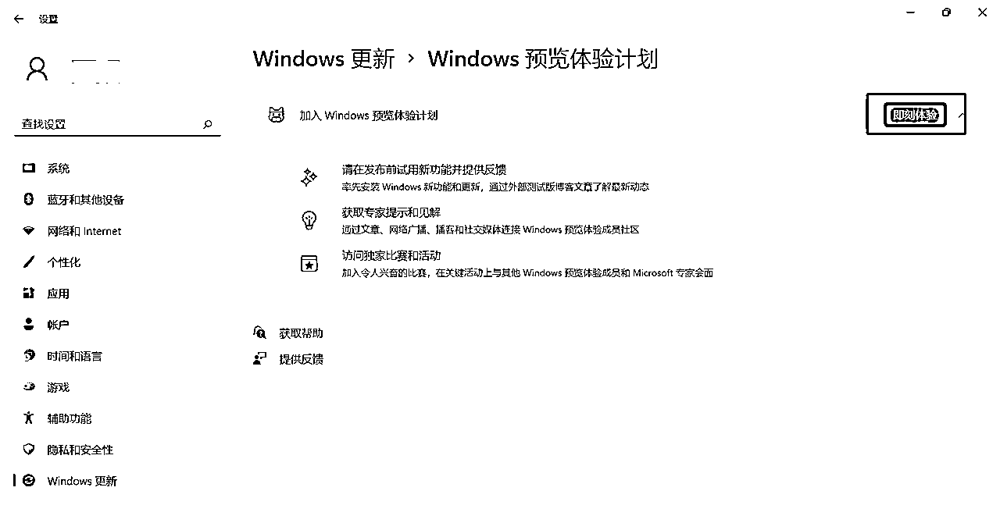

选择“开发人员频道”

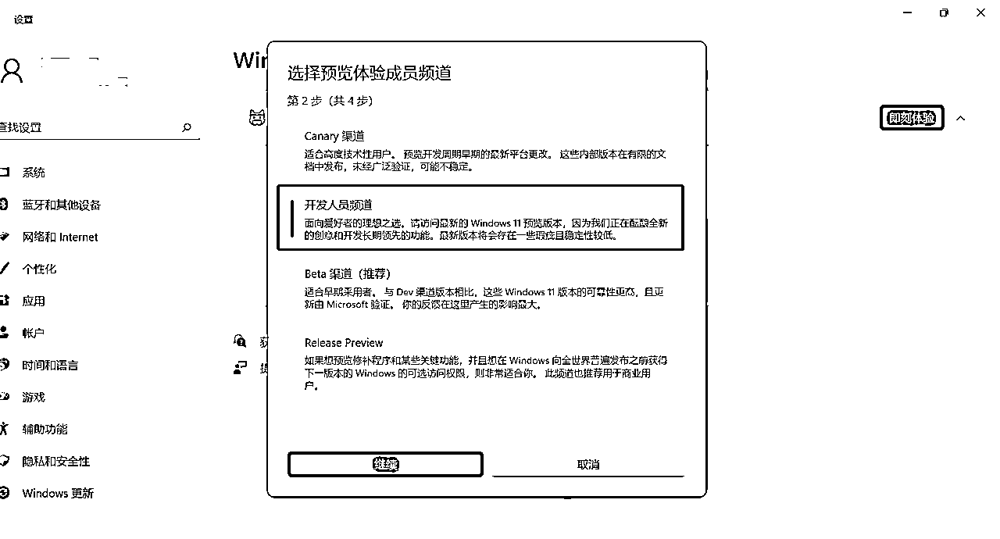

下载安装Windows 11 Insider Preview 23493更新文件。

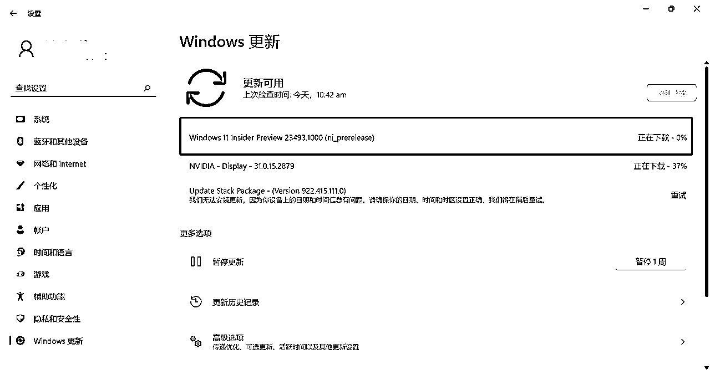

下载安装Microsoft Edge 115.0.1901.150版本

打开Edge浏览器，在设置--关于Microsoft Edge选项中更新Edge，默认会更新到最新版本。

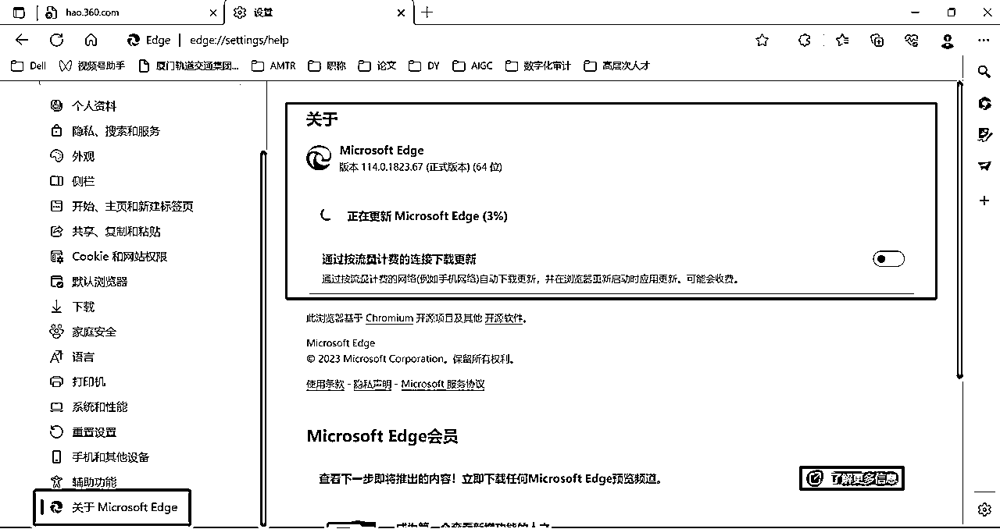

更新到Microsoft Edge 115.0.1901.150版本，可以看到Edge图标上带有“BETA”标识

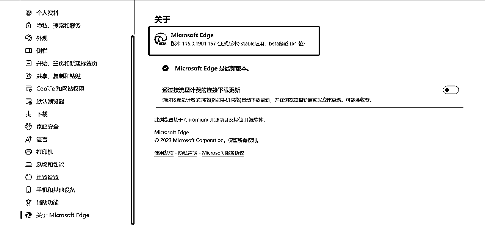

启用Windows Copilot

上述两个步骤是启用Windows Copilot的前提条件，但因为Copilot尚处于A/B Test阶段，并未开放给所有用户。如果你完成了上述步骤仍未看到Windows Copilot图标，那么再安装ViVeTool工具强制开启Windows Copilot功能就可以啦。

首先前往https://github.com/thebookisclosed/ViVe/releases下载最新版本的 ViVeTool。

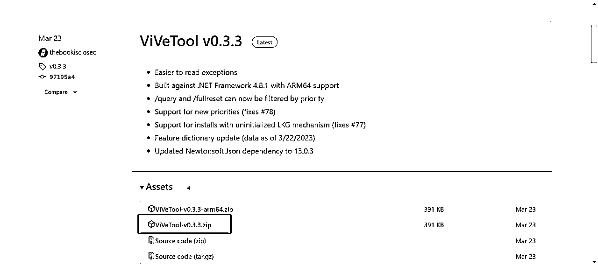

解压缩后复制文件夹地址

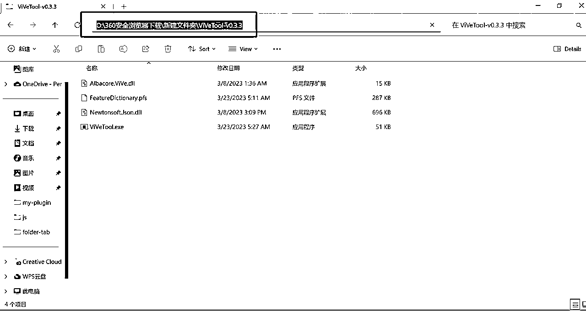

在开始界面搜索“terminal”，右键“以管理员身份运行”

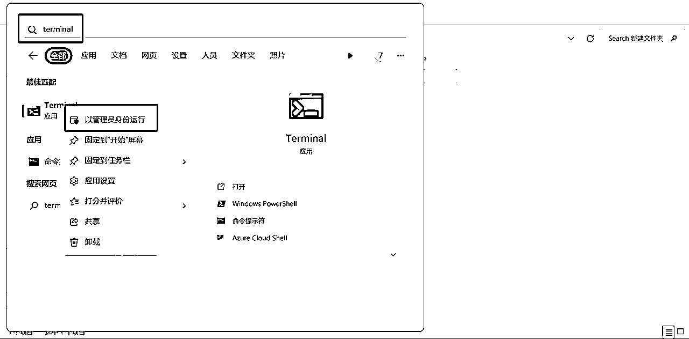

通过CD命令打开文件所在地址，然后运行以下命令

.\vivetool /enable /id:44774629,44850061,44776738,42105254,41655236

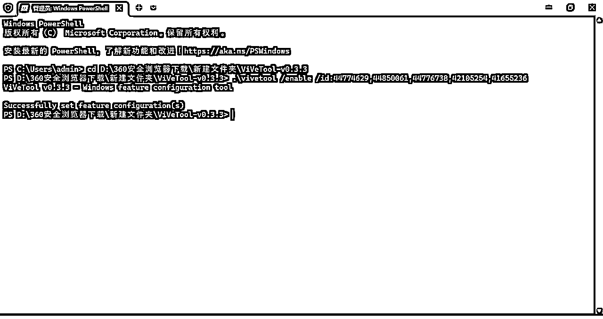

重启电脑之后就会惊喜的发现电脑任务栏多了Copilot的图标！

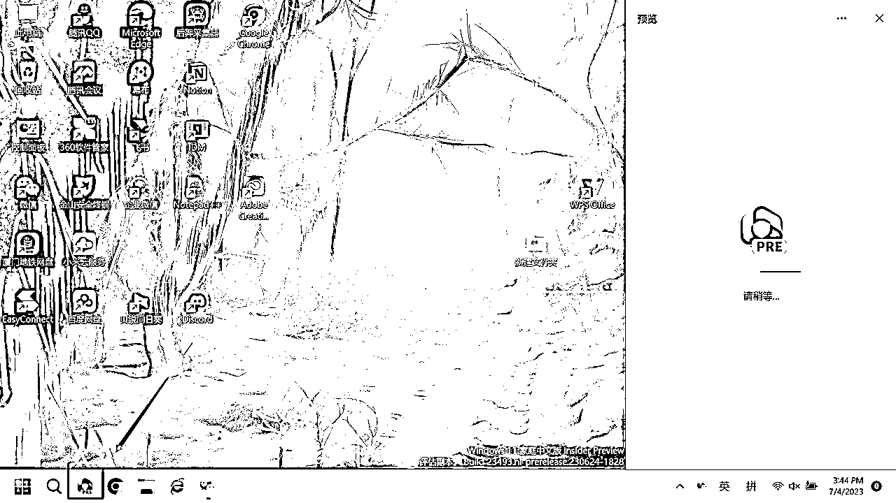

至此，我们便可以愉快地跟Bing聊天啦！网页版有的，桌面版也都有！

对了，使用快捷键【WIN+C】可以快速打开和关闭Copilot！

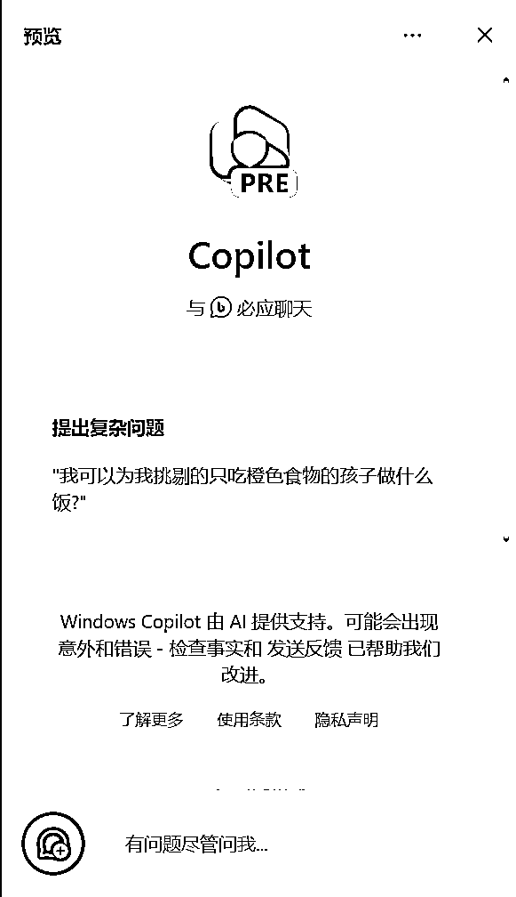

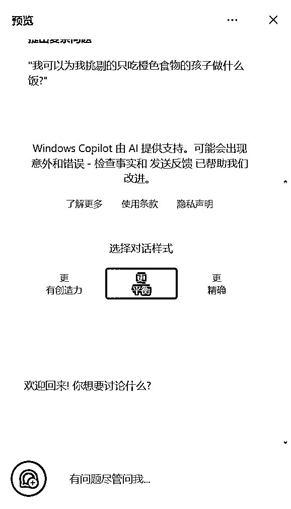

通过文生图生成一张“车水马龙”图片看看效果，还不错！

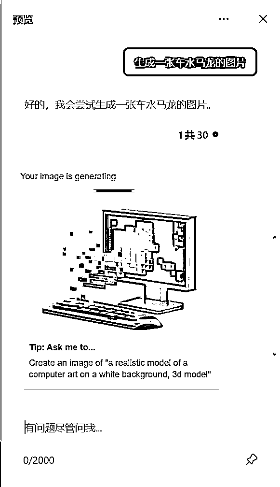

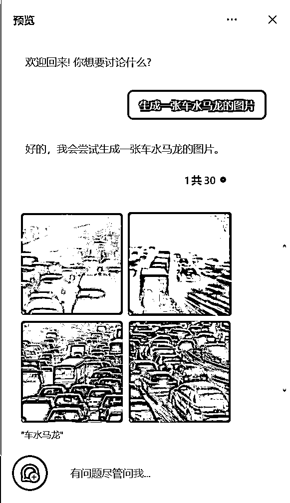