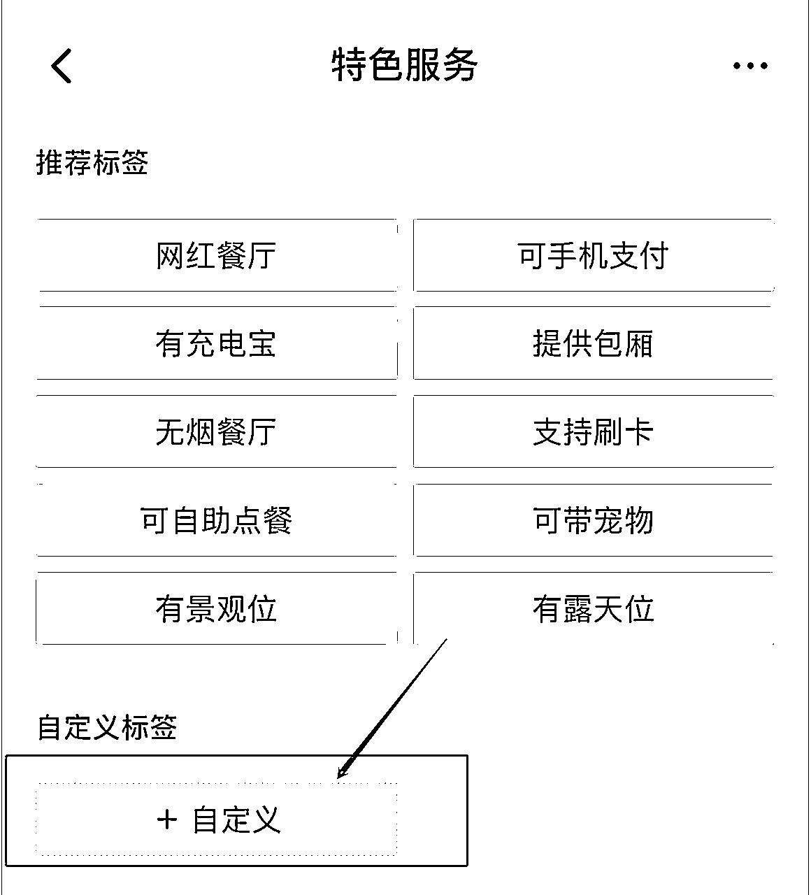

# 免费0粉无限抖音蓝V账号认证教程

> 来源：[https://gzwzdskj.feishu.cn/docx/ESQTd98WVoQEVNx0ssCco3Pcnee](https://gzwzdskj.feishu.cn/docx/ESQTd98WVoQEVNx0ssCco3Pcnee)

# 一：蓝V介绍

这里无限认证是你有需要认证资料的前提下的无限认证，比如认证的主体，方法只是告诉你，如何解决快速认证，无法跳开官方需求，0粉丝认证，认证中出现不懂的情况，联系微信338233，解决你遇到的问题。

## （一）：蓝V最近行情

最近操作抖音，想要用到蓝V一些功能，比如自动回复功能，群功能，更主要是企业账号相对一般账号抗封强一点，以前认证一个账号需要600元，免费一段时间了，网传到6月底就不免费，不过现在还是免费的，所以搞流量的可以速度准备点企业蓝V账号，后期哪天收费了，还得600元，最近市面上这个玩法教程打包几千元，单个账号包材料280元，不包材料200左右，单价有高有低。

## （二）：认证蓝V好处

1、认证外显标识

在抖音上一共有两种加V方式，一种是黄V(针对个人、名人);另外一种是蓝V(针对企业)。抖音蓝v是什么？通过企业号认证，即可获得权威认证标识、营销工具、数据监测、粉丝管理等多项权益。

黄V认证设计的东西比较多，并不是每个人都可以申请的，但是蓝V只要我们达到要求都是可以认证的。

企业头像右下方会出现蓝√标志，及认证信息，彰显官方权威性。

蓝√标识及认证信息，在企业号认证审核通过后自动生效。蓝√标识将出现在以下五个场景：① 个人主页② 搜索页③ 粉丝列表页④ 关注列表页⑤ 私信页⑥ 名片转发2、视频内容置顶企业号可设置 3 个置顶视频，优先展示企业最想展示的内容，使高效宣传更到位。

温馨提示：一个账号最多可设置 3 个置顶视频。置顶视频也可以按上述方法取消置顶。3、 官网链接

企业号可在主页设置外链跳转按钮，可跳转企业官网或今日头条移动建站体系创建的 H5 页面，为目标用户提供更多企业介绍，提高品牌对用户认知度。4、视频广告不打压很多企业或者个人都想通过抖音来引流，把自己的产品卖的更好，但是普通抖音用户却不能够发广告内容，稍不注意违规，几万几十万粉丝一夜之间变成0000，开通企业蓝V后不仅可对店铺产品做广告宣传，还可更精准引流转化。

5 、一分钟长视频

普通用户在条件不足时只有15秒视频权限，开通企业号后，发布视频的最大时长也由原先的 15 秒升级为 1 分钟，您可以自由控制您的视频时长，企业号因此可以获得更多内容的宣传与推广。

注意：您可以拍摄最长时长为一分钟的视频，请确保您的视频配乐也有相应时长。

6、 私信管理

私信管理能提高企业与粉丝的沟通效率，减轻企业号运营工作量。企业运营人员可通过 PC端直接回复抖音私信，减少运营工作量。企业号的用户可通过自助查询，确保用户获得实时反馈，避免因回复不及时造成的用户流失。

用户第一次向企业号发送私信时，企业号回复的内容。关键词自动回复由企业号自行设置关键词，用户私信涉及关键词时，将自动触发回复。回复内容由企业号自定义编辑，字数上限300 字，支持输入图片。

7、 POI 地址认领

企业号可以认领 POI 地址，认领成功后，在 POI 地址页，将展示对应企业号、及店铺基本信息，支持电话呼出，为企业提供信息曝光及流量转化。

8、DOU+

DOU+是一款针对抖音企业号的的内容加热工具，可将视频推荐给更多兴趣用户，提升视频的播放量和互动量，帮助企业更好地进行内容运营和品牌建设。

9、昵称锁定保护

企业号之间昵称不允许重名，保护企业合法权益，体现商业价值。企业号昵称采取先到先得的原则。

10、数据分析

企业号数据分析帮助企业全面了解企业号运营状况，数据分析包括核心运营数据、主页数据、视频互动数据等，科学分析评估账号价值、传播效果、互动效果。

11、 评论管理

企业号发布视频后，可以在 PC 端对视频评论进行管理，也可设置某条评论为置顶评论，该评论将保持在评论最上方显示。用户互动、舆论管理更高效、更便捷。

12、 电话拨打组件

企业号可在企业主页添加电话拨打组件，用户在企业主页可一键拨打，实现流量转化。

13、 用户管理

企业号可在 MP 后台进行用户管理，当前支持企业对有过私信沟通的用户进行管理和标注，便于企业自建 CRM，对目标用户进行分层细化营销。此内容不会展示在 APP 中，前端展示无变化。

温馨提示：每个用户最多可添加 5 个标签。您可以在上方时间栏、状态栏、地区栏进行用户检索，或输入用户抖音号或联系方式精准检索。

14、店铺主页领券

商家可以在自己的主页设置卡券了，用户领券后便可到店直接消费。优惠券可是商家流量转化必不可少的一步。

以上就是抖音蓝v认证是什么样的?抖音蓝V认证后有什么好处?关于抖音蓝V如何认证，提高通过率 的解答更多微抖音官方服务商。

## （三）：蓝V认证数量

一个主体可以认证两个蓝V，个体，公司都一样，认证账号按主体算，所以一个法人旗下是可以认证多个账号的，只需要有多个营业执照即可，认证一些特殊名字，比如人名，需要提供名字授权，或者是上商标授权，比如郭耀天这个名字认证就无法通过，最后提交了商标才可以通过，遇到一些想要的名字，想要拿到，可以先投诉把账号的昵称清除，你再去认证即可，不过有的名字有商标也无法认证，提示名字无法用。

## （四）：认证常见问题

没实名账号账号也可以认证蓝V，有时候认证时候会出现冻结账号，登录验证即可，特别是账号是找人代认证，登录地址异常的时候，最容易出冻结，需要跳实名的情况，所以有资料懂方法，最好是自己认证，有的账号如果没有做起来，账号就直接不实名了。

# 二：认证准备

## （一）：官方要求

点亮蓝V官方要求是必须升级到企业号，最少也配置两个商家模块，粉丝达到500，后面方法是告诉大家0粉丝也能开通点亮蓝V，人人都可以做的方法。

## （二）：注册账号

先按要求注册一个抖音账号，注册号账号后可以先完善信息，绑定电话，跟着教程即可开通认证

## （三）：准备认证资料

### a：准备营业执照，对公还需要对公账号，认证公函

### b：主体法人身份证正反面

### C:一些特定的名字还需要拿到授权

### d：一些名字需要准备商标证

### e：法人能人脸识别

# 三：开通企业账号

普通抖音账号，手机打开抖音右上角设置，点击进入企业服务中心，点击全部

找到企业号，点击升级企业账号，也可以打开电脑端 https://renzheng.douyin.com/ 点击立即认证，手机点击确认就会进入开通企业号流程，跟着需求提交资料即可开通企业号。

# 四：点亮蓝V

## （一）：认证流程

开通企业号的抖音，进入抖音右上角，点击企业服务中心，点击昵称下面的点亮蓝V

即可进入蓝V认证页面，这是刚注册抖音号，一个粉丝都没有，需要满足500粉丝才能认证，其实是有方法的，0粉丝也可以认证，下面的会继续分享。

## （二）配置商家模板，公开展示

点击不满足，会进入商家模板页面，商家模板总的有官网主页，店铺活动，服务产品，在线预约，特色服务，线下门店，优惠卷，团队成员，优惠团购，官方相册，如果是正规的商家，能整理都全部整理上去，是一个曝光的机会，如果只是想点亮蓝V账号的，就只需要满足其中的两个展示就可以，测试下来，在线预约，服务产品，企业相册是最最容易审核通过的。

### a：在线预约

点击进入编辑，随便上传一张图片，编辑信息，三个信息可以填在线预约1,2,3，提交秒审核

### b：服务产品

根据营业执照范围写一些服务即可，可以直接使用推荐标签，比如是科技工作室，选择是自定义设置的服务产品

下面是我们认证一个网络工作室的参考，也可以随便下

### c：官方相册

网上或者拍一点办公的照片，一张就可以，审核通过就可以，这里需要注意是，图片的高度低于2048，在267*180之上，不然需要修改图片才能上传，这个地方需要注意下，太大的图片借助美图秀秀处理下即可。

有两个模板审核通过后，点击模块顶部开启展示

## （三）：无限涨粉500以上

我看了网上很多教程，告诉怎么认证的教程，都没有告诉怎么涨粉，有人说是花钱投放涨粉，有人说做内容涨粉，其实0粉丝就可以开通，这个可能是对于很多普通人最难搞定的一个环境，所以这个玩法可以线下操作，帮助别人开通企业蓝，网上大部分也是借助这个点引流，很多不懂的就联系怎么开通。

其实这里用到一个就是粉丝同步功能，需要一个500粉以上的头条号，能满足条件的很多，头条账号可以无限解绑，无限的辅助认证，没有满足账号的伙伴，注册一个头条号，找个渠道刷500粉上去即可，抖音与头条号不限制账号，不是同一人都可以，随便换绑，只是操作的时候为了别人不知道你是这样操作的，需要注意一些细节。

首先把满足500粉丝以上的账号登录到手机或者是平板上，同时在这个设备上登录抖音账号，如果不是同时在一个设备上，同步时候还需要验证，别人估计就知道你的操作了，比如我们是给别人开通企业蓝v，这个时候我们就打开抖音登录的账号，选择电话，密码，或者是扫描登录，一般选择是扫描登录。

如果是自己认证，怕跳实名，直接在登录抖音手机设备上，下载头头号，把有500粉丝以上头条号，绑定上去再点击同步就可以，我的账号刚注册是0粉丝账号，登录账号上以后。

打开抖音右上角，找到设置，点击账号与安全，找到第三方账号绑定，现在今日头条/西瓜视频

点击后，点击绑定，这个时候就会跳到进入头条，点击授权，这个时候可以把同步公开信息这个取消，只选择同步粉丝，这样操作目的就是别人不知道你是怎么操作的，如果不一直盯着你的账号看。

绑定后，会看下面勾选了同步粉丝数量，这个也必须勾选，如果同步时候取消了，这里都必须加上，这个时候我们再去打开，点亮满足条件，发现全部满足了，这个时候我们提交营业执照即可搞定认证了。

## （四）填写资料

全部要求满足，点击限时免费审核，提交认证信息，这里想要注意几个细节，用户名称，如果你提交的名字无法通过，会电话联系你，告诉你可以使用主体信息作为昵称，如果你不答应，会让你提交一些商标，授权书就会认证你的名字。就算认证成功的账号，后期名字也是可以手动修改的，一个月可以修改四次的名字。

认证信息这里，是可以修改的，默认是主体昵称，其实可以修改成其他的名字，简称加上官方账号，这样别人就不知道你是哪个主体认证的，其他资质这里，如果一些名字你觉得无法认证的时候，比如人名，一些有商标，有授权的名字，这个地方就可以提交商标的，或者是授权的文档，等待审核。

提交后，等待审核就可以，上班期间最快几分钟，其他时间稍微慢一点，认证过程中有问题都会提示你修改的，随时注意后台的认证的反馈，需要补充的内容。

# 五：取消蓝V认证

认证了，到期认证就会取消，有时候运营需要，没有到期就想取消认证，其实也是可以操作的，市面上取消一个账号认证，收费300到500不等，所以取消也是可以操作的玩法，不过取消的很少。

网上找了一份，比较详细的，跟着操作即可

取消蓝V认证教程

我是郭耀天，微信338233