# 《小红书商单&多多视频V计划》保姆级教程

> 来源：[https://gwq4c5gvtwq.feishu.cn/docx/FMpwd5WxMob6ZbxXV21cvgAYnpd](https://gwq4c5gvtwq.feishu.cn/docx/FMpwd5WxMob6ZbxXV21cvgAYnpd)

哈咯，大家好，我是波光，对，那个虽然肚子很大，但是四肢很短的矮胖子，两个月前我第一次在生财做分享，并有幸拿到的精华，这里再次感谢驴哥，木子田，小毛老师。

今天跟大家分享的主题是，小红书商单和多多视频V计划，在这里感谢@柯总，@驴哥，@小毛老师帮我修改文章，其实今年5月份我们就开始测试了，当时鱼丸小姐姐还在期待我的这次分享，所以我是把全流程跑通了，才敢拿过来分享。

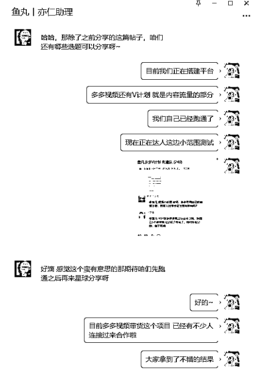

今天我会从小红书商单和多多视频V计划，两个项目之间的逻辑关系，以及具体操作给大家分享一下。

在此之前，先跟各位交代一下，最近的成果。（图片有很多，只放了部分）

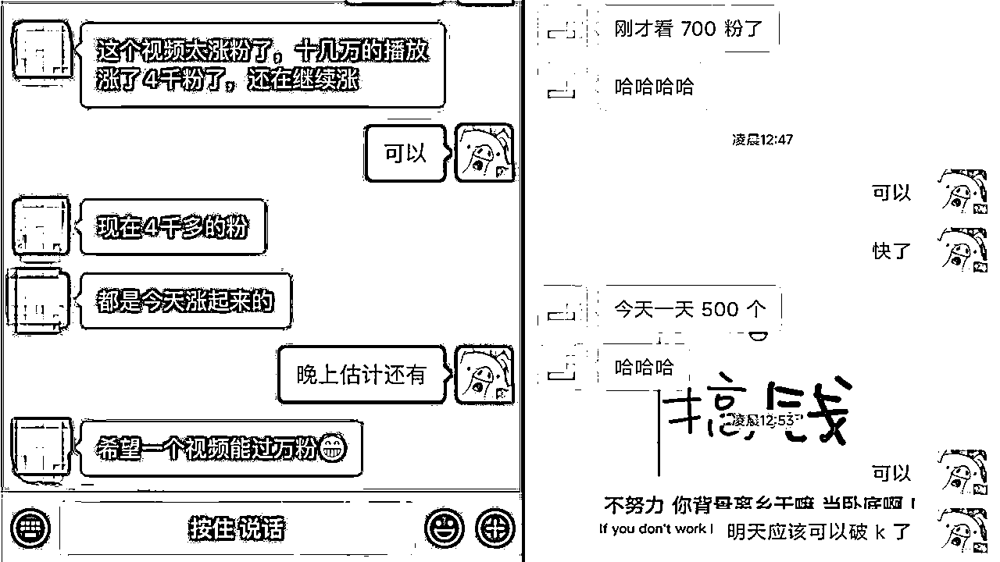

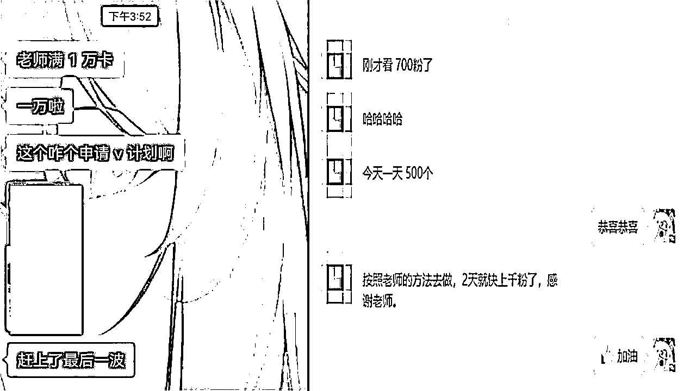

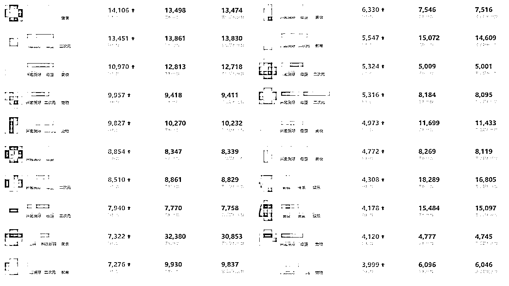

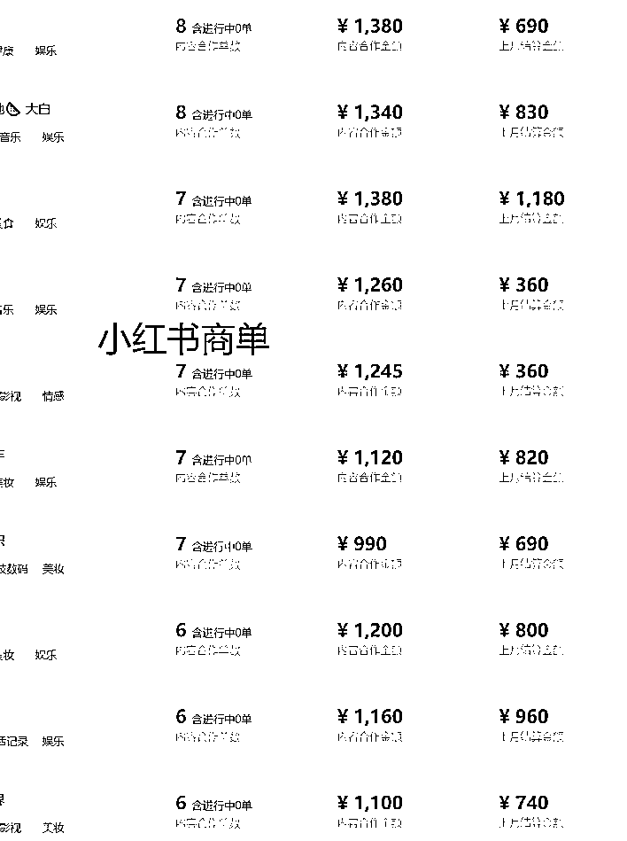

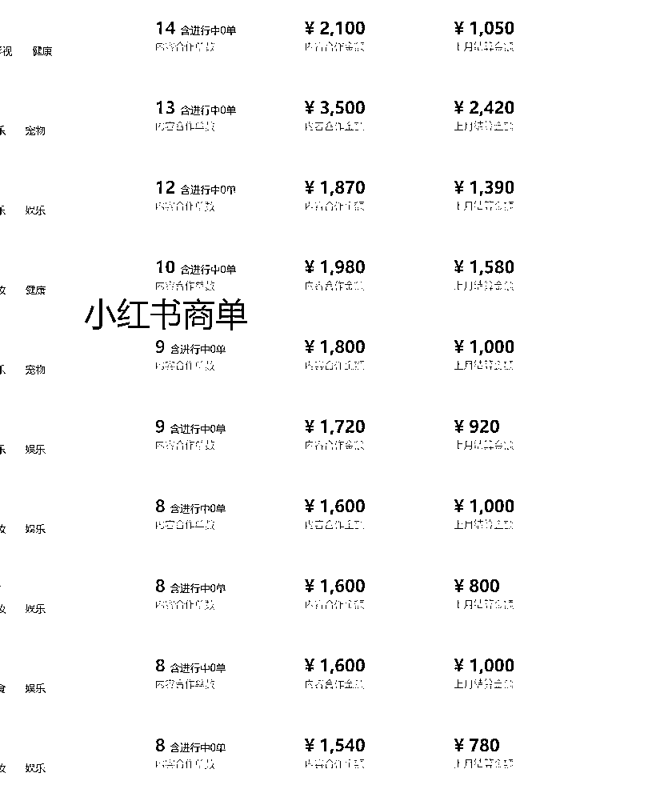

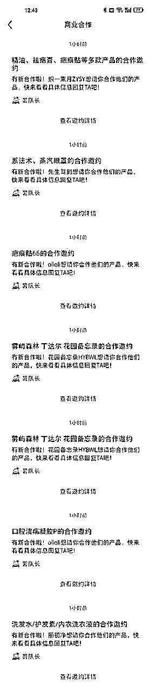

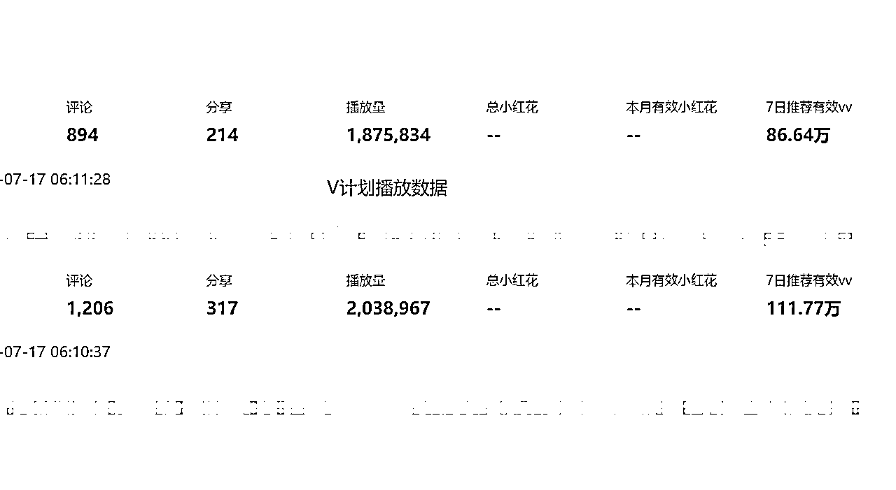

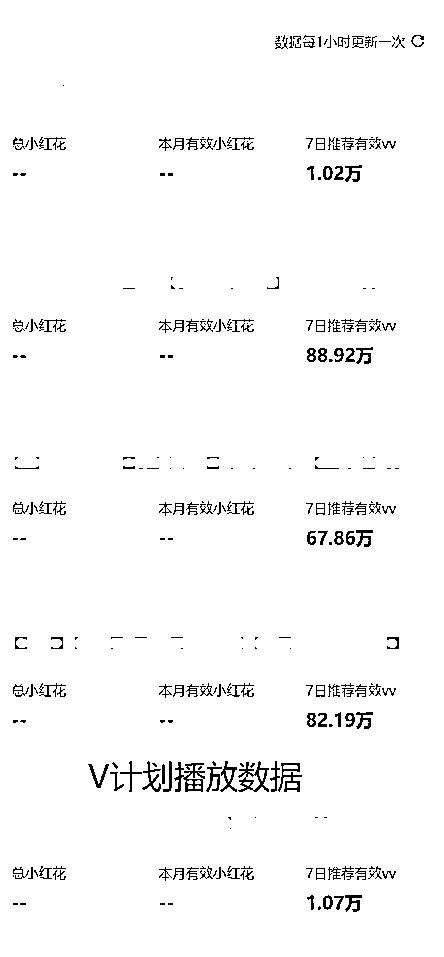

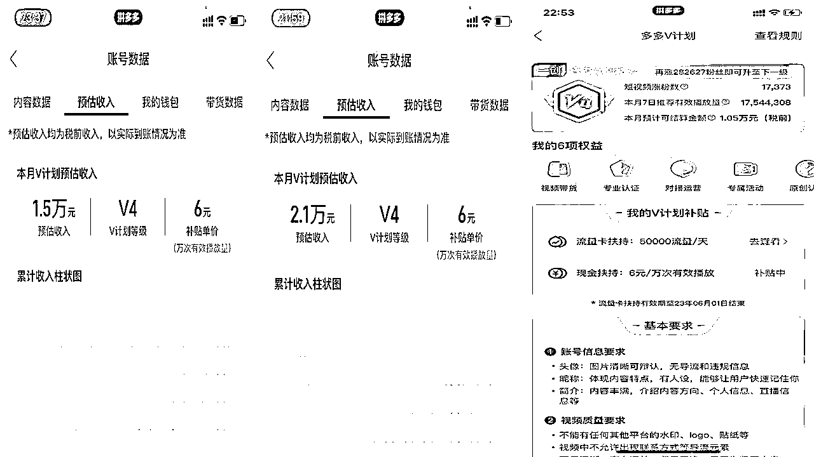

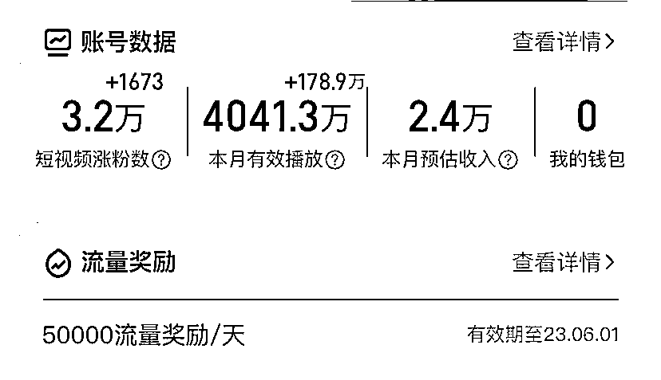

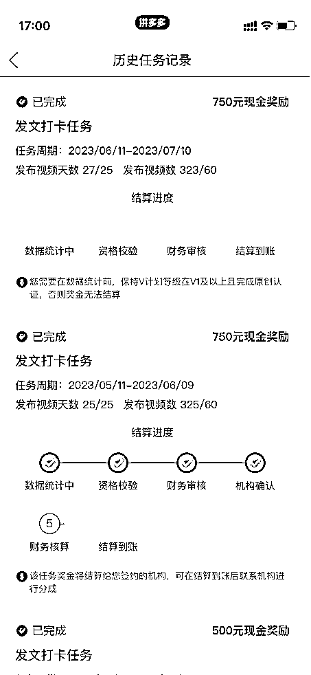

# 项目介绍

这里我就简单快速的介绍一下两个项目，

小红书商单：通过快速起号，涨粉到1000，然后开通蒲公英，接品牌的广告单，千粉广告单单价在150-180 左右。随着粉丝量增高，客单价也会增高。

多多视频V计划：类似抖音中视频，按照有效播放结算收益，可以站内起号，也可以站外认证，抖音快手10万粉，或小红书5万粉。每个月有300-750的保底收益。

V计划分为5个等级V1——V5，还分为原创和二创，一般站外认证过来的，基本都是V4，V4的一创，万次有效播放6元，二创3元。

两个项目的结合逻辑就是，带着学员在小红书起号，做到5万粉丝，然后去认证多多V计划。 项目的核心打法就是小红书快速起号，到了V计划，我们只是把发在小红书的视频，首发在多多视频，所以今天的分享，重点是跟大家分享，怎么在小红书快速起号。

# 一、准备工作篇

## 1、【流量趋势】认识⼩红书

我们都知道⼩红书这个内容社区平台，主打的内容种草以及可怕的⽤⼾消费转化率，使得平台成为各

类品牌商家营销的重点，在各种内容包装下的软⼴，使⼩红书内容社区⽣态变差，严重伤害了⽤⼾体验。

⼩红书这个平台，我们可以理解成⼀个为⽤⼾提供消费决策的平台，⽬前⼩红书⽉活也有超1.3亿的⽤

⼾，其中86%以上都是⼀⼆线城市的⼥性，⽆论是⽤⼾的精准度、消费能⼒与消费欲望，⽬前没有哪⼀个平台的⽤⼾群体的垂直度和⽤⼾质量能与之相提并论。

## 2、什么是⼩红书号？

1、账号类型分两种

①专业号

②个⼈号

专业号是由⼤中⼩商家or品牌⾝份的企业认证，例如：咖啡店、⽔果店、图书店、美妆品牌、服装品牌等

申请专业号成功后，可以获得专属⾝份标识、强⼤的运营能⼒、⾼效的营销⼯具等各种商业化加成。

个⼈号是个⼈注册，没有⾝份认证，但账号权益保持不变。

# 短视频时代 能创作内容才是王道

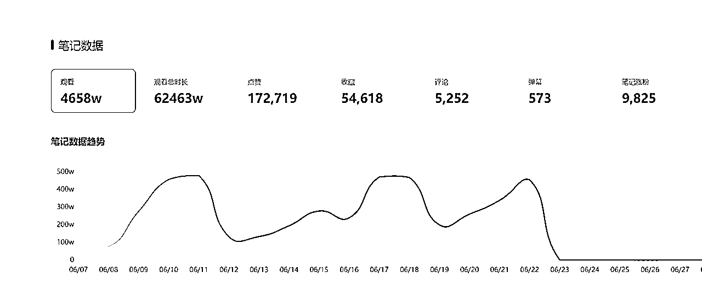

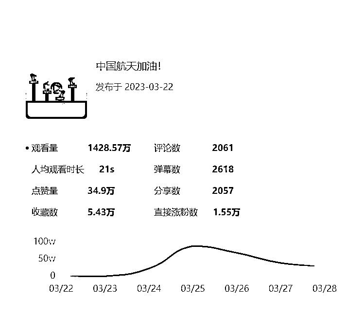

# 内容思维蝴蝶效应：

# 一个爆款带来其他视频快速增长的连锁反应

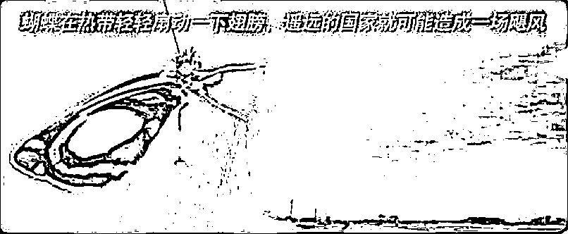

### 每一个视频都要往爆款的目标去做

# 优质创作者五大思维：导演思维、编剧思维、后期思维、美术思维、素材查找能力

# 二、项目实操篇

## 1、快速养号

于小红书而言养号绝对不能轻视，小红书在公域平台中算的上是很严格的，所以不要拿做其他平台的思维来做小红书，那样只会酿成很大的隐患。

1.养三天

2.前两天每天刷一个小时的同行领域视频（点赞，评论，收藏，关注比例：10：3：5：3）

3.养号没有一个标准性但是有判断根据（进入编辑资料往下滑看账号等级，如果按照一级完成任务依然升级不到薯北鼻那就是账号没养好或者天残号，这样的号不可能有流量）

4.第三天，开始改简介,名字，性别，头像，地区，背景图

5.⼀部⼿机，必须是⼀机⼀号，不能⼀个⼿机登录多个账号，频繁切换，⼩红书平台是可以识

别⼿机的 串码的，⼀个账号会⾃动绑定⼿机串码，如果多个账号在这个⼿机上登录，是很 容易被视为营销号， 从⽽会限制流量，尤其是这个⽤这个⼿机运营的账号出现过违规，或者封号的历史，那你再⽤这个⼿机100%都会中招！

我们做⼩红书的账号，切记不要连接 wifi，特别是我们多账号运营的时候，如果都⽤WIFI 的流量，那就会出现前⾯说的限流的情况，也是会被判定为营销号。

讲解起号方式前我先说一下账号的要求：

1.1000粉丝

2.每篇笔记播放量破2000

3.账号没有限流以及掉专业号

接下来讲一讲起号方式，方式很多，根据自己的时间以及合适程度来操作

关于起号的技巧，希望大家平时自己也可以多多钻研

### 第一种：动漫+影视搬运号（较推荐动漫）

怎么寻找素材（抖音）：

1.原创100w粉丝以下的博主

2.无水印，同行没有搬运

3.确定博主在小红书没有账号（但是不能用博主的专属名字或者头像）

4.有一些水印很淡要看仔细点

5.当前视频高于账号平均数据

6.续集或者去头去尾的

怎么获取更多同领域的博主（抖音）：

从关注博主页面，推荐博主进行筛选

怎么去重（剪映）：

1.空镜头——覆盖视频画面，不透明度10——声音关闭

2.滤镜——清晰度滤镜程度70-100

3.扫光素材——选择9：16，不透明度10——如果要用16：9的注意结尾有抖音水印——声音关闭

4.原视频——b变速1.1+声音变调

5.BGM——随便选择一个BGM轨道覆盖整个原视频——声音关掉

每天发布频率：1000粉丝之前3-5条

1000粉丝后1-2条

发布时间：中午12点，下午5-8点

演示视频（无声版）：

### 第二种：游戏号（推荐）

选素材标准：高清晰度，高识别度、易复制、有梗

高清晰度：指视频的观看度，这是可以直观感受出来的，我们的插件在去视频水印的时候，是不会改变视频的清晰度的，所以一句话就是我们直接找的视频就需要是高清晰度的

高识别度：我们找的视频尽量具有特点，比如，你找的视频的博主声音很有辨识度，那你就确定找他，但是你要考虑他的粉丝量是不是在一个比较合适的水平，一般5w到20w的博主在我们的考量范围之内，你找大的博主的效果那肯定没有小的高质量的博主好，换句话说，你觉得他有潜力，那你就在小红书开个小号帮他推广推广，这并没有什么不道德的。

易复制：很简单，就是有的博主的视频的话，他经过了个人的剪辑，将水印改成了一整个视频中都会上下飘动的，这种的话我们的软件是没法处理的，要处理就得比较麻烦，所以我们不考虑这些视频。还有的情况的话比较特殊，他在里面的暴露了个人的id或者是带有自己剪辑进去的属于自己的情况的元素，这种情况的话其实是可以解决的，就是我们在设置小红书个人的id的时候，我们就和他改一个大差不差的id，打造成他来小红书开小号的情况就行了。例如：原博主id--->蛋仔狼宝 我们改个蛋仔狼崽

有梗：其实这个的话，也不必太强求，有的视频发着发着里面一个很简单的梗就爆了，我大号的话，发了一个已经爆了的蛋仔视频的对面视角，小号的话发了一个打游戏的时候vx外面弹窗说分手，这两个梗的效果都是出其不意的好。但是再此之前我可能就都没看完视频就搬运了，有时间的话可以精挑细选一下，但是上面的三个点是比较重要的，这个点的话其实也不用太强求。

怎么去重（剪映）：

1.空镜头——覆盖视频画面，不透明度10——声音关闭

2.滤镜——清晰度滤镜程度70-100

3.扫光素材——选择9：16，不透明度10——如果要用16：9的注意结尾有抖音水印——声音关闭

4.原视频——b变速1.1+声音变调

5.BGM——随便选择一个BGM轨道覆盖整个原视频——声音关掉

推荐的游戏类型：蛋仔派对，我的世界，迷你世界等等）

### 第三种：漫画图文号（较推荐）

这个方法相对于前面的难度就会上升一部分，因为能保证原创度，也能保证流量的持续增长。上手后的时间成本也只有10-30分钟，废话不多说直接上教程👇

1.下载podo漫画，酷爱漫画，动漫之家

2.选择一篇符合18岁左右女性爱看的漫画（例如：言情，偶像，虐的剧情）

3.图片来源：选择漫画中的3-5张吸睛，猎奇的图片

4.标题：漫画名字下有简短的一句话概括

5.文案：漫画的作品信息中有漫画简介

6.发布：发布的时候记得加一些滤镜+特效/温柔的BGM+文案中加一些小红书自带的表情，发布时间和之前的一样

7.对标账号：933076827

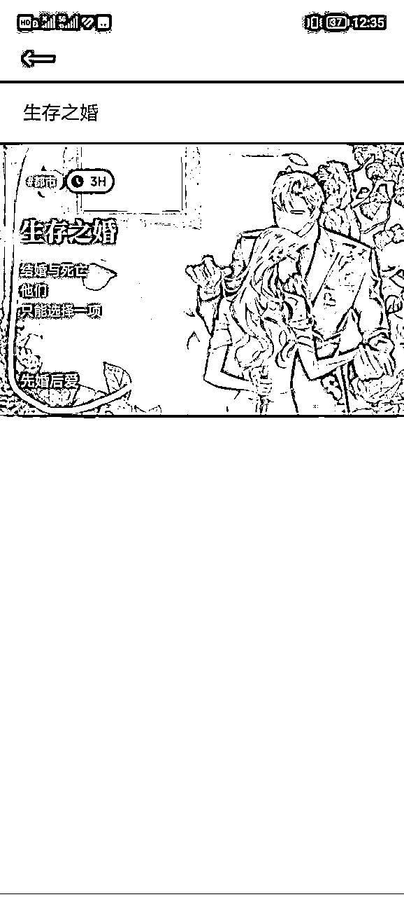

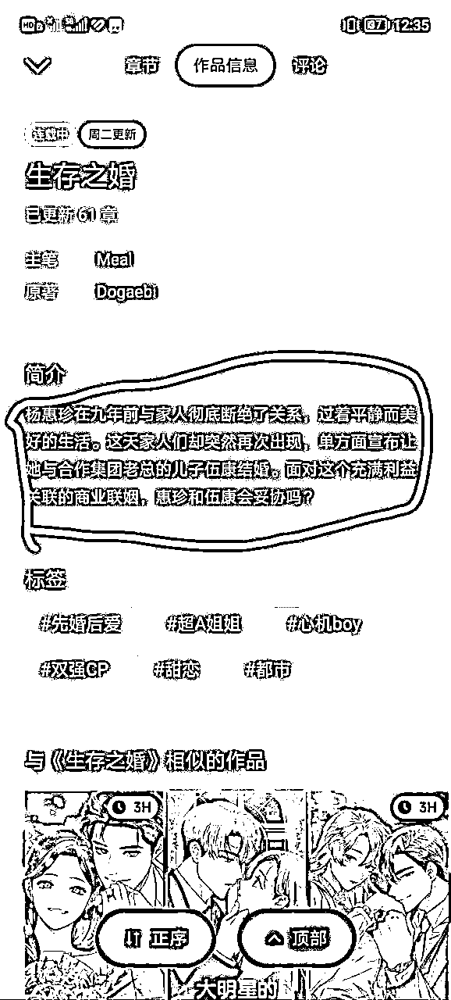

### 第四种：娱乐综艺号（较推荐，但注意违规）

这个方法与影视的可以说是大同小异，选视频的逻辑都是一样的，这里大的框架就不说了，但是这个谁用谁都说好直接进入实操的细节👇

先说说什么类型（明星综艺+新闻八卦）

选对标的关键词：明星综艺+明星娱乐+综艺八卦+综艺吃瓜

怎么获取更多同领域的博主（抖音）：

从关注博主页面，推荐博主进行筛选

怎么去重：

1.空镜头——覆盖视频画面，不透明度10——声音关闭

2.滤镜——清晰度滤镜程度70-100

3.扫光素材——选择9：16，不透明度10——如果要用16：9的注意结尾有抖音水印——声音关闭

4.原视频——b变速1.1+声音变调

5.BGM——随便选择一个BGM轨道覆盖整个原视频——声音关掉

6.加背景图——背景图单独加入特效（类似星星，烟火这一块类的）

7.9：16的长屏需要截掉上下，16：9不用管

8.结尾有logo图标的记得删除

对标账号：4297497929，6165667428

### 第五种：盘点类（超级推荐，相对于制作时间较长）

逻辑/原理：盘点类的视频都是由多个片段建设而成，没有上下关联的属性，那我们就可以用调换顺序以及改编开头序言的方式做到高原创搬运视频

准备工作：

1.选择盘点素材（可以包括动物科普+搞笑梗+迷惑行为等等）

2.通过百度/快手/抖音/红薯寻找当前视频的关键词背景图

剪辑操作：

① 导入背景图放主轨道

② 在背景图选择特效（类似落叶，星星这一类的）

③ 导入找到的视频素材放在主轨道上一层

④ 将视频每一个片段切割分段

⑤ 将视频+音频顺序调换1换3 2换1 3换4 4换2（自己调换）

⑥ 换开头序言，因为一般这类视频开头都会有一些混剪视频片段，选择素材库在里面搜索关键词找到合适的加入

⑦ 封面选择背景图，背景图上写上标题

⑧ 原视频写上标题+1/2

⑨ 注意：这类视频一般比较长，建议分两段发布，第一可以提升原创度，第二分两段涨粉好

⑩ 注意：记得把视频调为9:16的

对标账号：1580172441

# 【推荐算法】⼩红书流量分配机制与推荐算法

⼩红书和抖⾳⼀样，都是有⾃⼰的算法的，也就是千⼈千⾯的推荐机制。学习掌握⼩红书的流量分配

机制，有助于我们写出优质的笔记，获得更多的曝光和流量。

⾸先我们来了解⼩红书的流量的推荐机制，主要从5个⽅⾯来判断：

⼀、笔记审核机制

⼆、笔记推送机制

三、笔记排名机制

四、笔记权重

五、账号权重

## 1、笔记审核机制

在⽤⼾发布笔记后，会有⼀个 “⿊盒机制” 过程，平台会根据系统的规则，像笔记中出现敏感词、违规词和⼀些低质量图⽚内容进⾏初步审核，如果被检测出违规那么你的笔记直接审核失败，不能被曝光。还有⼀部分内容机器⽆法检测出来，就会被判定疑似违规，再转到⼈⼯审核。

审核不通过的笔记就会被关⼩⿊屋，具体表现为限流。别⼈⽆法在个⼈主⻚展⽰看到你的这篇笔记，

⼩红书群聊分享，微信分享等，可以通过分享笔记到微信看到笔记是否被限流。

⼀般来说，发布笔记初始审核的时间在⼏分钟到⼗⼏分钟，除去笔记发布⾼峰期，如果审核时间较⻓，那可能是在⼈⼯审核的阶段。

## 2、笔记推送机制

在笔记通过审核后，⼩红书还会有⼀个 “AI语义系统识别拆分笔记” 算法，对所发内容进⾏拆分，主要是进⾏内容类型归类，打兴趣标签，关键词收录等然后，你的笔记就会被推送到粉丝⾸⻚和⽤⼾⾸⻚，会根据AI算法的结果先精准推荐⼀部分⼈群（⼤ 约100⼈），如果在初始曝光中获得较好的笔记互动，那么这篇笔记会被推荐给稍⼤的⼈群曝光池，在 更⼤的曝光池获得优秀互动则会继续推荐给更⼤曝光池。

### 1、互动权重公式

CSS=点赞数（1分）+收藏数（1分）+评论数（4分）+关注数（8分）

其实主要就是互动量和转粉率，点赞收藏评论总占⽐6分，关注权重是最⾼的，去到了8分，所以我们在私信和评论，以及个⼈简介中，⼀定要做的动作是什么？就是先引导客⼾关注我们的账号，关注以后我们跟客⼾的私信交流是不受数量限制的，⽽且还能给账号权重加分，给这条笔记加分，⽽这套公式的计算结果会持续不断的影响⾸⻚推荐的次数，所以前100个精准⽤⼾的互动情况⾮常重要，且笔记发布后18-24⼩时之后的互动情况也决定了能不能⾛向更⼤的流量池。

因此，如果条件允许的话，可以⽤不同的ID⼩号，去评论区进⾏互动，⼀定程度上是可以为笔记起到

助推作⽤。

# 三、笔记排名机制

笔记排名就是指搜索关键词后，在搜索结果⻚中显⽰的笔记排序，笔记排名越靠前，⽤⼾点击的可能性也就越⼤。

搜索引擎爬⾏抓取存⼊数据库的过程，⼀般来说笔记审核通过后就会被收录。

## 1、笔记不能被收录原因

账号问题：账号多次违规，整个账号受到了限制，笔记也就不会被收录

搬运问题：笔记被系统检测出来重复率较⾼，⾮原创内容是不受平台⽀持的

⼴告问题：笔记中出现⼤量⼴告营销⽤语，会被识别为推⼴笔记

频繁修改：由于笔记修改后，会再次进⾏审核，⼆次审核很容易掉收录，意思就是你⼆次修改，必须得⽐第⼀次的内容更优秀，如果⼆次优化修改的笔记还不如第⼀次发布的，那就有很⼤概率会限制流量推荐，甚⾄掉收录。⽤⼾搜索关键词/语句后，系统将根据AI语义系统拆分结果进⾏推荐给搜索相关关键词的⽤⼾。

搜索⻚的评分体系不同于推荐⻚，除了互动量和转粉率，还包括：内容相关度、搜索点击率

## 2、如何提升笔记排名？

①提升视频原创度

笔记内容围绕热门事件展开，适当的重复使⽤关键词，关键词的出现次数要结合笔记的视频进⾏调整。

②提⾼笔记质量

优质的内容可以获得⻓期的⻓尾流量，这也是视频数据好的原因。

③提升互动量

⽆论是推荐⻚还是搜索⻚，在评分机制中，互动量起到了关键作⽤。且在搜索⻚中，互动数据好的笔

记会在 “综合” 和 “最热” 中排名靠前。

④在⻩⾦时期发⼒

笔记发布后的18-24⼩时，如果互动量较⾼，则会被判定为优质笔记进⼊更⼤的流量池。

# 四、笔记权重

很多⼈觉得⼩红书的笔记权重像谜⼀样，其实⽆外乎三点：

## 1\. 原创度

原创度低于60%时，不仅会降权，还会被限流。

### 互动率

互动率就是笔记发布后的曝光和互动的⽐值，转发、评论、收藏、点赞，权重关系也依次为关注＞转

发＞评论＞收藏＞点赞。

### 内容标签

内容⼜分为两个⽅⾯，第⼀、关键词标签和整个内容的关联度，如果相关性较⼩，会被认为恶意引流

从⽽降权，第⼆、视频内容表述度，优质原创视频满⾜增加权重的合格条件，结合笔记的互动率。

# 五、账号权重

要想保证笔记被顺利推荐，⾸先，我们得保证账号处在⼀个没被降权的状态下

## 1、以下操作可能会使账号降权

①多个账号⼀个⼿机登陆

②昵称涉嫌⼴告和违规

③个⼈签名设置微信等其他平台（可设置微博和邮箱）

④头像违规、不清晰、带有⼆维码

⑤私聊时使⽤不限于微信联系⽅式、⼆维码

⑥多个账号共⽤相同的局域⽹络

## 2、如何提⾼账号权重

①输出更多原创笔记视频，经常发布原创笔记会被判定为优质账号，从⽽获得更⾼的权重。

②提⾼账号活跃度，指⽤⼾阅读你的多篇笔记，并产⽣点赞、收藏、评论等互动⾏为。

③保持定位，不随意更换主题（笔记核⼼价值）

④在正⽂中，嵌⼊具有话题性或互动性的内容

⑤在评论区引导（作者留⾔，找⼈留⾔）

⑥持续输出系列⾼质量内容

提升账号等级，账号等级越⾼，权重越⾼

赞藏率保持在同⼀⽔平新账号的权重优势，⼀个新账号发布的前⼏篇笔记，会获得平台的特殊流量扶持

# 六、关于⼩红书⾸⻚内容推荐逻辑

## 1、基于内容相似性进⾏推荐

⼩红书的⾸⻚是瀑布流，主要也是基于内容的相似性进⾏推荐，即：如果你喜欢A内容，则会推荐与A内容有相似标签的B内容。在推荐系统中，你喜好的内容标签与你曾经的浏览记录强相关，系统会推荐你浏览过或点赞过（主要权重应该是点赞收藏）内容的相似内容。⼩红书现有的推荐算法对⽤⼾喜爱的内容标签进⾏实时反馈推荐，即你现在点赞了⼀个早餐的笔记，接下来会⽴刻出现相关内容。

视频和图⽂的形式也影响推荐，因为视频笔记的相关推荐都是视频笔记，不会推荐关键词相似的图⽂笔记。多给⼏个视频点赞，你会发现短时间内你的⼩红书⾸⻚全都是视频。

## 2、系统怎样判断两个内容相似

那么，系统如何判断两个内容相似呢？主要依据内容、标签相似和视频相似。

### ①内容标签相似

系统读取标题及⽂案关键词、参与话题等信息可以⼤致判定出内容标签。据观察，判定笔记相似度的算法中，相同话题、相似关键词的权重很⾼。（如果是视频笔记，在APP端⾸⻚点进去下滑即可看到相似视频。如果是图⽂笔记，将笔记分享给微信⽂件传输助⼿，再点击进该分享，该笔记下⾯就会有相关内容推荐。有兴趣的可以⾃⼰去观察⼀下。）

当该话题下有⾜够多跟该笔记⽂案相似的笔记，则基本会全部推荐该话题下的笔记。若同⼀个话题下相似笔记不⾜，则会推荐其他话题下关键词较为相近的笔记。

### ②图⽚相似

相似图⽚应该也在影响因素中，具体抓取逻辑可能是在近期没有相似关键词的笔记内容时，会选择图⽚较为相似的内容进⾏推荐。图⽚相似仅针对图⽂笔记。

因此，内容创作者需要选好关键词，了解该关键词底下的相似笔记具备什么特征，争取在系统⾸次推荐时就获得较好的互动数据，从⽽更快进⼊下⼀个流量池。另外，不断地从这些相似笔记和博主中了解到⽬标⽤⼾画像，更快地调适账号的内容定位和内容⽣产策略。

# 七、内容被推荐的3条核⼼算法

3个核⼼算法，决定着你的内容会不会成为爆款，以及爆款到什么程度。

分别为：点击率，互动率，搜索结果点击率。

## 1、点击率

由于推荐算法的通常逻辑是，把内容推荐给少量⽤⼾，⽐如500个左右的⽤⼾，根据这些⽤⼾打开内容的⽐例，决定是否推荐给更多的⽤⼾，这个⽐例就是点击率。专业号的基础推荐相对个⼈号会较少，初始流量⼤概500-1000左右。

点击率排名靠前的内容被推荐给更多的⽤⼾。

我们⼩红书没有给出推荐数（曝光数）数据，因⽽我们⽆从知道点击率。

## 2、互动率

当内容被推荐到较⼤⼈群，如推荐给1万个⽤⼾的时候，假设按照平均10%的点击率和1%的互动率，理应有10个⽤⼾互动，这时系统就可以判断这个内容是否值得继续被更⼤范围推荐。根据点击率和互动率数据，决定是否更⼤规模推荐。

## 3、搜索结果点击率

在最开始发布的时候点击率并不⾼，⾃然⽆法获得较多推荐，但是他们出现在⽤⼾的搜索结果中时，被⽤⼾点击的概率较⼤，则会继续被推荐给精准⼈群，和在搜索结果中获得更好的展⽰位置。

这就解释了，为何有的内容阅读量不错，但是互动率极低。

有的内容前期没有阅读量，但是⼀段时间后突然⼜开始被推荐成爆⽂了。

建议反复多看⼀遍，⼀定要理解⼩红书的流量推送的逻辑机制，有助于我们更好的把控账号的运营，以及爆⽂笔记的创作。

# 八、问题解答篇

## 1、判断是否限流

1.三条内容播放量小于200

2.专业号变成灰色

3.小红书账号等级没有增长

4.其他账号搜你的账号名字搜不到

## 2、限流了该怎么办

1.停更两天，两天后重新发两天内容看播放量能不能上200

2.申诉，因为很多掉专业账号异常的原因是流量太爆了

3.注销

# 九、账号注册

很多账号注册了死活起不来的解决办法

原理：营业厅给我们注销，然后在补给我们小红书这边，就会识别是新的编码，那就不在风控内，新手机很容易起号，只要账号内容原创度够

1.补卡

2.营业厅告诉对方自己卡丢了给我补一下

3.带上身份证就行

4.这样就不用注销卡了

# 十、账号设置

在3天养号之后，就开始进⾏账号设置。

## 账号的基础信息

⾸选对账号的头像、昵称、简介的完善。头像，要看起来和你的定位符合，重点要呈现出专业度，平台也不允许搞花⾥胡哨不相关的头像，不⽤纯⾊背景头像，例如⿊⾊。

账号基础信息的设置，体现了账号简介信息和定位的说明，所以除了昵称，你还是有必要在简介⾥增加⽂字的说明，让⽤⼾了解我们。

关于小红书起号的流程，到这里就差不多了，废话比较多，感谢看到这里的大哥！

小红书账号涨粉到5万之后，直接去认证V计划就可以了，接下来的事情，就是把创作的内容首发在多多视频里面，这样我们的整个闭环就完成了，在5万粉之前，可以先接商单解决生活问题。

不管是抖音快手小红书，或者是多多视频V计划，都是内容为王，大家把内容基础打结实，相信不管在哪个平台，都能拿到结果。

好了，感谢看完絮絮叨叨满篇废话的你。

一个人走得很快，一群人才走得更远！

我是波光，一个虽然肚子很大，但是四肢很短的矮胖子。