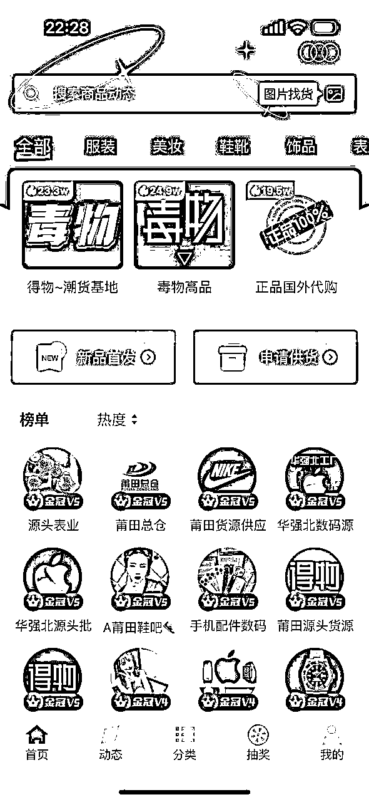
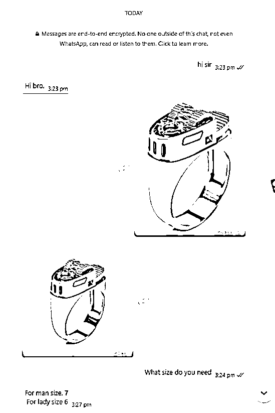

# 跨境私域电商的具体操作-FB篇

> 来源：[https://iv6ghbv3yvs.feishu.cn/docx/FhcmdTf0qoQscjxIXlYcgUbenJv](https://iv6ghbv3yvs.feishu.cn/docx/FhcmdTf0qoQscjxIXlYcgUbenJv)

分享个跨境电商的私域玩法，正常来说三四天左右就可以出单，每单利润3位数以上。其实很简单，就是引导客户加我们的联系方式来产生交易，比如wechat，line,whatsapp，慢慢积累客户后期做的就是复购了，可以一直做下去。十多年前我做的是Facebook群组和主页tag，当时是直接暴力引流到独立站（F品容易封站），每天能出个百来单，但是都没有沉淀，都是一次性客户，因此深知做私域的重要性。今天分享的是Facebook商城的操作方法，改天分享tk，ins的私域玩法。

一、项目介绍

通过在Facebook里面的一个Marketpplace栏目里面发布商品，这是一个类似国内闲鱼的平台，任何产品都可以上架，什么黑伍类，莆田货都可以发布。一个号相当于一个店铺，不用押金，找到你要上传的产品图片，然后手动或者用软件上传产品，软件三五分钟就能上传上百个产品。等有人来询单，就引流到私域聊单最后成交。

二、准备工作

1.选品，用心花几个小时选100个产品，其实就是下载图片，做的就是素材出海。

2.准备一条科学网络，可以自己搭建，网上百度搜索有教程或者找人买专线

3.FB账号，一个3块，买100个先，开它100个店铺起来，也就几个小时的事。

4.上架产品的软件或者脚本，提高效率

5.想好做独立站还是货到付款，搞定物流。

6.准备WhatsApp或者line账号，网上买ka注册，一张英国ka二十多块，能用半年。

三、选品

1.货源渠道，普货或者仿牌都能上，含酒精易燃易爆或者敏感（无人机、武器之类）的产品走不了物流。可以到1688或者拼多多上面挑选，尽量选便宜重量轻的产品，毕竟物流挺贵的。仿牌也可以到共享货源或者微商货（一款app名字）上面找。什么华强北电子产品，莆田产品，广州表，都有，但是价格很多种，不要被坑了，要找什么产品就用它的图片找货，从出来的结果里面选一个最便宜的货源，比如下图的全白空军，68块能拿到，也有40块的，质量会差一点。

2.图片，尽量选择买家秀，实拍图，会增加用户点击率，毕竟会上marketplace买东西的用户都是想着淘点便宜的二手货。每个产品挑选三四张图片，单独放到一个文件夹里。

3.做个excel表格，把产品名，拿货价，拿货渠道等等备注清楚，到时出单可以快速找到客户要的产品。

四、网络

1.一条科学上网的网络，这个话题比较敏感，不展开说。

五、账号

1.自己注册。用指纹浏览器，如比特浏览器、adspower浏览器。新建一个窗口，然后准备一条干净的s5导入，点击左下角一键随机生成指纹配置，打开进去fb后，点注册正常流程操作，最后找个jie马软件用马来西亚（经过测试过比较稳的国家）的号码注册进去。一个马成本几毛钱。这种自己注册的优势是号是自己的，不容易封。缺点是新注册的号要养3-7天才能使用，能上的产品数量有限。

2.购买，找个靠谱的渠道直接买现成的号。一般3块一个，买100个也就300，成本不高。

六、上架产品

1.手动上架

（1）打开fb首页，点击marketplace，然后点击筛选条件下面的城市，这里是可以定位到你产品想销往任何地方的城市，这里我选的是洛杉矶。

（2）点新建交易贴，卖东西。

（3）最后就是根据文字提示，上传产品照片，填写标题，价格，类别，提交上架。有多少个产品就都按照这个顺序就能成功上架。记住标题不能有品牌词，敏感词，否则会上架失败。

2.脚本上架。

到谷歌扩展程序页面，下载一个Automa的插件，可以录制前面手动操作的流程，然后循环它来实现自动上传产品。这是模拟手动上传产品的脚本操作。

3.利用软件协议上架，平均三分钟能上架100个产品。

（1）把账号导入到软件

（1）导入前面选好的产品

（3）然后软件选择上传到商店，等三分钟就搞定一个店铺了。

七、独立站、货到付款、先款

1.独立站

对于没做过跨境电商的圈友可能比较难，你要搞定域名，服务器，产品数据，收款方式，发货，售后等等。所以没经验的话，直接找人合作，有人专门收单。收单的意思是他们提供前面说的所有东西，你只要负责把货卖出去，然后按售价比例给你结算。

大致流程，聊单，引导客户到独立站下单，然后发货。

2.货到付款，这个出单较容易。

大致流程，聊单-出单-买货-发物流-客户签收-物流回款

（1）聊单

英语基本上是通用语言，电脑下载一个有道翻译，可以使用截图翻译对着单词就能翻译成中文，随便聊一下就可以引流到WhatsApp或者line

（2）出单，由于都是精准客户，加上好友谈好价格，客户就会直接下单。在谈价格的时候，都是以当地货币为主，比如以下这单客户在阿曼，要去百度搜索阿曼货币看一下当前汇率，然后把我们想卖出的价格换算成他们国家对应的货币。

（3）买货发货，找到客户要的产品下单，直接填物流仓库的地址，物流仓库收到货会帮你把里面无关的东西拿走再重新打包发给客户，比如什么好评返现卡之类的。

（4）等待物流签收，时不时查询跟踪一下物流，有问题可以随时在WhatsApp或者line联系到客户。

（5）签收的订单，物流会在10天左右回款给你。

3.客户先付款

也是聊单，然后靠人格魅力让客户先付款了，我们再给他发货，这个比较难。一般来说欧美客户比较愿意先付款，他们有这个消费习惯，付款方式通常为Paypal。

八、总结

这个项目玩法的优点

1.启动资金少，几百块成本就可以在fb开一百家店铺，疯狂铺货，全球那么多国家，想定位哪里卖就定位卖哪里。

2.用户询单多，出单容易。

3.能卖的产品太多了，只要你有图片就能上架销售，素材出海。

4.利润高，打底三位数，我们也出过5位数利润的单笔订单。

5.客户都沉淀在私域，有复购率，也能在私域做营销。

缺点

1.费人工，而且很多国家有时差，需要熬夜。

2.全程英语文字交流，没有英语基础聊单会比较慢。

3.如果走货到付款，会有拒收概率造成损失。