# 电商新媒体结合 AI，实现矩阵化降本增效

> 来源：[https://yjl4lwvs75.feishu.cn/docx/GLMSdmwX4or9bqxF8R1c0OuinJb](https://yjl4lwvs75.feishu.cn/docx/GLMSdmwX4or9bqxF8R1c0OuinJb)

大家好，我是陈思成。

从 AI 的相关软件陆续发布，我的团队都会根据使用到，并且感觉顺手和不错的 AI 软件应用，结合实际，从电商的角度出发，应用到工作做，今天就跟大家分享一下，希望大家看完，都能和自己现有岗位结合，实现真正的降本增效。

# 让 AI 运营帮你引流：抖音/小红书/快手-无违规引流二维码

别怀疑，扫他，试试

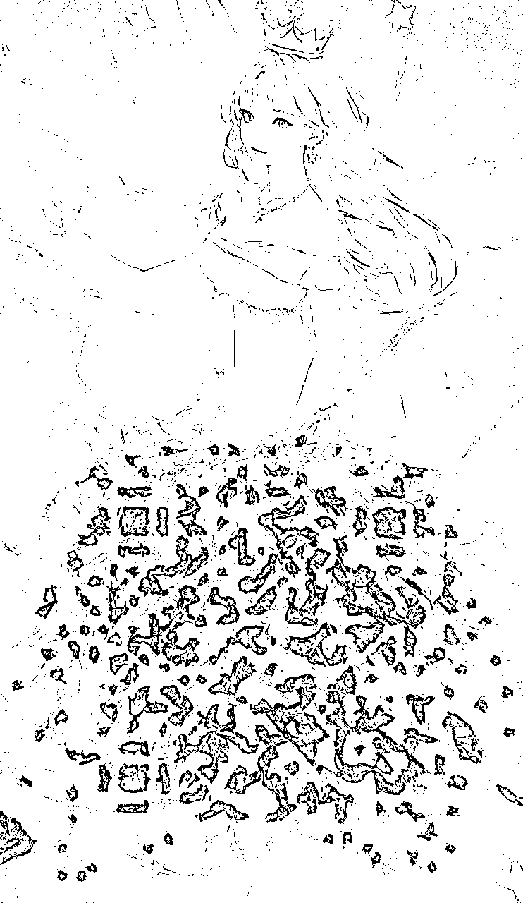

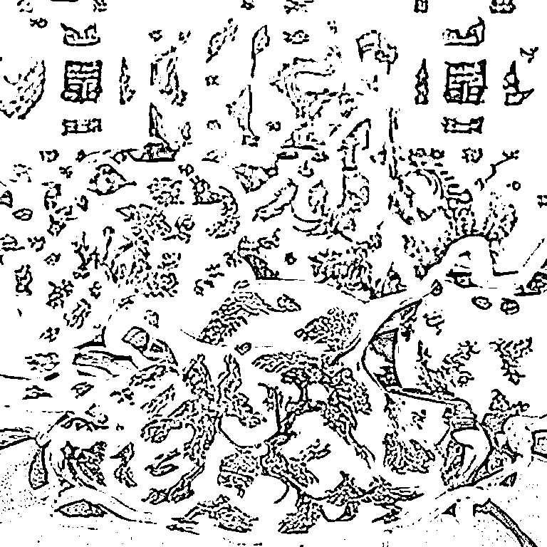

抖音/小红书/快手/微信等等——无违规引流二维码

## 无违规引流的逻辑

直接发二维码必被判定违规，如果能超过抖音/小红书的识别算法，让他的审核机制无法识别发布的内容包含二维码，我们就可以直接可以直接发码引私域。

（做 LSP，黑 5 还有莆田系的深刻理解这个威力）

## 解码现有二维码网址，通过 antfu 生成新的二维码

为什么不能用现成的二维码？有两个原因：

1、目前网上各种工具生成的二维码，点阵不具有连续性，如果直接拿来用于 AI 绘制，就必须在“艺术性”和“可读性”之间做取舍，要么扫不出来，要么不够好看。

2、 平台自带二维码，比如微信和公众号的二维码，原始内容比较庞大，导致二维码比较复杂。

实测下来，超过 50 个英文字母和符号，艺术二维码可读性就开始直线下降。所以我们要自行拟合，不要用现成的。

### 第一步：

将自己的二维码放到草料二维码 https://cli.im/ 里点击解码

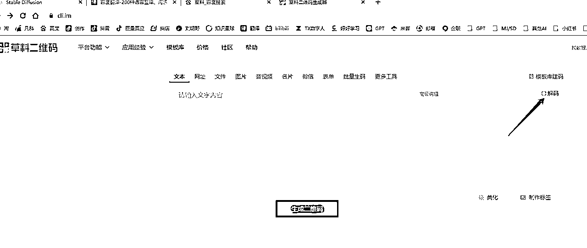

上传自己的二维码之后就会收到一个破解出的二维码网址：

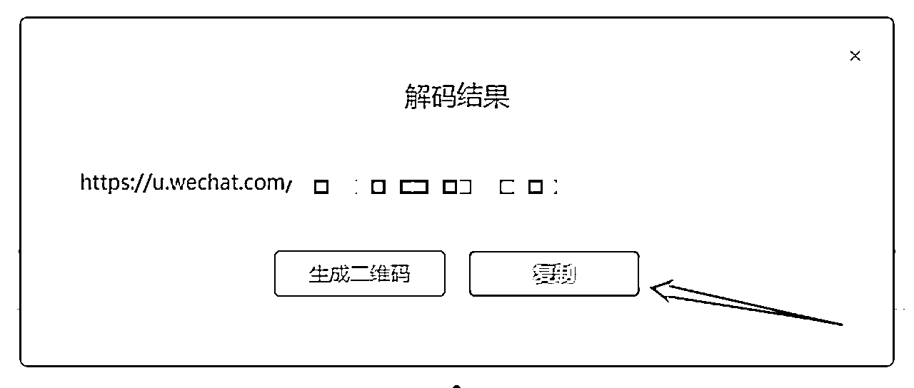

### 第二步：

之后打开 https://qrcode.antfu.me/ 按照我的常用配置生成新的二维码

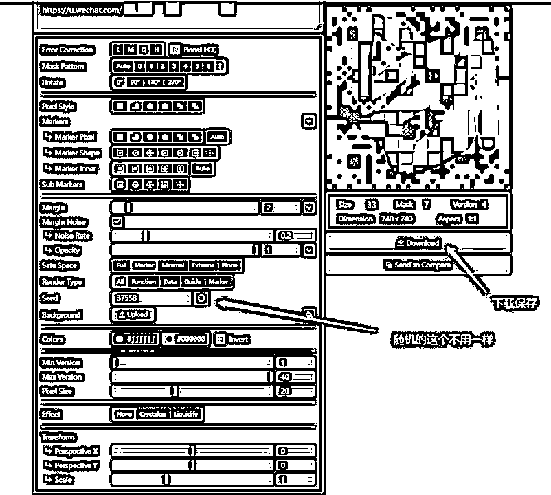

### 第三步：模型的准备

#### 打开 Stable Diffusion 模型我选的是麦橘 V6

除主模型外，还需要以下两个 controlnet 模型

CN Brightness:https://huggingface.co/ViscoseBean/control_v1p_sd15_brightness/tree/main

CN QRMonster:https://huggingface.co/monster-labs/control_v1p_sd15_qrcode_monster/tree/main

两个 CN 模型放置于 SD 主目录 /extensions\sd-webui-controlnet\models 文件夹下。记得 ckpt/safetensor 文件和 yaml 文件都要下！

### 第四步：绘制

建议从最简单的正向和反向提示词起手，能顺利绘制之后再加更多内容：

正向：（photographic equipment），3d， Knolling，masterpiece， The best quality， ultra-high definition，extreme detail，8k，

反向：pale skin，（worst quality， low quality， normal quality:1.4），（inaccurate limb:1.2），white background，simple

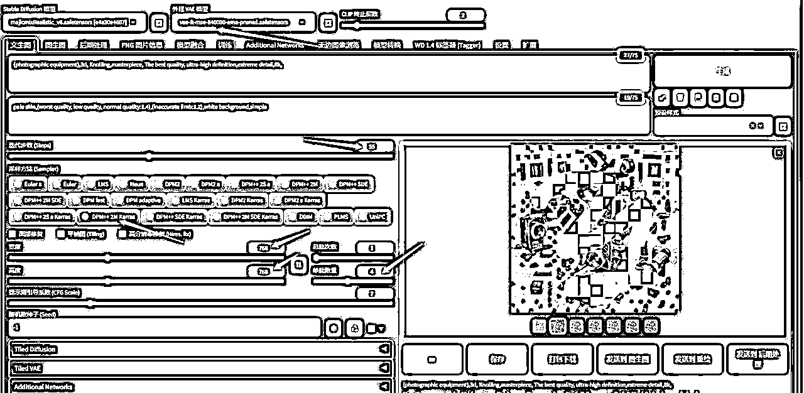

### 第五步：

启用 Controlnet 两层控制，一层为 QRMonster，一层为 Brightness

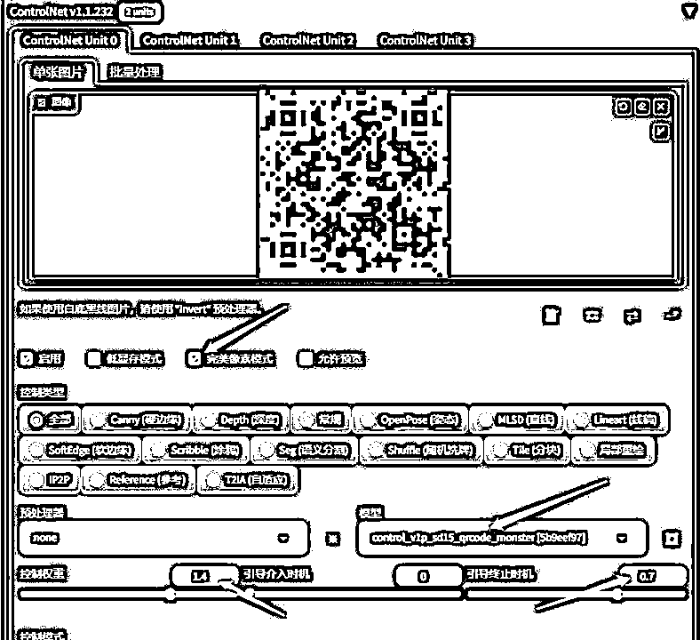

权重控制我们拉到 1.4 经过多次测试，太高艺术性降低，太低扫不出来！！！！！

如果你期望图像更加“艺术化”，可以将 CN 的干预控制缩短，比如这里将 Ending 调整为 70%时停止干预。

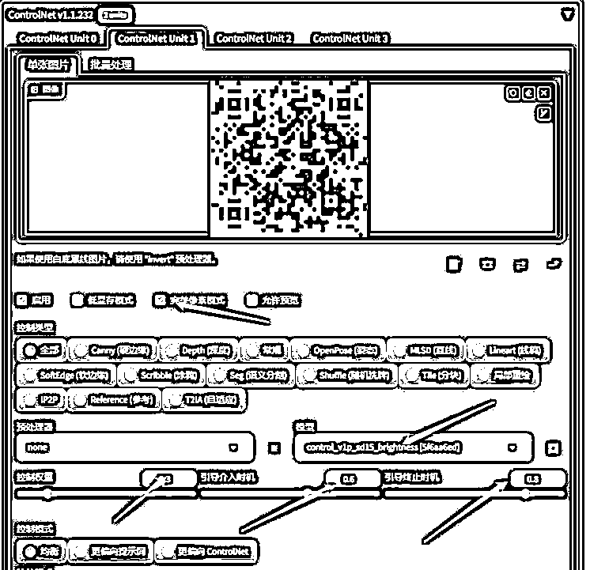

第二层 CN 使用 brightness 模型，这个模型会使二维码可识别部分和边界更加明显，增加可扫描性。但这会降低“艺术性”，

所以只在绘制中间插入干预时间，我们选择 60% - 80% 中段干预。

### 第六步：点击生成

测试生成的二维码图片能否扫描，如果做了 10 张还是不能扫描跳回到二维码制作界面，检查是否参数正确。

当然如果你只是想美化一下自己的二维码，也有现成的小程序，可以付费制作，但经过实测小程序做的 不能规避违规问题，像这样

# 让 AI 运营帮你写爆款短视频文案：ChatGPT 生成爆款文案/标题

在星球发现大家想用 AI 去制作爆款三秒或者标题，今天我就以标题为例，给大家分享下，如何用 GPT 来进行爆款内容生成

## 登录你的 GPT 或者 claude

如果大家没用过这些生成式 AI 软件也不会魔法上网，可以用小伙伴搭建的 gpt.pcbso.com 来免费试用。

Prompt:

你是一名非常专业的电商运营，现在需要你根据我给的爆款短视频标题，来帮我改写出更多的标题，请注意有以下几个需要注意的：

1.不能有绝对化词语

2.要吸引人，让读者看完标题 想了解更多内容

3.每次生成 20 个让我选择，不要有其他的解释

4.我的产品是 XXX，结合我的产品来创作

爆款参考：

1."新婚之夜，34 岁老公突然提出不寻常的要求，我泪流满面，却瞒着所有人"

2."我 26 岁，大学教授悄然约我晚修，结果他的一句话让我瞬间惊愕"

3."我 38 岁，只身一人前往山区教书，不料晚上山里有个陌生男人敲我门"

4."我的丈夫去外地打工，我被婆婆强迫做她一件无法接受的事情"

5."40 岁离婚的我，租住在农村，房东老汉每天晚上都会来敲我的门"

6."我 35 岁，每晚都要应付隔壁老王的夜袭，我的人生像是一部廉价的小说"

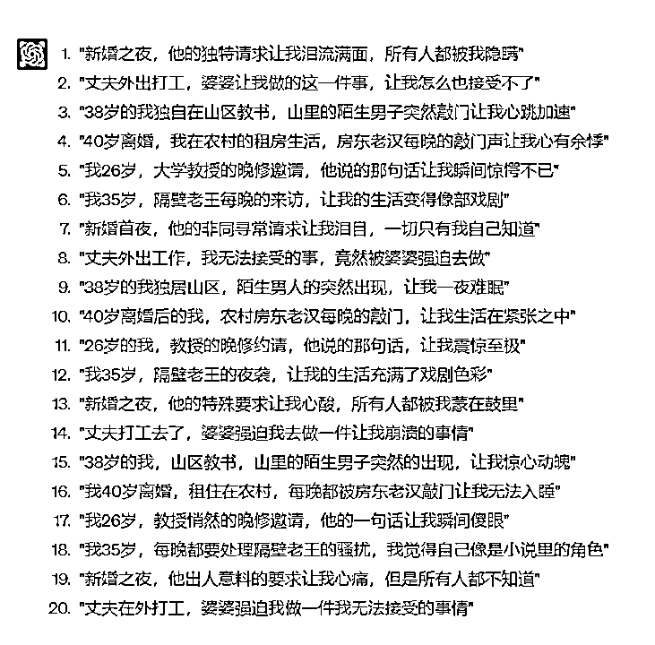

这里的爆款内容和第四条要求里的 XXX 需要大家替换成自己的内容，每个项目对爆款定义不同，炒你同行最爆的几条就 OK

最需要学习 ChatGPT 的是任何一名线上内容创作者，而一切围绕 GPT 的内容、教学实际上他们的目标人群是内容创作者而不是普通个人。

其实我们可以把 GPT 当成一个 3 岁神童，他的原始知识库是很粗浅的。但架不住他智商高呀，几千字的内容他一下子就能学会了。所以，他一定会成为我们 24 小时在线，任劳任怨，而且一教就会一点就通的天才童工。

# 3.让 AI 帮你做短视频：洗稿+AI 剪辑

不适用所有类目，带货类的短视频还是不适合，口播，科普，EMO 风适用

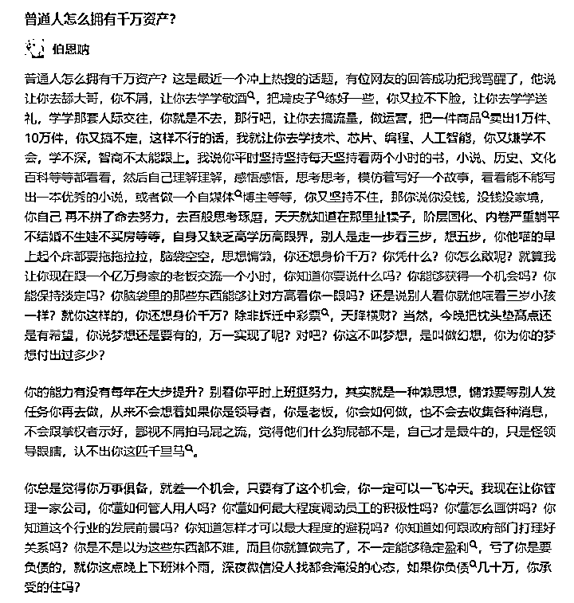

以上面这篇知乎爆文为例，我们先让 GPT 进行改写

不难看出，经过 GPT 的休整，每一句都改了，但是整体内容还是我们想要的，达到了原创标准

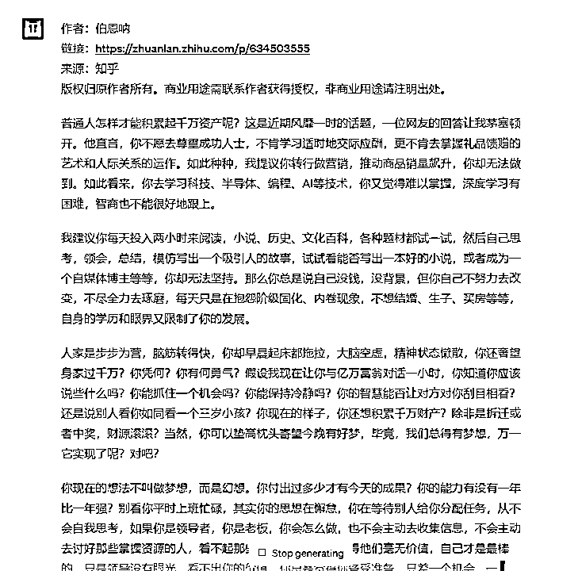

打开剪映更新到最新的版本，点击文字成片

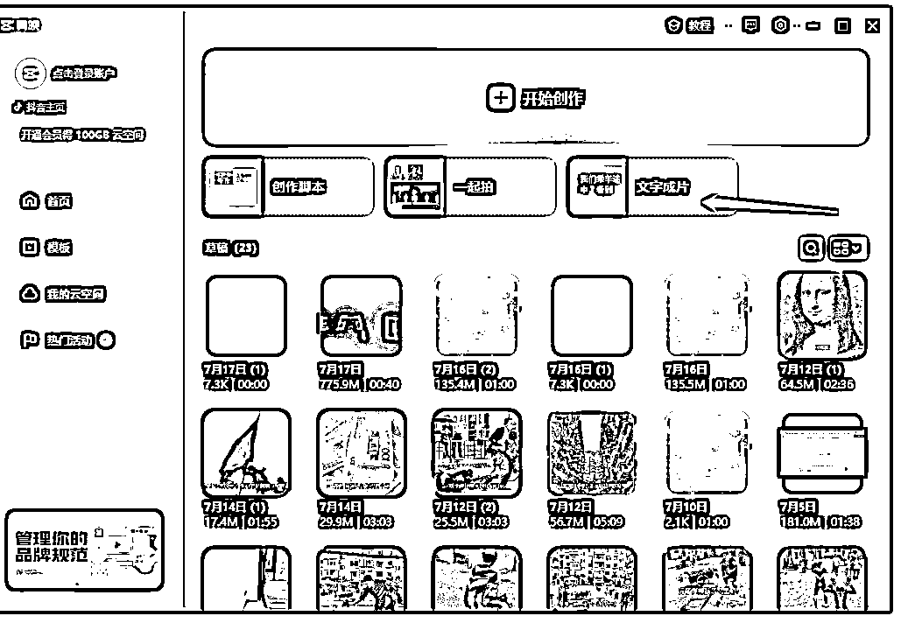

点击生成视频-再点击智能匹配素材

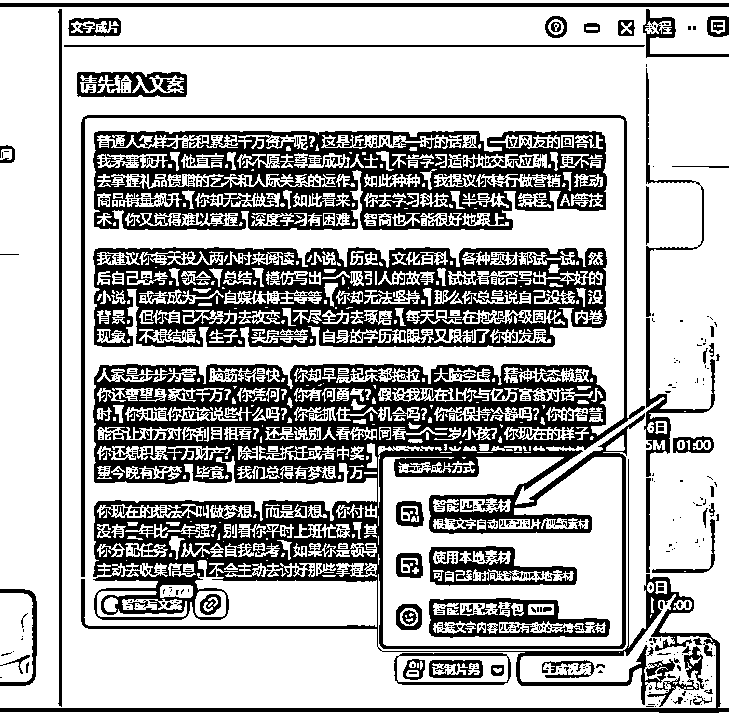

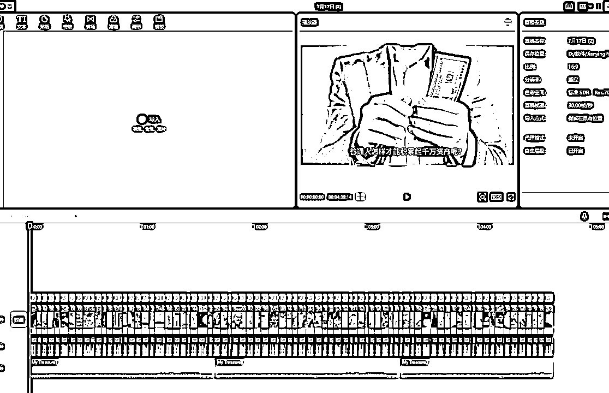

三两分钟就做好了，我们想要的短视频，如果你觉得这种内容不会爆，请参考抖音：emo 乌托羊

视频放到抖音上了，大家可以测试观看！

# 4.让 AI 帮你做直播背景图：AI 美工-MJ/SD

我们经常做无人/半无人直播，所以总要根据产品来搭建直播间，今天举个例子来给大家展示最近怎样用 MJ 来进行直播背景制作

如果大家之前没有用过 MJ 可以用 #小程序：//闪电炼丹/GcBWjvOM8FPKduc 来试用，不需要魔法（微信小程序）

今天我们搭建一个高端口红专柜促销现场，现在需要一个装修有档次的商场化妆品专柜，场景里不能有人出现，档次要高，口红要漏出来，竖版，清晰度高

我们根据这些要求 进行 MJ 的关键词描写 prompt：China's high-end shopping mall， lipstick counter， luxurious decoration， bright light --no people --ar 9:16 --s 250 --v 5.2

30 秒我们就得到了 4 张逼格，档次超高的场景图

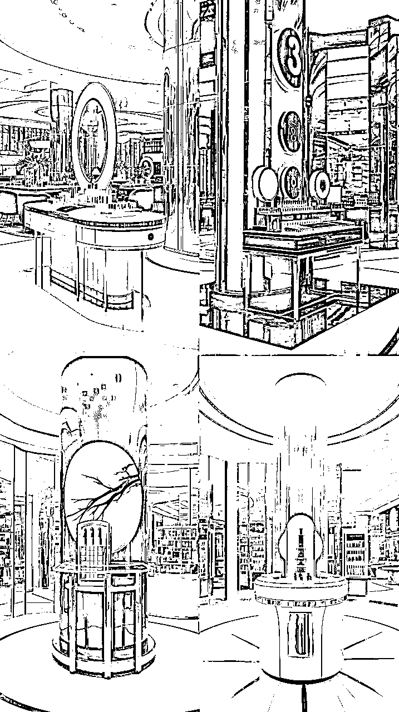

选出我认为最符合我的第一张放大给大家看一下

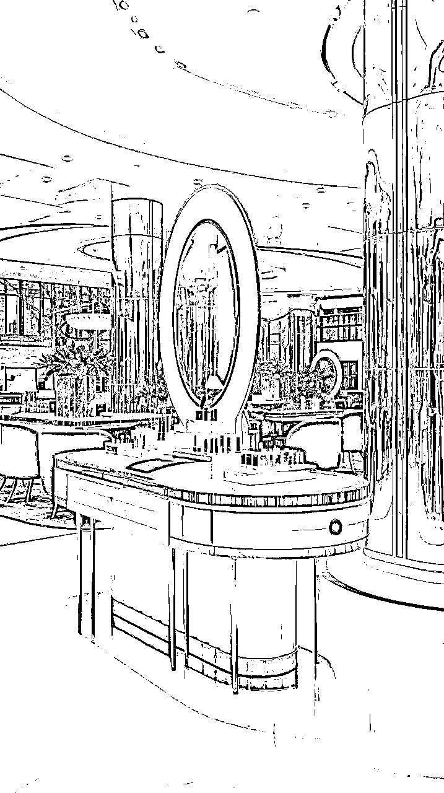

同理：我们可以获得服装卖场，生鲜，玩具，采茶基地等等任何你能用语言描绘出来的直播场景。

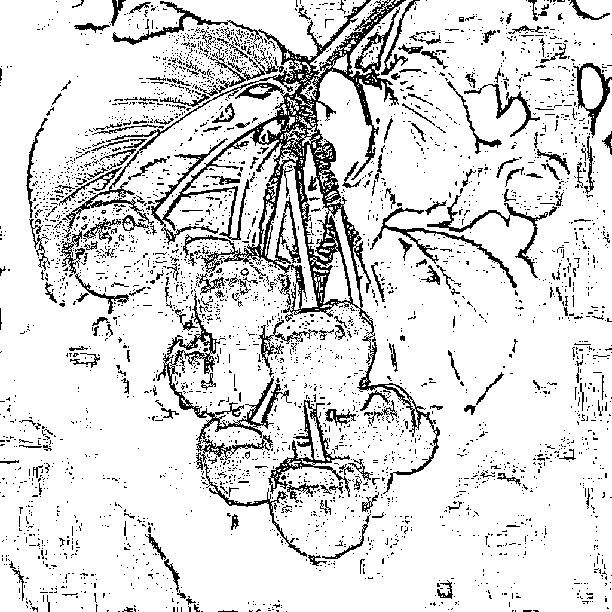

OK，至此我们已经让 AI 完成了 4 项牠擅长在抖音或者其他电商新媒体平台上完成的内容，还有更多工作我会慢慢的和大家进行分享，欢迎大家和我进行链接，

姓名：陈思成

联系方式：你想，你细想... 第一块的内容里，留了好几个二维码。

# 5.彩蛋

觉得干的，看完记得给小弟点个赞～感谢！！！