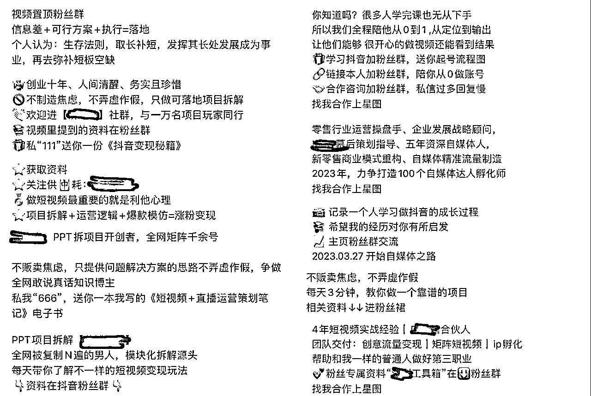
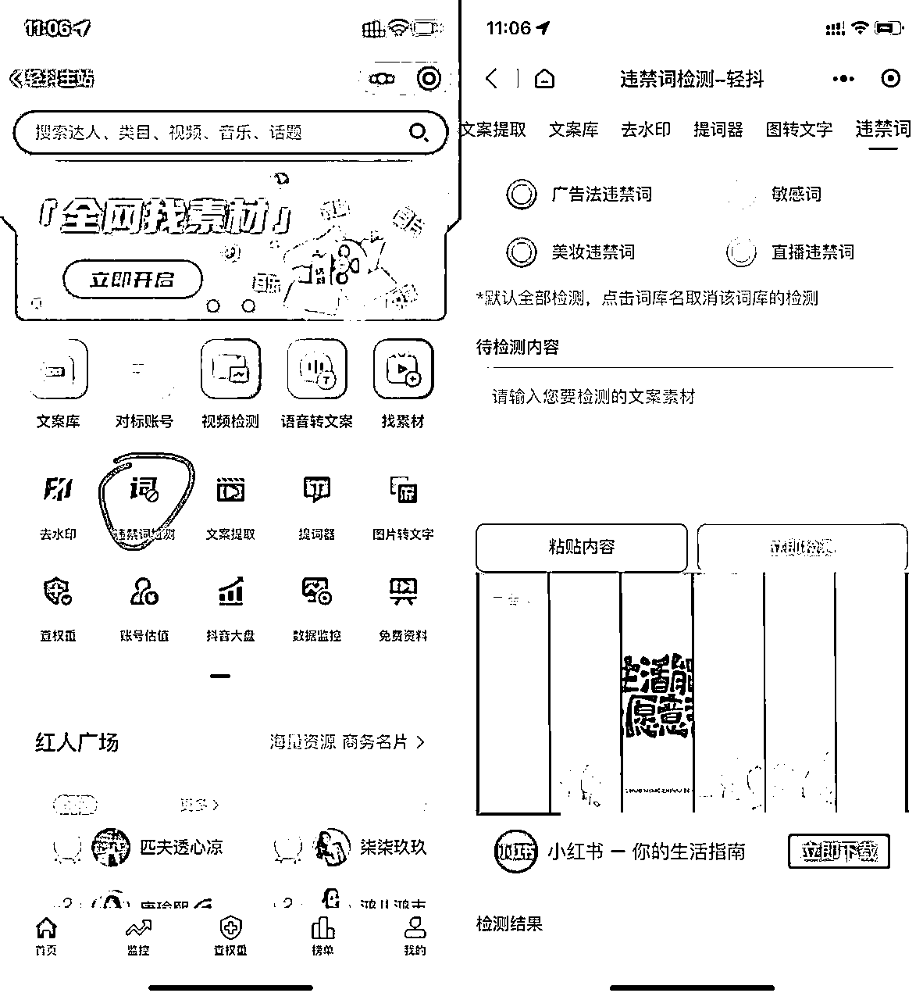
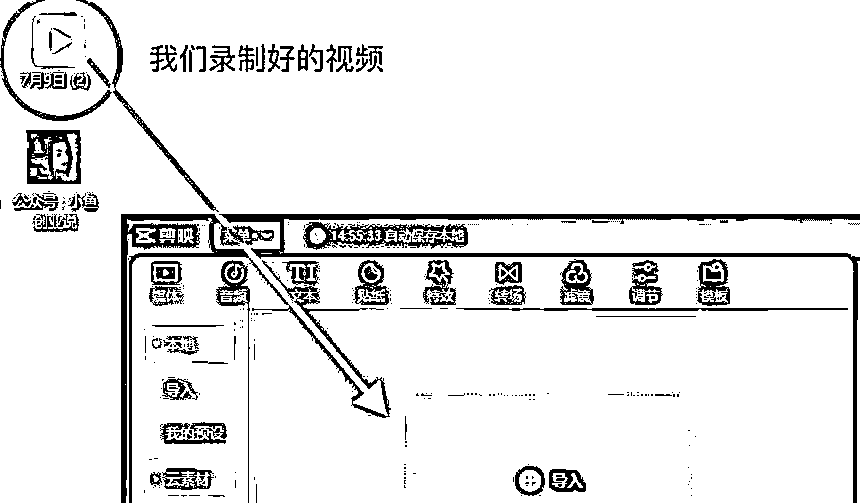
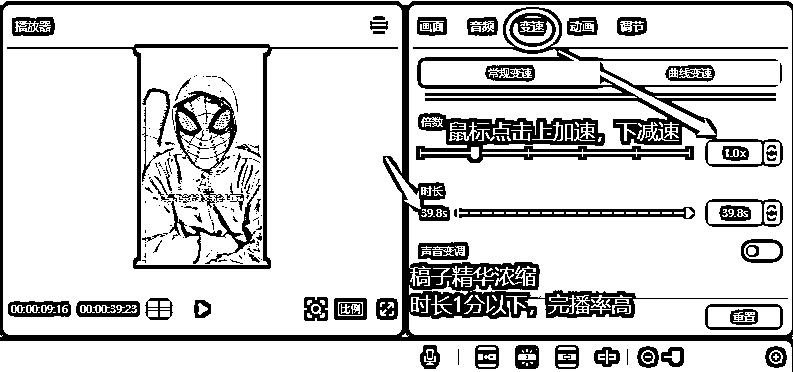
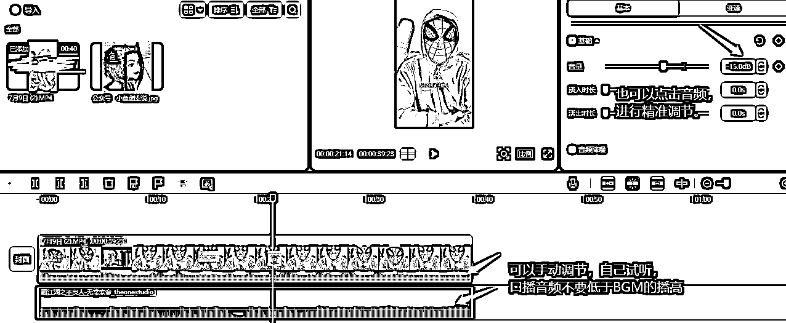
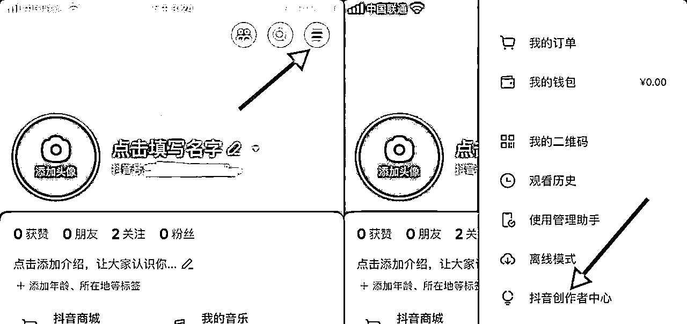
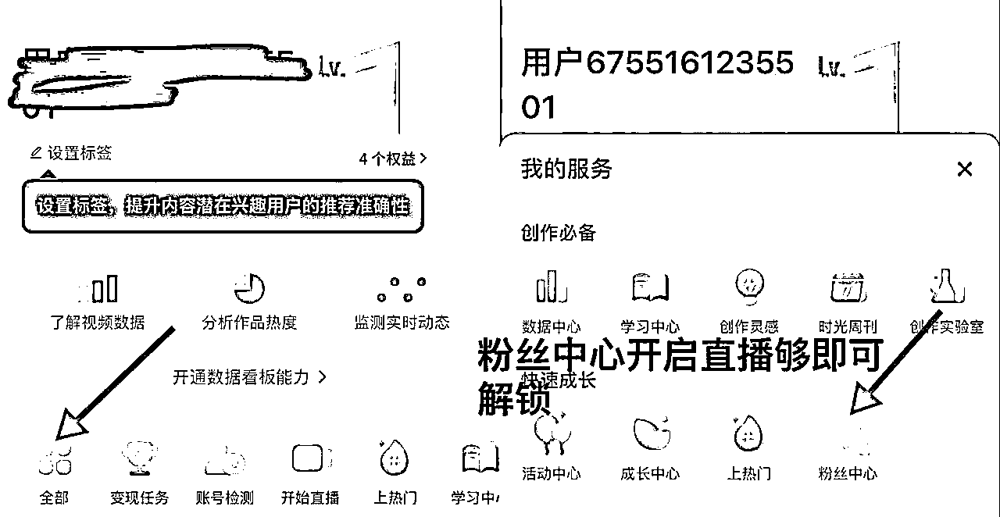
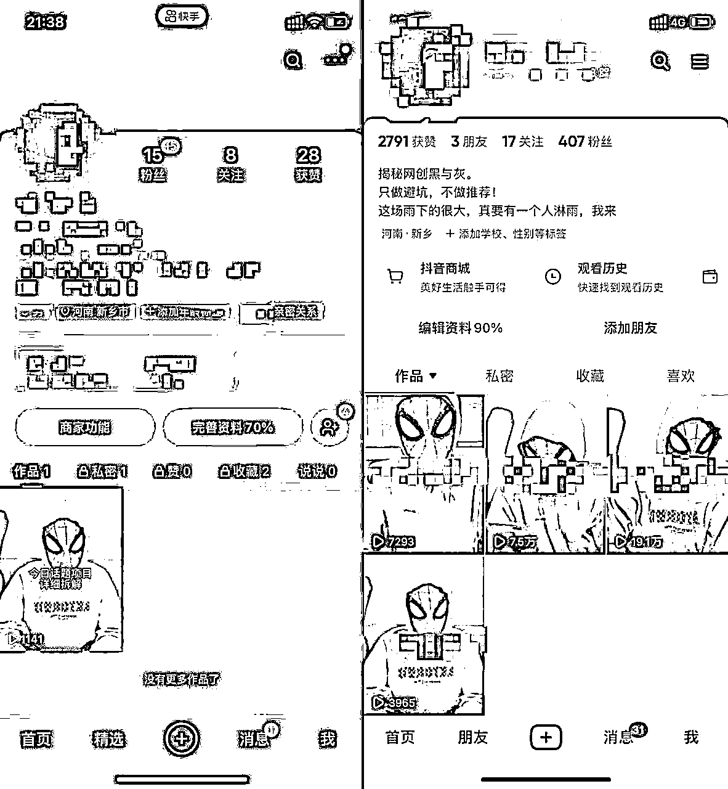
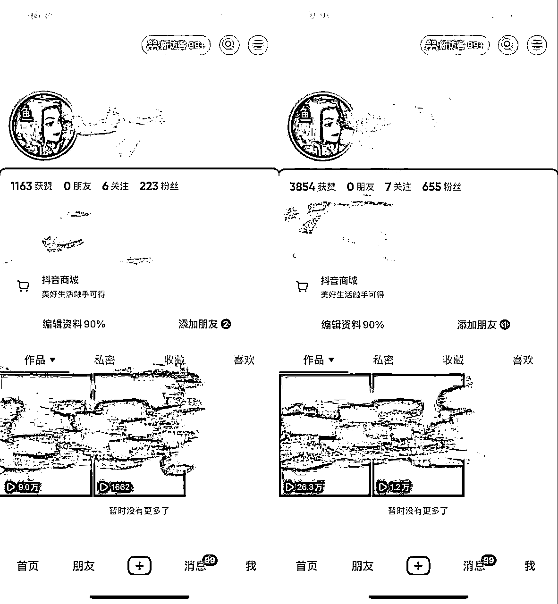
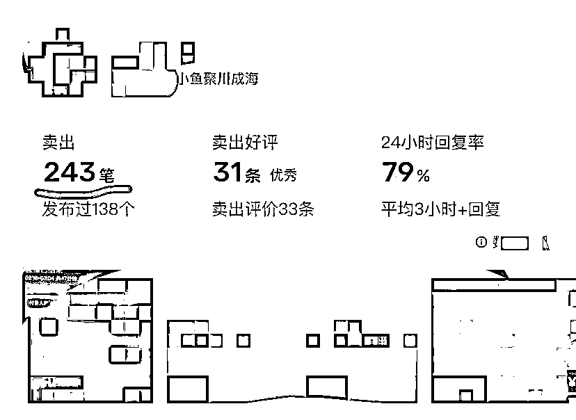

# 十分钟一条口播视频百分百起号分享

> 来源：[https://hxrdzf4a0ay.feishu.cn/docx/GizMdaW35oxpg9xsMh1cgICYnVc](https://hxrdzf4a0ay.feishu.cn/docx/GizMdaW35oxpg9xsMh1cgICYnVc)

【初步简介】

大家好我是王不也，20年大学生。23年6月7日大学毕业。接触互联网有几年时间了。小鱼这个IP，3个月变现30W。下面是我的自我介绍∶

【互联网IP】王不也（原IP小鱼）

【现实地址】河南

【思维逻辑】互联网暴利收益，暴力引流，发烧友

【早期经历】

✔咸鱼有无货源，螺旋起号矩阵日收益2K，美女号全自动变现，单号日跑1K收益。小红书虚拟资源，日收益600+。

✔单号单人暴力引流300+，均日引流单人一天200+

✔视频类项目拆解，口播项目拆解，百分百起号。日引500加创业粉。

【我可以提供的】

✔视频类项目拆解。引流创业粉，我自己的一些经验。

# 公众号更名为——大若随笔

## 一∶篇幅简介

此篇文章不讲故事直接分享干货！中间会夹杂我在做号途中，账号从零到一的结果，及我本人用这套玩法的实时引流情况视频。

之前小鱼分享过如何做视频类型的项目拆解，大家在刷短视频平台的时候也或多或少都刷到过。

大多都是一分钟，两分钟的视频。

当然纯视频项目拆解，小鱼也还在玩，但是考虑工作室现阶段投资，以及母盘对接出现了一点问题，目前人员紧缺。

急切需要一个不浪费时间，可以实现工作室矩阵去做，且暴力的引流。

以下是我们从零到一的项目全部流程及效果。

### 纯视频项目拆解弊端一∶

浪费时间∶一分钟，两分钟的视频，时间短，但是前期做起来对没有剪辑基础，或不能灵活营运剪辑工具的人，极度不友善。

我本人在刚开始拆解，目前网赚的视频类目拆解模式，前期两三个小时一条视频。

### 纯视频项目拆解弊端二∶

没有能力自主写稿子的能力，去洗稿子，只能吃流量尾。简单来说就是咱们洗出来的稿子，去做出来的作品。百分90的概率，不会超过同类目自己写稿子的作品。

### 纯视频项目拆解弊端三∶

视频剪辑难度高，学习周期长。

## 二∶结合及优化新玩法

纯视频类项目拆解目前我们团队的技术，已经可以保证百分百起号了。详细操作步骤我之前分享过，大家感兴趣可以在咱们社群内找一找。

纯项目视频拆解浪费时间，（流量大但是泛）口播流量不大。（流量小，但是精准）

所以我们团队结合了两种玩法，以口播的形式来说项目拆解。

## 三∶作品制作

先给大家讲讲如何去制作作品，讲完给大家看新号数据。

### 1.账号个人介绍打造∶

个人介绍方面大家对标同行进行打造。给大家找几个比较不错的例子。

前期我们要做的就是模仿，后期流程及平台熟悉了。我们再去加上自己创意。

### 2∶稿子

对标同行洗稿子，跟上面说的一样，在没有任何经验的前提下，我们去做IP只有四个字。模仿精进

1.文案提取

微信小程序，轻抖非常好用的一款白嫖小程序。

我们可以直接复制抖音作品链接，进行文案提取。

如果想自己写文案的话，大家也可以查询下规避词。

唯一弊端，每次提取需要看一个十几秒的广告。

PC端目前没办法白嫖，移动端无限白嫖次数。

### 3∶作品

3.1 做口播类型，我们要熟悉稿子。我们提出的稿子要进行洗稿，把稿子进行知识浓缩。

视频时间控制在1分钟左右，不要太长。太长影响完播率。

3.2 我们可以提前录制好音频，跟着文案念即可，因为我们采用头套，或者脸部特效。

所以我们视频没必要跟着录制。

采用视频，音频分开录制效率会更快。

作品录制完成，我们使用剪辑APP（自己擅长，具备基础剪辑功能的软件就行）将音频进行1.3左右的加速。后面会给大家讲为什么要进行加速。

配上一个节奏感比较强的BGM，BGM的音量不要高于，我们录制视频口播的音量。

## 四∶规避Ta，细节优化！（重点必看）

### 1.抖音

我们在做抖音这个平台的时候一定要注意，前期不要引流，主页也不要去挂自己的联系方式。

等到500粉左右，开始蓝V认证。

抖音蓝V认证后开五六秒直播下播，进入抖音创作者中心，点击粉丝管理，可开启粉丝群。

大家也都知道抖音粉丝群需要万粉才能主页展示。这时候就突出蓝V认证的好处了。

我们可以直接评论区甩进群链接。

群内不要使用我们在跑作品的号进行引流通知，找一个未实名认证的号，上管理去发

当然蓝V认证好处不只这一个，大家开过的也都知道，不细说了。

详细操作看下图

### 2.快手

快手跑一个作品后，开粉丝群直接引流即可。

唯一需要规避的就是要小号在群里发流量相关的话。

## 账号从零到一数据图∶

## 公众号实时引流效果

## 微信实时引流效果

# 总结

我想对大家说的是，引流方法要去坚持，同时也要筛选，一定要在一个领域做的好，做出知名度。

有的人可能你能做出效果，我们去做肯定不行，那我只能说。做什么都要坚持和深耕，就大家最看不上的咸鱼流吧。

我在做的咸鱼号一个号单号一天引20到30创业粉

## 精进自己的转化

大家会在想，咸鱼来的垃圾粉我才不稀罕。

我这样讲吧，我推出的APP19.9的合伙人收了七百多位，咸鱼付费上车的占比在百分之60，这是一个很可怕的转化率。（小钱不要看不上，19.9只是他们的入场券）

后续沉淀进社群的占比在百分之15左右，一千以上的客单价8位上车。

我觉得，每个有创业意向的粉，都是我们的客户，你转化不了就去针对他们，精进自己转化情况，蚂蚁多了都是肉。

测试下来我没有进行养号，唯一做的就是，新号第一天，点赞两条跟国家，或者正能量有关的视频。直接搜索项目拆解，点赞一个。这个操作就两分钟。不用等看完，直接点赞就行。第二天开始制作作品，直接发！

以上就是我这段时间实操的经验，希望能够帮助大家。

欢迎各位兄弟来和我沟通交流，共同提升，让我们在网赚道路上，一路长虹！