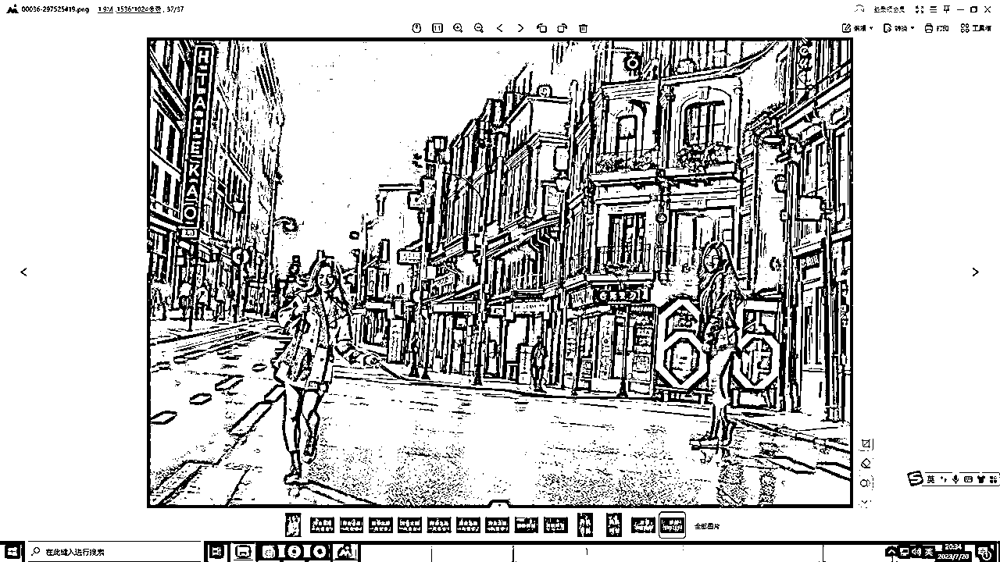
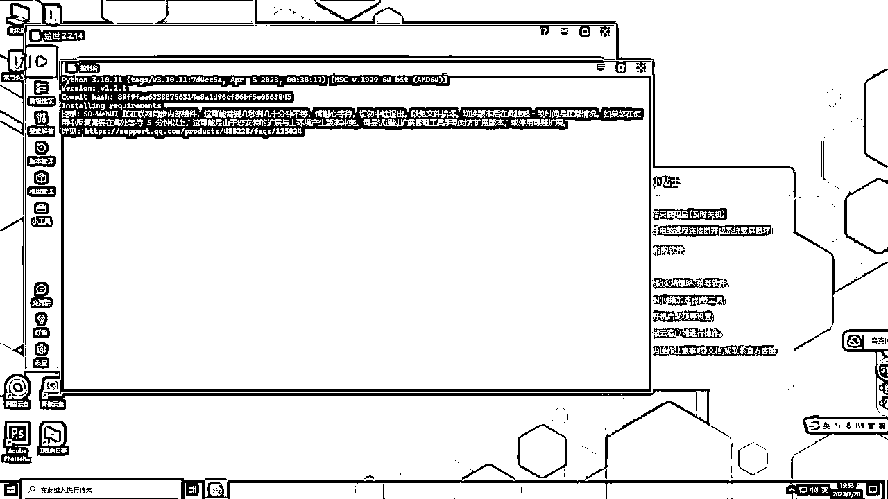
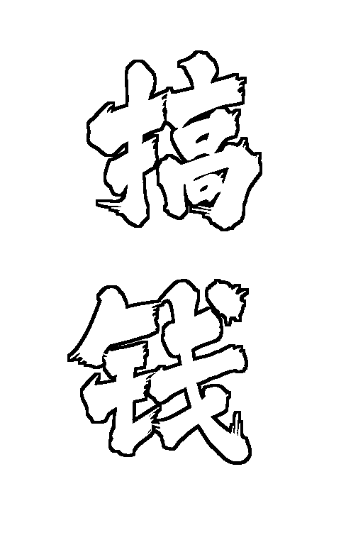
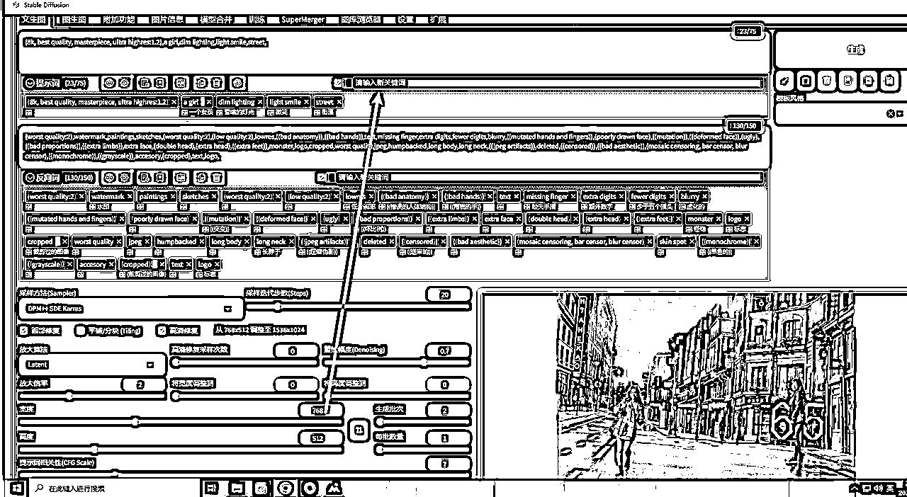

# 十分钟掌握AI绘画，Stable Diffusion绘画出光影图片

> 来源：[https://vchmk6v2g8.feishu.cn/docx/GvF7drKbaoxkrsxnwFNc51whn0K](https://vchmk6v2g8.feishu.cn/docx/GvF7drKbaoxkrsxnwFNc51whn0K)

最近这类型的图片非常的火，网上教程银很多，但是很多教程都不会从零开始讲解，很多人都是告诉你使用Stable Diffusion就可以做。

但是大部分人的电脑他们是无法运行Stable Diffusion的，因为要求配置太高了，导致很多人就卡死在不知道怎么使用Stable Diffusion，后面的就都别谈了。

这里就给大家用最最最简单的方式说一下，几分钟教你们跑一下Stable Diffusion，超级简单，开箱即可使用，不需要浪费时间，不需要下载模型，只需要几块钱就可以了。

本教程包含Stable Diffusion快速使用方法，以及制作下面这类型的隐藏图。

以上几个图片我制作的并不是非常好，但是这些都是可以进行微调的，微调需要时间，我之前为了调试这个，还有测试这个出图花费了大量时间，所以不想继续折腾出图，有兴趣的可以自己去折腾。

## 注册青椒云

建议是下载APP方便下次使用。

https://www.qingjiaocloud.com

注册，实名，这几个就不重复了，弄好了，来到我们服务器购买，选择有镜像的，比如小李子的。

充值十块钱，按小时计费就行了，不用的时候关机，不会扣费，十块钱可以玩很久了。

小李子没了，可以购买其他的带SD镜像的！！！

主要是有启动器跟基础模型就行了，其他的不重要！！！！！！

下载后，我们以桌面端为例子，点击开机，开机后进入我们的系统桌面，然后找到A启动器.exe，这个图标，双击打开。

注：如果默认全屏了，切换不了电脑的话，鼠标悬浮到，这个中间位置，选择取消全屏。

接下来我们继续。

我们打开进入到青椒云，打开SD的软件，点击启动会提示更新，等他更新完成，更新完成后，我们再更新一下所有的插件，方便跟我同步版本。

点击一键更新，一定要更新！不要问我为什么我们启动的界面不一样

更新完成后，点击启动器，一键启动柜即可，首次启动可能会需要3-5分钟，不要管他，等就行了。

启动期间，我们可以去下载一下我们的模型。

注：夸克里面我放了两个比较新大模型，质量都非常棒，建议下载下来更换，这样就不会出现一些手部优化很差的情况出现了。

大模型路径：C:\stable-diffusion-webui\models\Stable-diffusion

链接：https://pan.quark.cn/s/072d110f012f

百度：https://pan.baidu.com/s/1m5fYOpR1bs0PSA7z-m71Ew?pwd=7mui

阿里网盘分享不出来，建议用夸克，至少不是100k。

这个是必定要去下载的，其他的是模型自己折腾，可选并非必定要。

下载完成后，存放地址如下，跟我用同一个小李子镜像的，用完整路径就行了。

在系统任务栏粘贴这个地址，回车，然后把下载的模型导入进去就行。

完整路径：C:\stable-diffusion-webui\extensions\sd-webui-controlnet\models

相对路径：你的stable-diffusion目录\extensions\sd-webui-controlnet\models

这些都做好后，我们的SD应该启动完毕了！

默认应该会打开我们的浏览器，我们可以看到这样的一个页面。

如果跟我不相同，大概率你是没有更新插件的。

这就是SD出图的程序了。

这里可以跟我一样，切换模型，然后可以导入你的咒语了。

## 出图咒语-参考

考虑很多小伙伴不会写咒语，这里给一份咒语。咒语，自己可以修改。

(8k, best quality, masterpiece, ultra highres:1.2),1girl

Negative prompt: (worst quality:2.0), watermark, paintings, sketches,(worst quality:2), (low quality:2) ,lowres, ((bad anatomy)), ((bad hands)), text, missing finger, extra digits, fewer digits, blurry, ((mutated hands and fingers)), (poorly drawn face), ((mutation)), ((deformed face)), (ugly), ((bad proportions)), ((extra limbs)), extra face, (double head), (extra head), ((extra feet)), monster, logo, cropped, worst quality, jpeg, humpbacked, long body, long neck, ((jpeg artifacts)), deleted, ((censored)), ((bad aesthetic)), (mosaic censoring, bar censor, blur censor),skin spot, ((monochrome)), ((grayscale)), accesory,(cropped), text, logo

Steps: 20, Size: 512x768, Seed: 297525418, Model: majicmixRealistic_v5, Version: v1.3.1, Sampler: DPM++ SDE Karras, CFG scale: 7, Model hash: 33c9f6dfcb

直接复制，然后导入SD就行。

ControlNet配置如下，主要改动地方都已经圈起来了。

最终完整版参数，我修改的，以及不开高清修复的

如果不是追求质量，可以不开高清修复，出图速度会快一倍。

建议新手第一次玩，不要开高清修复，出图太慢！

最终生成出来的图片地址路径是：C:\stable-diffusion-webui\outputs\txt2img-images

也可以点击SD下方的文件夹，会直接打开的。

底图，底图自己根据自己要制作的图片，去用PS制作就行了，简单的很。

注意，这里字体用无版权的，其次建议用粗一点的字体。

比如宋体，或者这个：https://www.100font.com/thread-331.htm，https://www.100font.com/thread-233.htm

对了，PS制作出来的底图，是可以直接粘贴到青椒云的。

## 咒语技巧

正向提示词，可以直接在插件栏输入，然后回车，会直接将中文翻译成英文，很方便的。

记得青椒云要是不用了，记得关机，关机了就不会扣费了，所以说，10块钱可以玩很久了。

本教程非常感谢淘金之路@黛色翩翩，所提供的青椒云教程，感谢@千穹提供的光影教程。

我看有些圈友说我提供的sd光影教程，其实不是的，是千穹提供的，然后我发出来给更多圈友看到了。

信息本身不重要，不值钱，但是提供有效信息那就可以帮助到很多圈友。

本文首发在淘金之路，由侠狼编辑，搬运转载请联系侠狼。