# 有手就会的小红书引流方法

> 来源：[https://nivut760ftk.feishu.cn/docx/IIHKdKoEnoQmETx3bp4cv8byn9g](https://nivut760ftk.feishu.cn/docx/IIHKdKoEnoQmETx3bp4cv8byn9g)

自从上周给各位圈友分享了通过“投票引流”的方式，获得了很多圈友们的认可

既然大家都对引流这个话题感兴趣，那么今天我继续来给大家分享另外一个，低风险且高效率的小红书引流玩法。

这个玩法跟之前分享的“大号收藏小号”的方式有点像，但它相对来说会更易学易操作

那么大家都懂小红书引流的重要性，在这里我也废话不多说了，直接进入正题吧

# 操作流程是什么：

先跟你们简单的说说，这个玩法的操作流程吧

首先它是需要准备一个小号，来发布带有微信号的笔记，然后用大号收藏小号的笔记

当有客户来私信咨询时，大号就通过发送小号的链接给到用户，从而达到引流的效果

接下来我会给大家模拟操作一遍，尽量让你们一学就能上手

## 第一步：

首先注册一个小红书新号，来作为你的小号，去发布一篇带有微信号的笔记，比如像这样

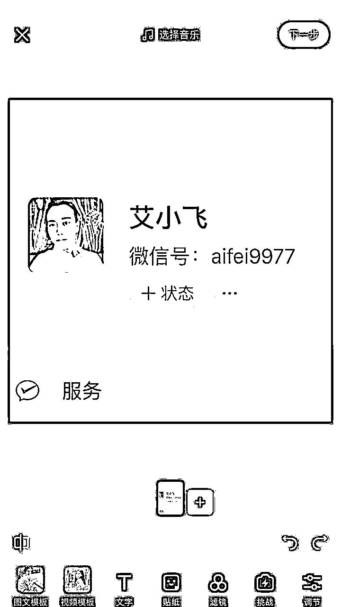

发布的时候，一定要记住，标题和文案区不能出现任何的有引流的中文或拼音缩写！

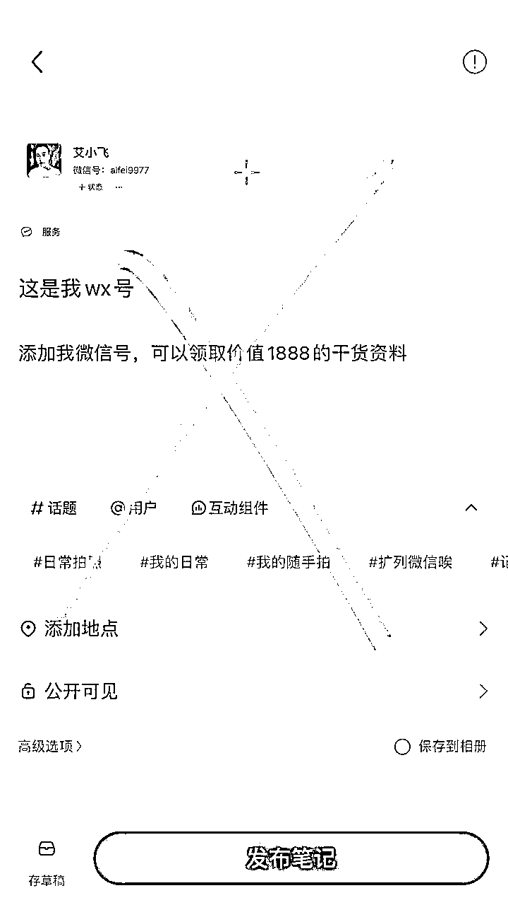

可直接用Emoji表情来代表你这篇笔记的暗意

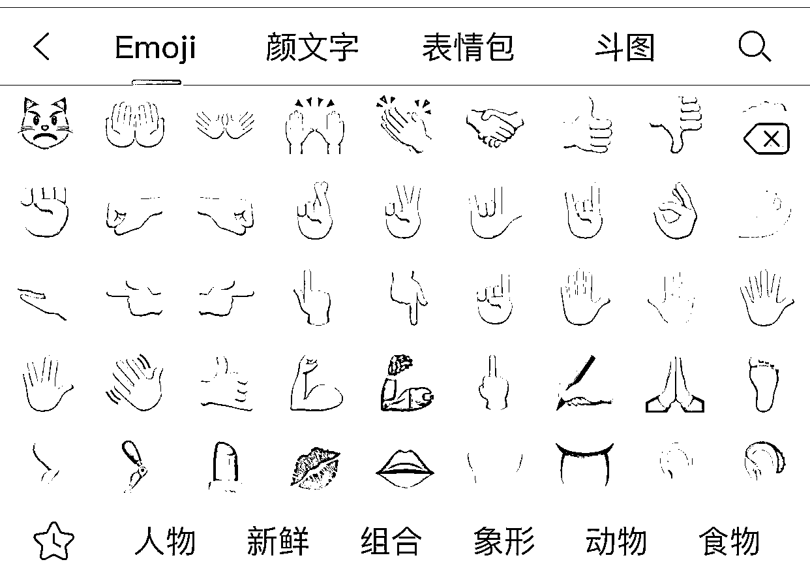

比如这个表情👨‍🦲”，代表是“我的”的暗意

比如这个表情“🛰️”，代表是“微信”的暗意

比如这个表情“👁”，代表是“看这”的暗意

比如这个表情“👆”，代表是“方向”的意思

那么“👨‍🦲🛰️👁👆”连起来的意思就是，“我的微信看这方向”

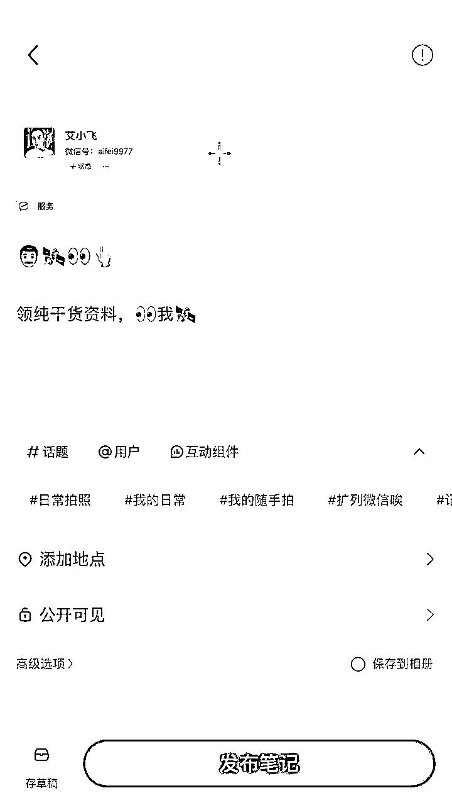

编辑完成后，就直接点击发布就完成了，等待下一步的操作

小秘诀：

在这里也跟你们说下一个小小的秘诀

那就是你们的微信号，尽量设置在六位数以内，或者是简单容易记的微信号。

不要放你的电话号码或很长的微信号去作为引留号！因为没有谁会去记住你那么长一段数字的。

如果用户一旦觉得加你会很麻烦，那么他们就会放弃添加你的微信号，从而影响到你的加微率

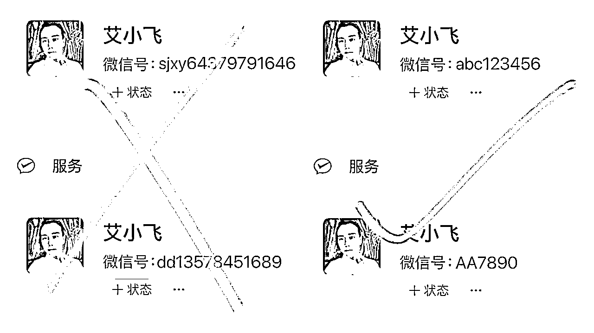

## 第二步：

第二步呢，用你的大号去搜索并收藏小号的这篇笔记

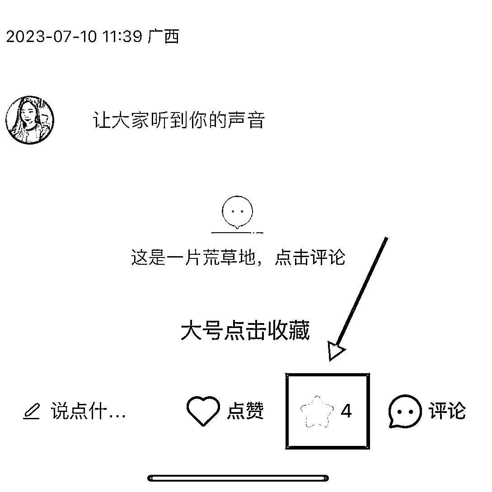

## 第三步:

当有人来咨询问你的时候，比如问你“怎么买”“求链接”等

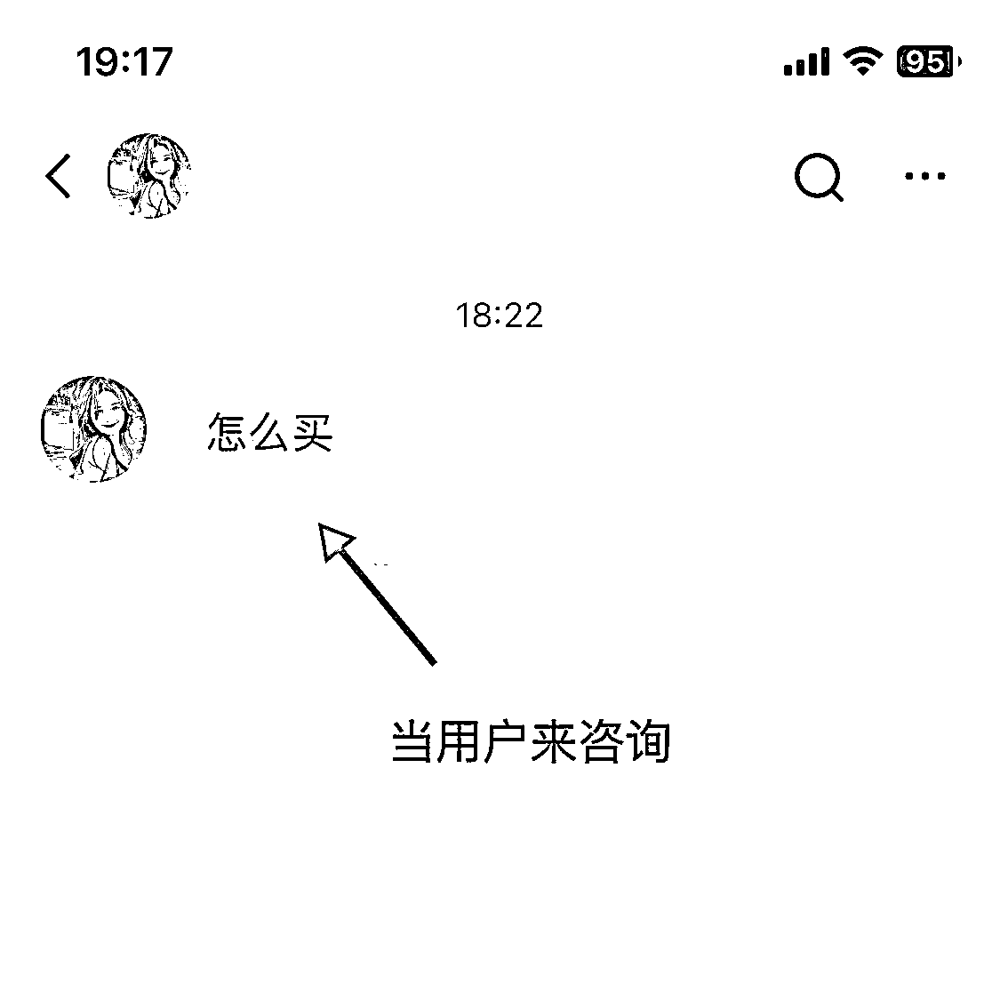

你可以点击“分享笔记”，在收藏列表里找到你刚刚收藏小号的笔记，

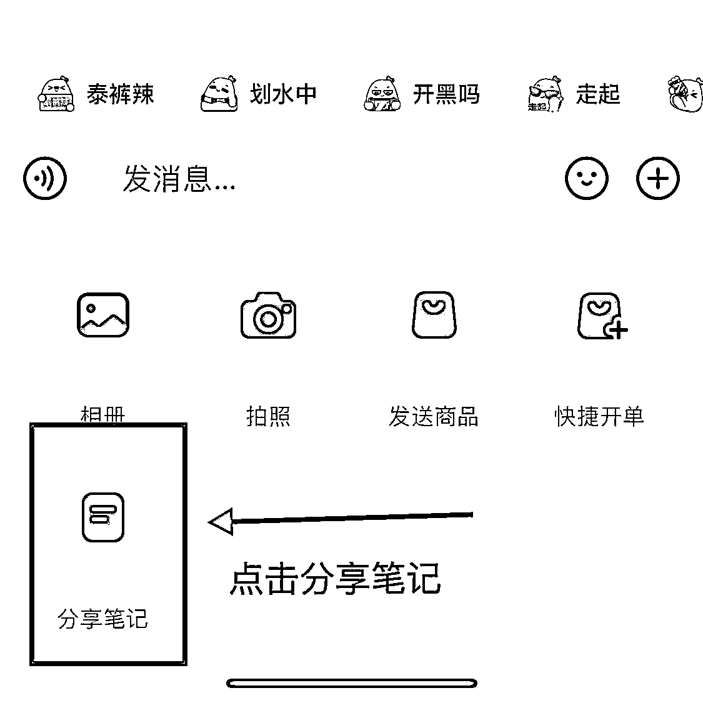

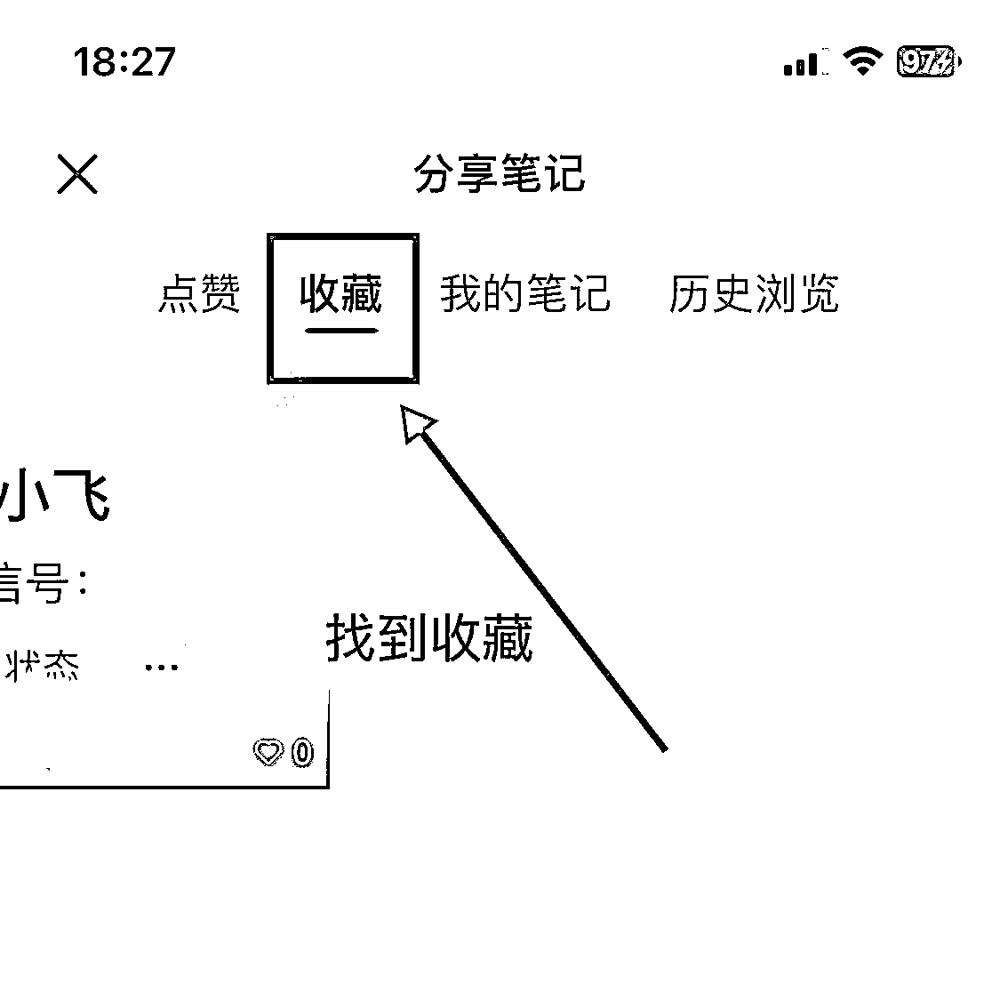

找到用户后就发送给对方，然后说“看这个”，“你点这个”等这些有引导性的关键词

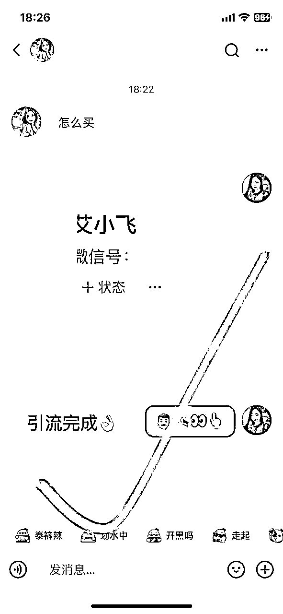

如果你担心被举报，也可以添加Emoji表情，比如像这样“🛰️👁👆”

这样整个引流的流程就完成了，基本的操作流程没什么过多复杂的，就是这么的简单！

小提示：

当你发送表情或暗意过去时。如果他看得懂是啥意思，那就最好

如果看不懂的话，你也不要去做过多的解释

特别是他来问你

“这是v吗？”

“这是微信吗？”

“这是什么啊”

你千万不要去回复

“是的”

“这是微信号”

“这是我的联系方式”

别人一旦举报你，那么你的私信功能就会被禁言了

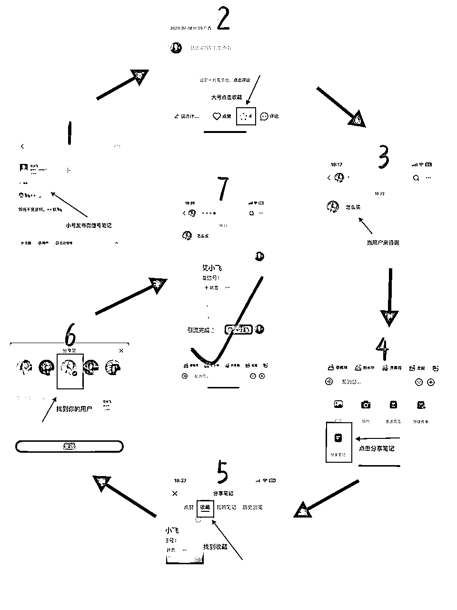

# 这个引流方式有什么优势:

## 这个方式的好处是什么呢？

我给你们展示下，当别人通过私信的对话窗口看到你的引流信息时，别人是举报不了你的

而且它根本就没有这个举报的提示或功能！！

他只有点进你的小号链接里面才可以举报

不会影响你大号正常的私信，也不会把你的大号给限流了

但这里有个注意的点，就是你小号发布带有微信号的笔记时，如果别人一旦举报你了，那么你的笔记有可能被强行下架

因为目前没有哪个引流方式是100%安全的，所以在这里你心里有个底就行了

## 如果被强行下架了该怎么办呢？

最好的办法就是，你每隔几个小时，你就发布一篇带有微信号的笔记

你持续发有10篇左右这样子，别人举报了A笔记，你至少还有B C D E笔记在展示

如果同时大批量都被举报了，那就再继续发布就行了

在这里，我也给大家一个建议：

就是尽量要用一些被违规过的帐号来作为你的小号发布笔记

比如：

你有个帐号私信功能被禁言了

或者你发布笔记都没什么流量的

再或者你这号多次被提示违规了

但只要你的这个号还能正常发布笔记。那就先别急着注销

可以用它来作为你的小号，去发布带有微信号的笔记

这样的话就不用再去另找新号来做小号了

好好利用它这个帐号最后仅有的价值，从而去节省你的帐号资源

# 总结：

在这里还是要给大家简单的说下，目前为止没有哪个引流方式是100%安全可靠的

因为官方一直在打击引流行为，平台的规则在变，我们的引流玩法也要跟着变

有可能过段时间这个玩法它就会被平台给补上bug了，所以你们学到了，能用就用上！

其实我也能预感得到，现在平台对于引流的打击是越来越严了，往后如果想从小红书引流到私域的朋友，要尽快的去布局好这个板块

越往后，想从小红书上引流的难度就越高，给到新人的机会也越来越少

因为我每天都在小红书上引流，对于这方面我是有很多踩坑和成功经验的

如果你们有啥不懂或者需要提问的，可以一起来交流经验

今天的分享就到了，谢谢大家

我叫艾小飞！

原创：艾小飞

转载可私信

禁止搬运和抄袭

微信：aifei9977 （记得备注来意）