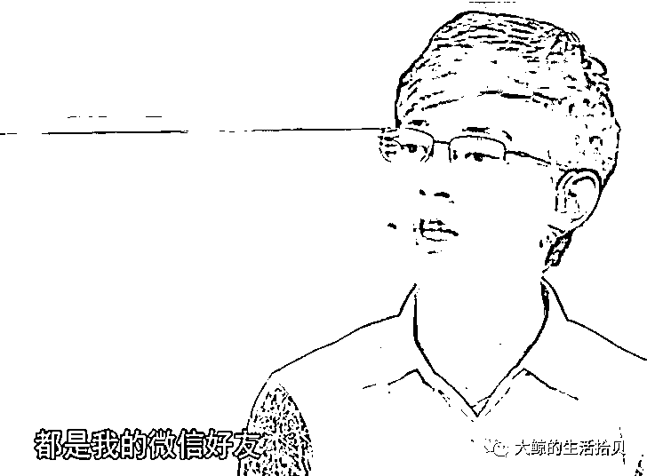
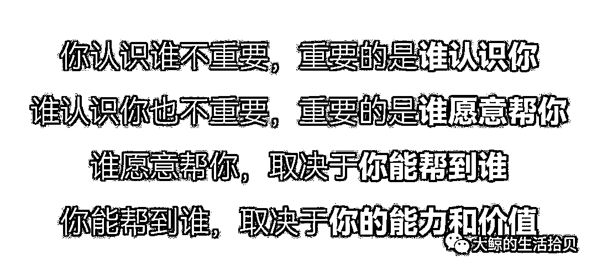
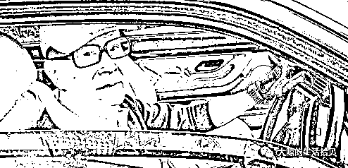
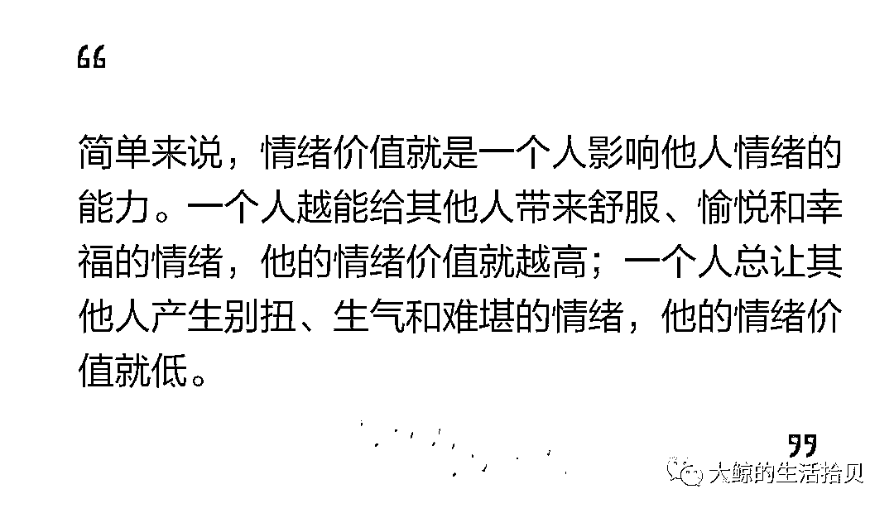

# 很多人所谓的人脉，其实是个笑话

> 来源：[https://zx8am088wt.feishu.cn/docx/Icxedehb4oAbxXxJOmbcVdVFnAA](https://zx8am088wt.feishu.cn/docx/Icxedehb4oAbxXxJOmbcVdVFnAA)

人脉到底是什么？是微信里的好友吗？

在《非你莫属》这档求职节目中，有个小伙称投资界半壁江山都是微信好友，甚至要求年薪不能低于160万，引发群嘲。

网上有句话叫做，“你认识谁不重要，重要的是谁认识你。”

其实也不尽然，事实上谁认识你也不重要，重要的是谁愿意帮你。即便你有一万个弱关系，没人愿意帮你，也没用。

而谁愿意帮你，取决于你能帮到谁。人脉不是那些能帮到你的人，而是那些你能帮到的人。而你能帮到谁，取决于你的能力和价值。人脉的本质是价值交换。这就是人脉四重推演理论。（自创，哈哈）

# 01

价值交换中，最重要的就是信息交换。因为信息就是权力。一个人在社会上获得机会的多少，本质是由他所处的信息层决定的。

用斯坦福大学教授Granovetter的话说，

那些强者的人脉逻辑，不在于他融入了哪个圈子，而在于你能从多少不同圈子中获得有效信息。

这里有个关于李嘉诚和他司机的小故事：

李嘉诚的司机给他开车30多年，准备离职退休。老板李嘉诚看他兢兢业业干了这么多年，为了表示感激并让他能安度晚年，叫秘书拿了200万的支票给他。

没想到，司机竟委婉拒绝：“谢谢老板，不用了，我一两千万还是拿得出来的。”

李嘉诚很诧异，问：“你每个月也就五六千收入，怎么能存下这么多钱？”

司机笑了笑，回答说：“我在开车的时候，您在后面打电话时说买哪个地方的地皮，我也会跟着买一点；您说要买哪支股票的时候，我也会去买一点股票，所以现在赚了一两千万资产。”

这个故事告诉我们：

人脉的真正作用，不在于得到金钱上的直接帮助，而在于获得稀缺且高质量的信息。

信息互补，恰恰是来源于人脉中的弱关系、非重复关系。

“非重复关系”这个概念是我在成甲《好好学习》当中知道的。有些关系，像亲戚朋友同学这些，跟你聊的东西差不多，认识的人也差不多，他们的朋友很多也是你的朋友，掌握的信息没有多大差别，这种关系，就是重复关系。

而另一种关系，你和这个人活在不同的圈子里，彼此的朋友也不一样，你通过他能认识另一个陌生圈子的新朋友，这种关系就叫做“非重复关系”。

“非重复关系”往往很多是你人生的贵人。

# 02

既然人脉的本质是价值交换，那么获取人脉的关键就在于，自身的价值和能力。

肩膀不齐，不是亲戚。打铁还需自身硬。

人脉最重要作用就是准确传递信息，与特定人群达成共识。人脉的另一个潜台词就是，我只跟能听得懂我话的人玩。要知道，不同层次的人之间，最大的成本是沟通成本。同样一句话，有人秒懂，有的人要楞半天

。而要听得懂，这就需要主动提升自己，让自己价值升级。让自己变得更好，是解决一切问题的关键。如果自己没有本事，没有资源跟别人换，你的人脉就是个“笑话”。

所以，把精力放在提升自己，当我们达到足够优秀的时候，很多人脉都是不期而遇的。

# 03

我们向上社交，尤其是势能远高于自己的人脉，在结交的时候，难免会自卑。

这里分享2个很重要的方法，首先就是“跨界价值”。

对于那些比你厉害的大咖，你要用跨界思维去影响他。

术业有专攻，发挥你的专业所长，最牛的大咖也不是全能的孙悟空 ，也有不如你的地方。

比如，你很喜欢旅游，是个旅游小达人，那么大咖在旅游的时候就有可能会想到你。比如我，可能会这样介绍自己，是个目前粉丝2W+的设计博主，同时坚持日更100天，分享成长和带娃的心得。

学会主动给自己贴标签，如果有数据佐证那就更完美了。让他对你印象深刻，知道你的价值，总有用得上的一天。

# 04

第2个，一直被忽视的，就是真诚和感恩。

《没有权威的影响力》的作者艾伦，科恩曾说：

“大多数人思维或过于狭窄，太看重金钱，社会关系，技术，信息等显性资源，却忽略了感恩，认可和声誉等隐形利益。”

即便我们的地位比别人低，我们能够给予别人的东西也比自己意识到的多。

你对别人真诚的感恩，你也能让对方收获很大的价值。真诚，永远是你赢得别人信任的好伙伴。没有什么道路能够通往真诚，真诚本身就是道路。

当你看完牛人的书，听了牛人的讲座，真诚地跟他分享你的心得和反馈，你的感恩就是对方最大的享受。很多时候牛人去分享知识，是获得一种帮助别人的成就感。他们的人生目标是帮助更多的人成长，像辉哥奇谈的主理人，辉哥，他追求的身份是一名布道者，每天日更助人解惑，传递更多有价值的内容，让更多人受益。牛人对于成就感、尊重的需求，其实正印证了马斯洛需求理论。

情绪价值，是很高阶的一种价值。给足情绪价值，他就是你的人。

这里还有一个非常重要的点，就是“恩情折扣”。指的是任何恩情，随着时间的推移都会被打上折扣，时间越长，折扣率越高。

比如朋友给你介绍了工作，刚开始得到这份工作的时候，你愿意拿50%的薪水来报答他。但是心里想，能进来也离不开自己的努力和付出，现在薪水还不够，还要养家，要生活，要换车，等升职加薪了有余钱了再回报也不迟。自己不是个不懂得知恩图报的人，只是晚一点，等有更大能力的时候再回报也不迟。

再后来，已经不记得当初是如何得到这份工作，你只记得为了升职加薪，你熬了多少个夜，加了多少个班，多拼命多辛苦，这一切都是你应得的。这份恩情就这样不断被稀释，最后就变成一个念想，只要我逢年过节去拜访，记得他的恩情就行了。这份恩情就折扣成逢年过节的拜访了。

没意识到恩情折扣，没及时还上，一方会认为薄情寡义，另一方会觉得小题大做。

不管对方需不需要你的回报，你的回报都要给对方带来惊喜和愉悦。这也会为接下来潜在的互动打下基础，一来二去，人脉增强。同时给对方留下好印象，自己是个懂得及时回馈的，任何时候帮你都不白帮。而且回报完了之后，双方的关系就回归到水平线上了，不再是不平等的地位，你也不会为了人情而耿耿于怀。

听懂了这些，你就明白，为什么你给那些老江湖的领导送礼，走的时候他们都要让你带点什么东西。

总结一下综上所述，

*   人脉取决你能帮到谁，归根到底是自己的能力和价值。

*   人脉的核心是价值交换，价值交换的核心是信息交换，尤其是稀缺的高质量信息。

*   即使地位比别人低，也可以运用跨界思维和真诚感恩来结交人脉，但是请留意恩情折扣，记得及时反馈和回报。

*   最最重要的，让自己变得更好，是解决一切问题的关键。

最后，肯定有人质疑，你又不是什么大咖，没有一圈牛人人脉，没有什么出众的成就，讲这个话题有什么资格和底气。

的确，以上说的都是事实。

今天将人脉的认知梳理出来，是为了让自己和更多人知道人脉的含义和价值，以及破除人脉认知上的卡点。

因为我相信，认知决定行动，行动带来结果。

大脑是非常厌恶风险的，当大脑意识到这是一件清晰的，有意义的事的时候，才会发挥主动性。

所以，如果这篇文章能帮大家破除人脉认知卡点，并且开始有意识地经营自己的人脉，就是最大的价值了。

最后列出文章参考文献，欢迎大家去阅读。

蔡垒磊《认知突围》、张辉《人生护城河》、成甲《好好学习》等

祝，

获得高质量人脉~