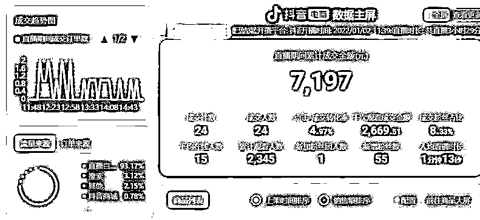
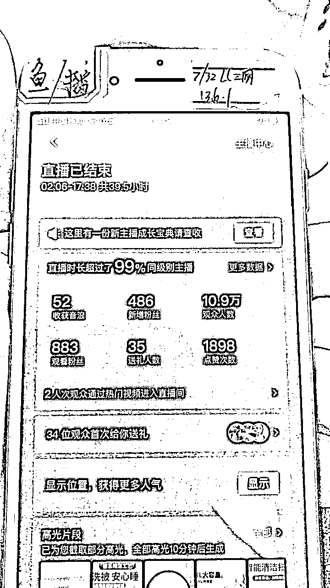
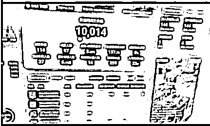
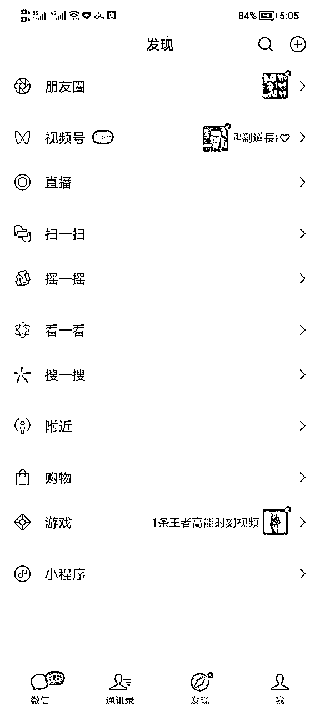
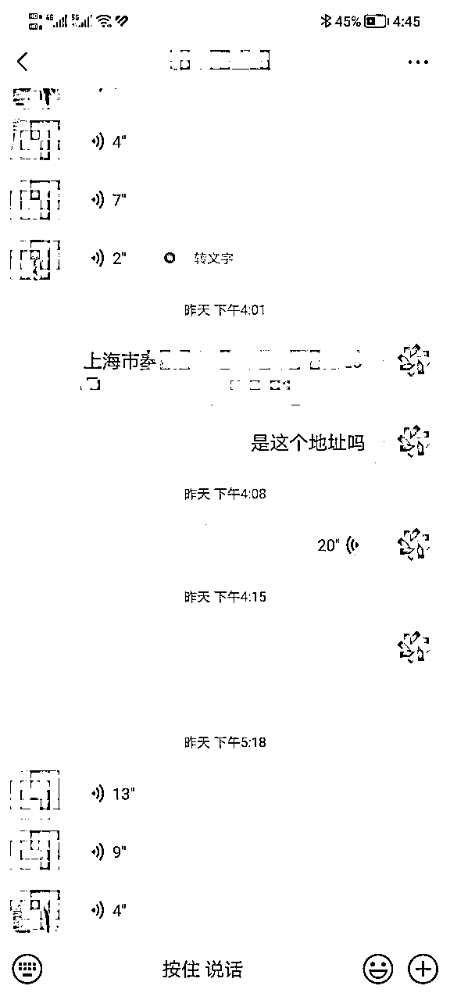
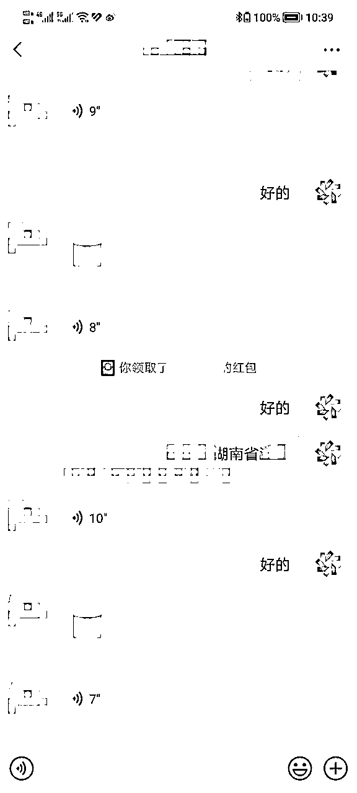
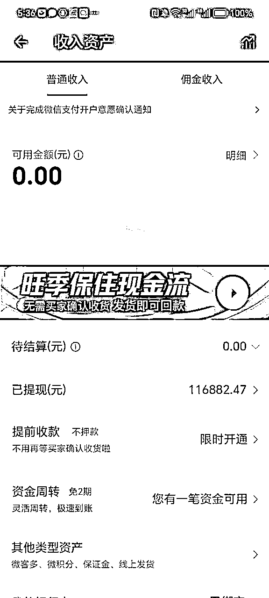
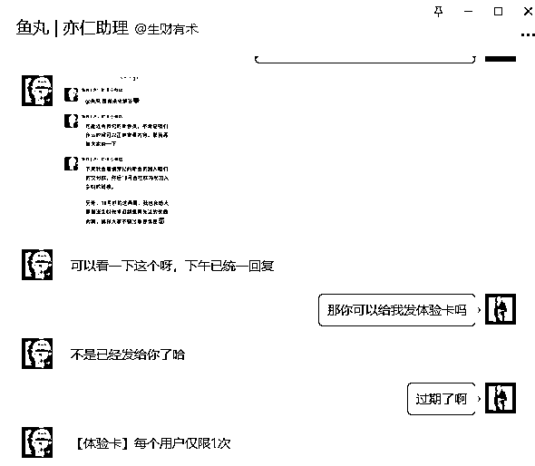
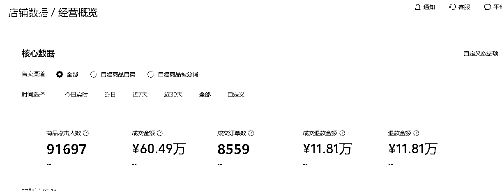
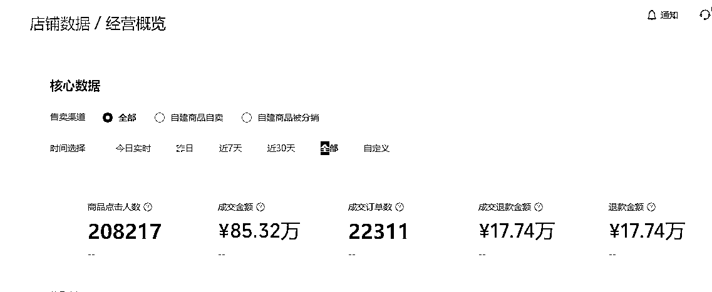

# 生财新人从抖音亏损到转做视频号利润50W+心路分享

> 来源：[https://paqni5a8o81.feishu.cn/docx/JmC4dzdc1omOl3xZ7RNcjXr7ncg](https://paqni5a8o81.feishu.cn/docx/JmC4dzdc1omOl3xZ7RNcjXr7ncg)

圈友们好，我是今年加入生财的新人。从去年十月份开始一直做视频号，目前为止累计变现50W+，其中视频号短视频三个月变现25W+,视频号小店四个月变现25W+。和很多大佬相比还是不值一提的。从今年加入生财之后一直在潜水，看到之前一些大佬的分享都令人佩服不已，今天也鼓起勇气来分享一下自己的心路历程，也算是对自己的一个总结吧，第一次发帖，希望大家多多指教。

先简单介绍下自己的背景，我是程序员出身。做了两年的程序员，后面就成为了一个连续创业者，不是在创业就是在创业的路上，做的项目有亏有赚，最终还背负了一点负债。转机在2020年有朋友邀请我一起合作比特币交易所，我主要负责团队的管理和项目管理，这年还清了所有负债，换了一辆车，手上还有了一点资金储备，因为老婆待产，然后我也在家玩了差不多小半年。当然赚这种快钱也为我后面做抖音埋下了失败的伏笔。习惯了赚快钱，而且长期处在管理的岗位不干活，慢慢人变懒了，丧失了跑通一个项目的执行力和行动力，觉得什么都可以花钱招人来干就行了。

为了篇幅行文的连贯，这里有必要讲一讲我做抖音的坎坷经历。在做视频号之前一直是在做抖音直播的，我是从2021年下半年开始接触抖音，中间走过很多弯路，其实那时候认真做短视频矩阵号是可以赚钱的，但是习惯了赚快钱，觉得直播来钱快，选择抖音直播，0粉开播的那种。现在想想，那时候新人小白做抖音赚钱的，几乎都是做短视频赚钱的，反而一上来就直播都是亏钱的。刚开始不懂，觉得这个事情找几个人合伙，招几个主播搞点货品投点钱就行了。前前后后换过好几轮合伙人，折腾了几个月没得到什么结果。因为几个合伙人都和我一样对抖音不太懂，都只是觉得这个事情可以做，结果可想而知。后来又花钱去武汉东西湖一个直播培训机构去培训，那个真是天坑，交了一万块钱去学习一个月，每天去那里上课。浪费时间精力就不说了，关键里面培训的东西现在看来很多都是错的，他的指导方向是不对的，我们那批学员中有做淘宝的，有在汉正街卖服装的，还有自己是工厂的，后面都没有一个直播做起来的，因为这事情导致我现在一直对知识付费这个事情不是那么感冒，万一遇上不靠谱的，浪费时间精力不说，把你方向带偏了，那才是最可怕的深渊，从那之后我再也没参加过任何付费类的学习，主要以个人实操突破为主。

我这边又折腾了几个月之后没什么气色之后，21年11月份的时候我喊来我老婆当主播，我来做运营。那时候也不会运营，不懂选品，去金华那边跑了几个厂家，差不多花了半个月时间选了个车品，就是那时候比较热门的洗车机。刚开播第一天我们就出了差不多十单，一单的利润有100多，那时候就觉得这个事情可以做，差不多播了个把月，每天的利润能在2000-3000左右。不出意外的话肯定要出意外了，当时我买了1000套配件给厂家让他给我配货，他担心风险没有配，然后当时疫情管控是比较严的，那边出了一个阳性，整个片区全部被封，好像得封一个来月。其实这个事情是可以解决的，协调一下供应链或者换同类型品先撑一段时间，只是比较麻烦点，然后我习惯了赚快钱，然后觉得这才刚开始随便选一个品都能卖，厂家不给力，那这个品不播也罢，就换别的品也一样，说不定还能赚更多，因为快年底了，就直接停播回老家了，找到了当时的一个直播截图。

22年上半年自己就不想对接供应链了，直接带抖音的精选，把全部精力放在直播上面，不去管后端，然后去玩那种清仓模式，无人直播模式，废店模式，觉得那种来钱快，这个废店模式导致我现在的实名都没办法在抖音开店。就这样总是死号总是换号，不是在起号就是在换号的路上，我们在线很少过230，所以没有拿到过几百万的大场观，其实算下来根本没挣什么钱，主要是非常的不稳定，可能一个月才起几个号，一个号运气好还能挣个几千上万，不行就换号，一个号播不了几场就死了。附上几张当时的图缅怀一下吧。有些时候不能看人家那些数据，那些数据没有用的，只能骗一骗小白，不能稳定持续赚钱的商业模式，最后一定都是不赚钱的。

去年那个时候割韭菜的也特别凶，起号之后很多割韭菜的挂那个直播带货收徒头像在我的直播间刷到榜一引流，我就很不爽，我自己起的号你来我直播间挂个收徒算哪门子事，把他踢出直播间，他居然举报我无人直播，真是难受，那个时候无人直播已经疯狂了，大家都在拼命割韭菜，什么无人陪跑三万，包起号几千，有经历过那段时期的兄弟应该能懂我说的哈，当时做无人真正稳定赚钱的还是收徒赚钱，我的号都是自己起的，因为没有拿到大结果，我自己也不愿意去当镰刀。搞清楚这回事之后，我也就跟自己释怀了，不瞎折腾了。后面就基本处于休息的状态了，那个时候很迷茫。

真正对我比较触动的是22年7月份，当时有个同城的兄弟卖玩具的那个月卖了好像200多万GMV。当时我去拜访过他，差不多跟我播洗车机是同时期一起接触直播的，也是夫妻俩一起播的，而且我刚开始的起步直播数据是比他要好的，他是一直坚持到现在才爆的，而我总是换来换去，今天搞这个明天搞那个。晚上一起宵夜喝酒的时候，看着他意气风发的样子，我心中感慨万千，回来之后我开始反思，开始思考自己为什么，开始找自己身上的问题。我让我老婆带小孩回老家去休息一段时间，这期间的过程很痛苦也很漫长，我差不多花了三个月的时间来反省自己。意识到了自身的很多问题，总结之前自己更像是一个投机主义者，习惯了赚快钱，在做抖音这件事情上没有任何的沉淀，对抖音的规则是很了解很熟悉也知道怎么做，就是没有做好，总是在追寻平台的脚本，总是慢一步，一步慢步步慢。将近一年做抖音失败的结果，通过这件事情完成了对自我的剖析，那个时候开始慢慢有了一点经商的领悟力和感觉。

十月份国庆回了一趟老家，回来之后就跟自己和解了。觉得抖音这个事情现在在做起来已经不可能了，手上没有沉淀的账号，也没有沉的淀团队。当时自己的预判是抖音比较难做了，想了解一下外面同行的近况，就冒充求职人员去外面找了一天抖音运营的工作，了解一下外面的环境，当时那些面试的公司给我的感觉就是都做的比较挣扎，但是获取到一个有用的信息，那天下午面试有一个做抖音规模很大的公司老板比较认可我的能力，他们打算开始入局视频号，和我聊了一些视频号的现状，想让我负责他们公司视频号的运营，他当时说了一句话，就是在抖音上做的比较挣扎的公司今年在视频号都取得了一定的结果，当时想着大佬都认可这个事情，说不定真的可以做。

回来之后就开始认真思考，开始研究视频号，因为以前做过小程序和公众号，所以对腾讯系的整个生态有一定的认知。当时自己也认定视频号这个事情可以做。对我而言，更像是一个重新开始的机会，反正在抖音上也没有任何沉淀的东西，那不如就在视频号重新开始吧。

确定好视频号这个赛道之后，我和我老婆一人选一个单品起一个号试水，幸运的是后面我们这两个号都爆了。那时候对搬运不严，还处于相对红利的时期，很多品和素材都属于蓝海没有人搬，再加上我们还是有一定选品能力的。我选的家电类产品，一单的利润有100多，利润率在60%左右，我那个号一个星期之后纯自然流连续爆了好几个几百万播放的视频，一条视频就可以涨粉几万。视频号消息超过1000条就会变成三个小红点，下面是一张当时的截图。

我的那个品选品中心没有，当时就在主页留了电话和微信号，那几天我的电话被打爆了，连续几天都在接电话，都是咨询产品和价格的，不分白天黑夜，经常同时好几个电话进来占线根本接不完，有的连续打好多次电话我们都在通话中，那些没有接通的电话就给人家打过去介绍产品和价格。接完电话就加微信，然后让别人微信转账过来安排发货，这里就体现出微信的优势了，因为视频号的人群平时用微信支付习惯了，所以防备心理还没有那么重，很多人就直接微信转账过来了，有的怀疑真实性的会打视频电话过来，我就让我老婆接，认真跟人家沟通讲解，类似于这种点对点成交吧，因为他做过直播，产品介绍这块基本没啥问题，所以成交率还是挺高的。附上几张当时的截图吧。

当时用户还有很多不习惯在视频号买东西，有很大没有网购过，很多有货到付款的需求，就和京东签了一个货到付款开了一个户，担心货到付款发过去了人家不要，那这样就需要贴来回运费了，那些需要货到付款的我们就先登记，后面一个个打电话过去确认好是不是真的要，统计好数量之后然后从厂家那里进货来自己发，后面这批货到付款真正拒签的其实也很少。那段时间接打电话太频繁了，电话卡被误以为电信诈骗强制停机去营业厅解封了两回，两个微信也经常被提示异常，加人太多会异常没办法收款，我们尽量都是让客户来加我们，确实不会操作的我们就自己加，光微信就差不多加了3000多号人，那个星期大概赚了5W+,中间又断断续续小爆过几次，后面陆陆续续这个品到年底一共变现了20W+。我老婆那个号选的车品后面也爆了，他那个号我没有花很多心思在上面，大概一共变现5W左右吧。那个时候整个人就更务实了，认真的对接供应链，耐心回复客户消息，做好私域承接，不再像以前那么浮躁了，慢慢觉得自己更像是一个电商人了。

其实在整个过程中还是有一些细节没有处理好，整个过程都比较手忙脚乱的，中间视频爆了本来想开直播的，但是当时对视频号直播规则不熟悉，担心违规之后对账号有影响，怕被封号或者限流，因为只有这一个号，不敢帽这个风险。选品中心没有我们这个品，当时对入池和小商店不太懂，那时候有风声说后面全部要换成微信自己的小店，后来做了一个微店小程序做商品链接挂在主页来承接，但是那个时候已经是流量衰退期了，下面是微店的截图。

很多流量我们自己没有消化转化掉，那些就跑到其他电商平台去了，后来自己开了一个拼多多店铺，把同款商品放在拼多多上面来接我们自己溢出的流量，这样客户去拼多多搜也是我们的店的商品，但是这种客户一般都是比较挑剔的，在没有任何操作的情况下拼多多也出了几十单，但是和我们总单量相比还是太少了，所以这一块也没有主做，不过拼多多仅退款太坑了，用了几个月居然还能退款真是神奇，而且平台居然自动同意，没有仔细的研究拼多多，今年果断注销拼多多店铺了。我们没有第一时间做矩阵账号，后面再去做新账号就老是违规了，还有一个确实是精力有限，因为所有的事情都要去对接，从出单到发货到售后，每一个客户都是认真对待的。后面疫情放开之后我和我老婆相继也阳了之后也在透支体力做售前和售后，整个人精神状态也差，其实当时可以做到更好的。

今年差不多三月初过来武汉这边，去年的几个老号流量就已经大不如前了，来了之后差不多玩了半个月，思考了一下人生。后面开始思考今年要做的事情，其实当时已经有知道生财这个社群了，大概是去年年底的时候在直播间听别人连麦，有人说自己一直没赚到钱，也加入了生财有术还有一些什么其他社群，但是自己认知不够，没有赚到钱。当时就记住了生财有术，比较好奇这个组织。当时在淘宝买了盗版帖子有空的时候会去翻一下，看一下大佬的分享，因为是盗版比较有限只能看精华，专门挑视频号的去看。真正让我决定付费加入的是因为生财的一篇帖子，那个是当时三月份的时候鱼丸给我发消息发了一张体验卡，可以查到生财所有帖子。

我翻到22年底时间段的时候有一个英文名叫summer的大佬分享的视频号小店的玩法，给了我很大的借鉴和启发意义，这是我当时唯一能找到的关于视频号小店的分享经验。经过研究之后我觉得非常适合我来操作的，因为我本身具备比较强的选品能力，而且有一些对接供应链的经验，对我来说上手其实并不难，原文我已经翻不到了，在此郑重表白感谢summer大佬无意间对我的帮助。因为之前是看的盗版其实并没有发现这篇帖子，其实知道的时候有点晚了，那个时候已经是三月份了，那篇帖子去年就发出了。之前看盗版一直没有加入生财，但是因为summer的这篇帖子，我觉得生财值得我付费加入，后面就预定了今年4.18的会员，当时的价格据说还是比较划算，因为我也是第一次加入。

预定完会员之后要等到4.18才能加入会员，那个时候已经3月中下旬，就开始做视频号小店了。其实当时也分析了一下形式，觉得summer大佬分享的帖子在那个时期做的时候还处于蛮荒时代，小店和商品还比较匮乏，那种矩阵店群模式现在可能并不适用了，而且一开始我也不太适合直接上来就做矩阵店铺，但是当时结合自身在视频号的经验，以及他的分享得出了一个核心结论，就是视频号小店这个事情可以做，至于成败与否，就要看自己了。因为时间精力顾不过来，二是基本模式还没有跑通。所以一开始只做了一个店铺进行尝试，我们做过一段时间的抖音，本身选品就是我的强项，我大概知道什么品开什么价格开多少佣金比较合适，达人会比较愿意带，我想着应该把自己的优势发挥出来，所以当时我决定手动化精细选品上品，把每一个品当做爆品来做，先做一个店铺，先把模式跑通。在上品的过程中我从来不参考同行，因为我觉得这样会增加上品的时间成本，所以在整个上品的过程中完全凭自己感觉，在抖音快手视频号拼多多淘宝还有一些第三方软件各种疯狂找品，觉得合适的品找好之后，定价多少，佣金多少，完全随心而定，因为我相信，跟我有同样带货调性想法的人会认可我的价格和佣金，会选择带我的商品。三月下旬开完优选之后就开始上品，先做了一个百货店，每天大概只上30-50个商品左右，大概上到200-300商品左右，店铺就开始陆续出单了，但是都是零零散散的几单，收入也是很不稳定的，其实那个时候也不知道结果会怎样，只是觉得可以做。

那断时间压力也比较大，我老婆也不太能理解我，觉得去年明明短视频带货能赚钱为什么就要突然做视频号小店去了，从视频号前端直接转做后端，我自己的想法是后端做起来之后再做前端，整个业务模式会更加稳定，但是就意味着要暂时放弃掉视频号前端带货了，因为时间精力确实有限，只能二选一，所以这个事情是没有失误空间的，失误的话上半年几乎就等于要废掉了，对我来说是一个比较大的冒险了，一直记得雷军造车的那句话，押上自己人生的全部声誉来造车，其实这句话对我触动蛮大的，它体现了一个创业者在做一件事情的决心和对自己能力的自信。所以当时其实是基于自己对视频号的认知和自身能力的感知，用半年的时间来押注视频号小店。在当时那种情况下确实不知道前路究竟如何，就给自己定了一个三个月的目标，如果三个月没有起色这个事情就放弃掉了，再重新做回前端带货。那时候每天晚上会去跑步，在暗黑的夜晚沿着马路人行道跑几圈，马路的尽头和我现状好像已经融为一体，前方一片漆黑，只有微弱的路灯照亮前进的方向，望向道路的远方，好像看不见尽头一样的未知，我自己在心中默默跟自己加油打气，告诉自己一定可以做到的。上架到500商品的时候已经偶尔有商品开始小爆了，后面就让我老婆负责再做一个图书店，因为她之前做过抖音图书直播，对图书版块比较熟悉一点，选品这块会比较好选一些有感觉一点。大概到4月底5月初的时候，我们两个的店铺都开始爆单了，当时随手拍了一个视频。

店铺爆的比我预想中的要快一些，本来想多拓展几个店铺的，但是因为每天都要发货处理售后，5月份用来上新品的时间并不多，导致6、7月份总体销量是有一定下滑的。目前我们只有三个店铺，能稳定出单的就两个店铺，后面我们又招了一个人做了一个新店，也是教他精细化选品，但是那个店铺到目前为止一直没有什么起色，可能还是他的选品感知能力没有达到要求。我们目前为止没有对接过任何达人，全靠选品来维持，从某种角度来看，当初做抖音还是沉淀了一些核心的选品能力，在做小店的时候派上了用场。主要是时间精力有限，一般小达人也不会去对接，如果是在我们爆过大单的达人会去对接一下，但是也很难留住。我在达人对接这块比较佛系，一是达人合作这块比较不稳定，流动性比较大，对接精力有限，那个时候也尝试接触过一些达人，因为我在短视频直播领域知识储备还可以，很多达人都是刚转做视频号的，有一些达人跟我一聊就聊嗨了，什么问题都跑来问我，我就差自己亲自直接下场跟他把账号做起来了，感觉时间成本很不划算。二是本身我们是做过短视频和直播的，有一定这方面能力，原定的计划就是视频号小店做起来之后下半年会往短视频和直播方向发展，这样会让整个规划更有深度，所以批量对接达人这块一开始就没有在规划范围之内，全靠选品佛系出单。目前三个店铺总计GMV120W+，利润25W+。

我们目前的小店的模式主要还是通过选品来支撑，所以我建议有选品能力想做视频号小店的目前还是可以入局的，如果选品这块基础比较薄弱的我个人更建议直接做前端带货跟品，不建议直接上手做视频号后端，会让自己做的很焦虑。关于选品这块，生财帖子里面有很多讲的非常好的，在这里我就略过不表了。

下半年打算开始发力做短视频和直播这个方向，沉淀出更核心的短视频直播能力和团队，目前还在规划中，给自己一点缓冲时间，在做事情之前我喜欢考虑很长一段时间，也许叫自己说服自己更贴切，或者叫长跑之前的心理准备，所以现在让自己静下来之后才有时间来完成这篇文章。目前店铺基本上就维持正常运营就好了，目前也不考虑做很多店铺了，出了新规之后单店铺的运营成本和精力会更高了，我们这种无货源模式做多店会非常累。因为自己没有核心的带货能力，始终是一条腿走路是不稳定的，自己有店铺带货的话利润会更高一些，价格利润方面可以设计的更加灵活一点，视频号小店可能会有做不下去的时候，但是有了核心的短视频和直播能力，未来在哪个平台都是有一席之地的。前段时间测试了一下视频号直播，差不多播一场利润好的时候也可以有一两千。目前对于我个人而言，在视频号领域，整个前端和后端两个领域基本上已经算是跑通了，带来的一个好处就是在做了后端之后对这个电商的商业认知好像更加开阔了一些，好像也没有必要一定要把自己限制在一个框架里面。未来主要还是在视频号这个平台发展，也许有一天会回归抖音吧，前提是在自己能取得一定的结果和认知之后，因为做抖音是失败的，心中始终还是有点不甘心的。

当然目前自己和生财的很多大佬还是不能比的，有的时候看到大佬的分享真的非常佩服各种大佬的神仙操作和商业模式，就觉得自己真的好笨，自己还有很多提升的空间。

因为之前一直处于一个比较封闭的状态，在做抖音的时候人是比较漂的，也比较浮躁，很多事情没有考虑清楚就一头扎进去了，失败是必然的，其实如果之前不那么浮躁，把抖音做好的话是其实也是能拿到大结果的，可惜没有如果了，最好的时机已经错过了。在决定做视频号之后更多的是处于一个自我突破，自我沉淀的过程，自己与自己死磕，慢慢找回自己的思考力和执行力，逼着自己亲自去做很多事情，去把每一个细节执行到位，当然整个状态也是比较封闭的。这篇帖子与其说是分享，不如说是一个自我总结与回顾吧。

我希望通过这篇帖子，也算是对自己的一次尝试，让更多人认识自己，来结实更多做视频号的朋友，链接到一些同频的朋友，本人目前定居武汉，也非常希望能结实更多武汉同城的圈友，我目前比较擅长的的领域是抖音短视频直播，视频号短视频、直播、视频号小店。欢迎圈友交流，交流微信:hbutacm,加我备注生财。

在此非常感谢生财有术，非常喜欢这个平台，感谢鱼丸指导我发帖，关于发帖和飞书这块都不太懂，感谢鱼丸的耐心指导，第一次发帖，能够让这么多的创业者和大佬看到我的分享，是我的荣幸，希望大家多多指教。