# 火遍全网的视频号暴利起号玩法攻略

> 来源：[https://iqwin9cn5r.feishu.cn/docx/KKsrdIXoLotvnqxiXHgcWwYYnbc](https://iqwin9cn5r.feishu.cn/docx/KKsrdIXoLotvnqxiXHgcWwYYnbc)

## 前言

生财有术的圈友大家好，我是梵野，见贴欢喜~

我是一个90后宝妈，也是一个在网赚赛道深耕8年多的普通人。

8年期间我做过很多项目，一直也是追着各种风口再跑，最早做的是闲鱼无货源，后面有相继做了抖店店群，多多视频矩阵，视频号搬运+直播，小红书店群+私域引流

个人经历就和千千万万个网赚圈的小伙伴一样，普通而多彩

对于这部分感兴趣的可以移步，先看看我的这篇精华帖：

《3个月多多视频只赚了7万，我踩了哪些坑？》https://t.zsxq.com/10jowBazw

加入生财三年了，我很少写文章，并不是说不愿意分享，因为自己实在是文笔有限，很多想要写的东西发现当我打开文档准备敲字时候就不知道从何写起了。

看了很多大佬的项目文章，觉得他们写的是真的很好，调理清晰，框架明确，逻辑严谨，是我一直想要学习的一个技能，再加上每天都在实操项目，一天下来时间精力消耗的七七八八了，晚上就想躺平，惰性战胜了理智，所以一直基本没什么好的输出分享，说来惭愧。

这篇文章我将尽我所能，把我认知中的视频号赛道的玩法详细剖解，文字较长，可能会占用你20分钟左右的阅读时间，望深读。

## 一、项目介绍

微信视频号是2020年1月腾讯就开始内测的短视频平台，区别于抖音快手，我认为它是一个有更多社交场景属性的平台，是基于微信的使用，可以进行好友之间的点赞、评论、互动、分享，所以可能也是因为这样，最开始他的推出并没有引起太多人的关注，属于润物细无声的感觉，在不知不觉间渗入到你的生活，成为了一个习以为常的使用习惯。

下面从几个视频号变现的发展节点，来讲解一下视频号玩法的更迭

## 二、视频号的历程

### 1.视频号1.0时代

更多人听说视频号是风口应该是在22年3月左右，我是4月份开始做视频号的，那个时候我还在做抖店和多多视频，在生财看到了关于视频号带货的信息。

因为已经在做多多视频带货，所以我就抱着尝试的心态入局了视频号短视频带货，当时还属于视频号的野蛮生长期，只要简单搬运，品和素材对了就能爆单的时候。

当时我也根本不知道视频号的情况，用了三个号来测试，结果歪打正着，我三个号其中一个号，第二条视频就爆了800多万播放，带货佣金收益5W+（当时太激动没有保存收益图，仅截图了一张简单的播放图，大家凑合看看）

也正是这一条视频让我认识到了视频号的潜力，于是我迅速关掉了几个半死不活的抖店，把多多视频调整为了流程化操作，尽可能节省时间来做视频号短视频带货，抓住了野蛮生长期的小尾巴，扩大矩阵，放大复制，取得了不错的收益。

### 2.视频号2.0时代

可能是平台初期缺内容，对于搬运有一定容忍度，那个时候只要你知道视频号带货，动手了都或多或少都能赚到钱。

22年5、6月时候，直接搬运就显得后继乏力了，但是面对如此大的红利市场，各位大佬也是各显神通，于是有了5、6月份时候的中医书单，无人直播，半无人等等各式各样的新玩法，当时这些玩法造就了很多收益神话。

我现在团队的好伙伴，就是就当时做中医书单一晚上20W+佣金的大佬之一，如果你一直实操在视频号第一线一定经历过这个时代的可怕爆发。

### 3.视频号3.0时代

22年7-9月涌入了超大一批的新人，因为这个时候，大家都接收到了视频号风口的信息，很多人开始入局，这其中以新人居多。

但是不幸的是这一阶段，因为受之前玩法的影响，更多新人进来就是做无人，做中医书单相关的，但是平台明显对于这些操作容忍度加强了，于是出现了大批量的封号，0播。

很多新人抱着一颗发财的心，结果却迎来了一波死号封号0播，这一阶段，90%以上的入局者都每天在经历这样的事情，搬运、0播、小爆、违规、继续搬、0播、0播、注销解绑、继续搬、继续0播、用骚套路测、0播、混剪、依然0播、注销重启、无人直播、封号、封橱窗、心已死、最后打算放弃、看到别人有出单、不甘心、搞新号继续、几十播放然后尝试无果后，就放弃了，觉得视频号不是一个像大家鼓吹的淘金圣地。

但是其实当时我在反其道而行，因为我没有无人直播经验和环境，我就是在家里的阳台上办公，孩子还小比较吵，所以一开始我就没有去做无人直播，而是一直在做搬运的测试，虽然没有一开始那么暴利，但是也一直有稳定收益。

### 4.视频号4.0时代

可能很多人没有听过这个阶段，因为它是我自己命名的，这个阶段其实就还是最早的1.0时代玩法的更迭。

当时没有无人直播条件的我，一直在测试怎么样的搬运可以存活，于是当大家把目光都放在无人直播中医书单的时候，我就在思考，既然爆款视频不能过重死号，那是不是蓝海产品和素材就可以，于是我和几个好朋友就一起坚持在测试蓝海搬运，也总结出一套行之有效的方法。

这个玩法直到现在也依然适用，我自己也有账号一直在做，我们一起做了三个月左右，稳定收益后，开启了一期视频号蓝海训练营。

我们都没有做过培训，之前都是自己做项目，没有什么培训经验，就怕交付不好，所以当时只收了100个小伙伴，每一次的直播课我们都两个小时候的详细讲解，甚至直接把我们自己正在赚钱的账号拿出来给大家讲解，好在还取得的了不错的结果，也进一步验证了这个玩法的正确性。

100个小伙伴，据不完全统计，有人一周赚了20W+佣金，月佣金5W的有5个，破W的有21个，还有更多大几千小几千佣金的，蓝海搬运放在现在也依然可以玩

具体玩法可以参考我们优秀小伙伴橘子海的的精华帖：

《视频号还能做吗，三个月通过视频号赚20W》 https://t.zsxq.com/10MT6mblY

### 5.视频号5.0时代

22年11月-23年3月左右，是视频号0粉直播的时代，当时我和几个好朋友迅速组队，在杭州开了自己的小工作室，起了四个直播间，专门做0粉付费直播，一路从防疫品到养生品，付费0粉。

我们首打的几个新品，都做到了很好的ROI和GMV，以至于引起整个直播广场跟品的，如果你当时有在做0粉直播，你一定有刷到我们的直播间或者有可能跟过我们首打这几个品，除菌卡、甘草干姜汤、茯苓酸枣仁睡眠茶、黄芪霜，有的品现在直播广场依然很火爆，我们也一直持续在做0粉付费直播。

### 6.视频号6.0时代

6.0时代，也是今天着重想要拆解给大家的玩法。

如果你有关注视频号，一定发现从6月中到现在，视频号直播广场被一种玩法霸屏了，9.9暴利单品起号，先给大家看几个案例直播间：

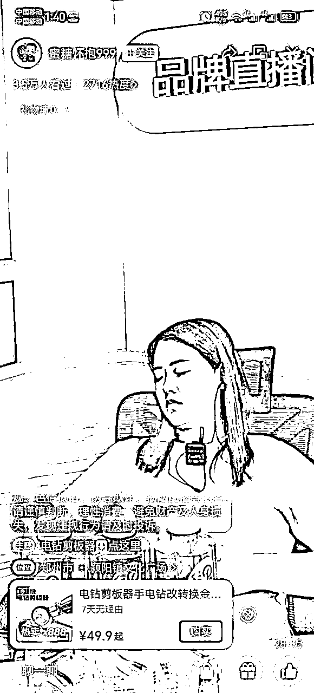

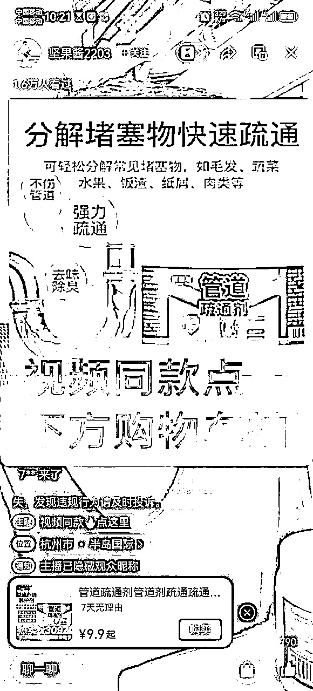

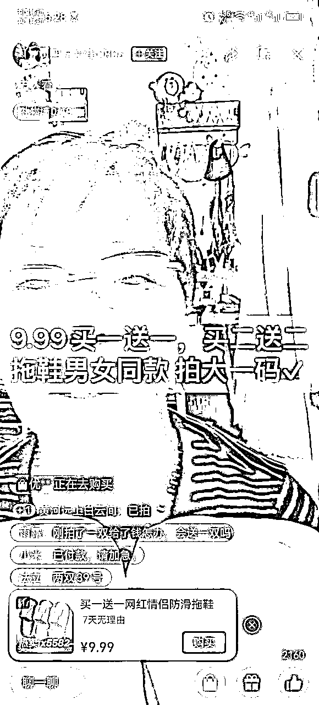

你现在打开视频号直播广场，一定能够看到类似这种的直播间，简单的直播场景，甚至样品都不需要，一张产品贴图就行，价格直接写出来引导购物车下单，居然出单都在几千单，一天GMV都在大几千和几万块，佣金比大概40-50。

也就是说一个这种简单的直播账号，一天就能够产生几千几万的收益，这也是为什么我叫它为视频号暴力单品玩法。

这玩法我们第一时间发现后就开始做了，现在也完全跑通很多账号，爆过很多次的几千单，今天把它详细的拆解给大家。

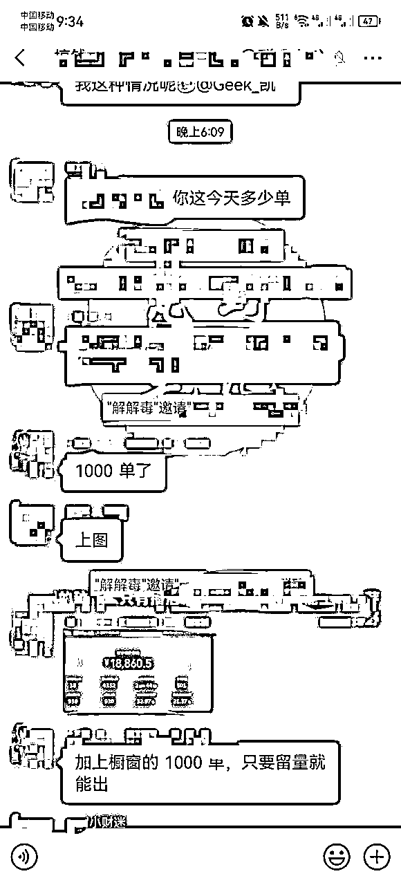

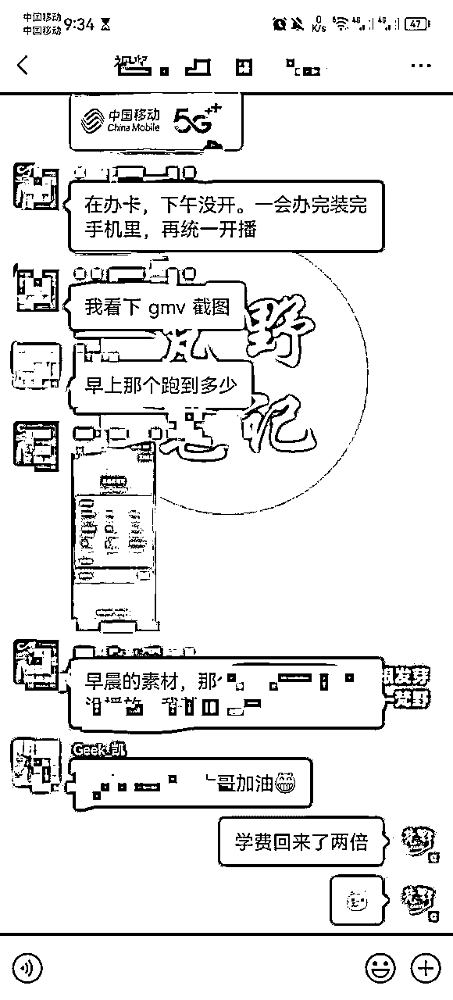

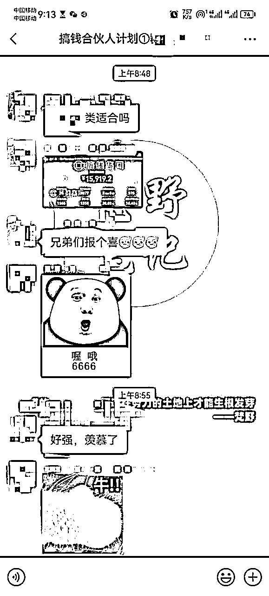

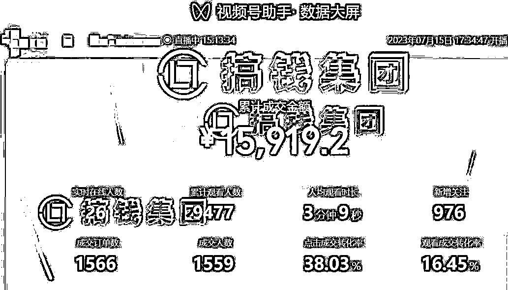

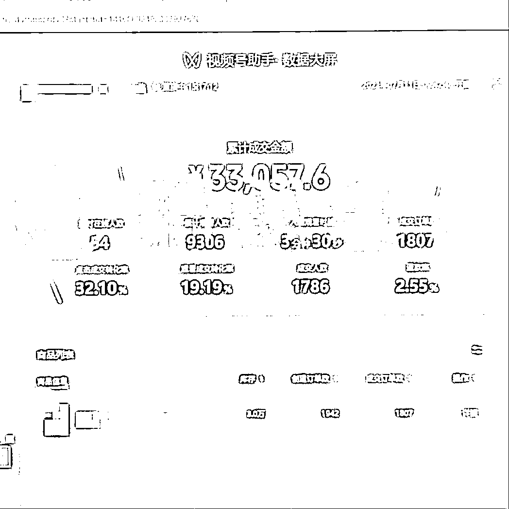

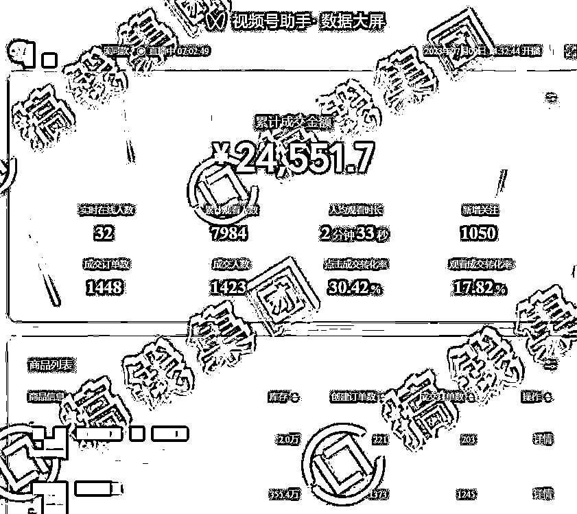

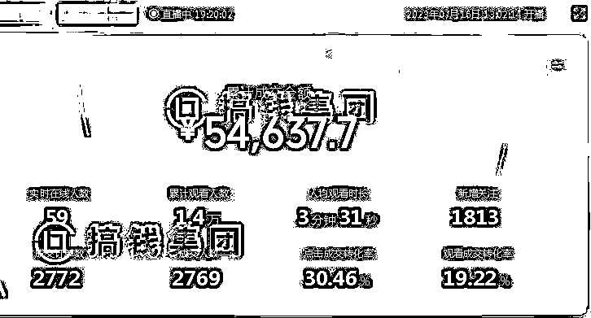

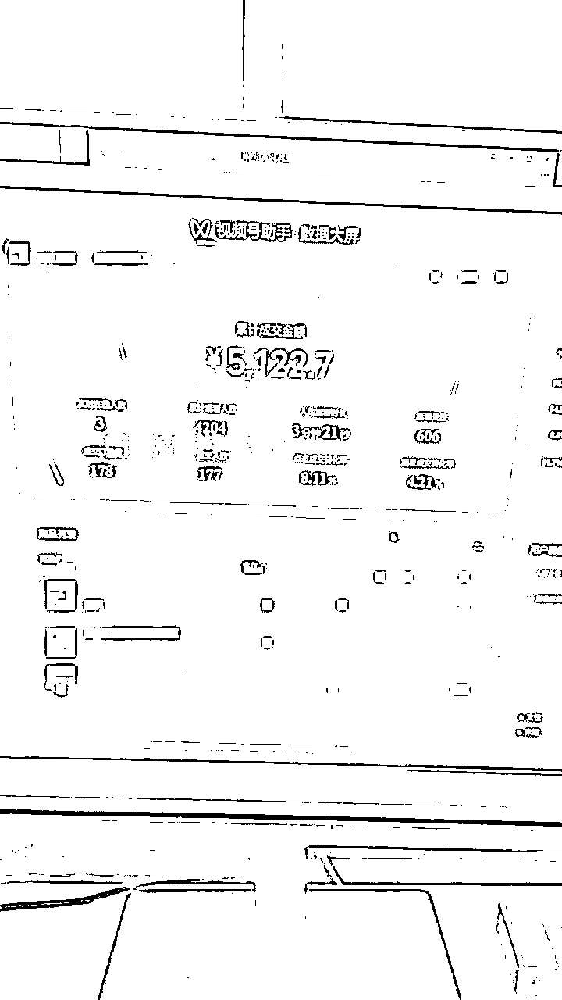

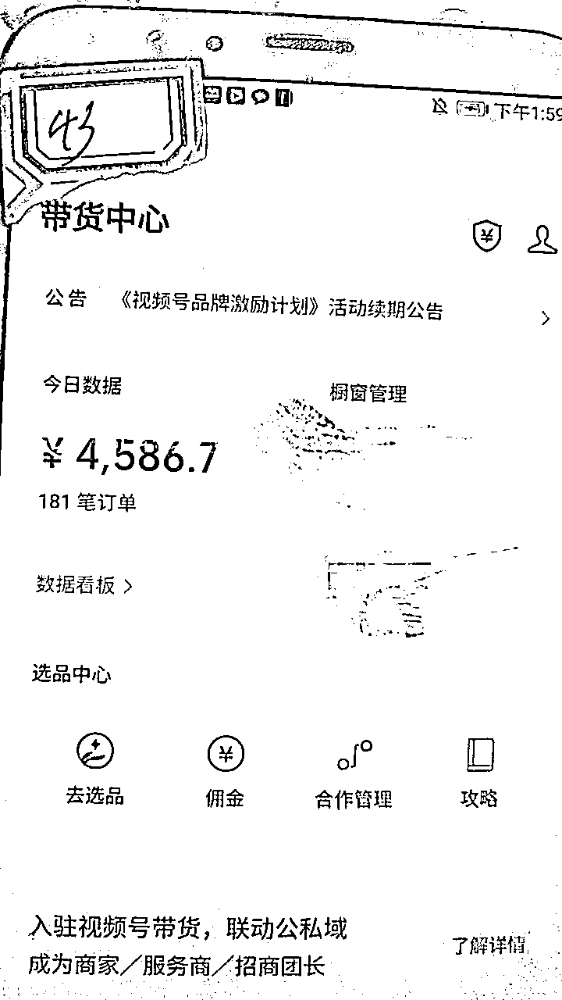

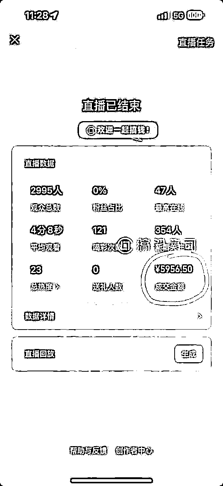

## 三、适合什么样的人入局？

### 1.做过视频号的人

一定是你已经做过视频号，对于视频号的基础操作没问题的，因为这玩法就是赚快钱，如果你没有接触过视频号，那可能等你研究明白基础操作，这个玩法已经成了过去式

### 2.有很多账号的人

一定要有多账号，本身就是废号流，一个账号存活的时间很短1-3天，如果没有多账号，不建议入局。

因为本身就是靠多账号起号，当然账号目前有很多解决办法，一个人你可以五个微信，也就是五个视频号，可以找家里人亲戚朋友或者找人合作提供号，租号，分佣模式，都可以做到多账号。

### 3.能出镜直播的人

一定要能出镜直播，有很多人不愿意自己露脸直播，怕被熟人看到，怕不会说话直播丢人，但其实可能是你自己想的太多了。

当你一场直播赚了他们几个月工资时候，还有什么可不好意思的，而且可以去看看这种直播，90%以上都是素人直播，不需要你有什么复杂话术，能简单说清楚怎么下单就行。

我认为，项目本身是不挑人的，但是每个人的资源经验认知不同，取得的结果也就自然不同，所以做什么项目之前，最好是能够清楚知道项目需要的能力和经验和自己是否匹配，才是做一个项目成功的开始。

因为别人赚了100w并不代表你做了你也可以，赚钱一定是从能够得到的第一块钱开始。

## 四、暴力单品玩法流程：

下面详细讲解一下我们目前的全流程，如果你执行力足够，一定能够分到一块蛋糕

### 1.选品

既然是单品玩法，选品肯定是最重要的，很多人上来就去抄同行，其实这种方法不尽然，抄也讲究一个方法，如果别人已经大爆的，基本满广场都是跟品的，你能够爆的概率微乎其微。

这也是我一再强调的，要会抄，如果自己没有选品把握时候，就去多刷广场，刷到刚起爆的高转化的直播间，再去跟，这里一定是要选刚起的品，刚起的直播间，播这个品的直播间不多，直播间场馆大几百人就能出几百单的最好。

切记不要跟大爆品，不要跟满广场打烂的品

那自己选品该怎么选？我个人总结的经典四要素：低价、实用、新奇、符合中老年

低价是指最低价个位数SKU，是能够常用到的，不是标品不是超市和身边能够买到的，符合中老年使用场景的

下图是我在今天直播广场首页截图，可以看到圈起来的基本都是满足我上面说的几点

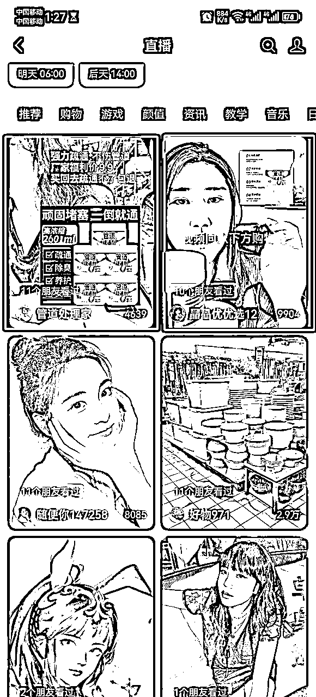

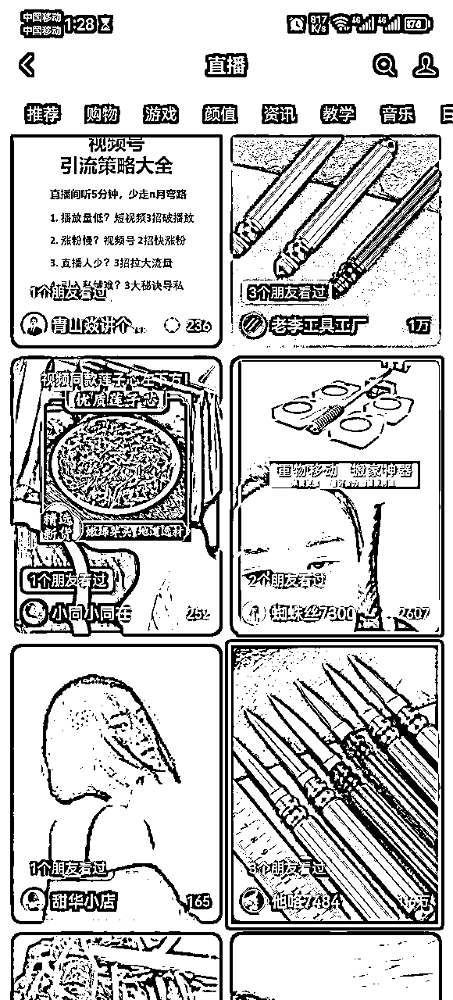

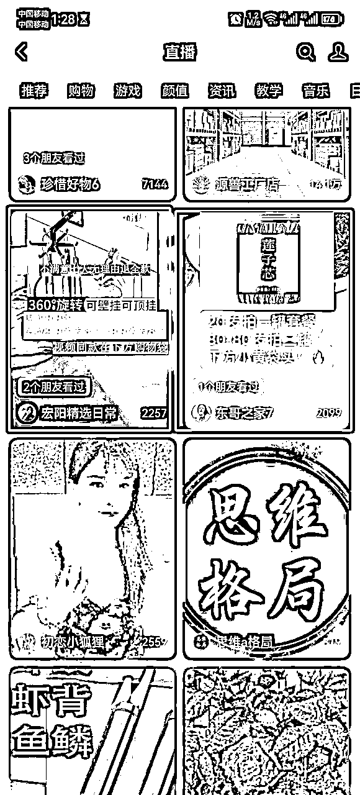

### 2.选素材

这玩法核心就是短视频引流到直播间成交，所以短视频素材就决定了进入直播间的流量，也就决定了成交

选素材有几点要素：

*   要有营销属性，能够充分展示出产品的使用效果，起码看了是能够产生冲动消费的

*   最好有真人讲解，不要只是怼着产品拍摄的，视频号主要是中老年，出镜讲解的能够提高信任度

*   配音是简单明了，老年人能够听明白这个产品作用的

下面是我截取的几个今天爆品素材图，也是符合我上面总结的这几点要素：

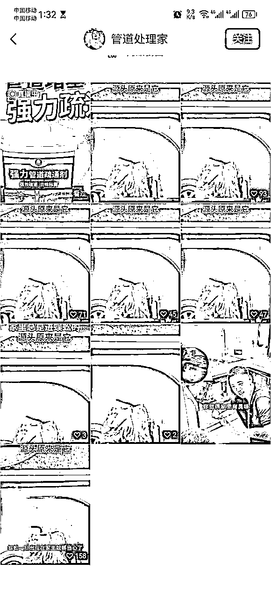

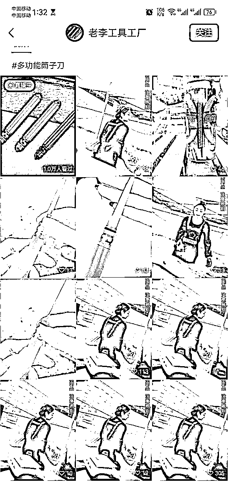

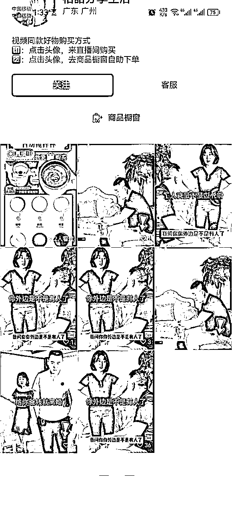

### 3.剪辑

用剪映制作一个模板，加上滤镜贴纸即可，不用混剪，目前单品不用混剪，简单剪映模板过重就行，一个素材如果跑出来就可以重复用，所以剪辑的时间很快的，建好模板一条只需要几秒钟就可以。

之前录制的剪映模板制作，大家可以做一个参考

### 4.发布

选好品，做好素材后，开始发布。

先发一条看看流量，如果不是个位数和两位数说明素材是OK的。

这个时候就可以直接开播了，开播后会拉升视频流量的，所以基本有个100-200播放就可以直接开了，开播过程中观察视频流量，如果不推流了，就补一条素材。

但是不要以为补的越多越好，一定是前一条不推流了再补

### 5.直播

视频破100-200播放就可以开播了，手机或者电脑开播都可以，因为才开始发素材所以一开始推流会比较慢，只要有流量就不要下播，坚持拉时长。

这也是一开始为什么我说一定要能直播的，虽然说是快钱的项目，但是也不是代表你就可以躺赚，拉时长是一定的，要能耐住性子，慢慢拉直播，一边播一边补充短视频流量。

低客单容易成交，密集成交做起来了，直播间基本就起爆了，如果爆了，出单还可以，想办法弄样品（叫跑腿美团比较快）。

6.话术

直播简单话术：

欢迎新来的哥哥姐姐，哥哥姐姐看了想拍的的朋友抓紧去拍今天 9.9 就最后几单了，厂家做福利等下就没了！！

拍完赶快打个已拍加急！要不然明天才发货，你打了我今天就加急，姐姐们拍了这可以给我点个关注！关注我后面可以来我直播间买更多好东西！

流量起来了再去推高价格 sku ：

哥哥姐姐们，我们这个产品主要有 xxx 功能，今天直播间呢个 19.9（打比方）链接最划算，你想想这个东西你家很多地方都能用，今天 19.9 比 9.9多了很多福利（根据产品具体扩展）。

所以你们别犹豫都去拍 19.9 的拍完赶快打个已拍加急！要不然明天才发货，你打了我今天就加急，姐姐们拍了这可以给我点个关注！关注我后面可以来我直播间买更多好东西！

基本流程就是上面四点，玩法随时在变，不变的是千千万万网赚人的不断测试和尝试，在这里真诚的分享给生财的圈友，有做的好的大佬欢迎一起交流和成长！

## 五、思考总结：

项目做了一个月了，赚快钱的体验就是，真心累，但是累并快乐，因为他的正反馈是很快的，能够支撑你一直坚持做下去。

从接触网赚到现在8年时间里，做了很多项目，追了很多风口，也经常有圈友加我说，你可真厉害，做什么都能成功，但是其实我不成功的项目更多，踩得坑绝不比任何一个人少。

但是一直让我坚持下来的就是自己那颗不服输的心，还有周围一圈真心交心的网赚小伙伴，我目前的小团队也都是在这一路中认识的朋友，彼此气场契合，真诚利他，价值观一致，确实很重要。

网赚赚的不只是钱，更多是圈子，有一个好的圈子胜过你自己孤军奋战几年，就像生财一样，一群真诚利他的圈子，一起拆项目，做项目，讨论项目，这种氛围真的很棒。

最后再说一句，项目千万变，思维永不变，一步一个脚印切记好高骛远，你今天所做的所有事情都将成为你下一个项目的积累，积累到一定地步，必然起飞！