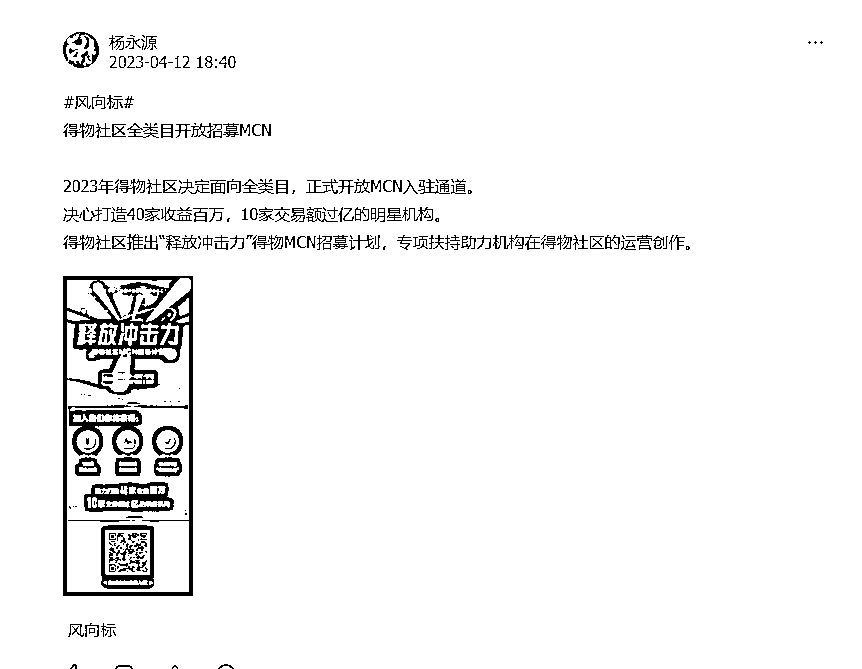
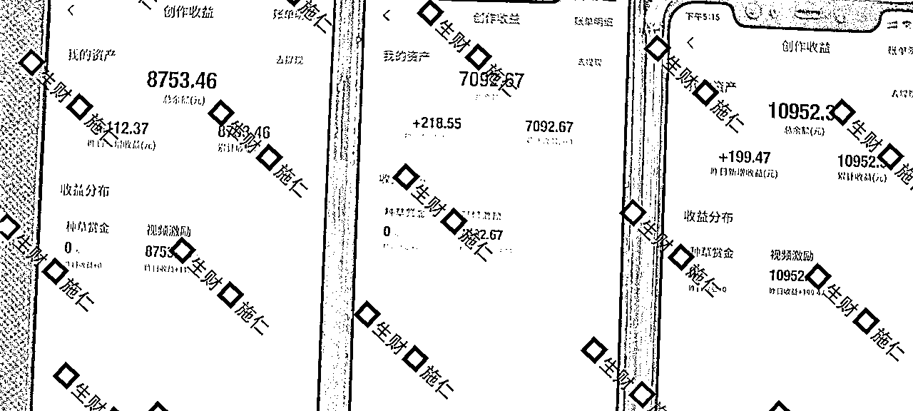
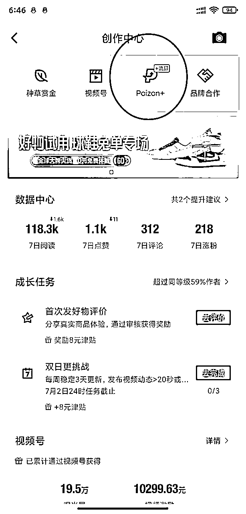
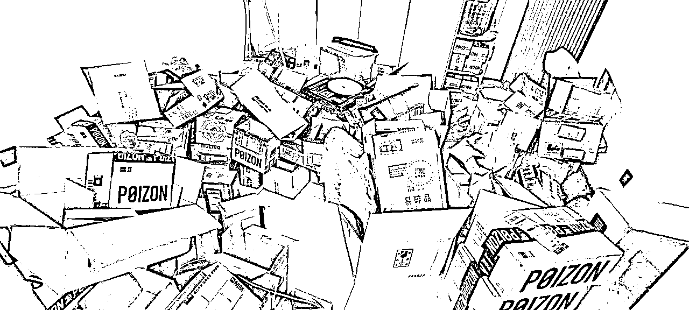
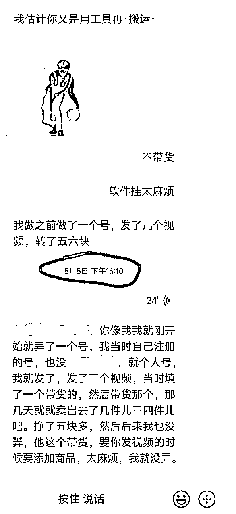
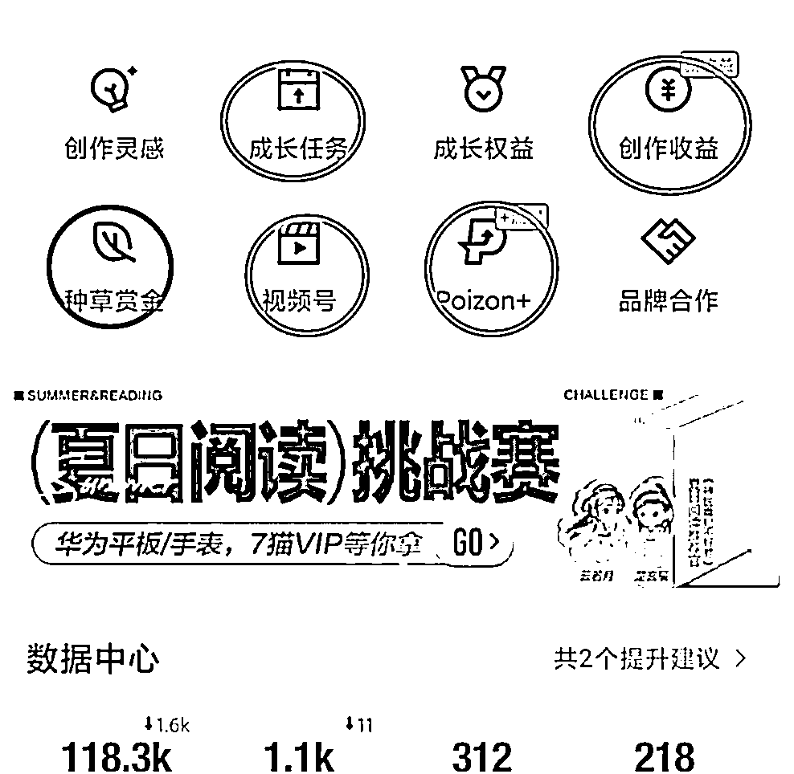

# 新人入局得物，保姆级教程，单账号变现破万。

> 来源：[https://udxxg5rx5m.feishu.cn/docx/KXdsdKeSEoBj5cxMsxocqFR8nXe](https://udxxg5rx5m.feishu.cn/docx/KXdsdKeSEoBj5cxMsxocqFR8nXe)

大家好，我是施仁，

生财我最爱的就是风向标，

几乎有时间就会在上面溜达，

不知道四月份有谁注意到这个风向标。

当时看到的时候我就专门留意了一下，

可能很多人觉得MCN离自己八竿子摸不这边，

可是你们仔细想想，

得物扶持MCN是为了什么，

不照样是为了得物社区的生态，

MCN下面不就是一个一个的账号么，

因为女朋友经常玩得物，

我就想着研究一下，让她有个小副业，

当时还特意在生财搜了搜得物相关的文章，发现并不多，

只能自己一步步摸索。

我是从4.15号开始做的得物，

目前过去两个多月了，

随手拍了手边三个手机的收益，

给大家看下我这边的结果，

试错的时候浪费了不少账号，

目前已经算相当稳定了。

其他号就不放出来了，

最好的号估计没几天就要破3W了，

当然得物还有一些其他花里胡哨的玩法，

不过这次主要是分享个人得物号变现教程。

不废话直接干货。

# 一.注册养号

得物养号大概需要一周左右，

手机号注册，

注册后头像名字可以先不急着改，

每天在上面正常的浏览点赞评论，

1-3天，可以拿10-20分钟在这上面，评论一两条皆可，点赞可以3-6个。

第四天开始可以花30-60分钟在上面，点赞评论随意点不要太多都行。

这个时候可以把头像名字还有个人资料改成符合你视频类型的内容，

第四天开始，发1-2个作品，20秒以上，

发到第七天后就可以去申请视频号收益了。

# 二.视频号变现

申请通过后就好说了，每天作品发布在2-3个，坚持发。

两周左右差不多就能看这个账号有没有潜力了，

发布视频的时候一定要注意一点，封面一定要调整，

不能模糊不能无意义，这个官方是有明确说明的，

通过视频号审核的账号，发布视频都会有收益。

但是要通过审核，

如何通过审核很简单，

发布视频后20分钟，在创作者中心，poizon+ 这个选项里，

如果看到这个视频能进行流量推广，

那你这个视频就没有问题了，

收益是根据，播放量、视频互动【评论、点赞】来计算的，

并不是单纯的根据播放量，

每周还会赠送5000流量券，

这样就可以拿得物给的流量推广视频，

需要注意的是这个流量券要手动去领取，

如果你没有领取就会自动作废，

文章最后我整理了关于得物社区比较喜欢的视频类型跟账号类型，

感兴趣的自己研究下。

至于发什么视频，

我这边做的是批量去重加搬运，

目前让女朋友也起了几个号。

好一点的每天100-200，

数据差的也就几块钱，

不是每个账号都能起来，

要给自己一点试错的机会。

# 三.优惠券变现

另外得物目前也有非常多的活动，

奖励几十到几百的优惠券，而且这些券都不是满减券，

比如一个100的券你可以0元购一个七八十的东西，

这就是我一个房间专门用来放得物的快递箱，

一部分券自己用了，一部分交给女朋友挂咸鱼卖掉。

我只能说券多的买不完，根本买不完，

而且通过咸鱼卖券再引流微信也加了不少粉。

一举两得。

也有不少券忘记买，直接过期了，

对了，一般的券有效期都是一个月。

所以如果有券一定记得用掉，

这些活动有些要求很低，几乎就是你只要发文数满足就会有优惠券奖励。

当然我之所以券多是因为这些券我是批量起号专门做的活动给的券，

数量比较多，

个人的话你，你就要积极找活动，

按活动要求去做，也够你日常买一些东西了。

# 四.种草收益变现

种草收益简直不要太简单，

当时我做测试的时候顺便试了一下种草收益，

五月份还和朋友聊这个，

种草收益是不需要开通的，

只要注册账号就自带这个权益，

发布视频的时候带上相关商品，

如果有人看了你的视频后，点了链接下单就会给你算钱，

不过因为我这边直接走的软件批量搬运，

如果再根据视频内容挂商品耗时太长，

而且我粗略看了一下挂商品的佣金，

实在没必要浪费这个时间，

但是个人操作这个完全可以在发视频的时候根据你发布的视频顺手添加一下，

如果播放爆了也能增加一些种草收益。

# 五.账号日常维护+运营（创作者中心）

成长任务里几乎一直都会有一些时效性的任务，

奖励有优惠券，流量券，津贴。

每天上去看一看，根据任务要求完成任务，

流量券可以推广视频，相当于DY的抖+，

津贴是买东西的时候可以抵现金，抵扣上限是百分之三，

优惠券就不用说了，

直接买东西用，

而且这里的优惠券也是没有最低消费的。

创作收益就是你种草+视频收益的概况，

种草赏金会显示你种草视频收益的细节，

可以看看你那个视频给你带来多少收入，

视频号就是得物视频号，

每周就是在这里点击领取5000流量券，

Poizon+就是推广视频的入口，

里面会显示你的流量券和可以推广的视频，

# 六.视频类型

可以给你们分享一些得物比较看重的视频类型，

要注意的是得物非常不喜欢图文视频，

就是那种一张图一张图组成的视频。

以下内容各个领域得物比较喜欢的类型，都是经过官方分享出来的，外加上我自己做下来的总结，

整理不易我真的就想要个三连~

## 1.穿搭，

①男性穿搭为主，基本都要，男性穿搭侧重日常、年轻、运动、休闲。

②学生向作者：学生向内容；包括但不限于优质的学生党穿搭/穿搭合集/搭配分享等

③穿搭合集作者：一篇中有多个穿搭展示。合集内容最好为人出镜且露脸，不露脸的真人作者也要，抠图合集内容不引入

④明星穿搭作者：账号内有明星穿搭技巧分析，安利的内容

⑤球鞋穿搭作者：在日常穿搭的基础上注重球鞋搭配、文案标题中有提到球鞋

⑥情侣穿搭作者：以情侣双人出镜搭配穿搭整体

这个很好理解吧，得物重点就是这块，

当然既然是重点，那这个赛道的视频肯定也是非常多的，

## 2.美妆，

①颜值提升、颜值逆袭向、低成本变美达人（例如内容方向以结合明星案例讲解如何逆袭变美，分享自身颜值提升经历/结合化妆技巧和护肤技巧等的变美提升逆袭、小成本变美逆袭内容、如何找准自身风格内容为主）

②中/高/大学生美妆达人(例如创作者本人身份为中学生、高中生、大学生；内容方向为学生群体的美妆护肤向内容、学生党宿舍化妆记录内容、学生党美妆护肤好物分享内容、中/高学生眼妆教程、中/高学生口红试色分享等)

③中/高学生偏好美妆达人(例如内容以新手/学生化妆教程、新手化妆技巧、学生党护肤教程、学生口红试色分享、眼妆教程、祛痘去黑头清洁教程等内容为主)

④美妆护肤好物种草测评展示达人（例如内容以学生党化妆品产品合集测评展示、彩妆如口红腮红眼影试色、彩妆如粉饼粉底液内容测评、平价化妆品合集测评展示、平价护肤品合集测评展示、新手化妆好物合集测评展示等内容为主）

⑤风格妆容教程/展示（例如内容以纯欲风格妆容、伪素颜妆容风格、方圆脸妆容风格、辣妹妆容风格、日系妆容风格、韩系妆容风格等热门妆容教学和展示为主）

⑥香水香氛分享达人(例如内容以香水香氛分享、香水香氛测评、香水送礼等内容为主)

⑦发型分享类型达人(例如内容以女士编发教程、发型打理技巧、发型发色分享等为主)

⑧美妆行业达人（例如身份为明星化妆师、化妆师、毛戈平、玫珂菲化妆学院学生，内容方向为化妆妆容教程的达人）

⑨搞笑人设美妆达人（达人自身具备人格化属性，口播语言幽默，参考达人为王七四）

跟穿搭一样，这个赛道人也很多，也是得物重点对象。

官方相对还是注重穿搭和美妆领域，剩下的领域在得物几乎都是五五分，

## 3.运动

「篮球类」

①篮球实战教学作者

*   实战类：单挑、3v3/5v5、剧情等，有文字解说或比分更新

*   教学类：个人实拍动作演示讲解，分步骤教学

②篮球赛事主题作者

*   实时赛事：赛事战报、精彩镜头、球员赛事集锦、比赛复盘

*   赛后延伸：真人评球聊球、配音评球聊球、配音搞笑解说

*   原创优质：球星故事、科普点评

注：内容需满足有明星二创剪辑痕迹，有强个人观点输出（文字、配音等方式）

「其他竞技运动类」

包括而不限于：足球、羽毛球、乒乓球、滑雪、骑行等领域，运动教学、展示炫技、剧情vlog、真人评述等方向原创、高创作者。

## 4.健身

①健身干货分享（健身教程、减脂餐、健身技巧等·）；

②健身日常

运动和健身可以一起说，

这个两个类型的账号很容易涨粉，其他领域就不好说了，跟小红书差不多，浏览量点赞评论搜搜的涨，就是粉丝没几个，

## 5.情感

①情感教学/恋爱观点

②情侣日常:聚焦真人出镜的日常

③泛人际关系（同学、闺蜜、朋友、兄弟、同事等，不包括婆媳、亲子、姑嫂等家庭关系）

④LGBT:日常记录，LGBT观点输出

⑤演绎类:真人生活情景演绎，真人恋爱情景演绎

⑥跨品类CP达人:有双人出镜在特定场合的组合(例如校园CP、情侣穿搭、情侣健身)

真人出镜的账号尽量就不要搬运了，花心血在上面属实不如用在其他领域，

## 6.生活经验

①书影音内容：热门影视综艺、动漫等内容盘点解说推荐（图文视频皆可）

②颜值提升：点评明星颜值内容；摄影、P图美图技巧等；个人颜值提升的生活技巧（例如脱毛、牛仔裤选择等）*不通过化妆/美发/护肤的方式变帅变美

## 7.数码

①手机设置技巧&App应用分享

需要带有操作步骤，介绍详情

包括但不限于：

iphone设置教学（推荐）、学生党App分享、宝藏小众App、手机摄影参数调整

②主做高颜值的数码产品分享

有滤镜、色调明亮，产品美观抓人眼球，图片/视频突出产品本身

包括但不限于：

苹果产品（推荐）、手机、Pad、手机壳、键盘、耳机、充电宝、CCD相机、EDC合集

③开箱测评&产品展示

不要单纯展示，有字幕、解说，通俗概括产品特征、优缺点

包括但不限于：

苹果产品（推荐）、手机、Pad、键盘、耳机、支架等配件

## 8.潮物、家居

①好物分享&开箱账号，包含小家电，小家具、生活用品和床上用品等内容

②宿舍背景，包含学生宿舍好物分享推荐，宿舍改造及宿舍整体展示内容，男生宿舍或女性宿舍不限

③时尚美学家居方向，时尚潮流风家居家装，包含家居布置内容

④文具内容

⑤零食内容，包括零食囤货指南、零食评测、低脂减脂零食分享

这种类型的账号就完全可以做种草指南，在得物相当有流量，

想研究种草的可以多在得物留意这种类型的账号。

## 9.游戏

游戏领域在得物比较小众，而且对于游戏内容有着很严格的划分，

大部分游戏类型的内容得物都是不支持的所以选这个类型的自己测试。

## 10.车

说实话没啥研究。

# 七.关于一些坑：

批量起号坑会比较多，

个人做的话，几乎没什么违规之类的，

要注意的一点就是视频一定要去重，

如果违规是会把你视频号权益收回的。

其他真的没什么坑。

感兴趣的可以试一波，

有结果的欢迎来文章下面报喜~

PS：根据自己平时使用需求，今年开发了一款综合性软件，欢迎使用

本软甲可以登陆各种平台：抖音、快手、小红书、知乎、得物等等。进行矩阵管理，

软件控制谷歌浏览器进行使用，可以自由切换各种平台账号，

对账号进行各种备注、标记，自由导出程本地表格。

可以批量对指定账号的指定数据进行获取。

比如可以批量获取自己某些账号的粉丝，账号余额等（需要对F12元素有一定基础）