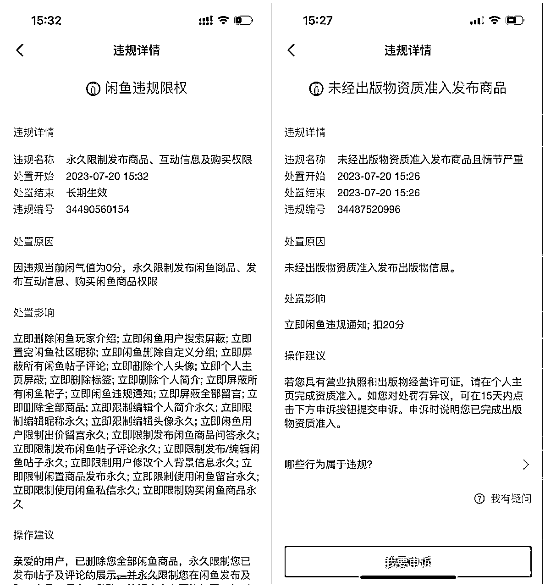
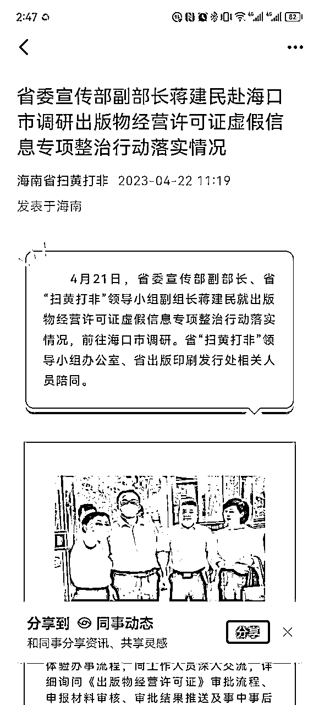

# 惊魂星期四：海南出版物被封，我们应该怎么办？

> 来源：[https://qingling21.feishu.cn/docx/KpwMdlcvqo3CGgxyPZIcigaMnNb](https://qingling21.feishu.cn/docx/KpwMdlcvqo3CGgxyPZIcigaMnNb)

大家好，我是老瞿Qu，生财有术最懂二手书的男人，之前看到有人问我，为什么名字后面要加一个Qu，是为了避免很多人叫我：老翟、老霍、老崔等等。

继5月份生财航海，以及7月份续航，很多人在闲鱼二手书项目上拿到了结果，有的也开始开工作室了，然而在上周四，出现了“惊魂星期四”，因为很多人的海南出版物异常了。

这导致闲鱼帐号被扣20分，关小黑屋七天，下架全部商品；严重的直接永久封禁了闲鱼帐号；当然也有少部分幸存者，却相安无事，但大概率逃不掉的。

今天这个文章主要跟大家分享下：

一、出版物异常以后，怎么处理？

二、如何尽可能减少项目损失？

三、如何调整做项目的心态？

## 一、出版物异常以后，怎么处理？

### 1、出版物为什么会异常？

办理出版物的时候，需要我们办理一个个体户，或者企业，然后用这个作为主体，去申请办理一个出版物许可证。

也就是说我们都需要一个经营地址才能办理这个出版物许可证的，而这个地址就是我们办理的关键。

为什么我们有时候不得不选择代办公司去办理，就是因为在很多地方，办理出版物许可证，需要政府有关部门去经营地址实地考察的，甚至会对经营地址的面积、消防、有没有摆放书架、甚至书籍进货凭证提出很多要求，所以我们没有办法才找的代办。

代办的套路，基本上是在一些偏远的城市，利用一些政府的鼓励政策、政策漏洞、关系资源进行办理的，他们的地址基本上不是自己拥有的，很多都是租赁的地址，甚至虚假地址。

这样一旦某个区域的出版物许可证的商家因为销售盗版、或者跟客户有订单纠纷被举报，举报多了就会受到政府的关注，甚至有的比较恶劣的会被政府一锅端，海南就属于这种情况。

因为之前办证成本较低，所以代办公司一窝蜂的去海南办证，惊动了“上面”，导致2022年在海南办理的出版物许可证被政府一次性全部给吊销了。

可能有人会有2个疑问？

#### 1.1、海南的证是不是被代办公司骗了，属于假证？

其实这批证全部是真的，只是被政府吊销以后，就相当于你没有证书了而已。为什么被吊销，就是被查处为违规办证。

#### 1.2、我开网店的，为什么需要经营地址，我在家不行吗？

你可以是开网店的，但是按照政府的要求，你必须有办公地址，而且是商业属性的房子才能注册公司或者个体户的，这也是为了便于政府的管理。

#### 1.3、代办跟我说，我开网店的证，90%以上情况，工商局不会实地考察？

代办公司为了让你办证肯定会这么说，到底工商局会不会实地考察，取决于几个方面：首先就是有没有投诉，投诉多了必查；其次当地工商的勤奋度以及业绩是否需要；最后就是有没有因为其他同区域的商户被查，而引起整个区域的整改行动。所以代办说的对，大概率不会被查，但是他们也不能保证的。

### 2、出版物异常以后怎么办？

#### 2.1、证照异常以后，闲鱼还能用吗？

其实海南的这批证，好几个月前就以前就已经被政府给吊销了，直到7月份闲鱼才开始清理，大概率也是因为某些压力导致的，或者闲鱼开始重视了，之前审核太松。

证照异常以后，如果你只是扣20分封了7天，你可以本人重新办理一个证去替换掉。

如果你的闲鱼号是永久封禁的，假如你闲鱼能注销成功，或者能和支付宝解绑也可以。但有很大可能就是你没有办法注销，而且闲鱼和支付宝也没有办法解绑。

这样也就是哪怕你办理一个新的证回来，你这个闲鱼号都用不了了，相当于本来一个证可以运营3个闲鱼店铺，你只能运营2个了。

#### 2.2、证照异常以后，会影响征信吗？

一般证照异常以后，只要你在三年之内予以注销基本上问题不大，我基本上的操作是异常以后1-2年内进行注销掉。

#### 2.3、证照异常以后，可以修复过来吗？

一般不会进行异常修复，因为很多情况下，异常修复花费的代价比你新办一个还高，所以基本上都是注销掉，目前证照注销的成本在200-300元左右，如果你找代办公司的话，海南的最近注销成本在100元以下，具体看地区。

当然你也可以选择跟之前那家给你办证的代办公司扯皮，这个就看这家代办公司的良心和你扯皮的能力了，有些会答应免费给你注销掉。

## 二、如何尽可能避免项目损失？

经过5月航海和7月续航的验证，闲鱼二手书项目在目前这个阶段，算是一个比较容易上手的好项目，个人做到月利润2-3万可以的，但是天花板不会太高。

既然这个项目能赚钱，而且我们已经接受了网络代办出版物许可证可能异常这个事实，那么我们可以去采取一些措施：

1、尽可能分散办证的地址，就好像我知道的近几年就山东批量查处过一次，这次海南批量查处过一次，比如我30多个闲鱼账号，这次受影响的仅有3个帐号，因为我办证比较分散。

2、如果能在当地的一些小县城或者镇上能找到或者租赁地址办理出版物许可证，会相对稳定，一般大批量查处的都是代办公司一拥而上的地方，在本地的一些小镇办理被查的概率基本没有，只要你店铺不要一直被投诉。

## 三、如何调整做项目的心态？

很多人当遇到项目卡点，比如二手书出版物许可证被封以后，就会开始出现烦躁、焦虑的心态，当我们改变不了一些事情的时候，我们需要学会接受，就好像搞对象一样，不可能有一个人是完美的，做一个项目爱一个项目。

当你把出版物许可证可能遇到的问题，作为这个项目就应该面对的一个环节的时候，你的心态就会淡定很多，就好像我们要做中医书单号项目的时候，我们就要接受几天就可能封一个某音帐号。

就好像很多做闲鱼二手书无货源的同学，在上家不按时发货以后渴望自己做仓库，不爱无货源了。但你对比下：

二手书实体卖家优势：

1、发货效率高，货在自己手里。

2、客户退货无需跟上家沟通，沟通上没有那么繁琐。

二手书实体卖家劣势：

1、大量的资金，百万级别，囤积书籍，

2、链条很长，需要去学校废品站收书，运回仓库以后还要上到书架，平时还要做好回收数据库的维护。

3、书销售出去以后还要专人进行打包发货，人工成本高。

4、没法进货，只能等毕业季收一波，哪怕一个200吨的仓库，爆款书籍其实都不多，种类却特别多。

5、每年都有20%的书卖不出去会成为废纸。

无货源模式的优势：

1、不需要资金，不用囤货，没有库存积压，没有任何风险。

2、全网都是你的仓库，货源比任何一个实体卖家的仓库都丰富。

3、无需收书、打包、发货、仓库管理等人工成本，一个人就够了。

无货源模式的劣势：

1、发货效率比仓库慢一步，但买的及时，其实还好。

2、客户退货还要跟上家沟通，买书发货比较繁琐。

对比一下，大家是不是觉得无货源真的太香了，你愿意包括有能力去做实体二手书仓库吗？

虽然他们的回收成本大概2-3元，但是算上人工、仓库、物流，他们一本书的利润大概只有3-5元，所以二手书商，都是靠量才能赚点钱的，每年收书季跟搬砖头似的，书很重，而且都是在学校垃圾堆里面挣扎。

对比一下，是不是无货源需要面临的那些个所谓的问题，都显得不是问题了。

所以干一个项目，爱一个项目，坦然接受这个项目劣势，多看看项目的优势，然后把优势放大。

每次买书，买多了被有仓库的老板拉黑，或者骂我是二道贩子，我都一点不生气，因为我不用像他一样日晒雨淋的收书，搬书累成狗，却赚的比他还多，想想确实活该被骂，哈哈

我是老瞿Qu，生财有术最懂二手书的男人。

2023年，希望链接更多的生财圈友，我们一起生财有术。