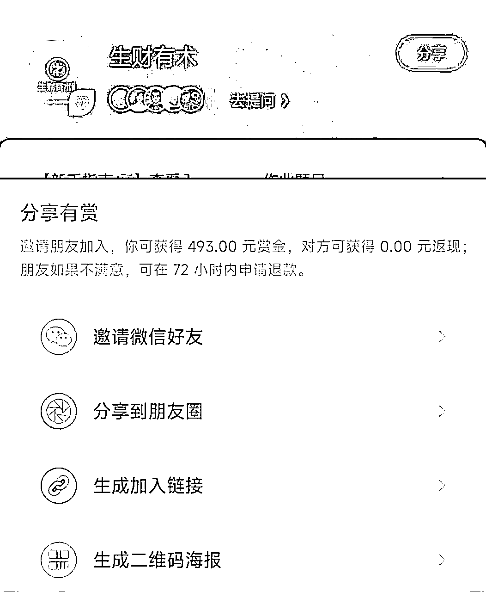

# 从分销到有自己的定位和产品，靠朋友圈精准营销，6个月变现14w+的实操方法复盘

> 来源：[https://bokm2adr1g.feishu.cn/docx/KzUMduAqLo5y21xgihUclePjnMe](https://bokm2adr1g.feishu.cn/docx/KzUMduAqLo5y21xgihUclePjnMe)

大家好，见帖欢喜，我是生财有术圈友小鹿。

有幸在5月航海，受官方邀请在“朋友圈运营航海”船上，作为嘉宾分享“朋友圈广告这么发，不反感还想追着看”，给大家带来朋友圈广告的正确发法。

在正式分享之前，容我先做个简单的自我介绍。我是小鹿，5 年文案撰稿人，靠文案累计变现7位数。目前是一名“朋友圈营销”教练，也是“5力吸金文案模型”创始人。

先后带领 1000+学员实现文案变现，现阶段主攻私域文案，旨在助力 10000+学员完成“私域自动成交系统”的搭建。

截至目前，我已通过朋友圈，在6个月期间，变现14w+。

值得一提的是，这是在好友数仅有1193+人的前提下，完成的转化。

如果你的好友数比我多，一定要看完今天的内容，相信你也能发出能”自动吸金“的朋友圈。

本文内容是在原分享基础上，扩充更完整版，全文共计14158字，预计阅读23分钟，一起来看。

### 本文内容概览

#### 一、路径回顾：朋友圈变现三步走

1.1 第一阶段，分销带货

1.2 第二阶段，付费社群

1.3 第三阶段，个人IP

#### 二、实操技巧：5步搞定朋友圈变现

2.1 朋友圈基本框架布局

2.2 必备“故事发圈法”，让用户追着看

2.3 朋友圈文案万能写作模板

2.4 广告怎么发不招人反感

2.5 朋友圈防折叠小技巧

#### 三、心法复盘：保持真诚，行稳致远

# 一、路径回顾：朋友圈变现三步走

我的朋友圈变现历程大概分为三个阶段：第一阶段，直接分销带货；第二阶段，搭建付费社群；第三阶段，打造个人IP。

今天，就来给大家详细分享一下，具体是怎么做到的。

## 1.1 第一阶段，分销带货

分销带货，简单说就是通过朋友圈卖别人的产品，可以是线上的课程类产品，也可以是实物类产品，如日用品等。

我主要分销的是知识付费类产品，如知识星球、各类课程等。当然，我分享前提是我自己听过、学过，确实觉得有收获的产品。

包括后期加入生财、合伙人后，几乎各类产品都会有丰厚的佣金，只需在朋友圈真实分享学习感受，就能实现朋友圈带货变现，这项收入是我还没有自己的产品时的主要收入来源。

也就是说，如果你现在还是一个小白，没有自己的产品，那完全可以尝试这种朋友圈分销带货的变现模式。

### 1.1.1 分销带货优劣剖析

为什么推荐0基础小白，先从分销带货做起？因为它是朋友圈变现最快捷、最方便的变现模式。

朋友圈变现的核心是有得卖，无论是卖产品，还是卖服务，都要有东西可卖。

通常情况，做为0基础小白，大多刚起步，没有自己的产品，更没有大V们的影响力，此时还处于学习、成长阶段。

那我们就可以从自己手头，正在学习的知识付费课程或产品中挑选。

比如咱们【生财有术】，分销一单是493，一个月分享10单就能有4930，抵得上普通工薪族一个月工资了。

当然，如果你有自己的货源，也可以直接卖实物产品。

在朋友圈变现模块，分销带货是最容易上手，交付成本最低的模式。

但这种模式也有缺点，如果文案写不好，营销策略不对，不出单不说，还容易被官方封号。

你一定见过那种在朋友圈刷屏发广告的人，看到这种广告，大家第一反应就是屏蔽，但是不刷屏怎么保障曝光度？

这就要求我们的朋友圈文案，一定要有效且精准，能够触达人心，直击变现，具体技巧在第二大模块，实操技巧，5步搞定朋友圈变现中有详细讲解。

所以，虽然朋友圈分销带货很容易，直接开卖就行，但千万注意采用正确的营销方式，避免出师未捷身先死，单还没出号没了。

尤其需要重点提醒大家的一点是，如果你长期发展路径是想做个人IP，那在前期分销带货阶段，一定要做好产品筛选。

别回头IP还没做起来，就因带的货质量有问题，先砸了自己的口碑。

### 1.1.2 分销带货案例详解

了解了分销带货的优劣，接下来我们看具体的案例详解。

下图的朋友圈，就是我在分销【生财有术】时，对应的一条朋友圈文案，大家可以详细看一下。

在开头部分，我先给出一个具体的认知，想赚大钱要够优秀才行。随后反驳，赚钱的影响因素不只是够不够优秀，更重要的是信息差。

随后给出具体的案例，比如做表情包、无货源电商等，引出赚钱游戏攻略，没人教我们怎么赚钱，但生活中却要处处用钱。

末尾引出生财有术，一个教我们怎么赚钱的知识星球，还给了具体优惠免费入群听分享。最后一句：在这万物都在疯长的春天，你确定要被落下，眼睁睁看着别人赚到盆满钵满？

整体逻辑结构为：

爽点（不够优秀照样能赚大钱）+痛点（生活中处处要用钱）+产品（生财有术，一份超全的赚钱攻略）

如果你想写类似的带货文案，就可以参考这个结构，先告诉大家，这款产品能为我们带来什么好处？再给出为什么一定要买它的原因，最后给出产品介绍及对应的下单方式即可。

也可以理解为是【提出问题—剖析问题—解决问题】的逻辑结构，具体的写作框架及写作技法，在咱们的第二部分，实操技巧模块，大家可以详细去看。

## 1.2 第二阶段，付费社群

付费社群指的是，打造一个能够给大家提供价值的社群，进而实现变现目的。

比如理白学长的社群，帮助大家养成自律习惯。同类型的还有周记打卡群，早起打卡群等。

我自己打造的是『引爆朋友圈变现力』年度社群，主要为大家提供，如何通过朋友圈文案变现，教大家靠朋友圈写出成交力、写出影响力。

适合想要通过朋友圈变现，想要通过朋友圈打造个人IP的小伙伴。

### 1.2.1 付费社群优劣剖析

与分销带货相比，付费社群就属于自己的产品。

如果能到这个阶段，相当于从“给别人带货”跨越到“为自己带货。

如果说带货是赚部分佣金，那自己卖自己的产品，当然就是100%收益。

从收益角度讲，同样的数量，卖自己的产品收益当然更高一些，成就感也会更强，也能借社群积累IP势能，扩大个人影响力。

但付费社群需要一定门槛，毕竟它需要提供相关价值。

如自身技能角度，你就需要有一技之长，提供干货价值，能够教别人。

比如说我会写文案，那我的社群就是引爆朋友圈变现力文案社群。

当然，也可以从自身品质角度思考，这就要求你有过人的良好品质习惯。

比如高度自律的理白学长，做了自律陪伴社群。

无论是哪种类型的社群，付费社群的核心是，能够给大家带去一定价值，情绪价值或干货价值任选其一都行。

如果二者都没有，那肯定做不了社群，更别提做付费社群。

最后，还需要提醒大家一点，付费社群相当考验私域运营能力。

如果你的微信通讯录好友不足4位数，或不会写朋友圈文案，没有发朋友圈的习惯，那就要慎重，很可能做不起来，还会打消你的积极性。

### 1.2.2 付费社群案例详解

接下来，就以我自己的社群为例，为大家分享我的第一个社群是如何开起来的。

在确定要开【引爆朋友圈变现力】社群的想法后，我就直接编辑了相关权益，在朋友圈官宣招生，这条就是具体的官宣文案。

讲清楚为什么会有这个想法？社群具体有什么权益？具体价格、交付是什么样？相当于介绍清楚基本信息就行，这条朋友圈发完后当天晚上就有8个小伙伴报名。

原因是，我本身就是写文案出身，文案功底在圈内也有一定知名度，加上这个社群由于是第一次尝试，所以价格定的低，交付给的多，性价比拉满，大家就都来了。

但实际上，这个想法第一次出现在我朋友圈是前一天，当时简单描述了一下想法，第二天落实而已。

这个结果告诉我们，无论做什么事，一定要大胆公开表达，你永远不知道，在你公开表达想法时，会有多少人被你吸引。

随后，我又趁热打铁，睡前发了一条报名人数的朋友圈，目的是想告诉大家这款课程虽然只有课程名称，但确实值得信任~

发完预售消息第2天，大家可以看我的朋友圈里，几乎全都是跟预售相关的内容。

为什么要发朋友圈？这条主要介绍的是这款课程能给大家带来什么？

适合什么样的小伙伴？告诉大家这款课程适合什么样的人群，方便对号入座。

第2天也是有一堆小伙伴报名，所以睡前我又发了一次晒单的朋友圈~

连续两天的晒单，烘托这款课程很受欢迎的气氛。

这里提醒一点，如果我们的报名人数不够多，那就单个去发具体的用户报名故事。

后面连续两天发的都是下单故事，单个朋友的下单故事，当然也是有选择的发，个人建议，最好不要直接刷屏，可能会引起反感。

在单个朋友下单故事的挑选中，还是遵循一个目标群体，挑一个人的原则。一定要讲故事，把痛点与课程卖点融进故事里。

要知道人类的本质就是爱看八卦，爱听故事，小朋友们小时候不都是听着故事入睡的嘛！

而且通过讲故事的方式，通常都是有细节、够具体，这样其实也是在增加真实度，增加用户信任度。

大概3天左右的预售，完成招生52人，涨价进入199阶段，第一次朋友圈社群发售就算告一段落，具体的发圈技巧，还是见第二部分，实操技巧模块。

## 1.3 第三阶段，个人IP

所谓个人IP，我理解的是，能够帮助一类人解决某一类具体的问题。

解决问题的方式有很多种，可以是具体课程类产品，可以是陪伴式成长，与付费社群类似，其核心都在于提供价值。

但个人IP对个人影响力、能力的要求较高，非一朝一夕就能做成。

### 1.3.1 个人IP优劣剖析

个人IP字面意思是将自己做成一个品牌，类似于超级个体。

可以是有超强实力，也可以是有超强的影响力，总之一定有过人之处，能够让大家心甘情愿跟随。

比如明星们，就是娱乐型IP，生财有术，就是品牌IP，梁靠谱，就属于超强的个人IP。

由此可见，想做个人IP，对个人能力是一项极大考验，对小白来说就很不友好。

但优势是，一旦形成自己的IP势能，随着个人能力的增强，个人价值就会水涨船高。

后期无论做什么业务，都能有自己的一批铁杆粉丝。

“互联网预言家”KK曾提出一个很经典的理论：1000个铁杆粉丝理论，任何一个人，只要拥有1000个铁杆粉丝，便足以养活自己。

做个人IP就是积累1000个铁杆粉丝的过程，虽然过程很辛苦，但一旦成功，结果也会很惊喜。

### 1.2.2 个人IP经验分享

还是以我自己为例，我做的是『引爆朋友圈变现力』文案向，即教大家怎么靠写好『朋友圈文案』实现变现目的。

这个定位确定后，我就从确定产品体系，到开始行动做好执行，截至目前『引爆朋友圈变现力』年度社群已有140+小伙伴一起学习。

对应的产品有年度陪伴社群+知识星球，一套“朋友圈变现力”基础文案课，一套“引爆私域变现力”，帮助大家打通私域文案底层逻辑的文案课。

这就是从自身技能出发，做出对应产品，而后通过产品招生、售卖，积累个人影响力，打造个人IP的过程。

换句话说，想要做好个人IP，就得先定好【定位】，在此基础上延伸自己的业务，做好流量转化，形成变现闭环即可。

最后再强调一下，个人IP不是一朝一夕的事，它需要日积月累的沉淀。

如果有一定基础影响力还好，但如果是小白，还是建议参考我的成长路径，从【朋友圈带货】到【付费社群】，再到【个人IP】，一步步打造自己的个人影响力。

接下来，咱们正式进入【实操技巧】阶段，5步搞定朋友圈变现。

# 二、实操技巧：5步搞定朋友圈变现

了解了朋友圈变现途径后，接下来就到具体变现实操技巧了。

大家可以参考以下几步，搭建自己的【朋友圈变现】体系。

## 2.1 朋友圈基本框架布局

先分享框架是因为，带大家做“朋友圈变现”这半年来，遇到最多的问题是，老有人不知道自己的朋友圈能发什么？

总觉得，好像没什么好发的。实际上，不是你没内容可发，而是你自己不想发。

发朋友圈的本质是分享，是你愿不愿意向这个世界表达自己，愿意分享自己的工作、生活。当你留心日常生活时，你就会发现，生活处处皆可发圈。

具体可以参考以下4个方面：

### 2.1.1、生活向

顾名思义，生活向就是分享我们的日常生活。

笼统概括，可以是衣食住行。如今天吃了什么好吃的？通勤路上遇到了什么好看的风景？买了新衣服？为房间添置了什么小物件？

每一个小点，都可以成为我们朋友圈分享的内容。

而这还是从我们自身出发，同样的内容，也可以发身边人相关。如发自家宝宝有什么有趣的事情，父母有什么感动的瞬间等。

比如我发的这条绿植，就属于生活圈。

这些生活的点滴，构成一个有血有肉有温度的你。

严格意义上，生活圈其实也属于人设打造的一部分。比起一个只会发营销信息的朋友圈，一个有日常有生活的朋友圈显然更真实，更接地气，也更招人喜欢。

### 2.1.2、人设向（偏专业化）

和生活向的温情不同，这里说的人设向指的是专业化的人设。

比如我的定位是朋友圈文案，那我的专业向内容，就是朋友圈文案相关技巧。

这里需要特别提示一点，我们在朋友圈讲干货时，一定要结合具体故事素材去讲。

故事可以是自己的学员故事，也可以是自己的故事，总之与你相关是最好的，具体咱们在2.2【故事发圈法】中会讲到。

毕竟，做IP的本质，一定是立一个专业化人设，专业性离不开专业感的打造。

当然，不是所有小伙伴都有具体定位，能够发对应专业性强的朋友圈。如果你没有具体的定位，也可以考虑从个人性格、品质方面去打造。

比如多发一些展现你是一个热情真诚的人的朋友圈。

这条朋友圈，就是我还没有产品，没有具体定位时发的。

当时，我的角色，是一个推荐知识付费产品的推荐者。朋友圈卖的是我体验过的产品，所以我需要树立的是一个真诚分享的人设，就有了这条朋友圈。

这里需要强调一点，人设感的打造，除了专业外，最重要的一点，是要真实。

如果你是包装出来的人设，比如是个社恐，却立社牛人设，那稍不注意，可能就会翻车。

做真实的自己，呈现最真实的你，是打造人设的核心。

### 2.1.3.认知向

说『认知』可能有点抽象，简单理解，“认知”就是容易让用户产生获得感的内容。

大家看完会觉得，学到了学到了！这个人是真有点东西的！

所以，究其本质，认知，就是你对这个世界，对万事万物的看法。

它可以是你自己悟出来的，也可以是你在书中读到的，也可以是你看电影中的某一句经典台词。总之，是一些能够触发你感悟，让你有思考后的输出。

比如我发的靠谱的这条，灵感来源就是靠谱在群里的发言。

对这两句话很有感触，所以就有感而发。

核心观点：成交一定不能靠硬劝，劝出来的成交，只会进退两难。做知识付费的朋友，对这条朋友圈肯定感同身受。

简单来说，认知向的素材，可以是任何让你学到的内容，我们可以结合自己的思考，进行再输出。

### 2.1.4.产品向

产品向很好理解，说白了就是广告。无论你要发的是自己的产品，还是要分享别人的产品赚佣金，对应的朋友圈都属于产品向。

产品向的广告通常可以分硬广和软广，在朋友圈文案里，建议以软广为主。

硬广过于简单粗暴，很容易引起大家反感。偶尔有一次，如产品正式发售、正式涨价等时候，可以专门发一条。其他情况，都建议发软广。

软广可以分很多类，如咱之前提到的，分享用户下单故事、分享用户咨询故事、分享用户反馈、分享产品具体使用场景故事等，都可以写成软广。

软广的核心在于，一定要软，最起码开头第一句，不是直接上产品，而是讲故事，说感受，调动情绪。

比如这条，就属于一条软广。从认知向的观点切入，讲找优质圈子，链接优秀大佬。讲自己的真实感受，讲现实生活中的情况。

最高级的营销文案，一定是走心且真实的经验分享。

如果咱写的文案内容，自己都看不下去，打动不了，用户凭什么为咱们付费？

当然，【产品向】的朋友圈是咱们做【朋友圈营销】的核心，所以在2.4部分，会有详细的“朋友圈广告怎么发不招人反感”实操技巧，大家往后看即可。

## 2.2 必备故事发圈法，让用户追着看

在前面部分，我们已经讲到了软广要多以“故事”的形式来写。实际上，咱们日常想发的所有内容，都可以借『故事』的形式呈现。

这样才能更有代入感，那具体怎么写呢？一起来看。

### 2.2.1、短故事

一条朋友圈一个小故事，最好能在500字以内讲清楚，这种类型的故事，叫做短故事，适用于分享一个单独的观点，或分享独立的一件事。

比如这条朋友圈，就讲了一个有人盗用内部资料，为自己的私域引流的故事。

通过开头竟然有人用内部资料引流引入，故事的高潮是大家一起评论留言艾特原创。最后落脚点在团队的力量，一群大佬助阵的阵容。

这条朋友圈没有带货意图，就是想讲述团队的凝聚力，所以就是一个独立的小故事。

在这种一条一个小故事的朋友圈中，只需要讲清楚事情的来龙去脉即可。

甚至有时候，哪怕就是单纯的讲故事，没有任何观点分享都行。

但一定要注意故事的完整性，换句话说就是，故事要有头有尾有收场。

没头就会给人感觉莫名其妙，get不到你的点。没过程，故事可能就没那么精彩。没结尾，要么是烂尾，用户一头雾水，要么就是留作连续剧。

如果留连续剧，记得铺垫一下，比如后续敬请期待，或下次分享之类的。

### 2.2.2、长故事

所谓长故事，就是一条朋友圈讲不完，需要好几条才能讲完的那种。

长故事和写文章的逻辑一样，可以是并列式结构，同一个主题，讲好几个故事。

比如咱之前说的，可以批量发用户故事，那连续5条用户故事，某种意义上就属于同一主题的长故事。

长故事的好处是，每条朋友圈之间都有联系，用户看到其中任意一条，如果感兴趣，就可以点进朋友圈，一口气看完全部。

比如我3月24日当天的朋友圈，其实都是围绕『引爆朋友圈变现力』文案抢跑群发的长故事合集。

第一条，是为什么要发好朋友圈？

第二条，是文案抢跑群权益概述。

第三条，是文案抢跑群适合什么样的小伙伴。

第四条，是文案抢跑群的晒单。

中间夹杂的其他生活圈，纯属调节一下朋友圈内容，不能一整天发的全都是广告。

这就是4条朋友圈，讲一个完整的产品发售故事。

从产品作用，到产品权益，到产品适合人群，再到用户下单。在我第2天的朋友圈中，也在连续晒对应的用户故事。

大家在发自己的朋友圈时，也可以采用这种，一天讲一个长故事的方法。

所谓长故事就是一天定一个核心主题，这个主题可以是你当天的主推产品，也可以是你当天的学习成长故事。

刚才我举例的产品发售故事就属于产品故事。

产品故事线的设计，可以是『产品内容-产品权益-产品适合人群-用户反馈/产品效果』等，任意搭配，只要都围绕着产品来就行。

如果是当天的学习成长故事，你可以在早上发一条，自己存在的问题，中午发学到了什么解决办法，晚上发这个办法用了一下，好不好用，有什么效果。

当然也可以是休闲娱乐故事，比如早上发出发去爬山，中午发山上的美景，晚上发爬了一天腿疼。

总之，当天的朋友圈有其中几条能够连成一个长故事，中间夹杂着几个别的内容都可以。

### 2.2.3、连续剧故事

比起长故事，连续剧故事的时间纬度会更长。长故事是一天之内，或一周之内的朋友圈内容。连续剧故事可能是长达一个月或者好几个月，甚至好几年。

比如我自己的『引爆朋友圈变现力』文案课程，持续关注我朋友圈的朋友都知道，我从有这个想法开始，到陪伴群搭建完成，到后续运营，基本上最长隔一天，其余时间，每天都会有相关的朋友圈内容。

换句话说，我会在朋友圈更新『引爆朋友圈变现力』文案课的诞生历程，从有想法，到发展成熟，再到后期做大做强的整个成长周期。

这种连续剧故事既可以是产品的发展故事，也可以是个人IP的成长故事，当然也可以做成用户故事。

比如说我的学员小米代理的英语学习机，就可以跟踪其中一个用户，在朋友圈完整呈现孩子的英语学习及进步情况。

如果没有这种可供长期跟踪的用户，那就以自家孩子成长过程为案例直接发。直观呈现这款产品，带给孩子的改变，重点突出用完能力的提升。

连续剧故事，如果用一句很经典的话描述，就是：

人们真正注意到你的时候，不是第一眼看到你站在那里，而是发现过了这么久你居然还在那里。

这种故事最大的好处是复利作用极强，当有人对你的某一条朋友圈感兴趣时，点进你的朋友圈去看，他会发现整个成长过程完美呈现。

此时，哪怕是陌生人，也能在短期内，迅速建立起对你的信任度。

当然，这三种故事法不是非此即彼。

短故事可以连起来当长故事，每天一个长故事，可以连起来当连续剧故事，这是一个层层递进的过程。

如果咱能把这个体系搭建起来，那它就是一个能帮你自动吸金的朋友圈自动成交系统。

简单总结一下，想要通过『故事法』搭建朋友圈自动成交系统。

那就从『短故事』讲起，汇成『长故事』，再汇聚为『连续剧故事』，让你的朋友圈像一部精彩的纪录片一样，全方位展示你和你的产品。

## 2.3 朋友圈文案万能写作模板

在介绍具体的【万能写作框架模板】之前，先给大家介绍一下它的本体——七问分析法。

七问分析法，就是咱经常提到的5w2h分析法，对应的是7个单词：

WHAT 是什么？WHY 为什么？WHO 谁？WHEN 何时？WHERE 何处？HOW 怎么做？

HOW MUCH 多少？

在朋友圈文案写作中，我将其拆解两个模块结构，3大方法，供大家灵活套用。

### 2.3.1、基本框架结构

WHAT 是什么？WHY  为什么？HWO  怎么做？

毫不夸张的说，这个逻辑结构，适用于任何类型的朋友圈文案。

只要你有想发的内容，哪怕只是一个想法，都可以套这个结构，输出一条对应的朋友圈文案。

产品圈：

是什么？给出产品；为什么？给出卖点；怎么做？引导下单。

生活圈：是什么？分享主题；为什么？分享感悟；怎么做？引导互动。

认知圈：是什么？给出观点；为什么？解释原因；怎么做？给出行动。

人设圈：是什么？给出观点；为什么？分享经历；怎么做？具体行动。

大家在发朋友圈的时候，只要有确定的主题，都可以试试用这个框架来写，基本输出无碍。

### 2.3.2、具体场景框架：

WHO 谁？WHEN 何时？WHERE 何处？

好的朋友圈文案，一定有具体的场景感。所谓场景感其实就是写清楚什么时候？是谁？在哪儿？发生了什么事情？

所以，这个框架中，就包含具体场景三要素。

如果想把一条朋友圈写得有场景感，让用户看了有代入感，不妨从这三个元素入手，去描述具体场景。

生活圈

谁？我自己；何时？下班的时候；何处？下班路上；发生了什么事？拍到了光。

短短一句话，其实也是套用了这个叙事方法。

产品圈

谁？我和大佬们；何时？社群运营至现在；何处？私信发消息；发生什么事？主动出击，申请优质朋友圈文案授权。

大家如果在写自己的产品文案时，套用这个场景，也是分析清楚什么时候？是谁？在什么地方？有什么动作？

还是以我的学员小米代理的英语学习机为例：

谁？孩子；什么时候？可以是睡前也可以是饭后；什么地点？可以是床边，可以是客厅；什么事情？用英语学习机学习

套用这个逻辑框架，哪怕你写不具体，也能有个大概场景，给用户想象的空间。

### 2.3.3、综合套用更全面

需要提醒大家的是，上述分享的这两个框架，是可以融合套用的。比如这条朋友圈：

是什么？＝是谁？在哪儿？什么时候？

因为都是我现在来晒我争气的绿植。

为什么？＝什么地点？什么事情？

办公室，存活率高且连续开花。

怎么做？引导互动，点赞沾喜气。

所以大家在套用框架时，千万不要被框架把自己框住。框架是在你不会写，不知道怎么写的时候套用。

最好的情况是，按照自己的想法，顺其自然的输出，一气呵成。只要能够逻辑自洽，就是好文案。

## 2.4 广告怎么发不招人反感

结合文案专业知识，及发圈实战经验，我总结了朋友圈广告的正确发法，一起来看。

【知识点抢先看】

朋友圈广告的正确发法，让用户不反感还想追着看：

一、硬广，把控节奏感

1、预售给全价值感

2、官宣仪式得拉满

3、涨价逼单要全面

二、软广，搞定成交量

1、巧用故事促成交

2、具体场景更诱人

3、日常藏广小心机

### 2.4.1、硬广，把控节奏感

说起硬广，大家第一反应就头疼：“谁会看硬广啊？朋友圈发的不应该是软广吗？”

还真不是，在朋友圈运营中，适当的硬广能够帮助我们把控营销节奏，适当时候还能协助逼单。

今天，咱就从一款新品，从预售到发售到涨价的成长周期，为大家分享，具体的朋友圈文案硬广，怎么写不招人烦。

#### 1、预售给全价值感

预售是产品发售的前奏，毫不夸张地说，一款产品成交额的多少与变现能力，往往就取决于预售力度。

如即将到来的 618 大促，每年都会至少提前半个月开始预售。

预售之所以这么重要，是因为它不但能培育用户期待，还能测试市场对产品的接受度，收集最直观的用户需求，方便我们做进一步产品优化。

那预售的朋友圈应该怎么发呢？我们可以从以下三个角度入手。

1）干货价值

某种程度上，预售大多都属于“空手套白狼”，说白了就是啥都没有，先收钱再说。

这就要求我们在朋友圈中文案中，一定要给足相应的干货价值，给用户一种性价比超高、错过巨亏的即视感。

这是我第一条产品预售朋友圈：

严格意义上，第一次提到产品，是在前一天的日复盘中。第二天就有朋友直接打钱，当晚借着这个契机，直接开启朋友圈预售。

大家可以看一下红色部分，6 大权益，怎么看都是超值，当天发完，就有 8 个朋友直接转账。

这款产品之所以定价低，是因为核心目的是测试市场需求度，结果是在不足 600 人的通讯录，3 天转化 50 人。

言归正传，所谓干货价值，就是要告诉你的好友，你的产品能为他们带去什么实打实的价值？

这就要求大家具备一定的『文案力』，如做好前期用户画像，了解用户需求，针对性梳理产品核心卖点，这样才能将期待感拉满。

2）情绪价值

所谓情绪价值，就是引起用户情绪波动，在这条预售的硬广中，开头第一句就是挑动好奇情绪，吸引用户详细阅读。

通过讲述被姐妹无条件信任支持的故事，引出需要感谢，所以送出超值特惠福利。

既解释了产品预售的契机，又为这次预售赋予了情绪价值，即抢跑就是对我的信任，低价是我给予的回馈，一来一往的情绪往来，也能拉进用户之间的距离。

大家在发自己的预售硬广时，不妨尝试分享一下你做这款产品的初衷，讲述你与产品的故事、产品理念等，练就『故事力』，为预售添上有温度的情绪价值。

3）观赏价值

观赏价值这点最简单，也最容易做到，但也是最容易被大家忽略的一点。

它最直观的体现是，你的朋友圈文案排版，看着是否舒适，是否会给用户造成阅读压力？

在这里，有几个提升观赏价值的小技巧，不只是硬广，大家在日常发圈时也可以参考：

a、表达多用短句，最长段落不超过 4 行，最好控制在 2 行内。

b、适当添加小表情，不但能增加美观度，还能有效缓解大段文字带来的阅读压力。

C、配图清晰美观，色调温和清新，数量上最好保持 1、2、3、4、6、9 等整数。

预售期即将结束后，就来到正式发售环节。

#### 2、发售给足仪式感

像所有新品发售会一样，我们在朋友圈正式发售新品时，也可以给足相应的仪式感。

可以是倒计时海报，也可以在官宣的朋友圈下，做一些小活动，如点赞抽奖，或有奖问答等。

这样做的好处是，后期再有产品相关活动，可以直接在官宣朋友圈下通知，这样所有有过互动的朋友就都能收到提醒。

需要注意的是，作为给用户的仪式感，最重要的是一定要让用户有参与感。

我们可以从定课程名称开始，就引导用户选择。

如取 3 个课程名，让大家选用哪个好。课程海报完成后，给用户选更喜欢哪款？

第一步的预售，加第二步的发售仪式，也能给用户一种养成系的快乐。

顺带积累『影响力』，让大家自愿分销推荐，进而加大曝光量。

我的社群，第一波招生 50 人是靠朋友圈文案，随后大多数学员，基本都是推荐转介绍而来。

#### 3、涨价逼单要全面

接下来就来到涨价环节，课程运营一段时间，难免遇到需要涨价的情况。

涨价前期预热需要以软广的形式，但正式涨价就需要一条正式的官宣文案。

那么问题来了，很多朋友可能会觉得，涨价会不会劝退新用户？怎么发比较好？不得罪人，还能让大家抢着付款？

前面提过的干货价值、情绪价值、观赏价值咱就不说啦，重点看涨价型朋友圈硬广的重点应该在哪里。

1）产品质量升级

如果是知识付费产品，可以是产品内容更丰富，形式更方便，如从图文到音频到视频。

如果是实物产品，可以写产品材质、用料升级。

产品更好，价格自然要更高。

2）导师经验丰富

除课程外，我们也可以从自身提升讲起。

随着学员的积累，导师经验必然更丰富，服务体系也能更完善。

当然，也可以是我们自己又新学了哪些内容，自身能力相比之前有哪些提升，能够更好地交付。

总之，涨价逼单的朋友圈，一定要告诉大家，为什么涨价？

练就『营销力』，将性价比拉满，让大家觉得，就应该涨价，甚至觉得，涨价涨少了，那就算成了。

具体可以看比比这条朋友圈，就是一条标准的朋友圈涨价官宣硬广。

### 2.4.2、软广，搞定成交量

比起硬广的简单粗暴，软广的发法就自由很多。但很多朋友发软广，都把握不好软度，太软没效果，太硬的话就成硬广了。

咱们在发软广的时候，可以从以下 3 方面把控软广的度，让其“软硬适中”，既能宣传产品，也能不引起反感。

#### 1、巧用故事促成交

考虑到篇幅问题，故事发圈法技巧性的干货随后给大家分享。在这儿，就先分享给大家有哪些故事可以发。

1）用户故事

我们可以根据用户下单路径来发，如：

a、咨询故事：感觉和之前遇到的社群很不一样，说不出来的特别感，有被吸引。

b、成交故事：牛人付费的成交故事，更能放大影响力。

c、 报喜故事：比起晒自己的成绩，晒学员的报喜更诱人。

只要和用户相关，都能和产品挂钩，都可以在朋友圈分享具体的故事，起到营销作用。

当然，我的是知识付费产品。如果是实体产品，下单路径不清晰，但用户使用路径一定是清晰的。

我们可以从使用路径去分析，在使用期间，可能会发生什么故事，进而输出相应的用户故事型软广。

2）个人故事

是的，你没看错，个人故事也可以是软广，比如：

a、成长故事：从社恐到打开自己，我跟着产品一起成长的故事。

b、人设故事：喜欢做一些赋能向的工作，能带给我巨大的成就感。

这类故事文案，不但能帮你通过朋友圈宣传产品，还能起到通过朋友圈打造个人 IP 的作用。

因为它能清晰呈现我们的成长路径，让用户直观感受这个人是在努力中。

也能传递自己的理念、价值观，吸引同频的用户前来学习。

3）产品故事

只要和产品相关，都可以归类为产品故事。比如，

a、产品理念：

我的产品理念是，打造自己专属的个人 IP 风格，教大家如何为朋友圈赋予自己的灵魂。

b、 产品打造迭代：

这是我的课程产品，从预售到课程落地的迭代故事。

产品故事的作用也能给用户养成系的即视感，亲眼见证一款产品从 0 到 1 的诞生，就像是看着邻居家孩子长大，是日积月累的信任。

哪怕他当下不需要，有人问起，有人需要时，他也能第一时间想起咱们的产品，进而推荐。

在朋友圈文案中，基本的『故事力』是必不可少的一环，能讲好故事，就相当于成功了一半。

#### 2、具体场景更诱人

如果说故事是朋友圈形式，那具体场景化就落实到实操技巧了，想要写出诱人的软广，一定离不开具体场景刻画。

但场景感听着就很抽象，怎样写具体？写出画面感？试试以下三个方法。

1）形象化类比

有时我们写的东西可能专业性较强，或比较抽象，看起来枯燥乏味不说，还可能不好理解。

针对这种情况，我们可以采用形象化类比的写作技法，即借用大家熟悉的事物去类比陌生的事物。

当年苹果推出新品 ipod 时，乔布斯在发布会上直接说的是：“把 1000 首歌装进口袋”。

这么一说，使用场景瞬间扑面而来，哪怕大家不知道这个新东西是干嘛的，听完这句话也能了解个大概。

再比如这条朋友圈，将赚钱比作谈恋爱，口头说说和实际行动的差别一目了然。

2）细节性描述

把内容具象化，细节越丰富，越容易产生画面感。

这里可以多用动词，刻画具体场景。比如这条朋友圈：

你睡着了，还能自动入账的睡后收入，生动形象地写出了自动成交的画面。

虽然互动不多，但能直接当场成交。

3）情绪词带入

要知道，高端的文案，往往是贩卖情绪。所以，想为你的文案注入灵魂，那就写出情绪感受。

比如这条朋友圈，讲的是大家互帮互助互相点评文案，感觉学到了很多，有爱有料，被感动等，都描写的是情绪。

这种浓厚的学习气氛，比直接罗列卖点更有感染力，也更能打动人心。

如果是实物产品，如珠宝，咱能卖的除了珠宝本身，还有自信与优雅的气质。

总之，可以多挖掘产品带给用户的情绪感受，写出来会更有代入感。

#### 3、日常藏广小心机

不要放过任何能藏广告位的地方！

这里的广告位不是说写清楚怎么购买的营销类内容，而是见缝插针，在能提到产品的地方，尽可能多提自己的产品。

我的朋友圈主要体现在以下几方面：

1）日复盘

我的日复盘信息量很大，但每天雷打不动都会有文案、写作私教，相当于每天都会告诉大家，我有这个业务。

2）日知录

我的认知类干货分享中，也会植入我的产品。但不是硬植入，而是通过分享自身成长故事的方法植入。

3）碎碎念

这是一条碎碎念的朋友圈，既分享了自己成长的蜕变与心得，也提到了用户下单故事，也属于软广植入。

你看，只要你愿意留心，朋友圈处处都是广告位。

具体哪些类型的朋友圈能够植入软广，就需要大家根据具体内容，具体情况具体分析啦。

不过，需要注意的是，植入的软广一定要自然流畅，太刻意反而会起反效果。

总而言之，想要做好朋友圈运营，文案力、故事力、营销力、影响力、成交力，“5 力吸金”缺一不可。

而这五大能力，就需要大家在日常文案中多多打磨修炼，才能搭建出自己专属的“私域自动成交”系统。

## 2.5 朋友圈防折叠小技巧

最近，微信出了整改，好多小伙伴的朋友圈，都出现了被折叠现象。

一旦被折叠，有效信息就会只剩一行，对于朋友圈运营来说，影响还是蛮大的。

所以，我特意搜集了各方资料，研究防折叠方法，给大家系统性分享一下具体方法。

这部分的分享将会以被折叠原因，与对应解决方法的形式来进行。

### 2.5.1、原创度低

这里的原创度不只指文案的原创，还指配图的原创。

文案上大家很好理解，就是那些直接复制粘贴的文案百分百会被折叠。配图上，目前如果朋友圈大规模发同一张图就很容易被折叠。

比如大家经常刷到的小来早安打卡，如果没有随手换一张图，那系统推送给所有人的图片都是一样。

很多人在朋友圈发过这张图之后，你的朋友圈如果发同样的图，就会被折叠。

想要解决这个问题，咱们直接提高原创度就行。

文案上，最好是手打。

自己直接原创输出最好，哪怕是复制别人的观点，也可以自己一字一句手打上去，也能对认知类观点加深一遍印象。

如果有矩阵号需要同步相同的内容，可以试试宇轩《高效营销手册》里提供的朋友圈防折叠方法：

1）讯飞输入法，复制到剪贴板，再发朋友圈可以防折叠。

2）粘贴到飞书上，再复制到朋友圈，也能防折叠。

我自己用的是讯飞输入法，很方便，且确实有效果。

配图上，最好是自己拍的图片。

比如我们在日常可以多分享一些生活中的内容，那这里的配图就可以自己随手拍摄。

如果需要用到网图，咱们尽量去选一些质量高一点的图片，避免发那些容易被刷屏的图片。

如果实在喜欢朋友圈里有小伙伴发过的图，也可以自己简单处理一下。比如加个滤镜，简单裁剪都属于二次处理，都能有效避免折叠。

### 2.5.2、营销感强

营销感强主要体现在以下三个方面：

1）发圈数量多，每天会发很多条，这里的很多指的是每天≥8条。

2）发圈频率高，短时间内咔咔发了好几条。这个具体的数据是，2小时内发了3条以上，频率就算高。

3）文案营销感重，比如原价xxx，大甩卖仅需XXX，巨划算等。赤裸裸的硬广，就会被盯上折叠。

想要解决这些折叠问题，我们也可以选择对症下药。

1）条数控制在8条以内，没必要的内容就不用频繁刷圈。

2）如果你一天的朋友圈条数大于等于5条，那每两条之间最好间隔两小时以上。

3）至于营销感过重的问题，我们可以将具体的价格优惠等信息，放在朋友圈的评论区，或者用花字来表示。

这样大家都能直接看到，且评论区被折叠的概率也偏低。

这里，给大家汇总一波常见会折叠的敏感词，可以收藏一下，日常发圈时多注意：

营销、订单、爆品、客单、预定、顾客、优惠、基础、店内、特价、搭配、限时、特惠、限定、限购、定制、套餐、新品、推荐、价格、高定、品质、制作、模式、保证、上新、包邮、现货、秒杀、必买、自制、客户、数量、名额、下单、折扣、满减、活动、售价、客服、火爆、上架、抢购……

### 2.5.3、账号权重低

权重这个词，搞自媒体账号的小伙伴一定不会陌生。通俗理解就是，你在官方那儿的可信任度有多高。

通常情况，0违规，高互动，是正常的使用频率，权重都比较高，不会有问题。

容易出问题的是，新注册的账号，短期内发布营销类内容。

其他的其实大家多少都知道一些，比如频繁通过好友、加他人好友，个人信息频繁改动，朋友圈大量刷屏等，都会出问题。

权重低，有前科，朋友圈就很容易被折叠。

那我们该如何提高账号权重呢？这里给大家几个方法：

1）朋友圈无论是图片还是文案，尽量原创。

可以多晒一些自己的日常生活，随手拍的图，都能有效增加权重。

2）朋友圈频率与数量保持在正常情况，不能频繁异常。

比如你可以每天都是六七条，但你不能一段时间什么都不发，又一段时间频繁刷屏。

3）做好基础信息实名认证。

比如绑定银行卡啊，偶尔用微信出去付款，绑定购物平台，用微信登陆社交媒体平台等。简言之，就是做个正常人。

### 2.5.4、其他待证实情况

除了以上三点被测试过（实验数据来源：生财有术-阿明），确实存在问题外，还发现了以下几点影响因素，供大家参考。

#### 1）互动率

如果好友与你的互动率高，那他看你的朋友圈的折叠率就低。

如果你们之间几乎没有互动，那他刷到你的朋友圈被折叠的概率就会很大。

这点告诉我们，要多与你的目标用户、喜欢的大佬互动。比如刷到对方的朋友圈顺手给他点赞评论，既能增强互动，还能刷一波存在感。

#### 2）手机机型

是的，你没看错，手机机型也有影响。

通常情况，安卓机折叠率低，苹果机折叠率高。

用安卓机刷朋友圈，大部分都没有被折叠，用苹果机刷朋友圈，好多都会被折叠。

同一条朋友圈，也会出现安卓机未折叠，苹果机折叠的情况。

#### 3）玄学问题

同一条朋友圈，同样的手机型号和同一WiFi，一个手机看折叠，一个没被折叠。

甚至有时候同一条朋友圈，有的好友看折叠，有的好友看是没有折叠的，它在每一个好友那呈现的状态都是不一样的。

玄学就纯属概率了，这个咱们没有办法解决，只能靠运气。

当然，除了防折叠外，咱也得做好，已经被折叠的应对措施。

如果已经被折叠，或者不确定会不会被折叠，我们还可以用以下2个方法防患于未然。

1）开头足够吸睛

只要你的朋友圈开头写得够诱人，让人看到就忍不住点开想看全文。

这样哪怕被系统折叠，别人看到感兴趣的开头，也会点开看完全部。

比如这条朋友圈：

一周收入翻十倍，看着就很爽，想收入翻倍的宝，哪怕被折叠，肯定也会点开，一探究竟。

2）培养铁杆粉丝

铁杆粉丝，指的是那种，根本不管你有没有被折叠，都会习惯性定期点进你朋友圈围观。

这种就丝毫不会受被折叠的影响，因为用户就是奔着你这个人去的。

这也是咱们打造自动成交系统，打造个人特色IP型朋友圈的终极目标，就是让用户追着你的朋友圈，看到停不下来。

比如我就经常收到有好友集中连续的点赞，就是被集中时间，专门查看。这种情况，不管朋友圈是否被折叠，都不影响具体的内容及效果。

最后来简单小结一下：

### 避开朋友圈折叠坑，可以用好这几招

1、原创度低

TIPS：1）文案，原创。2）图片，多拍。

2、营销感重

数量多、频率高、营销词汇多

TIPS：1）数量≤8条；2）频率，至少间隔2h；3）价格优惠等信息放在评论区，或用花字来表示。

3、账号权重低

TIPS：多养号，像正常人一样去使用。如付费、私信、刷朋友圈、看公众号等。

4、其他

多互动、用安卓、拼运气。

TIPS：

1）开头足够吸睛；2）培养铁杆粉丝

希望大家能借助以上小技巧，做好朋友圈防折叠工作，避免功亏一篑。

# 三、心法复盘：保持真诚，行稳致远

具体干货技巧分享完了，最后还想和大家分享一些一路走来的小心法。

从只会写文案的作者，到尝试朋友圈带货，到付费社群搭建，再到现在个人IP打造，有了自己的产品及产品体系，能够在6个月靠副业变现14.9w。

一路走来，感受最深的是，一定要保持真诚，且躬身入局，把手弄脏，坚信行稳致远。

俗话说，真诚可抵万钧之力，在知识付费领域更是如此，用户对你的信任就是无价之宝。

无论是通过朋友圈带货，还是做社群，亦或通过朋友圈，打造个人IP，时刻谨记保持真诚。

因为我做到了真诚为先，所以在带货时，能够得到大家的信任，能有需要就下单。能在我社群初期，我自己才刚起步，缺乏影响力时，做到50%的转介绍率。

不仅如此，保持真诚，真实的你，才能吸引同频的优质客户，后期交付也会顺畅不少。

其次，最需要强调的是，一定一定一定不要焦虑。

在生财，有的是日入五位数、月入七位数的大佬。刚开始我也会焦虑，但焦虑过后发现，大佬们也是历经几年沉淀才做到现在这步。

任何抛开过程只看结果行为，都是耍流氓。

甚至包括我自己，能在半年内，副业做到这个成绩，也是因为我已经有了5年的文案功底的积累。现阶段做的朋友圈文案，只是将本就擅长的文案技能迁移到朋友圈领域深耕而已。

成长需要时间，成绩需要累积，任何速成的东西都要持怀疑态度。

在起步初期，尽量只和自己比，专注目标，一段时间只做一件事，稳扎稳打地前进，保持日拱一卒的状态，行稳才能致远。

文毕，感谢 @梁靠谱@理白 两位老师带我加入生财，感谢静伟老师、范磊领队、九儿老师的暖心引导，感谢理白教练、子冯教练、思念教练的无私分享，以及大航海所有志愿者、工作人员的辛苦付出。感谢生财有术的邀请，让我能够有机会和大家分享我朋友圈变现的成长历程。

祝我们都能厚积薄发、生财有术。

小鹿

2023.7.4