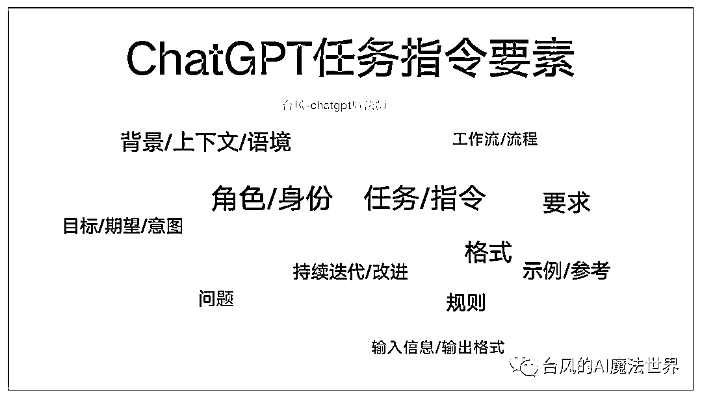
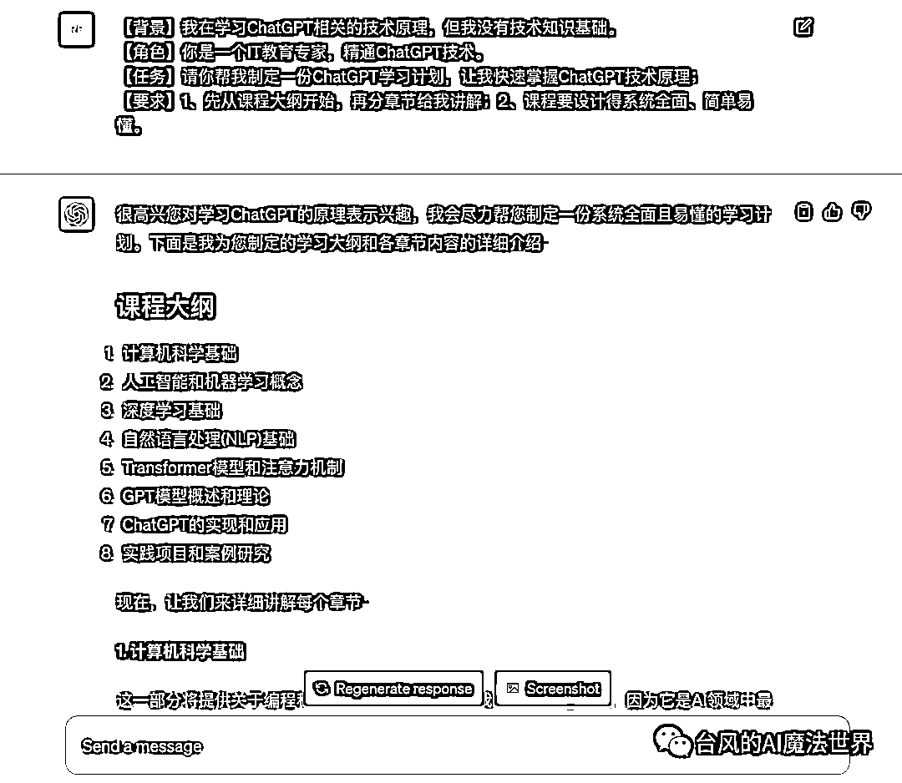
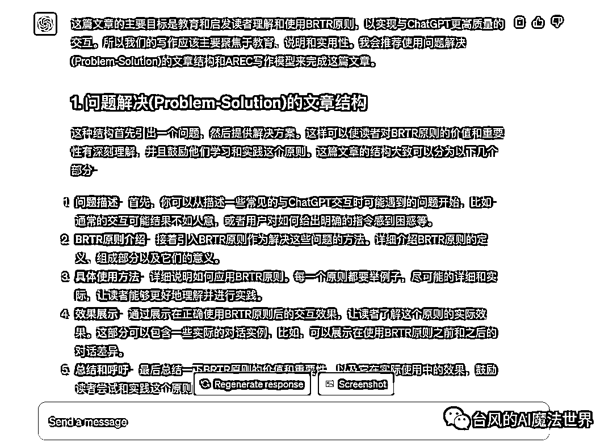
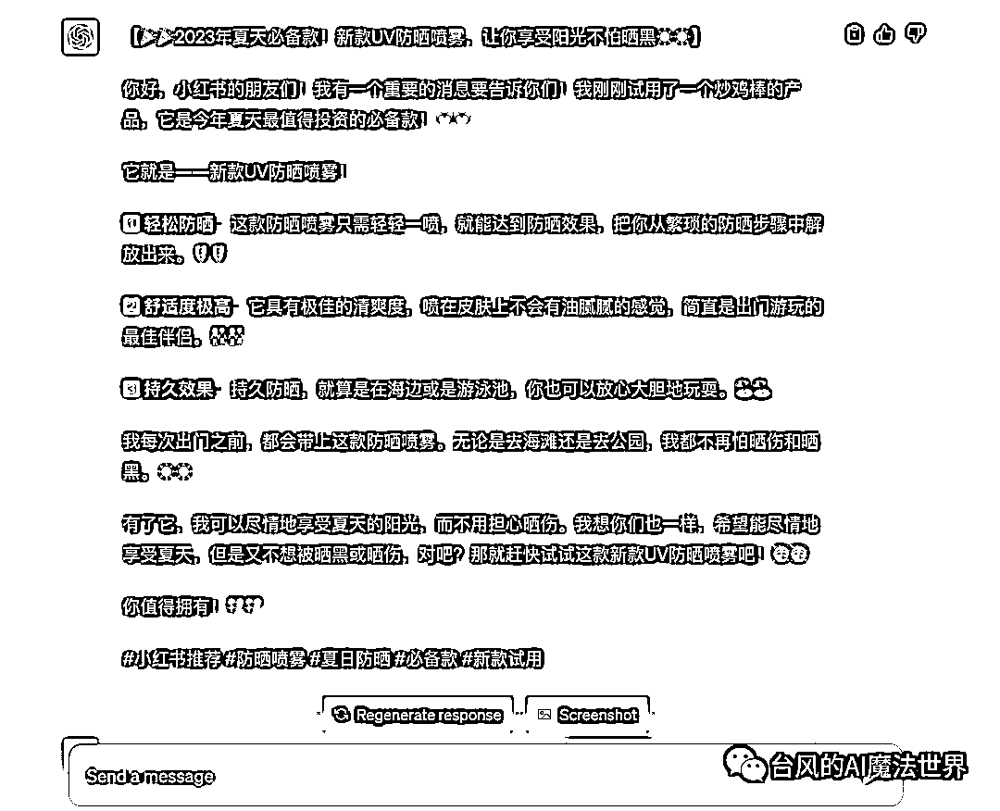
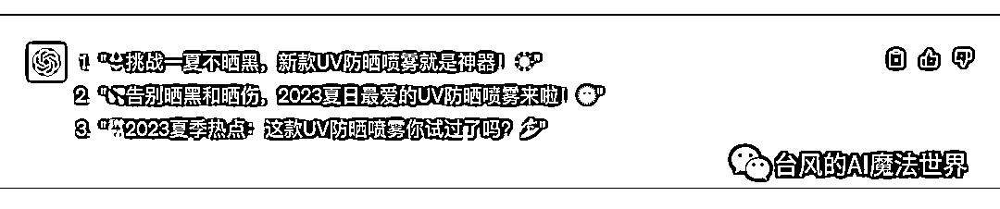
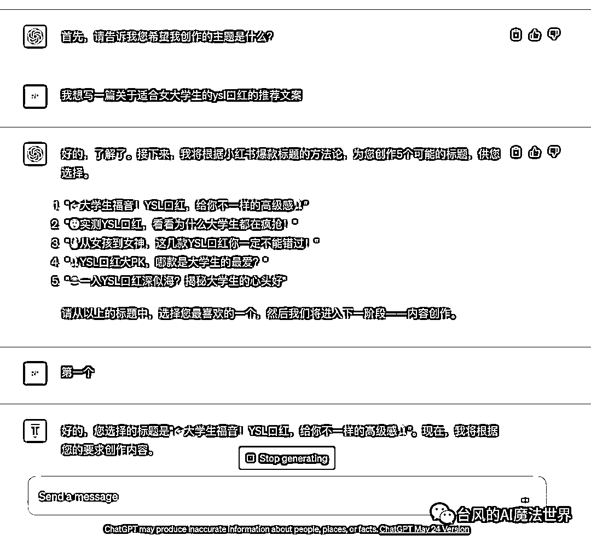

# ChatGPT任务指令万能模板：简单好用的BRTR原则(学习AI必备教程)

> 来源：[https://xq6mz7nkknp.feishu.cn/docx/L2eMdbYAfoIqBQxfA6ScKtI5nch](https://xq6mz7nkknp.feishu.cn/docx/L2eMdbYAfoIqBQxfA6ScKtI5nch)

大家好，我是台风，一名AI魔法师，《ChatGPT产品商业俱乐部》创始人，公众号矩阵粉丝近2万，希望能成为国内ChatGPT模式的布道者之一。

我擅长创作chatgpt指令和产品应用，曾创作过创作过Ai佛祖、Ai律所等多款火出圈的应用(日访客过万)，参与过等多本AI行业书籍的案例编写。

【ChatGPT指令生成器】访问地址：https://ai.gptprompts.com.cn

# 一、如何给ChatGPT布置任务？

“ChatGPT强大到什么程度？一个简单到极致的聊天框，闲聊一样唠会嗑，就让AI帮你把活给干了！”

这大概是很多人在没有真正用过ChatGPT之前，对ChatGPT的刻板印象，或者说是幻想。

用多了自然就会明白，ChatGPT的聊天框是简单，使用门槛却不低。

当你把ChatGPT当做生产力工具，想要一个高质量的、可控的任务结果时，其实对提问所用的Prompt提示词有着很高的要求。

ChatGPT只是一个通用AI，一个云共享的临时实习生助理。智商、学历确实很高，但他缺乏业务经验，既不了解你，也不了解什么才是符合你要求的好内容、好回答。受限于记忆字数，这次勉强了解，下次还是记不住……

所以想要让ChatGPT干好活，就得跟带“外包”实习生一样，基于不信任原则，每次都把话说得明明白白、把事交代得清清楚楚。

什么样的任务指令，才能让ChatGPT更好地理解和执行？

业内的同行专家们为了解决这一问题，也总结了很多的ChatGPT指令框架，基本都是从以下的任务要素中选择组合。

那么，什么样的任务指令框架，更贴近我们的自然沟通习惯，能让初学者更容易记住理解、并快速上手呢？

# 二、万能任务指令模板：“BRTR”原则

既然我们把ChatGPT视为“数字生命”一般的AI助理，那布置任务完全可以借鉴人类沟通的方法准则。

回想一下，在日常生活工作场景中，清晰且自然的任务话术，是不是比较类似以下这样的格式？

生活场景

（背景）今天天气真是太热了，我嗓子都要冒烟了！（身份角色）老公，（任务）你回来的时候买个西瓜吧。（要求）最好是无籽西瓜，不要买太大，3、4斤就行，让老板给你挑一个熟的、甜的。

工作场景

（背景）我们这个七夕促销活动马上要开始了，需要做新媒体推广来让更多用户知道和参与。（身份角色）小刘<注：运营人员>，（任务）麻烦你来写一篇公众号号活动推文吧。（要求）内容写短一点、五六百字就够了，突出我们的活动预约福利，风格要活泼一点，明天下午3点之前给我初稿。

从上述例子可以看出来，一个高质量的任务，应该包含讲述背景、指定对象、分配任务、明确要求4个部分。

参考生活工作场景中布置任务的高效话术，

我总结了一套能让ChatGPT更好理解和执行的任务指令框架：“BRTR”原则。

任务指令=说背景(B)+定角色(R)+派任务(T)+提要求(R)

说背景(B)：说明布置任务的前提缘由、面临的问题等，提供必要的解释；

定角色(R)：设定ChatGPT扮演的专家角色身份，限定专业领域的回答范围；

派任务(T)：简单介绍任务的主题、概要和预期，明确ChatGPT的任务方向；

提要求(R)：具体的任务要求，如内容标准、参考示例、输出格式、流程规则。

以下是“BRTR”原则的图示。

其中“BRTR”原则里的背景、角色要素，属于任务的约束或补充辅助项。

我们可以根据自己的需求和习惯，简化为“BTR模式”（背景-任务-要求）、或者“RTR模式”（角色-任务-要求）。

举个例子，运用“BRTR”原则让ChatGPT帮我制定“ChatGPT学习计划”，可以看到他针对我没有“技术知识基础”的背景，特意加上了“计算机科学基础”这一章节，内容输出的结构，也遵循了“先列出大纲后讲解章节”的要求。

需要注意的是，GPT-3.5和GPT-4.0在理解能力和创作能力上均有区别，如果有较高要求，尽量使用GPT-4.0。

为了让大家更好地理解和运用BRTR原则，我制作了一个“ChatGPT指令生成器”，基于BRTR原则帮你一键生成任务指令模板，为你提供思路参考。

访问地址：https://ai.gptprompts.com.cn

# 三、如何使用“BRTR”原则？

## （一）说背景（Background）

背景信息一般聚焦于讲述我们自己要完成的任务，任务的前提缘由、目标或面临的问题，以及自身的情况等。这样ChatGPT作为“外包”，就能够基于背景信息更好地提出针对性的解决方案。

比如，当你想让ChatGPT写一份产品经理招聘JD，那么对应的隐含背景信息是：你作为一个HR要帮公司招到一个符合岗位条件和要求的产品经理。

背景：我是一家年营收3000万的电商公司的HR，我们希望招一个3年经验左右的产品经理，来负责我们电商APP的产品策划，要求有电商产品背景，20万年薪。

我在写本篇文章时，希望在文章结构、写作模型方面得到ChatGPT的建议，并让他按照给出的结构模型试写文章，那么我得把“BRTR原则”告诉他，不然他会对这个概念一脸蒙逼。

背景：我正在写一篇文章“ChatGPT任务指令万能模板：人人都能学会的BRTR原则”，主要目标是教别人快速掌握给chatgpt布置高质量的任务的方法。BRTR原则由四个要素组成：背景(B)、角色(R)、任务(T)、要求(R)。

背景信息也可以是介绍性的材料，比如希望和ChatGPT针对某个现象、事件、观点立场、概念进行讨论创作，那么可以把这样的材料放到背景(Background) 里。

讲述背景这一环节，本质是在帮助我们梳理清楚自己任务诉求、出发点，我们搞清楚了自己的情况、需求、问题，才能把任务更好地传达给ChatGPT。

## （二）定角色（Role）

ChatGPT是一个通用AI，就像你问一个万事通，他确实可以回答你的任何问题，但只能泛泛而谈，毕竟他不是所有领域的专家。

这是因为ChatGPT在缺乏有效引导或约束的情况下，需要在庞大的数据库里搜索合理的答案，那么命中效果就会变得一般，语言风格也将是偏机械的。

角色设定指令是ChatGPT官方支持的能力，起到“调度”行业专家模型的作用，通过身份来约束ChatGPT的回答领域范围，一定程度上能让回答更有针对性。

不同的任务场景，可以设定ChatGPT扮演不同的角色身份，也可以设定知识经验水平、精通领域、语言风格等细化的要求。

一般来说，我们倾向于给ChatGPT赋予专家身份，来让回答显得更专业。

写小红书：

你是一名资深的小红书博主，精通编写小红书爆款文案。

商业顾问：

你是一名世界顶级的商业顾问，擅长给企业诊断问题并给出解决方案。

需要注意的是，简单的角色扮演主要起到收窄ChatGPT的回答领域范围的作用，和回答质量不是绝对正相关的关系。

虽然“角色派”是主流方法之一，但它在ChatGPT商用内容创作领域中，质量权重影响占比不算太高。

## （三）派任务(Task)

这一环节主要是让ChatGPT明确自己是在处理一个特定的任务，帮助他了解任务的主题、关键内容、预期等。

我们可以多使用一些特定具体、限定约束的词汇，让任务主题更加聚焦。比如写文章场景，限定是“公众号”平台、点明要“爆款文章”、重点突出文章主题等。

任务属于概括性、总结性的说明，所以一般会写得相对简洁。

任务：请帮我写一篇能让用户主动点赞收藏的爆款公众号文章，围绕主题“ChatGPT任务指令万能模板：人人都能学会的BRTR原则”进行原创编写，让不熟悉ChatGPT的小白也能轻松理解和掌握。·

(注意：该例子仅为简单演示，没做具体要求优化)

## （四）提要求(Request)

告知ChatGPT任务主题之后，接下来进一步提出更详细的任务要求。

用来处理复杂任务的指令，质量差异主要是体现在要求设定上。如果想让结果可控，那么要求就需要写得更全面。

在内容写作、咨询评测、咨询讨论等不同的任务场景中，要求也应该是针对性定制的。

比较常用的任务要求类型有4个：内容标准、参考对象、输出格式、流程规则。请按需选择或组合。

### （1）内容标准

不同的内容类型元素组合千变万化，即使小红书文案看起来格式都差不多，但因为行业、人设或转化需求不同，那写法风格也是不一样的。

我们可以参考以下问题，来思考自己需要提出哪些要求细项。

*   内容要包含哪些模块？

*   要引入写作或思维模型规范内容结构吗？类似“开头、中间、结尾”的结构是否需要分别定义？

*   文章文体、写法、表达手法有没有要求？语气风格希望是严谨还是轻松幽默的？

*   那段落、句式、词汇、字数更细化的层面呢？需要举例吗？要添加表情图标吗？……

比如像写小红书，为了让结果更可控，对小红书文案风格作出详细的定义(注意：不涉及特定需求优化)。

【要求】你的文案应该有以下特点:

1、表达要口语化，标题吸引人，要多使用emoji表情图标；

2、内容观点尽量分点罗列，适当描述自己的使用体验和评价；

3、文案最后生成相关的标签；

4、文案不得超过500字。

针对想要的内容类型，你也可以向ChatGPT请教以获得建议。

### （2）参考示例

我们提出的标准，大多数时候都是偏抽象的，ChatGPT理解起来会有些偏差。

ChatGPT擅长模仿，那么给出参考的示例、资料、最佳模板，就可以显著提高结果的可控度。

如果某种风格是比较大众、知名、通行的，我们可以直接指定风格让他仿写，比如小红书文案风格、鲁迅风格等。

像爆款标题，市面上已经有很多成熟的方法论模板，那么我们可以把爆款标题的方法和例子告诉他。

你需要为上面的文案内容创作3个爆款标题。请学习以下小红书爆款标题方法，选择合适的方法进行创作。

1.  使用挑战或实验的标题："挑战一周不吃糖，你猜我瘦了几斤？😱"

1.  提供解决方案："🌟控油又保湿，告别油皮的5款神器💦"

1.  利用趋势或热点："🌞2023夏季最火的10款连衣裙，你入手了几款？👗"

1.  对比和比较："🏠家居大PK！IKEA vs MUJI，究竟谁更适合你的品味？🌟"

1.  利用挖掘性标题："这可能是你还没发现的最好用的护肤品💎"

要是你不太了解某个领域的方法论、模型等，问ChatGPT让他告诉你。

我们也可以直接引用文章片段，让他进行参考。当然如果是要模仿整篇文章的话，最好还是分拆多个任务让他先学习总结风格，再布置创作任务。

### （3）输出格式

常见的格式如大纲、摘要、表格、图表展示、markdown、json、代码块等。

markdown格式，输出的内容比较适用于和PPT、思维导图、流程图等办公工具进行二次结合。

如果对于输出内容有特定的格式要求，例如让他帮忙出题目，包含题目、答案、分析等多个字段，最好是给他进行格式举例。

请你帮我把BRTR原则整理成表格，两列展示原则、用法。

### （4）流程规则

当我们希望设计分步骤处理内容或进行互动的场景指令，就会涉及到流程规则的描述。

每个流程步骤，需要描述清楚ChatGPT在什么情景条件处理什么事务、遵循什么规则、要作出什么反馈等。

创作、咨询、学习、评测、游戏等互动场景，可以按需添加流程规则，流程任务指令通用性和引导性都会更好。

比如小红书创作流程，让ChatGPT先引导用户提供主题，ChatGPT根据主题拟好相应的5个标题，用户选择1个标题后，ChatGPT再开始正式创作。

# 四、如何编写任务指令？

## （一）指令编写格式

指令的表达格式并没有什么要求，只要模块清晰即可，ChatGPT理解能力还是不错的。

如果任务比较复杂、或者发现ChatGPT误解指令，建议还是标明、划分每个指令模块，也方便扩展。

1、自然表达

我在学习ChatGPT相关的技术原理，但我没有技术知识基础。你是一个IT教育专家，精通ChatGPT技术。请你帮我制定相应的学习计划，让我快速掌握ChatGPT技术原理。1、先从课程大纲开始，再分章节给我讲解；2、课程要设计得系统全面、简单易懂。

2、添加标识

背景：我在学习ChatGPT相关的技术原理，但我没有技术知识基础。角色：你是一个IT教育专家，精通ChatGPT技术。任务：请你帮我制定一份ChatGPT学习计划，让我快速掌握ChatGPT技术原理。要求：1、先从课程大纲开始，再分章节给我讲解；2、课程要设计得系统全面、简单易懂。

3、划分模块

【背景】我在学习ChatGPT相关的技术原理，但我没有技术知识基础。

【角色】你是一个IT教育专家，精通ChatGPT技术。

【任务】请你帮我制定一份ChatGPT学习计划，让我快速掌握ChatGPT技术原理。

【要求】请遵循以下要求：

1、先从课程大纲开始，再分章节给我讲解；

2、课程要设计得系统全面、简单易懂。

## （二）指令要素选择

“BRTR”原则包含背景(B)、角色(R)、任务(T)、要求(R) 四个要素。

写指令的时候是否要描述全部要素，取决于任务的通用程度、复杂程度和可控性需求。

我们可以根据自己的需求和习惯，简化为“BTR模式”（背景-任务-要求）、或者“RTR模式”（角色-任务-要求）。这两种模式组合，足以应对大多数任务场景。

当任务足够通用和简单，完全可以只描述“任务-要求”，甚至只有“任务”。比如：请帮我详细讲解下ChatGPT技术中的词嵌入模型相关的原理。

## （三）任务指令固化

一条或一套优质的任务指令，应该是能够稳定有效地解决某类特定任务的。

比如我做的ChatGPT小红书生成器，支持一键生成文案；比如在自媒体场景下，针对某个细分领域进行主题文章仿写的创作流程指令。

我们需要根据效果测试不断地调整指令，直到它能稳定地输出可控的结果。

任务指令固化为模板后，支持直接使用或者只需要微调，就可以大大提高沟通、创作效率。

## （四）对话持续优化

在日常使用中，我们通常不是单轮问答就能完成任务。

和ChatGPT交流、共创，这是一个持续沟通优化的过程，需要通过追问、补充、纠正等方式，来逐步完善ChatGPT交付的结果。

如果任务比较复杂，我们有时需要拆解成一整套的多条任务指令。

# 五、ChatGPT指令生成器

最了解ChatGPT的，当然是他自己。

既然我们写任务指令是为了让ChatGPT更好地理解和执行，那不妨把这个活交给他来干。

这就是“ChatGPT指令生成器”的由来，基于BRTR原则帮你一键生成任务指令模板，为你提供思路参考。

请注意，它仅仅适用于新手入门练习的初级参考，还需要结合你的实际需求场景进行修改。

访问地址：https://ai.gptprompts.com.cn

# 六、最后的最后

“BRTR”原则是一个基础框架，你可以基于这个任务指令模板，快速创作出明确具体的ChatGPT沟通话术，减少不必要的返工和追问，提高交流效率。

在应对复杂任务时，“BRTR”原则也有着很好的延展性，可以灵活扩充，让结果更加可控。

“BRTR”原则亦是一种思维模型，核心价值在于启发我们自己对任务需求的思考。

“BRTR”原则由我正式提出并梳理成框架体系，它也是无数人深度使用ChatGPT之后，越来越趋同的思想认同和方法选择。

# 七、个人简介

【名字昵称】台风(AI魔法师)

【城市坐标】杭州

【职业背景】腾讯前员工，电商创业公司前产品合伙人，放弃几百万股份全职干AI

【专业技能】擅长创作chatgpt指令和产品应用；互联网全能选手

【项目经历】

1、2月入局ChatGPT，搭建新媒体矩阵，公众号粉丝近2万

2、创作过Ai佛祖、Ai律所等多款火出圈的小应用，日访客过万，吸引了王小川等多位大佬和投资人的关注

3、参与过等多本AI行业书籍的案例编写

4、《ChatGPT产品商业俱乐部》创始人、生财有术GPT航海教练、肖厂长AI提示词高手联盟成员

【资源服务】

1、《ChatGPT产品应用实战课》

2、ChatGPT商用级系统部署服务、企业培训服务

3、微软中国OpenAI合规资源