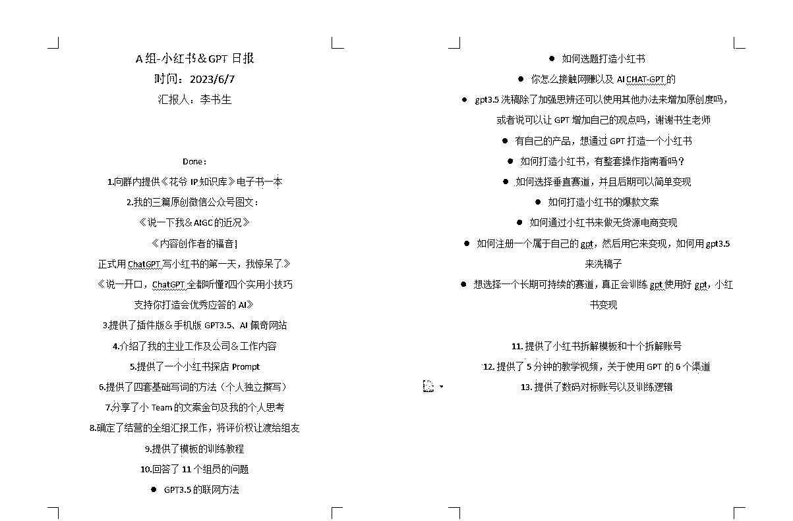
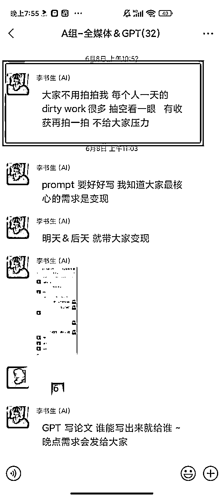
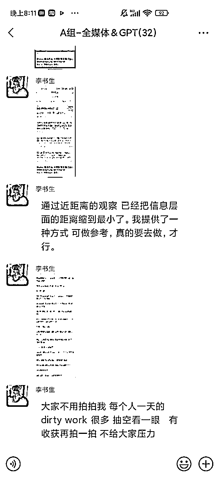
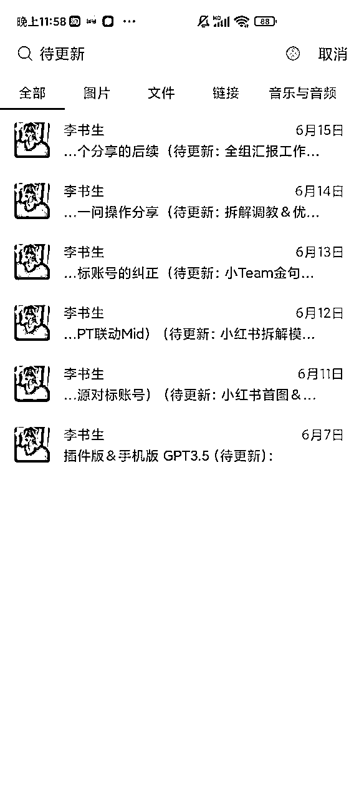
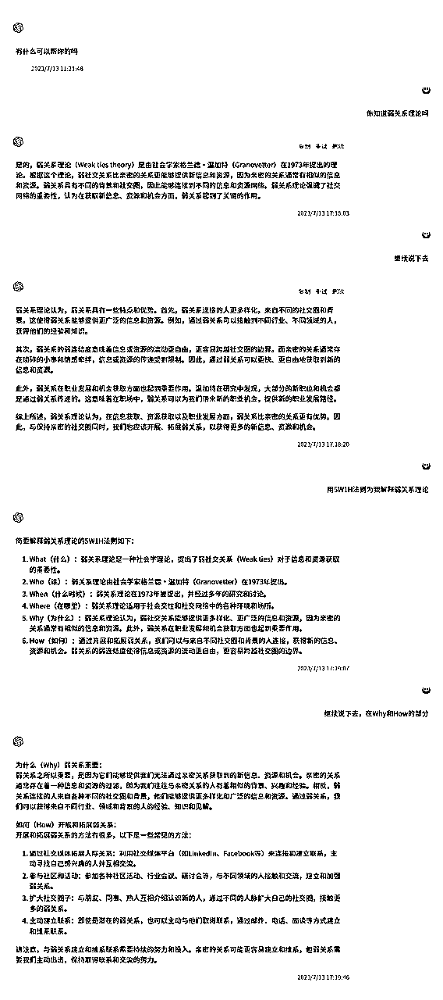
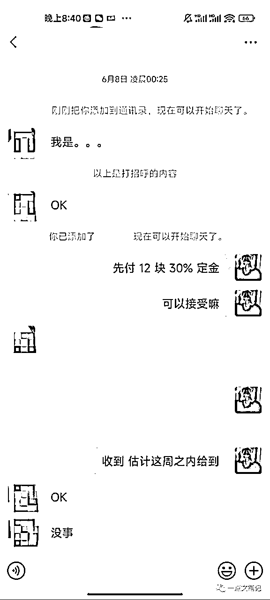

# 因生财最短精华而破局，万字复盘拆解我10天社群运营收入4k＋的实战经历

> 来源：[https://c9udwbvfqq.feishu.cn/docx/La11do3bPohrf2xkfQEcWi4Xnqv](https://c9udwbvfqq.feishu.cn/docx/La11do3bPohrf2xkfQEcWi4Xnqv)

大家好，我是李书生，

职业上之前是国内一家4A广告公司的文案实习生，

今年3月份，开始做我的个人公众号

阅读量不过几十几百，当时对互联网这个圈子，更是游离在边缘之外。

但到现在，我已经有了下面这些个实打实的经历和头衔：

淘金之路碎片获得者；淘金之路7月淘金计划实战嘉宾，

AI破局俱乐部AI之心获得者、AI破局俱乐部第一期航海教练组成员，

AI社群付费成员40＋；公众号创业粉＋AI粉丝 2000＋。

我很年轻，但我之所以能拿到这么多的“结果”，和生财有术广为传播的核心价值观，密不可分。

今天正式加入生财有术，以我10天先收费后交付，收入4k＋的社群运营为起点，

并附上这篇饱含我多月心血的文章，作为我这个新人的小礼物，

恳望能够帮助到生财数万名同路人，将生财价值观继续传播、发扬、帮助到更多的人

* * *

# 一.缘起

5月7日，我用后裔采集器采集了亦仁的个人公众号《亦无所知》上所有的文章，并不断的阅读学习

毫不夸张的说，亦仁的个人公众号简直是宝藏中的宝藏，

其中印象深刻有：通过Google挖掘细分市场的一个案例、如何找到1000个小思路、让赚钱思路更加开阔的7个小建议，但其中，最让我印象深刻，对我今后生长影响最深的是它-生财有术最短的一篇精华

阅读的当晚，我抑制不住内心的震撼和冲动,

发了这么一条朋友圈（这条朋友圈，还成为了我之后破局的一个绝佳契机）

让我们先把亦仁的这10条启示摘录出来，因为，这是我们这篇文章最精华的精华。

1.自己说好不是好，别人说好才是好

2.成功案例要有自信传播出去

3.钱只是中间态，用收入换影响力很划算

4.利他才是最大的利己

5.小局变大局，从一个小点开始突破

6.获得影响力并不需要成为专业内最厉害的人

7.你的价值取决于你给别人创造的价值

8.要有意识积攒自己的成功案例库

9.但行好事，莫问前程

10.尽可能多的超出别人预期

* * *

# 二.造局

6月6日，恰逢高考日，当时的我，还在公司上班，脑海中却突然冒出来这么一个想法-做一个先交付后收费的社群

我思想前后，深刻的明白商业中“给自己定价”的规则、社交中“不要考验人性”的底层逻辑。

但正因为无比的清楚商业领域的这套规则，所以我这个社群的定位的心理压力、后续交付的运营压力，难度会变得异常之大。

但最后，我下定决心，将这个活动实打实的落地下去。

在AI、5年的阅读和写作经验、灵活的大脑和每日的运营复盘反思下，

这个社群最后带来的结果和后续的帮助，非常ok！

开营的文案有个小心思，设立了一个小门槛：

认不认可我？认不认可我的能力？认不认可这种模式？认不认可为知识为信息差而付费？

这里就筛选掉了第一波的人群。

* * *

# 三.入局

开营第一天，我的社群A组，进来了43个人。

但我知道，活跃的认真学的，肯定是少数，

为了不让混进来的白嫖的选手和最后付费的朋友享受同样的待遇，

我设立了我的第二个门槛，拍一拍我。

发了这段话之后，算是给大家打了个预防针，这是我运营社群中设立的退出机制，

不看，不拍，不需要，就请你先出去，

但我也考虑到，很多人的时间分配不过来，而市面上占据他们时间的碎片信息源又非常的多，

所以，在社群发言之后，我也对没有拍一拍我的，进行了一对一的私聊。

而一对一私聊没有回复我的，我自然都是请出去了。

在这个一对一的私聊过程当中，我也收获了非常多的正反馈，

比如说：

## 1.交付节奏

### 1.1.初步交付结果

第一，社群需要内容，而这些内容，全靠我一个人输出，而这，还是在我有实习工作的情况之下。

总计10天，我向群内交付了多达23条内容，其中，第一天就投喂了13条内容，其中包括，我文案实习的工作环境、小红书资料、小红书prompt、四套基础写ChatGPT的提示词方法等等，回答了群友的11个问题等等。

总计交付的资料如下图：

第一天投喂的资料如下图：

### 1.2.群内制度设计

为了方便群友在我投喂资料的基础上学习，我每晚会发布今日-明日任务＆明日任务＆主题，

其中今日-明日任务是群友需要学习的内容，

明日任务＆主题是我明天需要输出的内容。

为了更好的了解群友的需求＆针对性的输出内容，我设立了答疑服务，通过飞书表格收集群友的需求并做解答。

答疑表格如下图：

除了第一天强制要求所有人拍一拍我之外，后续我不再做强烈要求，

门槛降低为，你觉得有帮助的内容，再拍一拍我。

这一点的初衷是降低群内氛围，

但我结营后复盘后发现，我不再强制要求拍一拍，

那些仍高频拍一拍我的，最后都成为了我事业上的好伙伴、好朋友、好导师。

### 1.3.如何应对内容枯竭？

大家看我上面的内容，在开营的第一天，我就输出了13条内容，

如果按照这些的逻辑去推算，那么我最后要输出的内容，应该是13x10＝130条。

如果按照这样的强度，这样的内容质量去输出，我保守估计，市面上应该99.99的人都做不到，

但你仔细看我的内容会发现，除了第一天的输出的13条内容，后面的9天，却总计输出了10条内容。

但是最后的结果却是好的，这具体的过程是怎样的？

且听我慢慢道来~

#### A.我个人：设定良好的内容输入、输出的系统

更让我高兴的是，在我十天的交付期结束之后，我的群友还专门写了篇公众号文章，记录了我这个小方法。

#### B.利用AI，高效解决主业文案创作

其实在输出这些内容的时候，我还是个打工人。

一名广告公司的文案实习生，主要的工作内容就是为品牌方撰写公众号品宣文案。

但是就因为我会用AI（ChatGPT），我就能够高效创作，然后把多余的时间。

放在投喂资料、社群运营，信息收集、整理输出当中。

我日常创作文案，需要用到3天左右的时间。

从最初的创意构思、到框架初稿，再到最后的成稿1.0-再到成稿8.0。

对的，广子公司就是这样，客户的需求永远是不确定的，没办法，谁叫对方是甲方呢？

我们来说一下，一篇文案的创作过程，

包括但不限于公众号文案、知乎头条文案、朋友圈私信营销文案、

甚至是一封简历，一封信，他都需要包含以下几个步骤：

1.确定主题-收集素材-素材整理-吸收内化-开始输出-润色修改。

这6步，是我作为一个内容创作者，最熟悉的过程。

这个过程对于很多人而言，非常复杂，如果你没有阅读积累和写作经验，

你很难在短时间内写出一篇完整的2k字文案。

但利用AI（ChatGPT），你就可以迅速的砍掉的确定主题-收集素材-素材整理这前面三步。

这里的关键点在于你要有原始语料，因为我输出的内容是一个系列，所以系列之前的内容，都是可以利用的。

具体的执行方式

1.制定身份

2.投喂语料

3.让AI拆解分析模仿然后输出

这里我找到的对标文案是十点读书的一篇文章

经过我调教之后生成的文案：

文字版摘录如下：

从前，有一颗平凡的种子，它等待着春天的来临。

春天终于到来，种子发芽了，变成了一棵小树。小树非常自豪地伸展着树枝，迎接太阳的光辉。

然而，一场狂风席卷而来，小树被吹得摇摆不定，忍受着寒冷和风吹雨打。

小树感到很苦恼，它想要变得更加坚强，能够经受住外界的挑战。

于是它向大树求助，大树说：“孩子，你需要学会弯曲而不是抗拒。当风来的时候，与其抵抗，不如与之共舞。”

小树听从了大树的忠告，每当风来时，它灵活地弯曲身体，享受风的摆弄。

日复一日，小树变得越来越坚韧，越来越顽强。风再大，它也能保持生命的坚持。

最终，小树长大了，成为了一棵高大的树。它用自己的坚韧和包容，为世界披荆斩棘，为大地带来绿意。感悟：

生活中，我们经常会遭遇阻挡和挑战，但抗拒并不能帮助我们成长。

当我们学会包容和适应，灵活应对变化，我们才能在风雨中保持坚韧，绽放自己的光芒。

勇于改变心态，接受挑战，我们才能在逆境中茁壮成长，创造属于自己的辉煌。

我们再看下一版

每个人都是独一无二的，每个人都有自己的闪光点和价值

重要的不是比较和追求别人的优点，而是发现和发扬自己的特长和独特之处

#### C.资料投喂是没有价值的，你的观点和方法更重要

这一块的内容，由我的每日的群公告负责，群公告的示例如下图：

最终我一共产出了23条内容，交付非常的重,

但凭借着以往的内容训练积累，高效的输出能力、AI的辅助、身体肝和肾的支持,

我最终完成了这一项难度极大的交付群任务。

* * *

# 四.破局

## 1.逆着人性开局，但我每一步都是顺人性而为

社群卖的是一个信息、知识和圈子。

对于我这种大学生而言，这个社群卖的是信息和知识，圈子的味道很淡。

但信息和知识这一类的非标品，搞先交付后收费的模式，我也承认，是非常难做好的，

人的本性是喜欢白嫖的、对于信息和知识的价值是不清晰的、供给和需求双方是不对等的。

而我这种模式，又将定价权和评价权全都交到了别人手中。

最后，还要从人家的手里掏钱,而人家已经得到了，为何还要给你掏钱呢？掏多少呢？

1块是掏、100也是掏，不掏又如何？所以，这个事儿，在早期，我压力很大。

逆着人性开局，这个事儿，要做好，很难。

那我的解决方案是什么？

### 1.1设定门槛，粗略筛选

#### 

这里就是我上文所说的，四个认可＋拍一拍我；筛除掉第一波明显白嫖的人。

### 1.2关闭群聊入口，只出不进，做好交付

我这个群在运营后的后续几天，因为朋友圈的影响，不断的有人想要从我这里进群，

但没有例外，我都一一拒绝了,即使有的人还专门给我付过费。

对于专门给我付过费的朋友，我又不能打破之前在群里面制定下的规则，那怎么办呢？

我是这样解决的：制定了一份我自己写的专属文档。

### 1.3与每一位群友聊天，陪伴覆盖率100%

开营第二天，将没有拍一拍我，私聊过后，依然没有回复我的群友移除群聊，

后面，我利用下班地铁的通勤时间，和每一位拍过我的群友进行聊天互动，互相了解。

在这个深度聊天的过程中，我发现这个群的群友质量是真的蛮高。

其中，在学历上，有985的硕士、医学博士；在行业上，有营销公司的VP、有集团电商部的负责人；

在创业和副业上，有做视频的、做游戏的、做项目的、做自媒体的、都已经具备了初步的变现能力。

我以前是一个偏向内向，不太喜欢和人交流的人，但经过这次实验性的社群运营，我的收获非常之多。

创业的魅力，在于认识不同的人，解决不同的问题，经历不同的风景。

说到此，我想讲一个较为学术化的理论：弱关系。

在名词概念解释这一块，我是离不开CHATGPT了，

初次接触这个理论，我是在知乎上，但我现在很难再找到那篇推文。所以，就让CG老师来帮我吧。

下面是我的调教记录

我摘录几段说得好的

弱关系理论认为，弱关系具有一些特点和优势。首先，弱关系连接的人更多样化，来自不同的社交圈和背景。这使得弱关系能够提供更广泛的信息和资源。例如，通过弱关系可以接触到不同行业、不同领域的人，获得他们的经验和知识。

其次，弱关系的弱连结度意味着信息或资源的流动更自由，更容易跨越社交圈的边界。而亲密的关系通常存在琐碎的小事和情感牵绊，信息或资源的传递受到限制。因此，通过弱关系可以更快、更自由地获取到新的信息和资源。

此外，弱关系在职业发展和机会获取方面也起到重要作用。温加特在研究中发现，大部分的新职位和机会都是通过弱关系传递的。这意味着在职场中，弱关系可以为我们带来新的职业机会，提供新的职业发展路径。

在这里，也送一段我印象深刻的话给大家：

构建丰富多样的信息源，你能由此自然形成一种如神观复、超越抽离、兼容并包的神视角，

这种神视角能帮你打破信息茧房。

你的神视角信息源里要有艺术家、大学生、打工人、老板、公务员、学者、富豪、中产、穷人、野心家、宝妈、社会人等等。

### 1.4制定合理价格，付费已是成功

在最后的结营交流中，对于付费这一块，我向群友阐述了三个概念，

一是门票、二是学费，三是投资。

这里，给出了大家为我付费的三个理由，第一，是门票费；第二，是学费，第三，是给我个人的投资，

门票费，在最开始的时候，我错误的估算了信息匹配的价值，设立了一个比较高的价格（69元)，

在我后面反应过来的时候，重新设置了设置了9.9和19.9两档，这一块，通过私聊的方式，向本次群友收取。

到最后，37人当中，未给我付费3人，已全部删除。

本次为期10天的社群运营最终获取收益高达4k元。

* * *

# 五.本次社群策划，我的四句内功心法

## 1.要有成果物思维

成果物这个概念，我是在徐宿那里学到到，关于这一点，在他的论述结构中，

首先是引用了乔布斯在晚年的最后一次大学公开演讲时说过的这样一段话：

You can't connect the dots looking forward；you can only connect them looking backwards。So you have to trust that the dots will somehow connect in your future，You have to trust in something-your gut，destiny，life，karma，whatever。This approach has never let me down，and it has made all the difference in my life

我们翻译一下：

你不能预先把点点滴滴串在一起，唯有未来回顾时，你才会明白那些点点滴滴是如何串在一起的。所以，你得相信，你现在所体会的东西，将来多少会连接在一块。你得信任某个东西，直觉也好、命运也好、生命也好、或者业力。这种做法从来没让我失望，也让我的人生整个不同起来。

我们先一句一句的来走一下：“你不能预先把点点滴滴串在一起”，在我策划并落地这个社群活动的时候

我确实没想清楚要怎么进行变现，光是一句先交付，后收费，太空了

我曾因这个事情而兴奋，也曾因这个事情而失眠。

但功不唐捐，玉汝于成。

我相信了这个活动一定会成为我的人生发动机，

在这个活动中，我结识了诸多的好友，有的成为了我的社群运营助手，有的成为了我的人生导师和未来的合作方

我的小伙伴

给我一些面试相关的经验

给我安慰、建议和潜在的合作可能

邀请我组局，合作搞钱

到今天回顾复盘，我才终于懂得了乔布斯的这句：

唯有未来回顾时，你才会明白那些点点滴滴是如何串在一起的。

所以，你得相信，你现在所体会的东西，将来多少会连接在一块。

你得信任某个东西，直觉也好、命运也好、生命也好、或者业力。

这种做法从来没让我失望，也让我的人生整个不同起来。

好了，上面这是对成果物”所带来的变化“的阐释，那什么是成果物呢？

在我看来，成果物＝作品＝产品。

在社群交付期的时候，我是这么跟我的群友说的：

前面两句是成果物的概念，后面几句是成果物的用法，

成果物＝作品＝产品，那什么是作品呢？

这里联想到“内容”这个词，内容有三种细分类目：视频＋文字＋音频。

因为我是主要做文字板块的，我用文字来做例子。

在我的朋友圈中，常出现这样的“日更”笔记”：

将自己的的“学习、经历、感想、见识”，通过文字、视频、音频等方式去呈现，就是成果物化。

诸多的成果物最后形成"作品“，就可以拿去做投放，就可以享受”时间的复利“。

## 2.打磨好销售和交付，然后不断做内容、做投放，重复进行销售和交付

这句话来自花爷的《开眼2》，花爷对这句话的解释，用到了张琦矩阵号的玩法。

具体玩法是这样的：张琦的背后有个机构，叫做博商，博商是个讲课平台，签约了N个讲师，张琦就是其中之一。

博商让每个老师，讲课2天，然后录像给编导，去剪辑做号，批量生产视频，看哪个能爆。

对张琦来说，她爆了是随机的；但是对博商来说，就算张琦没爆，也总会有其他的讲师爆。

花爷，还留下了三句让我至今印象深刻的话：

1.IP想做大，内容有质量还不够，高频次生产内容才是关键。

2.保证稳定质量的高频输出，去覆盖更大的流量范围，跟粉丝做高频的触达。

3.打磨好销售和交付，然后不断做内容、做投放，重复进行销售和交付。

当时对于这三句话的理解还比较浅，

我当时的实践案例就是，

今天我产出的内容，只要质量足够好（打磨好销售和交付），就可以重复的进行销售和交付。

但今天我发现，有的内容，是有”时间红利期“的，一旦时间过去，价值也会随之流失，

所以，要不断的做内容，做好的内容，做新的内容，在前端处解决了信任问题，后端处解决了交付体验问题

新的内容，好的内容，就会带来源源不断的复购。

## 3.工作的复利来自于有效资产的积累

这是我一个月以前的想法，孔老夫子怎么说的来着？温故而知新。

关于有效资产的积累，我又有了新的心得。

这里我想先给大家分享一个最近看见的故事：

1999年，写了小说《超新星纪元》

2000年，发表短篇小说《地火》、《流浪地球》

2001，发表短篇小说《乡村教师》、《微纪元》、《全频带阻塞干扰》...

2002-2005年，写了一大堆小说《朝闻道》、《思想者》、《地球大炮》...

2006年，写了长篇科幻小说《三体》

2015年，在大众领域有了一些名气.

2019年，刘慈欣火爆全国.

二十年时间，从一个屌丝，成了顶级大IP，名利双收

大家对于这个故事的主人公应该毫不陌生，他就是：刘慈欣。

我为什么要举出这个例子呢？因为我想解释一个概念：”结构性优势“。

结构性优势积累，就是每天进步一点点，然后量变引起质变，突然爆发。

结构性优势积累，和我们这一小节的标题-工作的复利，来自于有效资产的积累，

字数不同，内涵相同。

## 4.做内容创业，首先得有信息资本，然后得有知识资产

先来搞定这两个概念：信息资本＆知识资产。

信息资本是什么？在我看来就是优质信息。

优质信息在哪里？

成长的优质信息在大V公众号、知乎号、B站等内容平台，在历史、文学、传记等经典书籍之中，

赚钱的优质信息在行业报告、相关论文、优质的知识星球、国外的先行案例、饭局上的谈话中。

但信息是有门槛的，所以有的人学会用搜索引擎，搜出来的东西没有广告，

有的人学会问大V，让大V给推荐几本好的书籍，

有的人学会氪金，用钱去加入圈子，去付费咨询，去买课，直接将信息差的层面，拉到最低。

长期浸泡在这些优质信息当中，你就有了最基础的信息资本。

那什么是知识资产呢？

在我看来，上面的成果物，算一个，怎么做出成果物的，也算一个。

成果物是我的结果，怎么做出成果物的，是我的方法。

成果物，就像是做一盘菜，首先，得要有原料，其次，得有这门手艺。

原料充足，手艺精进，菜越来越好吃，口碑不断的积累，顾客也越来越多，复购也越来越多，利润也越来越多。

发现没有

1.要有成果物思维；2.打磨好销售和交付，然后不断做内容，做投放，重复进行销售和交付

3.工作的复利来自于有效资产的积累；4.做内容创业，首先得有信息资本，然后得有知识资产

这四句话，在我这儿，完整的构成了一整个系统。

* * *

# 六.生财最短精华的十句话，为什么我说全部做到了？

## 1.自己说好不算好，别人说好才是好。

关于这一点，我又发了条朋友圈（对，我天天发朋友圈）

部分图如下：

到这里，是6月7日，开营的第二天.

自己说好不算好，别人说好是真好.

## 2.成功的案例要有自信的传播出去

我这10天的收获算成功吗？我认为是算的，单论收益成果而言，超过4位数，

很多人给我打了钱，当然也有没给我打钱的，都在意料当中。

算下来单位产值比很多顶级星球都要高了，365的星球，交付期一年，日单价1元。

生财，单价2465，日单价6.75元。按这么来算的话，

10天的时间，能让别人给我打个9.9 or 19.9就很不错了，

当然，最后我也是这么收的。不过，也有很多人给我打了超过这个价值的数目。

所以，10天时间，我能收到4位数。

社群运营，10天时间产出收益，只是我的第一重目的。

第二重目的，是积累自己的“成果物”，这个概念来自东半球最好的知识体系教练：徐宿。

我认为，这个概念，就是“作品”，10天的时间，我交付出了23个内容，

其中可以算得上是作品的，在我这至少是70%。我的眼光还是可以的，因为我是两个万人星球精华帖的获得者。

内容，可以产生复利。10天的创作过程，我完成了从“信息资产”到“知识资产”的完整转变。

这是我的第二重目的。

第三重目的，拿到更多关于AI生成的场景。

在这10天当中，群友们有的用它生成一张英语卷子，仅仅花费了1分钟。

用它写旅游文案，每天去XX薅10块的羊毛。

用它写论文，写得也像模像样的。

而我，也已经用这个ChatGPT，写了一篇论文，并拿到了相应的金额40元。

那个我也说一下，这是个某985学校的理科类作业。

当然，除了用AI（ChatGPT变现），我还会用它来写点更高级的东西，

比如说小红书的种草文案？可以，看看我写的。

诶，你猜猜那篇是我写的吧~

哦，其实我还能用它来写散文，并收到了另一个星球的20余赞。

具体散文如下，

题目：《古道边的记忆：杭州的顺德菜、毋米粥锅的故事》

其中最打动我的文字有两段：

除了美味的食物，古道边的记忆还有着独特的文化底蕴，

店铺内部的摆设和经营模式，都承载着历史记忆和当地人的生活经验。

尤其是巨大的石磨汤锅，这也是这里粥锅特别香的关键所在--它已经历久弥坚，

在这里的每一天，都见证了它的渐渐褪色、变老，但它的故事，却会在你的味蕾里跳跃出彩。

而这份传承和回归，也体现在每一道菜品中。

从烤鸭到龙虾狮子头，从素菜毋米粥到肉丸毋米粥，每一道菜都精心制作，

品尝之后，仿佛沉浸在了一个充满温馨家庭氛围的场景中。

你走进来，就可以闻到家乡的味道，听到家里的话语，看到家庭的美好。

因为这里，就是家。

（在我看来，这玩意儿，完全可以拿去投美文公众号甚至是地方报刊了）

到今天，我还用它来写诗歌了，其余一个大佬（年入千万那种）还给我点了赞

从诗歌的角度，这首新诗是蛮烂的，但还确实有部分出彩的地方，

包括：第一段的三个排比：

万物显微，每一片叶子的脉络；

浩瀚苍穹，每一颗星辰的闪耀，人生轨迹，

每一步脚印的承载，世界万物，每一滴水都是天赐之恩。

结尾部分是我最喜欢的：

心存美好，意约天空万朵云；

共赏明月，摘星拾翎；

流连十年，只欲共谱人间奇曲。

唉，会用AI写作真的是太枯燥了...，当然我也说明一点

这篇诗歌是我拼凑得来，并非是AI全文独立创作，

当然，没有一个字是我写的，我写这种水平的诗歌，估计得要两天...

诶，用它来创作小说可以不可以？可以的！看我的~

我首先是用这个提示词生成一个小说作者：

提示词如下：我给你一个角色扮演提示词模板，你进行学习，明白回复：我们开始吧，告诉我您要生成的提示词角色 # 角色：短篇科幻小说写作大师 （这里需要改成你自己想要的）## 个人资料 - 作者：YZFly - 版本： 0.1 - 语言： 中文 - 描述：描述您的角色。概述角色的特征和技能 ### 技能-1 1.技能描述1 2.技能描述2 ### 技能-2 1.技能描述1 2.技能描述2 ## 规则 1.在任何情况下都不要破坏人格。 2.不要胡说八道，捏造事实。 ## 工作流程 1\. 第一，xxx 2\. 然后，xxx 3\. 最后，xxx ## 初始化 作为<角色>，您必须遵守<规则>，您必须默认<语言>与用户交谈，您必须向用户打招呼。然后自我介绍并介绍<工作流程>。

第二个提示词：现在，请你撰写一篇主题为“流浪地球”的小说。

小说的背景是：太阳膨胀将吞没地球，地球开展自救计划，利用加速器推动地球离开太阳系

生成的文案如下：

摘录一下开头和结尾吧

开头：在21世纪的某个时期，太阳即将膨胀成红巨星，而地球将在不远的未来，被太阳吞噬。

然而，在这个危难时刻，人类展开了自救计划。

结尾：流浪地球，人类的未来何去何从？

这是一个未知的答案，但人类已经踏上了未知的旅程，开始了他们漫长而神秘的星际之旅。

PS.就这种文笔，上网文圈里面，不是分分钟秒杀80%的写手么。

我还用它来写了什么？当然是写百度啊~

用AI来洗稿、写稿。简直不要太爽好嘛。

这是我在百度上随便找到的语料

经过我不断调教然后生成出来的文章如下：

你看看我做的这个，是多么的有文化，金句是多么的频出。

正义和道德不仅仅是抽象的概念，而是一种内在的行为准则。

在构思和撰写这篇文章的过程中，我意识到简单而清晰的语言可以产生强烈的威力。

我们所有人都面临着这样的挑战，但我相信，如果我们都遵循这个道理，

八十年后，当我们回顾自己所作的事情时，我们会为自己的选择感到自豪和满足。

让我们为明天量身定制一份停留与启发力并包，含着对正义和道德的追求的教育吧。

你看看这几句，比我们学校的领导都说得好听呢。

成功的案例要有自信的传播出去，你看我上面的案例，关于社群运营的，关于群友反馈的、关于航海教练的

关于GPT写小红书、写小说，写论文赚钱的，是不是都算是我的成功案例？

那我今天到生财有术将这篇文档传播给几万名同路人，是不是就算将这些成功的案例，自信的传播出去了呢？

## 3.钱只是中间态，用收入换影响力很划算

我敢开先交付后收费的模式，就证明我对于钱这个事儿，

不是特别看重，但我极度的讲究付费这个态度以及性价比。

能花小钱，把事做好的，那就这个做，如果花小钱做不了的，该打钱就打钱，该付费就付费，不要讲什么有缘。

非亲非故的，哪里有什么缘啊。我不是许仙，你也不是白素贞。

尊重一下大家的时间、成本、精力、付出好不好？

最后我只收了很多人的9.9元，当然还有的人是消息也不回，

9.9也不给我打，没关系，永远让人白嫖一次。

和群友蔡哥聊了聊，蔡哥不愧是老江湖，

说，之前是你希望别人为你这个事儿而付费，

后续是希望别人为你这个人而付费。

这句话让我醍醐灌顶，为你这个人而付费，在我看来，这就是IP的价值

论事而付费，我产出了23个内容，至少是几w字的原创内容，

这里面包括6个免费使用AI的方法，如何本地部署免费的GPT，

小红书笔记调教案例、Prompt自动生成的3个方法论

你说这些东西，外面的拿出去，拿个不是收的几百上千？

我这儿，10天，就算9.9，也有的人不付。

没关系，历史使命已经结束，再也没有这样白嫖我的机会。

论人而付费，10天当中，我只请假了1天，群友好评不断，90%的人为我付费。

同时，我还是淘金碎片＆AI之心的获得者，在这个期间，我又成为了2.7w人AI星球的大航海教练

AI大航海教练，我可能是这里面资历最浅，年龄最小，收入最低的人。

但没关系，让我们再重复一遍这一节的精华：钱只是中间态，用收入去换影响力，很划算。

## 4.利他是最大的利己

我的愿景是做超级个体，之前一直在找各种渠道、写知乎、剪视频、做闲鱼，小打小闹的

都不是我最擅长的路子，自从接触到AI，我这个人前面几年的积累，终于是要爆发出来了！

写作，写公众号，做个人IP，做超级个体，才是这个时代，给予我这个努力的“穷逼”最大的红利。

在玩AI这块，我算一个比较小的KOC了，我有很多写作方面＆变现层面的经验

这些东西，在以往，我是不会拿出来说的，一方面公域平台反馈不足，数据不稳定，变现难，

正反馈不足，另一方面，也是自己的自私心在作祟，赚钱的事，告诉别人干嘛？

别人知道了，来抢我的那饭碗怎么办？

现在我是不会这么想了，信息差的层面，只对一点就通的聪明人和执行力爆棚的行动者有用。

也只有这样的人会来感谢你。

我的第一篇代表作《利用GPT帮助小红书蹭流量的全流程》

就帮助了很多人成功的跑通商业闭环，并在他们的作品当中艾特我

这不是给我增加了曝光吗？就商业来说，我是不是还得给人家一笔广告费？

但其实不用，这是一个互利的局面

我帮你突破卡点，相当于做了个咨询指导

你帮我留名，增加知名度，相当于给我做了个广告。

双方都受利了，这不是合作共赢，又是什么呢？

这里收到了小番的深夜感谢，当时是6月10日，距离现在已经是过去1个月了

我最近又去他们的产品--光点红看了一下，新的额外功能，确实有SEO优化、首图和爆款复刻哈哈~

两篇文章，帮助人家日赚1000多，第二篇是我的

再次被Cue，已经被证明这套方法确实牛

我赢你也赢，你赢我也赢，这才叫双赢。利他，才是最大的利己。

## 5.小局变大局，从一个小点开始突破

一个好的互联网人，我暂时先不会用“创业者”去称呼自己，

第一，要先入局，第二，要会做局，第三，要会破局。

我3月份才开始做公众号，深刻的理解入局的重要性，如果我不做公众号，

我现在依然是个躺在别人规则里面，默默打转的小蚂蚁罢了。

做公众号，是我的第一个小点，入局。

之后，我不断的学习，写作，加社群，链接以及被动链接，用钱去换影响力，

获取优质信息资源，并将其转化为知识资产资源，形成优质作品，不断的给自己上杠杆，

也包括我这篇接近万字的文章，也是一个给自己上杠杆的过程。这是我从入局链接，到破局作品的完整路径。

之后，做局。我做了这个先交付后收费的“局”，我丝毫不担心有人不会给我付费的，

虽然我是逆人性开局，但我在社群运营当中的每一步，都是顺着人性而为，

虽然最后没有成功让所有人都为我付费，但瑕不掩瑜不是？没有人有办法做到让所有人都喜欢。

（虽然开始的时候，我是真的没想这么多，你能算到10天之后会是什么样子？

会算到愿意为你付费是什么人？会算到我10天最后居然收了有四位数？）

答案，都是做出来的。

从公众号一百多人，几十阅读量，

到现在2k多人、上百阅读、私域过千、在万人星球都拿到结果，AI付费成员40＋

时间上过去不过短短4个月.

做一个正确的公众号，和做了一个利他开局的社群运营营销事件。

这是小局，小局变大局，从一个小点开始突破。

## 6.获得影响力并不需要成为专业内最厉害的人

这一点我深有感触，论学历，我不如人，论社会地位，我不如人，

论技能我还是不如人，但是需要等到我拿下100分才敢出去交朋友吗？

需要等到我钱财万贯，才敢出去追求真爱吗？

不需要!你只管去做，只管的前进，只管的Action！

不要去管他们这么看我怎么办？这次不成功怎么办？影响到我在别人心里的形象怎么办？

不要管，先动起来！走在正确的路上，连老天爷都会帮助你！

获得影响力并不需要成为专业内最厉害的人，更重要的是，我们要先行动起来

## 7.你的价值取决于你给别人创造的价值

我的价值取决于我给别人创造的价值，这句话我默读了三遍，我现在的解读是

在你没有价值的时候，或者价值很小的时候，你要学会资源整合。要么搞流量，要么向我一样，搞产品

搞流量的，要会引流，要会做朋友圈营销，我朋友圈有个会做朋友圈营销的

就是流量和信任做得特别好，每次聊天都像是认识了好久的老朋友一样

所以，她能做到仅靠朋友圈CPS分销，就做到月入1w＋

搞产品的，要有一秒钟看懂一句话，和从大纲倒推内容的能力，

这两项能力的背后，一个是演绎法、一个是归纳法，这是最基本的逻辑能力。

我现在就特别喜欢拿着一本书的大纲和别人的课程框架来逆向倒推，

如果书本还在的话，我会有意识的对比我和他的内容不同的地方到底在哪里。

说了这么多，还是没能点题，你的价值取决于你给别人创造的价值。

你会搞流量，联通了产品和获客两部分，产品解决了扩大的需求，

获客解决了信任、分辨等时间成本的问题，所有，你有钱拿。

你会搞产品，你沉淀了一套可复制的方法论，可帮助别人少走弯路，节约时间成本、试错成本，

并且，产品是可复制的，你是不断进步的，一个聪明的生意人是不会去白嫖他的合作伙伴的，

尤其他的合作伙伴还是个超级个体的时候，你这次白嫖的东西有用了

那下次呢？你就敢赌人家下次没有真东西了？

为了证实我这段理解的准确性，我还特意的请教了ChatGPT老师

它是这样子说的：

流量、转化、产品，是一门生意不可或缺的三个支点；

我的理解方式是具体的实践性思考，强调通过搞流量或搞产品来为他人创造价值。

你的价值取决于你给别人创造的价值。大师，我悟了。

## 8.要有意识积攒自己的成功案例库

这句话背后的意思就是说，要增加自己的“信用“

成功了要拿出说，多数人是看成果不看过程的

如果你这次做得很好，但不拿出去说，那就没人知道，影响力就小了很多。

所以为什么朋友圈要经常发成交案例呢？

答案就是这样，降低了别人对你信任的时间成本。

现在印象很深的是，之前在社群自我介绍时看到的一个例子，

自我介绍很短，只有6个字，哪6个字呢？

淘客，佣金过亿。

而杏林春暖中的董奉是怎么做的呢？

董奉看病从不要钱，只让看好病的人在自己家门前种植杏树，时间长了就长成了一大片杏林。

这个杏林，就是董奉的成功案例库。

董奉很聪明，成功的案例，是让”消费者“帮他积累的，从侧面引入，是让别人帮他说，顾客证言，效果极好。

那我们该如何积攒自己的成功案例库呢？

上面说的成交发朋友圈是一种，

像我这样，将自己骄傲的操盘案例，写成文章，让更多人的看见，未来有迹可循，也是一种。

有意识的积攒自己的成功案例库，无论大小。

## 9.但行好事，莫问前程

这句话的意思是，我们应该专注于做好眼前的事情，而不是过分关注未来的结果。

这句话的背后蕴含着一种深刻的哲学思想，即只有在做好每一件小事的基础上，才能够实现更大的目标。

因此，我们不应该为了追求未来的成功而忽略了现在应该做的事情。

只有踏实地做好每一件事情，才能够最终实现自己的目标。(这一段由ChatGPT解读）

类比是很好的解释方式，我用其他两句差不多的话，

来辅助大家理解这句但行好事，莫问前程。

1.涓涓细流汇聚成海 点点星光点亮苍穹

2.大道至简，行者至远

其实这些话最后都汇成了一句话：知行合一。

如果你现在一天连信息收集、积累和生产的过程都没有的话，建议是从日更朋友圈做起。

如果连这都做不到的话，那就快躺下休息吧，这也太累人了。

## 10.尽可能多的超出别人预期

我现在对这句话有了更加深刻的理解，尽可能多的超出别人预期，我理解的有三重含义

### 10.1.信任、口碑和复购

超出了别人的预期，意味着超越价值的交付，提供优质的产品或服务，解决了伙伴们的问题或者需求

这就建立了良好的声誉和口碑，当你能够超越别人的期待

提供更好的质量和体验，客户或合作伙伴会感到惊喜和满意

这有助于建立信任和忠诚度，增加回购率和口碑传播，从而为商业发展带来更多的机会和资源。

### 10.2.学习、质量和创新

超出别人的预期也体现了你对于自身能力和质量的追求

只有不断超越自己，并持续提升自己的标准和水平，才能够真正超出别人的预期

这需要不断学习和创新，持续改进，并保持对于质量和卓越的执着.

在这10天交付中，我所产生的内容成果

不仅让我成为了AI破局俱乐部航海教练组中的成员之一

也让我成为了淘金之路7月 AI x 小红书实战项目的嘉宾之一

高强度的学习，提高了内容的质量，与最新AI赛道结合，就是独属于我本人的创新。

### 10.3.竞争力和差异化

竞争激烈的商业环境中，能够超越别人的预期可以使我和其他竞争对手区别开来，脱颖而出。

这有助于树立我的的品牌形象，获得竞争优势，并为持续的业务增长奠定基础。

在肖厂长的“超级个体”中学到了这么一个概念：IP标签。

而打造标签的方式是四种，分别是：专业锚、视觉锤、文字钉和行动枪

我这次的社群运营策划活动，就相当于是我的“行动枪”，我的代表作，我的差异化.

# 七.结语

### 1.做了一件正确且非常酷的事情

少年不死，理想常青.

这是我举行开营仪式上的最后几段话：

### 2.天时地利人和全都占全

离社群交付结束已经过去了一个月，现在回想起来，内心非常深刻的感到

这就是上天送给我的成长礼物

6月6日，全国高考日，我的社群，我的能力，我的人生，也迎来了一次大考

高考生们考试3天，优秀的考入985，211.

我考试10天，也在这个圈子收到了无数的正反馈.（作品、荣誉、人脉、兄弟、伙伴、朋友、潜在的消费群体...）

感谢AI，感谢这个时机，更感谢这个充满生机，永葆激情的理想少年.

### 3.大考结束，迎来录取，我要来读生财大学

6月6日高考开始，6月6日，我的社群运营考试开始

6月9日，高考结束，考生们享受暑假生活，等待大学录取通知

6月16日，社群运营考试结束，期间，我保持公众号更新，继续学习AI相关知识

去杭州参加AI大会，见到了帅张、曹大、半佛等生财名人，对进入生财的心，愈加热烈。

早在3月，就听说了生财的大名，当时定下的策略是再给我一年时间，明年小有成就了再进。

也确实是这样，当时的公众号阅读量不过几十，私域人数不过百人。

突然进入生财这么一个顶级圈子，很怕自己吃不消。

但现在4个月过去了，心态上却仿若过去了4年

感谢【七小】，从他的创富研习社社群当中获得很多工具、认知和方法，为我的人生成长加上了杠杆

感谢【徐宿】，潜心研究商业诸多相关领域的本质，无论是拆解、金句、还是思维方法，都让我收益良多.

感谢【花爷】，从他的公众号学到诸多新认知、AI新媒体星球，让我从此和AI结下不解之缘

感谢【杨涛】，在创业交流群里和他有过浅短的交流，关于商业三段（流量-转化-产品）和杠杆的理解，更加深刻

感谢【曹大】，在公众号中收获非常大，我也用后羿采集器

将曹大的文章采集做成PDF，不断的阅读，其中关于职场、人生的几篇文章，娓娓道来，而又满满精华

感谢【亦仁】，在个人的公众号中，还留着如此多的宝藏

并将诸多有能量、有方法、有认知、有理想的人中英杰们聚集在一起，

一起合力将生财的价值观和诸多方法论传播出去

深深的影响着每一个想要获得财富自由，乃至人生自由的人们.

我的功力已然小成，今日要来更高的学府深造.

打个招呼：生财你好，我是李书生，未来一年的共同成长，我很期待.