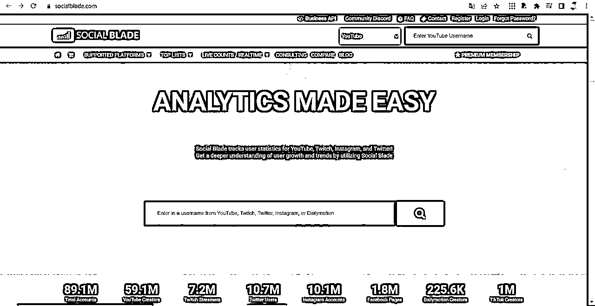

# 为什么YouTube非常值得你做？

> 来源：[https://rlwxa0zgke.feishu.cn/docx/LjgAddKHUoKrlTxa1Egc62QKnRf](https://rlwxa0zgke.feishu.cn/docx/LjgAddKHUoKrlTxa1Egc62QKnRf)

为什么YouTube非常值得你做，我们从这个图开始说起，大家也不用图片识别网址，我给你贴出来了https://socialblade.com/ 这个是一个什么网站？是一个油管的频道分析网站，这个数据全都是来自油管的官方，它通过后台 API 的方式提取的，然后以它这种格式化、图表化把它展现出来。

一些圈友对于英文不太懂，这个图是什么意思呢？我肯定要解释下，如果你是大佬，那么解释内容可直接跳过了

我们知道油管整个平台有 近20 亿月活的观众，很显然 20 亿的人当中只有少部分人是内容创作者，他们创建频道上传视频。那在创建频道做内容的这部分里面，又有相当一部分人没有达标被批准加入 YPP，或者是达到了这个标准，但是审查不通过，因为内容不适合播放广告。

那么下面就是数字解读时间：

59.1MYouTube Creators :油管的频道组总共有 5900 W+

这个59.1M数据是不准确的，为什么？频道组指的是创建的有这么多一个频道组可能会有多个账号，每一个账号底下可能会有多个频道，是这样一个这个结构。

油管它应该是把一个频道组的基本信息是作为隐私保护起来的。

你可以讲这个频道有多少粉丝，有多少观看量，它的这个频道的名称是XXX，但是这个XXX这个频道属于哪一个人？这个账号应该是隐私的一部分，它是不会作为一个公开数据报告出来的。

也就是说我的理解这 5900万是频道数字，不是内容创作者数字。

有的公司它旗下可能有 50 个账号，有的个人他是专门做批量这个营销号的，它可能有 1000 个号，在它底下 1000 个频道，所以这个不能理解，它是内容创作者的数量，也就是说整个 20 亿的观众里面不会有多达 5900 多万的人在生产内容。

那么有多少人通过创建YouTube频道赚到钱了呢？那么就要用到这个网站了https://blog.youtube/inside-youtube/responsibility-good-business-and-creator-economy/下面的内容是来自于网站的一个中文翻译，如果你英文能力足够好，那么直接看英文就好了。

十四年多前，我们推出了 YouTube 合作伙伴计划（YPP），这是一个首创的开放式货币化计划，任何符合条件的人都可以加入并开始赚钱。

事实上，我们与创作者分享了一半以上的收入。如今，YPP 仍是全球创作者经济最大的推动力之一。加入 YPP 的创作者可以通过 YouTube 上的十种不同的货币化功能（我们还在不断增加），从广告商收入到销售商品，通过自己的内容赚钱谋生。在过去三年中，我们向创作者、艺术家和媒体公司支付了 300 多亿美元。

现在，全球有 200 多万创作者参与 YPP，其中包括许多原本可能没有平台的人，从技术评论员到艺人。其中许多创作者正在创造就业机会，为当地和全球经济做出贡献。

最关键的我已经给你标出来了，现在，全球有 200 多万创作者参与 YPP，其中包括许多原本可能没有平台的人，从技术评论员到娱乐明星。

这句话翻译翻译就是说有 200 万个账号，它每个月通过它的 AdSensed在往外打钱，打出去的钱是多少？告诉你，在过去的三年，油管总共付了 300多 亿的广告费，这是个很大的数字。

20 亿的观众，有5900W的频道，实际上不一定有这么多，假设只有2000W，在这 2000 万人里头只有 200 万的是加入了YPP，是一个很小的这样一个体量。

我们做一个不靠谱的平均，这样能更好的直观感觉这个YouTube这个市场 300亿/200万 = 15000美元

按照中美的一个汇率，那就是 15000*7.21 = 108150

从总共付出这么多钱来讲的话，其实这个是一个天花板很高的一个东西，也就是说的确是有人在 YouTube 上面作为一个全职，并且每年能赚到十万、几十万、百万甚至千万，这都是可能的事情，

如果你把这个东西当做一个长远的事业来做的话，这还是一个就是虽然竞争激烈，但是这相对来讲属于一个低成本，对于普通我们老百姓可以弯道套车的这样一个竞赛的场地。

这里的话插播下我自己做YouTube的一个数据，给大家一个信心，我在之前的贴子上有写一个详细的每天的一个增长数据的详细说明

我的感想：

我要说我看到这个数据是我觉得有点意外，这个数字是很小的， 200 万，这么大的一个平台，

只有这么一点点人在这个 YPP 里头。

另外一个数据我要提醒大家注意的就是在 https://socialblade.com/的上面报告了这个，现在海外版的抖音也只有 100百万个号，这是让我非常吃惊的一个数字。

1M：TikTok Creators 100W的抖音账号

这么火爆的一个平台，那么多的参与者，看来绝大部分人都在那边刷这个娱乐视频，看小姐姐，极少数的人在那上面创作内容，那人群聚集，大量的消费。

然后创作内容的人又少，这是不是告诉我们这可能是一个巨大的潜在机会？

你千万不要认为讲现在 TikTok 好像不知道如何变现，或者变现渠道非常有限，你要相信一点，这个有人的地方就会有钱。

当年 Facebook 这个扎克伯格董事会，大家都叫他要把这个公司卖掉，扎克伯格他就不卖，他讲我也不知道将来怎么赚钱，但是我知道这个数据每个月按百分之六七十这样的数据增长的话，只要有人我一定将来会想到办法如何赚钱。

中国版本的扎克伯格就是马化腾，这个也是中国人熟知的一个故事了。

最后的话：我个人觉得YouTube值得当成一个长期的项目来做，也希望更多的生财圈友重视YouTube，你在国内赚的是人民币，在国外赚的是美金。

可以显而易见的是，两样的努力，两样的视频，同样的播放数据，这些都一样的情况，你觉得在国内赚的多还是在国外赚得多呢？

同时国内的很多项目做的人多，竞争也大，头部把大多数钱都赚走了，如果你觉得在国内的项目卷，卷不过，YouTube确实是值得考虑的一件事的。

有时候榜样的力量是无穷的，我看到有一个人的收益图，如下图所示，这更加坚定了我做YouTube 的想法

好了，今天的分享到这里，希望对你有帮助。