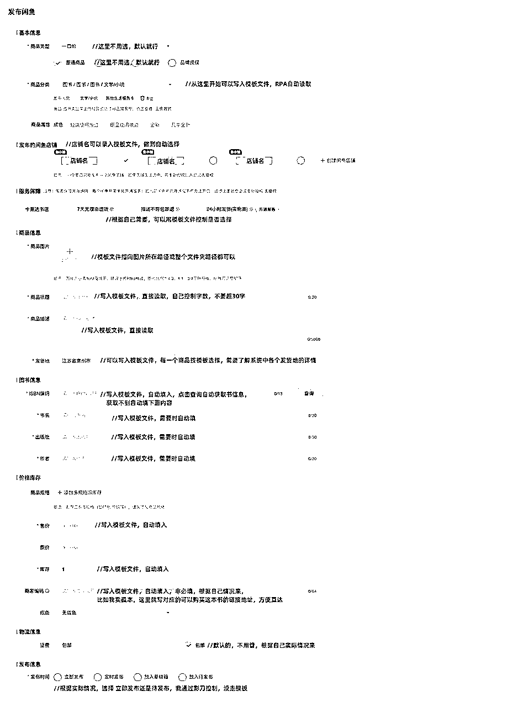
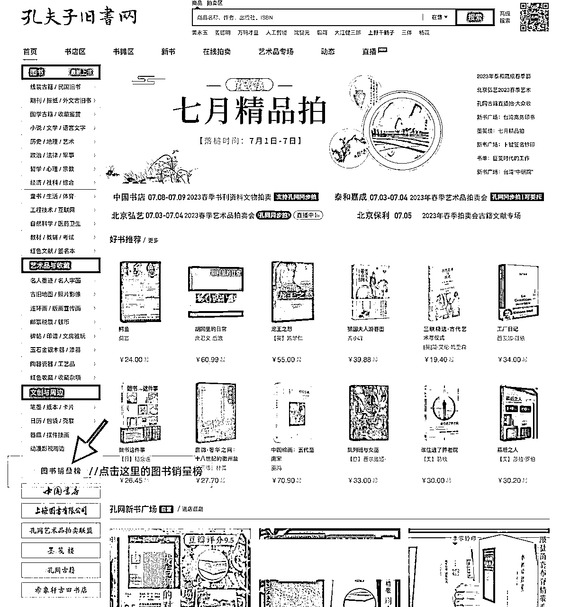
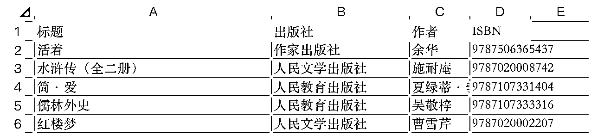
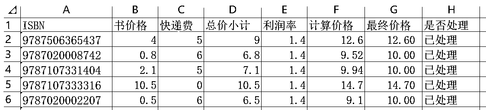

# 从0打怪：利用自动化工具提高从采集到上架效率的闲鱼二手书实践历程分享

> 来源：[https://cw58pxup5t.feishu.cn/docx/LpSvdQmvKoBdgaxmzMtcYmW0n6d](https://cw58pxup5t.feishu.cn/docx/LpSvdQmvKoBdgaxmzMtcYmW0n6d)

# 引言

大家好，我是生财圈友风澜，潜水看帖子也有很长一段时间了，今年2月份在生财看到了老瞿分享的闲鱼二手书项目，很赞同老瞿的价值观，又看到了小嵩月流水过万的分享，更加坚定了把二手书做一个长期副业去做的想法，于是链接老瞿，加入二手书事业的大部队，跟着大佬们从0开始，边学习电商知识，边搞二手书。

在刚开始做的时候，闲鱼官方是有个活动的，在截止日之前上架满400本书后，可以开通3000的权限，这相当于1个号有6个号的商品数，这得冲一下啊，在冲的过程中发现，上架书真的是很痛苦的事情，需要找图，编写文案，定价，选地址，上架，然后重复上述流程，重复的过程是痛苦的，但是重复的过程肯定也是可以自动化代替的，所以我就想，是不是可以利用现有的自动化工具，来辅助完成这一步重复的工作，然后我就利用八爪鱼+影刀RPA，解决了重复上书的这个问题，而且后续还可以持续的作为高效上书工具使用，接下来给我用人人都能看懂的文图视频，给大家详细讲解如何使用这两款软件，为我们赋能提效。

亦仁说过，不希望文章过长，所以为了提高阅读效率，本文尽可能只讲核心逻辑，某一块涉及到的详情内容，另起对应操作详情文档供大家阅读。

PS：此篇文章1带3，内有详细介绍子环节如何操作的其他3篇文章，有需要的可自行跳转阅读。下文中的蓝色字体均为超链接，可点击跳转至对应页面。

# 一、设备软硬件准备

## 设备

*   Windows电脑，我操作系统是win10，这个只要是Windows应该问题不大，不推荐Mac，影刀在上面好像不太好用。如果有个备用的电脑可以挂机不影响其他的工作，那就更好了。

## 软件

*   八爪鱼：之前用过一段时间的后羿，但是后羿有些功能需要开会员，理论这两个应该都可以的，本文以八爪鱼为例展开说明，官网可下载软件

*   影刀：同类型的软件有很多，按键精灵，UIbot等等，本文以影刀为例展开说明，官网可下载软件

*   闲管家：闲鱼第三方erp软件，浏览器操作，很好用，官网在这

*   闲助手：生财圈友大佬华少出品，当时大佬的软件还没出，手动上的500本书，自从大佬的软件出来后，上架速度单车变跑车，感恩大佬。站在巨人的肩膀看的更远，借助高手的势能效率更高，因此基于大佬的闲助手，也写了一个自动脚本，省去人工操作，香的很。

# 二、上书流程

我的上书都是使用电脑上书的，不是用闲管家，就是用闲助手，所以本文不适用于手机上书。

以闲管家为例，上书的基本流程如下所示：

闲管家发布商品详情页截图：

从上面我们可以看出上书的流程规范，且重复，只要我们把内容准备好，变成模板，就可以让工具帮我们把重复的体力劳动自动化完成了，节省出大把时间让我们去更好的选品和优化。好说干就干，那就操练起来。

让我们分析一下，都需要在模板中准备那些内容。

# 三、准备阶段

## 1.分析

首先需要分析一下，我们在上书过程中，哪些是最重要的点，通过上面的上架商品的图我们不难得出，最重要的信息有如下几个

*   ISBN

*   书名

*   出版社

*   作者

*   售价

*   商品标题

*   商品描述

*   商品图

我们再进一步分析，这里面ISBN是一个主要关键内容，无论是上书，查价格，还是以后去买书，ISBN都起到了很关键的作用，所以我们可以考虑ISBN作为突破口，围绕ISBN建立一系列的模板内容（一般来讲大多数情况下，ISBN是唯一的只会对应一本书，但是系列书或者新版书，可能也会沿用原来的ISBN，但只占少数）。

## 2.信息采集

问题：去哪里批量获得高质量的ISBN呢？

答：电商做得好，选品少不了，很多地方都可以获得高质量的ISBN，这里就以孔夫子销量排行榜获取为例，结合八爪鱼去获取ISBN，当然也有很多其他的途径，那就需要大家自己去挖掘了，dangdang，jd，tb，pdd，db，dzy都可以。

### 2.1 孔夫子销量排行榜ISBN获取

首先我们打开孔夫子官网首页，在官网首页点击图书销量榜，进去后找到我们想要采集的榜单信息，将地址复制到八爪鱼中，按照自己的实际需求，采集对应的信息，这样就可以把榜单的ISBN信息采集到Excel表格中，根据自己实际需求，八爪鱼还可以做到采集无水印图片，有兴趣的可以自己发掘一下。

总结：采集工具用八爪鱼，采集教程详见这篇《八爪鱼采集孔夫子榜单ISBN流程》，这里不展开赘述，下图是我们采集到的Excel表格信息，已经做过无效信息剔除处理了。

可以看到，我们快速的获取了一批排行榜中，也就是最近销量很高的书籍的信息，包括书名，作者，出版社，ISBN等关键信息，这个过程包含处理掉无用信息大约5分钟就搞定了。是不是效率很高？有了这些数据，我们接下来可以干什么呢？可以干的事情有很多，接下来我们就可以制作RPA模板了，我一般用这个模板干两个事情：

1.  去孔夫子自动采集价格

1.  制作自动上架商品的脚本模板（闲管家、闲助手都可用）

# 四、RPA自动化处理

## 1.信息处理

创建模板，根据信息采集中获取的Excel内容，开始着手创建RPA所有的模板，实现抓取计算价格和自动上架商品的功能。

### 1.1 创建模板

#### 1.1.1 计算价格模板

抓取价格的逻辑很简单，我的逻辑是通过ISBN去孔夫子搜索商品，然后按照价格从低到高排序，抓取第一页第20个（也可以是第15个，这个看自己的需要，懂变通就好）商品的实际价格，快递价格，然后计算二者之和，得出总价，在此基础上添加上自己利润空间，比如30%，那么就是总价再乘以1.3，这时候得出的价格有两个结果，小于10元或者大于10元，小于10元的统一按照10元计算，大于10元的取实际价格，这样就得出了一份ISBN与对应售价的表格，基于此可以完成上架商品的模板的搭建。

总结：工具是影刀RPA+Excel表格，根据ISBN计算价格详细的RPA流程及Excel模板制作处理，请点击《影刀RPA+ISBN自动计算二手书售价》。

#### 1.1.2 上架商品模板

上面的表格是我列举的几个例子，作为上图书商品的模板文件，我们将对应的图片存储到指定的文件夹内。

上书逻辑也很简单，RPA程序会按照逻辑+Excel模板自动将以上内容按条件、格式的自动填入商品信息并自动上架，具体在哪个地方填入什么信息，大家看我开头的截图和模板Excel的表头就可以看明白。怎么样，是不是很哇塞，在没有华少的闲助手时，我是RPA+闲管家上架商品，有了闲助手后，借助高手的势能做事更快，所以我将两种流程逻辑都写下来供大家参考。

总结：工具是影刀RPA+Excel表格，RPA自动上书闲管家+闲助手详细流程，请点击《击影刀RPA软件上书的两种方式介绍》。

## 1.2 效果展示

### 1.2.1 自动计算价格效果展示

导出数据如下图

### 1.2.2 自动上架效果展示

闲管家效果展示

# 五、弊端

自动化解决不了合理的定价和完美的商品主图问题，所以大家可以在用自动化软件的同时，也不要忘了手动去维护商品的主图价格等信息，这样更有利于出单。

# 六、结语

用这个方法确实可以提高上架商品的效率，也便于资料留档，但是请切记，效率高并不一定销量高，想要有一个好的销量和收益，还是得好好研究电商，研究闲鱼，研究二手书的底层逻辑。工具只是辅助提效，切勿痴迷，适合自己的方法才是最好的。预祝大家在二手书赛道日进斗金，有一番大作为。同时大家也可以举一反三，将工具运用到其他的项目当中，创造更多的价值。

软件只能解决效率问题，思考才能带来更多收益，希望大家不要舍本逐末。利用自动化工具帮我们省下的时间，多去思考如何选品，如何优化，如何出更多单，才是目的和初衷，大家努力加油！

全文完