# 互联网小白，从0到1，半年时间跑通小红书虚拟电商，变现5万+复盘经验分享

> 来源：[https://x62jj0ynq0.feishu.cn/docx/MpDmdrMR3oys4cxnF1wcojwVnQe](https://x62jj0ynq0.feishu.cn/docx/MpDmdrMR3oys4cxnF1wcojwVnQe)

# 自我介绍

大家好!我叫自牧，在广州上大学的一枚大一的学生。

在2022年的双11入局互联网，到现在已入局互联网半年。

从对互联网一窍不通的小白到如今跑通几个赛道的人。

希望这篇文章能给你带来点帮助。

# 💎成果展示

目前跑通的赛道有：大学赛道、高中赛道、考研赛道、天涯神贴、英语4、6级、高考志愿填报卡，还有一个小红书无货源实物电商，话不多说先上收益图。

下面是系统上的收益图，另外大学的单科、高中的单科、考研的调剂报告、天涯神贴，英语4、6级，还有高考志愿卡等收益是直接支付宝收钱的

加起来，入局半年多一共收益5万+

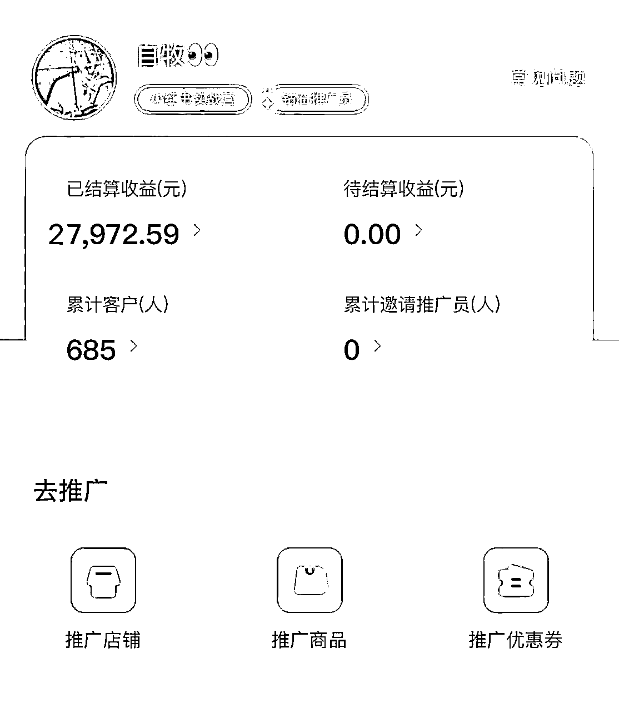

# 📝项目介绍

小红书虚拟资料引流项目，就是通过在小红书上发布虚拟的资料笔记，引流到私域进行变现。

至于私域推广的资料的话，可以找同行挖掘，或者是上闲鱼、拼多多、淘宝去购买就行，要买无版权的比较好。

下面就以实例拆解各个赛道的玩法。

## 📚大学赛道

*   赛道说明：

赛道提供大学各科复习资料，主要帮助大学生在期中、期末考试的准备中提高学习效率。

变现就主要出售大学各专业的电子版文档资料，格式有PDF、WORD。

*   流量时间：

一级：期末考试月（6~7月、11~12月）

二级：期中考试月（4月中下旬、10月底~11月中旬）

三级：大学生补考或缓考的时间节点

*   对标账号：

*   笔记制作：

1.电子版笔记

首图：资料拼图+显眼外框文字

内页：展示具体资料内页+边框，能用荧光笔标记资料内容更好

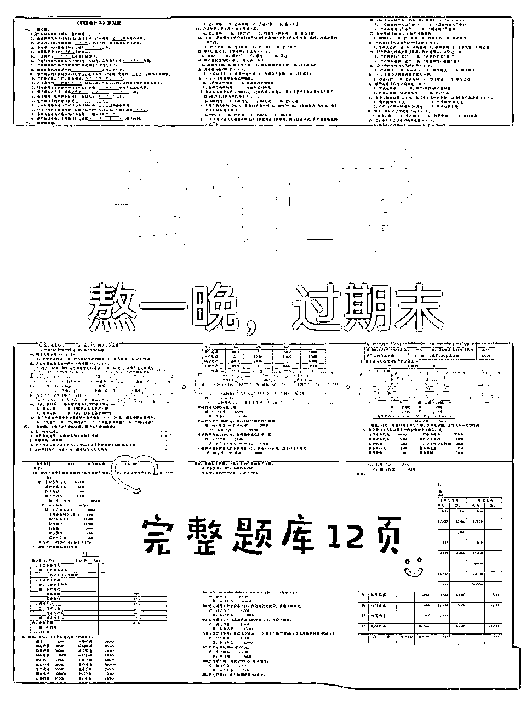

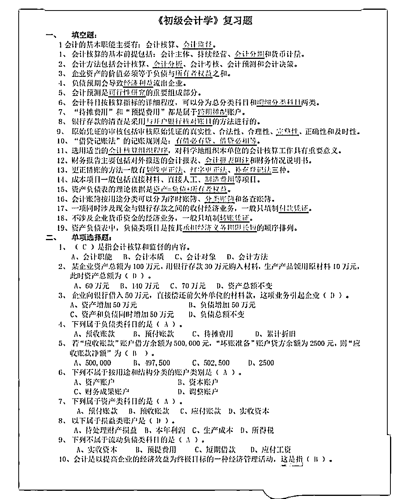

2.资料手写混合式

可以把笔记/题目打印出来，荧光笔划完之后，再用扫描全能王拍成如下图的形式，对比会更强烈

最后用美图秀秀把图片比例调整为3：4

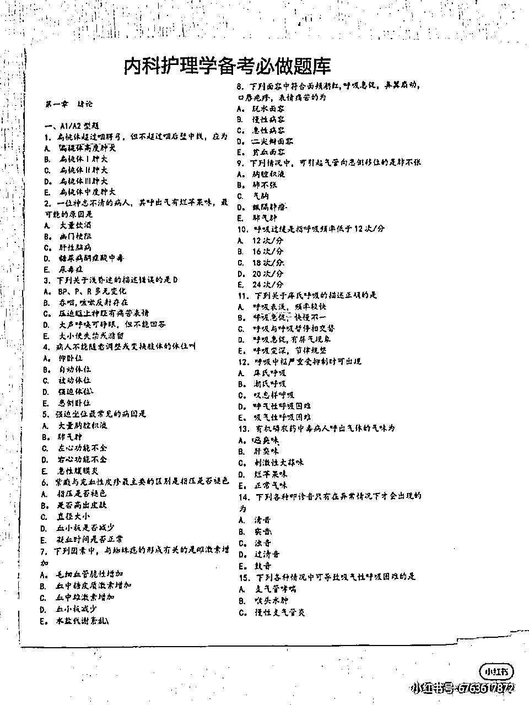

3.仿手写笔记

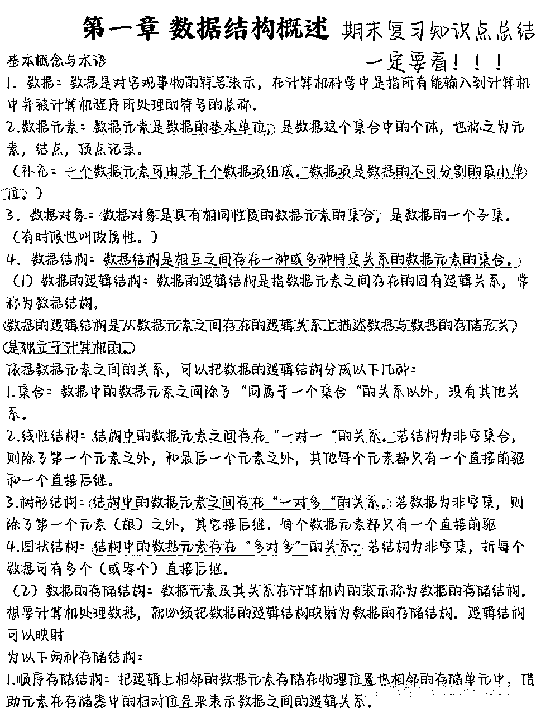

4.彩印笔记换背景拍照式

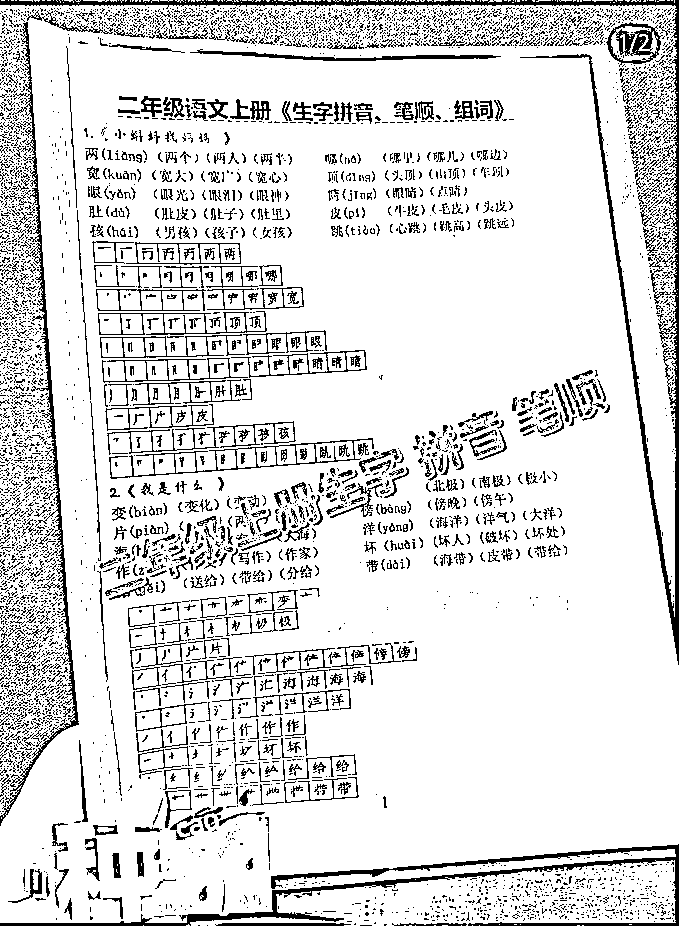

5.封面模版放不同资料+资料内页

资料文字提取出来，套模版制作就好

可能做不到下图这么漂亮，但可以把核心内容换成多色笔记，不突兀即可

制作版手写笔记+荧光笔标记处理制作内页，把图片套进类似下图的模版里即可

调整图片比例接近3:4，用美图秀秀可调节

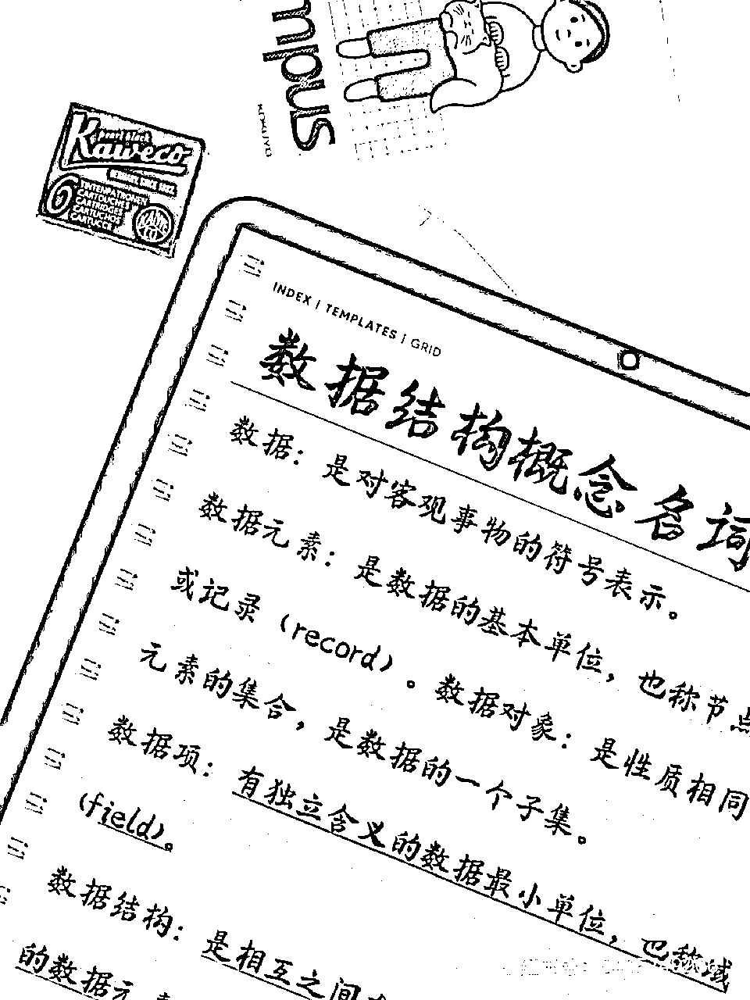

*   笔记标题：

标题要能瞄准客户的痛点，让他看见了你的标题能挑动他的心弦。

让他觉得，你的资料能躺着解决他的困难问题，满足他的期待。

比如："一小时看完这专业的资料，期末考试90+"

”一节课没听，但看了这个资料，期末轻松过“

*   笔记内容：

开头+中间+结尾

可以根据对标账号及其他教育类赛道账号的笔记正文内容去总结出一个自己的框架

这样我们生产内容就可以批量化高效生产，因为只需更改正文框架中的关键词即可

比如：”很多同学在后台留言，跟**(账号人设）说，（本专业的知识点）太难了“

其中括号里面的内容是可以替换掉的

## ✍️高中赛道

*   赛道说明：

帮助高中生提分。

变现就主要通过出售虚拟资料，分为手写版和资料库。

二次变现潜力大，高考完可以出售志愿填报卡，对接志愿机构，等他们上到大学还可以卖大学的虚拟资料进行变现

*   流量时间：

一级：寒暑假

二级：3月到高考前夕，特别是当艺考生的专业考试考完时，会有一波流量高峰，因为他们接下来要攻文化科

三级：平时的节假日、周末等，他们能玩手机上网的时候

*   对标账号：

*   笔记制作：

1.课本图片+夸张概括文字做封面

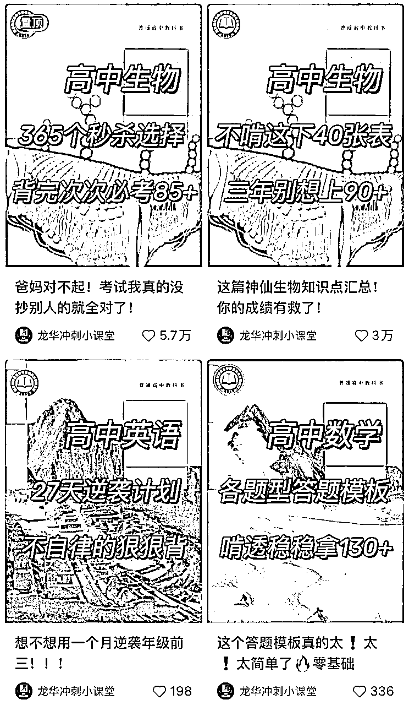

2.同色系拼图模式

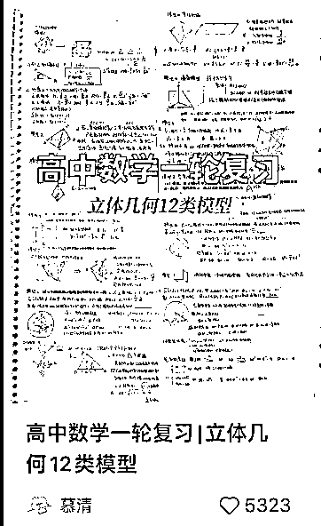

3.打印出来用学霸人设类内容生产方式/也可直接手抄

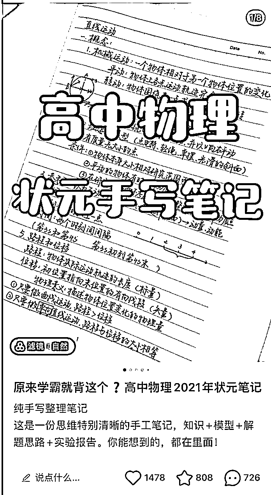

4.用【双边笔】或者【彩色笔】为笔记写个标题，注意色系搭配

放大拍摄笔记一个角落作为封面，单页笔记直拍作为内页，效果极佳

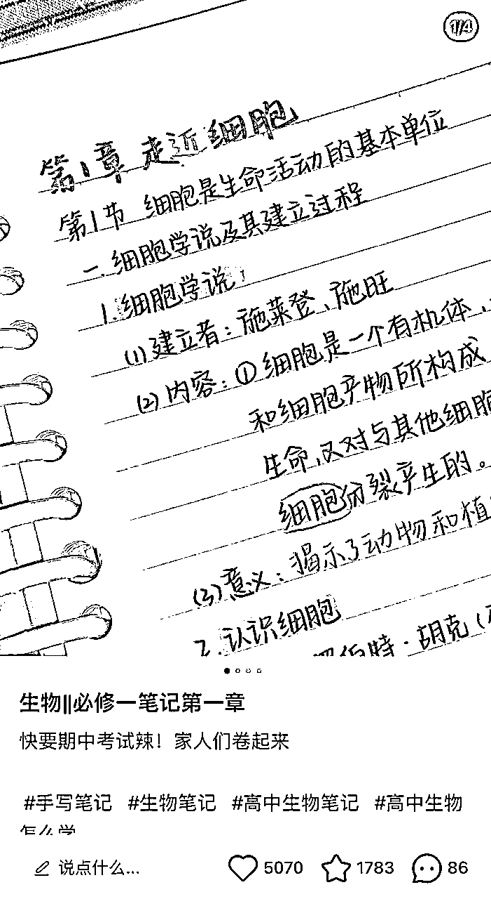

5.把标题写出来剪下来摆拍做封面+资料平拍内页

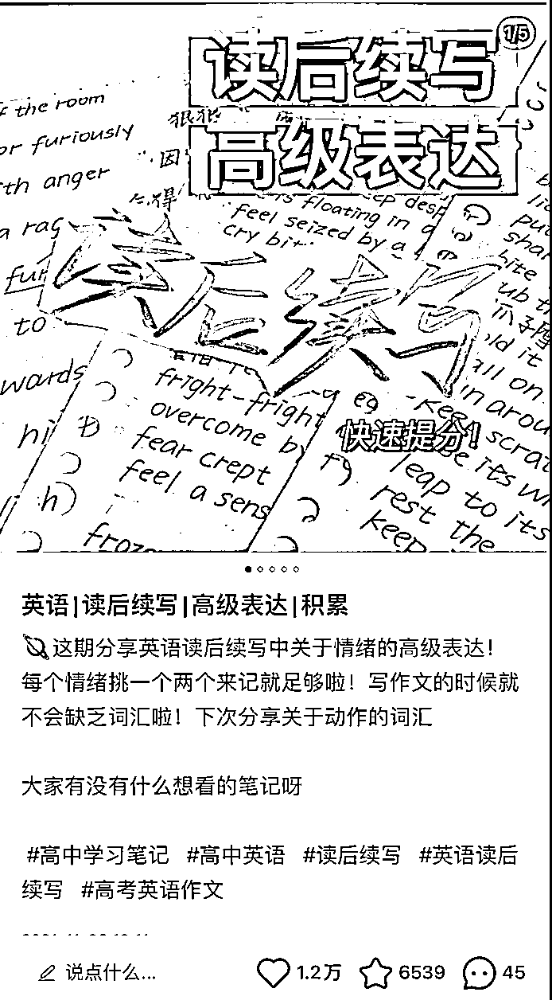

*   笔记标题：

高中物理小白、化学小白、生物小白怎么才能搞定xxxx？

高中生睡前可以看的xxxx模版材料来啦！

排队打饭的时候学这个高中物理xxx材料！

*   笔记内容：

内容分三块：自我介绍（提高期待，我能为你解决问题），图片内容阐述，钩子（想解决问题加微信）

三部分分别设计模版，每次调整意思，更换一些简单的零部件（比如表情），做去重处理（举例如下图）

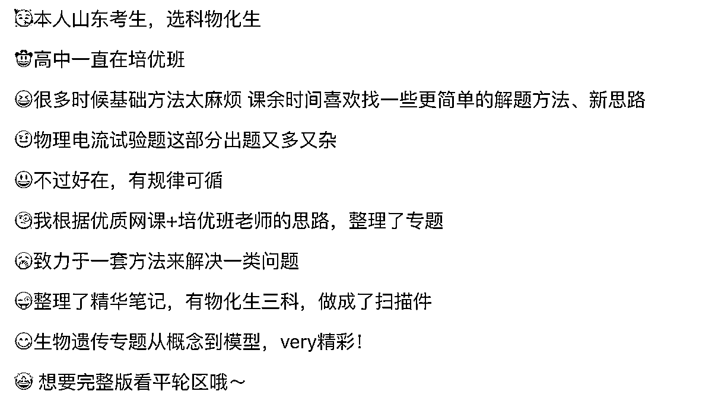

## 🚀考研赛道

*   赛道说明：

考研赛道我就拿考研调剂的项目来说吧，考研调剂就是通过引流目标群体到私域卖调剂报告进行变现的一个项目。

*   流量时间：

3月中旬~4月底

*   对标账号：

*   笔记制作：

简单粗暴，笔记只有一张图，封面即内页

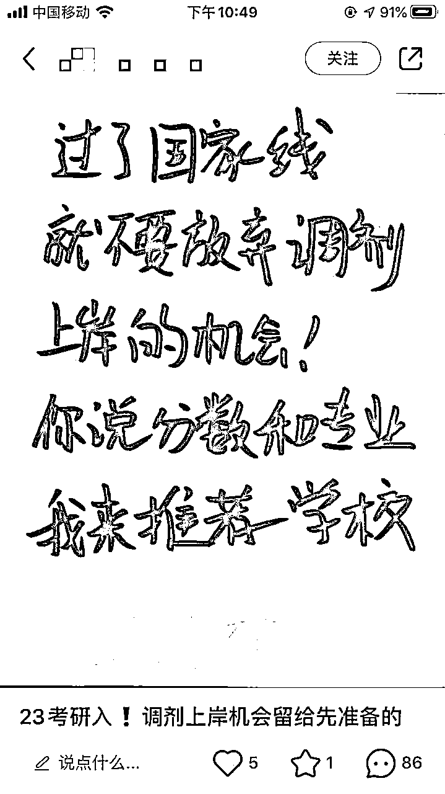

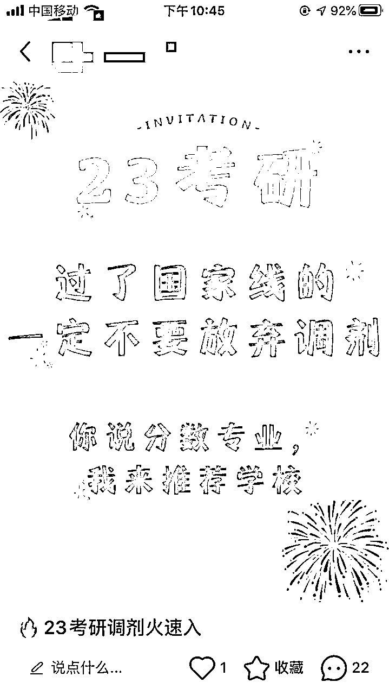

*   笔记标题：

1.直观明了法：

如”23考研调剂火速入“

2.真诚贩卖焦虑法：

如”快一步上岸，慢一步二战"

*   笔记内容：

笔记内容也不用过于复杂，打直球，直接一点，直接说，让他们带着专业和分数，引导他们在评论区留言。

## 🐾天涯神贴

*   赛道说明：

前段时间天涯论坛关闭了，很多人有怀旧的情怀在里面，再加上里面的神贴被人炒得很神奇。

直接截取神贴里面的部分内容，在各大平台发布，然后引流客户到私域卖天涯神贴210篇进行成交变现。

*   流量时间：

不固定

*   对标账号：

*   笔记制作：

神贴截图+BGM，生成视频

*   笔记标题：

“天涯消失的神贴”

"天涯必读的神贴"

*   笔记内容：

可根据神贴里面的标题进行编辑

*   天涯210篇神贴自取

## ✌️高考志愿填报

*   赛道说明：

应届高三生高考完后，需要志愿填报，趁这个点可以对自己原有的高中私域或从各大平台里引流卖志愿卡变现一波，志愿填报卡可以上闲鱼去买。

*   流量时间：

从高考成绩出来到志愿填报系统关闭

*   变现路径：

1.自己原来有高中私域的可以群发把他们拉到群里来，先把自己设置成志愿填报师的人设，对群里的高中生进行答疑，通过答疑慢慢提高你们之间的信任度，之后在朋友圈发布相关的推广，最后再成交变现。

2.自己原来没有高中私域的，就去各大平台截流或用志愿填报相关的资料去引流，引流到私域后再和1的做法一样。

# 🧧虚拟电商私域转化话术

*   刚加上V时

1.先主动给客户打招呼，可以发一些可爱的表情包，拉近顾客的距离

2.问顾客需要什么科目的资料

3.然后再告诉他资料整理不易需要微偿或者在微信签名上提前暗示资料要付费，让顾客有心理准备，和能够筛选一批白嫖党，从而减少浪费自己的精力与时间。

*   客户下完单时

要跟客户讲祝福语

如“祝你期末考试顺利”

“祝你高考准上岸”

*   遇到顾客跟你讲价怎么办

千万不要爽快的答应他，即使你想给他降价，原因就是你爽快答应他的话，一方面他会觉得他砍的这个价格砍高了，他还可以砍得更低，另一方面，他会觉得你的质量不高。

总之遇到砍价的你就要和他多磨一下，越难得到的他们越会珍惜。

*   遇到顾客说要考虑一下的要怎么办

你首先就肯定不要让客户急着下单了，不然会吓走客户的。

然后你就要想客户为什么要说想一下，原因就两方面，第一个就是想看一下你是不是骗子，刚加上wx信任度还不够，他还不够信任你，第二个就是他想货比三家，找到性价比高的资料。针对这两种情况想提升自己的成交率，那么我们后期朋友圈就要发力了，你可以多发一些顾客下单的图片和他们用了资料的反馈等，还有一个方法就是说资料会涨价，或者真诚的贩卖焦虑。

*   转化时的一些注意事项

卖付费的资料一定不要免费送，别指望送他一份资料之后他后面会回来复购，不但不会，还可能会给你带来不必要的麻烦，比如说你资料怎么不齐等，总之比付费的客户事还要多。

一定不能和客户发生语言冲突，遇到素质特别低下的客户，就直接不要管就好了，勉得和他吵了架，最后他把你的wx账号和引流的号都被举报了，这样就得不偿失了。

客户的消息和wx通过一定要及时的回，不然流量就浪费了。

# 🙌最后总结

初次写文章，写得比较水，感谢您能从头看到这！

这篇文章主要是记录了我从一个互联网小白，在半年时间，从0到1跑通了几个虚拟资料引流赛道。对于我这样一个刚入局互联网的小白，以前对互联网领域的东西是一无所知的，所以在互联网之旅的途中遇到的困难和挑战还是比较多的。尤其是看到那密密麻麻的SOP执行手册。像后裔采集器的使用、推广码的生成等等，一开始我都是一窍不通的，当我弄了好几天都还没有整明白时，我也很愧疚，很自责，也不断的怀疑自己。但最后我还是顶着那恐惧的心理，再认认真真的学习了几天，最后我一开始遇到的所有难题都迎刃而解，而那一刻感觉自己真的好厉害！所以屏幕前的你可能现在也在旁观还没有过实战的经验，或许你已经在实战了，但是还没有取得自己想要的结果，但你千万别灰心，遇到困难的时候一定要先自己尝试着去解决，实在不行的话就去请教别人，因为我就是这样一路走过来的，但请教别人的时候一定要请他喝奶茶，因为人家教你也是需要时间成本的。

还有对于我们刚入局互联网的小白来说，我觉得破圈还是蛮重要的，在圈子里我们能得知前线的信息差，就比如我之前做天涯神贴引流项目，我一开始是在生财看到大佬有发这样的贴子，里面有详细的SOP流程，我就立马就跟了上去搞这个项目。

还有我们小白做项目时还要有强大的执行力，遇到好的项目，先不用想太多，先不用怀疑，做了再说，我们小白目前人脉、资源还是欠缺的，那我们有的就是信息差和执行力。

最后再分享一句话，“没有慧根，但我会跟”，这句话我觉得适合所有的大学生，大学时代想要快速赚到钱，我觉得进对圈子，跟对人很重要。

# 🌹感恩的心

感谢从去年到现在，一路引领我向前走的@拱卒 学长，他是我搞互联网项目的引路人，他同时也是我的贵人，在这一路走来我每次遇到难题的时候，都会向他求助，而每次向他求助他都会耐心的解答，真的是超平易近人的，超接地气的，没有任何的架子！遇见他真的很幸运！同时他也是我的榜样，爱情、事业、学业三丰收，真的是既佩服又羡慕。

还有感谢@行一 学长，那天我们在线上聊了天，他看了我剪辑的视频后，他告诉我看到这个视频仿佛看到了曾经的自己，他自己也是这样一路过来的，也告诉我要保持下去这样的执行力，然后要专注一个项目死磕到底，不断提升自己干项目的能力，自强则万强，那我就先自己白手干到10w，体验一下这个过程。也告诉我和人交往要真诚利他，要尽可能的帮助别人，渡人即渡己。真的很感谢行一哥，和我讲了那么多无价的东西。

最后还要感谢在互联网这条路上遇到互帮互助的其他朋友们，没有你们的帮助也就没有今天的我！

对于我来说互联网搞项目赚钱这条路还很漫长，我目前赚到的小钱都是靠执行差和信息差，所以我也很渴望某一天拥有自己的团队，能带领他们乘风破浪，一起并肩前行！然后赚取我人生的第一个100w。但是不能急，因为跑通了从0到1，还需要跑通从1到10，还需要跑通从10到100。

所以以后的日子我们一起加油。

行而不辍 未来可期，本人喜欢交朋友😄，欢迎你的链接👏