# 如何打造高流量的网站

> 来源：[https://n08odc0f7x.feishu.cn/docx/MtBBdayjloU9oix1vXOc9Fgmnb5](https://n08odc0f7x.feishu.cn/docx/MtBBdayjloU9oix1vXOc9Fgmnb5)

现在流下三大门派

1、手动组合标题+复制头条派

2、复制同行内容打乱内容画蛇添足派

3、chatgpt派

在打造一个高权重的网站首先要准备3样东西

1、老域名

老域名的选择方法：1：近三年有持续建站的标题，2：一定不要有灰色历史，3：是否被国内墙了、4：查看是否是备案黑名单

挑选域名：阿里云 聚名网

查询历史：桔子seo

查询备案黑名单：域名备案中心

2、cms

帝国、zblog、织梦、WordPress

3、服务器

推荐：阿里云、腾讯云(要选择国内)

4、备案域名

5、准备词库

爱站、站长、5118

网站html优化，弄的越简单越好，能不用js就不要使用、栏目3-4个即可

下面主要讲解下内容核心

a：手动组合标题+复制头条派：

1、标题分为前半部分和后半部分。通常前半部和后半部分可以用，（）符号隔开。避免标题不通顺的问题。标题文字总长度约：25个汉字左右。如下图：

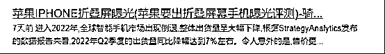

2、标题前半部分参考百度（www.baidu.com）下拉框数据编辑成一句通顺的话术。参考关键词：新款苹果电脑

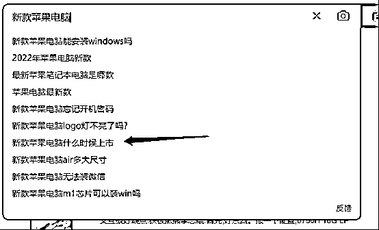

通过百度下拉框数据选取一条（排除关键词以外的词）。

前半部分标题：新款苹果电脑什么时候上市

3、后半部分标题参考百度相关搜索

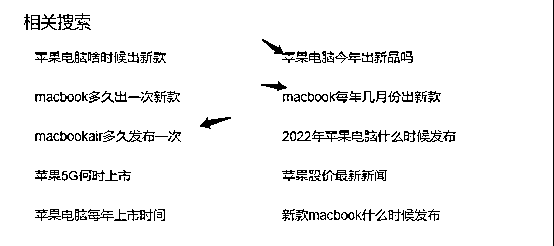

如上图所示，通过相关搜索中2-3个需求词组成一个标题

完整标题：

新款苹果电脑什么时候上市（最新macbookair今年几月份出新品 ）

关键词：面试的自我介绍

负面案例：

面试的自我介绍怎么说，面试最佳自我介绍范文

正面案例：

三分钟面试的自我介绍怎么说(通过率98%的面试的自我介绍模板)

高质量标题：关键词+需求词（需求词+修饰词）

中质量标题：关键词（需求词+修饰词）

低质量标题：关键词（修饰词）

关键词：指的是你从站长工具下载出来的词

需求词：指的是搜索引擎下拉框及相关搜索的词

修饰词：指的是能够把标题整理完整及符合内容的词

标题组合好后就可以去头条里选择资讯然后搜索对应的文章复制到你自己网站上了

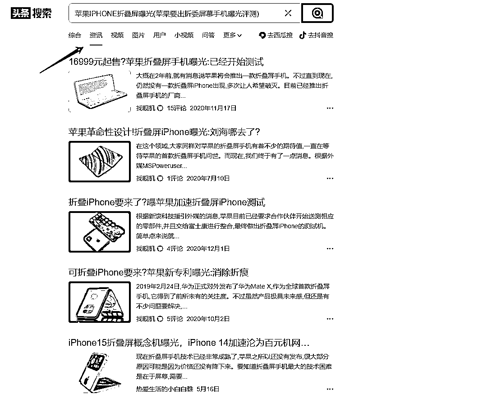

b:复制同行内容打乱内容画蛇添足派

首先我要获得行业关键词

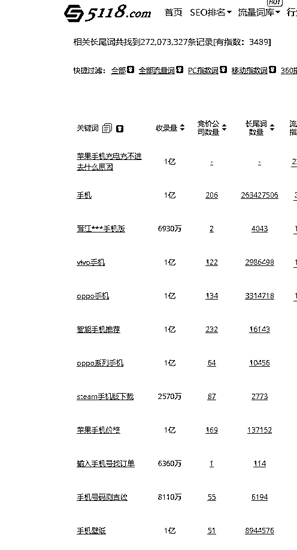

把这些词下载出来后在excel清洗一下，把文章标题符合大头的删掉

第二步把同行的文章采集下来

第三步把采集好的文章用工具打乱批量洗一次

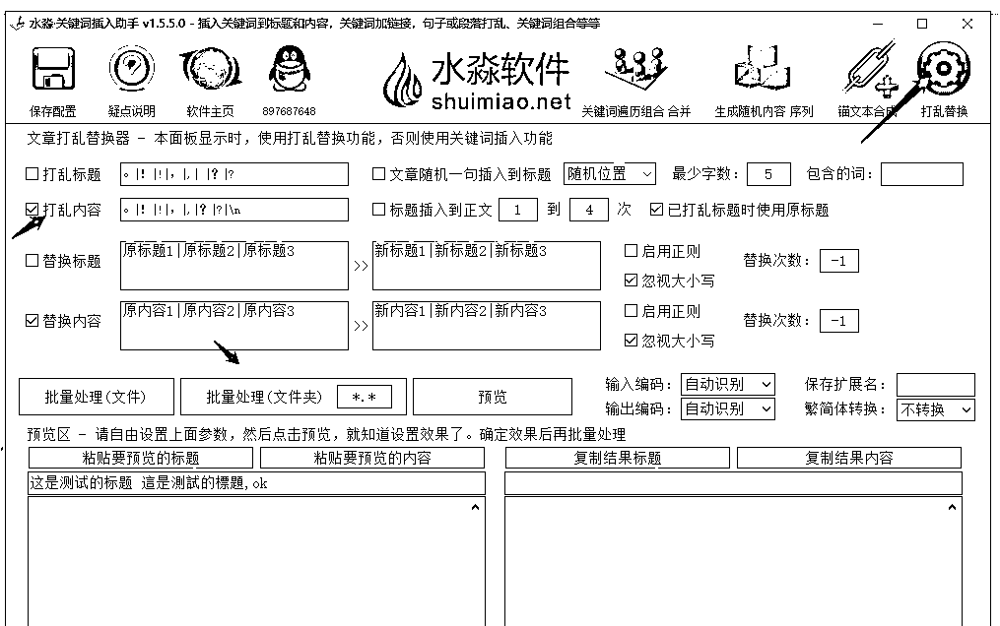

第四步把准备好的关键词筛选8个10个字12个字的词随机插入文章

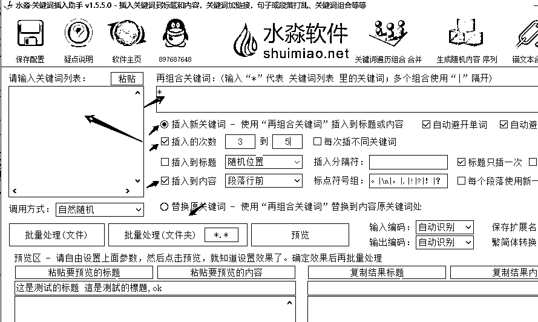

第五步把准备好的关键词替换标题，然后随机插入文章中提高关键词密度

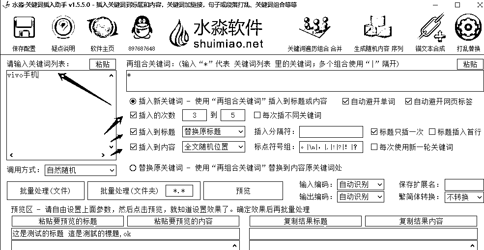

第六步把增加括号加入我们的第二个标题

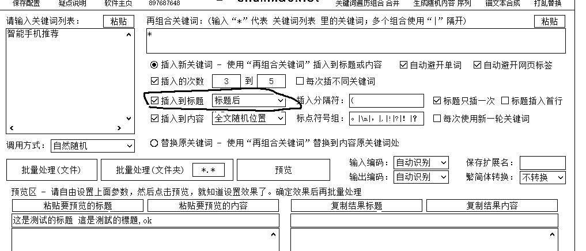

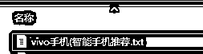

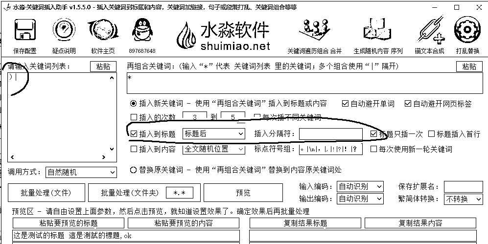

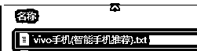

这种时候做垃圾流量站，缺点内容没有可读性

C:chatgpt派

同样我们要准备好关键词

1、把关键词给gpt让他给我们生成文章

2、用市面上的软件批量生成文章

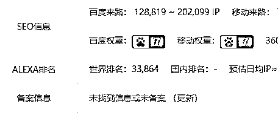

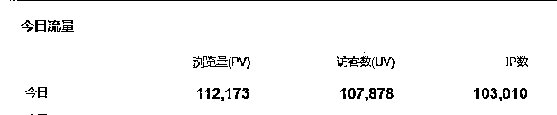

看完了点个赞呗