# 利用ChatGPT批量创作百家号，月入1000-2000的玩法揭秘

> 来源：[https://hdn8pwdl1l.feishu.cn/docx/N6UPdVUXBoB7bdxqPfIc6EmlnKe](https://hdn8pwdl1l.feishu.cn/docx/N6UPdVUXBoB7bdxqPfIc6EmlnKe)

使用AI创作公众号，最近流量特别好，差不多日入300-1500，跟大神差距很大，但几个月也收益很好

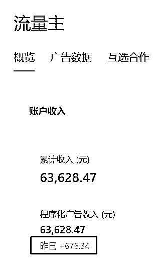

当然，相比较于公众号起号比较随机，我3个号目前起了一个号，使用AI批量生产百家号动态更适合新手，起步期一个月收入1000——2000，不是很难。

今天是七月九日，已经收入500＋了，上周单周收益就近600。

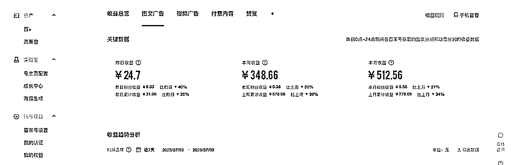

受ChatGPT创作公众号的启发，6月份我们开始尝试百家号，为了省事，我主要发百家号动态，虽然收益低，但基本上不会被判违规。

因为我有本职工作，所以花在创作的时间并不算太多，但用了AI之后，效率也有几倍的提升。

我主要在百家号尝试用GPT写社会类文章，近一个月的时间，在百家号上写出了三篇10万＋图文和十八篇10万＋的动态，百万＋动态2篇。由于图文的单价会更高，这里也建议大家可以试一试图文。

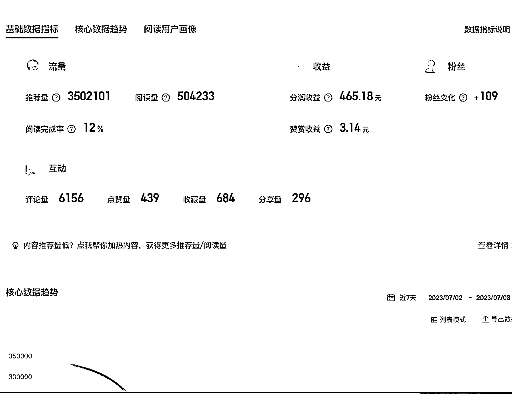

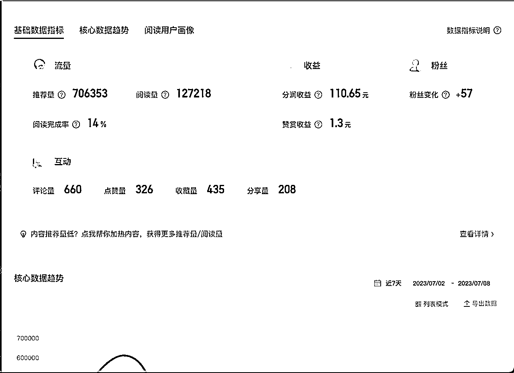

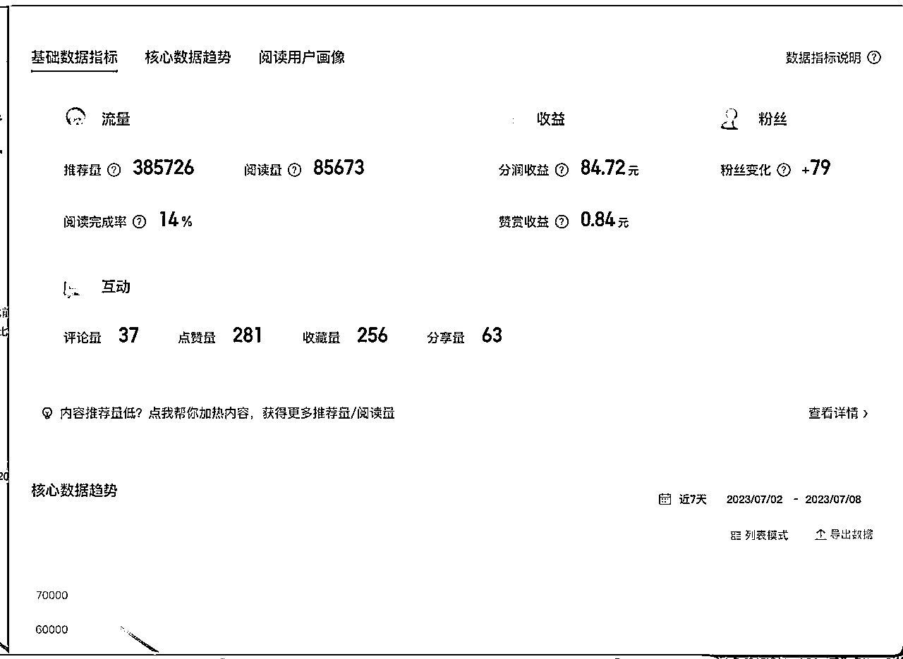

当然多平台发布后，其他平台也有爆款和收益，这里暂且不表。

我主要针对的是百家号的数据，其实，这些百家号的爆款，发布成微头条，也是小爆款，基本能达到70-80万左右的展现。

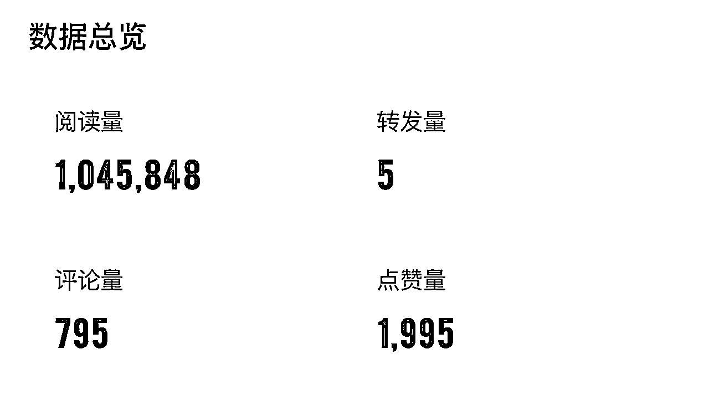

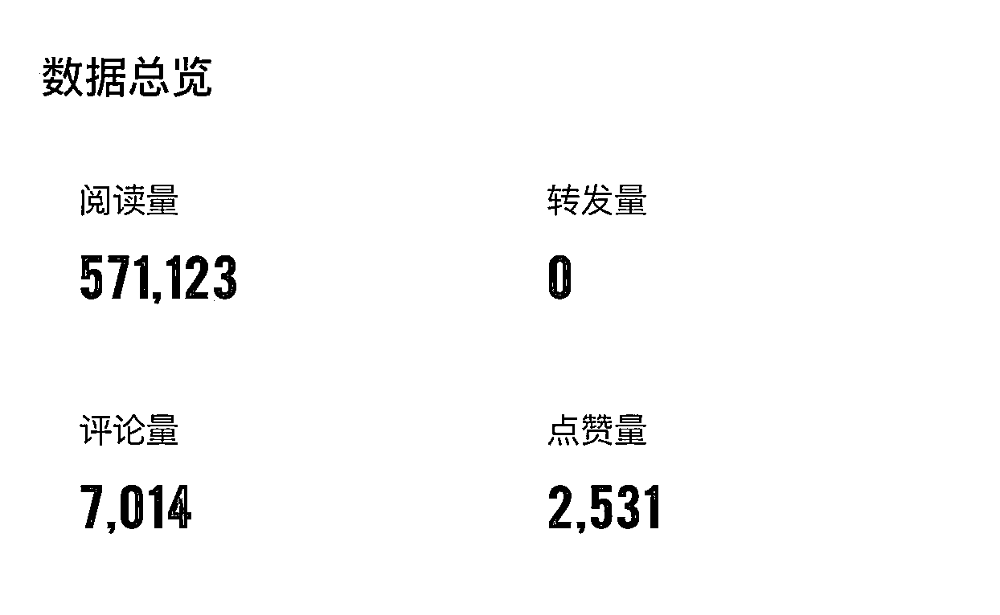

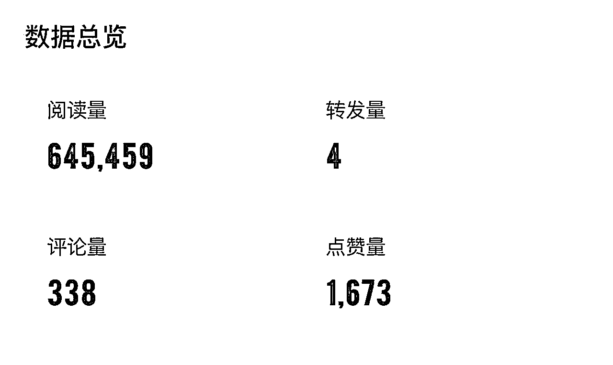

今天的分享并不复杂，我把整个过程都复盘一下。

# 一、AI工具准备

## 1.首推GPT

不得不说GPT仍然是最好用的AI工具，大家尽量用GPT。

## 2.其他软件

cloud、文心一言、星火等。

# 二、怎么找选题与素材

刚刚开始写作的时候，我总是发愁，每天写什么？

但其实，爆款蕴藏在爆款里，先确定你要写的类目，我主要写的是社会情感文

我就去关注社会和情感文的账号，大号小号都关注几个。

我关注的账号有：张晓磊、寻情记、不吃珍珠的小肥等

主要看阅读量和发文的时间，由于我在尝试阶段，我会把当天的爆文和过去的爆文都搜集下来。

我建立了一个选题素材库，用的是印象笔记，如图所示：

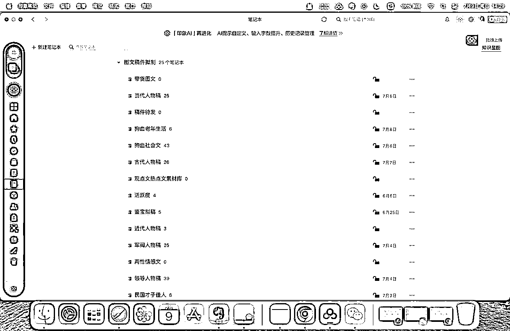

# 三、实操过程

多看几篇同素材的爆文

一篇爆文，肯定能搜到同类素材的其他文章，你把几篇文章搜出来后，认真读一遍，看看区别在哪里。如果是你自己创作，你的落脚点在哪里。

## 1.分析准备好的爆文

让GPT先把你准备好的爆文分析一遍

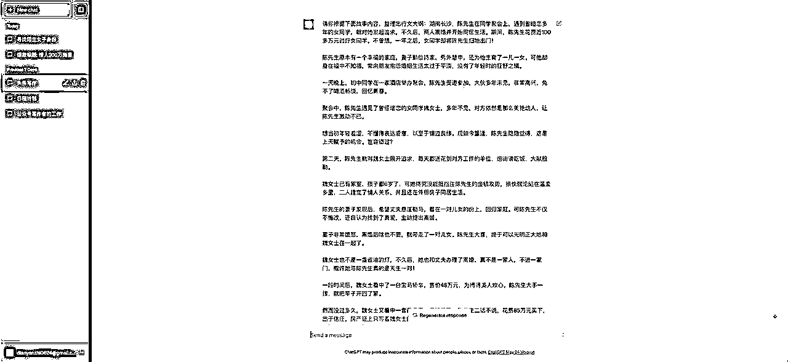

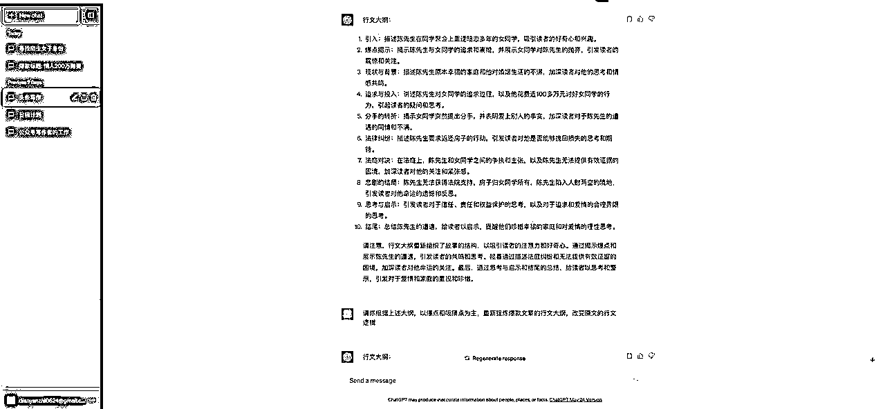

认真分析GPT列出的爆文行文大纲，找出你准备突破的点。

## 2.生成新的大纲

然后，再下指令，让GPT重新结合头条爆文思维，拟定新的行文大纲

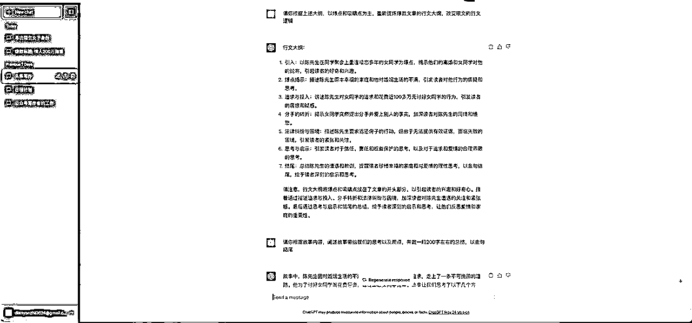

这样，我们就得到了一个全新的行文逻辑，

## 3.继续修改

你如果不满意，可以再次让GPT修改，如果你觉得可以，就按照这个去写文。

## 4.写出结尾

大纲出来后，我的短板很多时候在结尾的观点阐述。于是，我又给GPT下指令，让它写出文章的结尾。

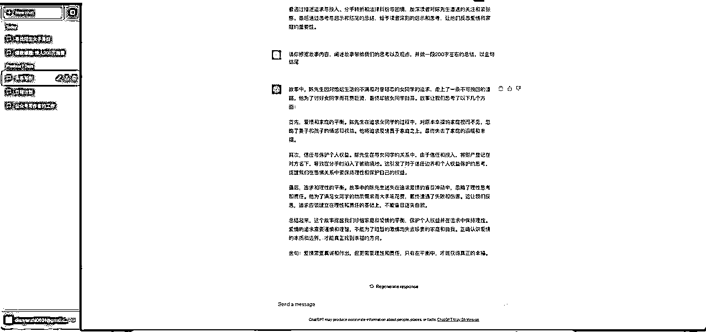

# 四、写在最后

对于百度动态，大家重点在量，不要一个动态反复修改精益求精。

这篇是我昨天发布的新动态给大家看看数据

就是这么简简单单的几个步骤，花费不到半个小时，可以写出一篇百家号三十多万的小爆款动态。

我按照这个方法，不但写出了爆款动态，也写出了爆款的图文，只要花点心思，让GPT给你拟定爆款标题，同样也可以产出爆款图文。

这篇是昨天新发的图文，数据还没有完全更新。

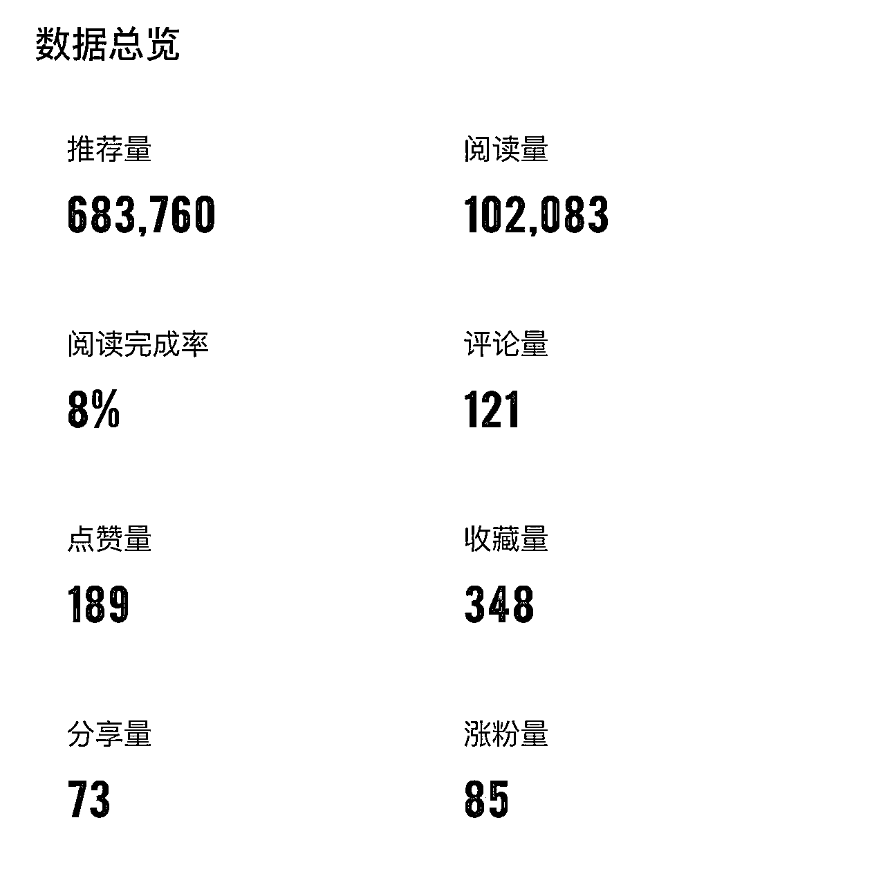

以上就是我利用GPT写出百家号爆款动态和图文的全过程，这中间也要感谢生财，欢迎大家交流：yibei1985

其实很简单，只要你尝试着操作，也能收获属于自己的成绩。

如果不嫌弃钱少，就要抓紧行动起来。

也欢迎大家分享更多的实战方法。