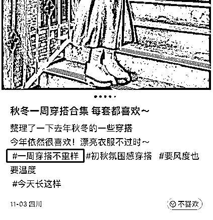
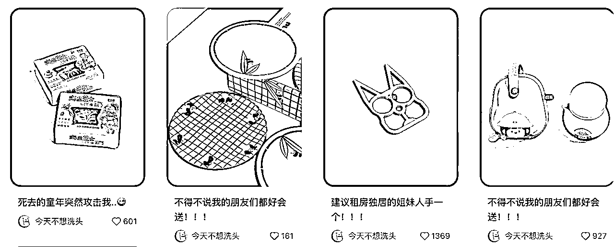
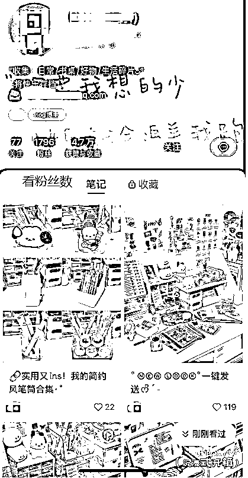
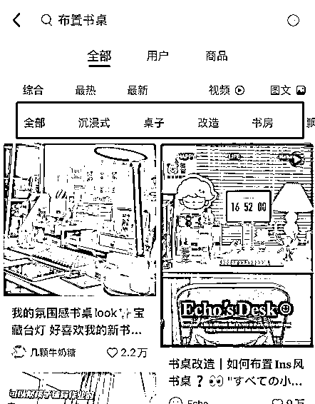
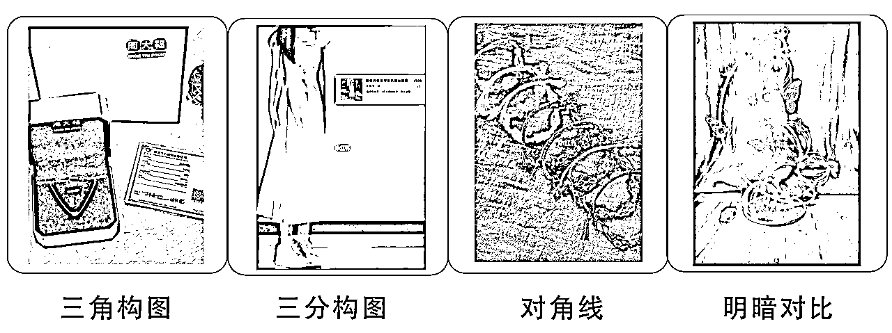
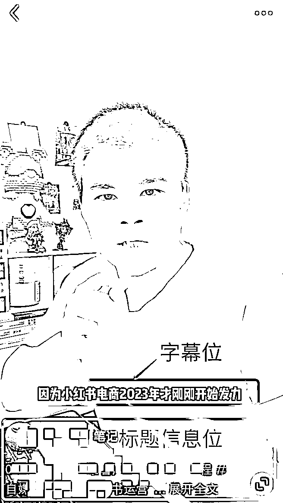
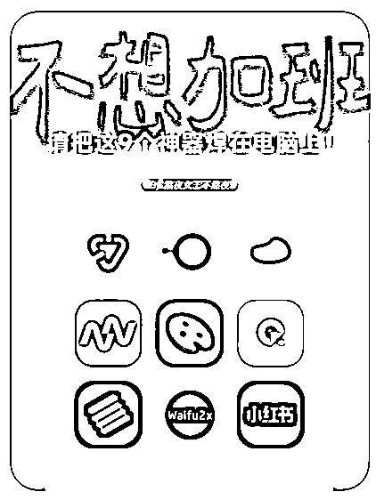

# 分享个做了3年的小项目：小红书好物分享博主

> 来源：[https://p03a4vs9s2.feishu.cn/docx/Njd5dfoGbo2DLTxInL1cRoXJnAh](https://p03a4vs9s2.feishu.cn/docx/Njd5dfoGbo2DLTxInL1cRoXJnAh)

哈喽，我是叁斤，我从2020年开始接触小红书，一开始做的就是好物分享的博主。做过贴图穿搭、书桌好物、零食分享等账号，也是在做好物分享的时候开始学习搭建账号矩阵

后来小红书接广变得越来越严格，现在基本上只能实名认证走蒲公英平台了。但我没那么多实名号，所以放弃了很多账号

好物分享号素人接单量还可以，现在一个千粉也差不多能报到100块钱，我做一个千粉号从发布第一篇笔记开始算，大约一周左右，小白从0开始做应该也就是一个月左右的时间

今天把做了3年的小项目分享出来，如果要通过这个项目赚大钱，有难度。但如果当做个附带小项目做，一个月几千一万的是没问题的

# 一、快速了解小红书

## 1、平台基础介绍

### 用户画像：

小红书用户年龄集中在18-34 岁，以女性为主，占比 70%左右。多数分布在一线和新一线城市的都市白领、职场精英，“年轻”、“女性化”、“有钱”是该平台用户的三大标签

### 社区属性：

小红书的定位是一个生活方式内容社区，同时，它还是一个内容种草平台。用户一边在小红书分享自己的生活方式，一边会参与到“种草”活动中

### 流量机制：

小红书主要流量来源有以下：

发现页：就是小红书推荐页面，是需要重点关注的流量大头，笔记的大部分流量都来自于这里，健康笔记的流量也应该大部分来自发现页

关注页：你发布的笔记会出现在你粉丝的关注页面，这里也会有一些流量

视频流：沉浸式刷视频所带来的流量，类似抖音上滑下拉，对于视频来说，也是流量大头，跟推荐流量类似

搜索页：用户搜索关键词后，会出现搜索流笔记，这部分流量的精准度是最高的，转化率也是最高的，商家会比较关注这个流量

个人主页：当你出现爆款笔记后，用户会习惯进入你的笔记看你其他笔记，这部分流量可以关注一下

小红书群聊：笔记被其他人转发去群聊，以及如果绑定群聊的话，会出现在群聊广场

其他：话题页之类的地方也会出现笔记，流量很少

## 2、博主合作分类

### 软广合作

有费：有费用合作软广，一般是私下联系，可以在简介中放入隐藏联系方式（不能明显的放邮箱），让pr看到并联系上你，即可接到私下合作的软广。报价比报备合作要低一些，文案也要写的很软，否则会被限流

无费：联系商家方式一样，但属于没费用的合作，拿产品跟你换，其他跟有费差不多

### 品牌合作

门槛：达到1000粉丝后，会受邀请开通蒲公英和合作中心，必须认证专业号，需要实名

合作方式：

商品合作：小红书目前已经有了分佣渠道“商品合作”，可以自行到合作中心的选品中心去选品，然后发笔记时可以挂上产品链接，有人购买会获得佣金。有部分产品是允许申请免费拿样的，申请通过后，商家会免费给你寄送样品，你发布笔记时带上产品链接即可

蒲公英合作：开通蒲公英后，可以设置合作报价。一般价格为粉丝数的10%，根据账号定位、近期数据等上下浮动。合作的费用，平台会抽10%，部分pr会要求返点，比例在20%上下，也就是说，至少30%的合作费用是需要给到别人的，剩下70%才是自己的

# 二、账号搭建

## 1、人设定位

### 赛道定位：

赛道选择可以参考这几个原则

1、选自己感兴趣/擅长的赛道

人只有在做自己喜欢或者擅长的事情，才会真的花心思认真做。

在选择赛道的时候，不要看别人哪个做的好，更重要的是自己是否擅长，是否足够喜欢？

比如较火的几个类目：穿搭、护肤、美妆彩妆、健身、户外、宠物、美食、家居、母婴育儿等

喜欢好看的衣服，也喜欢自己搭配衣服，就选穿搭

经常健身，就做健身。喜欢折腾家居布置，就做家居，只有一个好看的书桌，就可以做书桌好物的开箱

很多方向可以选择，但一定选择自己喜欢或者擅长的

2、离钱近（容易变现）

当然，只有自己擅长还不够，还要离钱近。谁也不能一直为爱发电，做小红书最终就是为了赚钱的。所以选择一个离钱近的赛道也很重要

如何判断离钱近不近？

参考千瓜、灰豚数据、蒲公英的博主报价以及商家合作数量就可以判断

一般情况下，蒲公英平台的内容类目里，大分类和小分类有的赛道，变形情况都还可以。靠前的：美妆、护肤、身体护理等，这些赛道变现都不错

3、赛道有前景

除了自己擅长，离钱近之外，赛道的成长情况也很重要。有些赛道可能近一两年能火，后面不确定性很大，也许会被管制或者没人关注，都有可能。比如选择做数字藏品、区块链等，离钱很近，但是前景很迷糊，很容易被掐掉

四级分类法：

分享一个四级分类法。但是一般情况下个人博主只要有2~3级的分类就足够了

第一级：广泛类目，即千瓜、灰豚、蒲公英等渠道的内容类目

第二级：小细分类目，千瓜、新红、蒲公英等渠道的二级类目/细分类目

第三、四级：

需求、人群、风格、年龄等

例如：

普通博主：时尚（1级）→穿搭（2级）→微胖大码穿搭（3级）

细分商家：时尚（1级）→穿搭（2级）→连衣裙（3级）→微胖大码连衣裙（4级）

### 人设标签：

博主视角打造人设相对简单，如果赛道选择的比较细致，其实人设就在赛道中产生了。

如果赛道有些模糊，也有个方法可以参考：

先直接找个同赛道，变现好，你也能模仿并且喜欢的博主模仿，模仿相同人设。先模仿一段时间，然后找到自己的差异化特点，把自己的特点、记忆点加进去。

个人博主的人设特点：个性鲜明、识别度高、有记忆点、接地气、不营销。

个人博主在建立人设的时候一定要真实，最好是从自己擅长的地方着手。一开始不要做的太复杂，简单模仿对标账号就好，再不断地进行完善

除了上面这些带有一点专业性的人设标签，其实你自己个人生活也是一个标签

性格爱好、优缺点、年龄、地域、身材、语言等都可以作为人设的标签之一，也可以综合一起做一个人设

### 个人定位公式：

如果实在不知道怎么定位，可以参考下面公式：

你是一个帮助XXX解决XX问题的XX人

例如：

我是一个帮助新人博主解决流量变现问题的自媒体人（6年自媒体操盘经验）

我是一个帮助小个子女生解决穿搭不好看问题的时尚达人（小个子女生，会穿搭）

我是一个帮助高中生解决高考成绩不好问题的学习导师（高考状元）

注意：赛道、人设和定位都可组合，不止单一某个领域，与之相关领域都可以组合。比如美妆和穿搭、家居和美食，可以组合做定位。

### 总结一下：

赛道（账号方向）：自己喜欢、离钱近、有前景

个人标签（账号“主人翁”）：真实、有特点的自己

定位（账号价值）：你能给别人带去什么“价值”

## 2、基础信息包装

好物分享类型的账号，不需要特别的头像和昵称的设计，只要把握基础的就行了

头像：

可以使用真人头像（可以真人画像代替），头像形象要与账号本身调性符合就可以了

昵称：

昵称都要简短好记好写，方便用户查找和搜索就可以，尽量少用纯表情、符号和生僻字

最好有一个方便用户叫你的“称谓”，比如，我希望别人叫我叁斤，所以我所有账号都会带有“叁斤”

简介：

一般都是告诉用户，你是谁，你来干嘛，可以提供什么价值

前期简介空着也没关系，后期尽量把内容补上。分享一个“四段式简介公式”

第一段：表明账号接下来要更新的内容，给关注的理由。

第二段：引流用，引导小号、群聊，或者邮箱（不能直接挂，需要用英文邮箱，且不能用@ 的符号，如：yeco54📮🐧c0m，最好能用英文手写体代替）

个人博主的基础信息包装不需要过于刻意，找到适合自己的封面类型后，保持统一风格就好了，昵称简单好记，就没什么问题

## 3、对标账号筛选

### 如何找对标？

1、直接搜关键词

关键词不要搜太小众的长尾词，最好选择跟领域直接相关的关键词

比如做细分穿搭，可以直接搜：初恋感穿搭，或者直接：小个子穿搭

2、搜话题池

大部分笔记都会添加话题，在找到第一个合适笔记的时候，找到相关话题点进去，里面还有很多使用同话题的笔记

3、第三方工具

通过千瓜、新红等工具找到相关领域笔记，筛选出近期涨粉高并且与领域相关的账号和笔记

4、发现页自然推荐

平时多刷相关内容，利用小红书算法，让平台给你推更多相关的优质笔记

### 如何判断对标是否适合？

在利用以上方法找到笔记和账号后，如何判断笔记和账号是否适合自己？

1、赛道相同或者相似

只有跟自己相似赛道的才有参考价值

2、粉丝量级

一般情况下，热门赛道也只会选择10万粉丝内的账号参考，不适合去直接对标头部博主，腰部博主和近期涨粉快的博主更值得参考

3、笔记爆点

寻找笔记转折的爆点，看笔记突然爆火的原因，自己能不能复制账号的爆点？如果自己没条件复制的，也不适合参考

4、变现模式

对标账号的变现模式与自己预想的是不是相符合？变现效率够不够高？变现空间大不大？自己能不能做到？如果是变现弱的账号，也没必要参考

如何知道变现情况？

可以假装商家直接联系问报价。开通报备的，可以去蒲公英或者千瓜看他报价以及合作商家数量

# 三、内容制作

## 1、内容形态

视频：

好物分享的视频有很多种，开箱、测评、纯展示分享、场景分享（书桌）等

视频的流量跟图文没有很大区别，但小红书有意扶持视频号，流量方面会有一点点优势。但内容制作上会比图文要难很多，可以根据自己实际情况去选择

图文：

好物分享的图文也有很多类型，纯摆拍、结合场景摆拍等都可以

纯摆拍的数据也很不错

图文相对于视频来说，流量上可能没有很大优势，但这个区别是很细微的。图文的优势在于制作成本低，像上面这张图片，背景很干净，也很统一，拍摄起来难度不大

## 2、常见笔记类型

合集：

多个产品在同一篇笔记上出现，可以是同款产品，也可以是不同产品。比如，多个款式的耳机一起分享，或者手机壳、耳机、手机支架等同属性的产品一起推荐分享

合集类型的内容比较容易出爆款

测评：

一款产品或多款产品的测评，测试产品性能、颜值、实用性等各方面，常见于3c数码类产品和护肤、彩妆类

测评类不适合所有产品，可以根据自己选的分类去考虑

知识科普：

通过分享干货知识来获得流量，在干货知识中植入产品。比如，穿搭服装布料知识、护肤知识等

知识科普类内容的制作难度相对较高，但也比较容易出爆款，内容的长尾流量比较大

产品种草：

直接推荐产品，种草产品。比如开箱、书桌好物分享、穿搭分享、翻包记等

产品种草的内容制作成本相对较低，也比较考验选品，如果产品不好，拍出来效果就不会很好，数据会比较差

教程攻略：

如穿搭教程、彩妆教程、手帐教程等等，通过发布一些产品相关的教程，吸引用户观看

这类型内容选题有限，也比较容易出数据，跟干货比较相似

## 3、选题挖掘

对标选题

找到对标博主的账号，进入挨个进入主页，看近期发布的10篇笔记是否有一篇笔记的互动明显大于其他笔记？如果有，而且互动量较大，也可以加入到选题库中

如上图笔记中，选择的笔记互动量有900+，但平时的互动也就1~300左右，那这个选题就是很不错的参考

除此之外，还要看笔记的发布时间，最好是在一周内的爆款，参考价值才比较大

关键词选题

搜索一个关键词时，会产生一系列下拉词，可以在下拉词中找到你比较适合自己的关键词做选题

除了下拉词，搜索结果中还会有一栏小词，也可以作为选题

在展示的搜索结果中，按照1中说的方式去选择合适的对标笔记

评论区选题

在爆款笔记的评论区，也可以找到合适的选题。只要去找到那些粉丝反馈的信息，并且获得很多其他粉丝认可的，都能作为选题之一

评论区点赞数靠前的评论（非手动置顶），都可以去看一下，如果粉丝认同的点赞数高，也可以收录到选题库中

注意事项！

好物分享类型，不能选题只是辅助作用！最重要的还是产品本身，产品既内容，产品如果符合审美，那普通摆拍也能火，如果产品本身不符合小红书审美，发什么选题都火不了，或者带不动销量

所以在接商单的时候，要对产品有一定要求，不要什么品都接，如果实在质量差、颜值低、不符合小红书审美的，不要也罢

另外，选题也要符合“产品种草”的风格，要跟产品有关，否则可能会接不到什么商单

## 4、内容制作

制作工具：

手机：建议iphone11以上，打开9宫格

桌布：不要太花哨，纯色版也可以

补光灯：如果光线够亮，不需要补光灯。自然光拍出来效果最好

小道具：拼多多可以直接搜索摄影道具，有很多，根据自己产品特性来买。假书、香薰、杂志、小摆件、假花这些拍出来风格还不错

图文制作：

图片拍摄：好物分享类型的图片一般都在室内拍摄，大部分产品有一个书桌，或者靠阳台摆一个桌子，又或者去飘窗拍摄，都可以，自然光线够亮就可以

分享几种常见构图：

根据自己产品去选择就好了。修图参数可以直接在小红书搜索：修图参数，如果是安卓手机，可以搜索：醒图修图

会有很多博主分享一些修图参数出来，也会有一些博主会分享拍摄构图，初学者可以看一下

但是博主分享的参数不能盲目模仿，因为我们拍摄的环境不可能一模一样，所以参数也会上下浮动，我们要了解这个参数的核心思路就可以了

视频制作：

视频拍摄：

视频拍摄一般也是在书桌前，场景和图片差不多。摄像机可以在书桌对面（第三人称）和自己面前（第一人称）

剪辑的时候，把一些累赘动作剪掉，画面要简单。另外背景音乐不要太大声，否则会盖过视频原声

前面1～3秒很重要，整个视频不一定是按时间、故事的顺序播放，可以考虑把视频最精彩最吸引人的部分提取1～3秒剪辑到开头

字幕选择上，没什么特别讲究，但是有几个需要注意的点：

1.  字体选择不要过于潦草，要清晰工整

1.  字体颜色跟画面颜色要协调，不要出现字体过于突出，也不要出现字体过于模糊不清的情况，最好是白色字体加黑色描边

1.  字体位置不要放到过于低的位置，视频播放时，底下的位置是展示文案标题的，会遮挡字幕。也不要让字幕挡住画面中的重要信息，放的位置大概在视频的下方1/3处就可以

工具：

图片：iPhone原相机、醒图、黄油相机、美图秀秀，另外还需要一个画质增强工具：wink，挺重要的，因为我们拍摄难免会放大画面，这样会导致画面不清晰，用wink可以增强画质，让像素变得更高清

视频：iPhone原相机、醒图、黄油相机、美图秀秀、剪印/pr

## 5、封面制作

### 关于封面

封面可以采用爆款封面类型+爆款标题结合，在封面中添加爆款标题文案，这时候，封面中的爆款标题文案，比封面设计本身更重要

### 统一封面

前面有提到过封面要统一整齐，那么我们要如何做到统一封面？让封面保持整齐？

1、保持统一尺寸和排版

在制作笔记内容的时候，图文建议采用3：4和1：1，并且尽量在使用的时候统一尺寸。同笔记所有图片尺寸统一，其他笔记的图片尺寸也尽量统一。这样整个主页看起来就是整齐的

2、封面字体、颜色和大小的调整

封面主色调和字体、字体大小等都可以调整，但是主要的封面类型尽量不改变

如果需要更换封面类型，在更换后多发几篇，这样看起来也不会乱

### 爆款封面类型

对比+文字

所有类型的IP都适合使用，一般突出前后对比，修图前修图后都可以，这类型是比较吸引人的。但是官方对这类封面有一个要求，就是一定要真实，不能过于浮夸。特别是对于护肤类，护肤前后对比不能过于浮夸

贴图拼图+花字

这一类常见于合集内容，也是不限IP类型，爆火的概率还是挺大的，制作难度不大

真人+文字

真人加文字一般用于口播视频，测评类比较常见

封面类型只是参考，并不能穷尽所有类目。可以根据自己的分类，找到对标，自己前期多试几个封面，找到最适合自己的，也最容易火的封面就行

## 6、爆款标题

分享2个很适合小白的爆款标题技巧：

### 产品关键词法：

找关键词

找到跟选题、产品相关的关键词。关键词要和笔记内容主题保持一致，最好能与热点挂钩，也可以精准一些的针对受众人群。

比如：新手妈妈、减脂期集美、海边拍照等

填充标题

确认好选题和关键词，就可以给标题进行填充了

运用数字填充：

例如：1000元爆改出租屋、5步教你优化简历

运用句式填充：

当笔记围绕某个问题展开时，可以使用一些疑问句等做标题

例如：海边如何拍出氛围感？12平小卧室如何布置？

多用emoji：

emoji有较强的画面感，并且可以刺激用户情绪，让标题显得更加生动

### 爆款模仿法：

1.  直接从小红书或者灰豚等渠道搜索产品、选题关键词，找到比较火的笔记，把他们的标题复制导出

1.  把这些笔记里面的关键词都单独标记导出 如：仙女一滴泪、海边比基尼、美炸了 等

1.  利用不同的关键词，重新组合成一个标题 如：海边比基尼泳衣真的美炸了！！

爆款模仿的方式是最适合小白学习的，用多个爆款热词元素，组合成跟自己产品相关的关键词

## 7、文案内容框架

文案内容的写法，不同产品、不同选题会有非常多种类型，没有办法穷尽，所以只分享一种：关键词写法

关键词写法是最容易布局到关键词，获取搜索流量的方式

开头：

写一下怎么跟这个产品结缘的，为什么购买这个产品？或者怎么获得这个商品的？为什么会获得？

如：xx口红

我是怎么获得口红的？闺蜜送的，男朋友送的，自己买的

为什么会获得/为什么会购买？之前的色号不好看，发现一个宝藏色号，情人节/生日礼物

中间：

写，这个产品给你解决了什么问题？给你带来了什么改变？有这个产品之前你受到什么困扰？

如上个案例：

这个产品给带来的改变。让我变得更好看了。没有这个产品前，男朋友送礼总是送不到点子上

结尾：

最后的地方不用过于刻意，可以直接添加跟产品、选题 、关键词相关的 #话题 标签

评论区：

如果笔记数据起来的话，评论区不要空着，要引导别人去提问跟产品相关的问题。比如小号带节奏：怎么买？xx皮肤适不适合？等等，有了第一个人评论之后，后面的人才会跟这个节奏

# 四、笔记数据分析

## 复盘分析表

笔记发布后，一般隔几天才会有比较详细的数据，而且小红书数据比较长尾，所以我们在做分析的时候，最好能以周为时间维度，笔记发布1周后再统计相关信息，每周统计一次总数据

小红书笔记数据分析表

按表格中的信息填好内容就行，最终可以通过公式计算，得出准确的搜索阅读量、推荐阅读量和互动率、涨粉率的数据

每隔一段时间（建议每周），去分析，为什么数据会出现变化？为什么转粉不高？为什么流量都来自个人主页？为什么首页推荐这么少，等等的问题，都可以去通过表格获得反馈

然后自己再结合笔记去分析原因，好的保持，不好的地方调整修改

# 五、接单注意事项

## 1、如何成为品牌抢手的博主

### 品牌看中的核心因素

蒲公英等级：

目前蒲公英等级分为优秀、普通、异常，一般情况下博主都会是优秀，如果数据变得特别差，或者近期私下接广多，会可能会降低为普通，如果违规、限流等，会被判为异常

一般情况下，商家都会选择“优秀”的博主，普通和异常的接单概率会低很多，如果自己的等级降低了，就好好的分享干货，等恢复正常再接单

与品牌调性的匹配度

博主的IP形象与人设与品牌是否匹配？如果要接高客单、设计感强的品牌，你平时发布的内容也得是这个风格的。如果你发一些低价好物，吸引来的人收入水平都偏低，自然不好接高客单的品牌（注意，这里的客单是产品客单价，不是合作费）

基础数据情况

品牌方还会看博主近期的数据，是不是有爆文？爆文是否稳定？如果突然发广告，会不会断崖式下跌的流量？评论是否有来有回、商业作品会不会太多？

内容质量

笔记带货能力强不强？评论区聊的内容跟产品有关，有人问产品细节和价格链接的，更有带货能力

博主如果有在评论区做转化的（回复指路），也可以选择

在日常运营中，品牌尤其看重近期笔记数据，所以我们可以刻意的往这方面去做优化。主页中数据不是很突出，或者很平庸的笔记可以先隐藏，让主页保持较稳定的好数据

### 商家筛选博主的常规渠道

信息流：

最常规的渠道，就是商家自然刷到你的笔记，以及商家搜索与品牌相关的关键词和竞品词找到笔记，然后找到你合作

蒲公英平台：

需要实名认证，达到标准才能开通蒲公英合作，1000粉就可以开了

第三方工具：

千瓜、新红等，平台会抓取账号信息，给账号标签

中介代理（pr)：

大品牌一般会找机构打包服务，机构分发博主

博主推荐：

有些品牌会让合作的不错的博主再推荐其他博主

一般情况下，优质的合作都是通过数据吸引商家主动找过来的。所以，与其多渠道去主动找商家，不如好好打磨内容，做好自然流量，这样主动找你的商家都合作不完，根本不需要主动去找商家

不是特别推荐想一些通告群和通告平台的商单，一般这些渠道的商单对博主的要求反而是严格的，而且钱没有多少，博主很被动，广告也比较低质差，不值

## 2、如何设置报价

当商家找过来后，如何给对方报一个合适价格？

这一个其实没有标准，一些比较优质且垂直的账号一般可以做到粉丝量的10~15%（报备标准），非报备的会低一些，大约也能到7~8%

但这个不是固定标准，会根据内容调性、差异化特色、人设和近30天的互动量上下调整，不同类目的报的也不一样

有2个方法可以试探一个稳定报价区间

1、找到对标博主或者同类目，相似定位，相同粉丝量级的博主，假装自己是商家，询问对方报价

2、先报一个自己心理价位，然后看商家接受程度。一般2~5000粉丝建议先报200元试探，如果加你的商家很多，报200全都能接受，那就加价。如果200没人能接受，大部分砍到100多，自己能接受的话，就降价合作

走蒲公英平台还要考虑几个因素：平台抽成和pr返点，一般平台抽成是10%，pr返点大概在20%，所以在设置蒲公英报价时，要把这几个因素考虑进去

### 注意⚠️

在笔记中植入产品，也是可以分为“合集”和“单品推荐”来报价的

合集分2种：

1.  单类产品合集：比如分享T恤，就是全篇分享T恤

1.  多类产品合集：比如你做穿搭号，T恤、裤子、鞋子、项链等整套穿搭组合成合集

这两种合集的报价是不一样的，后者报价会比前者高一点

单品推荐的报价又比合集要高，而且单品推荐是最容易被判定广告营销的，所以一般单品合作都得走平台

## 3、如何高效对接合作

### 合作前准备

当商家加过来时，我们至少要准备好报价信息。包含图文、视频报价，单推、合集报价，以及作品是否授权使用，另外，报备价格和返点也要准备好

另外，可以准备近期数据截图以及与商家产品相关的笔记数据（数据好的部分），这些都可以在谈判的时候给自己加分

### 聊天内容

跟商家聊上，准备确认的时候，需要跟商家确定主推产品类型以及产品的brief、确认合作类型、产品寄拍还是赠送、以及结算时间、如何结算等

如果是视频拍摄，还要沟通在写脚本的时候文案最多修改几次

最后，顺带问一下商家，会不会给笔记投流，或者有没有爆文奖励，有不少商家其实都有爆文奖励的

### 其他内容

1、谈合作时不要太高冷，也不要太卑微，正常聊天即可

2、如果近期数据好，可以跟品牌特殊说明并附上数据截图， 过往和近期的爆文，同类型产品笔记合集，合作过的笔记案例，都可以提前准备好链接

3、判断对方是品牌还是中介，品牌方需要维持长期合作关系，报价也可以高一些

如何判断是不是品牌方？首先看朋友圈，有没有发很多其它品牌的通告？以及在提报合作的时候，会不会通过采集信息的方式提报？大部分说先收集博主在提报的，以及使用问卷来收集信息的，都是中介

品牌方才能多次合作，中介一般只能合作一次，而且价格会压很低

## 4、如何提升二次合作率

### 合作前

准备好主页账号、报价表以及近期主页数据，放到微信收藏夹，添加到商家后可以快速发过去

### 合作中

及时反馈产品收货情况以及拍摄情况，出图后给品牌方审核，配合品牌进行笔记修改，如果非常不合理的要求，要敢于拒绝

比如，有些商家会要求写硬广，这种如果提前没有告知的话，要跟商家说明白利弊，硬广没流量且会对账号造成影响，所以不接受这个要求

### 合作后

在合作3~7天时间内，适当反馈数据，主动截图小眼睛和互动数给品牌，如果数据好，可以跟品牌方提下次合作

如果数据差，且品牌方有意见，可以给品牌方换日期重新发布笔记，或者给出笔记修改意见，去除敏感营销内容后重发

数据不好也不要尽量不要跟品牌闹掰，大部分商家还是有很大潜力多次合作的，做好售后，再次合作的概率会大很多

# 六、常见问题解答

## Q：修改笔记会不会影响后续曝光量？

笔记是可以修改的，修改后也会影响后续曝光。比如，数据不好的，修改一下首图和标题，有可能数据会更好。

数据好的，如果修改内容时添加了违规词，也可能会违规限流。

另外，修改很大概率会再次触发审核，如果内容比较敏感，处于违规边缘的，尽量不要修改。

如果投放薯条的时候提示广告，可以把可能违规的措辞改一下或者删减掉，审核通过时再次投放薯条，也可能会通过

## Q：一个账号之前流量还行，但是半年没运营了，重新启动会影响流量吗

长时间没有运营的号，最好养一下号再发。日常浏览、互动，活跃个3~5天再发稿，会好一些。如果数据还是很差，看小眼睛情况，个位数的，可以申诉看是否违规。如果几十几百的，那可能只是笔记质量太差

## Q：一部手机可以同时登录、切换多个账号吗？

如果是双开应用，是没问题的。切换登录也没什么问题。但是切换登录不要切换太多不同的号，也不要短时间内过于频繁的切换