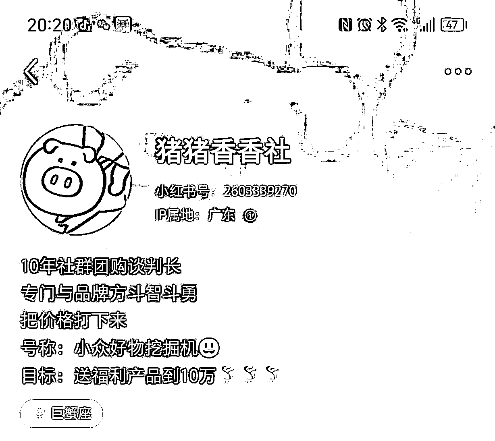

# 高利润的美妆、护肤品，如何做小红书（纯干货分享）

> 来源：[https://cdmxxedltu.feishu.cn/docx/NvmwdG1Nzo0ocvxgqfcclwE4nJh](https://cdmxxedltu.feishu.cn/docx/NvmwdG1Nzo0ocvxgqfcclwE4nJh)

大家好，我是蓝子鱼，专做小红书引流和电商，也是小红书店铺航海教练，对小红书平台的内容会比较了解。

最近经常收到圈友的信息，问美妆类产品怎么在小红书上做？美妆类产品在小红书上非常多，因为小红书的人群大部分是女性，所以美妆产品非常适合小红书的人群，但是很多圈友一直没有做起来，竞争非常的激烈。

要么就是发了没有什么流量，要么就是很容易被平台检测出来，说营销内容过重或者是不真实的体验。

其实美妆类的产品在小红书里面，已经有了一套非常完善的打法，我过年的时候也在小红书里面做过牙粉，发现小红书的人很容易被种草，哪怕一款产品没有什么知名度，还是有很多人会买，这个确实刷新了我的认知。

我以前觉得买一款产品，要抹在身上，或者是吃进嘴里的，至少也要有点名气的牌子，或者是明星代言过，但是小红书里面很多贴牌产品也卖的很好。

大部分的商家还是在小红书种草，然后导流到电商平台成交，现在小红书开始大力扶持电商，可以通过小红书商店来进行销售。避免的像以前导流淘宝或京东，容易被限流或者是评论区被屏蔽，影响导流效果，商店也是一个利好的机会。

上周末也给一个做国外小众品牌的美妆团队，进行小红书内容和店铺培训，把整理的一些内容分享出来，希望能帮助到一些做美妆圈友，其实不止美妆，滋补保健品也可以用。

# 一、大部分人遇到的问题

## 1、笔记没有流量

小红书与抖音最大的区别就是，抖音是系统给你推送哪个，你只能看哪个，如果不喜欢就划走；而小红书是用户喜欢哪个，才主动去选择点击笔记。

所以小红书的封面和标题就非常的重要，它决定了人家会不会点击进去看笔记，所以封面跟标题一定要做的足够吸引人。经常帮一些圈友看号，发现标题和封面连及格线都达不到，这样是很难有流量的，没有流量自然没有成交。

像这个账号，她这样发是基本上不可能卖出去东西的，这款产品大部分人也不认识，除非正好认识这个品牌的人，而且她这个价格特别吸引人，不然是不会有人购买。

她这个首先是封面就很模糊，而且完全就是一张产品海报，小红书要的是真实种草。

第二没有一个吸引人的标题，她没有起标题，小红书会自动提取前面的内容作为标题：＃海龟爸爸 45元/瓶。

还有产品内容写的也不好，完全就是一个产品介绍，冷冰冰的。

## 2、账号搭建不专业

化妆品很容易买到假货，还有很多化妆品会存在质量问题，想要有比较高的转化，一定要有一个让人产生信任的人设，不然这种脸上抹的也不敢随便用。

所以做化妆品或者是滋补品，一定要有比较强的人设，或者是企业认证，减少客户的选择成本，让他们能够对你的产品产生信任。

给大家看一个我随机刷的的账号，非常的业余。名字就一个字，简介也非常简单，然后下面在卖面霜跟滋补品，客户怎么敢信任她。

首先就是你的账号搭建，头像一定要是真人的，如果是企业账号，一定要带有企业的标识。让人对你这个账号产生信任。

第二个就是个人简介，要足够吸引人，很多人简介写的非常简单，就是分享好物，分享好东西，或者是分享××产品，完全没有人设。

带货能力的强的账号，一定要塑造你在这个领域的资格，比如8年欧莱雅柜姐。10年海外代购买手，如果是做公司或者是美妆供应链的，要把供应链这个优势写出来，然后讲一下你分享什么产品？宣传一下你的理念。

刷到一个做美妆团购的，她的人设就很强。

## 3、笔记内容不够专业

那些专门在小红书里面做美妆种草或者是带货的团队，他们有专门的文案团队生产种草文案，也会有固定模板。

我上周在给客户培训的时候，发现他们的笔记标题和文案写的很一般，也可能不知道如何写，我给大家推荐目前最常用，效果还不错的文案框架。

标题方法，都是突出效果，然后带点俏皮，多刷一些同类型的就知道怎么写了，基本上也不用自己写，找对标然后模仿。

①去黄提亮太凶了！夜都白熬了!!!

②吃黄气太凶了！！素颜都是白月光！

③白死算了…刷刷牙就白成这样！别太牛了

重点讲一下文案框架，当客户刷到产品，会不会下单很重要的原因，就是里面的内容介绍，如果这个内容能够说到用户心里去，那就能大大增加转化。

客户买产品不是因为这个产品有多好，而是因为客户遇到什么痛点，正好我这个产品可以帮你解决。

很多人喜欢直接介绍这个产品的功效，客户看完没什么感觉，比如补水，保湿，防晒，这些都是产品功效，但是客户不会直接买单。

客户只会关心自己身上存在的问题，所以你如果想要把产品卖出去，不是告诉客户你产品有多好，而是应该先告诉客户，她身上有哪些问题，你的产品可以帮助她解决，客户想解决自己的问题，才是核心关键。

错误的案例：直接介绍产品

转化效果比较好的文案框架：

好文案=客户痛点+使用方法+产品成分+使用效果

很多美妆和护肤品的框架都是这样的，效果都挺好的。

牙粉案例：

如果能把上面这些内容做好，就能够把产品卖出去，但是想要卖的更多，还需要一些运营技巧，还有增加多种笔记类型。

# 二、不同的笔记类型

1、开小红书店铺（付费➕免费）

现在小红书禁止引流，大力扶持小红书电商，所以直接在小红书店铺开店，通过笔记带货直接成交，另外一方面还可能有商城流量和搜索流量，可以直接成交。

目前有很多商家都已经在小红书上开店了，个人也有很多开店的，可能是因为目前平台为了GMV，一些护肤品或者是美妆产品，居然不用资质和不用授权证书就可以直接上架，以后越来越规范可能就不行了，也是一个红利期。

如果笔记转化比较好，也可以进行投流，提升转化。

在小红书上开店的细节：

①自己开店带产品，文案只能以第三方的口吻来介绍产品，不能采用第一人称，不然平台会警告违规，过度营销。

我上周培训的这个团队，最开始就是用第一人称的分享，发现被平台警告。

②商城发优惠券，在店铺后台发布大额满减优惠券，可以利用客户占便宜的心理，提高成交率。

③学会发好评优惠券，吸引客户收获以后发好评笔记，发笔记可以获得优惠券，还可以促进复购，可以通过笔记点击到商品，不仅有真实体验，还可以直接转到商城成交。

商家后台可以进行设置，只要客户确认收货，系统会推送一条邀请晒单的笔记。

2、导流淘宝成交（付费广告玩法，小团队不建议）

在淘宝里面开一个旗舰店，然后在小红书蒲公英后台找美妆博主进行发笔记，笔记里面带上产品图片，然后评论区引导到淘宝成交，目前这种是笔记主流的玩法。

要在淘宝里面布局关键词，这样可以让客户搜索某个词就能第一个找到这款产品。

3、合集类广告（付费广告玩法，小团队不建议）

最近很多人做影视剪辑类型，然后在蒲公英接广告，一条一两百，这种类型也是导流到淘宝成交，也是需要有淘宝店铺。

也有一些没有通过蒲公英，直接找素人代发，提供图片，标题和文案，素人只要直接发就有钱💰，一条三四块。

4、素人故事帖（免费或者付费，适合想做免费流量的，优点是免费，缺点是需要号多，还有文案能力）

通过吸引人的标题和封面，吸引人点进来，并且因为你的内容与你产生互动，从而让这篇笔记火起来，我之前主要就用这套方法做牙粉，但是比较吃创意，还有创作时间，可以跟GPT结合，提高效率。

5、素人求推荐（免费或者付费，优点就是可以免费做，缺点就是效率比较低，可能没有流量）

用手写字体求推荐某种产品，人总是喜欢给建议的，封面问其他人有没有推荐的好产品，然后用自己的小号去评论区推荐，然后利用点赞把自己的评论顶上去，也是导流到淘宝成交。

有些团队也有专门做这种账号，以前最多是河南的IP地址，现在其他地方也有人在做，甚至找其他省份的兼职。

评论区布局，找小号推荐，其他的号进行附和，一起推荐。

这五种方法是目前美妆团队常用的方法，每种方法都有不同的优劣势，一定要选择自己合适的，不仅要考虑产品，还要考虑投入资金和人员，投广告的这种类型，一般是大点的公司才会做，小团队就是自己生产笔记，然后推荐产品就可以哦！

# 三、总结

上面的这些方法，不仅可以用来做美妆，像一些日用品，保健品都是可以做的，有一些品长期在投付费广告，说明利润不错，也可以跟小红书店铺项目相结合，只是把产品换掉而已。

跟一些做过的老板交流，基本上毛利都是50%以上，最高的一些可以达到90%，河南一些团队一年能做几千万GMV，自己也有接触过，前景还是挺好的。

很多人都想白嫖小红书，想做免费流量，但是又做不起来，免费流量对内容要求非常高，非常吃笔记素材，还容易被平台打击。

如果想把这个做大，一定是要做付费流量的，付费流量才能长期稳定，而且有了生产内容的流程，可以进行大规模的投放，有很多笔记从去年一直投放到现在，说明利润不错，也跟很多圈友聊过付费投放的事情。

这些方法也可以用来做小红书店铺，找一些有供应链的圈友合作，做这个是有门槛的，也可以做的比较长久，我上次看过客户的店铺后台，产品一发布就有人下单，也有圈友做一个月做了几十万GMV，市场非常庞大，等团队稳定下来，我们也会继续做这个类目。

希望今天的内容能够给想做美妆，保健品，日用品的圈友一些思路，也欢迎大家一起交流，每次跟圈友交流都能带来新的收获。

如果还有写的不清楚的地方，也可以加微信交流：lanziyu0721