# 如何精准的找到自己的定位

> 来源：[https://imste3bktg.feishu.cn/docx/NxvFdGa1vo1HIixg6BycIlygnGY](https://imste3bktg.feishu.cn/docx/NxvFdGa1vo1HIixg6BycIlygnGY)

提语：

通过系统的梳理，你也可以轻松找到自己的定位所在...

# START

# 前言

嗨，大家好呀，我是小宝，一名职业生涯规划和热爱变现教练。

在做职业咨询的时候，很多人看到招聘网站上各式各样的岗位，却不知道自己该做什么工作。

之前在接触一些生财伙伴的时候，也发现大家看到一堆的生财项目，却不知道从何入手。

这些基本都是定位的问题，不知道自己该从哪个定位方向去切入。今天我以职业生涯的视角来和大家分析下，如何快速的找到自己的定位方向。

在职业发展中，我们一般都要经历三个阶段：生存关、发展关、使命关。

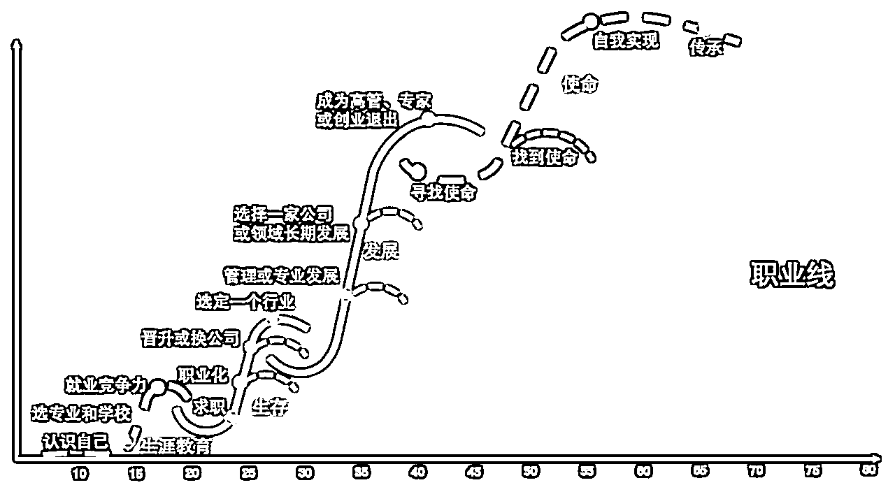

在这些关卡中，我们都会面临一些常见的生涯问题，如：早期的职业定位、中期的家庭事业平衡、职业发展受阻以及后期的职业转型，某种程度上来说，这些其实都属于“定位”的问题。

早期定位一般是初入职场阶段的人群（一般在初入职场3-5年阶段），为了找到适合自己的职业方向。

中期的家庭事业平衡一般是已晋升管理层（开始有了家庭、孩子），为了找到平衡点，其实也就是：定位好职场与家庭之间的关系。

职业发展受阻，也就是原来的发展方向，开始慢慢变得不行了，为了更好的发展，也需要重新开始定位方向，以帮助自己突破困境。

后期的职业转型一般是35岁后，要么已经到职业的顶峰了，要么是面临职业困局无法突破的阶段，为了找到新的突破点，需要重新定位，找到新的出路（也许是为了实现个人价值，也许是为了重新换一种谋生方式...）。

因为在职业发展的不同阶段，我们面临的职业环境、自我诉求、自身的资源都不同，所以其实我们一直都处于“动态定位”的过程之中。

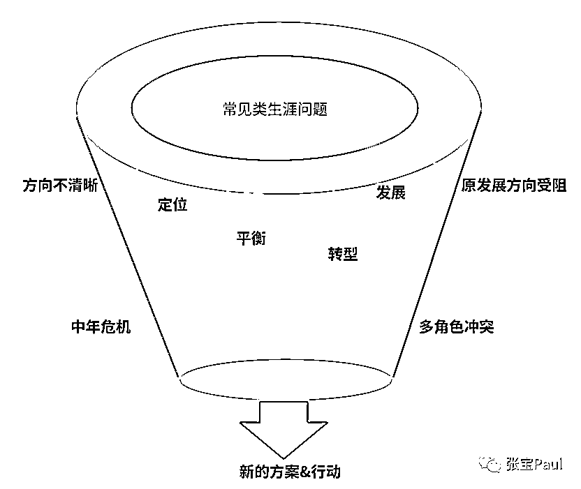

既然定位这件事情这么重要，但为什么很多人总是做不好呢？

这其中就不得不提及到，我们对自我的认知和探索，你对自己有多了解？你对这个世界和外在的环境有多了解......

拿找工作来说，你知道自己有什么优势、能力、资源、兴趣吗？你知道又有哪些不同工作岗位？这些岗位都有什么要求？你和这些岗位之间又该如何有效地匹配起来？

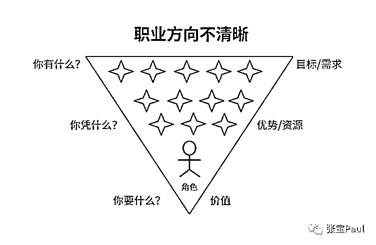

再拿做副业/创业来说，你知道自己适合做什么吗？你的定位是什么？你要吸引的是什么类型客户？你又该如何做引流变现？如何做客户交付...

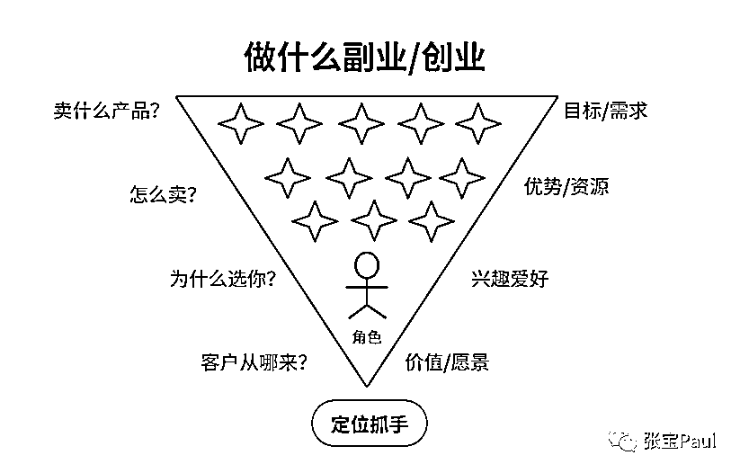

所以如果你的定位不清，未来可预见性的结果就是频繁跳槽、工作不喜欢没动力、上班如上坟，最后用一句：人到中年啥也没混出来，草率收场。

今天，想借此机会来和大家好好聊一聊，作为一个平平无奇的我们，除开付费做咨询外，我们还可以怎么样系统地来盘点自己，找到自己的定位。

以下是全文概要，如果你对某一个板块特别感兴趣，可以定位具体板块跳转过去。但仍然建议你花点时间，全文阅读下来效果更佳。

一、定位的基本认知

二、定位的一些坑

三、如何精准找到自己的定位

# ONE

## 定位的基本认知

正式开始之前，我想先问你一个问题：什么是定位呢？

以职业发展的视角来看，“定位”指的就是在面对人生十字路口的时候，我们要选择哪一条路。

但要明白自己走哪条路之前，我们得先了解几个影响定位的关键点。

1.明确意图

也就是你得知道，你想干嘛，你需要什么。

你想创业，那就选创业那条路；

你想上班，那就选上班那条路；

你想继续深造，那就选深造那条路就好了。

如果你都不知道自己的目的地在哪，那其实走哪一条路都无所谓。

2.明确自我

假如你想创业，但是创业是想创就可以创的吗？

你得看看自己手里都有什么牌，有没有创业相关的资源、钱、人脉、能力等，拿着一副烂牌，啥都没有就跑去创业，无疑就是九死一生。

3.明确环境

那如果我有一手好牌，就可以创业了吗？

等等，你还得看看周围的环境。

若你身边的牌友，都有好牌，都在这个赛道创业，你压根就挤不进去。

那就换一个不那么拥挤的赛道，走上班、深造、或者其他的路嘛。

所以你看，定位其实是一个很复杂的过程，他与我们的需求（意图）、资源（自我）、环境有关。就像人生的终极问题，你是谁（自我）、从何而来（环境）、要去往何方（意图）。

而这问题的答案，也正是我们辛辛苦苦，所追寻的人之为人的意义。

现在我们再来看看，意图、自我、环境，这三个关键点，具体是怎么彼此影响我们定位的。

现在地图上有桃园、深大南、南山三个地方，如果你要开车去中山公园玩（意图），无疑选择桃园作为你“定位”的出发点，是最佳方案。

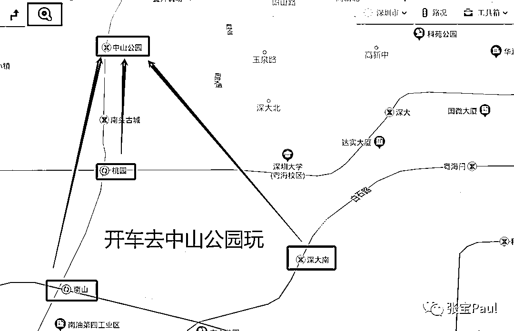

那如果我把“环境”改一下，桃园到中山公园虽然近，但最近发生了交通事故，路被封锁了，那这个时候，相比于弯弯绕绕的深大南而言，选择一路通畅的南山作为“定位”的出发点，（选择路径1）是更优的选择。

要是此刻，你的车坏了（“自我”因素变化），现在要走路去中山公园，无疑选择离中山公园更近的桃园作为“定位”的出发点是最佳选择。

所以你看一个定位好不好，与自我、环境、意图这三个要素息息相关，任何一个有改变，定位的好坏也就跟着变了，我们选择的路径也会跟着变。

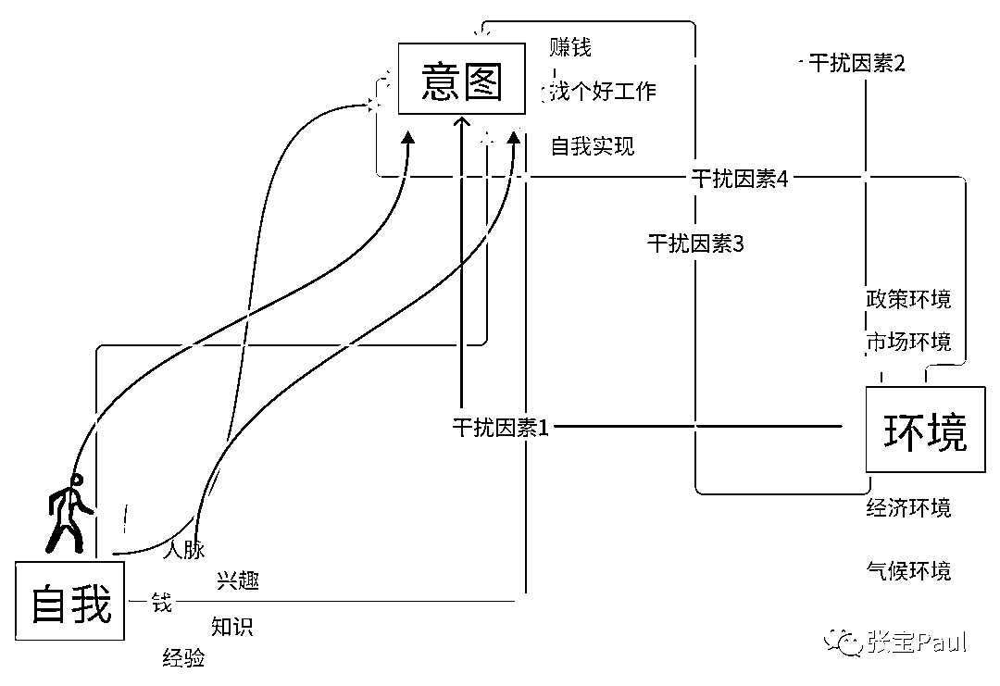

无论是在职业发展或者商业世界中，作为“自我”的我们，我们的年龄、能力、资源、兴趣等都会随着时间的改变而改变。

随着时间的推移，我们所处的环境也会发生变化，甚至不同阶段我们的意图（需求）也会发生变化。

所以你看，自我、环境、意图都是在不断变换的，理解了这一点，那接下来定位路上的一些坑，你也就能更好理解了。

# TWO

# 定位都有哪些坑

1.定位，从来都不是“一层不变的”，而是在时刻“变化的”。

小时候，你想当科学家、宇航员，

长大后，你的梦想还是科学家吗？也许是想当老板，办企业吧。

人生的不同阶段，你身边的资源、环境、自我需求都在时刻发生变化，定位也是会随着你的成长而产生相应的变化。

2.只是做机械的匹配，定位=你的基本情况+外界的一些信息评估报告+自我匹配

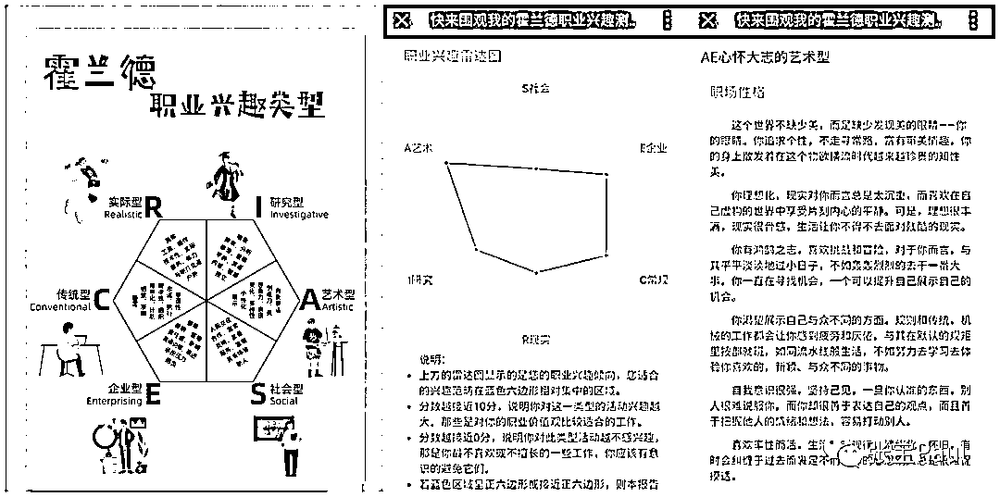

而忽视了作为一个“人”，你的主观能动性、你的意愿、以及在定位过程中认知的变化对定位的影响。

3.误以为别人给你贴的“标签”、“关键词”就是你的定位

你讲课风格好，你适合当老师，去做老师吧；

你说话很厉害，特别适合干销售，去做销售吧；

不知道有多少人，是被类似这样的话，给耽误的。

这不是你的定位，这或许是你的“营销定位”，是用来占据用户心智的，是你在用户眼中的样子，而真正的定位，是给自己找方向、找行动抓手的，是自己的指路明灯。

这也是为什么很多人，找了个定位后（营销定位）后劲不足的原因，明明赚了钱，明明已经跑通了商业模式，但却始终不快乐，内耗严重。

因为那并不是你真正想做的事情，不是你真正的热爱所在，所以它没有办法，让你在面对逆境的时候，依然快乐地做下去。

所以真正的定位它不是死的，而是活的、是时刻都在迭代的、是我们一边在实践探索，一边又在探索中成长，彼此交互，彼此影响着的。

一边是我们在探索的过程中所获得的结果，为定位所用。

一边是定位实践的过程之中，又加深了我们对定位的理解。

那我们在创业、做副业的时候，又如何来找“商业定位”呢？

我们依然可以从定位的三要素入手。

PS：如果对职业定位感兴趣，后面可以再展开讲讲。

# THREE

# 根据意图来定位

你做一件事情的目标是什么？对此有什么期待？也就是说你有什么“需求”。这个需求可以是多样的：钱、自我价值实现、情绪满足、房车旅行...

但如果是在商业世界中，这个“意图”一定是围绕着客户痛点去解决的，只有解决客户的“痛点需求”，才能为你带来利润，那这个定位才有价值。

可能你要说了，商业社会里的需求太多太多了，所以这就不得不围绕着你的“意图”来展开了。

如果说你是想赚钱，这个时候，你可能就要对自我进行盘点（这点将在后面，详细的展开），你有什么能力、资源、优势等。

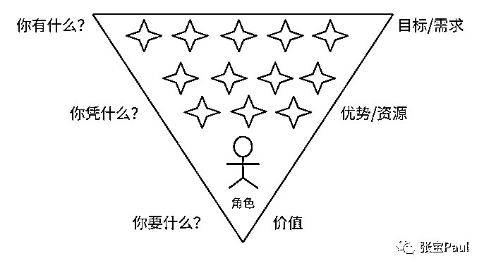

通过盘点后，你发现现在越来越多的职场人，迷茫、焦虑找不到方向，于是你想成为一名职业生涯规划师，来解决各类职业问题。

那具体怎么做呢？你是去找一个职业生涯机构上班？还是找几个同行一起注册开一家公司？还是做自由职业？又或者说先研发一些课程去卖？那我主要解决的是什么问题呢？

是职业迷茫问题？职业转型问题？职业平衡问题？职业适应问题？找工作问题？简历优化？面试辅导？...

慢慢地你又迷茫了，我该做哪个好呢？

你看这个问题，太宽泛了，只是在脑海中有了一个大致的方向目标。于是你开始不停试错，一个个验证下去，直到找到你真正想做的......但这样的效率太低了，不知道什么时候才能找到。

因为这个靶子呢，根本看不清，只知道它大概在什么方向，射到几环全看运气，甚至你可能连靶子都没有射到。

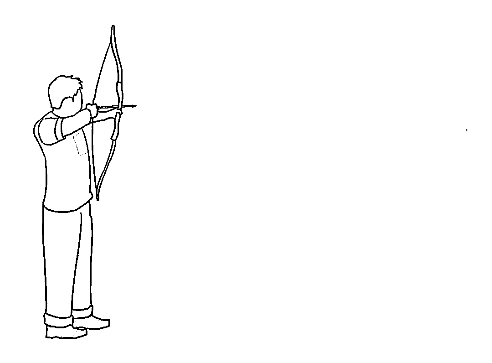

那有没有什么高效的方法，可以把不清晰的“需求”搞清楚呢？

戴副高清的眼镜就可以解决这个问题，看清了靶子，那就往想要射的地方瞄准，射进完事了。

那么如何找到这副高清的眼镜呢，我们可以从以下三个维度入手来不断细分、具体化我们的需求，从而找到一个真实的，我们可以为之付出行动的定位切入口。

简单来说，就是：在什么场景下，为什么人，解决什么问题。

三维细分法

1.按照“场景”来细分需求

就是用户在什么样的场景下来使用你的产品？不同的场景下，用户对产品的需求也会有所不同。

比如一个有职业困惑的人，在家里、在咨询室、在公司、在咖啡厅、在户外、在走路等等，不同场景下找你做咨询。

那它们需要的产品/关注的能一样吗？

*   在家里，客户可能更多的关注性价比、高效性，和你约个电话聊聊就好；

*   在咨询室，客户可能更多关注的是你的服务、环境、体验等，能够让他完全放松下来和你说出自己的困惑；

*   在公司，客户可能更多关注的是微咨询，可以帮助她快速解决问题；

*   在户外，客户可能更多关注的是便利性，线下附近找个地方，向你咨询下；

*   在走路，客户可能很多关注的是利用零零碎碎的时间，打开手机听听你的职业规划课程，而不是找你做咨询。

因此从场景来看，可以将整个咨询需求划分出很多的小需求来，他们所需要的产品也明显不同。

2.按照“人群”来细分需求

人是具体独特性的，每个人都不一样，收入水平、受教育水平、兴趣爱好、偏好、成长的环境、性别、年龄、公司的职业/角色、价值观、生活方式、高矮胖瘦等都是不同的，那么他们对产品的需求也会有所不同。

不同人群对职业规划的需求：

*   小学生，可能更多关注的是生涯教育，有这个意识就好了，也可能没有需求；

*   大学生，可能更多关注的是完成学校布置的大学生职业生涯规划的作业；

*   毕业3年内的职场人，可能更多的是职业迷茫、没方向、不知道找什么工作；

*   毕业3-8年的职场人，可能更多的是职业发展与家庭之间的平衡、是职业晋升发展等问题；

*   毕业8年以上的职场人，可能更多的是30+的职业转型再就业的问题；

*   还有职业女性、职业男性、一线城市、二线城市、海龟毕业生、40岁+的职场人（男/女）等等，关注的问题重点又会有所不同。

你看按照“人群”的不同，他们的需求不同，我们又可以把职业咨询的市场继续细分。

3.按照“用途”来细分需求

用户用你这款产品/服务，是为了解决什么问题，以此来达成什么目的。

比如同样是职业咨询：

*   有的人是为了解决职业迷茫问题，想要找到职业的方向，进而好找工作；

*   有的人是因为职业发展遇到瓶颈了，想要解决职业晋升的问题；

*   有的人是因为无法兼顾好一边上班赚钱，一边顾家，想要解决职业与家庭之间的平衡问题；

*   有的人是因为遇见了中年危机，想要找到职业的新出路问题；

*   有的人是因为职场关系处理不好，想要解决职场适应问题；

*   有的人是因为找不到工作，想要你辅导优化求职简历，辅助其顺利入职等等。

用途的不同，他们对产品的需求又不相同；

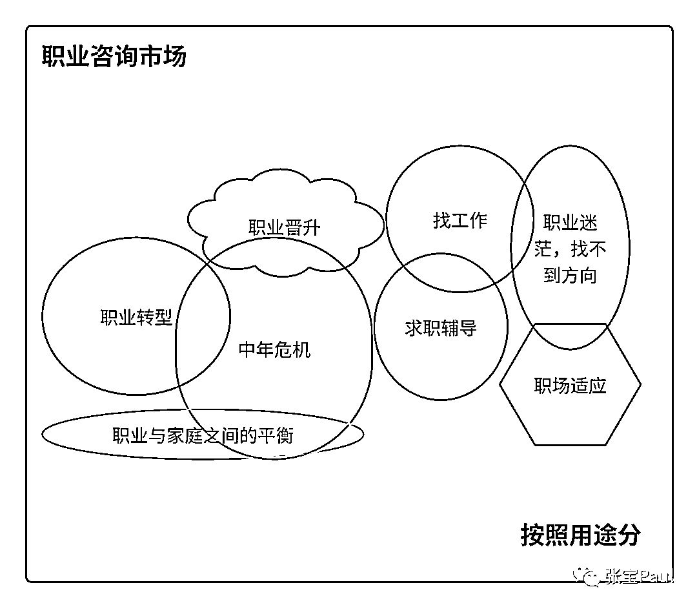

你看我们根据“意图”，又进一步把市场给细分了，具体化了需求。

这个时候，我们就把这三个维度放到一起来看，也就相当于让我们戴上了高清眼镜。把“场景”、“人群”、“用途“里面的每一个细分，进行随机的组合，我们就可以看到更多的、更具体的细分需求。

比如：在线下咨询室，为毕业8年以上的职场人，解决职场转型问题。

又比如：在家里，为毕业3年内的职场新人，解决职业迷茫、找不到职业定位的问题；

这样不断地去随机组合，你就可以看到几乎整个的职业咨询市场里，可能存在的无数细分的需求。接下来，你要做的就是从这些需求中，找到一个“好需求”，来开始设计你的产品。

好需求的三个标准

1.得是“真实”的需求

比如：一个小学生，在公司里，想要你帮他找工作。这一看，明显就是一个“伪需求”。

但也有些需求，可能不太能够明显的看出，是否是真实的需求，怎么办？

先去跑一个最小的MVP模型，去做概念验证，判断这是否是一个“真实”的需求。

2.市场得够“大”

只有市场足够大，才能让你放开手脚去做，不至于很快就碰到了天花板。

比如：大学生，在学校，为了完成大学生职业规划的作业而找你做咨询。这个需求也许真实存在，但这个需求有多大呢？大学生能够支付的费用上限是多少呢？就算你把业务开展到了全中国的高校，又能产生多少利润呢？

又比如：在咨询室，给40岁+的职场人，解决职业中年危机、转型等问题。

又能产生多大的利润空间呢？这些都需要你去收集信息，去判断，这件事情是否值得你去做。

3.竞争压力得“小”

越是市场空间大的市场，竞争压力也大。

看看我们的衣食住行就知道了，因为刚需，那竞争压力可不是一般的大。那要想从中脱颖而出，你就得不断的细化、细化、细化、再细化你的需求，找到一个差异点、打造你的独特性，形成你的差异化定位。

不要大而全，要的是小而精。

做职业生涯规划的很多，但专注做40岁以上的职业规划师就少了许多，其中有专注做职业转型的职业规划师又少了很多，再其中专注做资产在100W以上的职业规划师又再一次少了许多。

如果提起职业规划师，太多、太多、太多，客户根本想不到你；但如果说是专注帮助高端人士（如：40岁+、高职位、高收入）解决职业转型问题，人家可能一下子就想到要找你做咨询。

PS：而且也因为服务高端，利润空间相对也就大很多。

以上，就是我们从意图的点出发，通过不断的细分”场景、人群、用途“的方式，一步步的筛选、筛选、再筛选，找到我们的定位。

接下来，你要做的就是从这些需求中，找到一个“好需求”，来开始设计你的产品。

# FOUR

# 根据自我来定位

前面根据“意图”来定位，我们发现了很多的市场需求，但这些需求适合你吗？

你有对应的专业能力吗？

你有资源吗？

你有启动资金吗？

你有足够的时间精力来支持你做这件事情吗？

客户为什么选择买你的服务/产品？

...

现在智能AI的出现，未来很多工作注定要被淘汰，于是开始有一部分人开始布局一些不太容易被淘汰的工作。如：职业咨询师，就没那么容易被AI取代，但由你来做，一个行业高管，或者一个行业大咖来做，肯定不同。

因为你们的起点、资源、财富、影响力、专业能力、性格、偏好、愿景（目标）等等都不同，所以你们的定位策略，肯定是不同的，如果你和对方采用相同的竞争策略，无异于以卵击石。

还记得我们前面提到的，不断的去细分市场需求吗？通过不断的去细分市场，进而找到你切入点。

同样基于我们自身而言，我们的年龄、性别、资源、专业能力、优势、审美偏好等，是与他人不同的，但这也正是我们与他人的差异点所在。

虽然此刻，你没有那些行业大咖/高管，在职业咨询上那么专业，影响力那么大，那么牛逼。但你的专业能力至少是合格的，而90后的年龄优势+多年的互联网运营从业经验+多年知识付费分销玩家，这些就是你独特的优势，你更懂90后互联网运营类的职场人，你更善于通过运营、新媒体等手段“获客”，进而开展你的事业，这就是你独特的定位策略。

那我们该如何调盘点自己，结合自己的实际情况出发，找到自己独特的优势呢？

1.关注自我拥有的“资源”

资源的意义在于，协助你更好地为未来做准备。

资源又可以分为：内在资源和外在资源。

1）内在的资源

内在资源可以分为：知识、技能、经验这类你可以直接去兑换价值的，外显化的资源，以及你个人的思维认知、热情表现这类无法外显化的内在资源。

虽然不能直接帮助你去兑换价值，但这却是你内在资源的放大器，它们会帮助你如何做好决策、如何判断一件事情的投入度、如何拆解项目、以及让你拥有足够的热情帮你把事情做成。

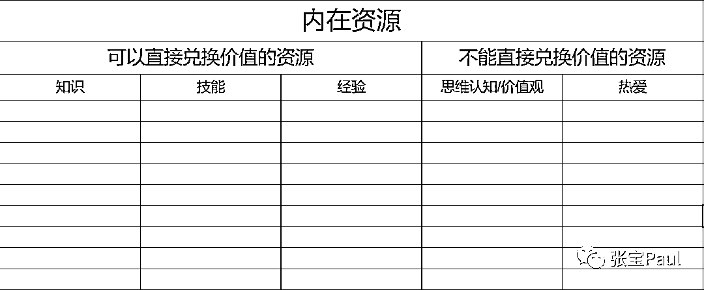

经过仔细的盘点，你一定会找到这些资源。比如你懂职业规划、会摄影、会剪辑、PS、有丰富的运营经验和相关知识、对人际沟通无比的热情与喜爱等等。

有了资源，是不是我就可以做这件事情了？可以，但还不够。

还要看在这个领域，这件事情上，你的认知是怎么样的，以及你是否足够热爱。

你是一个内向，不喜欢社交人，却选择了去做销售；

你是一个对数据不敏感，却选择了去做数据分析师......

就算你有资源，如果你认识不到自己是一个内向的人，无法拆解做好销售这件事情，都有哪些必要的关键动作。

而在实际工作中，又需要你天天和很多的陌生人打交道，建立关系，才能把这件事情做好，但因为你本身比较内向，不擅长处理这样的事情，又或者你不喜欢。

最后的结果就是，你很难把销售这件事情做好，反而还会让你极度难受与内耗，想想看每碰到一个陌生的客户，你都要给自己做一次心里建设，然后用你蹩脚的话，去和对方沟通，这是一件多么可怕的事情。

而内在的“思维认知”起到的作用，就是让你认识了这一点，你就不会盲目的跑去做销售，你虽有销售相关的客户资源，但如果靠你去做销售成交，显然是一件愚蠢的事情，因为你并不擅长。

相反知道自己的短板，采取“扬长避短”的策略，去和擅长销售的人合作，一起来完成这件事情就会容易很多。

也正如靠谱（人名），曾在生财里分享的精华文里分享到，自己如果去做盖洛普咨询师完全可以胜任的，但如果真的去做了，结局会让自己很拧巴。

短视频火了，你去做了短视频；

小红书无货源火了，你去做了小红书；

ChatGTP火了，你去做ChatGTP了......

你说这个现在来钱快是风口，自己刚好懂点，不懂也没关系，先入局总没错吧，然后快速赚一笔钱，这很好，毕竟谁会和钱过意不去呢？

但若是遇到了阻碍，或者没有赚到钱呢？

短视频火，你跟着去做了，但自己不善于表达也不上镜，拍出的效果总是不尽人意，每天都很难受，拍了一两个月也没什么起色，也没赚到钱，试问你还有继续下去吗？就算咬牙坚持，最终你成功了，跑通了这个业务，也赚到钱了，但随着时间的推移，越来越多的人进军短视频，你的粉丝很难再涨上去了，做视频的收入也开始下滑了。

你的同行也越来越多，开始和你竞争，比你做的更好，价格更低；

你转行做培训，教别人做短视频，你又得研发课程，投入精力，最后结果还是不如意；当问题一个接一个，钱越来越难赚，本身做这件事也没有什么热情。赚到钱了，也许还能忍忍，可现在赚不到什么钱了，怎么办？

坚持？

做这事又难受，又不是自己喜欢的，觉得不快乐没意思，现在又没有什么钱赚，迟迟拿不到结果，越是咬牙坚持，这个过程就越会让你很痛苦万分。

放弃？

哪怕这是一个很有前景的赛道，只要继续坚持下去，未来一定会大火，但坚持了这么久，投入了那么多的时间、精力、金钱，一直拿不到正反馈的你，靠坚持，又能坚持多久呢？

况且，当一件事需要靠死死的坚持才能去做，那这件事大概率也成不了。

难道就没有别的办法了吗？

有！

前面我们说了，思维认知是其中的一个内在资源，帮助我们去看到这个事情所在的系统，去拆解成事的关键，我们有没有资源，我们能不能做，能做，又该怎么做。

而另外一个隐藏的内在资源就是：热爱

那就是在一开始的时候，选择自己喜欢的热爱的事情去做。

那样的话，你就不会感受到煎熬，哪怕这件事情后面出现困境，钱越来越难赚，你依然能够坚持去做，因为你非常享受，做这件事情的过程。并不会觉得这是一个负担，反而乐在其中，那么势必你还会投入更多的时间、精力去做这件事情，而这又会让你把这件事情做得更好，而正是因为你的热爱。

会让你不自觉地把一件事情做好，做到极致；

会让你十分享受做这件事情的过程，时刻处于心流状态；

会让你在面对逆境的时候，依然能够坚持做下去......

人生漫长，晴雨交加，但若是心怀热爱，即使岁月荒芜，亦能奔山赴海，静待一树花开。

思维认知与热爱，是资源的放大器，会帮助你把事情做得更好。

2）外在的资源

这类资源的主要作用，是为你增加成事的机会以及效率，比如人脉资源、金钱、独家信息等可以直接拿来用的资源。

你想跟风去学习职业咨询，如果你穷，没钱报班学习，也没人脉可以帮助你进入职业生涯规划的圈子，只考自己瞎折腾，显然效率就极低；但如果你有钱，直接花钱“砸”，报生涯领域最好的课，请最好的老师给你做督导，那结果显然不一样。

AI、大数据、物联网、自动驾驶、大健康、新能源，这些行业目前是大趋势，不容易被人工智能替代，收入高。

但这些又和你有什么关系呢？

你说我转行去做啊！

之前你一直在传统的制造业，做的是汽车性能测试方面的工作，现在我转行去做大健康行业，30岁从0转行去学习做大健康行业不是不可以，但这显然不是一个“好的选择“。

因为你过往的资源积累没有一致性，无法延伸，也没有足够的认知准备，只会浪费了你曾经的资源。若你尝试转行自动驾驶这个领域，那你过往积累的相关汽车专业知识、人脉、经验等都可以派上用场。

转行的方向和你的过往资源具有一致性，就如同顺水行舟，转行显然就会轻松很多。

如何关注资源，整合资源，来帮助我们有效的决策呢？

考虑三个点

2.1).资源的内容关联性

如：你已在职场工作5年，平时喜欢看生涯类的书籍，帮助一些职场新人解决职业发展问题，这就是内容的关联性。

2.2).资源的时间关联性

如：你过去/现在看的这些生涯类的书，帮助朋友解决生涯类的问题，都可以在将来帮助你更好地开启职业生涯规划咨询这件事情，此刻是在为未来做准备，这就是时间上的关联性。

2.3).资源的系统关联性。

从全局的视角系统性来看，围绕在整个职业生涯咨询这个系统是什么样的，那么你就可能看到很多和这个系统有关联的东西，这就是系统上的关联性。

如：同行者、有哪些未来可能是你的客户、怎么吸引这些客户、有哪些大前辈、我可以怎么链接他们、有哪些可能是协助者等等。

走一步可看十步，看到整个系统是怎么运转的，看到了资源之间存在的系统关联性，我们就可以对资源进行整合，来帮助我们更好的开启事业。

你看到了要完成职业咨询师这个角色的转变你需要专业力和商业力，于是你可以去找到职业咨询师的同行圈，一起学习、一起进步；开通一个公众号、视频号等，开始主题式、系统式的去输出相关的知识，用输出的方式倒逼自己提升专业能力，同时也在默默积累潜在客户；从公益咨询做起，慢慢提升客单价，去检验自己的专业功底；去邀请你的同行、前辈等，为你站台，给你添加信任背书；去设计产品、做训练营、做培训分享（或许你可以寻找机会从自己公司内部先开始）。

这样我们就把自己手里的资源，通过系统的方式给有机的联系起来，彼此发挥作用。就像买房一样，不要只关注自己眼前的资源，如果你只想着靠自己打工攒钱，积累起了财富后才开始准备去买房，那你可能永远也买不了房。

你要学会关注系统，在这个系统内，要攒起买房的首付你得跳出来看，除了看到自己攒下的钱外，还可以看看这个系统还有哪些资源可以用起来，这个时候你会发现，你还可以刷信用卡、贷款、找双方父母支持些、再找同事/朋友支持些等，那么你可能很快就可以买房上车了。

相比于自己手里有的资源，学会有效整合资源，方能更高效的帮助我们开启事业。

2.关注自我当下“拥有的选项”

梳理了怎么多的资源，接下来要做的就是，从这些资源之中，看看自己都有哪些选项可以供自己选择。

一个初入职场的人，在思考我是去干销售、运营、IT、设计、还是去干建筑工程师这个问题，真实的情况很可能是你对这些行业的了解并不深入，也没有太多对应的资源、知识、技能等，其中的一些考量并不能称之为一个选项。所以只有抛开那些虚假的自我认知和目标，我们才能从这些真实的选项中找到一个可以切入“定位”的点。

列举选项之前，我们要先看看三个我，从三个我中去了解定位是怎么一回事：

通过看过去的我，去找曾经积累的资源（比如：人脉、钱、能力、知识、技能、经验...)；

通过看未来的我，去找你对未来的期待（比如：你未实现的梦想、赚多少钱，做一件有意思的事情，体验不同的生活...）；

通过看当下的我，去找你可以从什么地方切入进去，找到行动的突破口（比如：先录一个短视频，先写一篇文章...）；

找选项的三个维度

1）能做的:力所能及，资源所致

你现在就可以着手开始干的，对你来说不算难的事，比如去做短视频运营、去做培训等。

2）想做的:心生好奇，跃跃欲试

你可以努努力去尝试干的，对你来说是一次尝试的，比如想跑通自由职业之路，然后开着房车过着全球旅居的生活。

3）期待的:志向所在，努力为之

你希望去做的，那是你想要去追随的梦，比如你希望带领更多的人重新设计自己的人生，让他们都能按照自己的意愿去度过这一生，让他们活得更出彩。

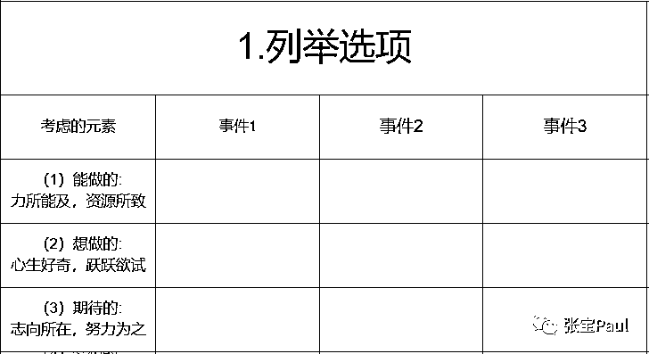

相信到这一步，你一定列举出来一堆的可选项，准备跃跃欲试了吧。别急，这个时候我们又需要戴个高清眼睛，来帮助我们做个初步的筛选。

1）符合客观规律，什么阶段做什么事情

比如我，曾经很喜欢亲子领域，做个育儿老师是一件十分让我兴奋的事情，但单身无娃，贸然投入亲子讲师这个领域注定前路坎坷。相反扎扎实实的做好本职工作，或者转行去亲子教育机构上班，然后努力学习育儿知识，慢慢积累，等到有娃的时候，再做这一领域自然也就顺理成章。

2）内心的期待，你想要的是什么

该盘点的也盘点了，面对这些选项，好好问问自己，你真正想要的是什么？是钱，权利，名气，实现某一梦想，还是做自己喜欢的事情...静下心来，好好的，问问自己，你真正想要的是什么。

就像在咨询中，明明很多人，有着不错的工作，收入高、事情少、甚至还离家近，在外人看来：这简直完美啊，你还愁什么呢，真是身在福中不知福。可困扰他们的却是不喜欢、压抑、没法发挥自己的优势、自我价值得不到实现，这让他们很难受，所以你眼中的好，不一定是他人眼中的好。

真正想要什么，只有你自己知道。

3.关注“价值”

看热爱程度、看资源情况、看机会成本。

1）看热爱度

做这件事情，你热爱的程度如何，准备投入多少的热情在里面，哪怕没资源、没金钱、困难重重，你也要做，只有足够的热爱，才能让你勇往无前，无所畏惧。

做短视频混剪去带货，也许赚钱，但不热爱的话，靠打鸡血，一旦遇见困境，迟迟没有正反馈，就很容易放弃。

喜欢读书分享，因此你做了一个读书账号，分享一些读书的感悟，哪怕没有什么收入，但你依然能够乐此不彼的分享自己的所思所想。

做这件事情对你来说没有丝毫的压力，反而非常享受做这件事情的过程，慢慢地你自然会收获些果实（钱、粉丝、机会...），那是对热爱对你的嘉奖。

2）看资源是否有延续

前面我们已经提到过，资源是过去的积累，如果放着不用着实浪费。要看看现在要做的事情，是否和曾经的资源有延续、有链接，这样能够极大增加我们成事的概率。

如果你想做销售，打过辩论赛、发表过演讲、做过培训，这些都可以是很好的资源，因为这些都跟销售有一定的关联，具有资源的延续性，你做起来就会容易些。

如果你想做职业咨询，没同理心、缺乏共情力、没专业知识，你就很难搞，因为过往没积累这方面资源，一起都得从0开始，成事也就困难了很多。

3）看机会成本

我们每天都在做选择，但我们所拥有的时间、资源、金钱都是有限的。为了得到一样东西，通常我们都不得不放弃另外一些东西，而那些我们不得不放弃的东西，就是我们为了当下的选择，所需要付出的机会成本。

理解机会成本有利于帮助我们做出更理性的选择。

我们可以从以下三个方面来理解机会成本。

3.1）最大

我在写这篇文章的时候，至少需要5个小时才能完成。但如果我把同样的时间拿来做其他的事情，比如可以赚500元，那么我写篇文章的机会成本就是500元。

所以如果我不做这件事情（写这篇文章），那么我可以做的事情有很多，而机会成本价是当我作出这个决策时，放弃的那个“最大代价”，而不能是“任何代价”。

3.2）必然

机会成本一定是一个必然的可选项，就是说这是真实的，你可以获得的。我不能说我写这篇文章的5小时，我可以去接一条价值10万的短视频广告，所以我的机会成本是10万？这显然不可能也不真实，我又不是头部博主，没有那么多粉丝，也没有愿意花10万找我拍广告的金主爸爸，所以这不能看作是你的机会成本，因为这并不是你当下可以“真实做到的”。

而写文章的这5个小时，我可以去接一些私活，轻松赚500元，这就是一个必然的选项，因为我可以轻松做到。

3.3）所有

我们所有的选择都是有成本的。

正如我此刻用来写这篇文章的电脑，晚上的时候我基本上不用的，那这个时候的机会成本价是，我把晚上不用的时间，把电脑出租给需要的人所获得的租金。

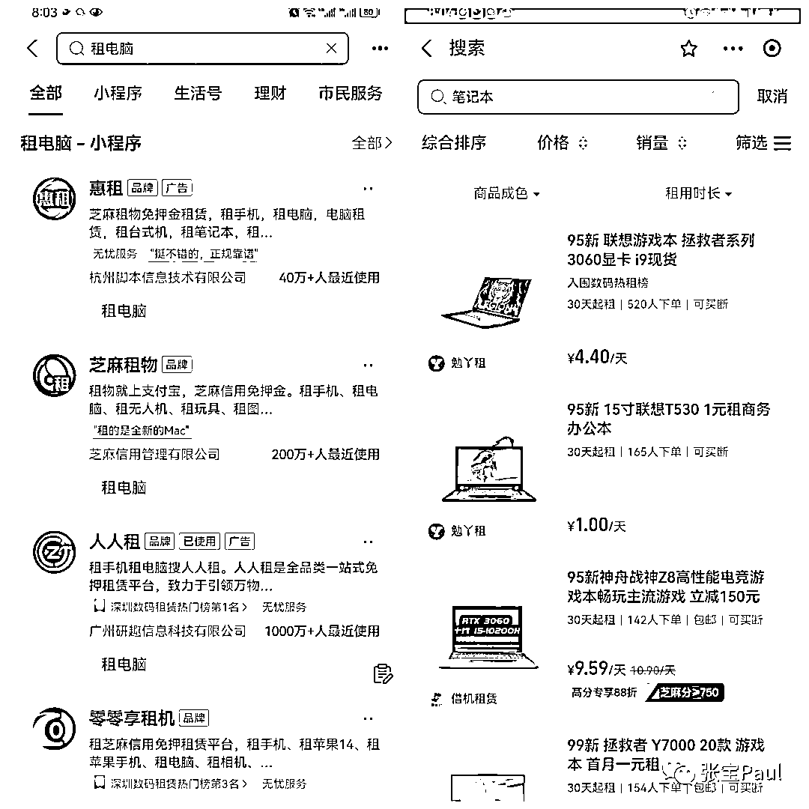

一句话理解机会成本价是：

鱼与熊掌不可兼得，放弃的鱼，就是你选择熊掌的代价。

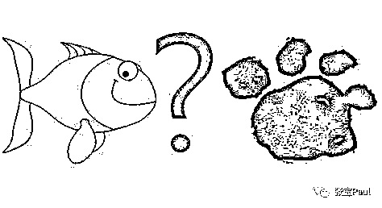

这就是我们从“自我”出发做定位时，我们需要关注的点：

关注资源的一致性，看我们能不能做这件事情，过往有没有积累；

关注都有哪些选项，看有哪些靠谱的选择，找到行动的切入点；

关注这件事情的价值，看这件事情要不要做，值不值得做。

# FIVE

# 根据环境情况来定位

很多时候，我们不得不关注环境的变化对产品的影响。

疫情的到来，原来好好的行业，都不得不面临倒闭的风险，在线教育，抓住了机会，趁着疫情大家到不能出门，得到了快速的发展，可双减政策的颁布，在线教育又不得不面临在转型的困境。怎么办？

1.做出差异化

你进入的行业一片红海，竞争太激烈了，那么你就需要通过“差异化”来让你与众不同，从而增加自己胜出的概率。

就拿矿泉水来说，面对这一片红海的赛道。

百岁山说：我们是水中贵族！

农夫山泉说：我们不生产水，我们只是大自然的搬运工（他们还说，农夫山泉，有点甜）！

依云矿泉水说：来自阿尔卑斯山底！

昆仑山矿泉水说：天然的，才是健康的!

怡宝矿泉水说：你我的怡宝！

这就是差异化的定位，给了客户一个选你的理由，让你从众多内卷的矿泉水品类中脱颖而出。

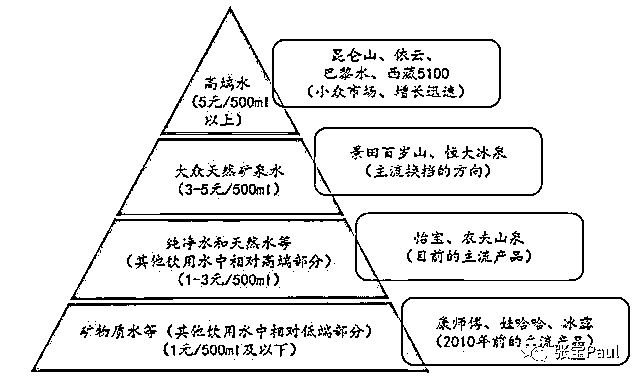

再比如，这短视频竞争如此激烈的今天，抖音上教人“绘画” 的博主太多了。如果你也和大部分人一样，拍摄各种教人家绘画的视频，那你大概率是卷不出来的。而抖音上的一位博主米雷，依靠真人出镜+绘画+变装的方式+自己超高的颜值，快速圈粉600多万。

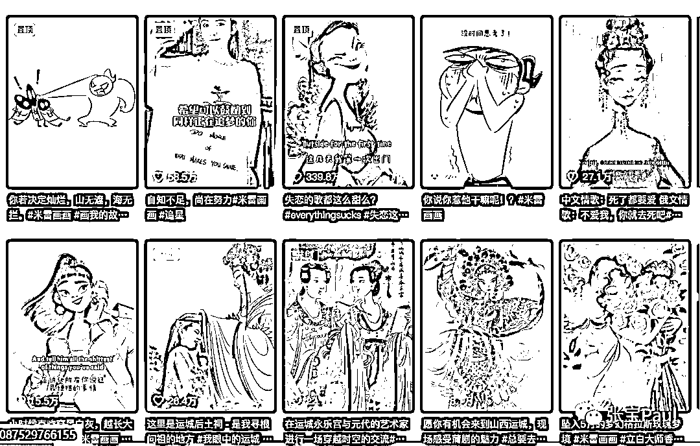

那怎么做出差异化呢，你可以从身份、场景、动作/道具、态度、视角等方面入手。

比如以常见的知识类教学博主为例，假设你是教英语的。

然后我们依次按照身份、场景、动作/道具、态度、视角等因素去划分，去发散我们的思维，填写与之相关的内容就可以了，记住尽可能的多，就可以得到下面这张表。

然后，我们看着这张表，去进行随机的组合，我们就能够得到不一样的差异化定位。比如：英语老师+说唱+情景剧+恶搞的方式，抖音博主“杨家成”，圈粉1900万+。

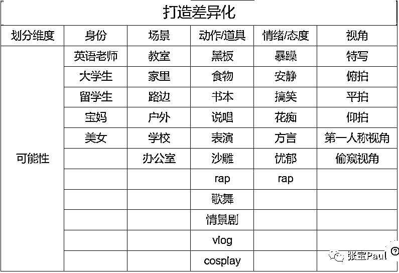

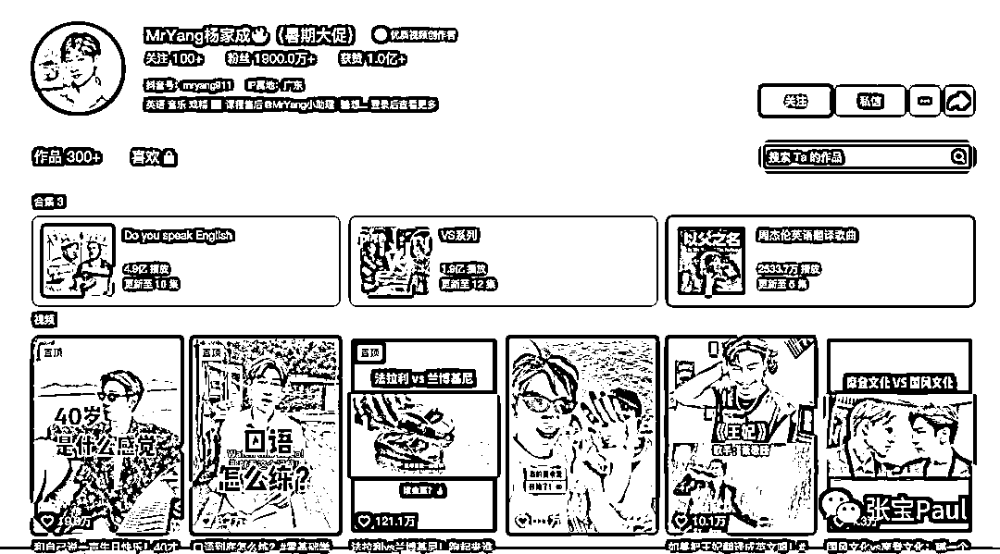

英语老师+rop+家里+性感美女的方式，抖音博主“阿飞Kathy”，圈粉50万+。

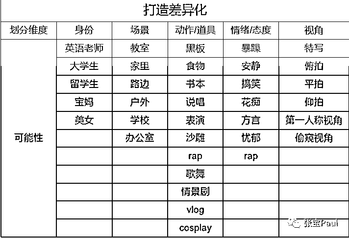

宝妈+家里+cosplay+搞笑的方式，抖音博主“恩恩姥姥”，快速圈粉700万+

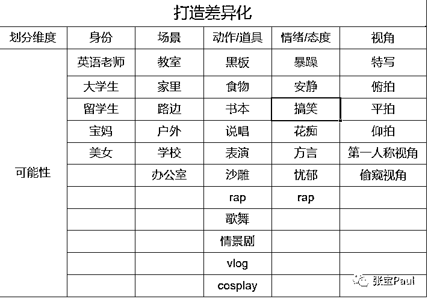

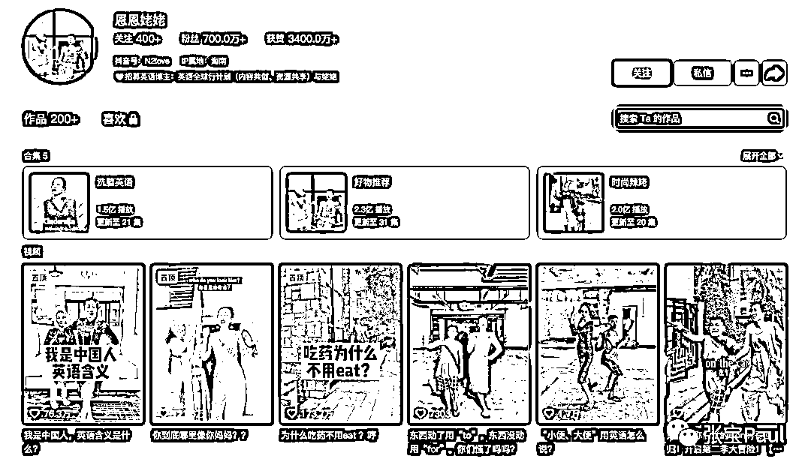

所以，当你进入了一个到处都充满着竞争的市场里，那么打造差异化是你冲出重围的关键。

2.找蓝海

既然市场一片红海，竞争太激烈，我干嘛不尝试摆脱内卷的赛道，进入一个竞争没有那么激烈的赛道，谁爱“卷”，谁“卷”去。

还记得我们前面根据“意图”找定位吗？按“人群、场景、用途”的方式去细分，然后通过做随机组合，来找那些竞争没有那么激烈的细分市场。

我们就拿饮料市场举例，这个赛道那真是太卷了。

饮料行业的市场集中度非常高，各大巨头纷纷占山为王：碳酸饮料是可乐、百事两个国际品牌的天下，分别占59.5%、32.7%；茶类饮料中，康师傅、统一占比60%。

在这样一片红海中，打造一个成功的新饮料品牌格外困难，想要从中撕开一条裂缝并不容易，更别谈破局了。

饮茶领域，市场TOP10中不论是传统巨头康师傅、娃哈哈，崛起的凉茶两强加多宝、王老吉，还是近几年快速增长的维他，核心产品主打的都是高糖甜茶。

碳酸饮料巨头也是如此，可口可乐和百事可乐都是出了名的“不健康”，中国是最大的碳酸饮料市场之一，但是近几年随着消费者的健康意识增强，碳酸饮料市场逐渐到达天花板。健康，正是即饮茶和碳酸饮料市场的帝国裂缝。

元气森林洞察到了边熬夜边“保温杯里泡枸杞”的年轻消费者痛点：“肥宅快乐水”劲爽的口感和健康的诉求只能二选一，欲望和养生不能兼顾。所以主打“0糖0脂0卡”的碳酸饮料——元气森林气泡水一出现，迅速获得了年轻消费者的青睐。

元气森林瞄准的目标人群主要是18-35岁之间的女性消费者，居住地集中于一线、新一线和二线城市，产品定位偏向于对健康有要求的人群，想要减肥却酷爱饮料的人群。

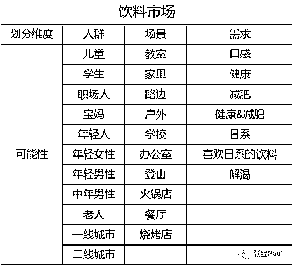

你看在这样一个，竞争激烈的饮料市场里，元气森林硬是从中找到了一个更加细分的市场，立足于这个更细分、竞争更小的市场，开始慢慢发力。最终元气森林这个成立不过五年的新品牌，凭借着“0糖0脂0卡”的健康概念和符合Z世代调性的运营策略，5年估值达到150亿美元，在这些巨头的包围中撕开了一条裂缝。

同样的，我们熟知的拼多多，在电商如此激烈的今天，拼多多瞄准了：五六十岁、不会使用淘宝、京东这类独立电商平台的APP去购物，但他们仍然有着购买需求的人，然后一个基于微信这个使用场景来进行购物的，拼多多小程序应运而生。就是拼多多瞄准了这波“新人群、新使用场景”，撕开了一道口子，进入一个竞争小，甚至几乎全新的市场，并快速做到了上市。

找到蓝海市场，就相当于把车从乡村土路，开上了高速公路，想不快都难。

# SUMMARY

# 总结一下

一个好的定位，能够极大地提升我们“成事”的概率，赢在起跑线上。

从“意图、自我、环境”三个方面出发，然后进行全局的、综合性地判断这个定位好不好。

1.基于意图来定位

明确你的需求，你要做什么，然后根据你的需求（比如赚钱），去找能够帮助你实现这一点的用户需求。通过解决用户需求，为用户创造价值，进而来满足自己的需求。

我们可以通过从“人群、场景、用途“这三个方面，去不断的细分用户需求，然后做组合排列的方式，在什么场景下，为什么人，解决什么问题，来找到你定位的切入点，然后用”需求是否真实、市场空间是否大、竞争小”这三个标准来协助你确定目标市场。

2.基于自我来定位

确定了目标市场后，我们还需要考虑它是否适合自己。

看看热爱，你是否足够热爱，能够让你一直勇往直前；

看看资源，是否得到了延伸，你做这件事情，有没有过往资源的支持；

看看价值，你做这件事情的机会成本是多少，值不值。

3.基于环境来定位

环境的变化在我们“成事”这件事情上也非常重要，这需要我们学会审时度势。

通过“差异化”策略，让自己在一片红海中，也能找到自己的价值高地，形成独特的点，让你和其他人不同。

通过“找蓝海”策略，让自己避开红海市场，去找一个没有那么卷，未被满足的竞争小的蓝海市场。

最后，祝愿你能够精准找到自己的定位，开启自己的事业。

*   - The End -