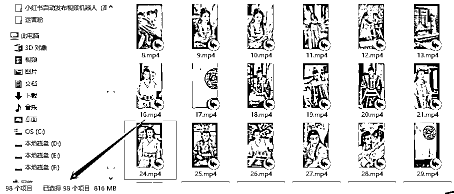

# 神器！自动批量下载抖音合集的100个视频，YYDS

> 来源：[https://aqoyanyhfa.feishu.cn/docx/OD4OdkH0Ao1T7sxsaN7cEXyunhb](https://aqoyanyhfa.feishu.cn/docx/OD4OdkH0Ao1T7sxsaN7cEXyunhb)

一个朋友做搬运视频短剧，需要下载别人的短剧合集，但是一个一个的复制链接，再去下载去水印的视频，非常耗时而且麻烦，容易出错。

所以目标很简单，就是将抖音某个合集里面的去水印的视频全部下载下来。

于是，我就通过RPA机器人半个小时实现出来了，你需要输入合集中的第一个视频，然后机器人就会自动下载之后的所有视频，并且还是去水印的哦。

# 操作步骤：

## 1、先安装和导入机器人（文件）

下面的这个json文件是咱们下载合集的机器人源码，直接保存即可。再按照上面的方法导入

https://download.rpastores.com/rpa/excel/%E4%B8%8B%E8%BD%BD%E6%8A%96%E9%9F%B3%E5%90%88%E9%9B%86-823.automa.json

上面的json文件有更新，请下载下面这个json文件（由于抖音官网在不断更新元素，所以会存在机器人无法使用的情况，可以及时找我（v:dahuzirpa）免费领取最新版本）

## 2、谷歌浏览器打开某个合集的地址

如：https://www.douyin.com/video/7247524784454667577

## 3、启动机器人

需要在第二个步骤中已打开的页面中执行

机器人就会自动每隔几秒中下载一个视频，下载在浏览器的默认下载目录

演示视频见：点击这里