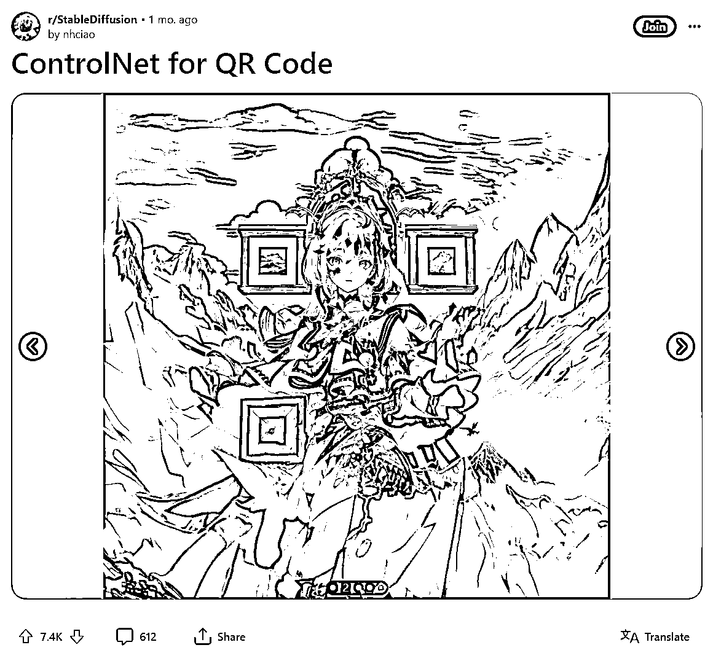

# 【技术向】一文讲透如何用SD制作出来高质量艺术二维码

> 来源：[https://hdjmn9shgs.feishu.cn/docx/OUYOdKSwzoHS8pxpeRNcRcdqnHh](https://hdjmn9shgs.feishu.cn/docx/OUYOdKSwzoHS8pxpeRNcRcdqnHh)

大家好，我是明月。

很久没有在生财写文章了，主要有两个原因。

一个是本着写文章就要提供最有价值的信息，另一方面是最近真的是太忙了，因为工作原因到处跑。

那么今天就分享一个我研究了大半个月的一个小玩意。

艺术二维码

关于艺术二维码最近有多火我也就不多说了，给大家放一些图看一下。

说实话，这个技术很难么？

并不是很难，但如果艺术二维码只能做到市面上这种程度，那我就不想分享了。

首先是艺术性不够强，说白了就是不好看。

其次是难度不高，稍微研究一下就能模仿做出来，基本上是没有门槛的。

先展示一下我自己制作的一些研究成果。

这些二维码都是可以使用微信直接识别出来的，而且是通过SD文生图直接生成的。

做到这种程度，才勉强让我觉得艺术性和实用性达到了一定的平衡，所以才敢把这个小玩意分享出来。

先说明，这个文章不太适合没有接触过SD的新手小白，学习起来难度比较大。

而且我也不想从怎么安装SD来教了，市面上太多教程了，动手搜一搜就能找得到。

本篇文章，主要会从五个方面来简单的把艺术二维码的前世今生都讲一遍。

废话不多说，正文往下看。

# 艺术二维码起源

如果不说的话，不知道多少人能看出来这是一张二维码。

这个二维码和猫头鹰融合的很巧妙，这涉及到一个非常小众的技术，二维码的隐写术。

简单的说就是把二维码巧妙的和图像完美融合在一起，不仅能使用还能够不被看出来，很有趣的技术。

这项技术在什么时候出现的不得而知，但是这张猫头鹰的图最早能追溯到2020年。

近一年的时间，AI绘画技术蓬勃发展，一直在研究新技术新玩法的人们把目光投进了隐写二维码这一小众的圈子里面。

没人能想到，原来AI绘画可以和二维码这么巧妙的结合在一起。

自此开启了艺术二维码的新篇章。

# 技术的迭代过程

像上文中提到了新技术之后，各路大神也都开始研究起来了怎么生成所谓的“艺术二维码”。

怎么说呢，大家看效果也都能看的出来，这个效果说不上好。

原因也很简单，人家大佬的技术没开源啊，想要做到像大佬一样的效果，难度可太大了。

与此同时，市面上也开始出现了艺术二维码工具，并且有传言说到是倪豪大佬（AI二维码作者）把QR模型给卖了，诸如此类的信息。

但是工具做出来的效果，也是不尽人意。

时间再往后推移，大佬在上月底又放出了新的研究成果。

这个效果，爆杀市面上的任何教程和工具，不得不说，大佬就是大佬。

能把艺术性和二维码融合的这么好，市面上也就独一家了。

但是，话说回来，市面上的大神就没有一点点进展么？

当然有，一些大佬开源了一些好用的QR模型，加上一些参数调整也能够做出相当不错的效果，比如之前我做出来的效果。

# 保姆级复刻教程

以下面图为例，我会一步一步拆解这张图是怎么做出来，每个参数起到的是什么作用。

图是原图，图片信息可以在SD里面看到，所以这次分享真的是毫无保留，价值值多少相信大家心里也有数。

## 二维码参数

遇到图片二维码可以用草料二维码进行解析，得出来二维码链接之后可以进行下一步操作。

按理说，链接越短，出来的二维码像素点就越少，也就更好识别，容错率更低。

这一步可以优化使用短连接，效果会更好，但是不优化也可以，我用的是最复杂的方法，容错率最高。

用我的方法做出来的二维码能识别，理论上，绝大多数链接都可以使用。

二维码参数先不要研究有什么作用，按照我给的参数调整即可。

反色开启不开启都可以，看自己想要什么风格，想要明亮一点的画面就不启用反色，反之，想要暗一点的画面就开启反色。

这个翻译有点问题，翻译过来是倒置。

不同参数的二维码出来的图形也有一定差异，如下图（来自安东尼大佬）

## 二维码样式

不同的二维码样式出来的效果也不同，如上图（来自安东尼大佬）

## 正面提示词：

1girl, solo ,(flower:1.3) , long skirt, dark background, long white hair , angel, backlighting, Dark background, <lora:>,</lora:>

正面提示词这块可以加上，Ribbons, feathers, birds, flowers, lace, snowflakes, waves, leaves, architecture,hair等提示词，可以让二维码融合的更好，更具有美感，一次性加上其中一种元素即可。

百花酿的lora作用也是让画面中增加更多花朵元素，同理，如果有其他元素的lora也可以添加进去。

## 负面提示词：

nsfw, paintings, sketches, (worst quality:2), (low quality:2), (normal quality:2), lowres, nsfw,(worst quality:1.4), (low quality:1.4), (normal quality:1.4), ng deepnegative _v175t,text,logo,watermark,signature, bad_prompt_version2-neg, badhandv4, By bad artist -neg, verybadimagenegative_v1.3,

负面提示词是通用负面提示词，没什么好讲的。

唯一要提的是里面用到了很多Embedding嵌入型模型，bad_prompt_version2-neg, badhandv4, By bad artist -neg, verybadimagenegative_v1.3,这些全部都是，如果你没有下载这些模型，单单使用这些提示词是不起作用的。

## 尺寸

Size: 880x880

尺寸不建议超过1024*1024，因为会额外出现很多额外的，令人意想不到的内容。

尺寸也不建议使用512*512，因为大多模型用这个尺寸出来的图像细节方面都不尽人意。

768*768倒是个不错的选择，后期可以通过高清修复进行放大。

## 模型

Model hash: cbfba64e66, Model: 动漫插画小清新CounterfeitV30_v30,

模型这块可以多尝试一下不同类型的模型，个人测试下来，动漫模型都有较不错的效果。

## 控制器1

ControlNet 1: "preprocessor: tile_resample, model: control_v11f1e_sd15_tile [a371b31b]

第一个模型使用的是tile模型，目的是在画面生成的过程中控制生成的前一部分，以免让算法随意发挥。

简单的做个比喻，如果你想要一棵树木按照自己的想法生长就要在不同的成长阶段进行修剪。

现在我们的目的也是一样的，我想让生成出来的图像按照我们预想的方向发展，那我们就要对其进行控制。

tile模型的作用很多，可以在图像放大的过程中增加一定的细节，也可以很好的控制图像的形状。

在这里也可以使用Brightness模型进行控制，但是我使用下来感觉tile效果更好一些。

## 控制器1权重

weight: 0.4

tile模型在生图过程中起到的作用太过明显，需要把权重降低，避免对画面起到太过明显的作用。

## 控制器1起始时间

starting/ending: (0, 0.25)

这个就对应了小树苗的不同生长阶段，也就是生图的前1/4阶段，这块至关重要。

不一定要从生图开始阶段就介入控制，可以自行把控。

开始时间0-0.1都可以，结束时间0.2-0.3都可以。

这个控制范围尽量控制在0-0.3之间。

需要给到另一个控制器一定的发挥空间。

## 控制器2

ControlNet 0: "preprocessor: inpaint_global_harmonious, model: control_v1p_sd15_qrcode_monster [a6e58995]

另一个模型就相当重要了，生图的大多数时间都要用这个模型进行控制。

qrcode_monster模型可以让二维码发生更加自然的变化。

## 控制器2权重

weight: 1.6

与tile模型不同，使用qrcode_monster模型需要更加高的权重才能发挥出更好的效果。如下图qrcode_monster模型在不同权重下的效果展示（来自赛博迪克朗）

权重越低，图片中的二维码越难扫描出来，权重越高，图片中的二维码越容易扫描出来。

同样的，低权重下的图片美感更强，高权重下美感更弱。

## 控制器2起始时间

starting/ending: (0.25, 1)

前部分已经用其他模型进行控制了，那么后半部分就需要用qrcode_monster模型进行控制了。

如果想让算法有自由发挥的空间。

介入时间可以控制在0.25-0.4之间，超过0.4的话二维码扫描难度会增大。

结束时间可以控制在0.8-1之间，可以提早结束控制让AI算法有一定的自由发挥空间。

## 高清修复

Hires upscale: 2, Hires upscaler: R-ESRGAN 4x+

如果按照上述的参数和方法成功做出来了可以扫描的二维码。

但是想要放大图像，可以启用高清修复，放大倍数默认*2，放大算法使用R-ESRGAN 4x+，重绘幅度调整到0.4，这里千万不能调的太高。

# 用到的模型和工具

安东尼大佬的二维码工具包

控制光照的controlnet模型

https://huggingface.co/ioclab/ioc-controlnet/tree/main/models

控制二维码亮度的controlnet模型

https://huggingface.co/monster-labs/control_v1p_sd15_qrcode_monster

小清新动漫画风底模

https://civitai.com/models/4468/counterfeit-v30

百花酿lora

https://civitai.com/models/88207

# 结语

本篇文章自认为讲的还算清楚，把艺术二维码的制作方法还有要点都列了出来。

应该只要照着做都能做出来，先照着做，然后在想为什么，有什么用。

刚开始做出来的二维码可能用不了，别灰心，多尝试几次。

我也是这么过来的，做了几百个都用不了，到现在，十个里面有一半以上可以直接扫出来。

甚至还有更有趣的玩法可以进行拓展，比如和logo相结合？

（其实已经研究出来了，还挺有意思的。）

如有疑问，可以私信我。

太小白的问题就不要问了，社群里面有很多高价值的内容，可以自己去动手搜一搜查一查。

最后希望大家都能做出来自己心仪的艺术二维码。

我是明月,未来两年都会all in AI绘画，有志同道合的的小伙伴多链接一下。