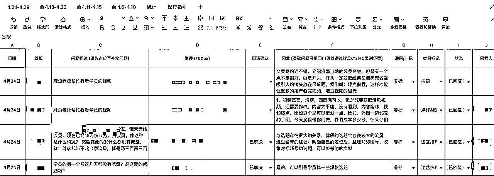
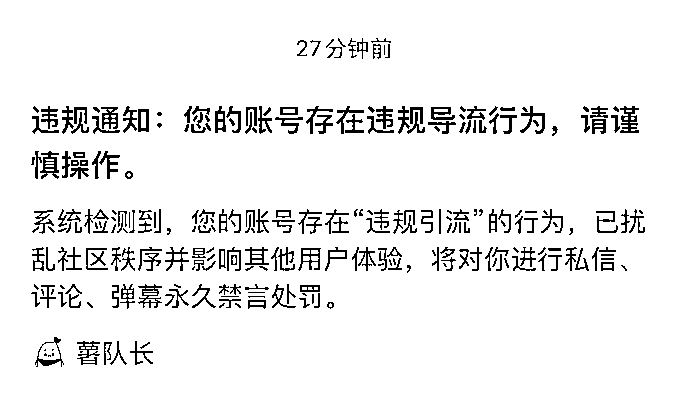
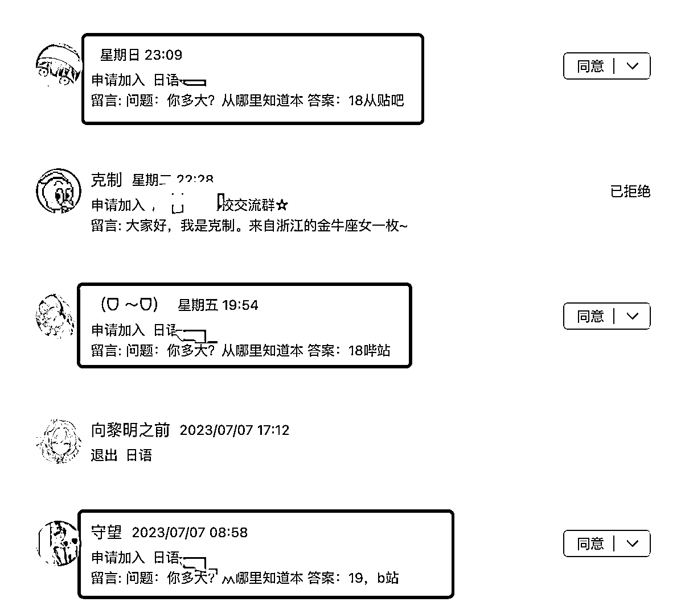
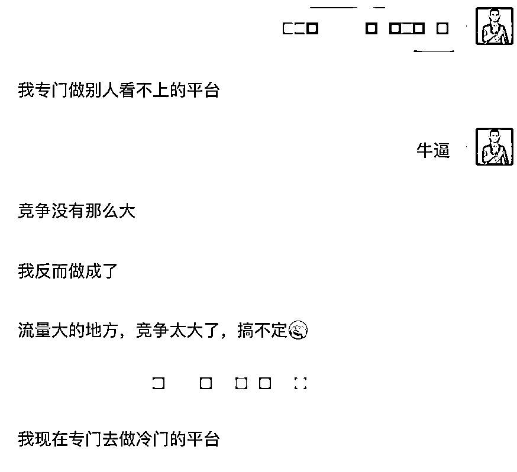
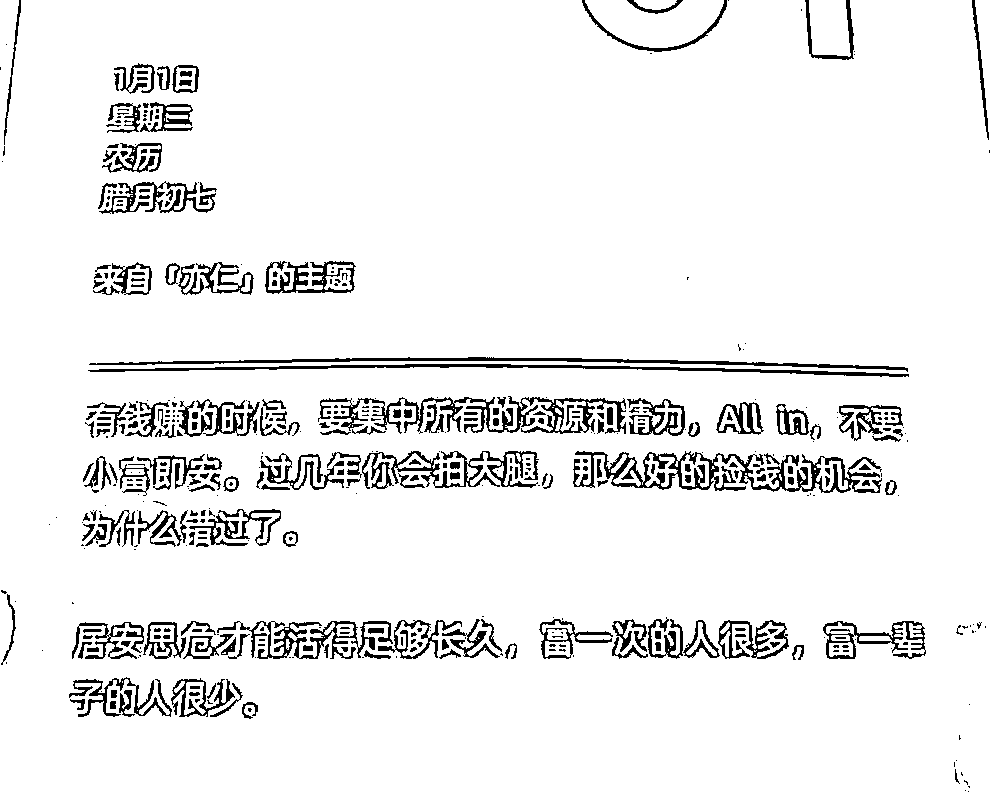
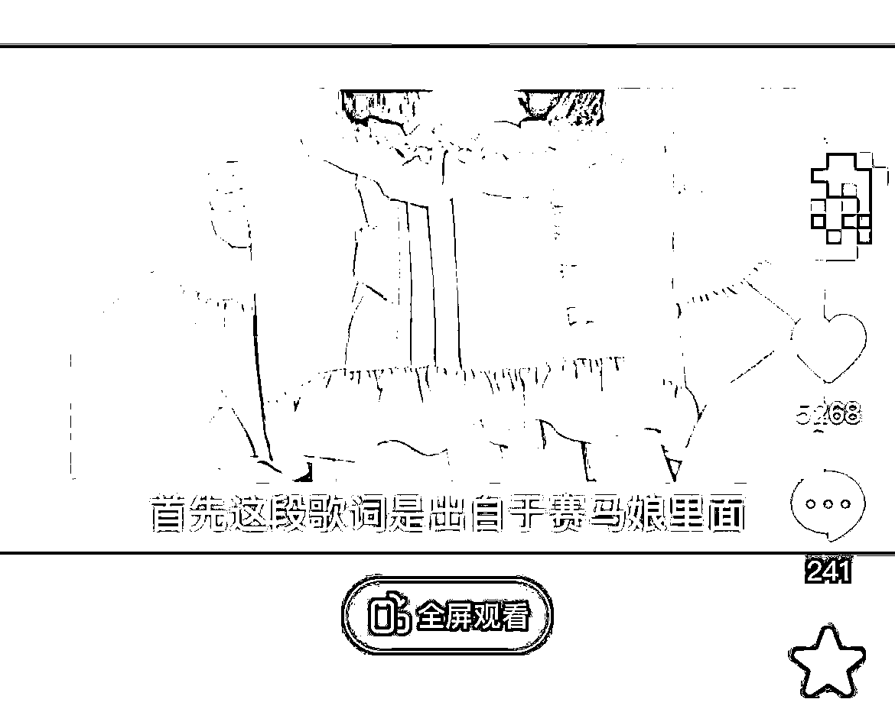

# 90%小微企业适用的"免费流量"方法论

> 来源：[https://bmy4tfqyf1.feishu.cn/docx/Oob7dRzcloUsVqxQ64Fc4mIunye](https://bmy4tfqyf1.feishu.cn/docx/Oob7dRzcloUsVqxQ64Fc4mIunye)

你好，我是郑韩，在职业教育这个领域摸爬滚打5年，流量增长、销售转化、后端交付都做过。

我的主要业务是针对商家做获客培训，在跟很多商家老板聊得过程，发现他们对线上引流有种恐惧感，总觉得很难，很深奥，自然流量做不起来，想投放又没那么多预算。

于是我把我过往做流量的经历做了个复盘，把我对免流（自然流量）和投流（付费流量）的认知及实操经验分享给大家，希望能帮大家破掉流量之障。

* * *

# 一、成也投放，败也投放

直接讲结论，可能大家会觉得，也就那回事，但如果带到故事里，也许大家的感触会更深一点。

我先分享一个线上培训公司，从20年发展到23年的波澜起伏的故事。

疫情刚开始那会，逆着疫情的大势，我们成立了一家线上成人职业教育培训机构，我负责免流团队（免费流量团队：通过自媒体发布文本/图文/视频的方式获客）。

那一段期间，我测试过抖音、小红书、B站，贴吧、豆瓣各种渠道的流量，最终发现小红书的流量最精准，数量也是最多的，但当时每个月不到10万的流水，支撑不起一家公司的业务。

用免流的方式做一年，需要5个运营，月均3万的人工成本，一年要36万，不知道做多久才能回本。但用这36万去投流，马上就能拿到很多销售线索，在当时的情境里，投流的确定性比免流高的多。

公司的大部分高层，都有过做付费流量的背景，要么是投手，要么是销售，刚好当时遇上了b站投放的红利，流量成本低，roi也不错，还能放量，跑通了业务模型，于是迅速的扩团队，换场地。

借着B站投放的红利，公司很快就从十几人扩大到几十人，再到几百人，没多久，流水就破百万，破千万了。

当时高管们都来自大厂，都有着把组织做大的心态，例如能带来以下这些收益：

1、更稳定的产出：

*   规模对冲概率低的问题：例如小红书的爆款有一定的概率，但只要运营的账号足够多，发布的内容数量足够大，通过高频的数量对冲低概率，偶然的爆款就成为了必然的结果，以此做到每天的引流数趋近于稳定的水平。

*   降低引流成本：通过更高频的测试，更优质的创意，测试出转化率好，成本相对低，且能放量的计划。

2、更低的成本：

*   降低后端服务成本：通过标准化的服务流程，可以提高交付端的服务能力，提升交付效率。

*   降低固定运营成本：当GMV提升到一定规模时，场地费、员工底薪等固定运营成本占比会越来越小。例如原本做10万业绩，需要支出2万的成本，但如果做100万，支出的是5万，占比就减少了。

3、更强的竞争优势：

*   获得更高的投放返点：在供应商处能拿到更高的返点，相当于降低单个获客成本。

*   吸引更优秀的人才：规模大的组织，有资金有意愿有能力吸引到更优秀的人才，让组织获得更快更多的迭代。

*   拥有更强的抗风险的能力：大公司财务更稳定，可以更好地应对各种风险，不用担心业务因为突发事件而中断。

画外音：理想是美好的，但实际上规模和成本不是线性的关系，正常情况下是一个U型的曲线，当规模到一定层次的时候，成本反而会增高。

例如10个销售只需要1个主管，但100个销售就需要10个主管，3个经理，1个总监，规模的增加带来了更多的层级，更多的沟通成本，效率降低导致成本的增加。

由此公司开启了多地域，多科目，多渠道的战略部署，迅速在成都、长沙、江西等地开办分公司，除了原有的科目之外，又引进了更多的科目，通过投放的方式，做到了单月几千万的流水规模。

只可惜，高歌猛进的日子并不能持续下去。因为单一渠道单科目，获客成本上涨是必然现象。

14年，学历提升在百度竞价的成本是几块钱，现在要几百元。

20年，日语培训在b站信息流的成本是十几元，现在要上百元。

每个渠道，同一个科目的获客成本都在涨，因为你在跟同行竞争、跟其他领域的对手竞争，甚至于跟自己竞争。比方说某学历头部机构，不同事业部都在同一个平台抢量，成本都是被自己人竞争上去的。

我们做日语科目的成功得益于投流的模式，同期还有另一家机构，坚定的走免流的路线，三年来坚持在抖音、B站等平台，分享日语相关的内容，巅峰时期也能做到月七八百万的流水规模，要知道大多数情况，免流业绩的利润可比投放高多了。

有人说：如果当时花多点时间去把免流做好，估计今天就不会因为投放成本的问题而伤脑筋了。

但因为投放成功而导致的路径依赖，哪怕回到当时的境遇里，估计做的还是同样的选择，因为免流的盈利周期长，而忽视了它的价值。

“你以为你有很多路可以选择，但是在你四周有很多看不见的墙，其实你只有一条路可以走。”写到这里，我脑海里浮现的是这句话。

从现在回头看，公司并没有反脆弱的能力，反而会因为系统性的风险造成巨大的损失，例如学生贷政策的紧缩导致业务量骤减，分期的账期拉长导致现金流的紧张等等。但愿公司能走出新模式，而不是成为温水里的青蛙。

内容流量是值得小微企业重视的流量，如果有机会，还是要多尝试一下。

* * *

# 二、高增长差交付的大败局

丨 当你凝视深渊时，深渊也在凝视你

22年，我来到了一家发展迅猛的职业教育公司，担任短视频科目的教研负责人，负责学员的课研和交付。在这里，我更深刻的体会到高增长差交付对于公司和行业的破坏。

（公司会衰退，必然是多种原因导致的，以下仅从流量和交付的维度分析）

当时公司和业内的诸多大V都有合作，在抖音里以大v名义疯狂投信息流卖1元-9.9元的小课，到后期大v开播期间，dou+助推短视频和千川直投直播间的方式同时进行，roi好看的不得了。

购买了小课的学员，会进入到两三天的公开课里，被成交几千元的短视频培训课，而这笔学费大多数学员贷款来的，迫切的回本焦虑，这样的人做自媒体，成绩可想而知。

前端招生很猛，后端交付却一塌糊涂，退费甚至能超过30%以上，我从没有见过这么惨淡的数据（捂脸）。

公司合作的其中一位大v，他自己的服务模式就特别好，招聘并筛选出有能力服务好学员的助教，并且服务出案例的时候，例如学员涨粉变现时，会给予现金奖励，如果学员退费或要求换助教会扣奖金，所以助教的战斗力和战斗意识非常强。

但公司没法复制这样的操作，当时在广州北京两地，同时招聘了200多个完全不懂抖音运营的班主任，通过标准化的服务流程去为学员们交付答疑，由于学生数量特别多，有些班班手里起码有300多的需要同时服务的学员，抖音培训这种大量非标问题，小白怎么可能服务得好。

我的解决办法之一是，在班主任上面再加一层助教，助教大多数是有过抖音实操经验的运营，再加上短期的培训后，能回复大部分的非标问题，建表开始统计数据后，我们累计回复了3000多个非标问题，沉淀了300多个常见的问答。

前端招生销售为了提升转化会夸大口径，而后端为了降低退费，会不断的降预期，多次电话挽回，甚至于我们大多数先导课就是为了降低退费的目标服务的。

各种组合拳打下去，退费终于降了一些，但口碑依旧不好，如果打开黑猫投诉，还可以看到一万多条差评挂在那里。

哪怕是做到生财那么高的交付水准，仍然有人不满意，况且我们大部分学生还是来自N线城市、上了年纪的学员，甚至于「手机镜头如何用双指捏住放大」还需要我们来教学。

算是有舍有得吧，这种严峻的教学环境，让我看过大量的行业和账号，一个运营过一段时间的账号，稍微瞄一眼就能大概知道变现如何，有哪里需要调整的，同时让我对于中老年的学员培训有了一定的经验，顺利地让我母亲也能在小红书平台找到价值感。详见这篇👉🏻

从获客模式上看，通过信息流不断烧钱买量，获客成本注定持续上升。

高速增长而忽视交付必然被流量反噬，信息流投放的都是「抖音赚钱多简单」的素材，吸引一批认知低，且对ip没有天然信任的人，通过后续引导到私域里由销售1v1成交，以及3天IP出镜的公开课转化。

前期大量展示他人成功案例及不断降低用户对抖音变现难度的感知，这样进来的用户，抱着容易赚钱的心态，结果因为交付差，没出结果最终放弃学习，或者开始投诉。

通过公开课加销售一对一促单的模式，在交付极差的背景下，转化率会随着越来越差的口碑不断降低，进而导致转化成本高，公司利润进一步下降，缩减交付质量转到投放中，由此恶性循环开始了。

所以当我自己做培训的时候，我更在意的是学员能否成功，能否成才，在帮助学员解决获客难题的时候，精进我的业务水平，帮助他们拿到结果，成为我最好的招生物料。成功案例→更多学员→更多成功案例，这才是一个良性的增长飞轮。

快速增长是好的，但绝不能以牺牲交付质量为代价，只有那些能够提供优质产品和服务的公司，才能真正在竞争中脱颖而出，赢得用户的心。

* * *

# 三、如何做好“免费流量”？

讲了那么久，我们好像没有明确定义什么是免流和投流，我按照我的认知做了个区分。

付费流量（品效合一类型的信息流/表单类）

优势：可以迅速验证业务模型，通过投放提升收益

劣势：消耗得不到积累，产生不了复利

免费流量（通过发布内容获得平台推荐流量）

优势：长期的投入，让内容积累成资产，获得更长线的收益。

劣势：投入周期较长，前期正反馈相对较少，但对于小微企业，其实算是特别好的获客方式。

## 3.1 免费的是最贵的

在我看来，免流就是用内容换流量，而内容是需要花时间产出的，换句话说，免费流量也是很贵的。这句话看着简单，但花了我很长的时间，才明白了这个道理。

最开始我的思维被「免费流量」一词框住，总觉得花的钱越少越好。但实际上，公司要的不只是要流量的成本低，而是要更多的流水，更多的利润。

例如我们现在做小红书精准引流，如果还是用个人号去引流，确实看上去成本低，但由于举报、死号等问题，综合下来流量成本并不低。

（新鲜出炉的警告，建议有条件还是要上聚光）

而如果你开了小红书的专业号，在聚光平台开始投放，你这个账号就很稳，在一段时间内，怎么私信都没事。（政策变化快，该打法有时效性，但目前还是可行的）综合下来，你的流量会更多，而且成本也不一定比纯免流的高。

免流：通过发布人设文、产品文、客户见证文等类型的笔记，获得系统推荐的流量，再通过各种方式转化成私域客户触达成交。

投放：通过聚光平台，对爆量的笔记进行加热，甚至能做到0.01分的点击和1块钱的用户私信成本，而被加热的笔记会随着时间的推移，获得更多的点赞，更多的自然流量以及更高的搜索排名，最终沉淀内容资产，产生长期持续的引流价值。

为了帮大家更好的理解内容资产这个概念，我举个例子。

我在20年做日语培训，当时小红书，贴吧，豆瓣，b站各种平台发了很多帖子，21年后再也没有发了，但时至今日仍然有人加到我的qq群里。

如果坚持做到今天，1000多个日夜，起码发10000多个帖子，哪怕现在啥都不做，每天保底20个流量肯定是有的。按客单价4000元，转化率1%，一年也能做30万的业绩，这不就是躺赚嘛~

所以，如果你开始做免流，千万要舍弃「免费流量就是一分钱不花」这样非黑即白的想法，花点钱让自己的内容更快跑起来，跑的更好，这才是上策。

## 3.2 流量渠道多元化

“免费流量”是可以坚持长期去做的，因为用户的需求不会消失，只会转移。我们要做的是让用户不管去到哪里，始终在我们的内容池里转。

例如当一个用户有想学日语的需求时，以前他会在百度里搜索，会在知乎里搜索，现在会在抖音和小红书里搜索。

我们要做多平台：在知乎里，以问答和文章的方式去输出「日语怎么学」、「学日语有什么用」等内容，将同样的内容转换成视频号，在小红书和抖音里发布。

我们要做多矩阵：在同一个平台里，我们可以用不同人设的账号去发布内容，例如我们有学姐号，分享自己是怎么样学日语的，有老师号，分享日语学习的各种干货，有资料号，以送资料的方式吸引用户找到我们。

当我们做到多平台多账号高频的更新时，我们会发现我们每天的流量能做到趋于稳定的水平，因为今天可能是抖音的A账号出爆款，明天可能是小红书的B账号出爆款。

同时，每个平台的操作流程都要尽可能的标准化，沉淀出sop。例如我们当时在做阿甘老师账号的时候，我们就把选什么样的抖音选题，用什么样的标准去评估都定下来，爆款是一个接一个的出现。

还有一个点很容易被大家忽略，很多渠道至今仍旧能做出很多的流量，例如百度贴吧，在今天仍旧有很多人在使用，只是因为我们的眼光都放在有流量红利的那些平台，所以这些老平台都容易被我们略过。

像我这个朋友，他在各种冷门的平台，注册了百八十个账号去铺帖子，每天都有稳定数量的人加到他。

不管是大平台还是小平台，只要我们发现能做，成本hold得住，收益看得过去，那就拼命搞吧。

## 3.3 从简单的事情做起

xxx平台怎么做？我18年的时候开始做抖音，20年的时候做小红书，我发现用的思路都是一模一样的。

①先注册账号

②看看平台里同行发什么样的内容，哪些内容是能带来用户咨询的

③接着按照对方的方式先做几条内容发出来

④出现了具体问题就具体分析，限流就换内容，封号就换号，没有什么大不了（不要轻易实名认证就好）

真不需要花太多在学习怎么做上，开干了就会有答案。

再分享一个我觉得很重要的心法：把大问题拆分成小问题

20年我当时在做日语时，发现了一个很不错的模式，找一个可爱的姑娘做真人出镜，然后用日语分享各种内容，时至今日，这种视频依然能获得很不错的表现，图中正是最近这种模式的爆款视频。

可爱+萝莉风+懂日语+声音好听+女生，如果要求太多，这种人才约等于找不到。

于是我就做了拆分，我只需要找2个人，一个是可爱萝莉姑娘负责出镜，一个是声音好听的懂日语的姑娘，这样难度就低很多了。

当我们想去做内容的时候，可以尝试拆分下元素，然后看看能不能降低要求找到平替。

如果想看更多的细节干货，可以看看这篇文章👉🏻《日语线上培训，如何从小红书日引流100学员加微信》

# 想赚钱，做好这3件正确的事

1、聚焦于一个领域深耕。

2、在能拿到流量的时候，拼命复制。

3、在私域做好精细化的运营。

难事不一定正确，正确的事不一定困难，正确的方向给你了，至于具体怎么做，很多精华贴里都写了，多看精华帖，多实干吧。

加油吧，一起进窄门，走远路，见微光。

* * *

郑韩交流微信：zh474560985