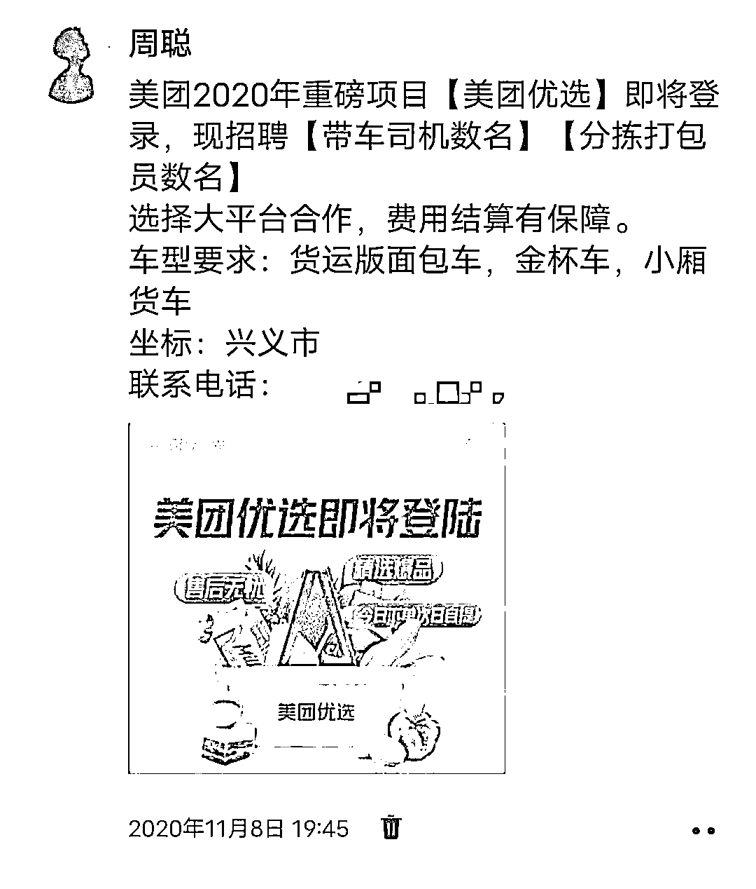
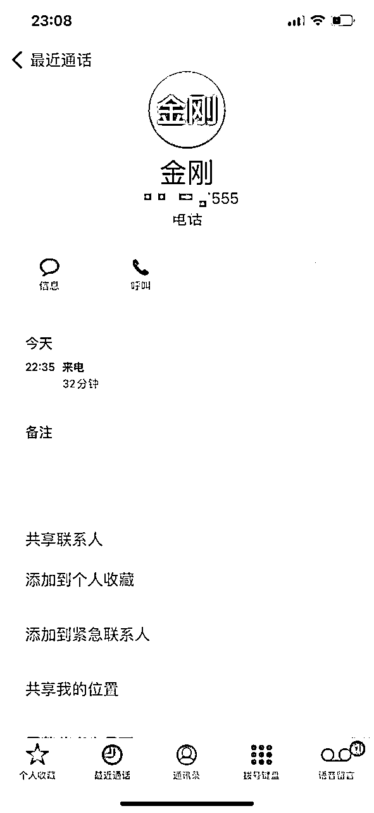
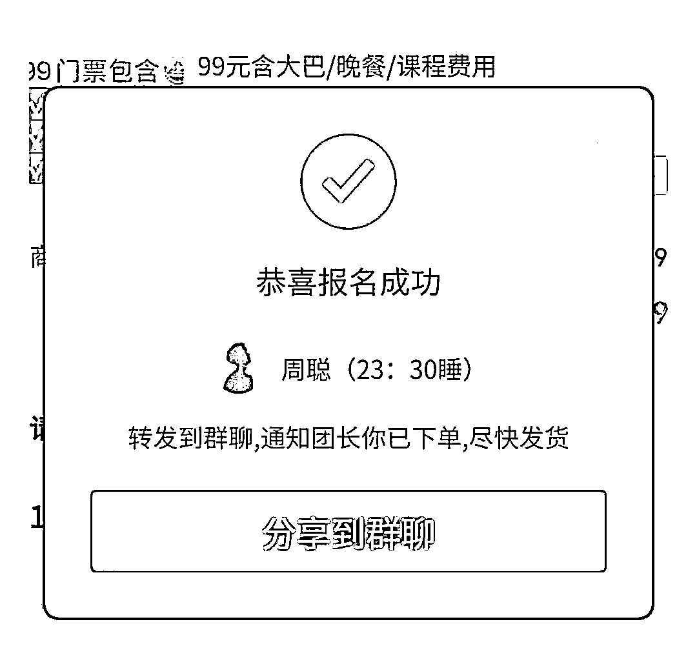
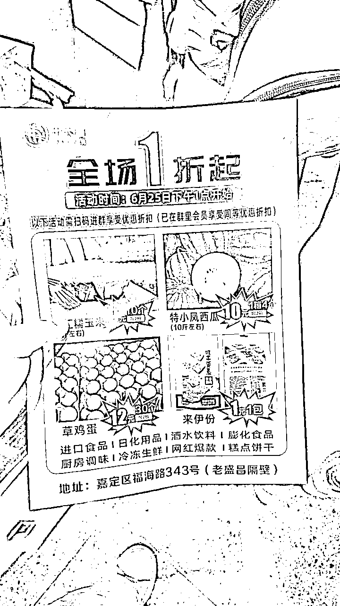
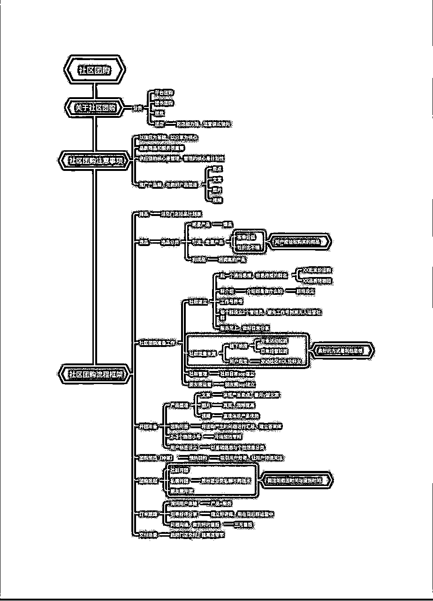

# 聊聊社区团购3.0——团店

> 来源：[https://q6rpgbg9y1.feishu.cn/docx/PfgWdw4eEoVfgUxWUbMcbN33nxm](https://q6rpgbg9y1.feishu.cn/docx/PfgWdw4eEoVfgUxWUbMcbN33nxm)

# 一、团店的发展和现状

## 1）缘起

20年11月份，我还在美团时，就听说美团即将开辟一条新业务：美团优选。

于是我们就根据内部的关系，对接了当地的渠道，准备做这个优选的代理，还带了一堆人到贵阳培训了一整天。（后来因为一些特殊原因没做了）。

也正因为如此，我开始对社区团购持续关注。美团优选，多多买菜，兴盛优选，橙心优选都一直有在了解。因为持续关注，我也发现这个赛道其实对于我们创业者来说并不是特别适合。

一是因为资本介入，这就是个烧钱的玩意；

二是我们在这个领域能参与的点就是代理配送渠道，这个在一开始很看好，觉得肯定每天爆单，后来事实证明，爆单只是短期，配送不过来，如果增加配送成本，长期单量又支撑不足...所以据我目前了解，现在还在做的之前的同行大多都是亏本的；

三其实就是拉新，这个不用多说，很多圈友做过，快钱项目；

四就是成为团长，也就是便利店的老板，在店里弄个提货点，赚佣金。

除了拉新，其实我们能参与的环节几乎没有，在大火一段时间后，因为政策的调整，很多小的平台消亡。

正是因为之前有关注社区团购业务的原因，于是最近在社区团购突然有新动向时，我才了解到，这个模式好像又升级了。

在出于好奇的情况下，我与合伙人采访了果丰嘉创始人、南派团店创始人金刚，对团店这个新物种有了些更深的了解。

## 2）游学见闻

了解到他们即将在6.25号在上海开南派团店第一届游学会，刚好我最近也在上海，于是就报了名准备去一探究竟。

25号下午一点，来到会场，人齐后他们就安排坐上大巴去参观位于嘉定区的门店【十六圃】。

据了解，来参会的人全国各地都有，三个大巴没座满，差不多一百来号人。

一开始，我也没觉得有什么不一样，但是一到店，我还是被现场的人流震撼到了。

老远看去，清一色大爷大妈就排起了长长的队，一个十来平方的小店门庭若市，人头攒动。口罩这几年，已经很久没有看到实体有这种状况了。后来因为人实在太多，严重影响到交通，城管和工商就来撵人了......

根据之前的经验，我清楚能让大爷大妈趋之若鹜的东西一定是要足够便宜的，那么到底多便宜呢，我拿了一张他们的宣传海报看了下价格：

从宣传单上能看出，他们的产品都是刚需品，用户知道这些产品平常卖多少钱，有个大概的心理价位；这些产品又都是低价的产品，实际上再便宜也就是少几块钱，但是给大爷大妈的感觉就非常划算；再者就是，价格确实低，他们的供应链有一定优势。后来金刚自己说，别看今天引流的产品价格低，但是综合下来其实是保本的（未验证）。

然后我们又到店里看了一下陈列和装修，咋一看，这不就是好特卖吗？感觉区别不大呀，他们说看着是挺像，但还是有很大区别（后面会分析）。这个店里有大约800个SKU，主要品类是零食和酒水，再就是，店里有两个冰箱，据金刚说，别看这不起眼的冰箱，每月的冻冰销售占比能占到总销售额的30%，而冻品的利润率更高。

更重要的是，他们是线下线上双货盘，线上每天还在团水果和蔬菜。

再看看装修，据十六铺创始人大刘介绍，他们调研过30组数据，最后决定用简洁的灯光加暖色调组合，让用户最舒服，最容易促进下单。

我简单看了下门口的促销品，黑米面包2元/个；方便面1元/包；挂面5元/把，我感觉确实很便宜。

## 3）什么是团店

会上，开曼4000CEO郭德仓说，团店的发展其实才初具雏形，具体定义还要在座的各位来讨论。

就目前我对团店的了解来看，我认为团店的定义大概是：线下获客线上精细化运营的团购模式。特征是同时开展线上社区团购业务和线下实物销售。

## 4）团店的演化历程和现状

从时间上来看：社区团购自2016年诞生，经历了三次大的迭代，2016-2020年的社区团购1.0——“地方团购”；2021年的社区团购2.0——“团批”；2022年的社区团购3.0——“团店”。

其中21-21年正是前文所说的各大资本团下场烧钱的时期，对于整个团购市场来说，资本的下场教育了市场，培养了一大批成熟的团长和用户的消费习惯；并且三级仓的配送跑通闭环，开辟了用户自提的模式。

从品牌来看：小许到家，2018年11月在石家庄成立，基于“实体店+私域流量池”的经营逻辑打造团店，由团店小私域构成平台大私域，通过一致行动，全国一盘棋，可以集中力量进行助农纾困，亦或是全国推品。

目前，小许到家在全国有近400家店，上海目前有20家店，湖北区域有86家店，每天基本保持3-5家的开店速度。

门店面积在20-60平米不等，平均月团效10-15万，门店SKU平均50-100个，品类以日常刚需品为主，比如米面油，调味冻品，休闲零食以及应季产品，其中休食占比约1/3，生鲜品类全部线上开团，小许到家所有单品毛利不高于20%，平台预留3%-5%作为经营费用。

果丰嘉，2021年12月在南京成立，定位“水果店+私域团购”，对标“团店版百果园”，是首个将互联网运营和实体零售经营全面结合的创新型团店，目前拥有门店20多家，分为城区店和县域店两个店型，并基于“大城小店和小城大店”的开店逻辑持续拓店。

果丰嘉门店分别在一线城市和四五线城市，城区店一般20平米左右，县域店一般100平米左右，两种店型数量各占一半，单店月团效方面，城区店15万左右，县域店二十几万，线上线下销售额占比方面，城区店是6:4，县域店是4:6或3:7。

美邻淘，2022年5月在郑州成立，定位“团购+超市/团购+驿站”，对标“团店版兴盛优选”，做赋能型团店平台，目前拥有50多家团店，集中在郑州。

单店月团效方面，由于店群人数规模不同，差异较大，1000人规模店群，月团效在3-5万，2000人规模店群，月团效在10万以上。SKU结构方面，“25%产地直采果蔬+25%市场应季生鲜+25%食材+25%全国各地热销单品”。

小许到家代表的加盟型团店，果丰嘉代表的直营型团店以及美邻淘代表的赋能型团店，基本代表了目前国内团店的主要流派。（此段节选自开曼4000公众号）

从派系来看：北派重视供应链，南派重视深度运营。在深度运营方面，他们主要关注三个细节：一是关注每天的拉新数量，给每个门店设立了考核标准，并用系统来记录；二是关注连带率，也就是用户来提货时购买其他东西的金额和频率，这是增加门店销售额的一个重要因素；三是专注用户画像，为了更好的选品和排品，最大化促进销售。

## 5）连锁团店

像十六圃这样，一个总部管理多家团店终端，包括统一管理商品、价格、服务标准等。连锁团店分为强管理和弱管理两种类型。类似于连锁便利店的强加盟管理和弱加盟管理。直营和强加盟模式要求门店只能按照总部制定的价格销售总部提供的商品，弱加盟的门店则可以部分自主进货、自主定价。

# 二、团店模式分析

## 团店之于其他模式的区别？

社区团购：社区团购主要是基于美团多多等等线上平台的流量和供应链，线下仅仅是提货点，几乎没有流量运营等动作。社区团购类似电商的线上下单线下自提模式。而团店不仅需要从线下导流，也需要从线上导流，需要经营者有更强的流量获取和营销策划能力；在运营方面团店更注重服务，注重与人的链接，所以运营也更细致化；在交付上，社区团购几乎不管用户提货率，就像拿快递一样，自买自取，而团店则重视提货率，因为提货才算销售，用户来了才付钱，且能提高门店其他产品的连带率。

快团团等：快团团是纯线上团购，也可以说是社区电商，北京的用户可以买义乌发的货，是标准的电商逻辑。团店之于快团团最大的区别是地域，团店不做其他地区用户的生意，只做周围两公里范围内用户的生意。

折扣店：好特卖等折扣店，看似和团店的产品差不多，核心区别在于好特卖等折扣店主打的是临期产品，而团店除了临期食品外，更多的是硬折扣的产品。再就是他们不做线上团购。

本地生活：一开始我也没想到团店能跟本地生活扯上关系，听介绍才知道，目前已经有很多团店开始卖一些本地的电影券，旅游券等产品。原因是，当他们跟【店】建立起了足够的信任后，用户会发出这样的声音，就类似你在小杨哥的直播间喊：”把榴莲价格打下来“一样，用户也会在团店里喊：”把电影院价格打下来“，顺其自然就卖起了其他产品。而本地生活还是以吃喝玩乐为主，团店则是以家居生活用品为主；且本地生活虽然是在线下交付，但是流量还是来自于线上，团店则是来自于门店；再就是，本地生活主打低价爆品，弱化人的信任，现在人们已经习惯了，这些探店博主反正给钱啥都说好；而团店对于品的把控则强太多，因为店在那里，不是”卖一次就走的“。

## 团店之于其他模式的优势？

社区团购：显然，对于纯靠线上平台获取流量和产品的社区电商电商来说，团店的优势在于与用户的黏性更强，对产品的把控更高，同时对运营的要求也更高。

快团团等：相较于社区电商的快递交付，团店的自提带来更高的连带率；团店的自提时付费也较于电商的先付款后到货逻辑拥有更高的成交率。再者，来自于线下的流量拥有天然信任基础转化率会更高。而跟盒马等折扣店的最大区别是，不需要那么大的店，不需要那么好的位置，也能卖那么多的SKU。线上流量永远以价格为核心，今天你便宜买你，明天他便宜买他，用户有更多可选择的地方，对你的黏性也不强。而线下流量以你的门店为信任基础，加上长期的消费习惯为核心，你的价格浮动一点其实并不影响。

本地生活：对于本地生活，我最大的感受是，在用户眼里，探店博主、本地生活服务商是和商家站在一起的，是一起卖东西给我；而团店是跟用户站在一起的，是我去帮你买东西。也就是，团店会有更大的沉没成本，自然也会获得更大的信任。再者，本地生活基于城，团店基于区域，虽更窄，但更细更精准。

# 三、团店模式拆解

## （一）流量

团店的流量同时来自于线下和线上。

### 一）线下流量：

#### 地推拉新

1）宣传

1.  根据当季特色、目标用户画像、供应链等，设计好引流内容。

1.  至少提前5天时间做好筹备

1.  物料准备：1宣传单页，正反两面不同，单页上需要清晰注明店铺位置；2展架，吸引眼球，让用户从远处就能看到；3喇叭，根据当天活动提前录音，放在门店代替人工。

2）邀约

1.  用户到店——排队——工作人员指导用户扫码加群并置顶——购买当日引流爆品——告知用户明日促销产品——完成用户教育（锁客全系列）

#### 日常拉新

1.  设计好拉新话术如：”你好大爷，请问你加入我们XXX会员群了吗？加入群就可以XXX价格购买产品哦。“

1.  培训店员，每天自然到店用户必须加微信拉进群，并做好考核要求。

1.  门店陈列，门店里应摆上日常的引流产品，以零食和家居用品为主，让用户进群立享。

### 二）线上流量

#### 自媒体做创始人IP

抖音为主，在各大平台做本地创始人IP，为店铺代言和导流。

#### 业主群

混进各种业主群，同城群，导流进自己私域。

## （三）运营

团店除了流量逻辑演变为线下为主线上为辅，在运营上也更加精细化。大家都明白，流量只是前端触达，线上运营的好坏决定了后期利润和销量的高低，所以线上运营就尤为重要。

我虽然有本地生活的经验，但没有操作过团购赛道的线上运营，在此就同步一下会上金刚对于团店整体的运营方案和细节。请看思维导图：

我大概解析一下比较重要的部分：

1.  首先，需要明确，团店的目标用户画像一般是25-35岁左右的家庭宝妈。

1.  给予以上画像，团店的品分为几个大方向：厨房、卫生间、卧室、阳台。

1.  销量的大头是团批，团批的核心是季节性/节假日产品，要提前准备供应链。

1.  排品：每天只有2-3个坑位，所以选品一要在当季有鲜明卖点，比如中秋月饼；二要对接好供应商。

1.  同样，选完品后定价时，依然要分为引流+爆款+利润的产品结构。

1.  门店拉新考核标准：半个月内产生消费算新用户激活。检验工具：收银系统。

1.  提前准备百问百答，以防用户提问得不到回答而流失。

1.  大单品要提前半个月吸引注意力。

1.  晚上要做订单汇总，吸引跟单；截团前三小时要私信用户，提高触达。

1.  订单跟踪：流程同步+买家秀+三无售后。

## （四）盈利

可能很多人会有这样的疑问？团店是社区团购的升级版，运营其实都差不多，仅仅是流量转变到了线下获取。

那么通过低价爆品获取这些流量后，怎么盈利呢？

其实不管是什么团购，本质上都是团购的演变。而我之前已经说过，所谓团购团购，核心是团，团就是多的意思，而多自然就量大从优。

对于社区团购这个细分来说，社区团购做的是存量的生意，抢的是传统店铺以及批发商的生意；

再者，社区团购做的是基于区域的生意，因为离得近，所以口碑是关键。而口碑的关键就是产品品质+价格+服务。

基于以上可以看出，团购模式盈利的关键点是：销量+供应链+产品的综合结果。而团店除此之外，还因为门店基于本地，销售基于线上的逻辑。所以能有高坪效+高连带率+更低边际成本+更多产品品类的额外盈利点。

团店模式是旨在先通过低价爆品吸引用户到私域，拉进信任养成消费后，通过私域的精细化运营销售多类综合型产品并以高销量和供应链优势来盈利的模式。

# 四、不同人眼中的团店模式?

席间，我跟一些正在做团店的团队和在场的嘉宾聊了下，了解到他们所理解的团店模式的关键在于：

### 1）某团店团队：

我认为团店模式的核心在于销量和供应链，但主要是销量，你只有具备足够大的销量才能获取更优质的供应链，产生更高利润。其次，一些{非标品}的合理搭配也是利润的主要来源。

社区团购基于线上各类团购平台的区别，我认为最大的是{触达率}不同。团店同时具备线下和微信两个入口，相辅相成，经常看到，自然就能让用户第一时间想得到。

### 2）开曼4000CEO郭德苍：

1.  选品和排品是关键中的关键，需要非常精细化的运营。并且要合理搭配好每日的品。

1.  爆款低价低利润是团购的客观事实，但不要忘了，量大带来的边际成本降低也能提高利润率。

1.  团店其实可垂直化，目前已有案例，比如水果团店，零食团店，生鲜团店。

1.  可迁移销售其他行业产品，本地生活的电影券就是例子。

1.  小许到家的排品是业内非常到位的，同行都应该好好研究下他们的排品。

1.  南派团点更像店，北派团店更像团。

### 3）十六圃联合创始人顾勇：

1.  团店其实没什么特别的，不过上团购到团批再到现在直接开个店的区别。

1.  为什么开店？因为纯线上团购没流量了，开店就是为了获取线下流量。

1.  运营选品排排品和之前线上玩的差不多。

1.  高连带率高周转率是团店的一大优势。

1.  目前上海已有十多家十六圃，正打算继续开店。

1.  硬性成本虽比传统门店低，但人员等成本还是挺高的。

1.  团店本质还是基于位置的生意，一般不超过两公里。

1.  有店解决了一部分信任问题，从而带来更高销售转化率。

# 五、聊聊我的看法

不知为啥，我立马想到的是李佳琦，想到的是小杨哥，是带货主播。

再次说明，我理解的团购，是团，所以量多，低价。核心还是【品】

而团店给我的感觉，一定程度上弱化了【品】，强化了【店】

一开始，你不了解李佳琪的时候，也只是去抢抢低价爆品，抢回来发现虽然便宜但也还不错。慢慢的，你抢得多了，偶尔会看到一些适合自己的价格也合适，于是你就顺手买了些回来。刚开始你还比比直播间的价格，比比产品和其他家的品质，再慢慢的，你在李佳琪直播间待久了，你发现他卖的东西确实好，价格也有优势。于是你习惯了，你也就难得去比价格和品质了，你”默认“了李佳琪不会坑你，为了降低筛选难度，你直接选择跟他买好了。直达有一天他”背叛“你，卖给你不好的东西。

团店，给我的感觉，就像线下的带货主播。好的团店就是线下”李佳琪“。

要注意的是，虽然是线下，但这和探店博主可不一样。

前面说了，探店博主是没有多少沉默成本的。反正，坑了你，也无所谓，又不是你付钱，而是商家付钱。就算我拿不到提成也能拿到商家的钱。实在太差，你顶多会吐槽商家东西不行，很快就把我忘了，我继续下一家。

核心区别，其实带货主播和团店，是直接面对消费者的，且（这是关键）产品好坏，更多的是主播说了算，而不是商家。

你的品”不优“进不了李佳琪直播间，李佳琪不干；但你的品”不优“能进探店博主的视频。能探的店也就这些，哪有那么多优质的？更有意思的是，真正优质店的反倒不用你探店。

再深挖一点，说到底，是身份上的差别，“李佳琪们”是站在用户角度帮你买，探店博主是站在商家角度给你推荐。

# 六、最后的话

此篇文章不做任何推荐和建议，更没有打广告的意思，单纯是总结和分享我游学的感悟和见闻。因为跟本地生活也相关联，我个人对此模式较为感兴趣罢了。

祝：阅有所获。