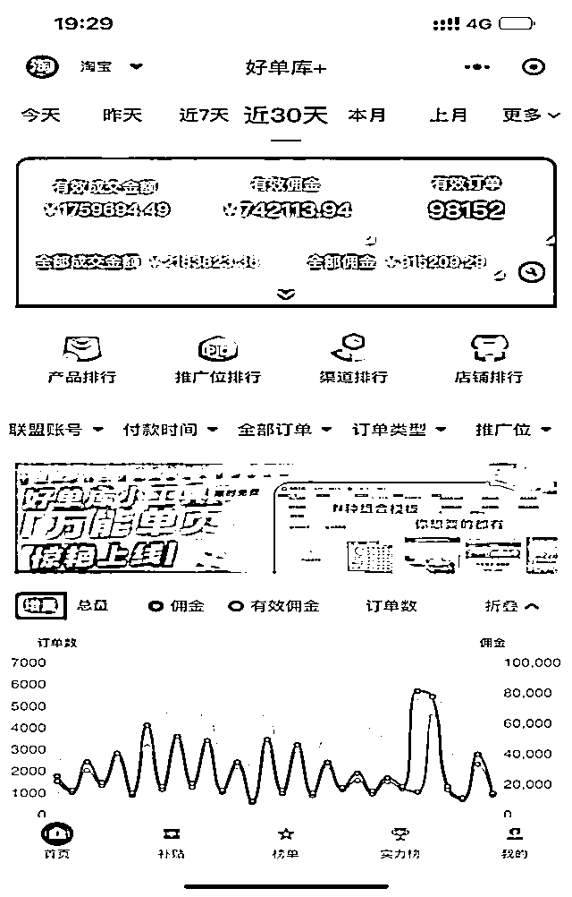
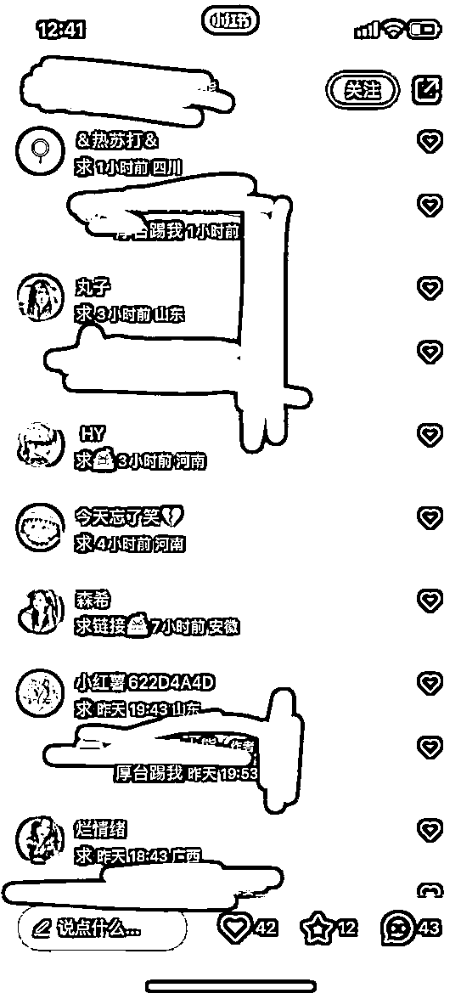
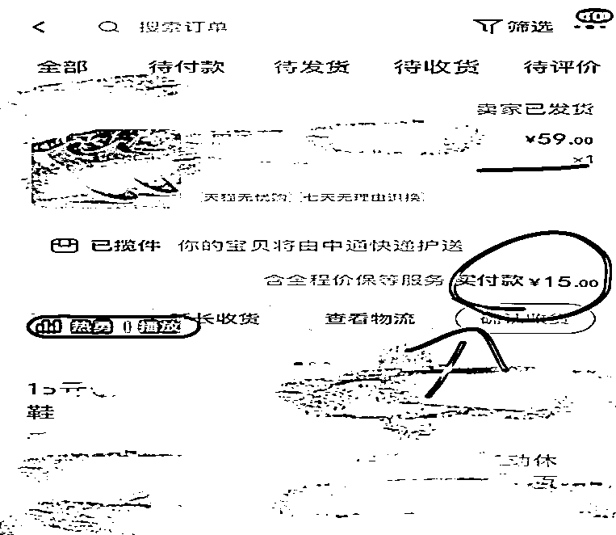
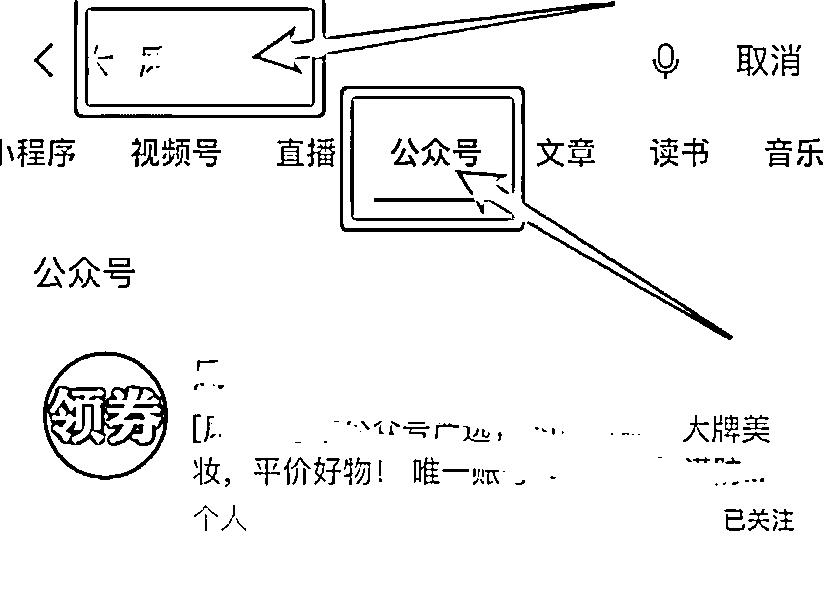

# 小红书可复制矩阵玩法分享

> 来源：[https://xw0aaz44ei0.feishu.cn/docx/Pmq9ddY7TourhtxU3rxchNuinod](https://xw0aaz44ei0.feishu.cn/docx/Pmq9ddY7TourhtxU3rxchNuinod)

先给大家看一下淘客业务月收入（含小红书），上月团队总收入74w+，其中小红书业务单个员工产出1.5w+，团队中负责小红书业务共15人，小红书月总产出20w+。

前段时间去和本地的同行拜访交流了一下，是一对夫妻档，做小红书一年的时间，月佣在10w+左右，小红书真的是普通人在互联网行业最容易进入的平台了。

在开始之前，我想说几句话：

为什么你做了很多项目，做着做着就倒闭了？

为什么你频繁换了那么多的项目，却没有赚到想要的钱？

你有没有想到，你做了那么多的项目，给你带来了什么？是你想要的吗？

我觉得我们至少要学会去做一个，收益可以持续半年，一年，二年，甚至更久的事。

下面我给大家拆解一下从以下几点去拆解一下这个项目：

1.什么是小红书项目，为什么去做小红书项目？

2.操作小红书项目，前期需要准备哪些？

3.小红书精准淘宝客操作流程是哪些？

4.小红书自发，代发注意事项

以下我为大家一一解答

### 小红书是一个年轻生活方式分享平台。

72%为90后，50%分布在一二线城市，共有4300万+的分享者，其中男女用户比例已升至3：7，这些数据的背后，是一群消费力极强的用户，隐藏着巨大的商机。

在我们从闲鱼/快递/小红书等渠道引来的粉丝中，当属小红书的购买力最强，现在单群（200人）市价在1500-2000元左右，

就是说，你从小红书引来的粉丝，你可以不做淘客直接交换就可变现，并且需求量非常大（当然，这涉及到买卖gong民信息，不建议大家这么做）

### 什么是小红书项目？

分析我们所需要的用户流量属性 ，通过小红书这个平台，把流量引到私域，进行转化成交，从而带来收益。

### 为什么做小红书项目？

一周见效果、投入成本低、回本周期快、收益长久、流量大，引流到私域后几乎不需维护，被动收益，不需要营销技巧，全程机器人自动化发单售卖，用户直接去淘宝下单，我们赚取商家佣金。

### 操作小红书项目，前期需要准备哪些？

设备:手机，电脑

账号:小红书、QQ，微信等账号（需要多注册几个，可以先拿家人手机号注册）

软件下载:淘宝联盟（仅需一次升级30-40元左右）/京粉

其它:发单机器人（0-10元一个月），拉群机器人wetool（20-40一年）

### 小红书精准淘宝客操作流程是哪些？

第一步：我们需要先去下载一个淘宝联盟，一个京粉app，由于淘宝联盟新注册用户都是低佣金，需要做满任务才能升级到高佣，如果有需要代做任务升级的圈友可以联系我给你们推荐。

第二步：去购买一个发单机器人，市面上这个淘客发单机器人很多，一般在5-10元一个月，根据每家机器人教程，把你的淘宝联盟和京东联盟账号授权给机器人。

第三步：下载wetool，用来自动同意好友通过，自动拉群

第四步：下载小红书（一机一号不连wifi，苹果机最佳，没有苹果用安卓也可以，苹果6s就可以，600块钱左右就能到手），每个手机配一个威信账号，如果可双开就配2个威信账号

*   小红书养号：注册账号后给自己的账号打标签要引流什么粉就往那个方向看笔记。推荐母婴/好物推荐/宠物，养号3-7天

*   威信（至少准备4个）：每个人可以实名3个账号，这个不困难

1.活跃老号最佳，可直接接粉，每天接粉上限200人

2.沉默老号需养号一周：带着去遛弯/扫码付款消费（尽量每天）/和3个以上好友互动5-10句/威信群里聊一两句/朋友圈评论点赞等一切模拟真人活动

3.新注册账号最次，养号同上，接粉数量较少，可先行注册留着备用

第五步：发帖

以好物推荐粉为例：具体内容就不详细呈现给大家了，以免炸号，大家可以参考这种模式去发帖引流，把上百元的产品，几块十几块包邮，很多人心动，问怎么买。

有人留言可以私信引导或者评论区留下导流号，然后在导流号发帖子留微信或者公众号（注意规避敏感词，下面会说到）

小红书代发注意事项：

什么是代发？就是给兼职佣金，让他们代发帖子，这样可以无限扩大发粉丝数量。

代发帖子，2元一条，一条三个帖子。

注意查看以下几点：看是否有过违规、看账号所发笔、 看账号注册时间、试发一条看推荐数

如果准备做美妆类，建议找兼职代发，美妆类很费号，不建议用自己的号发帖

运营注意事项：

1.  避开专业术语、极限词：淡斑、美白、抗衰、超、绝对、微、vx、第一等引流内容：微信号、二维码、微信号、手机号、链接、点赞、评论、收藏、私信、回关等敏感词语。

1.  私信引导把 Wx 号做成图片。比如可以拍一张图片，然后把微信号印在图片上（不过做成图片还是有一定风险的）

1.  对了，我们工作室的话就是一个员工10个手机，负责小红书项目的员工的话就是15个人，会分小组，三人一个小组竞争模式。

目前我们操作的引流的粉有，好物捡漏粉，美妆粉，宠物粉，母婴粉、深挖小红书引流两年多了，通过淘客项目变现，另外我们去年十月份也有做小红书店铺也取得了不错的成绩 有同行有货源的朋友可以一起交流学习一下！淘客粉产出最稳定最高的还得数母婴粉！

vx：xzycm222