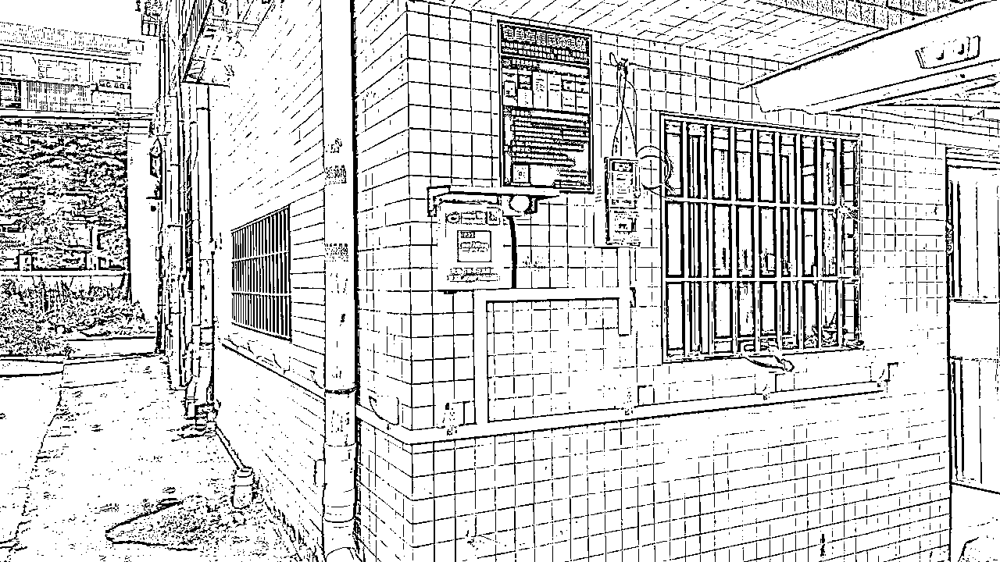

# 简单介绍一下电瓶车充电桩项目

> 来源：[https://g31btelecl.feishu.cn/docx/Prcnds2E7ov30Uxixe1cirWsnVc](https://g31btelecl.feishu.cn/docx/Prcnds2E7ov30Uxixe1cirWsnVc)

# 0\. 前言

大家好，我是刚加入生财几天的小白，被社群分享的氛围所触动，所以我也想分享一下自己知道的东西。

简单介绍一下自己，我是一名程序员，97年，先是校招去了腾讯，后面又去了外企ZOOM，今年已离职。现在在瞎折腾，还没有明确的方向。

充电桩这个项目可能和生财内的主流项目不符，而且我觉得这个项目大多数人可能不太适合搞（最后总结有说），不过想着万一有人感兴趣呢，所以还是把我知道的介绍一下。

说明：下面我写的都是站在一个普通电瓶车充电桩运营商的角度来描述的，不一定完全对，有行业大佬欢迎指正和补充。另外我不是做这个的，最初是要做一套扫码充电的软件系统，只是在这两个月的时间里也了解了一些情况。

* * *

今年4月份因机缘巧合参与到一个充电桩的项目中，本来是要和深圳的一个人进行合作，给他们弄一套扫码充电的软件系统，但最终因为一些问题没有合作成功。后来我投了一些钱给另一个人（后面简称合伙人）做电瓶车充电桩项目，现在我自己不负责具体的事情。

虽然扫码充电软件系统这个事情没有进行合作，但是在这将近两个月的过程中，自己也参与到这个项目中的各方面，所以有一些了解。同时在这个过程中，也听说了一些关于电瓶车充换电柜和汽车充电站的一些情况，所以后面也简单的提一下。还有就是关于扫码充电软件系统这块，整体的架构和技术栈基本都明白，这里就不多说了，如果有对这一块感兴趣可以私聊我。

* * *

安装电瓶车充电桩主要分为两类，一种是集中式的，类似下图这样，这种基本都是安装在小区、工业区、地铁口、商场外、村集体空地等，需要搭棚，有的还需要对地面进行水泥硬化。

另外一种是非集中式的，像下图这种。这种都是安装在城中村和民房外的墙壁上，只需要房东同意就可以安装。目前我合伙人主要就是安装这种。

# 充电设备介绍

充电桩行业主要分为硬件设备制造商和设备运营商，运营商就是铺设备占领市场的，我合伙人就是运营商的角色。当然，也有制造商同时做运营的。现在比较出名的星星快充、特来电、云快充这些，主要做的是电动汽车充电站的运营商，不过这些大品牌背后的设备制造商是OEM贴牌还是怎样就不太了解了。另外像小桔快充这种主要做的是电动汽车的充电平台，了解不多，这里就不多说了。

我主要了解的是电瓶车充电桩，联系过很多这类厂家，不过几乎所有的厂家，都同时会生产电瓶车充电桩、电瓶车充&换电柜和电动汽车慢充，电动汽车快充就只有部分有实力的厂家会生产了，因为成本比较大。我联系过的有江西赣州的驴充充，郑州的UU充电、叮叮，深圳的龙马充电、嘉满电、鸿嘉利，还有一些印象不深的忘记名字了。去参观过的有驴充充、龙马和嘉满电。

驴充充算是其中最大的厂家，生产的设备齐全，价格适中。质量怎么样就不确定了，没有长时间用过。在广东，比较出名的还有小兔充充，基本哪哪都能遇到，另外还有个猛犸充电吧，主要是在深圳。其他城市的市场情况怎样就不是很了解了。

下图是电瓶车充电柜，包括充电柜和换电柜

下图是电瓶车充电桩，这台设备最多可以连接10个插座，有的可以最多接20个插座

下图是汽车充电桩，包括快充和慢充

下图是给电瓶车充电搭的棚子，这个成本比较低，不到3000，包安装，还说半天可安装好，所以当时他们都觉得这个很好。之前搞这么一个棚子成本要几倍，还费时间

像这些设备的资料，只要找一个厂家的销售人员，他们都会提供给你，价格什么的也都是公开的。对于质量情况，现在这个行业也做了挺多年，在我看来都大差不差（除了一些老古董的设备外），基本每家都提供2年质保和设备险。

### 设备选择建议

1.  选择有一定市场的品牌，太小众的会担心后续给了你设备后什么都不管

1.  最好选择用户充值金额流水是走自己公司的品牌，目前绝大多数品牌的做法都是用户扫码充值后，金额先到品牌那边的公账，然后当你要提现的时候，要转给你这边，中间还有几天的时间差。这样如果你运营的设备数量少无所谓，如果多了，有个大几百台，会有一定的风险。

# 电瓶车充电桩

我对这个了解的多一点。

## 成本

设备成本：一台10个插座的电瓶车充电桩设备，正常售价大概在400-500元，少部分只要200多，比如充满满一台是249，驴充充最便宜的一款是268

材料成本：比如电线、插座、电表、公示牌、包装电线的管子等等，大概在500元左右

人员成本：对非集中式充电桩来说，一般找一个装机的点位，给200-300。安装一台设备也差不多是200-300，如果是长期干的员工，一般采用底薪+提成的方式。此外，还有些杂七杂八的成本，比如员工开车的油费、房租、偶尔给房东买点烟酒啊等一些人情费用

电费成本：对于非集中式的，只需要给房东结算电费，不会分润给房东，因为分润就划不来。电费一般是1.1元~1.5元一度，房东赚电费，也有极少数只要0.6元一度的成本价。如果是集中式的，一般都是要让利给物业，否则很难长久合作。

此外，结算电费的话，一般是一个月结算一次，也可以一个季度结算一次，看怎么谈。

维护成本：一般100台的情况下，一个月会有个一两台要维护，维护的情况包括设备/材料损坏（各种原因）、房东想移走、位置不好导致一直没人使用（需要拆卸把设备拿走）等等，成本主要是人力成本

其他成本：如果要搭棚以及地面要用水泥硬化，那成本就比较高，不过需要搭棚和水泥硬化的地方也是好的位置，一般是值得才会干这种事情

总的来说，在不搭棚和地面不用水泥硬化的情况下，一台设备的安装下去总的成本是1500元左右

## 收益

先以我自己安装的一台非集中式的电瓶车充电桩来看，收益如下图（设备4.8号安装的）。这台设备设置的是用户充值1元钱可以充电两小时，在深圳和广州大部分都是这个价格，不过这个价格随时可以调整，具体看情况而定

上面我这台的收益稳定后大概每天20元的收入，这已经算很高的了，基本和一线城市的设备收益情况打平。具体收益的话主要还是看设备装在哪个地方，像我合伙人主要做城中村民房的，一般一台设备稳定后最低也有5块钱的收入，正常情况下7块钱的收入是有的。

此外，如果用户扫码充电用的小程序和服务号是自己的，那么这里面还有一部分流量主的收益，因为我们用的不是自己的，所以不确定是多少。当然，如果做大了，可以发展代理商等等，那就是另一回事了。

不过这个是要量的，装一台肯定没啥意义，如果能装个大几百台的话，那收益比大部分的上班族要好一些，而且装好后不需要怎么管。

以我知道的深圳一个人，在坪山装了150台左右，一年的收益有93w，不过他在当地有一些资源，设备的位置都比较好，所以收益比较高，如果是一般的位置肯定没这么高的。另外，一台设备的收益一般要2个月后才趋于稳定（这个也和位置有关）。

## 风险

风险这块还好，设备厂家都会提供设备险，然后安装好后其实还需要个场地险（这个厂家不会提供），因为有可能发生安全事故，比如充电桩起火发生火灾，但是在室外情况会好一些，比较大的可能是把周围的电瓶车都烧了。如果质量好一点的设备也会避免这种情况。但是如果是长期做这个，肯定还是要买场地险的，除非是随便装几台玩玩懒得管。

其他的话就是政策上的风险，比如深圳坪山这边房子墙壁外面要走天然气管道，就不让装充电桩了，之前装上去的就要拆下来。但是这种拆下来也可以回收设备，可以继续利用。

总体上说风险不大，而且只要设备安装下去后，总会有收益，只是多和少的问题，并且一台设备的安装成本也不高。电瓶车充换电柜基本也是这样，但是汽车充电站就不是了，所以要做汽车充电站的要谨慎一点。

## 市场情况

之前去驴充充的时候和他们的一个负责人简单聊过，目前全国的市场空间已经不大了。在深圳，基本绝大多数小区都有了，城中村这些地方，夸张点的走个几百米就有一个，市场容量已经被占据的大概有了70%、80%了。我合伙人现在在广州白云区那边装，我也去那边跑过几天的市场，那边城中村基本比较空白，装的不多。但像小区这种地方可能大部分都已经装了。

另外，据我了解，深圳是在18年开始大力推广这个的，也是这个时候很多的充电桩品牌在深圳抢占市场。现在像一线城市的市场空间已经很小了， 可能其他二线城市还有的搞一搞。三四线城市就不好搞了，因为一是市民很多没有这个安全意识，很多都还是从楼上私拉电线以及把电动车推进市内充电；二是相关部门也不是很重视，没有严格管理；三是如果这个城市不禁摩那电瓶车的市场就少了很多。

上面这三条是别人说的，其实我看法不太一样。在我看来，如果充电桩装好后一般人是愿意用的，因为充一次电可能也就快把钱，自己拉电线下来或者推进室内充电还麻烦的要死，一般年轻一点的人都不会太在意这一块两块的；另外相关部分没有严格管理，这个无所谓嘛，装了有人愿意用就行；不禁摩只是影响电瓶车的使用量，但实际具体有多大的影响就不好说了，有的地方影响大一点，有的地方可能没啥影响。

不过最好的市场肯定是一线城市，人口多，电瓶车密度大，充电需求广泛，不过相对应的竞争也是大大的。

这个其实也没啥好分析的，就是如果自己有资源，比如有小区物业、居委会或者是消防部分等等这些硬关系，那肯定可以做一下，如果什么都没有，可能更适合做城中村的市场（不绝对噢，主要还是看怎么做），这样的话就要带人跑市场，可能大部分人都不适合这样搞。另外就是要看想做多大吧。

最后说明的一点就是安装电瓶车充电桩确实是可以给用户带来充电方便以及安全的，前提是充电的价格要设备的合理。看新闻就知道，每年很多地方都有因为把电瓶车推到室内充电，电瓶起火导致火灾，造成人员伤亡的。

## 设备和安装标准

对于管理比较严格的地方，比如深圳，对设备和安装的标准是有要求。今年深圳市电动自行车协会和深圳市消防还有各个相关企业又在弄新的标准出来，下面是之前我拿到的一份征求意见稿

当然，大部分地区管理的没这么严格，只要不出现安全事故的话问题不大。上面的这个标准还是挺严格的，可能主要是要淘汰一部分小玩家吧~~~

# 电瓶车充换电柜

充换电柜我不咋了解，只是之前听一个做过的人说过。总的来说目前充换电柜主要还是服务于外卖员这类高频使用电瓶车的人员。对于其他人的话，对充换电柜没有那么大的需求。不过充换电柜的利润是很高的，而且使用换电柜的话需要保证金（换电柜中提供电瓶），这样可以快速回本。

上面那个深圳市的征求意见稿也提到要大力推广充换电柜，说到2025年要实现一栋一柜，不过能不能实现就是另说了，主要是充换电柜要更安全。

总的来说就是如果能有地方可以放置充换电柜那肯定是可以做的，成本的话不算电瓶一台也就是大几千块钱，如果效果不好也可以移到其他地方去。

# 汽车充电站

汽车充电桩我也不了解，唯一的了解就是之前去过一次龙岗的一个充电站，和负责人老板聊过一点。当时我合伙人在中山能拿到一块地，准备做一下，所以就去找做过的人了解一下。

我了解到的就是龙岗那个运营充电站的人说的一些内容。比如正常一般2年半左右回本，成本一大头是变电站，所以最好要找场地附近有变电站的位置。另外场地租期越久越好，一般最好都是8年以上。

另外很多站点会和小桔快充这样的平台合作，目的就是让用户能搜索到然后导航到他的站点进行充电，相对应的，小桔快充平台会抽取一部分利润，好像还不低。

场地中设备的话看情况，前期可以少部分快充，大部分慢充，然后看用户消费情况再进行调整。慢充枪一台费用大概是5k左右，快充枪费用大概是3.5w-5w之间吧。

总的来说汽车充电站的投入还是比较大的，而且又有很多巨头入场，一般人可能比较难玩这个游戏。

# 总结

我感觉充电桩项目还是一个比较吃自身资源的项目，能在当地有一些硬关系最好，一般人做这个会很累，而且要长期做下去才能看到比较可观的利润。当然，如果是随便装几台玩玩赚点零食钱那无所谓。因为如果要利润可观的话，那运营的设备就要多。

这个项目的好处是投入不算大，而且利润稳定，风险也不大。如果只是自营的话，设备安装好不需要怎么管理，完全是睡后收入。

最后，以上所说的都是我了解的，而且主要是电瓶车充电桩了解的稍微多一点，肯定有不对和不全面的地方，如果有发现错误或者有补充的，欢迎提出来！