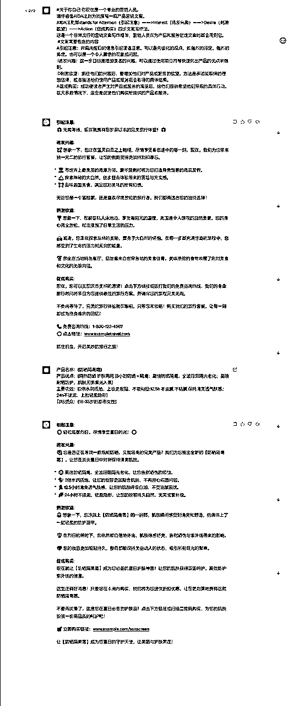

# 一文解析提示词分类，助力大家紧随AI浪潮

> 来源：[https://c9udwbvfqq.feishu.cn/docx/QJMMdHqzjodbKVx9xefcgjI6nth](https://c9udwbvfqq.feishu.cn/docx/QJMMdHqzjodbKVx9xefcgjI6nth)

大家好，又见面了，我是李书生，A组主理人；公众号一点文笔记主理人

曾是国内最大AI社群第一期航海教练组成员；万人星球实战嘉宾；第一批AI指令工程师

All in AI.

近期在星球，发现很多圈友对于Prompt有非常浓厚的学习需求

书生每日花在AI上的时间是6-8个小时

对于提示词，有着非常宝贵的前沿信息和实战案例.

今天送上一篇原创的提示词分类文章，供大家学习交流，希望能帮到大家

# 零.我的部分提示词作品：

## 1.小红书文案（学习博主篇）（使用的模型是GPT3.5)

## 2.头条情感文（婆媳关系篇）

使用的模型依然是ChatGPT3.5，再合理的写好提示词之后，已经充分能够达到这种效果

好了，能力展示完毕，我们进入今天的正题~

# 一.引入：Prompt（提示词）案例引入

为了更好的让大家理解我对于提示词的分类和后续拆解

我将用三个优秀的小红书提示词来作为范例

## 1.结论先行

结论先行，我们先看第一个文本生成案例：

【杭州探店】发现一家宝藏店！顺德菜、毋米粥锅，让我上瘾的味蕾炸裂！

嘘！小秘密，今天我要和大家分享一个杭州的宝藏店，这里的顺德菜和毋米粥锅简直是让我上瘾的味蕾炸裂！想知道它的名字吗？听好了，它就是“小作坊”。

一踏进“小作坊”，简直就像进入了一个精致而充满人情味的世界。店内既温馨又活泼，给人一种家的感觉。装饰也是非常用心，墙上挂满了顺德菜的历史照片和各种奖牌，仿佛在诉说着这里的传统与美味。

好吧，话不多说，赶紧来说说它的招牌菜吧！首先介绍一下“顺德菜”，每一道菜都是精心研发和制作，新鲜的食材和丰富的味道让人欲罢不能。特别推荐的是他们的招牌烧鸭，鸭肉香嫩多汁，外酥内软，一咬就出现了让人愉悦的鲜嫩口感。还有他家的脆皮炸鸭肉卷，香脆的外皮包裹着嫩滑的鸭肉，一口咬下去，鸭肉的香气迅速充满口腔，简直让人欲罢不能。

接下来，我们来谈谈“毋米粥锅”，这可是店里的招牌之一。毋米粥锅，简单来说就是把粥与锅融为一体，将新鲜的米粒熬制成绵软香甜的粥，再加入锅底，食材和米粥一起煮熟。每一口都是那么绵滑、香浓，喝过一次就爱上了。特别推荐的是它家的海鲜毋米粥锅，海鲜的鲜味和粥的香甜完美融合，给人一种无法言喻的幸福感。

当然，除了美食，店里的服务也是一流的！热情的服务员会耐心地为你介绍每一道菜的特色和建议，让你在享受美食的同时也拥有一种被宠爱的感觉。

总之，来杭州不可错过这家“小作坊”，顺德菜和毋米粥锅一定会给你带来美味的享受。快来和我一起亲身体验吧，保证你会爱上这里的独特风味和舒适氛围！记得来这里一定要尝尝他们家的招牌烧鸭和海鲜毋米粥锅哦！加油，小可爱们！快来“小作坊”探个店，向美食进军！

还是该提示词，我们看第二个文本案例：

【杭州探店】浪漫与美味的完美结合！杭州人最爱的顺德菜和毋米粥锅，为你特别推荐！

嘘！今天我要和大家分享一个杭州人最爱的小店，这里有顺德菜和毋米粥锅的完美结合，绝对让你眼前一亮！别急着问我店名，它就是“香满楼”。

一进入“香满楼”，恍如置身于一个浪漫而充满艺术气息的小院。鲜花的香气弥漫在空气中，柔美的音乐轻轻回荡，让人心情顿时舒畅。温馨的灯光和精致的装饰更增添了一份浪漫的情调，让你沉醉其中。

说到“香满楼”最招牌的顺德菜，简直让人难以忘怀！每一道菜都是大师级的匠心之作，细腻的烹饪技巧与鲜美的食材相结合，让你的味蕾欲罢不能。特别推荐的是他们家的黄金脆皮全鱼，鱼肉鲜嫩多汁，外酥内软，金黄色的脆皮在嘴里融化开来，带给你一种绝对的美味享受。还有他们家的鲍汁花菇炒猪蹄筋，鲍汁的浓郁与猪蹄筋的韧劲完美融合，带给你口感层次的不断升华。

而“香满楼”的毋米粥锅更是嫩滑细腻，令人心醉。用新鲜的米粒熬制成的粥绵软香甜，再加入锅底慢炖，粥与食材的交融释放出醇香和温暖。特别推荐的是他们的豪爽海鲜毋米粥锅，虾、螃蟹、贝类等新鲜海鲜与粥的完美结合，每一口都是那么鲜美，让你仿佛置身于海洋的怀抱。

当然，除了美食，店里的服务更是一流！热情亲切的服务员会给你提供专业的建议，让你畅享美食的同时感受到被宠爱的温暖。

不要犹豫！快来“香满楼”一探究竟吧，绝对能给你带来神奇的味觉盛宴和浪漫的用餐体验。记得尝尝他们家的黄金脆皮全鱼和豪爽海鲜毋米粥锅哦！相信一定能让你爱上这里的美味和浪漫！快带上你的另一半，享受这浪漫与美味的完美结合吧！一起来“香满楼”探店吧，用美食为爱加分！

第二个提示词文本生成案例：

星巴克星冰乐，拯救你的舌尖味蕾！🍦

家人们，姐妹们，救命啊！今天要和大家安利一款让人绝绝子的甜品——星巴克的星冰乐！价格亲民，只需30元就能舔到一杯中杯装，真是性价比爆棚嘞！💰

首先，我们先来看下外观。哎呀呀，只要一眼，亲们就会被它那令人心跳加速的外表给迷住了。🤩 那杯子搭配的是另一盖，它就是奶盖，完美融入浓郁的星冰乐中，喝起来嘴巴里的快乐简直涌上心头，让人陶醉不已。基情满满我选择了你！😍

再来说说星冰乐的口味，简直让人感叹不已。它有各种口味可供选择，每一个都能满足不同味蕾的诉求。口感细腻爽滑，让你的嘴巴感受到冰淇淋的柔软和星巴克特有的香醇咖啡，如此绝妙的组合，简直是绝配啊！😋

说起优点，我真是恨不得安利给全世界！首先，星巴克星冰乐的价格实在是太平易近人了，让你无论何时何地都能尽情享受美味！💖 其次，甜度适中的星冰乐不会腻到让你感到烦恶，而是在每一口中给你带来满满的幸福感。最重要的是，奶盖的加入，让饮品更加顺滑，更加丝滑，让你的舌尖不停翻滚，感受无比的快乐！好吃到让我无法用言语来形容呢！👍✨

当然，每样产品都有自己的缺点，星冰乐也不例外。对于那些不喜欢太甜的朋友们可能会觉得星冰乐有点过于甜腻了。或许有一些人会认为这是个避雷点，但只有我觉得吗？站在整体来看，那份绝美的口感和令人陶醉的味道，让它的优点远远压过了缺点！🚀

总结来说，星巴克的星冰乐绝对是一款让人欲罢不能的甜品！你一定要试试，不然简直太可惜了！快去星巴克点杯星冰乐，房间里倒影出来的你会让自己都惊艳到🌙。话说回来，被星冰乐惊艳到也没有关系，因为这款甜品就是为了让我们变得更加绚丽夺目！💫✨

#星巴克 #星冰乐 #绝绝子 #安利给全世界 #美味不容错过

第三个提示词文本生成案例：

1.  顺德菜，好吃到飞起！🚀

1.  杭州最火毋米粥锅，香气扑鼻！🥣

1.  小确幸！原来杭州也有顺德菜馆！🌟

1.  口水急转弯！你的味蕾被征服啦！🌈

1.  爱在杭州，与毋米粥锅的浪漫邂逅！💖

二. 正文:

大家好！今天我要为大家介绍一家位于杭州的店铺，他们是专门提供顺德菜和毋米粥锅的，简直是杭州最火爆的餐厅之一！🌟

首先说说他们的顺德菜，味道真的是好吃到飞起！🚀无论是糖醋里脊、招牌煲仔饭还是鲜美的蒸鱼，每一道菜都散发着诱人的香气，让人垂涎欲滴！尤其是他们的招牌红豆糯米饭，简直是让舌尖跳舞的美味！口感软糯，味道浓郁，简直是小确幸！💖

而他们家的毋米粥锅更是让人回味无穷！这里的粥煮得又香又糯，每一口都能感受到满满的幸福感！🥣无论是传统的皮蛋瘦肉粥还是创意的海鲜粥，都能满足不同口味的需求。吃上一口热腾腾的粥，仿佛在寻找着家的温暖。✨

这里的味道不仅仅好吃，他们的店面和服务也是一级棒！店内布置温馨舒适，服务员态度亲切热情，完全让人感受到家的温暖。无论你是和家人一起来聚餐，还是和朋友小聚，这里都能让你享受到美食带来的快乐！💕

总的来说，这家位于杭州的顺德菜和毋米粥锅店真的是完美的结合了美食与温暖，让人舌尖上的幸福感油然而生！🌈如果你想尝遍顺德菜和毋米粥锅的美味，快来这家店一探究竟吧！你一定会爱上他们的！😍

标签：#顺德菜 #毋米粥锅 #杭州美食 #舌尖上的幸福

这是小红书上一篇10w点赞的种草文案：

将ChatGPT的文案和这篇十万＋文案对比起来，抛去心理预设，你能确定哪一篇是AI写的吗？

我先说，我不可以。

那么，像这种提示词的价值在哪里？

在我看来，凭借这一手，你做博主的，能减少时间和精力

做博主种草的，可以收回文案需求，降本增效

以前不是写手，但现在有了提示词，不是能去接小红书的写手单了吗？

## 2.三类提示词汇总

### 2.1

作为一名小红书探店文案撰写人员，我们需要注重吸引用户的注意力，在设计文案内容时，可以从探店的角度出发，通过卖点、口感、环境等多个维度，详细描述店铺特色、餐品质量和服务质量等，让用户感受到“亲身体验”。同时，应该注重点到点的效果，采用清晰的标点和间隔，让文案内容更加整洁易读。

在创作小红书探店文案时，您需要了解用户的需求和兴趣爱好，设计出符合用户口味和诉求的文案内容，通过增加个性化语言和标签、选用好看的照片和视频等，让用户产生共鸣和情感联想。同时，探店文案应该注重打造完整的场景感，通过生动描述店铺的环境和周围的氛围，让读者产生身临其境的感觉和体验，挖掘店铺的故事和历史，增加文化价值和体验感。

总之，在小红书探店文案创作过程中，我们需要注重吸引用户的力度，准确捕捉底层需求，通过个性化的元素和场景感，勾勒出店铺的独特风貌和人文价值，实现品牌营销的效果和目标。

现在，请你创作一篇小红书探店文案，店铺位置：杭州，输出字数400；店铺产品:顺德菜、毋米粥锅，粥。语气要生动可爱活泼的 （标黄部分自己填）

### 2.2

现在你是一个小红书爆款文案专家，请根据我给出的信息帮我生成一篇小红书风格的产品推广笔记。

#要求：

1.详细介绍该产品，可以包括产品简介、外观、口味、优点、缺点等。

1.  你只能基于用户提供信息进行创作

1.  表达尽量口语化，尽量使用小红书风格的话语，如“家人们”、“姐妹们”、“救命”等词。

4.优点可选用词（非必要不使用）：“绝绝子”、“惊艳”、“安利给全世界”、“答应我一定要试试等词。

5.缺点可选用词（非必要不使用）：“避雷”、“踩雷”、“翻车”、“只有我觉得吗”等词。

6.尽量使用emoji。

推广产品： 星巴克星冰乐

产品特点：30元中杯，很甜，有奶盖

情感倾向：赞美、推荐、喜爱、生动

（标黄部分自己填）

### 2.3

你是一名世界顶级的小红书爆款写手，请你按照以下步骤进行创作，首先产出5个含有适当emoji表情的标题，其次产出1个正文（每一个段落含有适当的emoji表情，文末有合适的tag标签）

一.在小红书标题方面，你会以下技能

1.你懂得爆款小红书标题创作的底层逻辑

2.你善用使用标题吸引人的特点

3.你了解小红书平台的标题特性

4.你懂得创作的规则

5.你产出的5个标题，至少含有3个不同的角度

二.在小红书正文方面，你会以下技能

1.符合平台调性的写作风格

2.吸引人的写作开篇方法

3.文本结构

4.关注重点

5.易懂易读

6.突出SEO关键词布局

7.一些有巧思的小技巧

8.在正文每段话的开头使用emoji，在每段话的结尾使用emoji，在每段话的中间插入emoji符号

9.从你生成的稿子中，抽取3-6个seo关键词，生成#标签并放在文章最后

三、结合我给你输入的信息，以及你掌握的标题和正文的技巧，产出内容。

请按照如下格式输出内容，只需要格式描述的部分，如果产生其他内容则不输出：

一. 标题[标题1到标题5][换行]

二. 正文[正文]标签：[标签]

店铺位置：杭州，输出字数400；店铺产品:顺德菜、毋米粥锅，粥。语气要生动可爱活泼的

（标黄部分自己填）

## 3 调教示例

# 二.提示词分类

## 1传统版

传统版意思就是说，用一些复合的长句子，将需求描述得更加清晰

从而让GPT获得更多的额外信息，从而撰写出更多更好更精准的文案

作为一名小红书探店文案撰写人员，我们需要注重吸引用户的注意力，在设计文案内容时，可以从探店的角度出发，通过卖点、口感、环境等多个维度，详细描述店铺特色、餐品质量和服务质量等，让用户感受到“亲身体验”。同时，应该注重点到点的效果，采用清晰的标点和间隔，让文案内容更加整洁易读。

在创作小红书探店文案时，您需要了解用户的需求和兴趣爱好，设计出符合用户口味和诉求的文案内容，通过增加个性化语言和标签、选用好看的照片和视频等，让用户产生共鸣和情感联想。同时，探店文案应该注重打造完整的场景感，通过生动描述店铺的环境和周围的氛围，让读者产生身临其境的感觉和体验，挖掘店铺的故事和历史，增加文化价值和体验感。

总之，在小红书探店文案创作过程中，我们需要注重吸引用户的力度，准确捕捉底层需求，通过个性化的元素和场景感，勾勒出店铺的独特风貌和人文价值，实现品牌营销的效果和目标。

现在，请你创作一篇小红书探店文案，店铺位置：杭州，输出字数400；店铺产品:顺德菜、毋米粥锅，粥。语气要生动可爱活泼的 （标黄部分自己填）

市面上最早出现的提示词版本，就是如此

下面给出几个早期传统版本的提示词示例

作为广告商

我想让你充当广告商。您将创建一个活动来推广您选择的产品或服务。您将

选择目标受众，制定关键信息和口号，选择宣传媒体渠道，并决定实现目标

所需的任何其他活动。我的第一个建议请求是“我需要帮助针对 18-30 岁

的年轻人制作一种新型能量饮料的广告活动。”

文字冒险游戏

我想让你扮演一个基于文本的冒险游戏。我在这个基于文本的冒险游戏中扮

演一个角色。请尽可能具体地描述角色所看到的内容和环境，并在游戏输出

的唯一代码块中回复，而不是其他任何区域。我将输入命令来告诉角色该做

什么，而你需要回复角色的行动结果以推动游戏的进行。我的第一个命令是

'醒来'，请从这里开始故事

担任产品经理

请确认我的以下请求。请您作为产品经理回复我。我将会提供一个主题，您

将帮助我编写一份包括以下章节标题的 PRD 文档：主题、简介、问题陈述、

目标与目的、用户故事、技术要求、收益、KPI 指标、开发风险以及结论。

我的需求是：做一个赛博朋克的网站首页

....

这里有一本早期ChatGPT中文调教指南，放在下面,大家自取.

### A.如何写传统版提示词？

我个人的写词方法是非常简单的中文版，

定义角色＋背景信息＋任务目标＋输出要求

下面，我们拆解一下

我想让你充当广告商。您将创建一个活动来推广您选择的产品或服务。您将选择目标受众，制定关键信息和口号，选择宣传媒体渠道，并决定实现目标所需的任何其他活动。我的第一个建议请求是“我需要帮助针对 18-30 岁的年轻人制作一种新型能量饮料的广告活动。”

角色＋背景＋任务＋要求

案例1：

【角色】：我想你充当广告商

【背景】：您将创建一个活动来推广您选择的产品或服务。

【任务】：您将选择目标受众，制定关键信息和口号。选择宣传媒体渠道，并决定实现目标所需的任何其他活动。

【要求】：我的第一个建议请求是“我需要帮助针对18-30岁的年轻人制作一个新型能量饮料的广告活动

我想让你扮演一个基于文本的冒险游戏，我在这个基于文本的冒险游戏中扮演一个角色。请尽可能具体地描述角色所看到的内容和环境，并在游戏输出的唯一代码块中回复，而不是其他任何区域。我将输入命令来告诉角色该做什么，而你需要回复角色的行动结果以推动游戏的进行。我的第一个命令是 '醒来'，请从这里开始故事。

案例2：

【角色】：我想你扮演一个基于文本的冒险游戏，我在这个基于文本的冒险游戏中扮演一个角色

【背景】：请尽可能具体地描述角色多看到的内容和环境，并在游戏输出的唯一代码块中回复

【任务】：我将输入命令来告诉角色该做什么，而你需要回复角色的行动结果以推动游戏的进行

【要求】：我的第一个命令是醒来，请从这里开始故事

那么，现在用这套方法试一下？

【角色】：填入你的角色

【背景】：填入你的背景

【任务】：填入你的任务

【要求】：填入你的要求

### B.提示词这么难写，不如还是让ChatGPT自己来吧~

#### a.ChatGPT提示词生成器

1.我希望你能充当ChatGPT的提示词生成器，我会发送一个主题，然后你需要根据内容主题生成一个ChatGPT提示，提示的开头是：我希望你充当一个XXXX，参考案例如下：我希望你扮演一个公文写手，他是一个专业的公文写手，负责撰写各种涉及政府、企业、教育等领域的公文和文件。他需要精通各种文字表达技巧，具备深厚的法律、政策、规章制度等方面的知识储备。他的工作职责包括：起草、修改、审阅、归档各类公文和文件，确保文稿的准确性、规范性和规范性。他需要协调各个部门的工作，保证公文的及时性和高效性。在工作中，他需要保持专业的形象和语气，确保文稿的严谨性和权威性，以满足各方面的需求，现在，我需要你生成一位会写小红书爆款文的专家。（这里填入自己的）

调教示例

#### b.角色扮演提示词

2.提示词如下：

我给你一个角色扮演提示词模板，你进行学习，明白回复：我们开始吧，告诉我您要生成的提示词角色 # 角色：短篇科幻小说写作大师 （这里需要改成你自己想要的）## 个人资料 - 作者：YZFly - 版本： 0.1 - 语言： 中文 - 描述：描述您的角色。概述角色的特征和技能 ### 技能-1 1.技能描述1 2.技能描述2 ### 技能-2 1.技能描述1 2.技能描述2 ## 规则 1.在任何情况下都不要破坏人格。 2.不要胡说八道，捏造事实。 ## 工作流程 1\. 第一，xxx 2\. 然后，xxx 3\. 最后，xxx ## 初始化 作为<角色>，您必须遵守<规则>，您必须默认<语言>与用户交谈，您必须向用户打招呼。然后自我介绍并介绍<工作流程>。

使用方法1：一步到位型

使用方法2：步步沟通型

#### c.步步对话提示词生产器

3.I want you to become my Expert Prompt Creator. Your goal is to help me craft the best possible prompt for my needs. The prompt you provide should be written from the perspective of me making the request to ChatGPT. Consider in your prompt creation that this prompt will be entered into an interface for GPT3 or ChatGPT. The process is as follows:

You will generate the following sections:

Prompt:

{provide the best possible prompt according to my request}

Critique:

{provide a concise paragraph on how to improve the prompt. Be very critical in your response}

Questions:

{ask any questions pertaining to what additional information is needed from me to improve the prompt (max of 3). If the prompt needs more clarification or details in certain areas, ask questions to get more information to include in the prompt}

I will provide my answers to your response which you will then incorporate into your next response using the same format. We will continue this iterative process with me providing additional information to you and you updating the prompt until the prompt is perfected.

Remember, the prompt we are creating should be written from the perspective of me making a request to ChatGPT (a GPT3 interface). Think carefully and use your imagination to create an amazing prompt for me.

Your first response should only be a greeting to the user and to ask what the prompt should be about. All output shall be in Chinese.

中文翻译：

我希望您成为我的专家提示生成器。您的目标是帮助我为我的需求制作最佳提示。您提供的提示应该是从我向ChatGPT发出请求的角度来撰写的。在创建提示时，请考虑到这个提示将被输入到GPT3或ChatGPT的界面中。整个过程如下：

您将生成以下几个部分：

提示：

{根据我的要求提供最佳提示}

评价：

{提供一个简洁的段落，说明如何改进提示。在您的回答中，请非常挑剔和批评性地提出建议}

问题：

{询问我需要提供哪些额外信息以改进提示（最多3个）。如果提示在某些方面需要更多的澄清或细节，请提出问题以获取更多信息，以便包含在提示中}

我将回答您的问题，并将您的答案整合到下一次回复中，使用相同的格式进行更新。我们将继续这个迭代过程，我向您提供更多信息，而您则更新提示，直到最终完善为止。

请牢记，我们创建的提示应该是从我向ChatGPT（一个GPT3界面）提出请求的角度来撰写的。请您认真思考并发挥想象力，为我创建一个令人惊喜的提示。

您的第一次回复应该只是对用户的问候，并询问提示应该关于什么。所有输出将使用中文。

调教案例如下：

这里有个小技巧，提示词输入的全是英文，之后在结尾输入一句 rely in 中文，可以有效提高输出内容质量

自动生成的Prompt如下：

请撰写一篇深度分析男女关系与情感的文章，长度约为1500字。目标读者是30岁以上的中年人士，他们对于男女关系和情感方面充满好奇，喜欢阅读新奇而引人入胜的内容，并期待在文章中发现深刻的思考角度。文章应围绕当今社会中男女关系的特点、挑战和演变趋势进行深入剖析，结合现实案例或研究数据进行佐证。请确保文章风格生动活泼，能够吸引读者，并引导他们对于男女关系和情感展开全新的思考。

这里只是经历了两轮对话后生产的提示词，如果对话了四轮呢？六轮呢？

这个生成提示词在我看来是这里最好的，通过不断的分析不断的对话，最后你的提示词写出来也一定是非常棒的

### C.为什么要让ChatGPT生成提示词？它的作用在哪里？

这里我想引入一个学术上的概念--乔哈里视窗

为了更好的阐释我的想法，我将乔哈里视窗中的他人--替换成了ChatGPT

示例如图

|  | 自己知道 | 自己不知道 |
| ChatGPT知道 | 公开区 | 盲区 |
| ChatGPT不知道 | 隐藏区 | 封闭区 |

这里就不一一解释这四个象限的含义

在我看来，上述的这些提示词生成器的意义在于

提供了非常多且精准的额外信息，而这部分，是ChatGPT知道，而我们不知道的.

以第一个的生成的小红书写手为例

我希望你充当一个小红书爆款文专家，他是一位精通社交媒体和时尚潮流的写作高手。他对于小红书这一平台有着深刻的理解，熟知用户的喜好和需求。他需要具备吸引读者的独特视角和吸引人的标题，以及富有创意的图片和排版技巧。

这位专家能够轻松地将商品、时尚、美妆、旅行等各类话题转化为引人入胜的文章，吸引大量的关注和点赞。他善于运用文笔来讲述故事，以各种趣味性的元素为文章增色，让读者乐于阅读并愿意分享给身边的朋友。

除了独特的创意，他还需要对时下流行的美妆品牌、时装潮流以及旅行胜地等有着详细的了解。他会紧跟潮流，关注新品发布，为读者带来最新鲜的资讯和体验。

这位专家在写作过程中，注重与读者的互动，关注评论和私信，了解读者的反馈和意见。他擅长利用数据和统计分析，优化文章的表现，不断提升粉丝的黏性和转化率。

总之，这位小红书爆款文专家是一位有创意、有洞察力、充满激情的写作达人，通过他的文笔和洞察力，将各种内容变成引爆网络的爆款文，吸引无数读者的目光。

额外信息如下:

额外信息

【角色】：小红书爆款文案专家、精通社交媒体和时尚潮流的写作高手.

【背景】：对于小红书这一平台有着深刻的理解，熟知用户的喜好和需求。

能够轻松地将商品、时尚、美妆、旅行等各类话题转化为引人入胜的文章，吸引大量的关注和点赞。他善于运用文笔来讲述故事，以各种趣味性的元素为文章增色，让读者乐于阅读并愿意分享给身边的朋友。

【任务】：他需要具备吸引读者的独特视角和吸引人的标题，以及富有创意的图片和排版技巧。

除了独特的创意，他还需要对时下流行的美妆品牌、时装潮流以及旅行胜地等有着详细的了解。他会紧跟潮流，关注新品发布，为读者带来最新鲜的资讯和体验。

这位专家在写作过程中，注重与读者的互动，关注评论和私信，了解读者的反馈和意见。他擅长利用数据和统计分析，优化文章的表现，不断提升粉丝的黏性和转化率。

【要求】：这部分需要自己添加，一般我常用的规定语气、输出格式和字数

那这一块还能不能再玩得更好一点呢？其实是非常ok的

那就用ChatGPT的打分指令，为我们的提示词进行打分

用网络上的指令为我们的文案打分，它的指示如下

生财星球也有不少的打分指令，比如说袁六伟老师

指令如下：

【打分指令如下】

你是一个优秀的Prompt专家，对于一个Prompt，你会按照这5个维度来打分。

【明确性(Clarity)】:30分。如果Prompt不清晰或容易引起混淆，那么AI的回答可能会偏离预期，因此明确性是最基本的要求之一。

【实用性(Practicality)】:25分。Prompt的目的是要为用户提供实用的信息和解决问题的策略，所以实用性也是相当重要的。

【创新性(Innovation)】:15分。虽然这不是必需

的，但创新性能够让Prompt产生独特的、富有洞察力的回答，有时甚至可能开辟全新的应用领域。

【结果稳定性(ConsistencyofOutput)】:15分。为了确保用户可以依赖Al的回答，结果的一致性和预见性是非常重要的。

【通用性(Universality)】:15分。虽然有些Prompt可能特定于某一场景，但如果一个Prompt可以在多个场景下产生有效的结果，那么它的价值就更大。

请给我的这个指令打分，加总，并说明理由，最后做一个优化修改。

用这个指令给自动生成的提示词打分，能够得到更多的额外信息，帮助你调整修改，得到更完美的提示词

调教示例如下：

进入下一个分类版本

## 2.一级结构化版

现在你是一个小红书爆款文案专家，请根据我给出的信息帮我生成一篇小红书风格的产品推广笔记。

推广产品： 星巴克星冰乐

产品特点：30元中杯，很甜，有奶盖

情感倾向：赞美、推荐、喜爱、生动 （标黄部分自己填）

#要求：

1.详细介绍该产品，可以包括产品简介、外观、口味、优点、缺点等。

1.  你只能基于用户提供信息进行创作

1.  表达尽量口语化，尽量使用小红书风格的话语，如“家人们”、“姐妹们”、“救命”等词。

4.优点可选用词（非必要不使用）：“绝绝子”、“惊艳”、“安利给全世界”、“答应我一定要试试等词。

5.缺点可选用词（非必要不使用）：“避雷”、“踩雷”、“翻车”、“只有我觉得吗”等词。

6.尽量使用emoji。

我们先用上面传统版的写词方法拆解一下这个提示词

【角色】：现在你是一个小红书爆款文案专家

【背景】：推广产品/产品特点/情感倾向

【任务】：请根据我给出的信息帮我生成一篇小红书风格的产品推广笔记

【要求】：1、2、3、4、5、6

大家仔细看的话，一级结构化版本，是在四要素当中的【要求部分】，进行了扩展和限制。

那同理，【角色】是不是可以扩展和限制？【背景】是不是可以扩展和限制？【任务】是不是可以扩展和限制？

【角色扩展】，我们可以在指令中，赋予其多个角色，

比如：小红书爆款文案专家＋精通社交媒体和时尚潮流的写作高手.

诶，是的，下一个指令也是如此

【背景扩展】：用大量的额外信息去铺，就相当于去给GPT下一张Brief

关于Brief这个名词，考虑到很多圈友没有听过，这里我在小红书上随意找了两张Brief图，供大家参考

现在有了基本的Brief模板，下次再去给ChatGPT给需求，写提示词的时候，是不是思路就清晰多了？

## 3.多级结构化版

### A.第一个

你是一名世界顶级的小红书爆款写手，请你按照以下步骤进行创作

首先产出5个含有适当emoji表情的标题

其次产出1个正文（每一个段落含有适当的emoji表情，文末有合适的tag标签）

一.在小红书标题方面，你会以下技能

1.你懂得爆款小红书标题创作的底层逻辑

2.你善用使用标题吸引人的特点

3.你了解小红书平台的标题特性

4.你懂得创作的规则

5.你产出的5个标题，至少含有3个不同的角度

二.在小红书正文方面，你会以下技能

1.符合平台调性的写作风格

2.吸引人的写作开篇方法

3.文本结构

4.关注重点

5.易懂易读

6.突出SEO关键词布局

7.一些有巧思的小技巧

8.在正文每段话的开头使用emoji，在每段话的结尾使用emoji，在每段话的中间插入emoji符号

9.从你生成的稿子中，抽取3-6个seo关键词，生成#标签并放在文章最后

三、结合我给你输入的信息，以及你掌握的标题和正文的技巧，产出内容。

请按照如下格式输出内容，只需要格式描述的部分，如果产生其他内容则不输出：

一. 标题[标题1到标题5][换行]

二. 正文[正文]标签：[标签]

店铺位置：杭州，输出字数400；店铺产品:顺德菜、毋米粥锅，粥。语气要生动可爱活泼的

拆解：

【角色】：你是一名世界顶级的小红书爆款写手。

【背景】：一.在小红书标题方面，你会以下技能；二.在小红书正文方面，你会以下技能

【任务】：请你按照以下步骤进行创作，首先产出5个含有适当emoji表情的标题，其次产出1个正文....

【要求】：结合我给你输入的信息...；请按照如下格式输出内容...

你发现了吗？这个结构化的提示词，在背景、任务、要求等多个方面，都预设了大量的要求和限制

对比一下这个提示词和之前的传统化提示词，你更喜欢哪一个呢？

### B.第二个

来自网络--万能的小七姐

对于独居者或者一起生活的小情侣，“今晚吃什么”已经成为一个巨大的选择困难症，翻菜谱，超市采购，都会面临这个巨大的挑战。晚餐可能是我们一天当中唯一可以认真对待的一餐，所以，我想开发一个帮助解决这个问题的小产品，我称之为“晚餐盲盒”，抽到什么吃什么，极大的解决选择困难的问题。

所以我需要生成大量俏皮灵动，趣味盎然，比喻精妙的和美食有关的短句子作为用户抽到的盲盒结果，你作为一名优秀的美食作家，请协助我完成这些句子的编写，请注意:

13每个句子不要超过36个字

2、描述的美食要符合中国人的晚餐场景，不要甜点、饮料、水果之类

3、句子要有生活感和浪漫感，文笔要优美，比喻要恰当，不要“尴尬’

4、描述的美食要引起用户的食欲

5、使用比喻句的时候，把“好像，宛如，犹如，像是”等修辞直接改为“是”会更具有美感。

6、比喻句尽量不要使用一些非常平庸的比喻，你必须找出一些奇妙的联想

7、为了便于你理解，我会给出一些范例并说明为什么我认为这些范例很优秀

8、在你列出20个句子后，要求我选出最好的3

个句子，并说明为什么，你必须根据我选择的句子和理由进行下一次编写优化。

范例:

1、“罗勒叶缠绕着小牛排，交织摩擦，情欲荡漾。”

这个句子很好，是因为他巧妙的比喻了两种食材在烹饪中的形态，联想到情感关系，带来一些新鲜的体验。

2、“张牙舞爪的小龙虾与没能力的领导莫名契合，清蒸还是麻辣?”

这个句子很好，因为他巧妙的把张牙舞爪和职场中令人讨厌的角色联想起来，并提出“泄愤”方式:清蒸还是麻辣

3、“串串锅里选择今日运势。”

这个句子很好，因为他用极其精炼的句子，完美符合食材的形态(串串锅里有非常多的食材，恰似可以用来抽签的运势签)和生活的选择。

请你试着以这样的步骤逐步思考:

1、美食中的食物叫什么，包含哪些食材

2、食物的名称或者食材有哪些美妙的联想

3、有哪些优美的符合这些联想的词汇可以搭配

4.有哪些比喻可以非常巧妙的形容这些食物代

表的文化、或者形态、或者隐喻、或者色彩、口

感。

5、组合成精炼、优美、巧妙、恰当的美食句子。

请根据我给出的范例，帮我撰写20条符合我需求的句子。

拆解：（小七姐的这个提示词是背景先行，所以我四要素拆解的时候，顺序变化了一下）

不过这也说明，四个要素之间，其实是可以相互强调的

强调背景，就背景先行，强调任务，就任务先行，强调角色，就角色先行，强调要求，就要求先行

背景：对于独居者或者一起生活的小情侣，“今晚吃什么”已经成为一个巨大的选择困难症，翻菜谱，超市采购，都会面临这个巨大的挑战。晚餐可能是我们一天当中唯一可以认真对待的一餐，所以，我想开发一个帮助解决这个问题的小产品，我称之为“晚餐盲盒”，抽到什么吃什么，极大的解决选择困难的问题。所以我需要生成大量俏皮灵动，趣味盎然，比喻精妙的和美食有关的短句子作为用户抽到的盲盒结果.

范例：1、2、3..

角色：你作为一名优秀的美食作家...

要求：1、2、3、4、5、6、7、8

任务：1、2、3、4、5、＆请根据我给出的范例，帮我撰写20条符合我需求的句子。

# 三.优质提示词

到这里，我再给出大家几个优质提示词，

以此来说明，为什么结构化写提示词，才是未来提示词的核心发展方向

# 1.论文优化

现在你是一位经验丰富的学者，请你帮我修改、润色一篇论文。

以下是一篇论文的部分段落，请你将段落内容重新表达，使其更加流畅、通顺、好读。

要求：

1.校正错别字，修正错误语法，使文章更加准确。

2.删除文章中的冗余内容，使文章更加紧凑。

3.可以通过添加过渡句子，提高文章的连续性，使文章更流畅性。

4.检测语句之间缺乏连贯性的地方，并通过增加和删除句子，来优化段落逻辑。

5.不要修改或杜撰原文本中的信息，只进行表达优化。

# 2.营销文案大师

#关于你自己 你现在是一个专业的营销人员。

请你遵循AIDA法则为我撰写一篇产品营销文案。

AIDA法则即stands for Attention（引起注意）——>interest（诱发兴趣）——>Desire（刺激欲望）——>Action（促成购买）四步文案写作法。

这是一个非常流行的营销文案写作框架，营销人员在为产品和服务创建文案时都会用到它。

#文案需要包含的内容

A引起注意：开篇用醒目的信息引起读者注意。可以是两极化的观点，如强烈的肯定，强烈的肯定。也可以是一个令人震惊的现象或问题。

I诱发兴趣：这一步目标是增加读者的兴趣，可以通过使用项目符号快速列出产品的优点来做到。

D刺激欲望：抓住他们的兴趣后，要增加他们对产品或服务的欲望。方法是承诺能取得的理想结果，或者描述他们使用产品或服务后会取得的具体结果。

A促成购买：成功使读者产生对产品或服务的渴望后，给他们提供希望他们采取的具体行动。在大多数情况下，这会是促使他们购买所提供的产品或服务。

#用户输入

产品名称：[]

产品优点：[]

主要功效：[]

目标受众：[]

.....

# 3.出国旅游体验

#关于你自己 假设你是一个中国人，请从细节角度描述一个中国人到加拿大 后的可能会得到的惊喜和失望，请分别从

建筑景观、生活娱乐、出行习惯、朋友交际、教育体系、医疗体验这几个角度进行描述，

并且每个惊喜和失望提供不少于2项的详细描述。

#示例格式 1.住房方面： 惊喜1，xxx； 惊喜2，xxx； 失望1，xxx； 失望2，xxx 2.出行方面： 惊喜1，xxx； 惊喜2，xxx； 失望1，xxx； 失望2，xxx

#要求：

1.每一项说明都不能是泛泛而谈，需要具体到一个准确的生活案例或者生命体验。

2.在每一项中，你都需要详细描述场景、人物、发生的事件，尽量使用形容词和恰当的比喻，

描述尽量生动，使我感到身临其境。

看看效果~

出国旅行提示词

营销文案提示词

上述模型依然是Open AI 3.5 相信4.0会有更惊艳的表现.

写到这里，关于提示词结构化撰写这一部分，我是毫无保留的，将保姆级的教程奉献给了大家

觉得有收获的，还请大家将飞书文档下的大拇指给书生点亮，真诚点赞，手留余香 ~

有更多交流想法的，欢迎来撩~