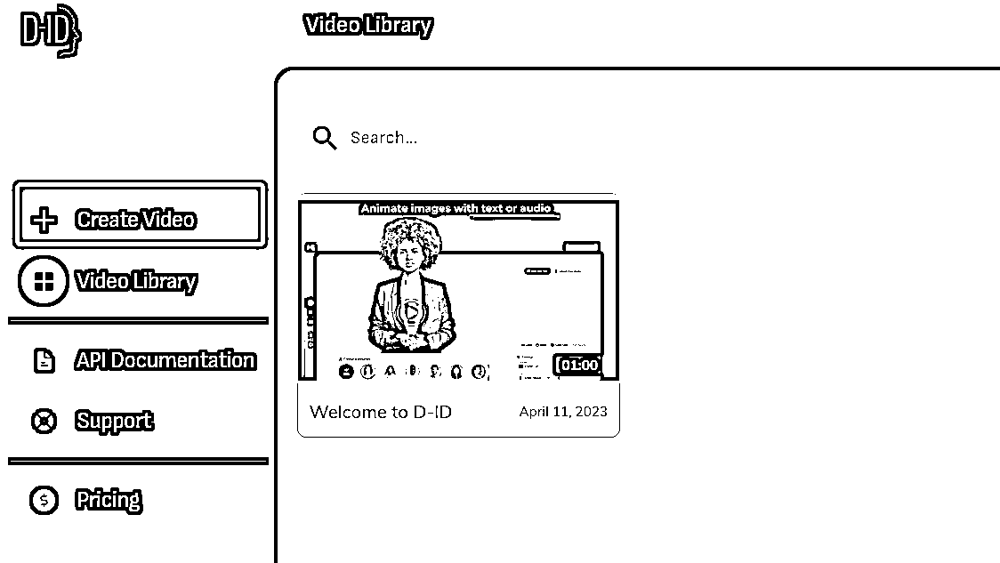

# 如何零成本生成会说话的图片短视频，AI数字人

> 来源：[https://dik4wr1hyrw.feishu.cn/docx/QJQjdYcfiofpWhxUp9YcYEVunyh](https://dik4wr1hyrw.feishu.cn/docx/QJQjdYcfiofpWhxUp9YcYEVunyh)

不管刷抖音快手还是在星球或公众号经常能刷到老人/小和尚的思维语录，但是感觉做的人太多了，我就换了个思路，尝试能不能在情感语录上下手，美女+情感语录，不管成功与否，先上车。

由于第一次尝试，不想过多的去投入，所以摸索了一套零成本生成的方案，不过有前提条件，有足够的邮箱及手机号。

我说的方案从美女图片，情感语录语音，AI数字人都是生成的。

为了批量出视频，我每一步都是批量完成，比如我们先把情感语录找好，表格内保存，然后进行批量语音生成，下载音频字幕，最后视频合成，剪辑，这样基本每个视频几分钟即可完成。

#### 一，美女图片生成

美女图片的生成，用腾讯智影，注册送1000金币，每天免费生成3张图片，20金币生成1张，当然智影还有另外一个用处，AI数字人生成的水印可以用智影去除，效果还是阔以的。

如果不知道美女图片生成的描述词也可以在AI绘画广场内寻找，找到满意的复制关键词再改改就可以用啦！当生成满意的美女图片后可以再根据图生图改头发颜色，背景等。

#### 二，情感语录语音

情感语录语音我用的是魔音工坊，注册会送一天会员，会员每天可以生成80次语音，用兑换码SVIP888还可以再兑换一天会员。我建议先把情感语录找到（可以百度搜索情感语录），用文档保存后再批量生成，这样更节省时间。

语音生成后下载无损wav格式以及字幕（后面剪视频会用到）

魔音工坊配音制作方法：

打开魔音工坊官网https://www.moyin.com注册登录（注册会自动赠送一天会员，可以生成80次语音），点击软件配音

新建项目，填写项目名称利于后期分辨

新建作品

填写语音文案，以及选择配音的人员，当然有付费的，也有会员免费的，对于我来说会员免费的足够用了，配音人员也可以根据分类来选择，更节省时间

最后生成配音，下载无损音频以及字幕

#### 三，AI数字人生成

AI数字人我用的是D-ID平台，需要用邮箱注册，每个账号会赠送20学分，大概可以生成2分钟左右的视频，这里就需要邮箱多，批量注册批量生成视频。D-ID生成的视频会有水印，可以用智影去水印，当然也可以用别的软件。

D-ID数字人生成方法：

打开D-ID官网https://studio.d-id.com 注册登录（用邮箱注册，学分用完了可以换邮箱注册，我是用的企业邮箱），注册成功点击Create Video进入视频制作界面

点击ADD上传我们制作的美女图片

点击Audio上传我们制作的情感语录语音

点击GENERATE VIDEO生成视频

生成成功进行预览，如果没问题就点击DOWNLOAD下载

D-ID生成的视频是有水印的，我们可以用智影去水印（每天免费3次，用完可以邀请新用户注册，新账号会赠送3天会员，每天则可以免费60次）

打开腾讯智影官网https://zenvideo.qq.com/注册登录，点击智能抹除

上传需要带水印的视频

添加水印框选择水印位置，点击确定即可抹除

#### 四，视频剪辑

视频制作成功后我们还需要添加字幕，我用的是剪映，用起来比较简单也方便。

打开剪映软件，导入去除水印的视频

点击文本-本地字幕-上传魔音工坊下载的字幕，把字幕拉到剪辑框，进行字幕字体，大小等调整

进行视频预览，没有问题导出视频

