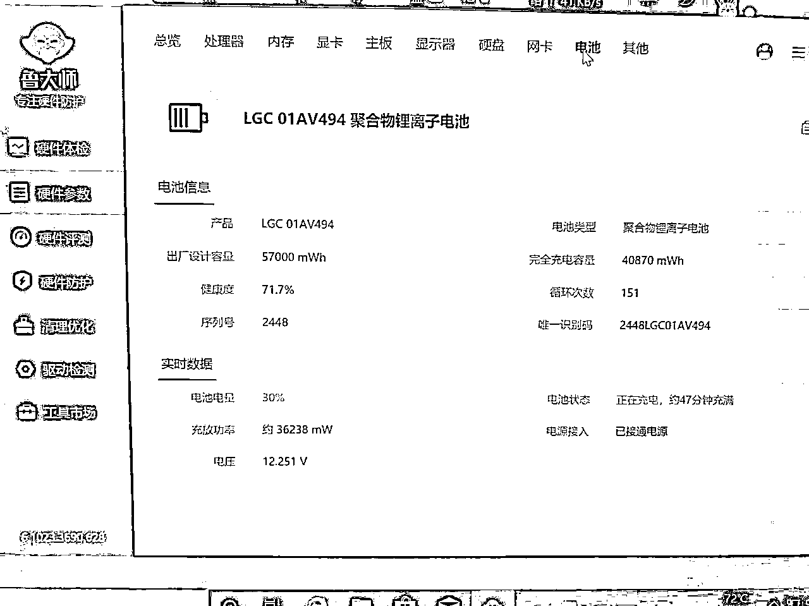
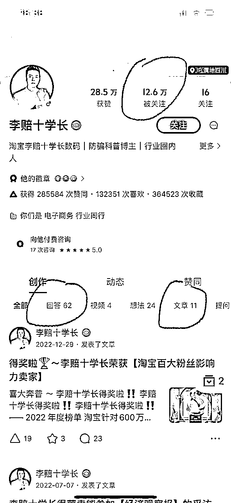

# 深耕行业10年，带你了解二手笔记本电脑行业

> 来源：[https://dwca9nn9fot.feishu.cn/docx/QjB6d6eeko6HRoxVk9Sc046Dnih](https://dwca9nn9fot.feishu.cn/docx/QjB6d6eeko6HRoxVk9Sc046Dnih)

# 前言：

大家好，我是史提芬周，应该是生财里面最懂二手笔记本电脑的人，深耕二手笔记本行业10年以上，对二手笔记本的回收，销售，租赁版块都比较了解。另外本文用电脑端观看会有比较好的体验。

本文大概是12000字左右，已经是多次删减字数，想方设法挤出水分的，但仍然有太多东西要表达。在本文里面，你可以了解到二手笔记本的行业现状，可以了解二手笔记本的现在盈利的几个分支，有需要的话，可以自己入局（不懂可以问我），也可以找到判断二手笔记本是否靠谱的标准，方便自己采购二手笔记本省钱。我总结为就是全方面了解二手笔记本行业。项目可轻可重看自身的资源和精力选择。

关于笔记本电脑，我发现在生财里面是绝对的刚需。手机固然方便，但笔记本电脑还是非常重要的“生产力工具”，比如无人直播，比如项目办公写作，比如ChatGPT各种帮忙，比如视频剪辑和内容输出等，笔记本电脑需求实在太多数不过来。手机虽是强便利但是对于输出内容的深度还是笔记本电脑更好。但二手笔记本是很多人不敢触碰的领域，因为二手笔记本水更深，无数人在里面被JS坑过，无数人对硬件（CPU内存硬盘）不了解，也有无数人对软件(系统或者常用软件）不了解，这样里面还有各种变量存在如：成色，配置，保修，功能，价格等，可谓五五二十五种变化，稍有不慎就中了JS圈套。本文就是除了有个别知识点扫盲，也有选购指导，更有销售经验，全方位了解二手笔记本。

# 了解二手笔记本电脑的行业现状

## 1）二手笔记本电脑的货源来自哪里？

### ①各类电商平台销售的机型大部分来自于海外，比如北美，欧洲，或者日本等发达国家。

现在国内电商平台比如淘宝，JD，还有拼多多，还有抖音快手等平台销售的很多机型还是来自以上地区。电商平台的销量都比较多，少则几十，多则上千。

JD界面

以ThinkPad，戴尔DELL，惠普HP，苹果MacBook为主流。这部分海外货源是比较早期就进入国内销售，最早可以追溯到90年代，当时是台湾人主导的这块电子业务，从北美（欧美或者日本都类似）的回收公司里面去报价，然后经自由港香港这边找货运的带回大陆这边。

很多人对这块义务还是有刻板印象：以为二手笔记本都是一个货柜回来，甚至论吨来称。其实不是的，国外的笔记本电脑成色分级非常严格。回到到国内的都是成品机器，有中低端的，也有高端的今年在售机型。整个链路已经是非常成熟。

二手笔记本是全球贸易的一个缩影。成色优的机型会被中东地区优先选择比如迪拜，也会被东南亚地区比如越南和印度吸收，国内一般只需要成色中等偏低的机型（价格低，尤其目前美金汇率上升）。

如图一和图二所示的某香港仓库内部。

图二

大家可以留意到我上面提到的ThinkPad，戴尔和惠普都是商用笔记本电脑为主的机型。其实这些北美公司一般是回收公司的角色，他们从租赁公司或者大型企业回收大量的机型后就将设备严格的分级，再给发展中国家（主要是有需求的国家）竞价，择价高的发出，所有这种机器都有单型号数量巨大的特点。也是各类电商平台能一个链接销量上百上千的根源所在。

某些电商平台的销量截图，可以看到ThinkPad和戴尔销量还不错，价格也就几百块

戴尔销量也不错

商用笔记本电脑比如ThinkPad，有使用寿命长和更换配件简单的特点。

从壳子，键盘，屏幕到主板芯片，都有齐全的产业链，所以十年前的ThinkPad机型，可能电商平台还在销售，甚至给你保修1年，主要是归功于更换配件的便利性。但反观一些普通消费本或者游戏本很难做到这种配件产业链的成熟，所以电商平台上无法形成一定规模。

那问题来了，这种机器靠不靠谱？

首先在这些机器里面肯定也有一些成色比较OK，使用频率比较少的机型的。就属于是几十台甚至几百台里面挑选出来的优质机型了。首先是外观是比较少使用痕迹，然后电池续航少，还有就是硬盘通电时间少。这虽然是寥寥几句话，但背后依然是需要很丰富的产品经验来判断。我展开说说：

*   外观使用痕迹少，一定是无翻新的基础上，怎么判断是否翻新呢？有几个细节，我用图片来说明。如下图，上面可以看到A面和C面和D面的细节判断，可以看到外壳是否真的成色新。

C面判断，键盘无油光可能是翻新

D面判断，如果一片黑估计是翻新

*   电池续航少，怎么看是否是原装的电池呢？一个是直接判断是否有拆机，另外就是看电池是否有序列号的信息，一般来说都是要序列号注明真身。

*   硬盘通电时间少，这个很少理解，但一定要建立在原装的硬盘上，一般很多大牌子都有固定的硬盘供应商，比如联想有三星英特尔等。

经过以上步骤，可以判断大部分的机型是否原装优品。

* * *

如果不是成色优秀的，他们一般怎么处理呢？我现在大概说一下他们从拿货到处理到销售的一个完整链路，方便你了解一下二手笔记本海外货源的来龙去脉。

*   拿货。上文提到国内的批发商会自己标价给北美公司，如果中标，就有大批量电脑到国内某个商家的电脑城档口，那电商的零售商就会去“点货（行内话）”，点货者会根据机器的外壳破损，配置（有些内存硬盘不同），功能是否正常，屏幕是否正常来做个简单的“正”字手写单，一个人拿着一个电源，对着几百台电脑点亮观察，一个人拿走一支笔对着来写，是市场点货常见的风景。很多时候，一笔几十万的交易，就根据一张潦草的手写稿就可以敲定总价。

*   处理。电商平台的商家拿到大批量的机型以后会有序的安排拆分入库处理。一般来说，先拆开内存硬盘，然后将需要翻新处理的机器做分类：比如有些是需要翻新A壳，有些是翻新AD壳，有些需要翻新ACD+KB（键盘），规范地这样分类写好，等待供应链里面的翻新喷漆的角色上门收取机器。一般过了一天，翻新的就已经处理好，会拿着报纸（就那么low，下面有图）包装着机器拿回来给商家，商家一般会这个时候直接放入仓库，等到电商平台下单以后，仓库会根据内存硬盘的具体大小，然后将机器（包着报纸）+内存硬盘放给仓库的技术员处理，技术员这个时候一般会先安装好内存硬盘，然后将外观多余部分的喷漆去掉，再贴上各种标签。安装好系统带上驱动简单测试调试一番，一台95新的二手笔记本就可以打包发货了。

撕掉报纸，清洁好，贴好标签的“95新”机器

*   销售。二手笔记本电脑（海外货）一般的常见销售电商平台有以下几种。

淘宝店铺销售，最早最稳定的销售平台就是淘宝，最早可以追溯到2005淘宝成立的时候就已经存在二手笔记本或者二手数码销售，淘宝成立之初本身就是销售二手产品。淘宝销售的二手笔记本电脑都是翻新为主，然后有比较成熟的售后体系。简单来说，二手笔记本卖二手价格，外观处理比较新，也有售后。

JD店铺在商家来说成本极高的是那么多电商平台里面相对比较高的，除了扣点还有各种发票或者技术费（以前叫年费），平摊下来一样的东西比如淘卖3000元，JD要卖3300，赚的钱是一样的，JD的成本天然高但实际东西没有区别。

抖音直播购买的机器，都要发到第三方质检，一般都是全部翻新好的机型，说实话不翻新不行，质检就无法通过。后期会好一点，会降低比例。所以抖音的成本也很高，假设东西一样，抖音是兴趣电商退款率高，加上扭曲的对于二手的价值观（抖音要商家提供翻新好，成本高的机器，实际消费者要物美价廉），抖音的机器价格高于淘宝低于JD，但东西还是一样。

闲鱼上只卖ThinkPad，惠普，戴尔或者苹果的，这种都是卖海外版机器，一般这种卖家要观察是否全部卖95新还是8-9新，如果是8-9新是可能一些电脑城市场的批发商挑选一些成色好的机器做零售，这类机器一般在没有怎么翻新的，卖家一般只安装一个系统简单测试一下就发出，优点是价格便宜就有机会购买到原装好机器，但售后服务比较弱，可能连软件都不太懂。因为闲鱼门槛低，门槛低就有可能龙蛇混杂，也有可能是个别无货源卖家找点图片开挂，这个需要一定经验来分辨。

拼多多，小红书，快手等各种自媒体平台都有一定存量的二手笔记本商家发布和销售机器，拼多多因为比较严格的售后体系对卖家是不友好的，比如过了几个月出现售后还会给买家退钱等恶心人出现。小红书因为平台扣点比较多（超过1w就收取5%）所以只能做为一个辅助的交易平台。快手跟抖音卖法差不多目前还没有质检这种介入，对买家来说，保障性没有抖音好。

* * *

我是分割线，以上是国外机器（也叫洋垃圾），以下是国内机器渠道

* * *

### ②来自国内回收的二手笔记本（C端），主要是国内回收大公司，或者垂直行业上市公司等。

国内回收的机器，主流来说有几大阵营。分别是有：

京东+爱回收派系：爱回收上市后叫万物新生，在全国大型城市的大型卖场有店铺回收各类数码产品，京东的以旧换新也是将机器发给爱回收的质检和销售，所以京东+爱回收这条线是比较巨大的回收产业链。

阿里系：闲鱼信用回收的端口一般给国内几个回收商来分，分别是上海有得卖，深圳收收科技，深圳回收宝，杭州拍闲品，还有北京的金典。以上公司深入参与闲鱼的各种项目，比如“验货宝”就是上面这几家公司做的质检。比如二手书项目比较出名的闲管家软件是来自深圳收收科技（目前亲儿子）之手。因为阿里系有淘宝，天猫两个万亿市场的APP，会产生很多闲置二手数码，闲鱼本身就是自家独立的第三个万亿APP，所以回收体量非常可观。

转转+拍靓机派系：这两个是排名第一和第二的二手手机的头部玩家，转转收了拍靓机，影响力非常不容小觑，转转期下的采货侠就是B端采购平台，转转公司期下有个千人的专注内容的自媒体公司，从回收到销售，转转深耕行业制定标准，完全不输其他两个派系。

上面提到的几个派系，他们都有海量的二手数码，我现在只针对二手笔记本来展开。国内回收的二手笔记本一般来自于C端也就是用户端，有“SKU单一”和“种类繁多”等显著特点，这种特点是无法满足淘宝JD等销售模式的，所以一般会让全国的小B商家来销售，他们一般是采用档口销售，或者闲鱼和转转销售，甚至私域。因为很多笔记本电脑都只有单台，或者成色各异，真正是“非标品”，每一台都不一样，所以如果我们在闲鱼上看到一个商家他产品都是发布二手笔记本，但里面有各种消费本，各种游戏本，各种商务本，那他其有可能的货源就来自国内回收平台的。这种商家的货会靠谱吗？绝大部分是靠谱的，根据我对这种商家的认识，他们都是出价在回收平台回来，然后都是单机，他们会挑选没有问题的机器，回收平台的机器都是不带电源的，所以要另外购买电源适配器。

以上回收平台，都支持对公转账开票，是正规的回收公司。

* * *

### ③国内租赁公司或者国企回收背景的企业（B端），主要是头部租赁公司如易点云，小熊U租等租赁公司内部建立的回收业务。

这部分的企业跟我之前说的北美的回收公司有点类似，这些公司的机器都是有一定数量，可能一个型号有好几百上千台。又或者一个大企业公司设备回收，比如TCL或者百度等，里面会有很多苹果电脑或者ThinkPad电脑等。易点云和小熊U租都是比较知名的租赁公司，首先他们每年都有海量的机器更新换代，其次回收业务也是他们深度绑定业务。因为多年的跟各种公司的业务往来，开展回收是利润收入最大化的一种方式，还有比较老牌的租赁公司比如北京建河，建河都有回收业务。他们会对成色分类评级，然后给电脑从业者出价竞拍，价高者得。

这种有数量的机器，有部分是销售出中东或者东南亚，也有部分是走非洲等地。电脑低配有成本，高配有行情。电脑是没有真正意义上的垃圾，只有在合适的地方依然都有使用价值。就算很低配的机器，在非洲或者朝鲜依然很有市场。

## 2）怎么辨别二手笔记本的优劣。

### ①望闻问切大致了解二手笔记本电脑硬件和软件等（如果你是一名买家）。

望：可以观看机器的实物照的外观判断。比如在淘宝上购买，尽量争取一下要客服给你发货前提供实物照看过再发货，如果你是可以接受翻新（新点看起来舒服，质量没问题就行），那叫客服拍仔细一点就可以，加上鲁大师图，鲁大师就看内存硬盘和电池三项就行，内存要三星海力士镁光尔必达等大厂，不要搞没听过的。硬盘要三星英特尔镁光东芝等。不要国产的。电池就要原装健康度高就行，不要低于70健康度，理论上越高越好。

闻：顾名思义就是看下机器有没有油漆味，这部分在ThinkPad是比较明显的，苹果这种翻新是叫“氧化”这种是没有异味的。ThinkPad戴尔等会有比较明显的味道，如果自身是可以接受二手外壳翻新的，那这部分是可以略过，首先要知情，其次本人能接受是关键点。

问：这个版块是最重要。既要问的是核心问题，也要给人感觉是很专业很懂，以下我用几种专业问题来问ThinkPad的机型来做举例：①机器有翻新喷漆了吗？他们一般会回答没有，这个没关系，你问了证明你在意。②那接口的logo还有没有？底部有没有序列号条码？这个时候一般他们就不敢随便乱说了，会根据实际情况来说，如果没有接口logo印和序列号条码就是翻新无疑。③电池健康度多少？内存硬盘什么牌子？健康度不能要100%的因为大概率是清零或者换电芯，内存硬盘最好三星，实在不行要大牌子不要国产（后续细说）④系统是ghost版本，还是还原的原配系统，或者纯净版系统？永久激活还是180天激活的？软件也是非常重要的环境。尽量要求稳定和一劳永逸。问的问题还有很多但不一一展开，问到核心问题就行了。

切：这个是收到机器在手上的复核。首先摸一下机器A面是否粗糙，如果A面很新，摸起来不是很光滑，大概来就是翻新了外壳的，听下机器风扇声音和敲击一下键盘，风扇没有异响，键盘没有卡顿感觉视为合格。还要打开鲁大师核对一下配置信息主要是开内存硬盘电池，核对无误再删除鲁大师（实际日常不用开还耽误事），最后根据自己的使用习惯深度来使用一轮，主要是测试系统稳定性。

### ②怎么判断笔记本电脑的配件优劣（如果你是一名买家）。

主要是以下的三个部分来判断，分别是内存，硬盘和电池。

*   先说内存部分。主流的品牌笔记本电脑，回来一般都是三星，海力士，镁光内存为主，三星是独一档，有价格差。所有的内存里面，三星最起码贵个20-30差价，如果内存频率高，价格还有略高的出入，所以有个别商家会拆掉机器自带回来的三星内存，然后换上价格低一点的内存，一般是换上镁光或者海力士尔必达等内存。

*   然后是硬盘部分。现在一般都是固态硬盘为主。固态硬盘一般是分为2.5英寸和M2-2280固态为主，还有个别M2-2242尺寸的固态，无论是什么类型的固态硬盘，都是分为主控芯片和闪存颗粒这几个主要部分的。闪存颗粒还分为SLC,MLC和TLC，等级是SLC最好，TLC速度和寿命最差，所以不能单看价格，其实里面的门道极多。一般大牌子机器回去回来的自带大部分是三星为主，少部分英特尔，还是会有个别商家会拆掉里面的三星换成次一点的固态，他们会换国产牌子，你可能没听过的，价格比较便宜，他们会“注明全新硬盘保修1年”来迷惑你，但实际跟三星价格差距特别大，可能有几十块差价。

*   最后部分是电池部分，原装电池一般是鲁大师能检测到序列号和能看到充放电次数的。其实如果是原装的电池健康度能做80-90%都算是很优质的电池了。作为正常的买家理性看待二手电池就行，不用过分追求100%健康度，因为目前很多商家会在电池上做手脚，良心一点的，会给你换掉原装的电芯，换上相对次一点的全新电芯。不太良心的话，直接给电池清零就算了，这样看都是100%健康度，但实际续航体验会比较差。

以上是三个比较直观判断机器是否靠谱的核心配件，当然二手笔记本还有屏幕和主板等核心配件，但这些部分其实都相对没有容易判断，所以其实了解几点核心配件判断方法，就应该够用的了。

* * *

# 怎么在二手笔记本行业赚到钱呢？（如果你是一名卖家）

这部分是整个文章里面比较核心的部分，汇合了十年行业经验的核心见解和经验，主要是从二手笔记本的回收，销售，租赁三大部分来拆解赚钱的链路。已经是力求精简，希望能看完就落地。

## 1）怎么拿货二手笔记本电脑。

主要是针对国内的渠道来展开说说拿货的渠道。国外的渠道我个人觉得是比较重的模式，不合适新手入门。

### ①国内的回收平台拿货。

国内一般是三个回收流派，分别是爱回收系，阿里系，还有就是转转系。

那么对应的，我们主要拿货的渠道就是爱回收的拍机堂，阿里的拍闲品和回收宝和有得卖，还有就是转转的采货侠了。

以下是各种回收竞价平台的一句话精准点评。

*   拍机堂是目前二手数码B端里面最多人使用的。我说下优缺点：

优点是：货品比较充足，SUK非常丰富，价格是比较合理。瑕疵拍照比较清晰，设备的参数也比较清楚。你可以从图片看到机器的明显缺陷，比如外壳破损划痕等。也包括了一些参数比如电池的健康度和各种功能是否正常。

缺点是：退货会相对复杂一点，需要一定的经验来判断价格是否合理，或者有没有其他暗里的坑：

①比如我们行业的“炸弹机”是CPU坏的，客户收到一段时间内是没问题，但会经常出现蓝屏。

②还有例子是游戏本显卡坏的机器，但因为集显是好的所以显示正常，这种也是存在的。

要在拍机堂里面找到物美价廉的机器是没问题的，但需要一定的经验判断和避坑。我个人主力推荐这个平台。

如下图的展示：我当天竞拍了一台ThinkPad的T480S，收到当天就以1950元价格售出。

*   阿里系的拍闲品是有APP下载的，回收宝是小程序，有得卖是独立网站，这三个公司的机器其实主要来源是闲鱼的信用回收端口分配，所以数量不是很多，价格都是比较主流，虽然没有什么大捡漏，但作为补充还是不错的。如下图：

拍闲品界面

*   转转的采货侠是有独立APP的，手机的数量会比较多，电脑的货品也还可以，不过价格没有拍机堂美丽，有个别电脑是带了电源适配器（这个是加分项，其他平台都不带电源），可以作为一个采购的补充。

以下是采货侠的APP界面和详情图：

采货侠的产品页面，除了图片，产品参数也比较丰富

### ②国内的个人笔记本电脑回收。

国内的个人电脑是比较多的，在各大平台都有人做个人电脑回收的工作，在知乎，B站，抖快，小红书都有个人电脑回收业务可做，简单来说就是低买高卖，因为个人电脑是很多型号配置，很多人会不懂行情，一般来说就可以参考拍机堂的价格和闲鱼价格就行，拍机堂是可以了解到具体机型的进货价，闲鱼是可以了解卖价。

以下以华为matebook13 2020款为例子：如下图所示，从拍机堂上知道机器的回收价行情，从闲鱼上知道机器的售价，两者的价格差，就是利润。

闲鱼可以知道机器的售价价格

再以知乎为例子。如果想在知乎上收个人的闲置笔记本，具体做法是：要在知乎里面获到高赞，一定要解决答主的痛点问题，多参考相关对于的高赞回答，然后多回答比如：怎么卖掉手中的笔记本电脑？怎么卖掉闲置？等问题输出自己的专业性，慢慢就有很多人会私信联系你。在知乎的流量非常长尾，主要经常回答，经常输出，就必定有回报。如图：

知乎的私信会比较多，高赞回答效果显著

## 2）怎么销售二手笔记本电脑？

在上一个小节提到，你从B端（拍机堂等）或者C端有拿到了二手笔记本，那我们怎么把机器卖掉呢？有几种见效比较快的方法，分别是：①在闲鱼或者转转这种闲置APP上精细化运营。②在淘宝上布局好产品，然后利用小红书引流到淘宝成交。为什么要引流到淘宝成交呢，因为整个小红的成交链路不太成熟，另外自身店铺超过1W后收取5%手续费。成本比较高。小红书的用户不太会用闲鱼。③其他平台的曝光比如抖音，快手，B站，QQ小世界等。

以下是具体实操说明：

### ①在闲鱼或者转转怎么卖二手笔记本。

先说闲鱼部分，在闲鱼上卖二手笔记本，最重要是以下这几个部分。

*   账号的4要素要设置好，人设要立起来。四要素是名字，头像，大背景还有简介。你可以做一个数码爱好者人设，也可以做行业老鸟，只要是能给别人信任感，就算是及格。这部分只求合格即可，不需要过分在意。

下图是我出售笔记本电脑账号的人设，个人有点懒，差不多凑合即可。

*   产品的价格。价格是重中之重，只要是拍机堂或者采货侠回来的机器，都有一定的价差，设置好自己的价格差，选一个合适的价格非常关键，你想机器快速出掉，价格要设置中等偏低，你想机器卖出高价，可能时间上就会拉长，在这部分我建议是大家先找到合适的爆品，所谓的爆品就是比较热门的机型，比如华为，比如部分小米，比如X1carbon等等，颜值高的，或者知名度高的，都是比较合适的爆品。找到爆品以后再磨合出一个相对有空间的价格是比较好的成交链路。

*   关于售后保障。在闲鱼上交易，其实售后是非常少的，很多人就算有小问题也不会回来找你，除非了是在确认收货的时间内无法开机这种特殊情况，所以我们在一些页面可以设置上一些售后保障，比如保修3个月，保修6个月等是完全可以增加转化率的，如果真的出现极个别的售后处理情况怎么解决，可以给我外包处理即可。首先我本人不做维修，我也是给专业维修商维修机器的。一个生财的同学苹果Pro15.6坏了，上次他这种问题拿给抖音的布政司维修收取1200元，然后这次再出现这种问题，我找的维修给我报价300元后完美解决。

*   闲鱼的曝光逻辑还是比较简单，多发布产品即可。发布产品的基本原则是标题尽量清晰带上品牌名字和机器型号，图片能上9张要上满，首图尽量拍好看一点，其中一张必带鲁大师配置图片，文案主打真诚，如果有瑕疵说明瑕疵即可。

*   如果短期内有曝光有咨询没有成交怎么办？要找熟人拍一两单（刷单），闲鱼的流量权重窗口不长，如果3天内没有成交，要进行刷单维持一下流量权重。

转转部分其实跟闲鱼高度相同，所有如果追求效率的话，一般是直接用同一组图片和文案再快速发布一次即可，毕竟转转也是一个辅助出单的平台。在没有其他更多支出的情况下，多一分曝光会多一分成交。在这里我说说我对转转的理解，转转上颜值高的机器，会比较容易出手，比如“荣耀”“华为”“小米”等，另外就是转转上如果用它平台自带的相机来拍，会有“实拍”的标签，这样会带一定的流量扶持。如果想做的精细化一点的，可以考虑用转转的相机再拍一下实物照然后发布，这样效果更好一点。

* * *

### ②在小红书发布引流到淘宝或者私域成交。

我本人亲测，在小红书发布二手笔记本的流量是比较精准而且爆发力强的，但要坚持输出。输出的方式可以是图文，也可以是视频。图文的方式很多，如果太硬广的话，怎么让大家接受是你需要思考的一个问题，视频的话有太多人无法克服心里这关去做，其实视频的流量是最大的，还是以我自己为例子，我一个很硬的视频呈现形式，发出来一天内也有1500左右浏览，而且很多都是精准客户，可以引导入私域，也可以引导到淘宝成交。

关于小红书的简单运营，生财里面有太多资料可以看，我就不详细展开。针对“二手笔记本”在小红书上怎么发布有效果，我简单说明一下。首先在小红书你要想要多赞多互动分，一定要能解决小红薯们某一个痛点问题才行，如果单独展示产品是比较硬广的，流量会比较少。所有你如果是卖2000左右的二手笔记本，就应该输出“预算2K怎么选二手笔记本”，“2000内的宝藏二手笔记本”等选题流量会好一点的，如果实在没有内容可以输出，怎么办呢？就只能铺“硬广”内容，内容硬没关系，但要不停的发布作品，保证足量的笔记，这样也有流量保障。

有了流量，怎么引导客户进入私域或者去淘宝成交呢？在小红书引流大同小异，相信各位圈友应该大概了解，不再一一展开。

有了流量，怎么承接流量，淘宝是必不可少的。

但淘宝不需要太专业的呈现方式，就简单的5主图+具体配置套餐+实拍的详情页就OK，一个比较简单雏形就可以解决。淘宝积累到一定的销量也可以获取到自然搜索流量，所有在标题的设置里面是重中之重。淘宝的标题非常关键。如下图：

淘宝其实是最早利好二手笔记本的平台，我自己也是做了7-8年的二手笔记本淘宝运营，深知淘宝的重要性。其实淘宝相对还是比较简单的，很合适夫妻档等小型的个体经营。小个体尽量轻一点的经营模式，做二手笔记本这种重行业是非常舒服的。任何行业都是流量先行，流量为王。小红书引流种草，淘宝拔草，淘宝再内循环引流，是非常合理的模式。

### ③其他平台的曝光引流。

拔草的平台一般是闲鱼或者淘宝为主，那种草的平台就比较丰富了。

*   抖音快手的曝光路径都差不多，我就放一起说，主要是短视频引流，抖音和快手都有一些基础的流量，比如抖音几百个流量，快手可能多一点，因为快手的机器人流量多（我个人感觉），在抖音上发布短视频产品，记得参考一下我们航海里面的抖音SEO手册，多一点自然精准搜索流量，就多一分成交的机会。

*   B站的引流是需要长视频，需要一定的专业度。但我个人认为B站 粉丝画像是比较符合二手笔记本的人群画像的，所以B站是可以值得深耕的，看一下竞品作品的呈现方式，看下他们是如何拍出高的播放量。B站对数码产品有天然的吸引力，我个人建议大家可以多关注一下B站。

*   知乎合适有一定知识储备的引流，比如很出名的李赔十学长，就几个关于苹果的手机和平板的选择回答，就有十几万的粉丝，而且比较长尾。如果暂时没有很丰富的经验，可以先学习和搬运。如下图：

还有其他一些用户量比较高的平台，比如微博，QQ小世界，百度贴吧的二手笔记本吧等，坚持输出，都会有效果，互联网的流量是碎片化的。

## 3）二手笔记本电脑的租赁

笔记本电脑租赁分为个人租和企业租，还有长租和短租，我们主要是选择个人短租，因为个人短租的租金回报比较高，另外也比较灵活，短租几天或者一周回来以后也可以卖掉，可以追求利润最大利益化。不建议长租是因为二手笔记本电脑会有折损和掉价的情况出现，长租回报的收益不高。支付宝的信用租赁是2017-2019年发展比较猛，到疫情期间更大的需求井喷，目前做的比较好的几家分别是人人租，爱租机和惠租等。查看路径是打开支付宝，在搜索栏输入：租手机或者租电脑。即可查看到具体平台。

如图：

### ①在租赁小程序平台里面创建自己的店铺。

因为人人租和爱租机都要高额的入住费（我印象中是16800元或者12800元），那我们就说下这个免费入住的惠租平台，惠租平台只收取租金的10%作为平台的佣金，整个平台风控系统完善，体现快速，是对新人比较友好的平台的。

在惠租上创建了账号以后，就新建宝贝，上架几个自己常用的型号配置，如图中的所示

一般来说都是上一些自己常备库存的机器，这样可以灵活的互补。一个1000元成本的机器，租金一个星期都可以达到150元（超过10%成本），如果机器回来一般是没有什么耗损，就可以轻松卖掉或者继续租创收。

如图是我个人小打小闹的收租界面纯供参考：

### ②租赁二手笔记本的获客和风控

租赁二手笔记本，最重要就是2点，一个是获客，一个是风控。

*   关于二手笔记本租赁的获客，惠租是支付宝的信用租赁小程序，所以一般比较精准的公域流量是支付宝的公域流量池。“芝麻租物”是支付宝官方的租赁小程序，流量比较大，一般惠租运营会给我们店铺两个链接上租物，我们将自己最多机器的链接提交给运营即可，只要是价格合理的话，一般租物会有一些稳定的订单。对于其他公域，比如闲鱼，获客思路是跟买卖差不多的，只不过成交的链路会比正常卖二手笔记本会复杂一点，为什么说复杂呢，因为我们租赁的免押在支付宝小程序惠租上，所以最优解是从闲鱼引流到惠租下单，但如果纯引流没有成交的话，闲鱼很快就没有流量，需要成交才有源源不竭的流量。另外还有小红书的获客比较有效果，在小红书上多输出以使用体验或者用户角度种草的笔记，有需求的客户会自动私信你，你只需要打磨好自己的成交链路就行，一般来说都是引导私域成交是比较合理。还有其他一些获客的渠道，比如淘宝获客，但淘宝需要强运营，我就不一一展开，还有一些比如抖快等，主要坚持输出，都有一定的效果。

*   关于二手笔记本租赁的风控。前面提到我们主要是在惠租平台租电脑，惠租平台自己有个风控的模型，会给我们判断客户信用是否优秀或者良好中等，这个风控的工具是基于大数据的来判断，还是比较精准的，其他一些风控经验就是看自己的经验了，比如根据客户的年龄来判断，18-19的话，信用会偏低一点点，但如果是学生或者有稳定的收入的，还是没问题的，还有就是地址的详细度来判断，如果是在大城市具体到几栋几号，大概率也没问题，如果是村里面，某某转角处等这种不清晰的地址，就有了解清楚才能发。还有就是客户的芝麻分，芝麻分是最能体现一个用户信用的分数，分数越高越好，遇到分数低的，也不能有半点侥幸心理。

### ③说下租赁特别要注意的事项。

租赁一定是辅助销售的一个方式，但不能以租为主，不能主次颠倒。如果以租为主，那模式就变得很重，尤其不能做长租，长租其实严格来说还算是分期付款的一个方式，就算总体利润会正常销售会高一点，但这部分利润还要一年分期才能收回，再加上有逾期的风险，资金压力非常大。另外二手笔记本随着时间拉长价格会不断的下降，所以不能持有太长时间，如果长租在外，机器跌价会比较被动，切记一定要配合销售的节奏来做租。

二手笔记本因为是走的支付宝免押，所以还是会存在一定风险的逾期，怎么尽可能减少逾期也是租赁行业的必修课，不能因小失大，也不能因噎废食。

## 写在最后：

笔记本电脑还是现在副业里面很重要的生产力工具，几乎是刚需了。二手笔记本可以进一步的减少我们成本的支出，我观察生财里面对二手笔记本有几种观点，有一种是“何不食肉糜？”为什么要购买二手的笔记本呢，直接购买全新不就得了？这种灵魂拷问一般都是这种有钱不想麻烦的人提出的。这种观点也不能说是错的，只是不全面，没有考虑到二手笔记本的性价比和省钱属性。还有一种是“二手笔记本太多坑不建议购买”，这种观点也比较常见，所以我用万字文章来表达二手笔记本也有靠谱的来源和渠道。

如果看完这篇文章，你可以拨开迷雾，看清楚二手笔记本的前生今世。你可以抛开偏见，选择二手笔记本电脑省下一定资金。你可以抓住机会，走上二手笔记本的赚钱之路。那我就觉得“与有荣焉”了。

我从2012年开始接触二手笔记本行业，其中8年时间都在打工，从淘宝客服2000工资打工到运营总监，销售端比较熟悉，十年的经验不可能用万字就可以完全表达出来。所以我看大家的反馈，如果有需要深入了解的，我后续再针对某个板块再深入详细说明。

* * *

## 附上关于闲鱼二手笔记本电脑FAQ

1.  机器你使用了多久呢？有没有问题？有购买凭证？

答：有几种回答的方式，看你人设的侧重点。

*   机器是租赁公司更新换代下来的，机器平时很少使用的，会有点轻微使用痕迹。（主打低频卖点）

*   机器是国内回收公司的机器，我们不是第一任主人，具体情况不清楚，不过我们都是挑选轻微使用的来卖。回来有专业测试过，（主打真诚）

*   机器别人卖给我的，回来一直吃灰，偶尔刷刷剧什么的。（主打个人）

1.  这个机器有保修吗？有问题可以退吗？退的运费怎么算？

答：一般这样问的，你说没有保修是无法转化的，所以我们都说统一说保修3个月（实打实的，不是虚），但一机一图有些机器我价格会比较低，如果客户不问，我们也不需要主打说保修多久，多SKU机型（如ThinkPad，非一机意图）可以说明一下保修都可以，支持7天无理由退货，有问题需要退当然可以。如果是不包邮的产品，7天无理由退运费是买家承担来回，如果是机器有问题，卖家出运费退回，如果是包邮的，7天无理由是一人一程。

1.  机器还可以优惠一点吗？真心要

答：价格已经比较实在了哦，最低给你优惠20元，可以拍下后我改价.(或者直接说包邮，切忌给大优惠）

1.  这个机器什么系统？有安装什么软件吗？

答：默认是WIN10，如果是要WIN11也可以满足，一般就安装个OFFICE ，收到可以用，其他需要买家自己安装。如果是常见的软件，我们也可以安装好（个性化需求需要对接好就行）

1.  这个机器可以玩游戏吗？

答：这个机器一般会在非游戏本里面出现，先问他一般玩什么游戏，如果是常见的LOL，这个集显也可以玩的，可以具体游戏具体分析，或者百度买家提出的游戏配置要求，可以对比一下。如果是说吃鸡的话，这个要1050独显4G以上才行，一般办公轻薄本是无法满足的，直接回复：一般游戏是没问题的，不过吃鸡会比较吃力，也影响游戏体验。

1.  这个机器可以用CAD,PS，PR,酷家乐，AE等软件吗？

答：每个软件的需求不同，要单独说明

*   CAD是配置要求比较低的，一般1000元的电脑的集显也可以。

*   PS要看具体需求，问他一般是什么使用强度，如果图层极多的，需要配置高一点，如果是一般需求，一般入门级独显或者集显都可以。

*   剪映，这个配置需要一般入门级的独显，比如MX150独显，就可以了。游戏本的独显更没问题。

*   酷家乐，这个跟剪映差不多需求，要入门级的独显以上，集显带不动。

*   PR和AE，PR主要是高级版的剪映，AE是视频特效等，都需要一定配置，要专业独显（移动工作站机型）或者游戏本的显卡高一点的，遇到这类问题，可以单独问我。

1.  机器可以做直播吗？能达到要求吗？

答：你是娱乐主播还是说卖货主播还是游戏主播呢？

*   娱乐主播配置要求没有那么高，但要机器稳定。

*   卖货主播需要机器配置高，稳定性更高，一般不需要经常移动，但需要不关机（日不落直播或者无人直播）所以一般建议是15.6寸移动工作站机型。

*   游戏主播，需要游戏性能要高，也要问清楚他具体使用需求，如果只是手机游戏，电脑只是投屏用，配置要求不需要那么高。

1.  可以开发票吗？

答：可以开，需要确认收货后开，是电子普票。需要发邮箱。

1.  哪里发出的？一般什么时候可以发？发什么快递？几天到？

答：广州发出，一般是当天发出的，18点左右顺丰同一来收，发顺丰陆运，因为有电池，走不了空运。具体地址具体分析几天到。

1.  有没有拆过机器，有没有修过？

答：机器都是无修无进水的，机器有些会拆过清灰加硅脂。确保质量发出的。

1.  机器是不是翻新过的？有没有换过配件？

答这里是分两种情况回答的：

*   如果是一机一图的实拍机型是这样说： 原装的机器，没有更换过任何配件，所以多少能看到一些使用痕迹或者磕碰。

*   如果是成色新的多SKU机型，要这样说：

为保证用户体验，部分外壳（仅限外壳）会进行漆面美容或者贴膜，客户满意度99%

1.  机器还能使用多久？用久会卡吗？

答：正常使用还可以使用2-3年以上的，可以放心使用。电脑本身是不会卡的，要看具体配置，如果是配置高的情况下，卡可能是系统问题比如缓存/垃圾过多造成，可以定期清理一下。

* * *