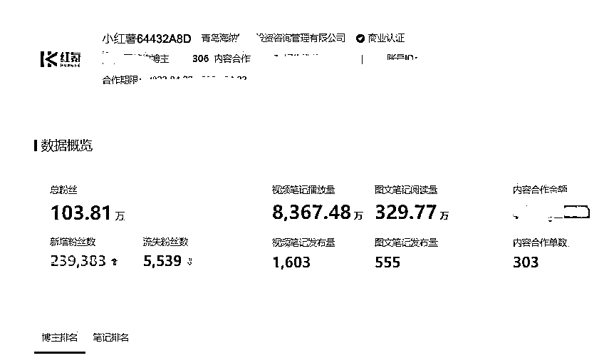
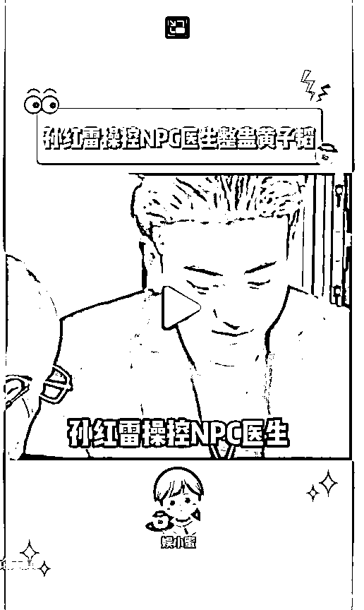

# 《做了一个小红书MCN，首月粉丝破百万，营收10w＋分享如何在小红书接商单赚钱》

> 来源：[https://tuhr2ryzy9.feishu.cn/docx/QlH9dXCZdoGhBSxohvBcTukPnlc](https://tuhr2ryzy9.feishu.cn/docx/QlH9dXCZdoGhBSxohvBcTukPnlc)

生财的朋友大家好，我们都知道小红书是一个非常好的种草平台

广告商非常愿意通过小红书种草来提升品牌曝光

因此通过小红书矩阵批量做流量账号，然后接广告变现，也是一个非常好的赚钱路子

目录

一、项目介绍

二、展现结果

三、准备工作

四、项目实操篇

五、接商单流程

六、违规案例

七、对接MCN的优势

八、疑难解答

九、最后的话

# 拱卒往期小红书专题内容分享

1、小红书资料引流虚拟电商项目保姆级攻略

https://articles.zsxq.com/id_v831gco6041g.html

2、小红书虚拟电商最新玩法和现状分析，现在入局还能做什么？

https://articles.zsxq.com/id_3qgx7nun1854.html

3、小红书资料引流，12种爆款封面案例拆解

https://articles.zsxq.com/id_390c8h9645nv.html

# 一、项目介绍

这个项目的原理就是通过二次原创其他平台的视频经过我们的去重玩法上传到小红书平台，积累到1000粉丝，最后通过渠道去接广变现

品牌方会直接提供文案，博主要做的只是按照要求把笔记上传即可

也不用咱们自己进行创作，还有一点就是广告类型是一口价，也就是说只要发布了就是那些钱

不存在看后期数据结算那种情况，有的广告商看你数据好了还会给你发红包

经过我们的市场调研以及两个月的实操，接商单项目的市场比较蓝海

经常出现品牌方广告文案发不完的情况，也就是说每天品牌方需要发的广告发不完，想砸钱都砸不出去

接广告这块其实一直是大多数小红书博主的痛点，这是一个博主接广群，稿费低对账号要求高不说

还得自己进行创作，对于博主来说丝毫没有收益保障

所以我们前期耗费大量精力去对接了小红书众多品牌的广告商，并花钱建立了自己的MCN机构

众所周知，小红书年轻女性用户占比很高，消费能力很高，对广告商来说很诱人

所以就在小红书平台大量砸钱去做曝光，跟一个广告商聊天得知他们的投产比普遍能到20

很恐怖对不对，所以这是一个很好的合作模式，你帮他做曝光，他给你钱，双方共赢

小红书接商单这个项目相较于其他项目上手比较容易，逻辑简单，起号快，变现稳，易放大

对于新手小白比较简单，容易看到正反馈，内测成员绝大多数给的反馈就是“有手就行”所以这就给了我们普通人机会

让我们普通人也可以去平台接广告达到变现

# 二、展现结果

用结果说话，下面是一些实战数据，不喜欢看数据的可以直接划到第三部分，全是干货

我们自己的账号3-5天接一单每一单200-500，一个月7-10单，我们内测的收益是单号月利润在2000左右，虽然不多，但是稳，一个人打理3-5个号问题不大

下面有几个我们内测时候的收益和数据图

下图是MCN结果展现

好了，废话不多说，直接讲怎么玩

# 三、准备工作

1.  若干台手机（根据自身情况定）--------下载小红书

1.  若干张卡（掉专业号绝大多数是因为IP网络环境）一个WiFi下面尽量少连设备，一个违规容易连坐

1.  一台电脑---下载剪映 视频采集器

1.  若干个实名

1.  强大的执行力！

# 四、项目实操篇

## 1.快速养号

对于小红书而言养号绝对不能轻视，小红书在公域平台中算的上是很严格的，所以不要拿做其他平台的思维来做小红书，那样只会酿成很大的隐患。养号一定要做好，养的好的号，后面的操作会事半功倍

（1）.养三天

（2）.前两天每天刷一个小时的同行领域视频（点赞，评论，收藏，关注比例：10：3：5：3）总的来说就是模拟一个真实的用户去操作，不要太夸张。

（3）.养号没有一个标准性但是有判断根据（进入编辑资料往下滑看账号等级，如果按照一级完成任务依然升级不到北鼻薯那就是账号没养好或者天残号，这样的号不可能有流量）

（4）.第三天，开始改简介,名字，性别，头像，地区，背景图

（5）.一个WIFI下不能超过三个账号（谨记）

（6）.设备别用黑设备（之前登录的小红书来回注销，或者出现重大违规被封号）

## 2.快速起号

讲解起号方式前我先说一下可以接商单账号的要求：

（1）.1000粉丝

（2）.每篇笔记播放量破2000

（3）.账号没有限流以及掉专业号

## 账号类型举例

### 1、影视搬运号

#### 如何寻找素材？

在其他公域平台找原创100w粉丝以下的博主

并且确保其在小红书上没有账号（直接检索博主名字，名称头像作品三重确认）

以上工作做好后，进行接下来的操作，确保其作品在小红书没被搬过

看到意向视频后，先去小红书上检索作品的标题（多换几个关键词检索）

如果有一样的视频后，就不能用了

有的博主在视频里加一下很淡的水印，这点一定要看清楚，这种水印没办法去掉

看到这种视频直接放弃，找视频的同时注意观察水印

筛选出视频数据高于账号平均数据的这种视频效果比较好。有一个获取更多同领域博主的小技巧（抖音快手）

博主个人主页点关注，下面会出现更多同领域的博主

#### 如何确定素材方向？

我们内测起号时候，最快一天干了一个千粉号

后来团队复盘发现起号快的选材方向发现这些素材都有一个共性

都是比较吸引女生的话题，引爆评论区，从而视频直接爆了

上面两个视频一个是关于婆媳矛盾的

一个是关于家暴的，都能引起女生共鸣，评论区也非常热闹

一个账号下面其他类型的视频（武侠）（喜剧）就逊色很多

效果比较好的有我总结一下:婆媳矛盾，家暴，男女歧视/分歧，下头男，出轨，屌丝逆袭，言情，爱国，时下热播电视剧。

这几个方向效果会比较好，大家选材的时候，注意一下。这个步骤选择大于努力，素材选的好，流量少不了。

#### 影视号去重：

1.添加空镜头——覆盖视频画面，不透明度调到10——声音关闭

2.添加滤镜——清晰度滤镜程度70-100

3.扫光素材——选择9：16，不透明度10——如果要用16：9的注意结尾有抖音水印——声音关闭

4.原视频——b变速1.1+声音变调（选择合适的音色，音调，音色，强度，都调到10左右，听起来无违和感就行）

5.BGM——随便选择一个BGM轨道覆盖整个原视频——声音关掉

注意剪映素材库里素材的声音记得关掉，带logo的裁掉

每天发布频率：千粉之前每天3-5条，千粉之后1-2条，发布时间在中午12点左右，下午5-8点

### 2.综艺号

综艺号这套方法整体来说和影视那一套大同小异，整体逻辑都一样，这里大的框架就不说了

但是起这种号谁做说都说好起，这种号流量挺猛的，比较推荐做这种号

注意有一点就是这种号水印比较多，注意甄别

视频中间也会冷不丁弹出个若隐若现的水印，看见这种视频直接换一个

注意去小红书查重，这点非常重要。注意图二下面那个小贴画也算是logo的一种。

类型就是：明星综艺＋新闻八卦

选对标的关键词：明星综艺+明星娱乐+综艺八卦+综艺吃瓜

#### 怎么去重：

在影视号去重方法的基础上再加点东西：

1.加背景图——背景图单独加入特效（类似星星，烟火这一块类的，把特效直接拖到背景轨道）

2.9：16的长屏需要截掉上下，16：9不用管

3.结尾有logo图标的记得删除

不同的是加个背景，背景上带特效（注意不要覆盖到主体上了）

对标账号：4297497929，6165667428

### 3.盘点类账号（非常推荐 ）

#### 项目原理

上面两种账号相对比较简单省事，势必会吸引一大波人去做那两种类型，造成赛道内卷

这种账号类型是伪原创，基本可以规避原创度低的问题

这种账号虽然逻辑简单，但是做起来也挺麻烦的

这种盘点类视频是由多片段组成的，我们采集完视频后

把视频里小片段截开，随机打乱重新排一下

以及把开头介绍序言改编一下从而达到一个高原创的搬运视频，下面为大家详细讲解一下这种怎么玩

首先就要选择盘点类的素材，上面这些都可以选择，可以包括动物科普+搞笑梗+迷惑行为等等

运用选影视素材那些方法选这个素材，最主要一点就是选择作品数据比这个账号作品平均数据要好的

这种就是盘点搞笑梗类的，下面讲剪辑手法

#### 剪辑手法

1.导入背景图放主轨道（大家做的时候考虑美观性）

2.在背景图选择特效，类似落叶星星这一类的（把特效直接拖进背景轨道，这样更美观，不影响整体）

3.把素材导入轨道

4.视频主体分割成段（关键词top1.top2……）

5.将上面分割成段的视频+音频顺序调换顺序，类似1换3，2换5等，目的是把他们顺序打乱，越乱原创度越高。

6.换开头序言，因为这类视频开头都会有一些混剪视频片段，选择素材库在里面搜索关键词找到合适的加入。

7.封面选择背景图，背景图上写上标题。

8.原视频写上标题

9.注意这类视频一般比较长，建议分两段发布，第一可以提升原创度，第二分两段涨粉好。

10.切记，视频一开始就要把比例调到9：16（要不然后续很麻烦的）

对标账号：1580172441

## 4.泥巴看剧

泥巴看剧就是影视剧加解压视频，这种玩法不局限于一个玩法

影视剧可以换做综艺，解说，搞笑梗，等等。这个就需要发挥大家想象力了

#### 原理

寻找没有人声的玩泥/史莱姆解压视频，结合自身领域去实现95%的去重接下来说一说操作，特别简单

付出最多时间的板块主要是找素材

#### 操作

玩泥巴素材可以去抖音上直接搜

提前把比例调到9：16

找好两段素材上下一比一结合在一起，上面放自身领域要做的视频内容，下面放解压视频。

需要注意一下解压视频一定不要找有人声音的，就算有也剪辑掉那个片段。

### 5.星座图文号

星座图文号相比而言、也很轻松，数据稳定且高，主要是原创度也高。唯一一点缺点就是需要持久发，因为这类粉丝涨粉比较慢。

##### 建议：

这一类账号主做一个星座类型，可以保证每条内容都能完美激活现有粉丝，白羊就白羊的特质啊，个性啊，遇到什么情况的共性呀这一类的

##### 组成：

抖音快手搜寻的文案+备忘录排版

##### 实操：

1\. 在抖音+快手+小红书等自媒体平台搜索星座相关的关键词寻找图文形式或者视频形式

2\. 把意向视频里的文字识别出来

3.用自己手机备忘录做一个背景图模板然后将文字复制上去

4.注意从文字的排版美观，以及标题凸显的星座类型

5\. 发布的时候记得加一下滤镜+特效/温柔的BGM+文案中加一些小红书表情，发布时间和之前一样，中午12点 左右，晚上5-8点。

6.注意：选对标的时候一定要找高评论+高赞的，要养成选对标看评论区的习惯

7.对标账号564800257

以上是我们内测团队测得比较好的起号方式，总的来水不管黑猫白猫，能抓老鼠就是好猫

能把数据搞起来是我们的目的，除了以上那两种比较稳的起号方法，我们团队目前同时在测更多的起号方式

截至目前效果还比较好，再优化一下就更稳了

大家做的时候一定要用心去做，上面分享的是我们团队自己的那种玩法

把各个玩法全拆解下来了，大家要做到先模仿，再超越，方法不是一成不变的。大家也可以探索更好的起号方法

# 五、接广告的流程：

数据达到要求后：

1.1000粉丝以上

2.开通蒲公英合作平台两天后

3.近三天单篇笔记2000播放量以上

4.没有断更（续更流量在2000+播放）

5.账号没有限流

第一步开通蒲公英平台：实名认证-选择个人-填写报价-填写手机微信-选择人设标签

第二步：博主跟广告商前一天微信沟通好，广告商给账号发邀约进行商业合作，博主需要在那个入口里提交广告商提供的笔记，审核完确认发布即可，然后广告商后台确认订单（未确认的订单官方会七天自动确认），当天别发其他视频，隐藏播放量低的视频。

一般当你的账号做起来后，广告商都会主动找上门，来找你接广告，从我们之前的账号数据来看不缺广告商

当然你也可以选择加入一个比较有实力的MCN，这样广告资源会更加充沛

# 六、违规案例分析

第一种这个违规，是这台设备上小红书来回注销次数太多了，这种情况需要刷机加换电话卡来解决了，表现形式是，作品普遍个位数小眼睛。

第二种这个违规，选材有点擦边，小红书审查比抖音快手严多了，出现违规直接删除即可，影响不大。

第三种被投诉了，没得说直接删除就行。

第四种是最常见的违规了，虽然第三点提示有水印，但是基本就是搬了被别人搬过的作品出现违规的，搬之前在小红书换关键词多检索一下，可以减少这种违规。

以上差不多是做的时候比较常见的违规类型了，违规并不可怕，出现违规也不要慌，按照提示继续优化作品即可，只要不是重大违规就不用担心，放平心态即可。

# 七、对接MCN的优势

个人玩家有一个弊端，就是批量放大很难，开通内容合作需要实名，钱也只能提现到实名人的支付宝里

# 八、疑难解答

#### 判断是否限流

1.连发三条内容播放量都小于200

2\. 专业号变成灰色：检查专业号流程打开小红书主页----点击左上角三条杠-----点击“创作中心”-------点 击更多服务----点击“开通专业号”--------然后检查下面“成为专业号”是红色还是灰色

3.小红书账号等级没有增长（编辑资料最下面）

4.其他账号搜你的账号名字搜不到

#### 要是限流了怎么办？

1.停止更新两天，两天后重新法两天内容看播放量能不能上200

2.申诉，因为很多掉专业账号异常的原因是流量太暴了，官方误判了

3.注销重来（注意频率和注销次数，要不容易出现第一种违规）

#### 报价更改设置

1.每月只能更改一次报价

2.每月1-25号可更改下个月的报价

#### 账号注册

针对很多账号注册了死活起不来的解决办法（上面提到的第一种违规）

原理：营业厅给我们注销后然后在补给我们的卡，小红书识别出来的是一个新的编码，那就不在风控范围内，新手机很容易起号，只要账号内容原创度足够

流程：带上身份证去营业厅告诉对方卡丢了补一下卡就ok

# 九、最后的话

信息差，决定收入：认知差，决定圈层：圈层差，决定财富分配。

希望大家早日干到千粉，接到广告！