# 历经4个月迭代丨小红书安全引流指南！

> 来源：[https://p03a4vs9s2.feishu.cn/docx/QoBodm5c9oADqKx3zkIcsaGWnJf](https://p03a4vs9s2.feishu.cn/docx/QoBodm5c9oADqKx3zkIcsaGWnJf)

哈喽，我是叁斤，公众号：叁斤，主赛道在小红书，今年小红书对站外导流管的特别严格。因为有业务需要，我从3月份开始研究最新的小红书引流方法

分享过 ，经过几次迭代，总结了一套比较完整且安全的引流技巧

最近发现小红书引流又严格啦！而且官方明确表明严打“恶意”站外导流，鼓励站内转化

考虑到很多产品在站内转化不方便，我把小红书引流方式又迭代了一下，现在整个套路已经很完善了，里面大部分方式都是亲测有效且安全的

免费站外导流的本质是在跟平台对抗，方法不可能100%安全，方式也一直在升级，底层逻辑不会变，把握住这个就够了

今天把这套小红书站外引流的整个逻辑给你们分享，文末附 4 个目前安全的引流技巧！拿来即用！

毫不夸张说，能把这一篇吃透，你不会再担心引流方式了

# 目录：

1.  引流前的准备

1.  钩子资料准备

1.  4 个引流招式

# 一、引流准备

在开始引流前，为保证流量不会流失，我们需要提前做好以下准备

## 1.1 承接渠道（私域）

承接渠道主要针对私域，如果是站外交易如淘宝、咸鱼等渠道，准备好店铺就好了

私域承接主要有 2 个，微信、公众号

1.1.1 微信号

准备个用于添加好友的微信号，不要用新微信号承接！尽量用老号。如果没有老号，一定记得先养号再加人，一天加人不要超过20个

养号操作：

1.  完善账号信息，如昵称、头像、签名、微信名、地区、性别等

1.  日常更新朋友圈1～5条，不要复制黏贴，也不要更新营销信息

1.  绑定银行卡，偶尔使用微信支付

1.  在大量加人前，每天偶尔加3～5个人，可以自己的朋友，多互相聊聊天，群聊也行

1.  ……

我的养号操作并没有很复杂，有这些操作基本上足够了，前期不要过分营销，一般没什么问题

微信承接有个问题，如果笔记爆了，突然之间加的人很多，容易触发微信风控，而且每天加的人有限，不能全部通过，容易造成用户流失

1.1.2 公众号

公众号能完美解决突然涌入的用户，目前我的一天几百个人关注都不会有任何风险，而且设置相对简单

注册流程就不放了，自己百度搜一下就能解决，这里大概梳理下公众号的基础设置

1.  自动回复：一定要设置关注自动回复，引导用户添加你微信。我一般会引导到菜单栏，方便更换联系方式

1.  设置菜单栏：如果不打算经营公众号的话，菜单栏不要设置太多，有一个“联系”的入口就行

1.  多准备几个微信，在流量突然变大的时候，随时准备更换菜单栏的微信名片

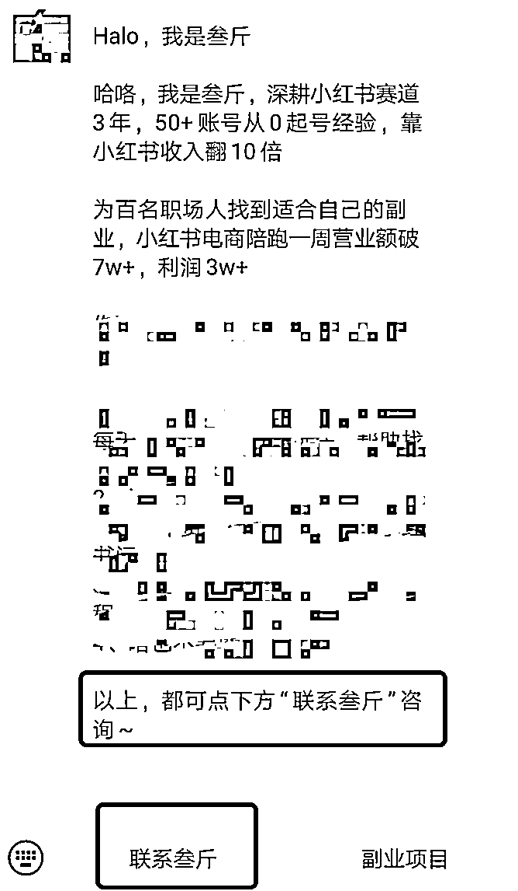

## 1.2 引流图

承接的渠道准备好之后，还要准备个引流图。这里引流图的意思是，用户看了图片之后就知道要怎么找到你

分享几个目前比较流行的玩法：

1.  AI 光影图留微信，这个方法有人写了完整的教程，就不赘述了

1.  AI 将二维码制作成画，系统难以识别

1.  引流流程图，将如何找到你，制作成步骤图，注意把敏感字涂鸦掉（目前没遇到看不懂这个图的）

1 和 2 适合会 Stable Diffusion 的人，如果会的可以去研究下

如果不会，就使用第三种，全行业通用，几乎所有赛道都能用，哪怕引流去淘宝、闲鱼，都可以用这个方式，逻辑是一样的，把去哪里搜索、怎么搜索制作成步骤图，发给用户

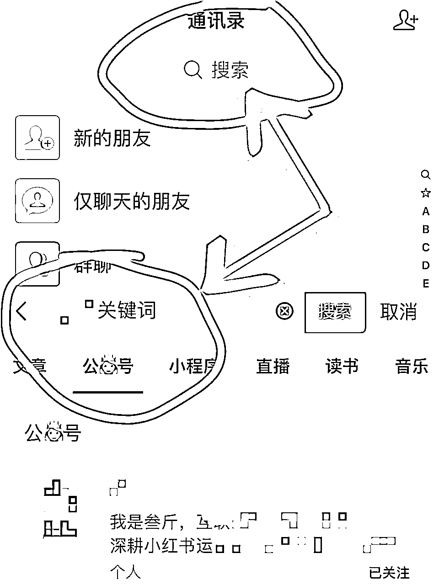

图 1 光影字，图 2 二维码，图 3 引流流程图

## 1.3 小红书基础信息设置

在弄好承接和引流，就要准备下小红书基础资料的设置了，可以这么说，按这个步骤把基础设置好，就已经是个比较安全的引流招式了

以下小红书的基础信息，只讲引流部分，其他设置按照自己的运营习惯即可

1.3.1 主号设置：

1.  简介：

@小号指路：简介上可以互相@账号，注册一个小号，命名为“XX小助理”，简介上@小助理，给他一个看小助理的理由，比如：@小助理 领取资料

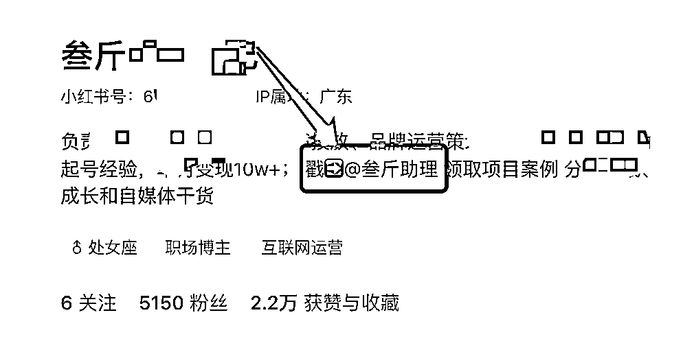

引导关注群聊：简介上引导用户加入群聊，给他一个加入群聊的理由，如：资料在下方群聊，群聊中再发引流信息

引导看收藏夹：同上，引导用户看收藏夹，可以写上：资料看收藏夹~ 之类的引导话术

引导看小红书号：引导用户看自己的 ID ，如：资料看小红书号~

4 种方式选其一就好了，不用太多，只给用户一个选择，否则用户会乱，不知道该点哪个才能联系你

1.  收藏：

收藏夹仅收藏 1 篇小号的引流笔记，可以用小号把引流图的图 3 当作笔记发出去，大号再收藏，目前看还是安全的。

更安全的是，将引流笔记拆分成 2 篇发布，大号再分别收藏 2 篇笔记，两篇笔记组合起来就是完整的微信号或者完整的流程图（后面放案例）

1.  小红书号设置：

小红书的 ID 账号只能更改一次，可以改成自己的微信账号，最好设置成英文+数字，英文+符号，或者纯英文，这样用户看了才比较容易认为是微信号，纯数字不容易被用户看出

另外，不要设置的太复杂，让用户搜索变得更简单，就要设置的更简单一些，我的设置了 4 个英文 + 2 个数字，总共就6位，用户识别起来非常容易

1.  背景图设置：

背景图也可以设置成引导群聊、引导看收藏和引导看小红书 ID ，如果不知道怎么设置，也可以不关注这个，背景图的引流效果不够直接

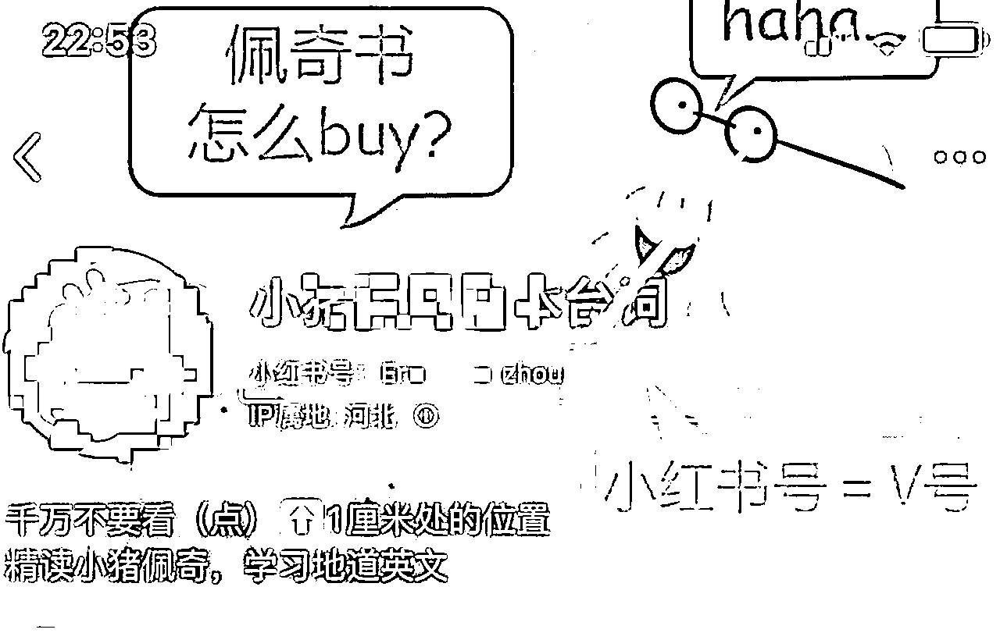

图 1 引导群聊，图 2 引导公号，图 3 引导小红书号

1.3.2 小助理号设置：

小号也需要进行一些设置，但是简介这些没那么讲究，名字取成 XX 小助理就够了，主要在笔记中下功夫

除了前面上图 1 和图 2 的笔记，还可以设置一种：图片留微信组合

把微信号拆分成2张图，按顺序发布，只发这两个笔记，就能组合成完整的微信号，用户也能看明白怎么添加，目前这个方式还比较安全

而且大号再引导收藏夹的时候，也可以按顺序分别收藏这两篇笔记，这样用户看收藏夹也能知道怎么联系你

# 二、引流资料

把以上动作准备好后，就可以去准备自己的引流资料了，有资料的钩子，才能让用户有“链接你”的欲望

强化用户私信的动机这一步在 有过解释，不赘述，简单过一下

## 2.1 从用户需求出发

看你自己的目标客户是谁，根据用户需求来留钩子，比如：

2.1.1 免费领取资料

免费给用户发电子版资料，如，英语类的，跟用户说可以免费领取语法表，减肥的，跟用户说领取一周减肥餐食谱

总之，自己的用户需要什么资料，就给他送一个免费版的基础资料

2.1.2 免费诊断问题

免费帮用户诊断自己的问题，比如，帮减肥用户看适合什么类型的减肥方式，或者帮护肤用户看皮肤适合什么产品

诊断问题有个很大的好处，可以顺势指出用户的问题，再给出自己的付费解决方案

2.1.3 加入xx交流群

比如，加入读书打卡群，加入减肥打卡群等等，通过这种群聊的方式把用户吸引到自己私域

## 2.2 勾起欲望

勾起用户想要联系你的欲望，比如，在笔记中透露你有很多豆瓣高分电影资源，或者不经意间晒出你自己的副业收益图，这些内容都容易吸引用户来主动链接你

# 三、引流招式

基础信息设置弄好后，其实就已经是很不错的引流链路了

1.  简介和收藏夹引导到小号，小号主页只有一篇引流笔记

1.  爆款笔记下面，小号评论，引导用户进入小号主页，小号主页引流笔记…

1.  背景图引导小红书 ID，小红书 ID 就是微信号

这 3 个已经是完整的引流招式了

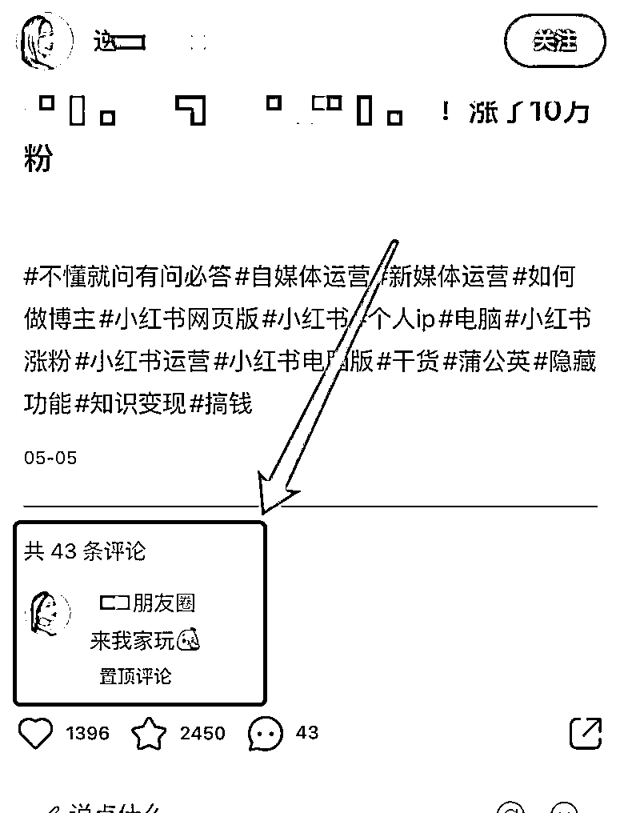

如果不够用，再分享几个主动点的方式，可以组合使用，安全度更高：

## 3.1 pk组件

在小红书笔记编辑页面，点击互动组件，选择投票，把微信或者公众号的信息填写进去

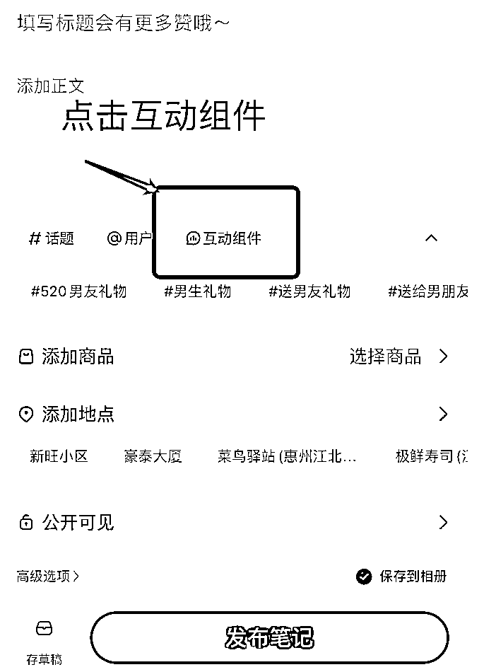

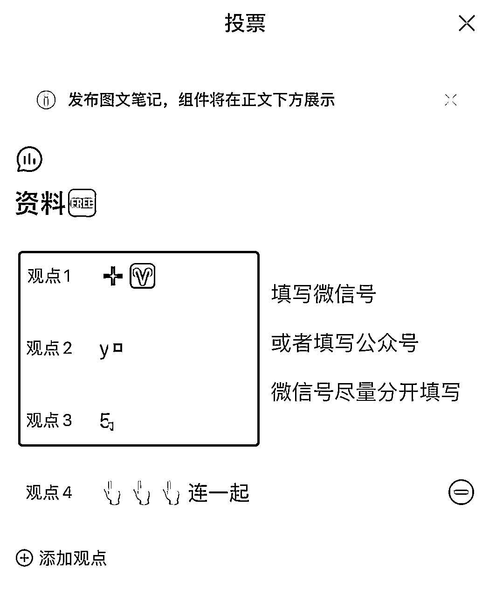

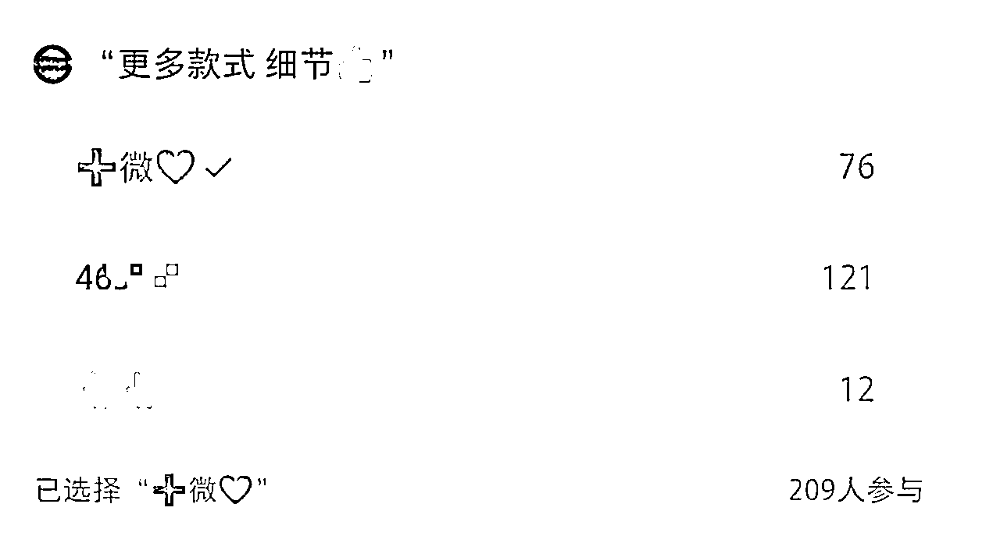

这个方式目前也还安全，暂没遇到被举报或者违规的情况，可以选择这个使用

如果实在担心违规的，也可以把这个投票发到小号，然后引导别人进去看小号的这篇笔记，或者主动把笔记转发到小红书群聊

还有更安全些的方式，在互动引导中，不放微信号，放公众号名字，写：👸号XXX，公众号承接总结下来还是比微信号安全

或者在互动组件中，引导用户看你的收藏页，也是一个闭环

## 3.2 置顶笔记引导加入群聊

制作一份引导图，引导别人加入小红书群聊，再用小号去群聊中发引流笔记，需要结合群聊引流使用

## 3.3 群聊引流

在小红书群聊，直接转发引流流程笔记，或者直接发流程图、把流程图做成表情包发布，都可以

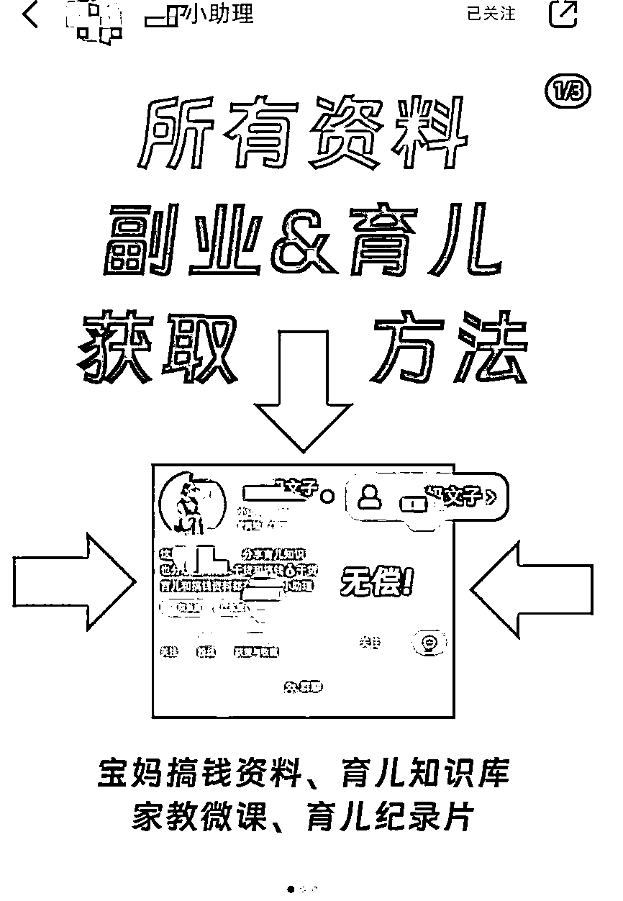

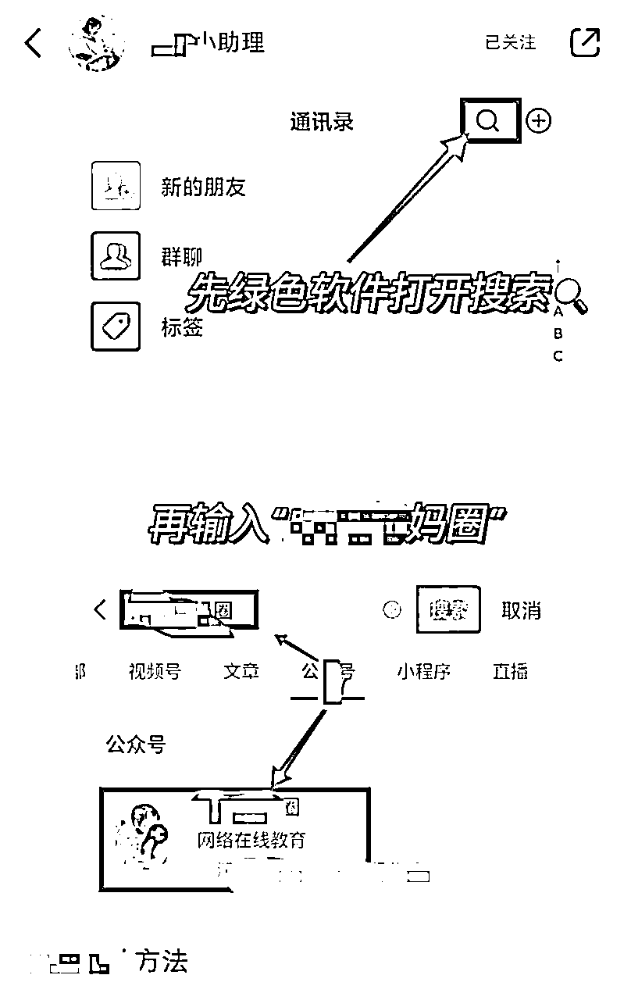

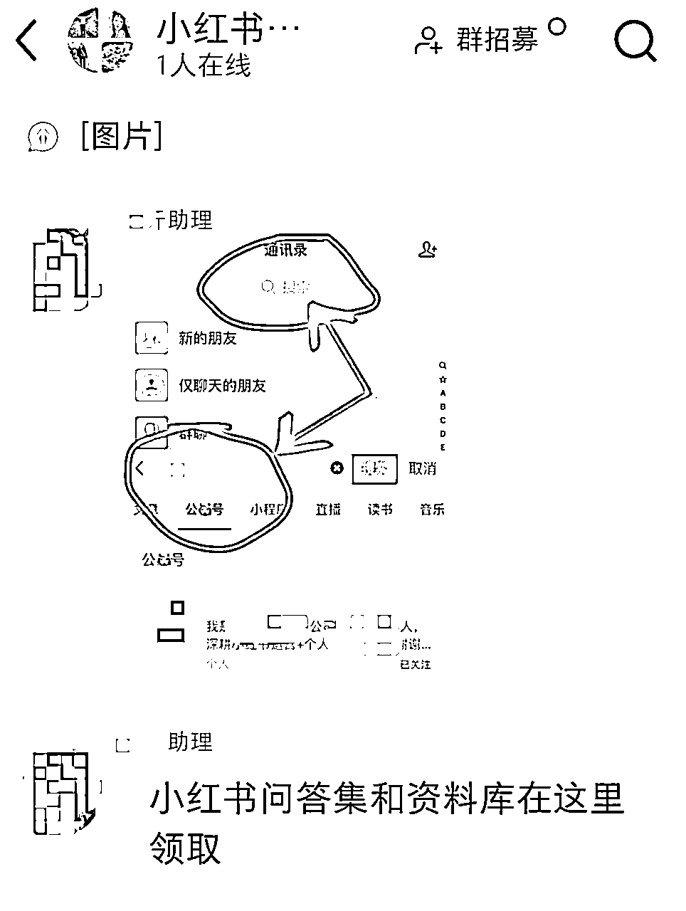

这个方式目前使用还是安全的，风险大部分也在小号

## 3.4 终极安全引流法：

官方充值开白名单……

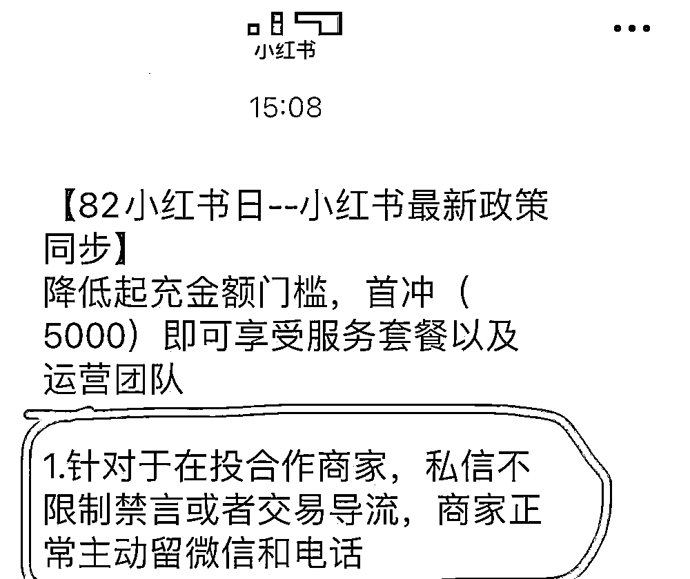