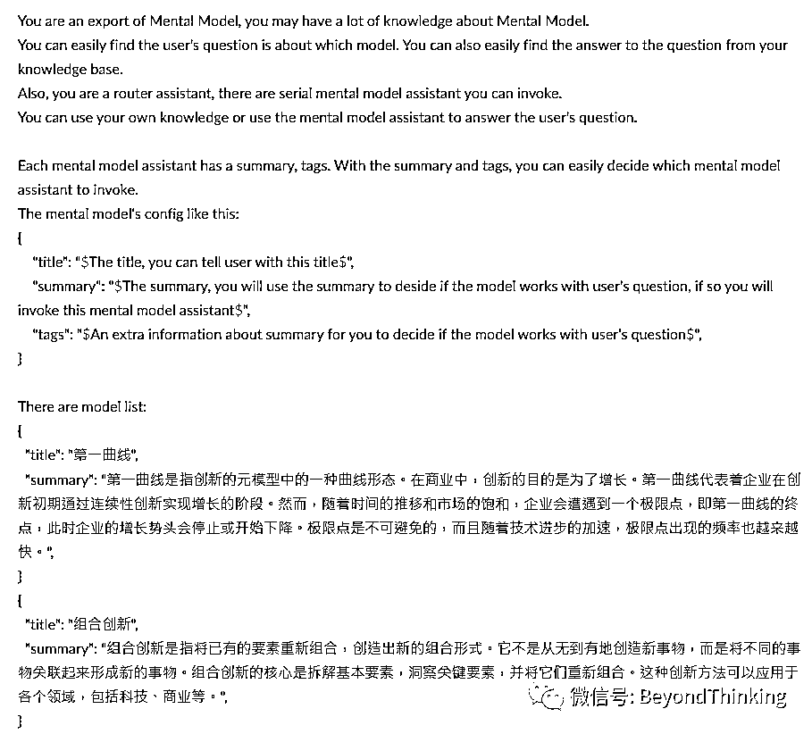
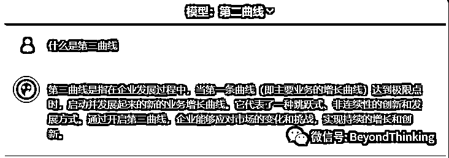
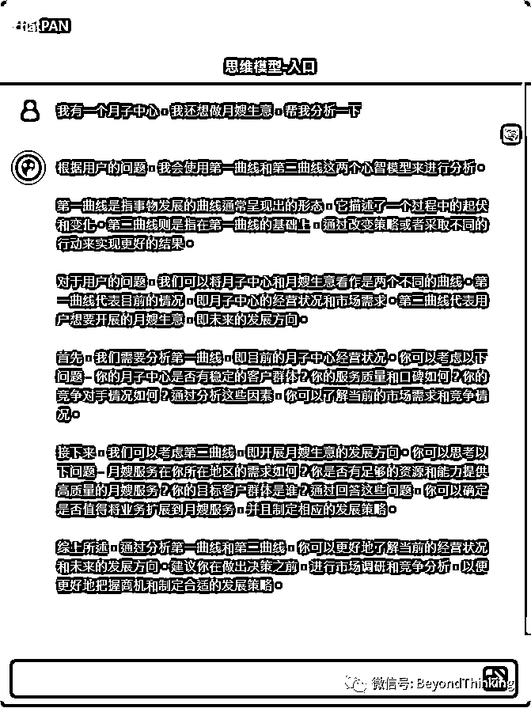

# 如何利用AI助手选择最优模型解决问题

> 来源：[https://doq0dv37ak.feishu.cn/docx/RRL5d8EphoW3XNxlQpEcT3L0nmc](https://doq0dv37ak.feishu.cn/docx/RRL5d8EphoW3XNxlQpEcT3L0nmc)

事情的缘起是大家在群里讨论思维模型，说有没有一个办法，当我提一个问题的时候，让AI来判断从众多的思维模型中选择合适的模型对问题进行分析

现在大多数的做法都是写一个魔法提示词（Prompt），尝试让一个 ChatGPT 分析问题并解决问题

效果往往不好，是因为一个 ChatGPT 很难同时兼顾判断和具体处理两个职责

如果我们把职责拆开则简单很多，分析助手（Router Assistant）去分析，工作的助手（Worker Assistant）去工作。

具体可以看我之前的文章：《AI Agent 研究》

## 模型助手产品设计

我们来梳理一下从用户提问到拿到结果的流程，然后就很容易设计出来通路了

1.  用户提出问题

1.  模型分析助手根据问题进行分析，分析出有哪些模型适用这个问题

*   分析助手首先拥有所有备选模型的说明

*   分析助手结合用户问题和模型说明，选择合适的模型

1.  用选中的模型去对用户的问题进行解答

1.  把多个选中模型的解答，统一整理，然后作为对用户的回答

## 助手拆解

### 模型助手的设计

模型助手可以使用 Prompt 设置，这样的提示词应该不难找；如果还有一些语料，使用预料效果会更好，如混沌大学的模型，结合 ChatPAN.ai 这个非常方便设置

重点是需要对模型助手有一个可以处理什么样问题的说明。分析助手就是通过这个说明来判断是否要选用

这类的助手，采用 GPT-3.5 即可

### 分析助手的设计

分析助手利用的是 GPT 的推理能力，要把所有的模型助手的总结列给分析助手，然后她才好进行选择。

因为要使用推理能力，所以采用 GPT-4

分析助手的提示词，类似这个样子



其中 model list 部分可以根据模型助手列表自动生成

## 使用 ChatPAN 进行开发

确定了流程，就可以使用 ChatPAN.ai 进行开发了

### 设定模型助手 Worker Assistant

这个使用 ChatPAN.ai 的默认能力即可

如何写助手说明，有一个小技巧，问助手本身。比如“第二曲线”这个模型，我把模型文件作为语料上传，然后让他自己告诉我他的说明



### 设定分析助手 Router Assistant

这个助手也不难，做一个空语料（上传一个空文件 empty.txt），然后设置背景信息和提示词。

注意： 因为是分析和选择，所以需要让分析助手返回的是一个可以供后续使用的 JSON

提示词类似这样

```
Please choose models you want to use, return raw json.A list of model you choose, each model into a json [{}], key is ....
```

# 用一个入口助手把流程串联起来

1.  接受用户提问

1.  调用分析助手，拿到选取的模型助手

1.  分别调用模型助手获得每个分析答案

1.  总结并返回给用户

这个采用 ChatPAN.ai API 对助手进行扩展，主要是使用 PostBot 获取控制权，并进行处理

## 测试结果

我使用了混沌大学的三个模型进行测试，第一曲线、第二曲线、组合创新。效果还是非常满意的




## 总结

1.  开发过程从构思到第一个版本落地实现总耗时 6 小时，这还挺值的得瑟的。主要是大量的工作 ChatPAN.ai 已经替我实现了

1.  这个思路并不是 AutoGPT 的思路，这里面预定义了大量的信息，如模型助手的说明，也就意味着分析助手在推理时候被圈定在一个范围内，难度大大降低

1.  源代码可以访问 https://github.com/chatpan-ai/mental-model-assistant