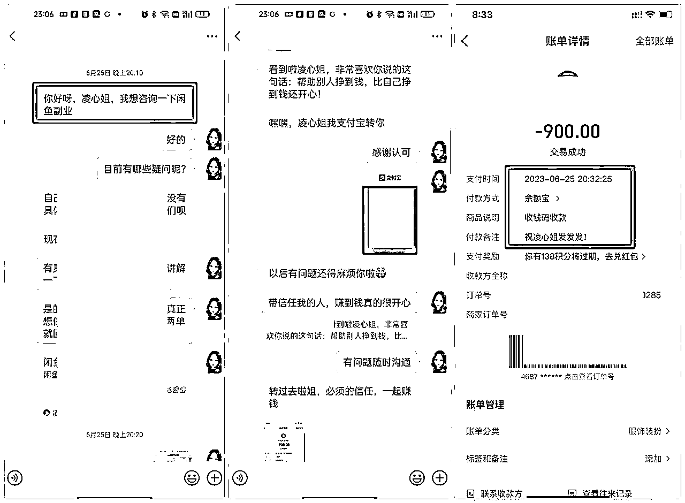

# 靠公众号引流营收百万，适合小白的操作流程，送给圈友

> 来源：[https://p00to5ni4e8.feishu.cn/docx/S7ewdQqtdo8S4VxFdlAcigkYntc](https://p00to5ni4e8.feishu.cn/docx/S7ewdQqtdo8S4VxFdlAcigkYntc)

# 

大家好，见贴欢喜。

我是凌心，带娃十年，线上创业八年，通过自己的努力，实现了在带娃的同时靠自己的努力买了房子，车子，实现经济自由的85后宝妈。

之前，我一直是一个人独自摸索，走过弯路，踩过坑！后来有幸遇到了靠谱，加入了生财有术！在生财有术，我看到了关于公众号的很多玩法，也接触到了最新的关于公众号的风向标“问一问”，瞬间打开了眼界！看到大家都在真诚的分享自己的经验！我也分享一点自己的拙见！

我做副业基本是通过公众号精准引流拓客，通过这一项引流方法，挣到了副业收入百万+，我知道这样的业绩在大佬云集的生财圈里不值一提，但对于一个在家带孩子的全职宝妈来说，我已经很满足了。

做副业离不开引流，有了精准流量，可以在短时间内有正反馈，更有动力去做一件事。而我的精准流量的主平台就是微信公众号。我的顾客大部分都是来自于微信公众号。

现在很多人都在唱衰公众号，为了粉丝苦恼，为了是否能接广告苦恼，还有人为即将来的改革说公众号不行了！但是在我的眼里公众号就是一个宝，我不写爆文，我不接广告，我就是写我自己的产品，精准引流到微信，达到成交的目的，也就是凭借这个小小的技能，让我实现了在带着两个孩子的同时做副业经济收入百万➕，全职在家，也不焦虑，轻松生活。

我写公众号不是为了写爆文，要的就是精准客户！我定义的精准就是上来直奔主题，不废话，在短时间内快速达成成交。

关于如何做好公众号精准引流，从以下几个话题，展开分享。

一，精准引流部分案例展示

二，精准粉丝短时间内成交的原因

三，我为什么要做公众号精准引流

四，怎样做好公众号精准引流，分七个点具体展开阐述

五，公众号精准引流的发展趋势

# 一.精准引流部分案例展示

这个学员5月8号添加我，5月18号咨询我业务，当时了解的差不多了，说考虑一下，然后当天晚上22：02给我付费。

学员5.29号添加，30号咨询，看了凌心的公众号和朋友圈感觉我比较专业，选择在我这边付费

这个学员6.17号8点04分，进行沟通咨询，8点42转账成交

学员25号当天晚上20点10分进行沟通咨询，20点32分完成给我付费~

该学员公众号粉丝，15点17分咨询，15点45分成交.

# 二.精准粉丝短时间可成交的原因

## 1.粉丝精准

粉丝比较精准，他们是搜索到我发布的相关关键词，带着问题来的，问题解决了，接下来就是付费学习。

## 2.自己对所作领域专业

接着第一条的来，来了精准的粉丝，需要自己也要有相关的专业水准，顾客问东，你回答西，那结局就是黄。

利用专业的话术，描述现状，指出顾客痛点，让他认可你，自然也会为你付费。

在这里也牵扯到话术，话术咱们知识星球里分享的很多了，学习＋自己的打磨，还是要根据自己的行业，有一套属于自己语言风格的话术的。

无论什么样的话术，凌心认为要以真诚，真实为基调，为顾客着想，顾客才会选择你。真诚是必杀技。

## 3.朋友圈搭配助力

朋友圈的输出必不可少，精准粉丝来了，你也专业了，结果你朋友圈三天可见，这都有点说不过去了~

以上三点搭配，成交率还是比较高的。

朋友圈展现自己的专业性同时，更是个人IP的打造和深化，公众号+朋友圈互相加持，成交就变成水到渠成的事情了！

我的很多客户，在对比了多家同行之后，最后选择了我！主要也是因为对我这个人的认可，源于我的朋友圈打造！

再加入生财有术《朋友圈运营》航海，看到理白、王子冯等老师的分享，更加深信这一点，业绩也提升了很多！航海虽然结束，航海手册一直在，大家可以深度学习！

# 三.我为什么要做公众号精准引流？

16年刚做副业的时候，我是纯小白一个，在微信上通过微信公众号找到了我的师傅，模仿是最好的老师，我师傅就是通过公众号引流并且做到公司团队排名靠前的，我也决定从微信公众号开始引流之路！

刚开始挺难的，作为两个孩子的宝妈，平常都是带孩子，无社交，那种与世隔绝的感觉还是挺明显的，自卑，啥也不会，一头雾水，各种感觉都有~

但是要把我囤的货卖出去，我刚开始做微商的钱，是我妈给我的零花钱，我怎么能允许卖不出去？！我要卖货！我要挣钱！但是肯定不能指望微信通讯录仅有的42个同学，朋友，我要跟我师傅学习微信公众号精准引流！

问师傅＋自己琢磨，我这个人吧，有时候还不好意思问，记得刚开始一个问题，我各种搜索，搞到凌晨两三点，终于搞定了，哈哈，还挺有成就感。

只要想学，哪能学不会？学会了一个微信公众号之后，我又连续注册了剩余的4个， 那时候一张身份证就可以开5个，于是发布文章，布局好关键词关键字，很快有了第1个精准粉丝，第1个客户，慢慢的有了一个团队有了自己的工作室，仓库~

那时候不知道矩阵的好，光想着自己的号用完了，就每天发布，如果是现在，那么好的产品品牌，我肯定是要多开几个号的~

微信公众号精准引流就成了我的主打引流方法~

从16年到现在也换了几个项目，但是不管做哪个项目，微信公众号引流，是我必须要做的一个引流方式……也真心建议小伙伴们能把公众号精准引流方式给提到日程上来~

# 四.怎样做公众号精准引流？分以下七个点来具体阐述

## 1.注册公众号之初心

既然想做精准引流，就是营销内容为主，先把那些涨粉呀，爆文呀这些放在一边！

我们注册公众号写文章只有一个目的，就是吸引精准粉！吸引对你的产品感兴趣的精准人群。把他们引流到你的微信成交。

不要老想着出爆文，提升阅读量，接广告，还想着吸引粉丝，甘蔗没有两头甜，光吸引精准粉丝这一头也挺甜的~

我有一个公众号5个粉丝的时候也成交了10000+，精准比啥都强。

虽然没有大流量的爆粉，但是能够细水长流，保持收入。

微信公众号注册步骤奉上，需要的伙伴可点击了解：微信公众号的申请、设置、排版，引流，每一步都超级详细，文章有点长，具体可点下方链接了解，按照步骤操作：https://mp.weixin.qq.com/s/QWlYZm5pfe41OT-6H_YDsg

## 2..建立公众号精准引流之类别

其实这个就是你做公众号的定位，根据学员反馈和我的一个实际操作情况，我把这个定位分为两类：

### 类型1：纯产品，无人设。

这种就是单纯的只写产品，比如你卖产品A,那你的名字可以以产品a为关键词来展开,可以品牌名＋产品名，地域名＋品牌名＋产品名，来注册展开。

比如我之前做的一款产品，聚米婧氏牙膏，我注册的公众号名字是：聚米婧氏牙膏总代，河南聚米婧氏牙膏总代，聚米婧氏牙膏微商货源，聚米婧氏牙膏官方总代，类似的，以产品关键词名字延伸去注册就可以~

还有更巧妙的一点，可以稍微官方化，比如当时我老大的公众号名字是：聚米文化

不知道大家有没有这样的心理，做一款产品总想找到货源，总想找到官方，觉得这样更有保障，觉得这样学到的东西多一些。

当时我是这样想的，就关注了聚米文化这个公众号，关注之后，自动回复我，给我推荐公司业务比较好的代理，让我添加微信去联系。

我当时就是以纯微商小白呀，就屁颠屁颠的加了微信去联系了，后面做了一年多才发现原来就是老大的套路我我老大真的挺好的，认真负责，我好多人微商理念也是跟他学的，对我以后的成长也有很大的帮助

后面我做了公众号之后，也仿照老大的方法注册了一个，聚米婧氏文化，反馈还不错！所以起名字也很有技巧的，包括我现在操作的资料项目，也起了一个类似的名字，流量比其他的偏高。

所以如果你有这方面的产品，公司有允许的情况下，你可以去搞个这样的号，搭配你其他的产品号一起来做，效果翻倍~

（以上公众号不用再搜，大概率都不在了，因为这个品牌19年的时候已经陆陆续续不再做了）

再比如对于做资料项目的伙伴，资料里面分为教资类，考研类，建筑类等10多个领域，你可以单独注册单独类别的公众号，教资资料学姐某某，教资资料库，我要过教资，某某教资笔记等等，具体可以去搜一下！

同样的其他领域也可以仿照这个方法，那你是不是有很多公众号名字就来了，精准领域去划分客户更精准变现更快速。

在这里凌心温馨提示，尽量分类别去做，不要一个号里什么都发，乱糟糟的，反而会降低客户信任率！

这是我的踩坑经验，比如我之前刚做资料的时候，一个号里发的有教资，也有建筑，就感觉发发教资涨粉了，发发建筑又掉粉了，有那种拉扯感！

顾客还是想要一个专业的指导人士的，你发一个八竿子连不着的领域，效果也很不好，后面我调整了战略，一个号做教资一个号做建筑就效果好了很多~

同理，你做别的项目也是一样的~

### 类型2：人设型营销文

纯粹的产品号会吸引一些购买产品的人，可变现，无粘性，但是如果说你做个人设文公众号，吸引的是认可你的人，不仅仅说会跟着你做，当下需求的项目，或许你有另外的项目也会咨询添加。

比如凌心笔记这个公众号，我之前就是做学习资料的，偶尔穿插一些闲鱼副业方面的，（实际上闲鱼我是在另外一个号上单独操作的），咨询资料的学员也会咨询我的闲鱼副业项目。考虑之后也会根据自己的情况做一个或者做两个。

在人设文的写作文章里面，必须要有你的营销产品做基础，刚开始要铺设一些产品的关键词关键字，因为本身是营销号，要靠这些关键词关键词去把人吸引过来。

吸引过来之后就是你的主场了，人设类公众号你不但要写产品，还要写自己的生活，自己的经历，开心的，不开心的感悟的，都可以写在里面，这样你是一个活生生的立体的人。

为啥我的客户加上来之后，有的问都不问直接就付款，因为他已经对我足够了解了，通过的产品了解了产品，通过我的人设文了解了我这个人，通过我的一些反馈话语，知道了在我这里边是有所得的，同样都会付钱，会选择一个比较转业的人~

两个类型的垂直领域的公众号也可以互相引流，增加粉丝黏度~甚至你的多个公众号都可以根据情况不同程度的相互导流，这一点根据具体情况而定。

## 3.微信公众号精准引流之重点

确定要做一个精准引流卖产品的公众号之后，接下来就是写文章，布局相应的关键词了。

你要做什么产品？你要卖什么货？就要把相应的关键词，设置在你的标题和文章里。

标题在带上关键词的同时一定要吸引这样，在同行对比的情况下，打开你的文章的几率才会大！可以用惊讶，反问的语气去写，比如：宝妈做闲鱼鱼卖货，真的赚钱吗？ 哇塞，做闲鱼两天收入5000+?!

也可以用叙述的口气去写，那这种方式的话要都是纯干货展示，比如。超详细的闲鱼卖货操作步骤，建议收藏。 考教资笔试超详细的备考流程！

还有其他方式，比如：23年做副业，你一定要了解这个副业项目！

关于标题，一个好的文章标题能给你吸引大把的流量。

文章内容部分，这是你精准引流的主战场，一定要去尽可能多频率的穿插相关的关键词关键词。这样顾客在搜索的时候，你的文章被搜索到的几率才大。

具体关键词怎么找，大家可以查看，5118这个工具，不用付费，用免费部分就可以了。

另外也可以模仿同行，看看同行哪篇文章阅读量比较多，你也来搞一篇，也是比较不错的方式！但是只是模仿哈~

精准流量是通过搜一搜的方式添加来的来的 ，所以你的关键词关键词的设置在一定程度上影响到你的流量问题！

所以这一块一定要上心用心去做！

但是关键词关键字也不是胡乱堆砌的，我看到有的同行满篇都是关键词，那这样的话呢，也会影响到搜索排名，要很巧妙的将这个读者想要了解的答案设置到文章里面~

多写，多练，有了网感之后，写一篇文章就挺简单的了。另外写文章尽量要原创，会提高你账号的权重！账号的权重真的是太重要了，我两篇文章当时为了追热点发了同一个内容，新号就被死翘翘了，老号依然纹丝不动 。

鱼和熊掌不可兼得啊，我有的纯营销号没有标原创或者标原创比较好，流量也是不错的~

有的营销文可能写不到300字可以不标原创，但是你不要去找一个同行的复制粘贴上！

另外产品介绍文章难免会有一些重复，不是自己的也不要原创，所以说营销文，我原创的就比较少，除非是自己的感想，就给他标个原创了。

在这一部分重要的就是关键词的铺设，不管是人造文还是人设文，你get到了吗？

## 4.微信公众号精准引流避坑

首先就是涨粉问题，精准营销一定要和那些爆文区别开来，爆文赚的是流量主，接的是广告费，咱们做精准引流，就是卖自己的产品，自己的服务！

说直白点，可能你的粉丝不会关注你的公众号（特别是纯营销文），但是他会通过你留的微信号添加你的微信，这样你的目的就达成了，在乎那个粉丝量干啥呢？

我有的公众号，两个粉丝就变现了~你写的就是他找的~他有钱，你有产品，这样交易就完成了

别在意你的粉丝数量，有的学员，我真的理解不了，费劲巴力的要500个粉，要开通流量主，对于精准引流的公众号号主来说，开通流量主真的不重要，为了那块儿八毛的流量主费用，真不值得发愁，浪费时间。

我一个做教资资料的公众号，在距离考期比较长的时间内，一天也就增加一两个，最多不超过10个，但是在考前10来天，特别是押题急救卷出来的时候，稍微加一些引流策略，那粉丝是哗哗的涨~考完笔试，考面试，等他都考过，拿到证之后，你这个号也没啥价值了，他就取关了。

明白自己的定位，挣钱就好，其他的都是虚无~

所以保证自己的输出，能够吸引来精准粉丝就完全可以，这样我们的目的就达成了~

千万别搞一些爆粉动作，比如前一阵我搞那个行程码，搜索功能被限制，好几个同行也因为这个动作导致账号搜索功能被封，过度的发同样的内容，频繁的发，一次八篇的去发，系统对你是不能容忍的，势必就会对你的账号产生不利的影响，甚至被搜索不到，所以还是要尊重平台的！

同时我一个老号也写了，没有一点关系，还是要注重权重的，新号写自己的产品正常写就行，不要搞一些花里胡哨的！万一被屏蔽搜索功能了就不好玩了~23年有一大批不注重运营的号主被限制了搜一搜功能，有的花钱找人家解决，据我了解到的，还没有能解决的方法。

我前面讲到的那个号，被限制了搜一搜功能之后，我去找过客服，被告知已经限制了搜索功能，且不予解封。没办法，我就注销掉了。

注销掉，重新注册，我这边实际验证是不影响的，注册后，发文两到三篇，又可以搜索的到了。如果你的号，被限制了，个人建议注销即可。

## 5.公众号精准引流之矩阵

做矩阵引流，真的是太香太香了！我做的是个人订阅号，我刚开始做的时候是一个身份证，注册了5个微信公众号，每个公众号注册不同的产品，领域，名称，虽然阅读量不高，但是吸引了初期的一些精准粉，有了自己的小团队~

在精力允许的情况下，一定要多开多号去做产品引流，所谓东方不亮西方亮，不知道你的客户会宠幸你那个公众号。限制一个人只能注册一个微信公众号，账号问题可以找家人注册后台设置那里把授权授权给你就可，你就可以正常登录了~

或者也有渠道是可以销售的~根据需要进行采买。我是用家人的号进行操作的，没有购买~一刚开始先做一两个，上手了再去搞多个 ~

## 6.公众号精准引流知之多项目玩法

对大多数人做副业的人来说，肯定是挖一个深度，再去做广度~

我刚开始也是这样做的，一直做一个品牌，一个项目~

我是全职带娃全职做副业，现在孩子大了，基本上我除了做饭赚钱都不怎么管了，所以还是有很多精力的！

于是我就尝试了多项目操作，比如现在做的正版学习资料项目＋闲鱼副业项目，做好时间管理，多项目本身也不难，就公众号上写写，找个微信号承接一下就OK。

因为写产品的公众号真的不浪费啥时间，十来分钟就可以搞定一篇，并且可以积累，沉淀，这个感觉就跟矩阵做公众号是一样的，这个项目不开单，那个项目开单能够保证每天都有收入~

公众号精准引流的路径是很短的，顾客看到，需要，直接添加你微信就可咨询，链接，不像别的平台那样，还要多一个引流步骤，这一点真的很稳定。

另外别的平台的账号，比如某书，某音，动不动就限流，封号，对于这点，微信公众号真的蛮抗打的，遵守平台规则，一般不会有啥大问题 。

所以如果你也是精力比较允许，可以尝试做两个项目，就跟别人上班做副业一样的道理，只不过我们把上班改成了另外一份副业~

保证自己每天都安排的满满当当，并且收入也挺香的。只要你去做，单单是公众号精准引流这一项技能，就不会让你为没有客户而发愁。

很多人说：凌心，你好厉害呀，一个人天天两个孩子，还能把副业做得这么好~其实并不是，只不过说我是掌握了正确的方法而已方法对了，一切也就水到渠成了 。

## 7.公众号之私域对接部分

准备工作做充分了，接下来就是展现你实力的时刻了~

顾客是添加上我们的微信进行成交的，我们彼此添加上好友的那一刻，我相信更多的人是先点击彼此的朋友圈看一看。

你朋友圈的丰富程度，专业度，基本上决定了你的客户会不会给你付费，所以朋友圈这一块儿，从昵称，背景图，个性签名，发圈条数，发圈小技巧，等等这些方面还是要兼顾到的！

你的精准引流＋朋友圈打造，很大程度上可以提高你的成交率！

其次我们在公众号上写了文章，也可以多平台去分发的，比如知乎，贴吧，百家号，简书等等~

如果说从别的平台来的客户加到了你的微信，那这个时候你的人设文公众号就派上了用场！

去为一样东西付费，在他不清楚不明白的情况下，肯定是先了解你这个人~为信任你这个人而买单！

所以凌心建议将你的人设文公众号时不时的发在你的微信朋友圈里和别的平台上来的顾客，作为承接，促进成交 。

# 五.公众号精准引流的发展趋势

## 1.问一问+视频号+公众号+微信，四方联动

微信问一问的推出，可以说是自媒体创业者的一个红利，微信问一问，是一个微信版本的“知乎”，微信服务超8亿用户，微信问一问的问题搜索流量还是比较精准的，如果你的答案是客户想要的，客户给你点赞之后，会直接出来一个让关注你视频号的界面。或者客户对你的答案比较感兴趣，也可以直接点击你的头像，出现让关注你的视频号的界面。

那么，在你的视频号里，绑定你的公众号，等于说又增加了一个进入公众号的入口。来的顾客还是比较精准的。

目前，很多人都在布局，且取得了不错的结果，值得一试。

## 2.做自媒体必备技能

很多人都唱衰公众号，但是却有很多人在公众号取得了一定结果。做自媒体，无论是销售别人的产品，还是自己的产品，在人心浮躁的今天，文字平台依然是比较好的引流方式。能够沉下心来，看完你文字的人，翻完你公众号文章的人，一定会对你以及对你的产品有一个深刻的认识，进而链接到你，达到快速成交。

就先写这么多啦，个人拙见，希望能对一些伙伴有帮助。

我是凌心，一个85后俩娃宝妈，带娃十年，线上副业8年，靠自己的努力，也靠着精准引流这一招实现了经济自由！

做项目，有了精准引流的方法，做出业绩真的不难，可能有的细节没写到，欢迎圈友们交流指正。