# 做多多无货源三年，从负债50w到月销200w

> 来源：[https://tq2j3an9pdi.feishu.cn/docx/SNzadSqHEo73BbxtSAlckPvMnec](https://tq2j3an9pdi.feishu.cn/docx/SNzadSqHEo73BbxtSAlckPvMnec)

大家好，我是锦李，坐标天津，大学毕业后任职国内某上市公司女装督导，2018年辞职电商创业。

近三年一直在做多多无货源店群，从高峰时期的近500家店铺到被合伙人骗走所有资金再到今年逆风翻盘，我唯一在做的就是坚持，坚持到现在终于迎来曙光。废话不多说，直接上正文。

# 无货源店群发展

多多无货源大家都知道，通过大批量在平台开店，然后去淘宝、多多、抖音等平台采购下单发给买家，以绝对的开店数量和产品数量来赚取利润，21年的时候，公司大批量开店，手里的执照和开店手机卡数量已经数不清了

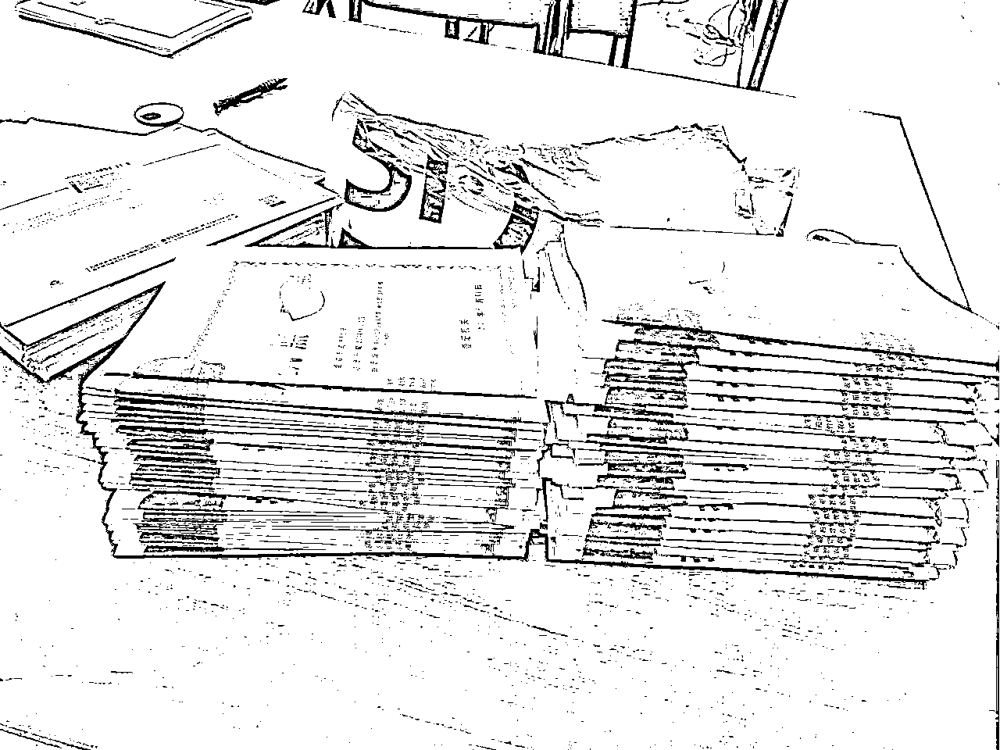

# 平台红利

当时最火的玩法是大额优惠券（把商品价格统一设置1000+，再利用软件批量设置限时限量折扣同时匹配大额优惠券卷），平台有大额满减的流量红利，这一波真是很多人翻身的机会，我们入场较晚，只抓到了尾巴的流量，单店利润一周破2w+，找到了当时的一张截图为证

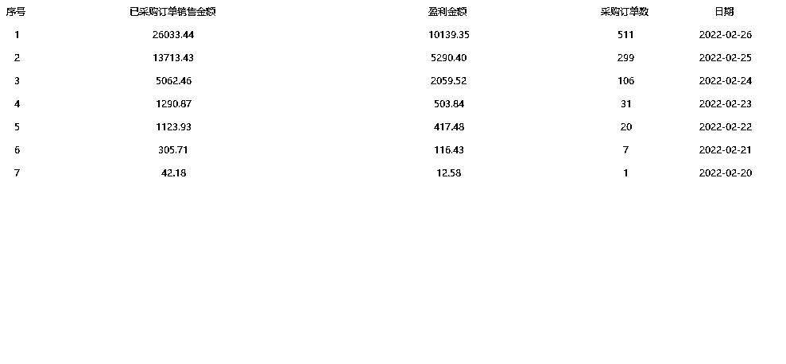

到了22年春节后，公司计划继续招人疯狂铺店，但平台相继出台一系列政策打压无货源，店铺进小黑屋（屏蔽店铺展现），二次单号限制推广等等，导致团队收益断崖式下滑。记得很清楚的时间是正月初八那天，团队初六复工，初七开会计划扩大规模，初八带团队出去聚餐，这一餐大家都很开心，对未来的期盼，每个伙伴都在憧憬，我也在期待着更高的风景，不巧的是晚上回来运营和我说，店铺全部断流了，这一夜集体开会找问题，给同行打电话请教，持续几天大家都没办法，多多店群的好日子彻底结束了。

# 公司倒闭

这一切还没完，坏消息真的是一个接一个，分公司的合伙人卷钱跑路，我为他背锅，牵涉了几家银行的贷款高达50w，公司一切停摆，当时正值YQ爆发期，跟了自己几年的员工真的不忍心让他们没有工作没有收入，自己扛了几个月以后。掏空六张信用卡，给所有的伙伴们发完最后一个月的薪水，关闭公司，这一切如若梦境，没想到自己的付出全部付诸东流。

三月份我通过朋友找到他，到现在还记得和他谈话的夜晚，开始我们俩足足对视了几十分钟，没有争吵，当时的怒气，已经让我的神经极度错乱，我不知道，如果有一把刀我要捅他多少下。当时我才知道他钱全还了高利贷，自己玩网D输了几百万。本以为可以追回的资金，全部打了水漂。由于当时心软，大家都不容易，钱拿走了，把店铺留下，那就好聚好散吧，钱及时还我，其他的就不追究了。没成想这一决定足足让我扛了很长一段时间走不出来，这一时期连续几个月每晚都辗转反侧难以入眠，身边几周不见的朋友看到我第一句话全部都是在感叹，你怎么了，没生病吧？

没办法，生活还要继续，我还要继续向前啊，在这个契机下，22年的418加入了生财，说实话当时脑子是懵的，创业失败合伙人跑路又负债累累，整个人都很疲惫，进来看到圈友们一个比一个优秀，在商业思维认知上，真的大开眼界，看到了大家都这么努力，我这点经历又算得了什么，一时失败不算失败，逆风翻盘才是真的牛批。

这个时候只有我自己和一个留下来的兄弟，我们两个担任运营、美工、财务的所有工作，很感谢好兄弟的陪伴，也正是有了他，我也才能有继续做下去的勇气。期间我们测试了多多的全站推广配合大额卷玩法和全站推广薅投产的大量玩法，每个月收入勉强维持我们的开支。

# 关于生财

当时加入生财的目的很简单，就是想赚钱。期间一直关注着圈友们发的一些项目，自己也去尝试了很多，有过成功，也有过失败。

## 视频号

每天都在看精华帖，风向标，好的文章会收藏下来反复阅读，直到出现视频号的航海，大家都在讨论这个赛道的红利和未来的发展，以前对短视频和直播不了解的我跃跃欲试，一定要下场搞一把，最终的结果是失败收场，为什么失败呢？剖析如下

1.  准备不充足，匆忙的选品上架铺视频，选品数量太少导致没有爆款出现

1.  视频爆就开播，出现了小爆款，经过验证产品也是平台的热销品，但是没有坚持下去，开播时间过短

1.  最主要是心态问题，在视频号带货这个项目上很快出单，很快赚到第一块钱，但是心急，大量铺号，选品经验不足，导致正反馈速度极慢，在当下那个境地的我，虽然懂得要延迟满足，身上的负债压得人喘不上来气，可能没有经历过的人感受不到，根本没时间顾虑那么多，心态不稳，一切白费

## 美团电商

十一月看到圈友刘家齐的神帖《同行一句话让我抓住美团电商红利狂开30家店》，深夜看到这篇文章就立马去美团电商看产品，对比和其他平台的价格，验证下来确实大有可为，第二天马上开店买授权。

可能是不甘心吧，也可能是通过电商赚到第一桶金，咱就在哪里跌倒哪里爬起来，直接干开3家店，先不管结果如何，只要下场就会有收获。非常赞同他说的话：一张执照，一个公户，甚至是保证金就可能劝退很多人；但是创业不就是这样吗？遇到问题解决问题，既然想去做那就无视一切困难去执行。这个项目最后跑通且盈利，找到了当时的部分截图（利润数据就不放了，利润率都在50%以上），整体大概盈利20w+

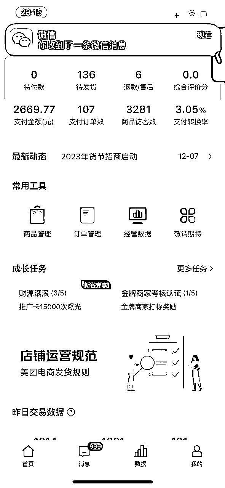

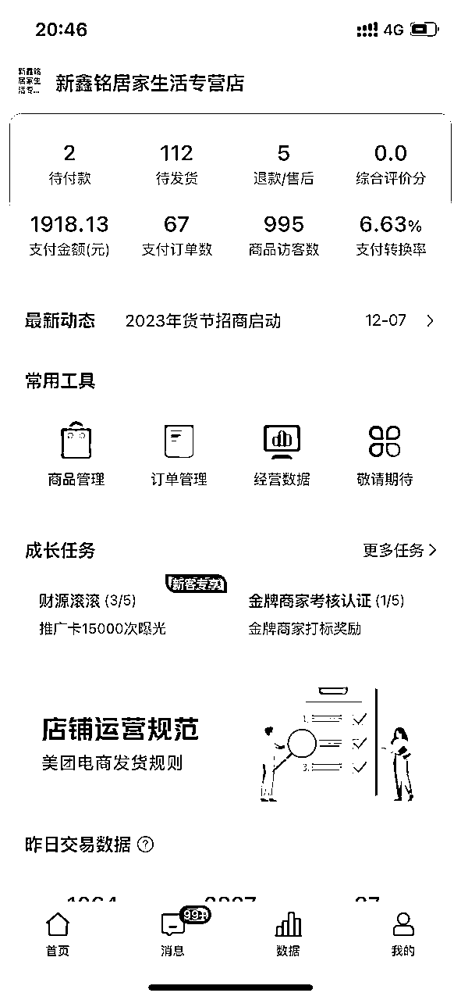

## 小红书

关注到这个平台是看到有人在做虚拟资料引流，从最早的学科资料再到现在的万物皆可虚拟，万物皆能引流。这么好的平台当时不能错过机会，本着广撒网，多捞鱼的原则，躬身入局去做账号，没想到第一篇就爆了。

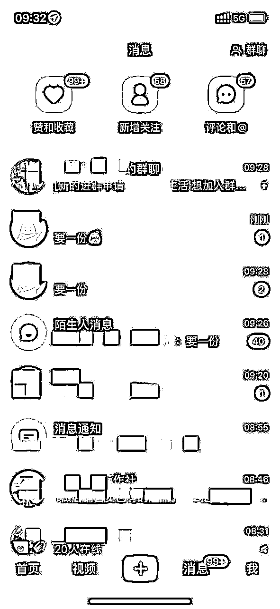

小红书做起来真的毫不费力，做之前用两天时间看遍了生财关于小红薯的所有帖子以及风向标，精华帖看3遍并做好笔记以及细节的sop，我的流程是：

1.  确定账号定位（人设定位、变现定位、内容定位）

1.  确定对标账号，同行是最好的老师。找到30个对标账号，扒出来对标近一个月爆过的选题，记录50条以上

1.  爆过的选题去搜索，找到更多的标题和内容，每个选题记录3条不同的内容，这样收集下来150+的爆款笔记，分析他们的文案结构

1.  确定封面，找到对标账号的爆款封面，统一放到ps里面，用参考线标记好位置（文字，图片比例等）

最后撰写笔记就水到渠成了，真心建议圈友下场前多看生财的文章，不仅起步快还可以避坑。

# 多多店群新机会

经历了从店群的疯狂铺货-精细化选品-大额优惠券-全站薅投产再到今年店群强付费，足足三年时间把精力放在这上面，有时候突然发现倔强也是一种勇敢。终于在今年突破月销售额200w，净利30w+。

很多人都说，现在的平台红利是小红书电商、抖店商品卡、视频号投流带货，甚至提起多多，最多的讨论是：狗都不干，确实是这样啊，仅退款的折磨，平台无缘无故的罚款，真的让人难受。同时辩证来看，这也是一种机会，大佬看不上，小白不会做，夹层中的中小玩家才有机会啊！很多难题，当你颠倒一下看，就不攻自破了。为什么以前做事没有结果，惯性思维害了自己，现在尝试着反其道而行，反而有意想不到的收获。

## 反者道之动弱者道之用

很多项目的本质就像挖矿，挖完，撤退，换一个，再挖

享受挖矿刺激的人又忍受不了播种时等待的落寞，最终矿没挖到，种下的种子也没结出果实

这并不是坏事，凡事都有两面，这个矿里没有果实，那个矿里可能也不会有，只要心里存在这个果，那就总有一个矿在等着我们。

## 精神不死，奇迹不止

说了这么多给大家分享下我是如何通过多多无货源做到月销200w,并还清负债重新站起来。

（部分店铺月数据截图）

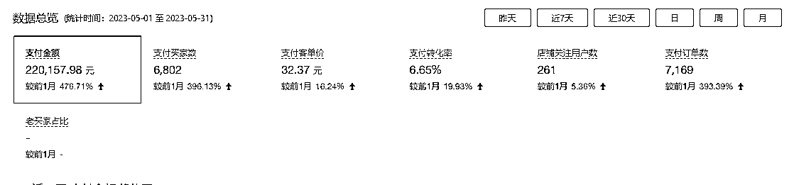

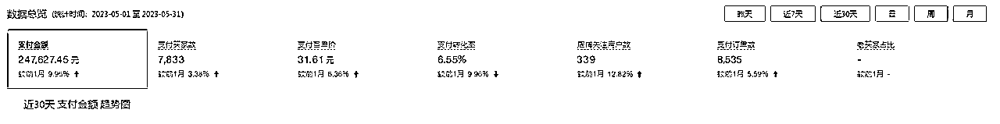

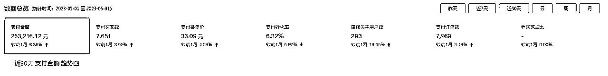

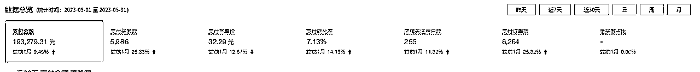

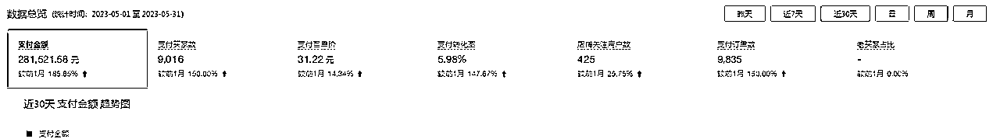

目前几乎大多数平台玩家都在做付费流，免费流量枯竭，各大平台没有增量，多多也不例外，从去年推出全站推广这一广告形式便可见一斑，为了平台的高质量转型，大力提倡卖家做高客单价产品，提升产品质量。上半年测试出来多多的强付费玩法就是通过全站推广这一工具实现盈利。

强付费的原理就是通过广告费换取订单，最后通过持续付费来营利。

做电商生意要有一个闭环，需要三方收益。平台-卖家-买家

目前强付费的做店方式可以完美实现闭环。

介绍下平台不同的推广方式：

1.搜索自定义（传统的关键词出价，带来泛人群）

2.搜索OCPX（按成交出价扣费，人群比较精准，人找货的方式）

3.场景OCPX（按成交出价扣费，场景的曝光相对而言都是比较高的，所以受众范围广或是应季使用场景比较合适，类似于货找人的方式，泛人群）

4.全站推广（按ROI投产出价或者成交出价，是所有推广的集成，包括搜索OCPX，和场景OCPX，一些资源位，营销页面等等）

## 起店流程

强付费起店的流程：选品-上架-改销量-开启推广

### 选品

选品3要素（热度、竞争强度、畅销榜）

方法一：畅销榜热词选品

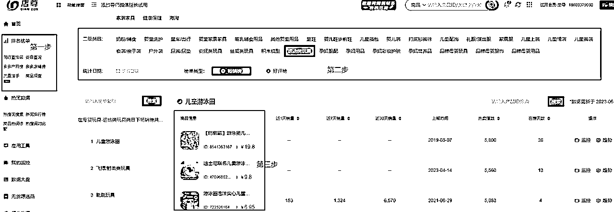

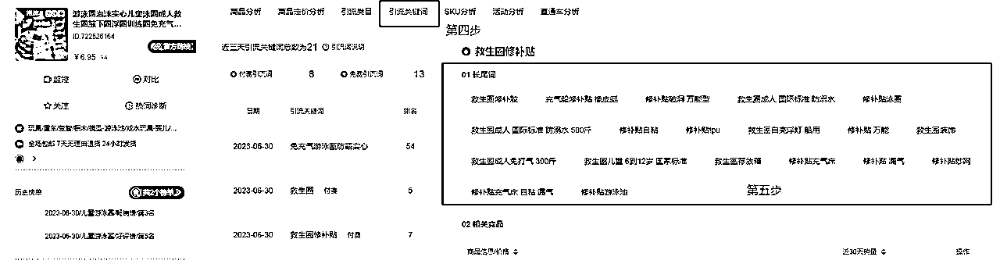

这个方式的原理是通过在店尊官网选到多多榜单产品的引流关键词，通过引流关键词的长尾词再去淘宝选品，选择月销量500以上，店铺的动态评分在4.8以上且能48小时内发货的产品，每个大的长尾词选择3个品即可（以上图举例，在二级类目中找到运动类玩具，选择产品链接点进去，然后看该产品的引流关键词，通过上图的长尾关键词去淘宝选择合适的链接）

方法二：时效性，季节性的产品，提前1-2个月布局。多多的抓取逻辑是高在线时长的链接系统会优先抓取，可以看图参考下

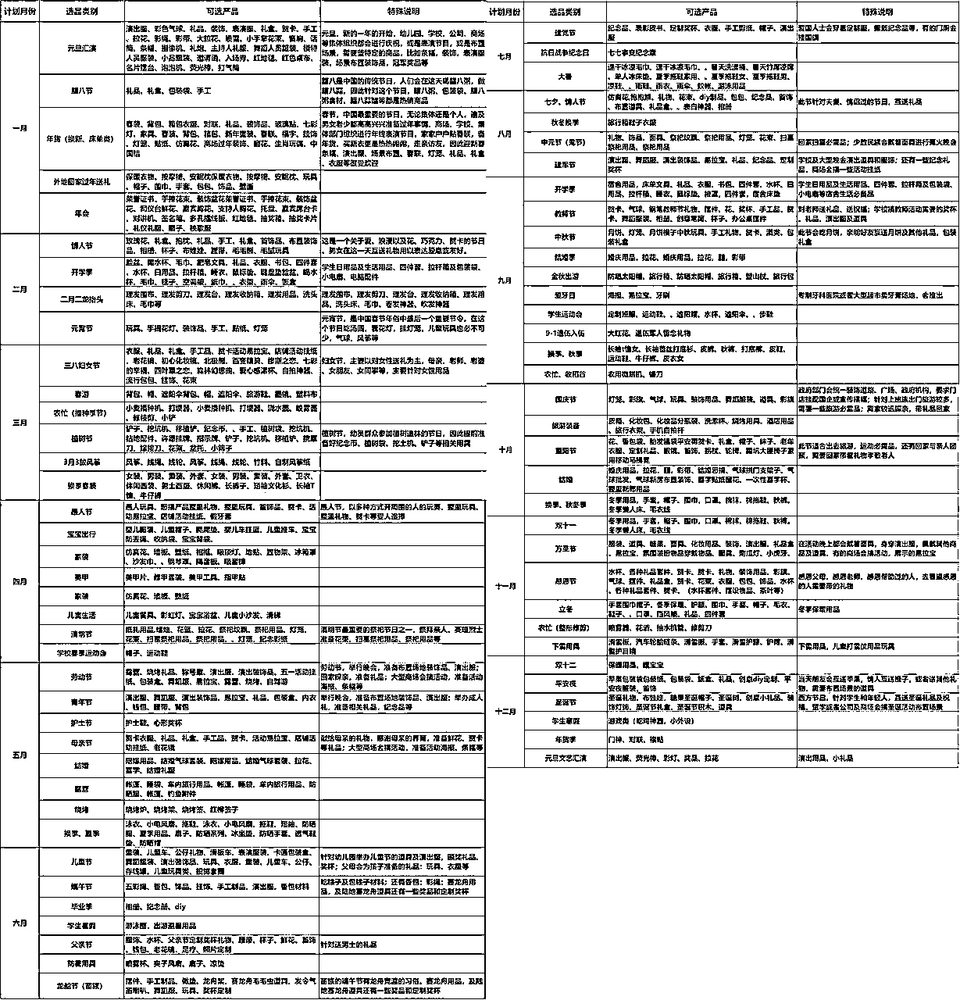

刚过去的端午节，我们提前一个月上架包粽子的小工具（包粽子模具、包粽针、包粽子线等）都在节日前半个月迎来爆发，接下来还有中秋节、九月初的开学季一些床上用品、文具等等都可以提前布局，要注意的是不要去和大商家抢流量，提到中秋节就卖月饼，这种思维是不对的，找到大类目中的小需求产品（月饼包装纸、月饼压花模具、烤盘这种小类目产品才是我们赚钱的机会）

方法三：同行选品截流，随便找一个品，用以图搜图，然后找到高溢价做无货源的同行

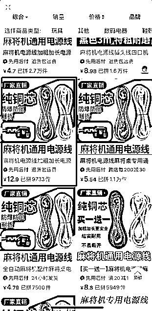

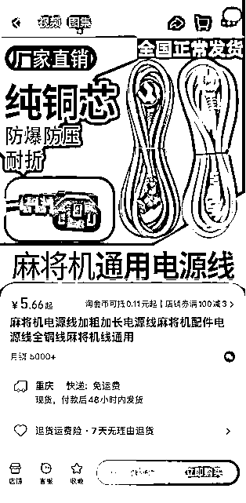

以麻将机通用电源线举例，以图搜图查看相似产品，找到价格明显高于其他产品的链接，然后再去淘宝找到货源链接，确定利润率（这一步骤粗略带过，涉及到同行店铺名和链接的图不放了，需要更多选品步骤可以找我）

### 上架

上架：用W宝上货精灵或后台服务市场等上架工具（避免广告嫌疑，不做具体推荐），统一加价2.2倍去上传链接

### 改X量

改销量：可以在某宝或多多上搜索即可（不做具体推荐）

### 推广（重中之重）

经过前面一系列操作之后全部打开全站推广，投产比统一设置5去跑，现阶段全站推广开启分为两阶段，一阶段会有流量扶持/极速起量（数据积累期，平台会释放流量来尽快达成订单），二阶段为智能阶段（可以理解为推广投产比会趋于设置的投产比，更容易达到盈利）

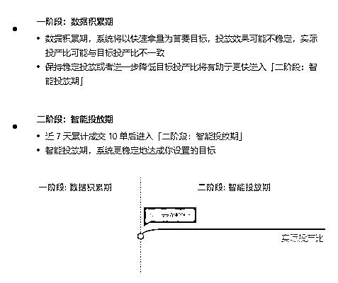

举例，设置的投产比是5，在一阶段数据积累期投产不平稳的情况下，可能跑到2.3-2.5左右，完成10笔订单到达二阶段，二阶段的投产会接近5，到达二阶段的产品会出现两种情况

第一种情况是产品的竞争力不足，到二阶段没有花费，可以理解为给平台钱，平台都推不出去这个产品难以成交

第二种情况是到达二阶段继续有推广花费，有花费带来成交，继而带来利润，2.2倍加价上传产品，我们的利润率在55%左右，保本的ROI在1.8（1/毛利率55%=保本投产比1.8)，只要全站推广的投产比大于1.8，我们就可以盈利，例如花费1000元，投产比在3，销售额是3000元，利润计算公式为3000*0.55-1000，利润650元。

付费推广这个方式是把双刃剑，可以快速起量出单并盈利，是利润放大器，项目增长的加速器，同时也会造成亏损，必须在运营上谨慎优化，把控付费比例。

目前的强付费方式因为有平台前期阶段的流量扶持，会很快起店达到盈利，虽然看起来操作不复杂，但是劝退小白去做，没有选品经验，会导致前期亏损，本来这年头赚钱就够难了，心态崩溃丧失信心反而得不偿失。

肯定会有部分圈友有疑问，担心无货源的不稳定，关于这点我是这样考虑的，首先通过店群测出产品后续可以自发货，不仅解决了拍单难、售后难、评分差的问题，而且强付费的方式是及其稳定的，没有对抗平台的方式才更长久，现在我们也会和厂家合作一起测品，不做大爆款，只做小爆款多链接，来对抗大链接的不稳定性，布局多店铺多产品多链接。

第一次发帖，希望各位圈友多提意见，多给点鼓励。期待与同频圈友的链接。