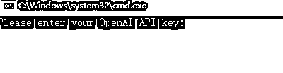
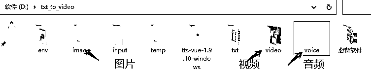
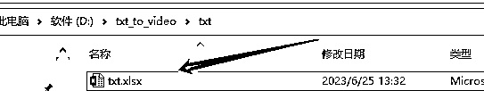
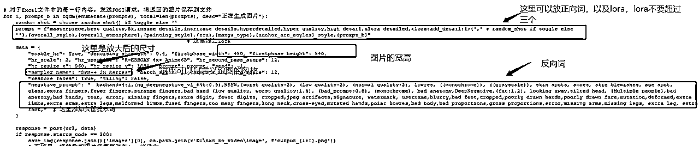
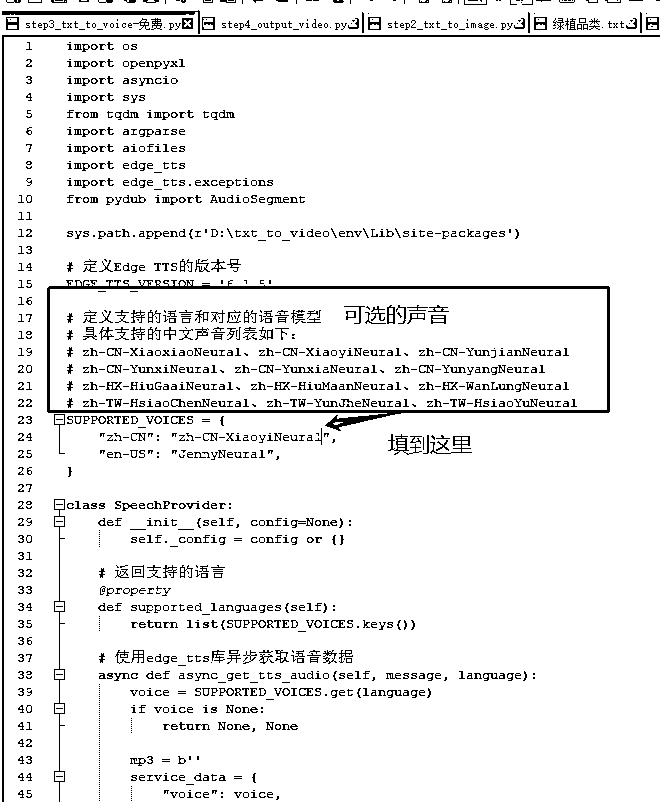
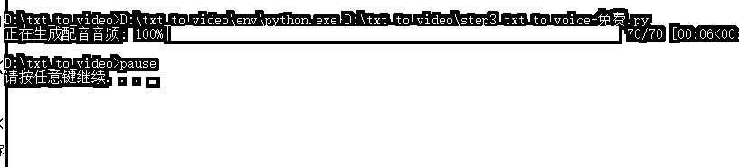
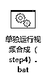

# （保姆级）全自动ai生产小说推文动漫视频教程，门槛极低

> 来源：[https://aoa1k0usso.feishu.cn/docx/SiKkdN9g8onHHlxF7MfcmyJcnXd](https://aoa1k0usso.feishu.cn/docx/SiKkdN9g8onHHlxF7MfcmyJcnXd)

可以用来全自动生成小说推文动漫视频，也可以用来生产美女图片，总之就是可以提升效率。

# 必备的工具：

### chatgpt帐号（120刀的3块钱），魔法，stable diffusion,以及我分享的这套程序（免费）

声明：程序不是我开发的。

没有自我介绍，纯分享.本人是windows系统，苹果的也可以，只是我没用过，遇到问题不一定可以解决。

看一个我简单生产的视频吧

# 第一步：下载并配置好程序

百度网盘有毛病，直接点击打不开，复制链接就可以打开了。

准备好以上的必备工具。程序我也不放最后了，直接就放这里了

链接: https://pan.baidu.com/s/1GTUrz-XIZap1_n81Qy3LrA?pwd=vja3

提取码: vja3

可能还有人没有安装stable diffusion，那我也放这里了，stable diffusion我这里就不教大家怎么安装了，社区里太多人说过了。

链接: https://pan.baidu.com/s/11-xsAbuLT8sgr5rHgU0NwQ

提取码: kx3m

现在就可以一边下载，一边看教程，一步一步实现全自动生产小说推文动漫视频。下载好了，直接解压到D盘的根目录。

解压完是这样的

到这里就成功了80%了。下一步是要配置chatgpt的 key，也极其简单，只需要点击：

然后进入到操作界面

这时只需要填入你的key，就可以了。然后还需要安装一个软件，这个软件安装好就行了，程序自动会调用，根据自己的电脑选择版本，安装就是一直下一步，就不做说明了，在必备软件文件夹里：

# 第二步：生产视频全流程

生产有两种方式，一种是全自动，一种是半自动。

全自动只需要把下面的第一步做好，就可以全自动执行了。半自动分为五步：

第一步：把小说分段

第二步：把小说转成prompt

第三步：生成图片

第四步：生成配音

第五步：把图片和配音合成视频

其实只也可以全自动，只需要把小说放进去，就可以了。但是也进阶说一些可以自定义的。

接下来一步一步的教程：

## 第一步教程：把小说分段

把小说复制到input.txt。注意一点，就是小说的格式要分章，或者分第几回。有几章，就会有几个文档输出。

我演示一下。

复制进去之后，点击：长篇小说文本分割工具.bat

成功了

这里是按章节分割的内容

全自动到这里就完成了教程。需要注意的是要打开魔法，以及打开stable diffusion.只需要点这里就可以了

小说会自动生成英文的prompt，图片，音频都会生成在指定的文件夹里。只需要看结果。生成的视频会在video文件里。恭喜你，可能10分钟你就会了，剩下的就是等结果，生成图片的速度看你电脑的配置。或者看你云端的配置。

## 第二步教程：把小说转成prompt

这一步决定了你的视频质量。前期你可以不用管，先入门。这步也非常简单，要先用上魔法，然后点击：单独运行文字处理（step1）.bat

就会自动生成

## 第三步：生成图片

这里需要设计，需要改一点点代码。需要修改的的文件是

右键打开

文本都注释好了，按自己的需要去修改，去生成图片，就可以了。这步是最麻烦的，都需要自己去测试出自己喜欢的图片模板。模型需要自己在sd里设置。

如果对生成的图片不满意，可以单独重新生成一次，不行就继续，点指定重绘，

把需要再次生成的序号写进去，就可以了，注意标点。

## 第四步：生成音频

免费的要修改一下文件，这里就说免费的，先用起来再说。目前可选的就是这几个主流的声音。

然后点击

就可以了，速度非常快。是每一句生成一个音频。

## 第五步：合成视频

只需要点击

然后等就可以了。就不演示了。

批量生成图片，只需要用第三步就可以了，把prompt放到excel里，第三列一行一个。放几百个就可以生成几百个了。不要自己手动慢慢点

如果第一步分割遇到问题，看是不是有第一章，第一回这些分割符号。

如果第二有问题，看看有没有打开sd程序，有没有开魔法。只有第二步需要用魔法。

第五步有问题，看有没有安装必备工具的视频程序。

希望对大家有帮助，如果你成功了，希望也来回复一下，分享你的胜利成果。

如果有需要再分享一下进阶的吧。关于如何提升画面与视频的匹配度，画面质量，用云端跑图片。