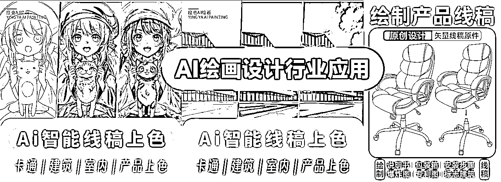
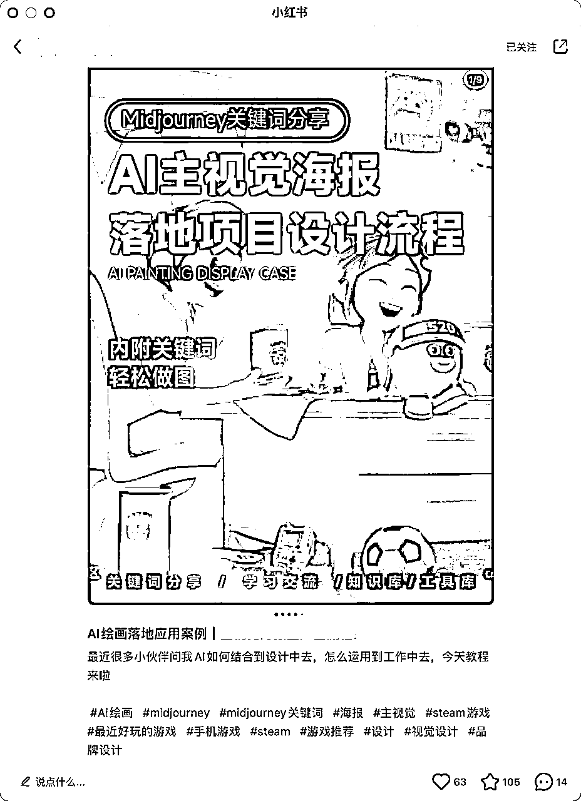
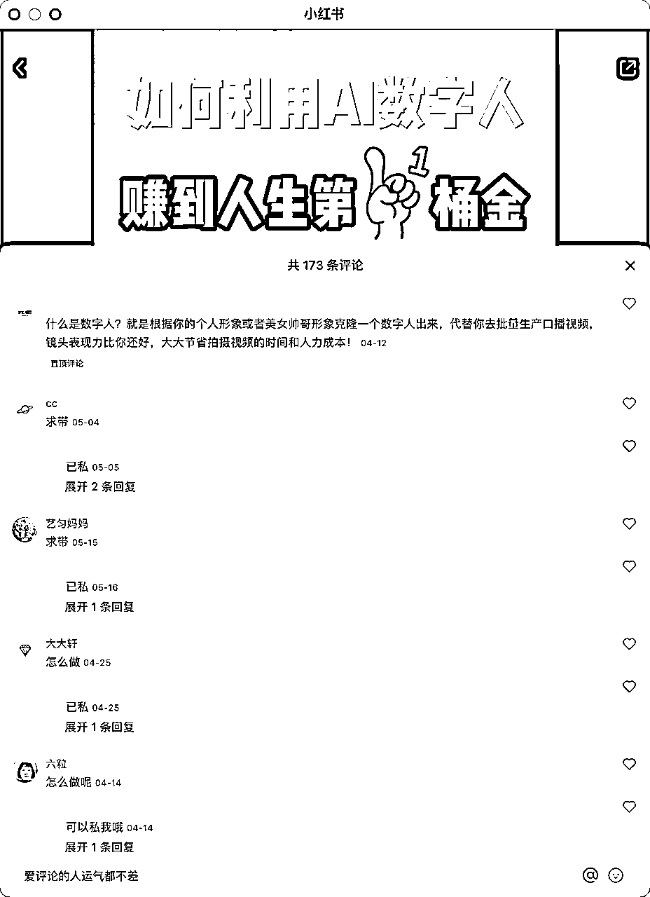
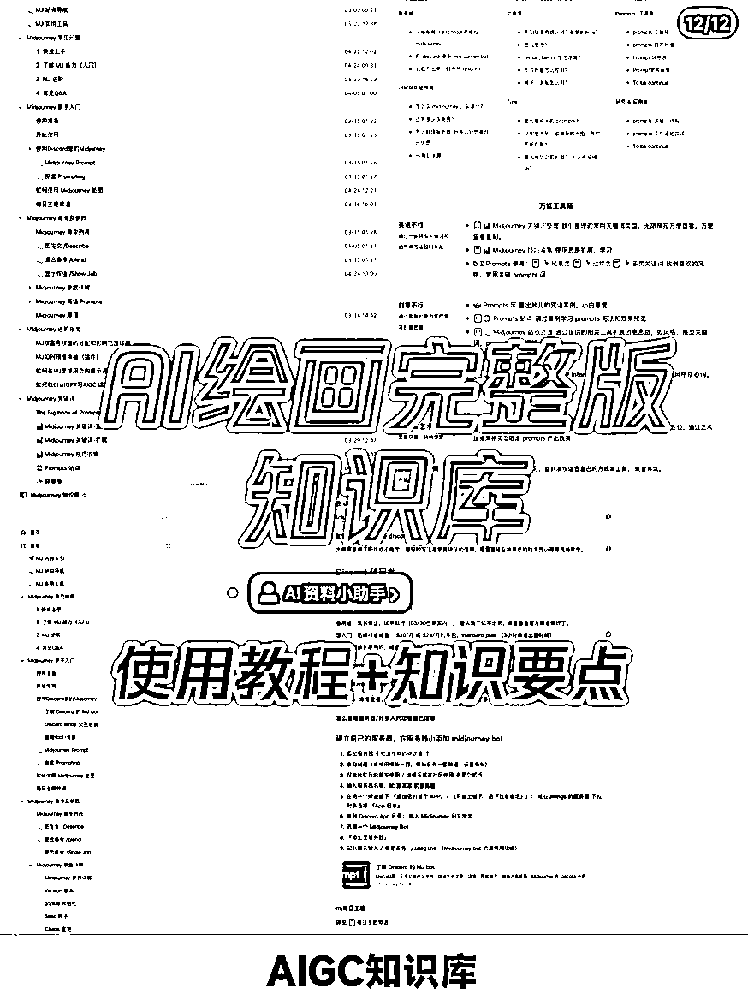
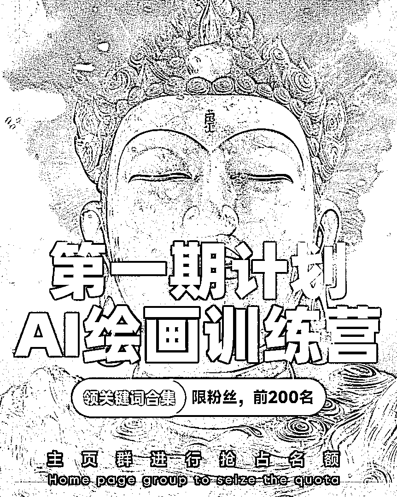

# 吃透红利！AI绘画引流变现方法汇总 （保姆级教程）

> 来源：[https://d1jpewyavi.feishu.cn/docx/SuuJdXgusoDbT9x5NW3cKLJunih](https://d1jpewyavi.feishu.cn/docx/SuuJdXgusoDbT9x5NW3cKLJunih)

哈喽，各位生财圈友好，我是老旺，一个擅长做流量增长的AIGC的实战家，今天给大家分享我正在做的AI绘画的商业项目保姆级攻略

重点会偏向于术，你可以带着思考去结合运用到自己的项目中去/一起下场淘金，自认为今天内容写的很全面且细致了，也欢迎你来验验货帮我看看能打几分

# 🍀AI绘画成果展示

现在跑的部分AI绘画账号数据⬇️

现在跑的AI绘画账号引流数据部分展示⬇️

# 🍀AI绘画项目总结

今天我就给大家分享一下，如何运用资料引流赋能到项目中去，即使你在做项目或者没做项目，都可以跟着实操，这里我会以AI绘画资料引流进行举例

## 01 AI绘画变现模式

如果你是做商业，那么一定是先定自己的业务模式，围绕变现去做内容，来帮助你实现业务增长，目前我所做的AI相关的变现模式是卖AI课程以及AI训练营陪跑，一般有服务单子，我就推荐给其他人们去做。

当然这个只是我的变现模式，现在单纯的教人使用AI已经不在有优势了

而且教人用AI解决某个具体问题还是很吃香，会用软件工具不代表能用工具解决问题，这里也推荐些目前适合路人上手的变现模式

目前适合做的AI绘画变现模式：

### AI绘画+定制服务

这个应该是目前行业中最火热的了，打开小红书和抖音基本全是壁纸、头像、插画等素材，可结合周边手机壳、T恤、鼠标垫、贴纸等周边产品进行落地应用，帮助企业/个体定制专属产品

### AI绘画+电商

目前AI已经能解决部分电商工作了，根据解决行业中的具体问题，可提供服务、教程、课程、训练营社群等方式进行收费

### AI绘画+知识付费

由于信息差还是有部分人是不知道怎么使用的，目前售卖词汇、教程、课程、社群的还是非常火热的，这些都也基本是0成本产品，单这个都非常依赖于你的流量和产品的交付，关于如何制作钩子和挖掘关键词素材这些稍后我也会分享方法，如果你想售卖课程或训练营也欢迎来找我进行合作

### AI绘画+设计行业

解决行业痛点是个非常垂直的领域，最好是从事该领域的小伙伴去做可以结合理论更好说服客户，去接单建筑、视觉、产品、平面、服装、工业等多个设计领域，AI可将文生图，以提供素材，你指定好模版进行售卖、图生图，线稿生成效果图给甲方观看非常直观，大幅度的节省了设计师的时间成本和生产资金，你可以工具这个收取服务费、教程费、培训费、咨询费等等

### AI绘画+素材网站/AI绘画工具

这个是通过做自媒体账号给AI绘画工具进行拉新，这种账号一般通常以售图、接广告、导流私域工具拉新进行变现

比如常见的有神图君、MewXAI、灵创等等

素材网站供稿：生成AI素材上传网站供稿进行变现

当然变现模式可以根据行业进行延展很多细分领域，但实际做的人其实并没那么多，市场的还是有很多的变现空间，关于变现暂且分享这几个，如果你有关于更多想法也欢迎在下方留言，我们就开始分享一下如何进行制作内容进行导流

## 02 AI绘画引流方法

在讲方法步骤之前，我想先给大家建立几个共同认知，当认知统一后你做起来才能事半功倍，也能一通百通，不局限于AI绘画这一个方法

*   做资料引流是为了更好的去卖产品，而不是为了做公益，你需要时刻知道为什么这样做

*   做资料引流是比较费号的，因为这本身就是薅平台流量的一种方式

*   做资料引流其实就是用鱼饵钓鱼的方式，重点是在你的资料钩子上，在于你是足够知道用户的痛点

建立完这些基础认知后，我们就开始探讨下怎么做？

### 一、小红书资料引流怎么做？

### 账号包装

其实也就是如何去设置你的账号主页、昵称、简介这些，让别人看到你的主页/笔记就知道你是干什么的，切记做号前先确定自己的诉求是做AI绘画博主、还是做商业变现，在或者是做工具号纯引流？

以终为始去做包装和人设，内容越垂直吸引人群越精准，人群质量就越高

这里也给大家列举几个模版，头像背景图这些可以之间拿去用，名字、简介稍微调整可之间用，作品封面可根据选题进行修改，排版可模仿

| #01 | #02 | #03 | #04 | #05 | #06 |

*账号包装只是为了看起来更专业、更好识别、以及和SEO有一点关系，这些并不是做好账号和内容的标准，账号包装好并不代表就容易起号，恰恰相反笔记爆了/账号起来了，账号包装才会锦上添花，如虎添翼

### 钩子设定

在确定好变现模式和账号包装后，就需要开始根据针对人群痛点，做钩子和做内容了，针对AI绘画这个赛道你可以把人群分为三个层级：感兴趣、想学习、想赚钱

#### 第一阶段感兴趣的：

比较常见的账号：壁纸号、头像号、插画号、资讯号、美女号、故事号等

这类人群是纯粹是因为热点和信息差刚打开，被内容/功能吸引想看看，想了解一下看看能解决什么问题，处于好奇阶段没有明确的需求感，所以你先得让他们进来围观进而去激发他们想学习的欲望，你只需要换位思考一下，假如你是一个小白你会被什么吸引进去

而针对这类的对壁纸/插画/资讯等感兴趣的人群，如何去制作钩子呢？

*   限免服务/抽奖活动

提供限免制作/抽奖/低价等，都是为了引流后面的二次引流以及复购，先让你们体验AI可以解决实际的问题后，再去激发你们学习以及变现

可以看评论区，评论量远大于点赞和收藏，说明基本都是白嫖党非常想获得一个名额，白嫖党越多，账号和笔记和起来的也就越快

*   免费送头像/壁纸/插画等

*   免费/抽奖赠送账号、发起拼团等

激发感兴趣的用户，最好的方式就是让他用最低的门槛得到最快的反馈，你可以仔细想想，你从一个完全不懂的产品/领域，最快达成下单的经历，是被人以什么方式激励了/什么话语给引导激发的，当这个你想清楚了后在回看以上的方式也是如此：

“你本想看看AI可以干嘛，但没想到AI还可以做这么多定制的服务耶

没关系我免费帮你做，你加我就行，我帮你解决，你不需要去买账号不需要去学，你来就行，感觉OK，你在来买后面的服务或者跟着我学买我的课/产品都行”

#### 第二阶段想学习的：

比较常见的账号：教学号、资料号、专业号、关键词号、口播IP号等

这类人群基本是知道了AI是什么，可以干什么，基本的操作是知道了的，但缺乏思维和方法，不会组合词汇，不知道怎么做更好看的图，不知道怎么去用它实打实的解决具体问题，结合自己的工作给自己提效率

想通过学习掌握更多的方法和技巧来解决这些困惑，他们有了诉求和苦恼，我们就只需要去找到这个方法并以合适的方式提供给他们，那么引流也就是水到渠成的事情

*   教学号：分享具体的解决方法，引导他们领取完整教程、参加活动、进群交流/分享/领取更多资料等

分享如何使用Mj/SD的具体操作教程，怎么解决一个问题的步骤，通常这种笔记的收藏会很高

在分享/开始/中间/尾部中留个钩子（文档/教程/手册/合集礼包等），结尾引导互动的埋点即可（吐槽/争论的点）

*   专业号：垂直账号，分享某个行业/某个领域的具体问题解决方法，引导他们领取教程

专门干壁纸号，通过小红书店铺卖壁纸+引流私域变现

正文引导用户留言下期更新内容，通过资料引流私域进变现

专门做海报，通过AI生成素材，通过设计排版卖海报，分享关键词收藏赞比快，容易起号

这些专业号的门槛多数在于关键词，基本不会直接分享出来，一般而言他们的类型赛道不会变化，变得是不同的风格

想要获取这些关键词也不难，最简单且快方式就是直接买他们的关键词/拿小号找他们私信要，如果你想白嫖也不是没有办法：

1.  保存他们的图，用Midjourney根据图生文，识别关键词，用识别出来的关键词与它的图进行垫图

1.  根据他们的风格/标题正文，翻译成英文去mj官方图库中进行搜索以及mj公共频道搜索栏中进行搜索，他们做的图一般在图库/公共频道中是会有相同的/类似的，在通过他们的作品去他们主页看看，具体的看核心关键词是否匹配，如果不行继续切换一下关键词

1.  多平台进行搜索查找，抖音、小红书、快手、公众号等平台，有一人在做就会有第二个

*   资料号：专门分享解决方案（资料），分享具体的解决方法引导他们领取资料，资料可以是文档、手册、网站、文件、图片、链接等等

收集这些midjourney的教学和关键词也很简单，方法如下👇

抛开国外的网站及平台，至今为止我依然认为国内资讯最快且优质的教学视频依然是以中长视频为首的B站

在整理过程中发现资料整理变现的方式好像也很多，可以把图片变成轮播，碰上舒缓音乐的就是一个非常治愈的画面，把视频进行售卖，也可定制将视频变为直播，配上白噪音也能解决情绪需求了

而搜集资料最快来源就是图文、微信搜一搜、语雀广场、小红书图文、即刻这几个平台的信息也是非常丰富，检索资料，进行整理打包即可变为一个资料包、专栏、资料群，只要有人需要它就可以进行变现，把内容展示变成多元化，音频、视频、直播、PDF/PPT、图片等等

需要提高售价就去增加服务，帮对方答疑、帮对方整理、给对方发送（按月、按天、按次）均可以

把步骤说的很麻烦别人好像也就难得弄了，于是需求它来了

把资料展示的很稀有大家好像就越想要，于是流量它来了

越是麻烦大家越懒得弄，越是难得大家越想要

#### 第三阶段想赚钱的：

比较常见的账号：案例号、ip号、培训号、口播IP号等

*   案例号：通过拆解别人赚钱的模式/分享赚钱模式，描述的接地气且清晰，小白也能干

*   IP号：描述自己的赚钱经历和数据，评论区营造求带氛围，引导进群/私信咨询

*   培训号：通过发布免费收徒/展示赚钱案例招人，主要内容不被屏蔽，起来还是很快的，毕竟免费无门槛

### 

你的钩子决定了你吸引的人群，你吸引来的人群决定了你的初始转化率，想提高转化率就要看你后面运营模式了

其实这些方法大家也都见过，比如瑞幸送优惠券、拉新免费喝一杯，健身房送体验卡/课、餐饮店送小吃/小菜

你想给的未必是用户想要的，东西给的门槛太低用户越不重视，拿东西的链路太长你会晒掉一大批人

做资料引流你就记住一点：你比用户更懂他，你又能给他一份他需要的东西，并不断激发其价值，你不想有流量都难

分享展示几个我的片尾引流图向⬇️

### 内容制作

变现、账号、钩子这些都已经选定好了，就差去制作和发布了，关于制作内容最快的方式当然是先抄在超了，站在巨人的肩膀上学习，他们的内容能够发布成功那么说明没有违规，如果数据好，那么说明这个笔记是经过了平台的算法筛选出来的

赞代表用户喜欢对你的观点/内容觉得有意思，收藏代表用户认可先收藏着后面可能用得上，评论代表用户需要，内容有吸引力/观点有争议

建立几点共识之后，我们突破先第一步，也就是怎么去抄

#### 1.寻找对标

既然是抄，那么肯定得有一个对标的参照物，这个参照物可以是账号/笔记，而这个参照物也不是上来就是定死了/谁数据好就超谁的，这样肯定是不行的，抄也有一个标准

*   先参考商业模式，前面说了商业模式决定了你做的内容形式，对方做公益，你做商业，你参考他吸引的人都是泛粉/娱乐粉，对你来说是件吃力不讨好的事情

*   在参考引流模式，引流是为了更好的赋能业务，每个行业/领域的引流方法都不相同，如果对方是做线下的，你是做线上的，他高客单当然需要引流线下一对一转化，你线上低客单如果也这样操作，反而会影响你的业务此时你参考他就不合适了

*   最后才看数据，模式业务都符合后，就差一个好内容了，你觉得好不等于用户觉得好，所以这个数据就有了参考的必要性，通过情况下一个人爆款（通常数据的十倍百倍）数量越多，说明这个人的内容输出能力就越不错

如果你是靠引流私域变现，参考数据指标优先级：粉丝群人数 > 评论 > 收藏 > 点赞 > 关注，近期良好的数据（一个月内）> 久远的数据（半年前）

对标账号是为了获取更多爆款选题的几率，对标笔记是为了更好起号/引流/涨粉等等，在确定好了对标笔记/账号之后，抄哪些部分？

*   账号包装（简介、头像、小红书号、打卡日常等），这个是门面有利于引流、打造人设、商业引导等

*   封面样式/排版、标题描述，这个是阅读量的核心关键之一，用户对你的封面、标题感兴趣才会点进来

*   内容排版/内容组合方式、片尾引导等，这个是用户能否看下去的核心关键之一，他会影响你的完播放率

*   正文描述、标签，正文是引导互动和引流的核心关键之一，标签是决定你的笔记分类的核心关键之一

*   评论区引导话术/回复语气，这个是引流和提高互动的最高因素，氛围做的到位，引流/互动也会大幅度提升

*   群昵称/群公告/群引导话术，这个决定了你的加微率的核心因素，加入我一进群就知道怎么操作/规则是什么，那么你的加微率也不会太差

*   笔记合集、滤镜、用户标签等，笔记合集有利于提升其他笔记数据和SEO，滤镜增加美感度，用户标签为引流做引导

比如当时我做AI绘画项目图文号时，是根据项目选题、内容展示方式、钩子种类等几个确定的维度进行拆解，你也可以弄一个对标表格出来

#### 2.制定标准

在前面的操作都完成已经对标都确定好了的情况下，就得开始制作一些标准了，很多人做小红书，会经常遇到内容难产，或者是遇到的笔记只能偶尔爆，原因在于没有标准化。

我会把将每个步骤都梳理清楚，每个环节都干什么事情，完成一个勾一个，这样可以避免遗漏一些重要的环节和避免泛一些小错误的概率

选题：我会用后裔采集器(工具在片尾)把笔记数据批量下载下来，然后用表格做排序筛选热门的数据，去寻找合适的选题进行制作，当然你也可以手动搜索【搜索所在领域热度高内容关键词,选择【最新】的搜索结果展示，根据前面的寻找对标标准，结合制作需求寻找笔记/账号

正文描述/标题：利用GPT辅助生成文案，根据不同选题领域去制定一套生成模版

笔记内容：如果你会用一些设计工具，可以根据找到的对标，结合自己的账号进行分类，制作几个模版测测数据，如果阅读和收藏这些不错，就设定为固定模版重复套用即可，当然如果你不会用这些工具也没关系，可以通过B站学习10+分钟也就掌握了，套模版和一些简单的排版操作即可，或者使用一些设计辅助工具，如搞定设计，创可贴、黄油相机、醒图这些都行

这样做的好处是，一来小红书用户审美偏高，这样统一让人看得舒服；

二来更有利于你团队作战，比如我跑通后，可以直接交给其他人帮我去做；

三来也是最重要的，就是小红书的算法机制里有一条是“统一”，这个更有利于你的笔记爆。

OK如何找对标、制造笔记、写标题文案这些你都掌握了，那么接下来就是放大它将梳理出来，传递给更多人来帮你去做/带他们做

#### 3.批量复制

将步骤流程化的目的是为了你每次发笔记更快更准确，也方便你用于团队管理，并且后期数据出来后，方便结合数据进行复盘，一个小白拿到你给的SOP也能去跟着步骤操作学会

你也可以制做成手册，让更多人下场去干，你提供产品支持、流量攻略、内容支持等，给对方分钱，他只需要去猛搞流量即可

如果你是单人作战，你可以提前一天把几天/周的量都做好，然后批量分号去发布即可，剩下的时间去做数据优化和挖掘选题即可

### 二、如何安全做引流？

#### 1.建立引流共识：

*   引流都存在风险，只有相对安全没有绝对安全这个说法，因为这本身就是与平台对抗的行为，在薅它的流量

*   能否引到流量具体是看你的笔记数据和钩子以及引流路径所决定的，没人阅读何来流量，不够具有吸引力/领取步骤太繁琐，用户为什么要加你

*   账号的生命周期是根据你引流的行为暴力程度，你越明目张胆的偷官方流量死的越快

如果你做号不是单纯为了做引流工具号，那么你就得了解下平台的规则和它的底线，在安全的范围内去它的流量

⚠️这里需要注意：账号不能一起号上来就引流，账号需要养活提高权重后才能更好的进流量从而实现偷流量，关于提高账号权重以及怎么查看官方都是有明确的标注的

#### 2.平台规则

什么是账号权重呢？

账号权重是你的账号对平台的重要程度，它取决于你的账号等级、粉丝量、作品数据等。在短时间内无法改变其它因素的情况下，提升账号的等级是相对容易的。

小红书账号权重如何查看且有什么作用？

在每一个平台里，所有账号其实都有对应的等级，只是大部分平台不会显示出来，而小红书将账号等级对外显示了。你的账号等级越高，平台给你推荐的流量却也会越多。

如何查看自己的账号权重？

步骤一：点开我的编辑资料

步骤2：点开编辑资料滑倒底部

步骤3：点开成长等级

小红书账号等级👇

让平台判断你是正常账号，（务必完成前五天养号操作！）再提升小红书等级账号正常了，流量上去了，升级是自然而然的事情

账号起来可以让笔记更好突破100观看的关卡，突破这个关卡后，笔记内容用户互动越高起来的越快，根据那个ces机制，分数越高起来越快，账号带动笔记，笔记赋能账号，可以帮助账号提升等级

小红书流量结构&分发机制图

小红书的流量分发机制，流向三个主页面的流量占比权重

当明白了如何提高账号权重和流量的分发机制后，可以更好的做内容增加你的爆款几率，当然这些是明确的规定，还有些没有明确指令和违纪的内容和行为，小红书也会提高社区公约进行发布公司，你可以直接点这个去观看小红书社区公约

OK，现在你已经清楚了什么是对你有利的什么是有弊的，明确了这些边界后，我们开始分享一些引流的操作技巧

#### 3.目前主流和常用的方法：

##### 1.群粉丝引流

小红书的粉丝群应该是相对比较安全的引流区，用户进入粉丝群后，群主在群内发布的信息上，有很大的操作空间。每个小红书号可以创建5个上限为500人的群聊。

那么用户从哪里加入小红书群聊呢？

【小红书群聊入口】

（1）账号主页展示；

（2）某些账号的笔记内可插入小红书群（目前处于内测阶段）

（3）在笔记的评论区发布加入小红书群聊的邀请码链接，用户复制后就可以点击加入群聊。

群引流方式：

*   群公告引流

提前设置群公告，内容包含资料信息+领取方式，可以根据你的后面产品进行下钩子引导加V

*   群消息引流

除了及时回复群成员的信息，最好是每天复制一次群公告+微信号，提醒群成员添加你的微信。

*   分享笔记引流

截取资料包的内容做成笔记，再将笔记分享至群聊中，想要领取笔记的成员需要添加微信。

##### 2.小号引流

创建一个小号，发布的笔记都为引流笔记，正文标题引导看笔记，主动咨询的发笔记，或者引导对方看小号

### 二、引流方法合集

#### 01 简介文字引流

账号简介作为小红书账号的基础搭建内容，会在账号的主页进行展示。

用户在点进去你的主页后发现有联系方式，就可以主动添加，提升引流效果。

账号简介内进行引流

*   刚刚注册的新号无法直接添加联系方式，需要账号达到一定权重时（比如达到了甜筒薯/千分粉上），并使用谐音字，如+V、v、威等，这个联系方式越短越好，比如有6位数的QQ/微信号，QQ号还可以随时换绑这点非常好

*   账号简介中允许放邮箱号，引导用户发送邮件，并设置邮箱自动回复功能，回复内容中放上微信号信息；

*   简介中留下：“有问必答”、“私❤必回”等话术，引导用户主动私信，再回复联系方式。

*   简介中留下：全网同名。用户就可以去微博或者其他平台搜索，之后再添加微信，也是可以的。

小红书号修改为微信号

小红书号可以修改为带有英文、数字、下划线的字符，但只能修改一次，因此可以修改为微信号，再引导用户搜索添加微信。

因为小红书号同微信号一样不能重复，所以一个微信号只能对应一个小红书账号。

#### 02 私信引流

私信引流作为最常用的引流方式，要么是你主动私信用户，要么是用户私信你，一般采用的是文字、图片、语音等方式发送联系方式。

这里我们需要先知道小红书私信打招呼的规则：

【小红书打招呼】

1、给关注你的人打招呼，数量没有限制。但建议私信20位用户后暂停一段时间。

2、给陌生用户打招呼，每天最多5位用户。

3、给没有关注你的人打招呼，收到回复前只能发3条消息，一旦被回复，就没有消息条数限制了。

文字引流

提前准备5-6套话术，引导用户的时候不要一直用相同的话术；话术最好是每周更换一次，以免被人举报。

图片引流

准备好带联系方式的图片，用图片代替文字进行回复；私信回复完图片后，可以再接一句“图片能看到吗？可以添加一下”

语音引流

小红书支持语音发送消息，口述微信号，再让用户添加。

#### 03 评论互动引流

用户在看完笔记后，如果想要获取资料，通常会在评论区留言询问如何获得，当然我们无法在评论区发送，但是我们可以私聊后，将用户引导到微信再分享资料包。

用户在评论区咨询

⚠️ 不能评论区直接回复联系方式，可以参考如下：

*   直接私信用户，文字（W//X：******）或者图片（引流信息）回复；这个会根据账号权重私信有限制且风险较高

*   若私信次数用完，评论区回复“私心我，今天打招呼次数用完喽~”，在用户主动私信后再发送联系方式。

小号评论区互动

*   小号评论，营造活跃的评论区氛围，吸引其他用户评论或者私信；

*   @自己的小号，并评论：领取❤资料点@小号，降低大号被举报的风险。

他人评论区截流

这个比较激进，不适用长期，批量截流需要大量账号和依托于工具，但快速引流是个不错的方法，与自己领域相关的笔记评论区，设置诱饵，采用恰当的话术进行截流。

#### 04 标记账号引流

小红书最多可以放九张图，并且图片上可以标记用户或者地点。标记自己的账号名称，用户点击后就可以跳转主页，增加了用户关注的概率。

这种引流方式比较迂回，主要是为了增加用户点进主页的几率，再通过主页的其他钩子进行引流。

#### 05 置顶笔记引流

通常两种类型的笔记，我们可以设置为置顶：其一是爆款笔记，其二就是引流笔记了。

置顶笔记的内容设置上可以采用下面的方法：

*   笔记首图中直接放置微信号，不过风险较大；

*   笔记首图中放微信群二维码，注意二维码打上马赛克，露出群名称和头像，另配上群聊天分享资料的截图，让用户知道社群内会分享什么样的资料，有需求的用户就会主动询问添加；

*   笔记引导加入小红书粉丝群（粉丝群内再引流），或者引导查看收藏（收藏小号的笔记中插有联系方式）；

*   纯故事分享来引流，通过介绍自己、自己产品或者服务、个人经历等，用文案、图片等塑造个人魅力来吸引用户主动。

#### 06 合集名称引流

小红书账号在升级为视频号后可以创建合集。

巧妙设置合集的名称，可以实现引流。如：V❤同小红书号

#### 07 打卡图标引流

小红书的“打卡”功能，在经过专门的设置之后可以成为引流的广告位，展示在账号主页“我的瞬间”。

【“打卡”功能具体操作步骤】

（1）首页左上角小黄圈进入

（2）进入「打卡」功能

（3）选择自定义打卡

（4）发布你要引导的信息和图片，发布“瞬间”。

打卡主题和打卡图片

自定义打卡主题，打卡文字信息引导私信；

或者打卡图片使用文字图片，每字一图，如下图：佛、像、壁、纸、↗️，用户一目了然。

打卡评论区引流设置

点击打卡图标，评论引导私信/添加微信/关注公众号/加入粉丝群/查看收藏等。

#### 08 查看收藏引流

小号只发布一篇带有联系方式的笔记，大号收藏并设置对外可见。

在账号主页上引导用户查看收藏：

*   简介设置引导查看收藏笔记；

*   打卡主题或者图片设置引导查看收藏笔记；

*   置顶笔记设置查看收藏笔记；

*   合集名称设置提醒查看收藏笔记。

#### 09 直播引流

小红书和抖音淘宝一样，也是可以开直播的，目前常用的引流方法有：

*   口播引导添加微信；

*   口播结合福利诱饵引导用户主动私信；

*   小号发弹幕，口播引导“想要学习的小伙伴可以看XXX（小号的名字），小号要提前发布一篇带有联系方式的笔记”，用户跳转即可查看。

#### 10 企业号引流

小红书企业号认证完成后，相比于个人号可展示更多的信息。不仅可以直接设置线上店铺、线下门店、群聊等，并且违规的风险也会降低。

目前小红书比较火热的壁纸号、留学项目、四六级、热点项目、摄影等赛道，在整理并搭建好资料库的前提下，只要真正掌握了小红书资料引流的方法，都可以在这个平台收割到不少的流量！

## 三、避坑指南

作为一个封过多个账号的流量人的踩坑经验分享给你，希望你能够避免

1.  营销内容,如微信、领取、私信、代购、转卖、拼单等用谐音和表情代替

1.  批量做号，避免同一wifi下多个手机号集中注册

1.  搬运内容，不要原图原文原视频直接发

1.  违规提示，赶紧编辑修改/删除重新发

1.  引流操作，能用小号引流就用小号引，能进群就别私信

1.  内容禁区，不发网址&二维码&带其他的平台水印内容

1.  刷数据，只能小人工测试不可批量机刷

1.  批量起号，在没测出能跑通的选题/内容时，不要上来就怼量

1.  追究运营技巧，内容为王,运营技巧只能辅助，不是主力，不要本末倒置了

1.  盲目跟风，不是什么热点的追，先看看能不能帮助你变现，符不符合你，能不能hold住

## 四、汇总合集

### 1、工具合集分享

数据检测：

灰豚数据：https://dy.huitun.com/app/#/app/course

极客增长：http://yinliu.club/member/Zhihu/index.html

作图工具：

花瓣素材网：https://huaban.com/materials

搞定设计：https://www.gaoding.com/

midjourney官网：midjourney.com

爬数据工具：

后裔采集器工具&教程（批量爬数据）：https://www.houyicaiji.com/

电脑用小红书客户端：

先下载模拟器，在从模拟器中进行下载小红书

Mac电脑模拟器：https://playcover.io/，

PC电脑模拟器：https://sj.qq.com/

国内各大厂GPT（文案生成工具）：

讯飞星火申请网站：https://passport.xfyun.cn/login

阿里的通义千问：https://tongyi.aliyun.com/

Claude申请网址：https://www.anthropic.com/product

百度文心一言申请网站：https://yiyan.baidu.com/

### 2、技巧合集分享

小红书是怎么判定我们有引流私域行为？

它主要是通过技术手段来自动识别，和用户举报机制。

1.  文字识别技术：小红书平台可以对发布的文字内容进行识别，识别到包含私域信息的内容时，会对该内容进行限制，就容易发生笔记小眼睛数量几十，私聊信息对方根本没有收到

常见的违规文字引流：

①私聊直接发微信号

②笔记内容有微信号、公众号等第三方平台、网址链接等

③个人简介上写微信号、一串数字电话联系方式、邮箱、网址链接等

1.  图片识别技术：跟上述文字识别技术相似，常见的违规图片引流：

①小红书头像放置微信二维码，或其他二维码

②在瞬间中放置微信或其他联系方式的信息

③私聊直接发微信二维码，或其他二维码

1.  网络行为分析技术：小红书平台可以通过分析用户的网络行为，判断用户是否存在私域引流的行为，常见的违规引流：

①同一部手机，两个或两个以上小红书账号，来回登录

②同一个WiFi下，连了5个以上的小红书账号

③评论区：同一条评论信息，在很短时间内多次重复发布

④私聊：同一张图片或同一条文字信息，在很短时间内多次重复发

⑤小红书群：在多个不同的群里，群发相同的内容

1.  举报机制：一旦有用户或同行，发现其他用户存在私域引流的行为，可以一键举报功能向平台进行举报，平台会对举报信息进行核实并采取相应措施

## 最后想说的

单纯的讲解AI绘画工具有多牛逼已经不在是优势了，现在更需要的是善于利用AI绘画工具去结合行业，解决行业内具体的某个/某部分问题了你只需记住一点，你能用这个工具帮人解决掉某个实际的问题，你就可以实现商业变现

而你需要做的就是通过自媒体/线下熟人推荐等方式去曝光，挖掘那部分有需求的人并告诉他们你有解决方法并且告诉你的价位就行赚的多与少这就与你的产品可单价、流量、复购率、退货率、以及你的人力、物力、时间、启动资金等成本相关了

如果你会算帐的话，一算就能算清楚你的天花板了有的人做了不说，有的人做了在说，还有的人说了也不做，很喜欢分享的那句话：请躬身入局，不要假装自己在牌桌上

其实大家不要局限创业赛道和某种展现形式，你擅长什么，就去做什么，先干起来，才想着完美，今天我分享的内容也是我一边干一边复盘，慢慢优化得出来的，条条道路通罗马，方法都没有错，取决于你怎么用它，理性看帖，积极实践， 加油兄弟们，干就完了！

如果你理解了这套玩法，只要你执行力跟得上，我相信你也可以从本文章中制作出不少的内容，不同形式的多个钩子、比如：小红书常见Q&A、资料引流SOP文档、小红书安全引流指南、小红书工具合集等等来，麻烦各位看官打个分，不足之处欢迎大家进行补充和改正，自古套路靠不住，唯有真诚得人心。

当然，如果你有任何问题也欢迎在下方留言，如果你也在做AI绘画相关项目或者感兴趣，非常期待与你交流、一起合作创造更大价值