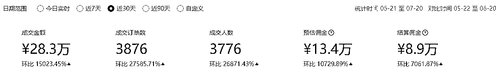
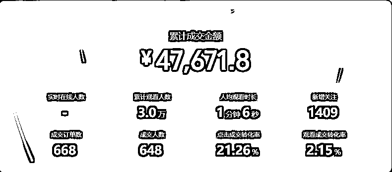

# 视频号直播单品30天30万佣金的案例分享

> 来源：[https://sv08sqt2jse.feishu.cn/docx/T4SPdYji0oprInxRrLAcSFQjntb](https://sv08sqt2jse.feishu.cn/docx/T4SPdYji0oprInxRrLAcSFQjntb)

各位生财圈友好， 我是肖肖。

我是去年418加入生财，6月参加了视频号带货航海，7月正式做视频号带货，至今也一年时间了，总体而言，前4个月主要在做短视频带货，后8个月主要做直播带货，期间也测过一些细分玩法，切换过程也颇多焦虑，所幸折腾多次之后逐步也找到了适合自己的模式玩法，最近6个月通过小矩阵单品直播带货，初获小成。接下来以点带面，跟大家分享最近一个月的打品经历，并尝试总结一下视频号单品直播间的运营经验，希望对部分圈友有益！

# 一、打品经历分享

先贴数据截图吧，两个账号近30天的gmv数据以及爆单的数据，还有部分佣金是线下结算了的，总计有30w佣金，扣除对应的兼职主播工资和投流费用，纯收益大概25w。

## 1、起号和个人狂怼直播阶段

6月16日，晚上日常刷广场，刷到一个我所做品类的品，眼前一亮，然后蹲直播间监测数据，发现转化挺不错的，之后又刷到两个直播间也在播这个品，总体转化都不错，就选定了这个品，立马开始准备。

6月20号早晨开始第一场直播，播了1小时，自然流不到200，点对点互动成交了2单，紧接着立马开第二场，这场还挺顺利的，直接拉爆卖了2.7万，起号成功。然后第三天再起了一个新号，用同样的方法，再次第二场拉爆。然后两个号就开始交换直播，一个号各播几场，不断去提高账号权重和加强标签。这两个号，分别在第5场和第4场就就大爆了，一场爆了10.5万，一场爆了4.7万，销量也快速干到了第一名。

从6月20日到7月4日，这15天时间，一个人在怼直播，平均每天直播6~7小时，半个月播了33万的GMV。

## 2、兼职主播招聘和团队磨合阶段

如果说第一个阶段，起号之后，无脑怼直播时长就够了，流量也好，转化率也高。那么第二个阶段， 就是群雄乱战来抢夺蛋糕，需要多动脑筋了！怎么稳住第一，值得思考，并且要快速行动！

随着我两个号都爆单了，跟品的直播间短短三五天，出现几十上百个，十分热闹，但最后大部分也只是凑了个热闹。因为本来就不是什么大众刚需品，偏蓝海，目标人群没有那么多。其次，第一阶段几个播的早的也把最优质的的流量吃完到了，占住了大部分流量，所以后面自然流起号，难度也更大，我好像没看见自然流起号成功的了。

但，人民币玩家例外！这个阶段，注意到有三个付费投流的直播间，陆续起来并且放量，然后我们开始了新一轮的比拼。这个时候，我感到庆幸的是，当初起了两个号，为矩阵复制打下了基础！

第一阶段个人狂怼半个月之后，嗓子确实也有点疲了，这样下去肯定不行，没办法打持久战。于是7月初快速招聘和搭建兼职主播团队，一周之内面试20+人，筛选了3个主播。在这一周，我的重心转到招聘，然后和兼职主播沟通、磨合，通过三场直播让主播进入状态，达到一定转化率。最终即便我一天播3个小时，但和两个兼职主播轮班下来，一天可以怼12~13个小时。当时的竞争策略就是，既然付费打不过，那咱就多拉时长。

然后这一周，也发现直播间数据大不如第一阶段了，不过这是有预判的，体现在：

a：流量时好时坏

自然流量不稳定，付费计划无法消耗完毕，且经常出现一波急速流，之后也再没有大爆过，趋于平稳。

b：转化率越来越差

除了推流因素不可控，能做的就是不断复盘直播的问题，找到不足并改进，以及多测试付费计划。

当然流量和转化率的波动是大盘性的，我直播间的综合转化数据始终保持在第一二名。第二阶段，即7月5日—7月12日，这一周时间，带货GMV大概有8万。随着这周主播团队搭建磨合完了，团队对这个品也积累了越来越多的经验和感觉，进入到了第三阶段。

## 3、人货场优化和矩阵复制阶段

策略就是：复制第2个直播间+拉时长多获取自然流+付费投流放大，直到吃完这个品的生命周期

7月13日-7月20日，这一周带货10万GMV，至此30天内这个单品累计gmv已经破50万，佣金破30万，这是目前打品的最好成绩。这次结合了之前的经验教训，通过所做的一系列思考和操作，尽管现在这个品的整体流量和转化率是越来越差，但我这边两个直播间，最近每天gmv数据仍能保持1.5~2w，当然此时付费占比也已经过半。虽然整体ROI不如之前高了，但算账下来，还是可以接受的。这个品打到现在，剩余生命周期也确实不长了，投产逐步下降是必然的，那就努力吃最后这一波吧。

这个阶段，又回到了内功的优化，持续优化人货场，精细化运营。转化率能提升一点是一点，多熬死一个对手也算哈哈。因为投产确实不高了，我预感纯付费投流玩家也会渐渐离场。

现在我的重心也切换到测新品了，想办法去挖掘下一个潜力爆品！回顾这一个月，令自己欣慰的是这个品一直稳住了第一名，纯收益可能遥遥领先，毕竟我总体付费占比不高，其他成本控制较好。这一个月下来，以战养兵，兼职主播团队也得到了有效磨合，为之后战斗打下基础。

# 二、打品感受总结

短视频和直播所有的爆单，都有运气成分，只不过积累的多，实力越强，运气降临并把握住的概率也更大了。

所以前面这个打品经历，大家权当案例看就好了。只是在这个过程中，有几个思考和动作是对的，分享一下：

### 1、选品为王

这个是共识，所有在短视频和直播拿到结果的，都深谙此道，没有拿到结果的，也都耳熟能详。对大部分中小及个人玩家，短时间内要爆单，就只能围绕货品这个变量去做多测试。比如直播的人货场，主播短时间能力无法获得巨大提升，场景大多时候也是抄对标，都无法有压倒性的优势，所以就还是多测品。

无论去年做短视频，测了100+品。还是直播，测了20+品，实实在在测完这些，才能体会到选品定生死这句话的奥义，近乎真理。有些品带人，自带流量，起号难度低。但这样的爆品，来得快去的也快，主打的就是一个跟品速度，我也曾通过跟爆品拿到过一些不错的成绩。而且跟品，有个好处，入局者多，样本数据多，能让人快速成长。

除了跟大爆品，还可以挖掘一些潜力爆品去打，有明确的需求和受众群体，但目前在视频号没有被产品满足，这批用户对这类品的感知是新鲜的，但却是很希望去试试的，就有了爆单的可能。

### 2、跟品时机恰当

任何一个品，都有生命周期。合适的时机进场，很重要。如果这个品没有对标，闷头去做的话不仅耗费时间，拿到的结果可能往往也不好，所以尽量不做第一个吃螃蟹的，实力玩家除外。恰当时间，非常重要，这就需要保持对市场的敏锐度，保持选品看品的频率，能及时发现这样的新机会。

早进场就是优势，竞争不大时，热度高时，容易起号。当时我刷到对标直播间，监测数据发现不错，并且人货场也做的一般，按照圈友说的，能打得过，那快速跟上就好了。准备期间，我也花了1天时间，去仔细研究对标直播间的各方面细节，整理出了适合自己的直播框架和话术，最终出来的效果是超越性的。

### 3、接连起两个号

矩阵多号这个思维，也同样是众所周知。但真正到了自己身上，能做得到，做得好吗？也许对短视频来讲，多个号发布视频，是比较简单的，大多人都起码三五个号同时操作。但直播呢？你起了一个号，会继续再起另外一个号吗？反正我之前是没有做到，导致我丧失了一些机会，甚至解散了兼职主播团队。

故事可以跟大家分享，今年2月份我也一样打爆了一个品，自然流量当时跑到了9.3万场观，也一样招聘了兼职主播，但当时就是起了一个号，然后一直播，中间多次这样那样的违规，最长的15天时间，然后就很蛋疼啊。西安这个地方，兼职主播也很可能是没有其他工作和收入的，这边直播电商氛围一般，很少有赶场子那种兼职主播。然后违规了，就只能安排测别的品，能力又达不到，不安排的话兼职也撑不了一周就动摇了，十分被动。

所以这次我汲取了教训，起两个号试试。没想到，出乎意料，两个号都起来了，并且都大爆了一场。这是巧合吗，只是运气吗？我现在想想，好像不是，应该是做对了什么，踩中了规律。

咱们都知道，直播起号，除了人货场这三要素之外，其实还有一个要素，那就是号。我是遇到过的，同样的人货场，不同的号，出来的数据就是不一样，但所谓的玄学，其实不过是无法去量化和总结规律罢了。不同的号，测试的环境条件本身就有其它变量，玄学本质也是科学的一面。

除了号本身，还有个要素就是起号的时间节点，时间节点意味着竞争时机。对一个品的生命周期而言，今天和明天是不一样的，早一天可能就不一样。同时一天之内，不同时间起号可能也是不一样的，视频号普遍认为，凌晨一两点和早晨四五点，是起号的更佳时机。今天起成功了一个号，次日或者隔日在用同样的方式方法，再起成功的概率就是会更高。同样，一个号爆单，另外一个号也有较大机会爆单。但同一个号，爆单两次的概率好像很低吧，系统还真的挺懂雨露均沾的哈。

### 4、自然流起号

其实只要能起号，无所谓采取哪种方式，黑猫白猫抓到老鼠就是好猫。我这里只是想表达，我这个小玩家的感受，能薅到自然流那就尽量去薅。现在平台还有自然流，等到明年后年可能自然流更难获取，视频号商业化的列车必定越开越快。但要薅到自然流，难度也确实是更大的，需要有清醒的认知，选择何种起号方式还是看自身的资源。

我认为，在当下的视频号，系统推的自然流始终是更加精准的。但随着标签完善和系统能力提升，付费投流的精准度，可以做到和自然流一样，甚至采买的流量更加精准。我的短视频直播经历是直接从视频号开始的，没有做过抖音和快手，我知道我还没有深入进付费投流的世界里，认知和能力都没有打开，所以还停留在自然流起号阶段。

但对于小玩家或者个人玩家，刚起步咱们不就是一穷二白，有的只是时间资源么，最缺的不就是钱这个资源么。所以，白嫖自然流不妨去试试，正是因为有难度，所以锻炼提升出来的东西，也是扎扎实实的。

### 5、执行力拉满

如前面分享大家所看到的，无论是我一个人怼直播时长，还是快速招聘兼职主播搭团队，执行力都是拉满到MAX。但大家不知道的是，我也曾经是个拖延症重度患者，过往多年管理岗带团队的背景，让自己大脑发达，手脚退化。处女座的性格，让我习惯性追求完美，吹毛求疵，甚至以前被一句话中毒影响至深，那就是在deadline之前效率最高，也因此吃够了拖延的苦。

但去年7月决定开干短视频直播电商开始，在拜读了木易以及众多生财的精华帖子后，我意识到要做成新项目，必须先把思维和认知先刷新并调整到正确模式，从这点来讲，生财对我的影响和帮助是巨大大大大的！当执行力拉满了，下场弄脏手了，反馈就会很快到来，然后再用执行力去迭代改进再执行，小闭环的跑通也指日可待。

时间就是金钱、跟时间赛跑，这两句话很俗吧，过去一个月我奉为圭臬。多播一小时就多卖几千上万，时间可不就是金钱嘛。跑的快一点就多建立竞争壁垒，甩开对手。所以这个月是马不停蹄，抓住一切时间，让收益最大化。而这样的认知加强，和对应的执行动作，却也是吃亏换来的。

很多时候我们以为今天爆了，播累了就下播吧，吃好睡饱明天再继续，但这很可能是你数据最好的一场。

很多时候我们以为这个品爆了，那我应该能在打一个品出来，下一个品爆单也不远了，但很可能也是遥遥无期。

所以这次遇到了好的机会，我牢牢抓住，以一副让对标直播间害怕的战斗姿态，气势和数据双重发力哈哈。

### 6、利他就是利己

以前听我的教练说，直播就是开卷考试。事实也是如此啊，除了不知道对方怎么搭建的投流计划，其他如人货场以及对应的流量和转化率，用心监测几天都能知道大概，哪有什么秘密可言嘛。尤其是垂类单品直播间，更加简易，体量本身不大，对标和潜在竞争的直播间往往也就那么几个或者几十个，所以你想研究别人，或者别人研究你是很容易的，从商业的角度思考，这其实就埋下了一个潜在风险。唯有换位思考，利他思维，才能化解。

前面我们提到拉满执行力，其实就是要去狂奔。但当在狂奔的时候，还需提醒注意脚下的路和关注竞争的格局。

尽管要竞争要抢夺流量，要增加自己的gmv，但也不要把空间全部占为己有，要给别人适度的生存空间，除非你足够强大到无视一切，这个思维认知是我在狂奔的途中所感悟到的，我觉得很重要。

我分享两个动作吧，第一个我和其他的直播间有建立沟通渠道，甚至商量一些安排，比如直播时段，共同赚钱。

第二个两个号各合作了一家后端，哪怕某家佣金更高，结算方式更有利，也没有全部切换，背后的思考就是一方面多个后端多一重保障，另一方面是要看长远一点，眼前利益的牺牲，换来人品的增值，划算！

# 三、单品直播间运营经验

这个话题要展开来讲的话，在生财这个圈子，真的是有点班门弄斧。但反过来看，对于30分甚至0分，还没有正式开始做直播却有意往视频号直播这个方向去尝试的圈友，又何尝不是更接地气的经验呢？还是写了再说！

很多圈友都知道，从年后2月份开始，很多人就在说视频号直播不如年前好做了，平台不推什么流量，付费玩矩阵难度也很大，因此很多人顺势转战小红书平台，大家都在讲小红书是今年最大的风口，的的确确热度非常的高。那可能我进入视频号直播的时间节点比较晚啊，错过了去年"捡钱"的红利时期，既没有"得"，那也就没有"失"，所以也不存在患得患失。从年后2月份，就决定在视频号继续做直播带货，无论平台政策怎么日新月异，仍然坚定看好视频号的平台型机会，坚定看好中老年电商。

所以最近半年，我反倒没有被其他的项目所干扰，一直在做单品直播，主要围绕两个垂直品类，不断选品测品，关于单品直播间运营和矩阵复制，虽然还没有成体系的起号和放大方法论，但今天还是把自己实操过程中一些细节经验分享一下：

## 1、直播选品

### a：先定赛道品类

选赛道/品类，我觉得是首要的，前期不贪多，确定一个即可，逐步有必要可增加到2个，而且人货场难度要等同。至于有哪些品类，自己要做什么，我觉得去刷直播广场就可以了，多看多思考，哪些你觉得可以去试试。如果是单品直播间，核心我认为要去看场景，自己能否复制，或者做的更好。

### b：再选潜力爆品

无论直播还是短视频，看得多了，视频号的大爆品，是周期性重复出现的。大爆品也往往是头部和专业玩家主要跑的，所以中小玩家可以避其锋芒，找到一些介于红海和蓝海之间的品，或者说小红海和大蓝海。至于如何分辨和感知，因视频号没有成熟的第三方数据平台，主要还是靠自己去刷去记录，潜移默化中会积累对选品的感觉。

一定牢记：选品为王，选品定生死。在选品这件事情上投入注意力是非常关键的，要打出爆品，一定是要多花心思去琢磨选品和测品，这和短视频是一样的。选品推荐上，根据观察和业内大佬总结到：应季性、痛点型、新奇特、地方特色类的品，视频号跑的比较好。纯直播起号，建议从这四类属性的品下手。

### c：选品方法

选品方法众多，航海手册讲的不能更详细。但其实只要掌握一两种，也就够用了。

我自己主要使用的就是：①刷短视频和直播间广场跟品 ②需求延伸法拓品

刷短视频和直播间广场跟品

对视频号直播来说，没有第三方数据平台，大家常用刷广场和feed选品。因为刷到数据好的对标了，说明品已被验证OK，也有了抄作业的目标。但要注意，大部分单品直播间，个人主播为主，直播一般也就3~6小时，所以一天需要在不同时段刷3~5次广场。已经选定好赛道和品类，那么只要给同类直播间多关注和互动，系统会自动推送类似直播间。如果你微信有一些做同赛道的圈友，那选品也更简单，视频号的社交推荐，只要朋友看过，也容易刷到。

需求延伸法拓品

看到一个品爆了，思考这个品解决了什么需求/痛点，是否有更强势能的品牌，是否有类似平替产品。

这个方法，往往有奇效。因为产品本质是解决用户需求，需求打对了，品其实没那么重要，取决于你怎么塑品。

### d：选品验证

一般来讲，当发现了一个品，初步觉得可以，那再配合抖音+快手+淘宝去看看销量和评价，以及是否有对应直播间。同时用考古加去分析直播间数据，觉得OK就可以进行测品。

但也不绝对，随着看的品多看的直播间多，对品类和人群的理解逐步加深，有些品我觉得是天然适合视频号的，也许在其他平台跑的人少或者跑出来的数据表现不好，也不要完全放弃。

所以真正的验证，就是得多去实际测品，而不是停留在分析环节，有这时间功夫，能多测一个是一个。

比起短视频测品来讲，直播测品所耗时间周期更长，从准备样品和话术到实际测试3~5场，一般需要3~5天，如果要配合付费测的话，一个品预算建议控制在2000~3000元，其中包含兼职主播工资+投流费用。

## 2、直播起号

### a：自然流起号

自然流起号，就是理解清楚系统推流的底层逻辑，怎么样能获得系统自然流量。最近视频号官方发布了一份文档，讲到了系统推流要点，迎合系统的考核去做数据，是必然的。前期主要做浅层数据，比如互动、关注、停留时长。然后去做螺旋递增，但我在强调一下，起号与否与所选的品，以及起号时间节点关系很大。与其在一个品上过度纠结，不如多测几个品。起号不顺利，也不必把责任归咎于平台不推流，这是一种错觉！平台必然对新号有流量扶持，你仔细去看，就会看到有层出不穷的新号跑出来，所以多找自身原因。

关于视频号直播的底层逻辑以及基础起号方法，我之前也是跟着生财航海教练@Erik 学的，有需要的可以移步到生财半无人直播航海应该还有他的系列帖，包括生财星球也有他总结的选品方法，再感慨一句生财真的是宝藏！

### b：短视频起号

至今仍然认为，短视频爆了开播是最丝滑，也是产出比极高的一种玩法，但是核心在于短视频如何爆量。

尤其短视频起号，非常适合很多蓝海品，通过短视频内容把精准人群锚定，引入直播间成交转化，给直播间打上标签。而且短视频和直播，还有可能达到双频共振的效果，得到短视频和直播双重公域自然流量的反哺。今年3月份，我也尝试用这种方式，成功起过一个号，但因入场较晚品的生命周期接近尾声，只跑了半个月。

尤其是今年下半年开始，ADQ平台上线短视频素材进入直播间的投放功能，短视频素材这一关是不得不过了。短视频做内容拿流量，直播间承接流量做转化，无论是自然流还是付费投流，都是一条最为丝滑的路径。

### c：付费投流起号

正如我这次打品所经历的一样，很快在第二阶段就有付费玩家入场，或者说因付费玩家入场而进入第二阶段。过去所打的每一个品，几乎都有付费投流玩家们进场来抢蛋糕，眼睁睁看着他们收割流量，真的是香啊。但你却没有一点办法，也不知道对方是怎么投放的，就算告诉我，我想我当时也没有这个魄力一场烧几万，活该别人赚钱。

说起来投放，我有个心路历程，不知道投流大佬们曾经有没有。开始做直播的时候，一场一分钱我都不投，纯靠自然流。最近半年，我从一场投1000，到3000，到现在1万。中间经历了N多次迟疑，计划建好了我又关掉，即便我知道有赔付，但就是不敢，果真钱就是人的胆啊哈哈。

今年5月份以前，直播都是微豆投放。5月份随着ADQ上线短视频进入直播间功能，近2个月已经看到多个品通过ADQ跑素材的转化非常好，千次转化高达5000~8000，这是直投不可能达到的数据。不知道投流烧了多少，但看到这样的直播间，运用投流杠杆一场卖几十万，可以断定ADQ是大势所趋，明年估计会大爆发。

## 3、搭建兼职主播团队

在大部分二线城市，兼职主播时薪应该50~120之间，时薪80~100为中位数，应该相对好招。如果有HR或者专门人员负责，有公司背书，时薪50~70元多花些时间去沟通，也是可以筛选出来的，但也就60分主播。

我在今年2~5月份，是用时薪50元+提成方式招聘了两个主播，够用。但这次我直接给到时薪80~100，效率更高，同时也确实发现主播综合能力更好，关于如何搭建兼职主播团队，主要两步：

### 第一步：招

设计高效流程，让匹配的主播主动找过来，并增加筛选基数，然后通过一篇帖子让对方去详细了解，进一步筛选高度意向人才，然后进行面试和试播。

我是这么做的：

a：在boss招聘信息页面，除了常规的岗位职责和任职要求，增加了第三点特殊说明（这个差异化非常重要）

把吸引人才的优势，言简意赅的写了四点，当目标人才看到招聘信息，自然会主动来打招呼发消息做介绍

然后看对方简历，初步觉得可以，就让加微信，再发招聘详情给对方。

b：为了避免回复重复问题浪费时间，耽误我直播搞钱，索性写了一篇帖子，里面包含我本人介绍、项目介绍、该岗位所需的人才特点，以及求职者常见问题解答。所以加上微信，直接甩帖子链接就可以。

c：同时我为了快速招聘，但是又留有想象空间和余地。关于薪酬方式，直接写明，我司时薪有四个档，XX日之前录用者，给到时薪80~100，增加紧迫感。

### 第二步：留

招来了怎么留住，最重要的就是保障对方的兼职收入，换句话说得保障直播时长，就如我前面所提到的，如果直播不可持续，那么搭建的兼职团队顷刻间解散，要用兼职的灵活，就要承受兼职的不稳定性。其次就是把兼职当全职对待，走心磨合，不断建立信任感，兼职团队也是团队，带团队先带心。

另外多说一点，在兼职主播的人员筛选上，也建议需要根据自身情况做好搭配，组合出来的兼职团队也很能打。

比如目前就我自己全职，我就招了个可兼职可全职的主播，也就是她没有其他工作，时间有自由度。当遇到，有些时段需要调整，亦或者需要增加直播时长，沟通后也都可以很好的配合。

另外还招聘了个成熟有经验的主播，她有有别的公司做主播，且主播能力在我之上，让自己有了学习交流和参照对象。还结合自己玩法，招聘了个自然流起号主播，安排去测品起号。

## 4、优化人货场

### a：主播（人）层面

①直播话术迭代

主要是塑品话术，逼单话术，多做内部复盘及研究对标直播间细节了，取其精华，为己所用

②增信资料展示

比如引导互动的手卡，售后保障手卡，某猫价格和销量，产品原料展示，好评等等有利于增加信任的资料

②憋单+平播的时长比重

憋单多久再放单，放单多久又截单，两者时长分配，一个循环多长时间，都需要结合具体数据去调整

④急速流和低流速的承接

打付费的时候，一波急速流来了怎么接，情绪啊节奏啊怎么快速调整，在半分钟一分钟内怎么把高意向粉丝转化掉

低流速的时候，平均在线20人，怎么点对点成交，保持成交密度，从而获得系统不断推流，甚至叠高在线拉升流量

### b：产品（货）层面

①产品SKU价格设计

首先是SKU设计，看你主推哪个套餐和客单，通过话术引导和SKU引导，直接导向目标SKU和客单价。

比如我跑过的品，开始SKU定价是69.9，后面我增加了个119.9的客单并加以引导，最终平均客单是75左右。

其次是中期升客单，从69.9升到了79.9，最终平均成交价到了85左右。

所谓买涨不买跌，有些客户看到涨价就下单了，然后前期已经购买的客户在价格低位买的，看到你提价了，也很觉得之前买的划算，给到了情绪价值。而实测下来，提价10元，对新粉转化几乎是没有影响。

②产品佣金沟通提升

做带货嘛，目的就是拿佣金。除了开始去沟通定向佣金之外，达到一定量后，也可跟后端去沟通提升佣金。

甚至可以去沟通结算方式，比如我这次的品，就有后端为了抢达人，给出更高佣且支持次日线下结算。

③产品升级

从满足需求的角度来讲，不同品质和定价的产品，都有对应的人群。

产品的包装，产品的原料，能否再次升级，进而提高客户满意度的同时，也顺着提高客单价和佣金。

④替代性产品挖掘和测试

一个用户需求和痛点，不可能只有一个产品去满足，市场必定还有其他同类替代产品。

就我这次跑的品而言，也有一个替代爆品出现，只不过打法差异大，对方人货场牛逼，便没有跟进。

### c：场景（场）层面

①场景画面和文案

单品直播间，主要是实景直播间、绿幕直播间、手播直播间。在观众所看到的的场景里，除了主播及其表现力，场景就是画面和文案，除了实景直播间可能画面拉停留，静态绿幕直播间和手播直播间，我觉得核心就是文案。

怎么做到，既不违规，也足够打到痛点或者爽点，是模仿和调优的测试过程。要大胆，也要心细。总之，场景文案起到非常关键的作用，做得好的话自带吸引点击和停留效果。

②场景的趣味性

视频号，严厉打击动态绿幕，已是众人皆知。而对很多品来说，没有了动态视频配合，转化效果又大打折扣。

但不管咋样，也没必要跟平台对抗。平台一视同仁，自不必停留在自己的舒适圈里。场景的好坏，都是相对的。比如之前一段时间，平台似乎是默许前景绿幕视频，那别人能做，你也可以试试。最近没怎么见到了，不知道是封死了还是我没刷到，但即便不能加前景视频，也没多大关系。

只需要做到，比对标直播间稍胜一筹即可。当别人是手播的时候，你场景多了一句好文案。或者别人手播，你真人出境。或者别人真人出境，而你的主播更好，你的场景更精致也行。

做单品直播间，请记住，我们不需要和专业直播间去对比，而是和你的对标直播间去PK，比它优秀即可。

事实上，很多拿到高GMV的直播间，场景也一样很low。人货场，任何一个方面极端化，都可能拿到大结果。

# 四、后记

以上就是本次打品的全部经历了，以及过程中的思考了，复盘分享出来希望对做视频号直播的你有所启发和帮助。总的来说，单品直播间，按照直播选品—直播起号—兼职主播团队搭建—付费投流放大，我觉得天花板也不低，同时也是适合普通人去做的，运营好了，一个单品也有可能触达百万GMV。

回望这一年在视频号的经历，感慨颇多，但正如文中所讲到的，真的离不开生财平台的帮助以及众多大佬们的能量滋养，非常感谢！这是我在生财发的第二篇帖子，上一篇还是去年的8月份，那会也是拉满执行力批量做购物车号，还没开始干直播带货，谁也不知道，我这样一个理工男，转身成了一名主播，而且在这条路上越走越远。

人的一生中，都会遇到一些贵人，是它们深刻的影响和改变着自己，所以在此特别提及和感谢两位大佬：

首先感谢@木易 ，是你的创业经历，给人以巨大的能量，这种信念其实是创业者非常需要的。然后，在你身上学到了执行力，并铭记你的一句经典台词：能理解就在理解中执行，不能理解就在执行当中理解。

其次是感谢生财航海教练@Erik ，是你对直播真诚且系统的课程分享与指导，让我顺利完成了这艰难的从0到1。

直播带货的确是门槛稍高的项目，最好有整体性的学习，然后持续实操磨练。所幸有你，精益掘金。

好了，立个flag，接下来从个人直播玩家朝着更专业的直播操盘手努力，下一篇帖子，百万收益见！

分享是快乐的，届时再为圈友带来更多干货分享和能量！再次感谢生财，感谢圈友们，一起生财有术！