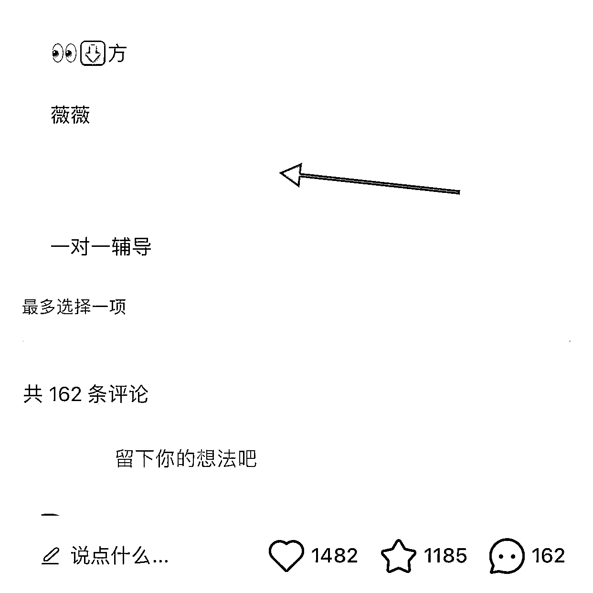
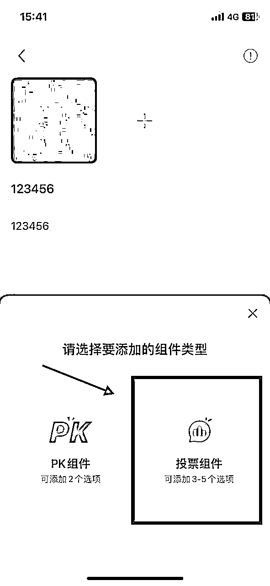
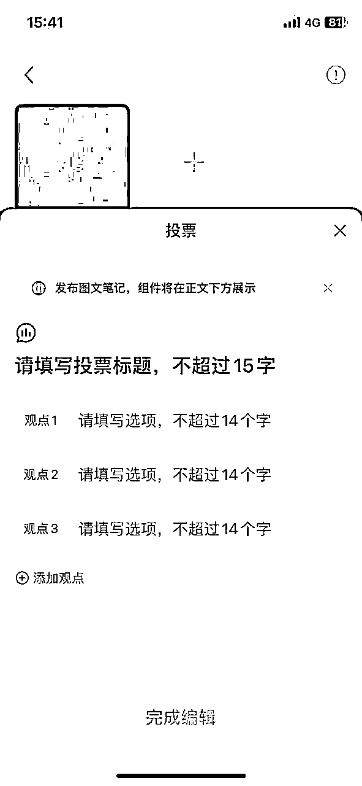
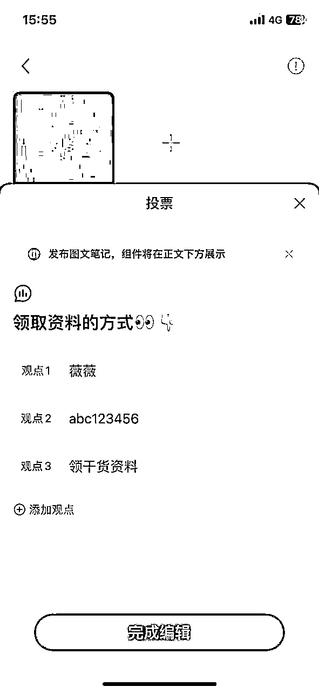
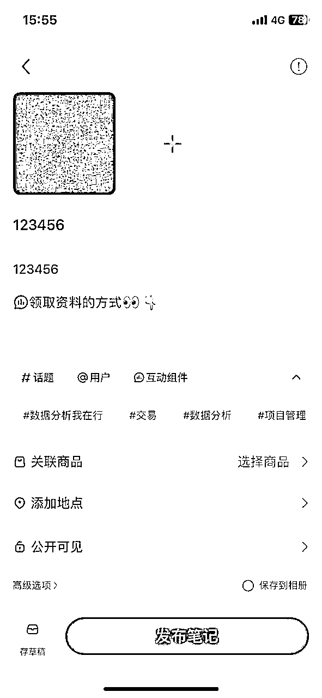
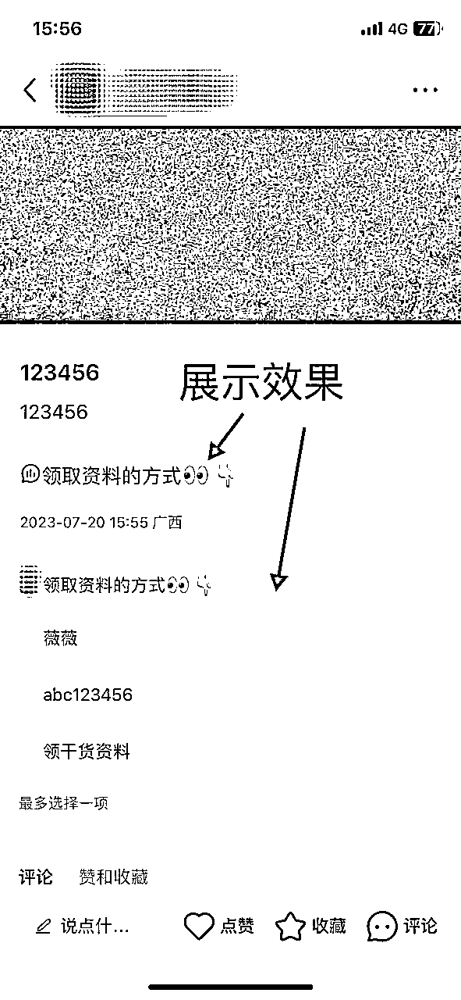
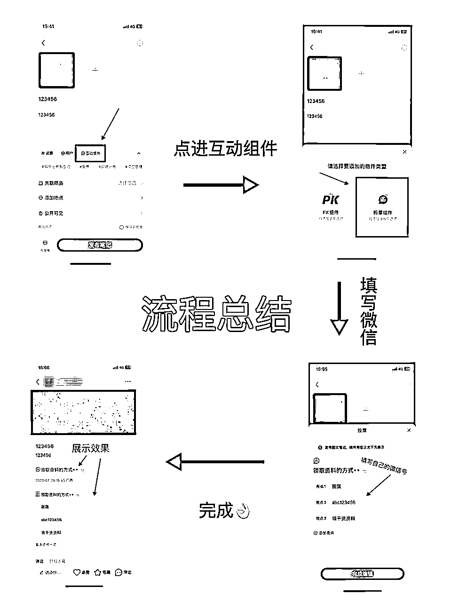

# 【拆解一个不起眼却很安全的引流玩法】

> 来源：[https://nivut760ftk.feishu.cn/docx/TID1dGqddoSenwxWFKxchfvInUf](https://nivut760ftk.feishu.cn/docx/TID1dGqddoSenwxWFKxchfvInUf)

各位生财的圈友们，大家好，我叫艾小飞，一个靠自媒体创业还债的95后，擅长小红书引流和无货源店铺

我相信很多做私域的生财圈友们，在小红书上引流都会遇到一个头疼又难受的问题，那就是如何从小红书上低风险的把客户引到自己的私域上

大家都知道小红书对于引流的打击是非常严格的，正好今天官方又出新规了。

堪称史上最严，放张图给你们感受下

因此很多做私域的生财圈友，在小红书上引流都被限流或封过账号，包括我也一样，引流行为相当于是背着平台偷平台的流量到自己的地盘上。

上有政策，下有对策。既然平台有他的一套检测引流的方法，那么我们做私域的，也有自己的一套避规检测的方法，尽量做到不被平台所发现

就拿现在主流的几个来说，刚开始像【小红书群聊】，【评论区私信】，【置顶笔记】，【主页简介@ 小号】 等这些都还是有用的。至少举报了不被限流或封号。

但随着引的人越来越多，平台发现很多客户都不在自己地盘上交易了。导致威胁到平台的核心利益。就开始严厉打击这种行为，现在基本上只要被举报，没有说不成功的！

考虑到账号的安全性，所以主流的引流方式，已经不再适合我们用了

既然这些方法行不通，但我们的引流需求还是一直存在的，小红书上引来的人都是很精准的，而且消费能力也比别的平台强，很多生财圈友对小红书引流也是既恨又离不开的那种感觉

没办法，那只能再去寻找下一个安全系数更高的引流方式了

在这里先科普一下，目前没有哪个引流方式是100%安全的

之前我也看到在公众号和知乎上，有人声称自己有100%安全的引流方式，被封包赔

或者说是自己认识小红书团队的内部人员，可以做到永不封号的...

在这里我想跟生财圈友说的是：

这些全是骗子！

全是骗子！

全是骗子！

除非你玩“氪金模式”，要不封号就是家常便饭的事

所以玩引流的圈友们，不要太在意封号的事，封了就注销重来，没啥大不了的。只要这个账号能给你带来精准客户就行了，其他的就交给运气吧

那么话说回来，我是怎么发现这个引流方式的？操作流程是什么？为什么它会比主流的更安全？

我一步一步的拆解来给你们说

我先来说说，我是怎么发现这个新引流玩法的吧

因为我有个工作板块是教人怎么做小红书的嘛，在小红书引流也成了我必做的工作之一。基本上每天都会在上面浏览同行都是怎么做的，是怎么引流的。给技巧上带来点灵感

其实同行之间的引流方式还是照旧的老套路，直到有一天我无意刷到了像这篇的引流笔记

他这个玩法还挺有意思的，操作流程是借用平台推出的互动组件中的投票功能，来填上自己的微信号，从而做到曝光引流

当时也惊叹他挺会玩的，居然还能这么操作！

我也去全网搜了一遍，发现基本上没人去讲这块的玩法思路，可能是赚钱或有价值的东西，也没几个愿意分享出来吧

同时很少有人会站在引流的角度，去用到这个投票的工具做引流

他这个是怎么玩的呢？我用小号来现场给你们模拟示范一遍吧

怎么操作：

当你编辑好笔记后，在文案区的下面那栏，会有一个互动组件

点击后选择投票组件

会出现下方这样的提示

在标题写引导话术

观点1写上这是什么

观点2写上你的微信号

观点3写上你的福利品

然后点击编辑完成，它就会出现在文案区那

发布完成后，它会展示在你的笔记评论上方了

不管投不投票，谁都能看得到

它这个操作流程是不是很简单，基本没什么技术难度

为了测试这个引流的安全性，我用不同的帐号来举报我这个小号笔记，连续举报多次都显示不成功，那说明这个玩法还能玩

我猜想可能是现在用这个方法的人比较少吧，平台目前还抓取不到这篇笔记有违规的问题，也因此我们能通过这个漏洞去大量的做私域引流

这里想跟生财圈友们说的是，这个引流方式并不是长久的，它也是有时效性的，至于多久，要看当时有多少人同时去用了这个方法

如果做的人多了，平台感到利益又受到威胁了，就会马上封住这个漏洞，到时候又回到刚刚所说的，一旦被举报，就马上被封号

虽然它目前来说还算是比较安全的，但我也发现了它有一个不太好的缺点，那就是相对于其他主流方式，它的引流效果是比较差的

如果你不靠引导的话，很少会有人知道那是你的微信号，所以这个时候需要借助你的话术去引导了

那要怎么引导呢？

在这里我也可以简单的说下，平时都是怎么去引导他们的，大家仅供参考吧

当有人在评论区留言“怎么领资料”时，我会回复：“后台踢踢，给你看份干货资料，对你真的有用！”

先把后面来看热闹的人，吸引他们来评论的兴趣，并引导他们来私信我

当评论越多，流量越多，私信的就越多，从而引起蝴蝶效应

别人来私信找我的时候，我会回复：

“你看我刚刚那篇笔记的投票那➕我个人号”

“资料全程干货无废话！还免费的！快去吧”

(分为两段同时发送)

过程麻烦点，但也能筛选不是真正有需求的人

如果你们想要更高效引流的话，这个不要作为你唯一的引流方式，还可以结合其他的同时一起去布局

比如

A帐号用的是小红书群聊引流

B帐号用的是评论私信引流

C帐号用的是投票引流

...

当你的A帐号被封号限流时，至少还有B和C帐号在支撑着，然后用新号补上A的位置，形成一种循环

这样能保证到你每天都有稳定的客户引到私域上，同时效率更高，还能把风险给摊平！不至于一个帐号被封了就到没饭吃的地步

好了，分享到这也差不多了，其实这篇更多讲的是一种思路吧

因为我觉得任何一种引流玩法它都会过时的，但只要你理解其中的底层逻辑或思路，去举一反三的应万变，那我相信往后你再发现新的引流玩法时，还能如鱼得水的去操作它

好了，也希望你看完这篇后，能给你带来思路上的启发，谢谢生财圈友们

我叫艾小飞，擅长小红书引流和无货源店铺

我们下期再会！

原创：艾小飞

转载可私信

禁止搬运和抄袭

微信：aifei9977 （记得备注来意）