# 【技术图文教学】新手上手AI绘图使用SD实现小红书抖音引流图隐文制作

> 来源：[https://txtvyc0oe3h.feishu.cn/docx/U1eDdWarPojv4dxyscXcIpZunG4](https://txtvyc0oe3h.feishu.cn/docx/U1eDdWarPojv4dxyscXcIpZunG4)

# 

*   自我介绍一下，花名玉米，搞一些AIGC的前沿研究和应用

*   之前搞了个一个简单玩具实现嵌入式图隐文彩色隐藏图微信二维码（保存图片微信扫一扫打开可添加好友），

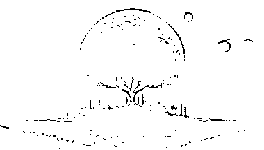

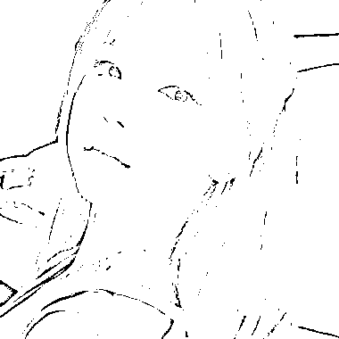

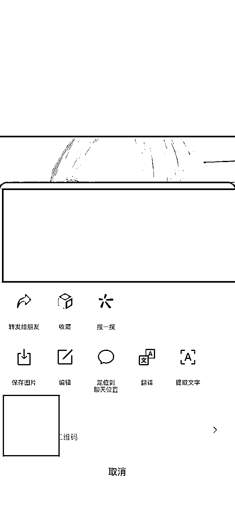

# 这次分享一下生成式艺术二维码

# 一、生财价值

本周随着AI绘制二维码得爆火，视线又重新聚焦到了SD上，而与之同源得生成式图隐文在周末也在小红书引流爆火

这张乍一看平平无奇，却在网上疯传的AI生成美女图片：

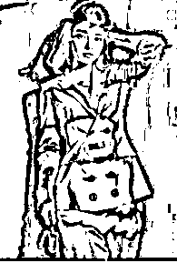

眯起眼睛你就能在图中看到牛逼二字，因而改图又被称为🐂🖊姐

而小红书和抖音的一些引流团体也看到了新瓶换酒的引流机会

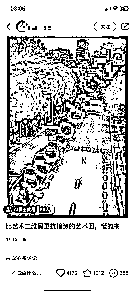

2天，4000+点赞，1000+个收藏，300多条评论

基本都是在问方法的，引流转换成交估计规模不会小

而且，目前该帖子仍然持续曝光，说明小红书对于这种图片添加微信信息的手段无法检测，适合引流到微信转为私域

速度快的圈友已经在复刻变现。

但说实话这个方法很难吗？

PS能做到，但是SD能以更低成本进行工厂生产，

而且，

操作难度不高，基本属于SD的起手式

放些生财有术的生成效果（将就看看○|￣|_为了方便辨认压了下图

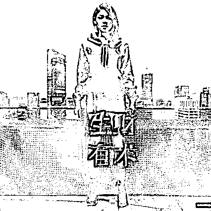

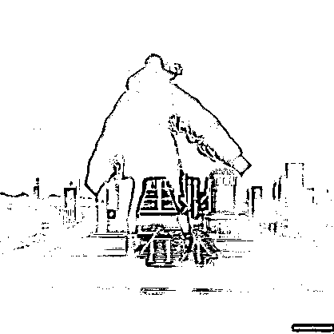

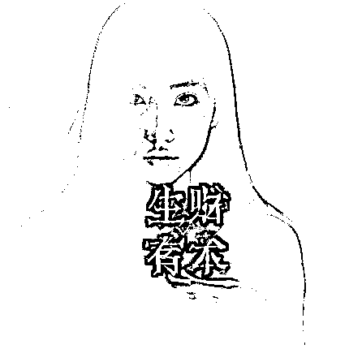

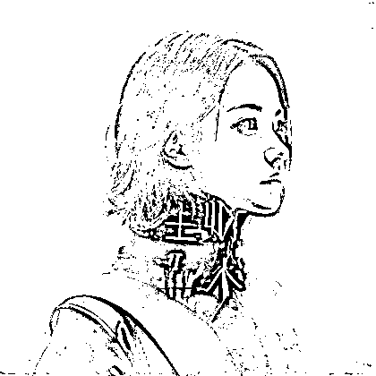

# 二、保姆级教学

# Stable Diffusion 的安装

可以去B站看秋葉aaaki的视频里找整合包，相当于一个压缩包解决你一切配置问题，下载解压就行，也可看视频里详细教程

https://www.bilibili.com/video/BV1iM4y1y7oA/?share_source=copy_web&vd_source=6c09aa7f53b69992e1cd572bbd2dbf94

在解压的文件夹找到这个启动器启动

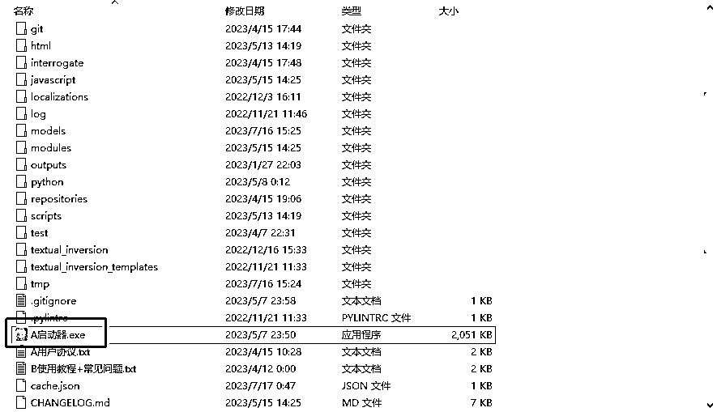

# 模型的安装

按蓝鸟的歸藏大佬分享使用的是Beautiful Realistic Asians

https://civitai.com/models/25494/beautiful-realistic-asians

但根据我实践的经验，你使用任何模型都对生成的结果影响都不太大

如果说一张图片得组成分为背景图片和前景文字

模型和提示词只影响你生成的物体，而不影响他将图片和文字区别的特效

所以说这个项目的门槛低，但是上限高

一个跟文字结合得合适的物体的展示效果会更惊艳，但是你用默认的模型效 果也不会差到哪里去

下载结束后点开秋叶的启动器，左侧tab模型管理，右侧选择Satble Diffusion模型，然后点击上方的打开文件夹，把你下载的模型粘贴进去就行。搞完之后点击第一个Tab的一键启动按钮等待启动就行。

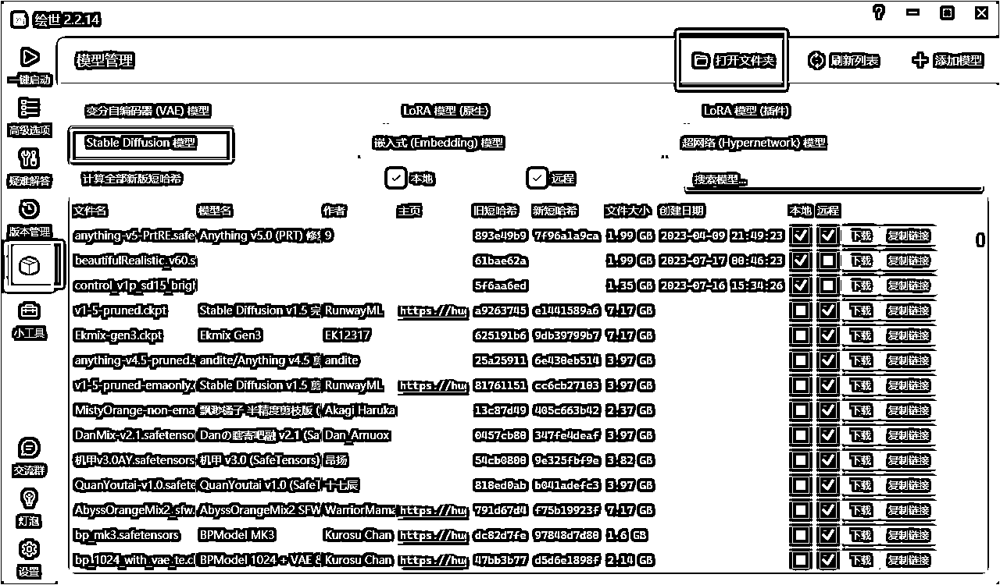

# ControlNet的安装

ControlNet是Stable Diffusion的一个AI插件。提供“额外的输入”的功能

，控制SD生成的细节，包括草图、边缘图像、语义分割图像、人体关键点特征、霍夫变换检测直线、深度图、人体骨骼等。

同样可以参考B站的视频

https://www.bilibili.com/video/BV1fa4y1G71W/?spm_id_from=333.337.search-card.all.click&vd_source=e99f85042059f2864f5cca20d71575f0

打开的Web UI界面找到扩展tab，点击下面的可用，再点击从网址安装，输入这个链接https://github.com/Mikubill/sd-webui-controlnet 点击安装就行。装好之后重新启动web UI。

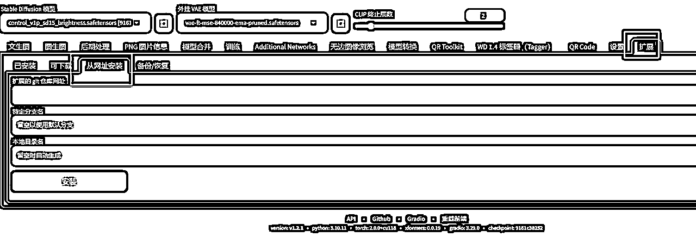

其次要在重启后的SD放入项目的核心：Brightness模型

https://huggingface.co/ioclab/control_v1p_sd15_brightness/tree/main

将模型文件放到 \models\ControlNet 下就行。进入SD后刷新加载。

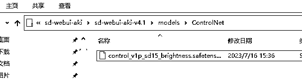

# 图片生成

前面都是准备工作，这部分才是实操

## 用PPT或者WORD生成一张黑底白字图片

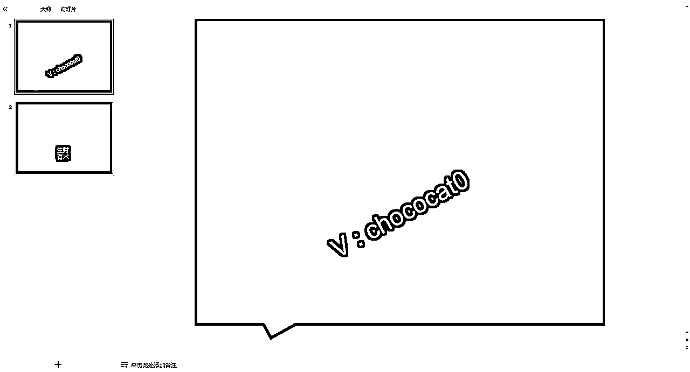

## 选择模型，写入正向提示词，反向提示词

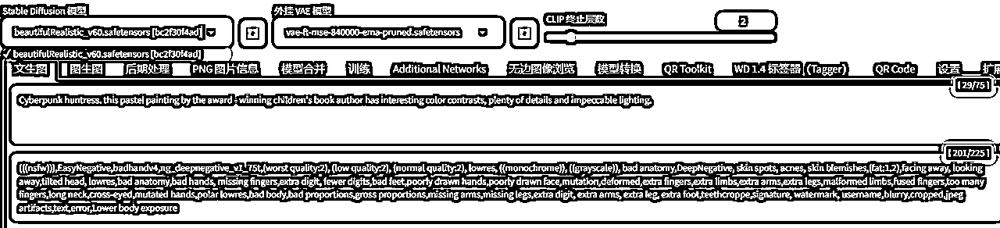

## 设置一些基本参数

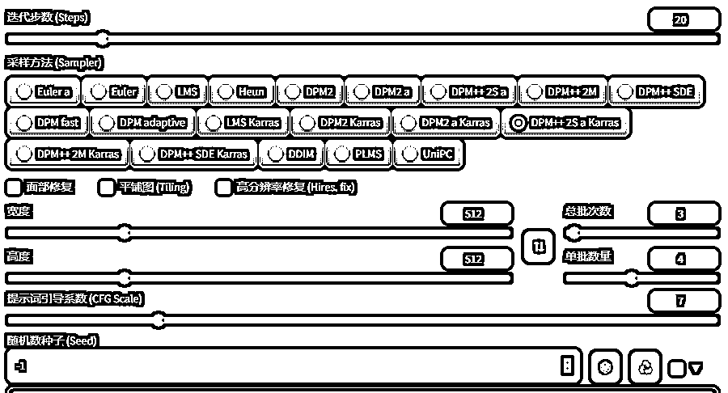

## 载入controlnet并加载brightness模型并设置参数

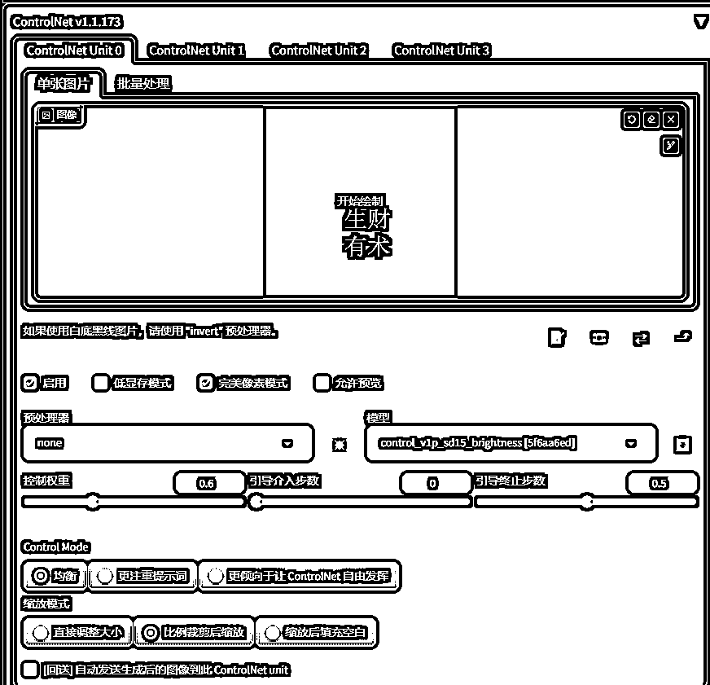

值得一提的是，权重的设置建议0.4-0.65。数值越大，图案就会越明显，但相对的，文字和图片的融合度也会越差。复杂调高点，简单的图案调低点。

另外两个参数代表着ControlNet什么时候介入长短，可以近似认为整个流程处理时间为1，百分比的时间代表controlnet开始工作。数值越大后面留给模型处理融合的时间就越少，文字融合度就会变差，数值越小模型介入过早就会破坏已有的结构导致看不清文字。

点击生成就可以，重复上述步骤多尝试

# 三，结语

尝试了不同的风格图片，其实核心还是在controlNet和提示词上，本体模型用啥反而意义不是太大。

以及这个brightness是个光影对比的东西，所以在一些明亮对比元素的效果会更好

还有建议如果用来作为微信引流，

微信名

不要太长，小心字看不到

尽可能不要用一些字母，容易混淆，比如a和c和o

尽量有一些空格做区分，比如rn和m

贴点错误样例：

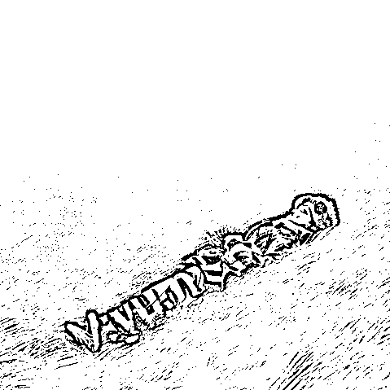

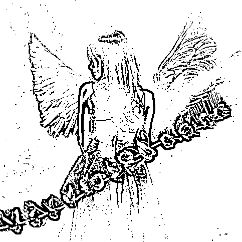

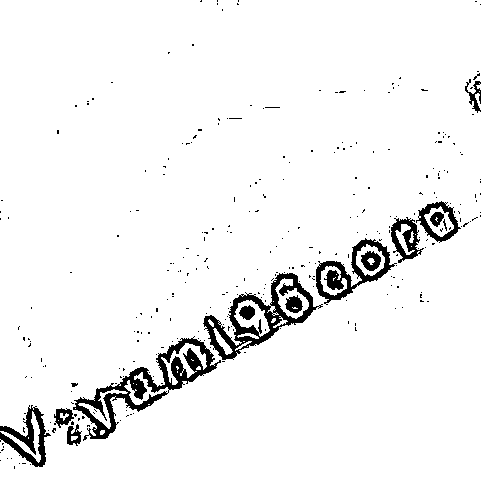

再以及，底图的文字可以适当倾斜减少检测概率

