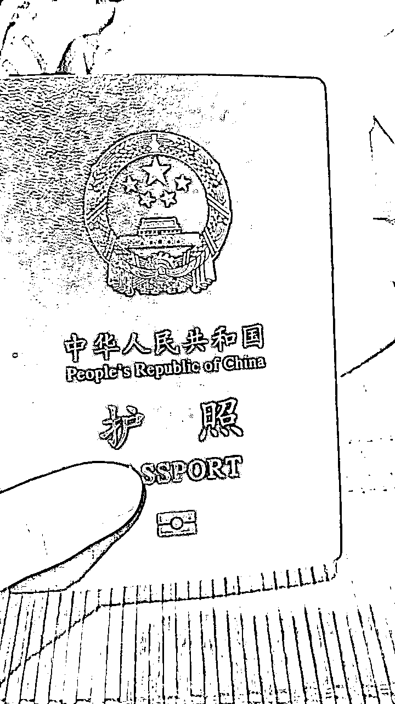
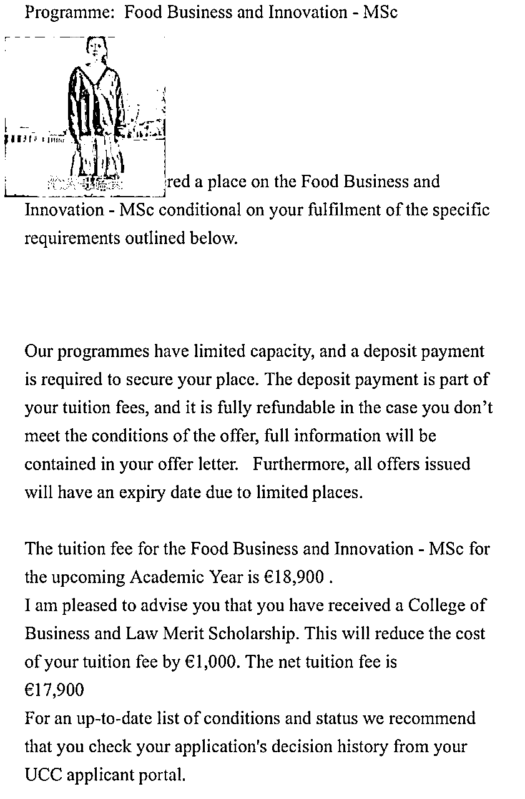
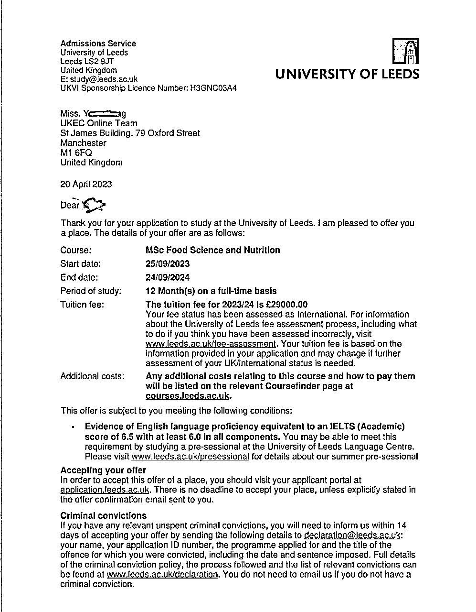
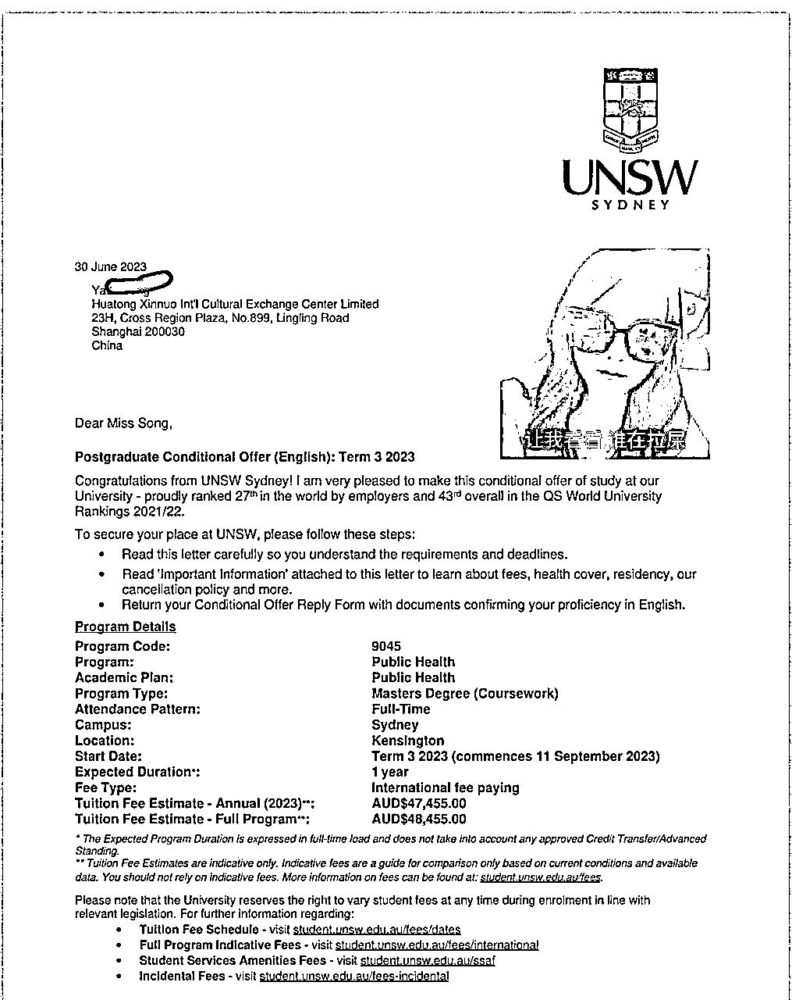
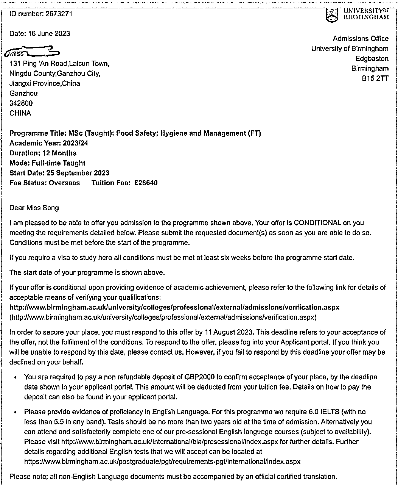

# 专科起点，贫民背景如何拿到qs19的名校offer？

> 来源：[https://n28vbku1px.feishu.cn/docx/UTECdFNQqoD7Sbxyp4UcHt5cn2b](https://n28vbku1px.feishu.cn/docx/UTECdFNQqoD7Sbxyp4UcHt5cn2b)

# 一、背景介绍

## 1.1家庭背景

我出生在江西赣州的小农村，我家里就是非常普通的家庭，爸爸妈妈都是小学文化。

我高考失败的时候，因为家里实在没有钱供我上专科，我爸当时基于家庭情况让我不要去上专科。这次我出去留学的钱也都是东拼西凑起来的。

（我家后门）

## 1.2学术背景

我是彻头彻尾的学渣，高考369分，全国卷，我专科的gpa 2.55 均分70.50， 本科的 gpa 2.8726 均分 77.23。

我没有参加过任何的学术研究活动，也没有给申请学校提供任何的学术推荐信。

## 1.3个人背景

自己是一个相对比较独立的人，自从我高考之后，我就一直开始自己赚钱。我上专科和本科大学的学费，生活费基本上都是自己赚的。

我做过非常多的兼职，发传单，送快递，进电子工厂当临时工，很多底层的工作我都去做过。

巧合之下我接触互联网，我就不断的在吸收互联网上的知识，做直播，写内容，做输出，在互联网上积累了大几万的粉丝，也通过互联网赚了一些钱。

比较幸运的是我在去年本科毕业之后，我就在圈友沈小善（我老板超级nice）的公司里做我专业相关的工作，积累了非常多的实战经验。（这对我的申请有极大的助益）

# 二、决定留学前动作

我经常关注曹大的内容，不管是他的文章，星球还是直播我都有看。

之前曹大有提醒年轻人，如果有条件出去留学的话，一定要出去留学，所以出国留学这颗种子是曹大给我种下的。

我从来没有想过我能够出国留学的，我甚至连护照都没有。但当我心里有这颗种子之后，我就会去关注这一块儿的信息，经常去刷一些短视频，刷到一些中国人在国外的生活与工作。

当这个念头越来越强烈的时候，再加上那个时候我的工作状态不是很对，所以我就特地花了几天时间在小红书上，在抖音上看了非常多在国外生活的中国博主的动态，包括一些留学的信息。

（今年刚办的）

# 三、留学目的

做任何事情都要考虑自己的目的，关于我留学这件事我想了很久，因为留学对于我来说并不是一个很轻松的事情，它需要我付出极大的代价，不管是时间，金钱还是精力。

我出去的唯一目的就是让自己变更好，让自己能够获得更广的视野、机会以及更多能力去创造更好的生活条件。

我在考虑这件事情的时候，重点放在这件事情的投入产出比上，问了自己一个非常重要的问题，这件事情对我来说最坏的结果是什么？这个情况我能不能接受？

这事情对我来说比较难下抉择，然后我就把这个事情放长远来看，放到五年后，十年后来看，我发现我这么做的时候，这件事情的答案就无比清晰。

如果我去做这件事情，那么我会得到很多的可能性，让我拥有更多的市场竞争力。并且不管是对我个人来说，还是对我的家庭来说，还是对我的后代来说，都有非常大的助益。

而我做这件事情最坏的结果，就是出去没有找到更多的机会，花了两年的时间以及四五十万的钱，收获了不一样的视野以及一定的语言能力和硕士学历，要靠自己努力的把这留学花掉的四五十万赚回来。

我觉得这个最坏的结果我是能接受的，而且对我来说也是有益处的，所以我下定决心做这件事情。

# 四、决定留学后我的动作

## 4.1确定需求找中介

我决定留学之后我就开始搜集各种信息。在一开始我最担心的是费用问题，因为我家境一般。

刚开始的时候我也是没有要求学校要有排名，我想要的就是一个讲英语环境花费又不是那么高的学校，最好是能够让我在当地赚钱的国家。

确定完自己的需求之后，我选定去爱尔兰留学。因为爱尔兰这个国家，花费相对于英国来说没有那么高，且毕业之后有两年在本地工作的机会。

我开始找中介机构，我找了好几家的中介机构都好贵，最后我在闲鱼上找到了个体户，他收了我几千块钱，帮我去办这个事情。

## 4.2 喜讯的开端 爱尔兰科克大学

刚开始申请爱尔兰学校的时候，我提交了我的专科成绩，专科毕业证以及本科成绩，本科学位证，本科毕业证，一封学校的推荐信和一封我同事的推荐信息。

并且写了一个个人简介，这个个人简介我突出的是我的工作经验。根据我申请的专业去写我的工作经验。

我在申请爱尔兰学校的时候，我更想申请营销相关的专业。所以我申请的都是跟数字营销这一块儿有关的专业。

因为营销这项能力它是底层的能力，也是我非常感兴趣的内容。

但我在专科和本科都没有学过相关的课程，这相当于我在跨专业申请，这个难度还是比较大的，因为本身我的成绩就没有优势，我的学校也没有优势，所以我收到了非常多的拒绝信。

我在爱尔兰申请的学校不在乎他的排名，只要他是公办的。在学信网能够查到的学校，qs七八百的学校我都去申请了，结果都被pass了。

在这个过程中我非常的焦虑，并且自己做了一个非常愚蠢的事情，就是在这个过程中等待offer的过程中，因为我不确定有没有学校要我，我就没有好好的准备雅思，这个阶段我就是不断的在自己吓自己，怀疑自己，陷入内耗中。

就在我一度以为自己去不了的时候，我拿到了一个学校的offer---爱尔兰的科克大学。（Qs排名前300，在当地国家认可度挺不错的，就意味着我在这所学校毕业的话，我在当地的就业机会还挺不错的。）

当时我的中介跟我说，你这个是属于弯道超车了，因为他也是这所学校毕业的，并且他现在在国内的某大厂做数据分析这一块。所以他对这个学校比较了解一点。

## 4.3 我的大贵人--曹大 指引🈸qs前100

拿到offer之后，我又做了一个非常对的事情，我拿到offer之后就给曹大发微信报喜了。

曹大就继续鼓励我去升qs前100的学校，而且跟我讲了，升到了qs前一百的学校回国之后会有哪些福利和待遇。

我当时听到这些福利和待遇的时候，我眼睛都冒光了，心里也更有底气了，因为我可以拿爱尔兰那个学校保底，所以我就决定去试试qs前100的学校。

而这个时间也来到了23年的三月份，这里我比较幸运，因为我在后面就会一直去关注留学这一块儿的信息，包括一些中介之类的。

找中介的时候，我就直接会问他，我这个情况能不能去qs前100？我问了好几家中介，他们都说你这个成绩去不了，qs前100，除非你去读预科。（就相当于我得多花一年和金钱的时间去过渡一下。）

## 4.4拿到qs75利兹大学offer

因为有曹大的鼓励，我就没有被这些话吓退，我就继续去问，最后终于让我找到一家相对靠谱的中介，也花了点钱。

他当时告诉我：你这个情况有点悬，我可以给你申请，但是我不能保证一定能给申上，且这个中途中产生的申请费是你自己负责的，如果说你申请qs200的学校，我还有点把握，但是这qs前100真的挺难的。而且你这个申请就只能按照你原来专科和本科专业上学的东西去申请。

我跟他说：没问题，这个专业我可以继续读，你给我申请就行了。

当时他帮我把qs排名前100学校所有有我这个专业且相关专业，并且有可能在我工作领域特别优异的情况下，破格录取的学校都挑出来了，有四所，都进行了申请。

那么在申请qs前100这些学校的时，我的自我介绍以及我的自我陈述信都和申请爱尔兰的学校完全不一样，因为我申请的专业不一样。

我的自我陈述信是主要内容是这样子：

我很喜欢做饭，从小学一年级就开始自己做饭，自发做营养相关内容的短视频，积累了大几百万的播放，并且持续写文字，在互联网上有几万粉丝，

从大学开始就自己开始赚钱，独立能力比较强，我的个人工作经历比较丰富，我就写了很多我的工作经历。（我上大学的时候确实也是从事了食品相关的工作，以及我毕业之后确实是做了减肥这一块儿的内容。）最后我希望未来在这个领域上能够有更大的成就。

这里重点强调我的积极性，主动性，工作能力，包括一些工作细节，（我在线上直播间给别人讲减肥的东西，帮助多少人，减了多少体重）

我的自我介绍欣赏也是重点讲了我的工作经历，我做了什么，我拿到了什么结果。讲的基本上都是和食品，营养这一块儿相关的内容。

在23年五月初的时候，我收到了qs75 英国利兹大学的录取通知书，我马上跑去和曹大报喜了。

## 4.5拿到qs19新南威尔士大学offer

曹大就让我再勇敢一点去试一试qs前50的学校，并且还给我指定了去申请澳洲的新南威尔士大学。当时我申请的时候，他还排在qs 43。我拿到offer的时候，它已经飙到qs 19了。

申请澳洲学校提交的材料和申请英国学校提交的材料是完全不一样的，并且我申请澳洲的学校需要额外付申请费。

澳洲大部分学校学年都是两年，或1.5年，一年制的硕士，非常非常少，而恰好我申请的这个新南威尔士有几个专业是一年制的硕士。

像我申请的这个澳洲的学校呢，他比较看重我们的工作经验，所以我又重新补充了一些材料。工作经验这一块儿，我确实是比一般的学生丰富一些。可以说我上了大学之后，我就没有断过去做各种能养活自己的工作。

于是我又很幸运的拿到了新南威尔士的offer。

# 五：拿到offer后要做的一些细节

## 5.1 做最后选择

当offer和拒绝信基本上都下来之后，那我就需要做出抉择，我到底去哪所学校以及我需要为我以后入学做一些准备工作。

我选择了去英国利兹大学，原因请看这篇文章。

https://mp.weixin.qq.com/s/KJ1axg8mvzCXTH9X1PRntg

## 5.2找同校组织

我把语言成绩提交上去换 uncon offer之后我就开始去找我的校友，这里有一个非常好的方法，就是去小红书上去搜。

我们就能看见非常多的同校同学在晒自己的offer。如果咱再搜细节一点的话，很有可能连咱那个专业的人，咱都能够搜到。

那么在搜到的之后，咱就能够看到评论区有非常多的同学在求组织，这个时候我们也可以这么做。一个很好找到同校同学，扩展自己同校人脉资源的一个渠道。

除了这个方法之外，咱可以一一去给那些求组织的人发私信，请求加他好友，让他拉你进学院群或者租房群或者二手群。

## 5.3积累本地潜在人脉资源

另外一个点，我们去关注在本地工作生活的华人博主，或者是在本地的英国人博主（小红书上有，但比较少），勇敢的去评论，去私信，问能不能加个好友，能不能向他请教一些东西。这也是一个拓展自己另外一个国度人脉的一个机会。

## 5.4准备出国要用的东西

另外一个小点：准备自己出国要用的东西，这些我们都可以去搜小红书攻略，或者在二手群里看信息，以及在学院群，勇敢发言和大家一起探讨，就能够得到一些很好的参考意见。

这里最重要的关键点就是不要害怕，不要害羞，勇敢一点，别拒绝就被拒绝，冷场就冷场，没关系的，这个拒绝我们，我们再找下一个就可以了。

# 六：最后想说的话

我决定出国留学，到我提交完语言成绩，拥有了自己的学生ID，整个过程就跟梦一样。

从去年的十二月初到今年的七月中，留学这个事情算是完全敲定了。

在这将近八个月的时间里，我没有上班，除了每天坚持写公众号，每天在我的付费群里持续的输出内容，剩下的时间都放在留学这件事情上面了。

我的英语语言成绩真的准备了好久，好久好久。我一定要给英语基础不太好的同学提个醒，如果你真的想要出去的话，请把重心放在语言成绩上，因为雅思成绩是两年有效的。

而雅思也不是那么好过，如果你想要学雅思的话，请一定要先去看攻略。把网上一些关于雅思怎么学用哪些资料的视频这文章都看一遍。

自己给自己制定学习计划，并且严格的执行，最重要的一个点就是不要把战线拉那么长。

一个月或者两个月就去考一次，先知道自己的水平怎么样。我给大家推荐一个测雅思模考网站（同桌英语），上面剑4到剑17资料都有，和正式机考是完全一样的。

一定要有耐心，不要中途放弃，如果你真的决定了这件事情，那么请你一定要坚持下去。

因为像国外的一些学校，它效率就是很慢。像一些offer他发的就是很慢，就比如我拿到qs84伯明翰的这个offer，它是六月底给我发的。

这个过程中非常磨我们的心性，特别是在申请学校这个过程中，我们不要光听中介去讲什么，我们要听从自己内心的声音，然后去验证。

因为从我个人申请的经验来看，我发现目前很多中介都是不太靠谱的，他们不知道国外大学真正要的人才是什么样子，像我就是一个非常典型的案例。

我真的是没有想到我一个出身很底层，彻头彻尾的学渣居然能拿到qs19的名校offer。

不管现在多差，别人怎么否定咱，你要做的事情在大众眼里有多么不可能，别放弃，持续行动，剩下的交给时间。

最后的最后，在这里我要郑重的感谢这一路给我光的人，感谢勇敢且不放弃的自己，感谢我的大贵人曹大给我明路，感谢我开明的父母。感谢我的付费群里的小伙伴一直陪伴着我成长。感谢卷烟厂的厂友一直给我的滋养，非常感谢生财有术，如果我没有进生财有术，那么我的命运之轮可能就不会开启。

最后非常感谢花时间阅读的你，如果你有任何觉得我能提供帮助的地方，请不要和我客气，直接联系我就可以了（V： 9479948）