# 抖音SEO,三天将视频做到搜索排名做到第一，被动gmv1.2万

> 来源：[https://uqlqfu18jy.feishu.cn/docx/UmKfdykB9oavtTxLh5McUyrMnML](https://uqlqfu18jy.feishu.cn/docx/UmKfdykB9oavtTxLh5McUyrMnML)

前几天将自己做抖音SEO测试数据，发到了风向标且已中标。有圈友过来链接询问，到底是概率还是有方法论。我明确告诉他有方法论，并把我的参考资料发送给他。现在写个分享，把我的前因后果所有方法论全部为大家分享出来。

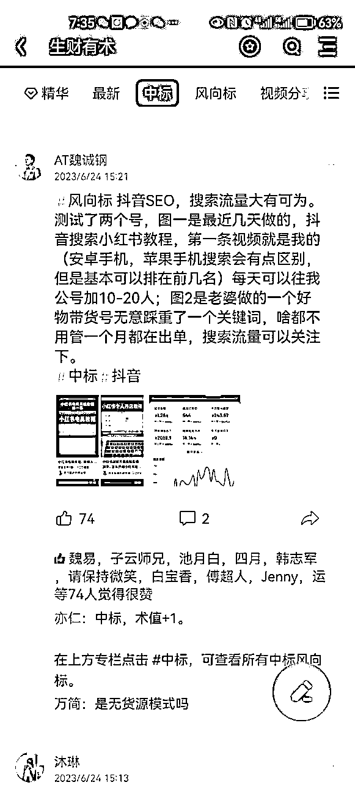

# 先看结果

# 1.大家可以用抖音搜索【小红书教程】

结果当中前面三条,有一条会是我的视频，我的账号叫做学演讲的魏诚钢。（苹果手机和安卓手机的搜索排名会略有的不同，但是整体来说搜索这个关键词会刷到我的视频）

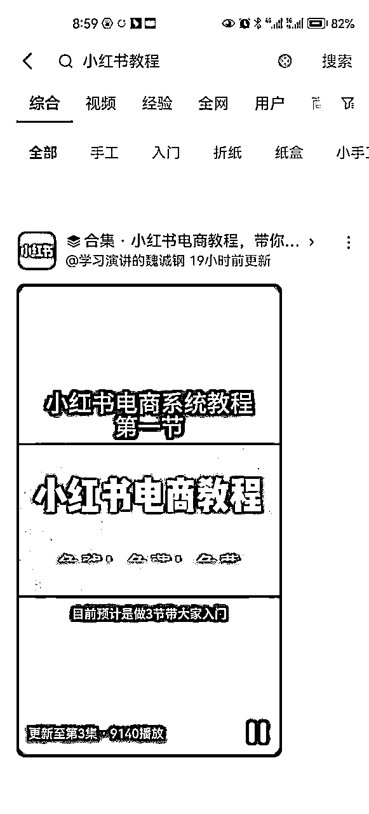

# 2.大家用抖音搜索【叫叫鞋】

结果会显示出商品，原来第1条商品的第1个视频就是我的账号，（这种搜索排名与商品排名有关，如果商品的排名下去，那么视频的排名也会下去）

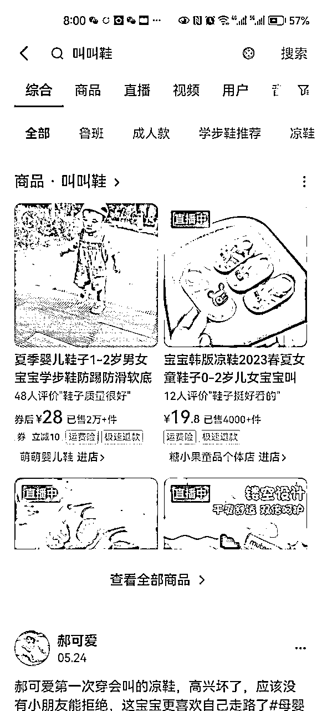

# 3.原理介绍

抖音SEO，即抖音搜索结果的排名，我们要做的事情就是要找到有人搜索的关键词，并且用这个关键词创作出视频，然后让他的排名排到前五，基本上你的视频就会有源源不断的被动搜索流量过来。而且这些搜索流量是非常精准的。如果说做账号前期没有很高的推荐流量，那么这个方法可以慢慢的把账号的搜索流量拉起来。只要你布局的搜索关键词越多，那么你的流量也会越大，小红书也是一样的，下图为小红书数据截图。

# 4.方法论

## 1、首先要进行选词

这个词要确定他有搜索量，还要确定他有潜在的转换价值？比如说搜索【小红书教程】的人，都是有学习小红书的意向，那么我是不是可以考虑把他们引流过来，收徒变现或者卖社群呢？

## 2、选词方法

最简单的方法就是抖音搜索框的下拉关键词！你可以根据你的行业来挑选关键词，行业确定以后，我们要确定这个搜索词，有没有人来进行搜索，或者他的搜索流量有多大。

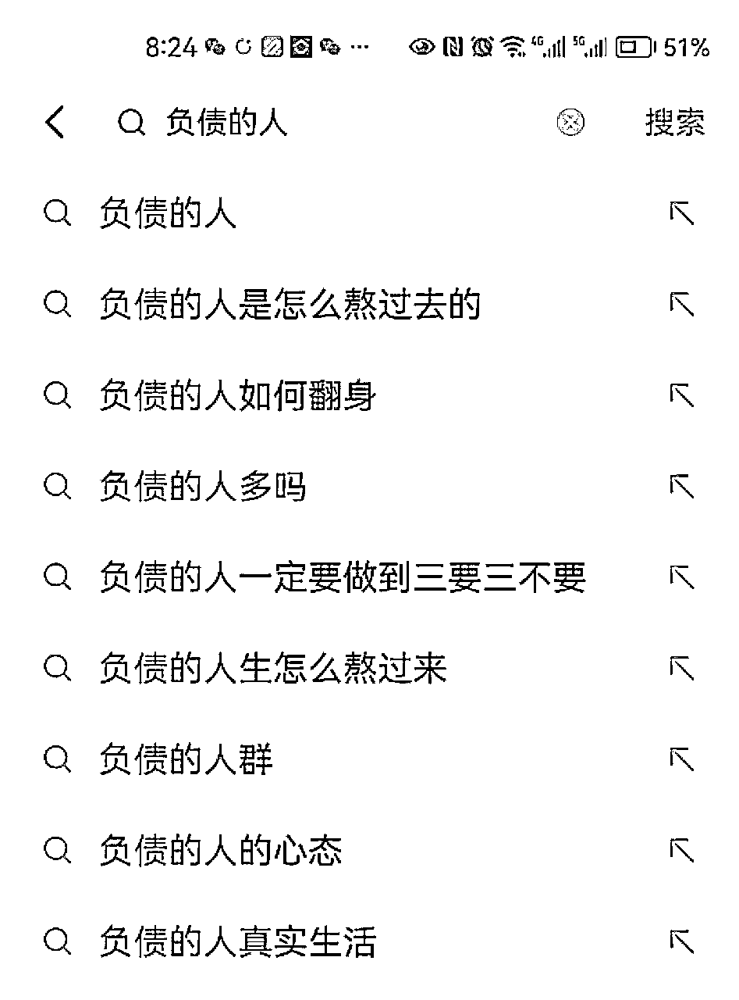

确定搜索词的流量大小，可以用到两个工具

第一个，叫做巨量算数，这个工具免费，但展示的结果是指数，并不是准确的搜索量，可以将指数除以2基本就是大概的搜索量。

https://trendinsight.oceanengine.com/

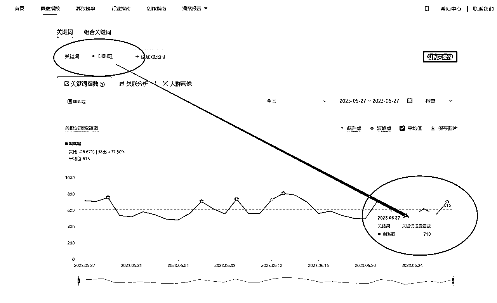

第二个，巨量广告的推广后台，账号不要钱但是需要广告开户，就像百度竟价一样，这就是准确每天的搜索量，我是借的朋友的账号来查看的。

https://ad.oceanengine.com/

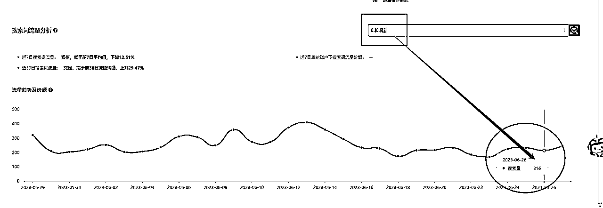

## 3、排名逻辑

账号属性有非常大的加权优势，蓝V号的排名权重比普通号的排名更靠前

举例：同样以【小红书教程】为关键词，同类型的视频，蓝V号发出来的视频与普通号发出来的视频，排名对比，蓝V号会更靠前。就像公众号搜索排名一样，认证过后的号会比普通号排名会更靠前。

合集的排名优势比单条视频的排名优势更靠前，所以我们如果是普通号，做某个关键词排名，可以发到3-5条视频，以合集的方式在争抢靠前的位置。

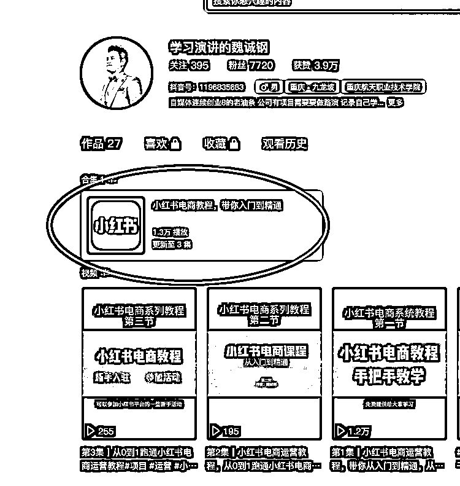

## 4、视频制作

内容从文案到视频需要原创，不能直接搬运！可以借鉴对标号的内容，但是一定要写出自己的理解风格，搬运是没有钱途的，换句话说，如果你的目的是引流，搬运内容很难转化；如果目的为了把账号拉起来，搬运的内容，容易被平台判重，账号做不起来的。

视频的开头结尾，要反复强掉关键词。如图！

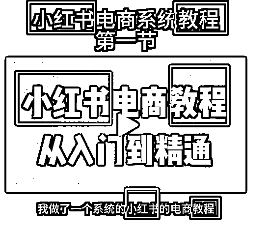

内容表现形式可以用图片+配音+PPT进行混剪；也可以用口播的方式进行录制再加案例图片。抖音SEO这个事情，我个人觉得是大力才能出奇迹出结果，所以内容质量可以刚过极格限即可，尽可能的低成本高效的产出内容，持之以衡方能吃到这波流量红利。

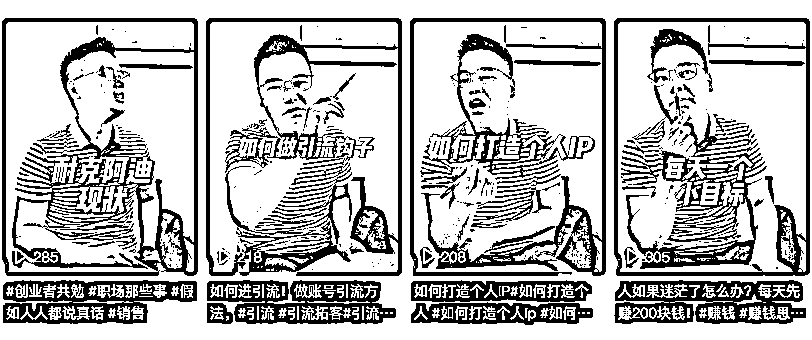

## 5、内容发布

合集在创建过程中，标题及描述中需要包含关键词，标签中也要包含关键词，以【小红书教程】关键词为例，以下 是我测试的视频标题及合集标题

合集标题：小红书电商教程，带你入门到精通

视频标题：

第1集|小红书电商运营教程，带你从入门到精通，从0到1跑通小红书电商运营#项目#运营#小红书#电商

第2集|小红书电商运营教程，从0到1跑通小红书电商运营，笔记标题封面如何制作#项目#运营#小红书#电商

第3集|从0到1跑通小红书电商运营教程#项目#运营#小红书#电商

## 6、钞能力改命

当做好以上细节过后，排名靠前还要考核点赞量，新号没有粉丝，视频没有推荐很难短时间的把播放数据做起来，这个时候需要用DOU+来进行加热，我的合集3条视频，第一集，投DOU+400元，有60元的优惠卷。

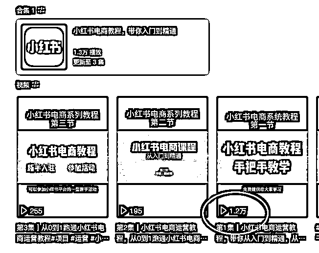

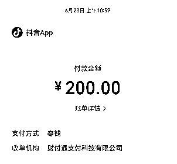

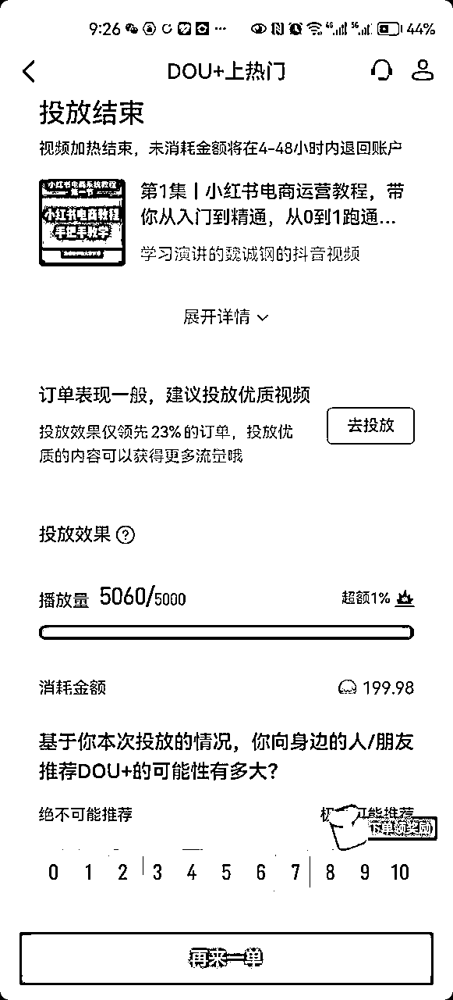

## 7、排名维护

随着包含类似关键词的视频越来越多，我们的排名有可能会靠后。此时若想长期保留排名，可以源源不断的往合集里添加视频，也可以再用DOU+进行加热巩固排名。

# 5.带货方法论

如果用于带货，关键词需要为商品关键词，且搜索出来的结果当中，商品链接排名前四，主页没有视频。即，这款商品本来在抖音当中就有搜索排名的，且在前4位，但是没有达人在带此款商品，所以连接中不会有视频展示，如图

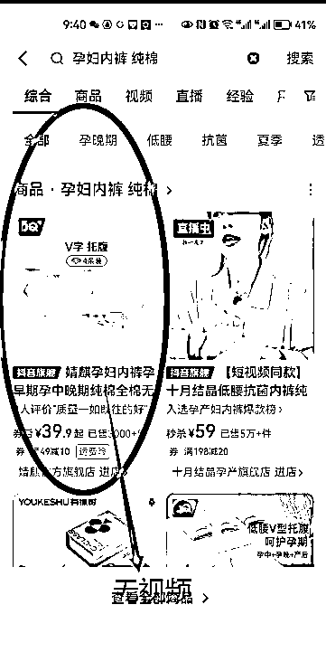

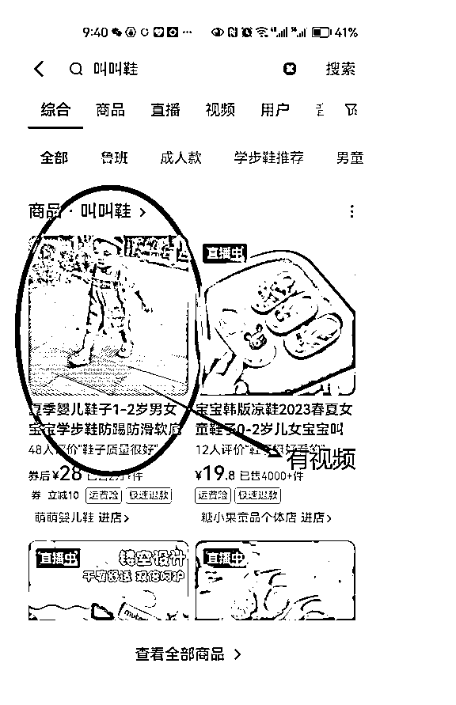

此时，你需要去找商家申请样品，拍摄出一个质量还比较OK的视频，然后挂车发布，并把视频连接发给商家，与让商家沟通，让他设置为你的视频在产品主页展示。

此时，用户搜索商品关键词，显示的是商品链家，但是商品链家中有你的视频，多数用户都会点开视频来看看再下单，此时下单基本都是从你的挂车视频里下单的，用户成交后你会获得佣金，只要商家的排名一直在，你这条视频就会一直有收益。

这段要多看几次，逻辑要多理解几次，没有了解这个的，理解起来稍微有点繁琐。

# 抖音SEO结合实体产业变现

搜索过来的流量都是十分精准的，有强烈的目标需求，可以把抖音SEO当作11年到14年的百度来使用，很多搜索词是大有转化的。写这篇文章的时候去搜索了几个词，有好几个都是我朋友的。被动客户过来，很香。

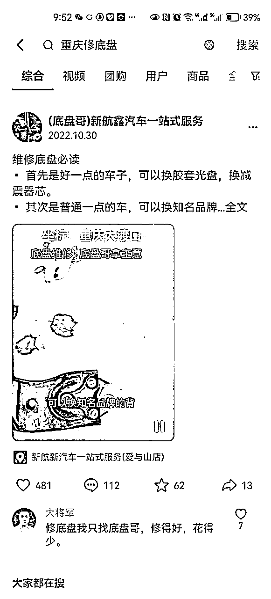

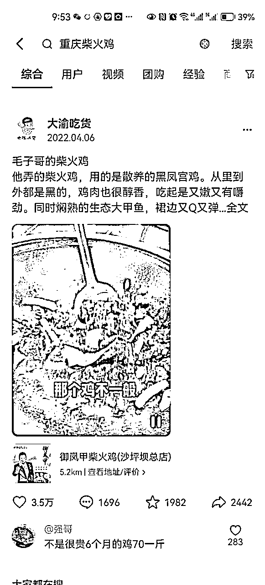

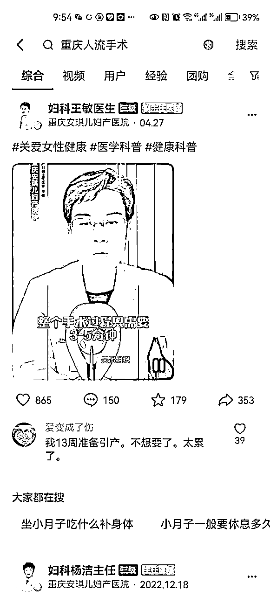

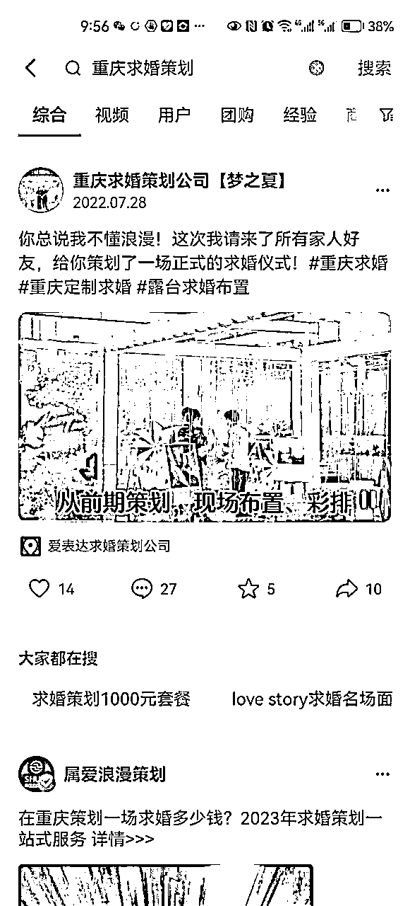

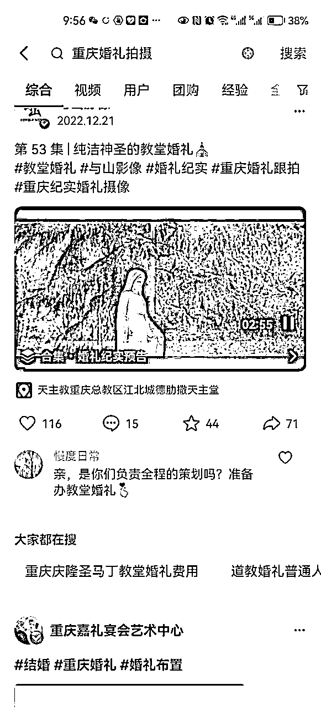