# 普通打工人，靠内容创作三板斧做干货型图文，平均月入5000+

> 来源：[https://m7y7vqso3n.feishu.cn/docx/UmWAd72iSowFNMxbNjecofx8n33](https://m7y7vqso3n.feishu.cn/docx/UmWAd72iSowFNMxbNjecofx8n33)

# 一、情况介绍

大家好，我是小红书干货型图文博主王多维

应该是在去年不到半年的时间内有20多篇千赞爆款，巅峰时期我连续4篇全是千赞爆款。

今年2月份到6月份，我靠小红书变现2.5万多，平均每个月收入超5000

对于一个每天上班的打工人来说，是一笔不小的收入

而且我做的干货型图文非常适合普通人，也是我0基础摸索出来的形式

现在做一篇干货型图文只需要半个小时到1小时

数据比平均水平要高出很多

巅峰时期，爆款率达到80%，一篇笔记就能涨粉几千

接下来我会逐步拆解我的做法，希望和大家交流

# 二、人设定位

普通人做小红书第一步就是要做人设定位，人设定位的目的就是告诉观众，你是谁，你能提供什么价值

定位确定好了，你的目标人群自然就确定好了

对于定位，有很多老师教了很多方法

有三步定位法，四步定位法之类的，我也学过不少，但我觉得：

定位的本质就是跳出认知局限，通过上帝视角看自己

以我为例，我在做小红书之前其实就是个普通人，刚毕业参加工作

我那时候就喜欢写一写，做过很多平台，百家号、头条号，也尝试过抖音书单号

不过都没做起来

后来我重新审视了一下自己

我自己刚毕业，是四年班长，对大学的情况还比较了解，加上我是211本硕，虽然说学历不是特别高，但也能超过60%的学生，加上我又喜欢研究个人成长，所以我给自己定位就是一个老学长。

很多人都会去选择赛道啊，说这个赛道好，那个赛道不好，这个赛道容易火之类的

我觉得都没有意义，首先你自己要能在这个赛道持续输出

要在这个赛道有天然的优势，否则就是炮灰

但这里还有个坑，我当时是踩进去了，希望看到这篇文章的你以后不要再踩了

这个坑就是商业化定位

我当时没想清楚我以后要考什么变现，稀里糊涂选择了PPT类型的干货型笔记

这类笔记干活价值高，信息密度大，但是广告展示位少

和我同量级的博主都很快月入过万了，我还在5000多徘徊

不过我这类笔记也有好处，这个我们后面再去分析

总之正确的定位就是人设定位+商业化定位

既要想清楚你是谁，你提供什么价值，又要想清楚你靠什么变现

# 三、号设化管理

想清楚定位后，就要围绕定位去设置：昵称、头像、背景图、个人简介

当时小红书上有个非常火的号，这就是一个号设化非常成功的号

她的昵称就叫学习方法，头像也是绿色和黄色风格的学习方法四个字，可以说头像和昵称就体现出了定位，再看简介，一句话，持续分享拿来就用的学习方法，清晰明了，看到这基本上就知道这个号是干什么的了，简介里还写了联系方式和引流。

然后看每一篇的内容，第一句话就是：用学习方法把你变成学霸是我的责任，又凸显了这个账号的定位，在评论区，也写了引导浏览和关注，整个笔记风格就是绿色和黄色搭配的风格。

当时我就被震撼到了，所有的元素都是为定位服务的，这个号主一定是一个厉害的人，后来知道了号主是谁，果然是一个很厉害的人。

所以我对昵称、头像、背景图和个人简介做了很深入的研究，我这里把我当时的研究贴上来，给大家参考。

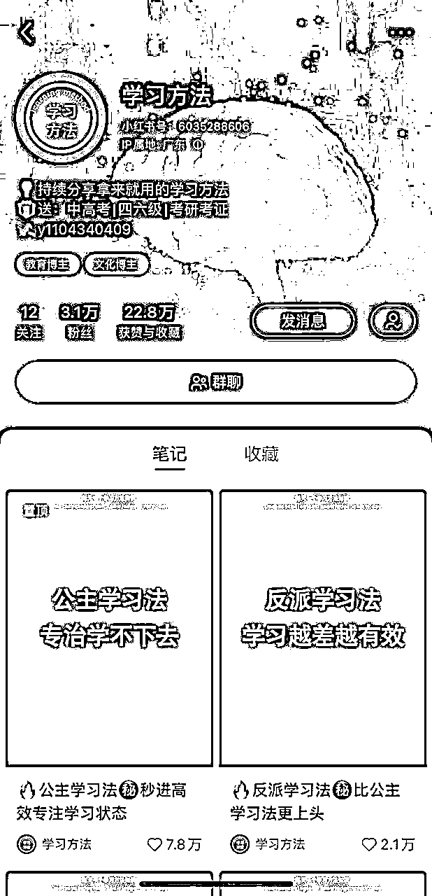

## 1、昵称

昵称就是在小红书的名字，取昵称要有这3个原则：

1.避免重复，方便用户搜索

2.简单上口，方便记忆和传播，2-6个字，不要出现繁体字，特殊字符

3.平台一致，保持全网统一

几个昵称起名方法

### 1、名字或者名字的简称

李子柒、房琪kiki、粥左罗、刘耕宏

真名或者简称能拉近粉丝距离，提升信任感

适用人群：真名还不错，有一定影响力的时候

### 2、兴趣领域+昵称/昵称+兴趣领域

绵羊料理、旁门左道PPT、跟春花学PPT、科学育儿小七老师、平儿学姐爱护肤、专搞学习的图图、小哈聊沟通

常用公式：昵称+干什么 干什么的+昵称 昵称+名词、跟着+昵称+干什么

### 3、专业岗位（身份）+昵称

叫我O老师、语文老师郑女侠、收纳设计师万万、设计师楠哥

房产卓、多维学长、学姐潇潇、三吴学姐、松青学姐、耶鲁学姐笑笑

这类就是体现专业性、提升信任度

有地域性质的职业，比如房地产、律师等，可以加上位置，比如南京英语韩老师

### 4、产品/品牌+昵称（做品牌推荐）

秋叶PPT、十点林少

强化个人和品牌之间的链接

### 5、昵称+社群/店铺/栏目名称

初六电台、爱豆研究所、七友故事会、学姐的教学日记

### 6、标签+昵称

超乐观小黄、兔牙萌、自律少女是妮可呀、萝卜大天才、学习委员小陈

### 7、天马行空起名（不建议）

不惊的云学舍、小梨子的神奇口袋、说好不分梨

注意：以上举的例子，只能代表名字值得借鉴，不代表起了这个名字就能火

这样起名字会让用户更好的记住你，搜到你，关注你

名字是有价值的，想到一个好名字，就尽可能在其他平台上都注册好，尤其是名字唯一的平台。

## 2、 头像

好的头像能让观众多看一眼，选择头像的4个原则：

1、真实

2、有个性

3、传递情绪价值：温暖、上进、高端、端庄、艺术、生活、阳光

4、和个人定位相契合

具体可以这样选择：

1.  个人生活照为头像，拉近粉丝距离

1.  个人形象照，专门拍摄

1.  品牌logo， 设计的logo

1.  卡通形象

1.  萌宠做头像

有几个要注意的点：

1.  尽可能清晰

1.  尽可能传递正面情绪

1.  不要有引流

1.  不要经常换

我们来看几个比较好的头像案例：

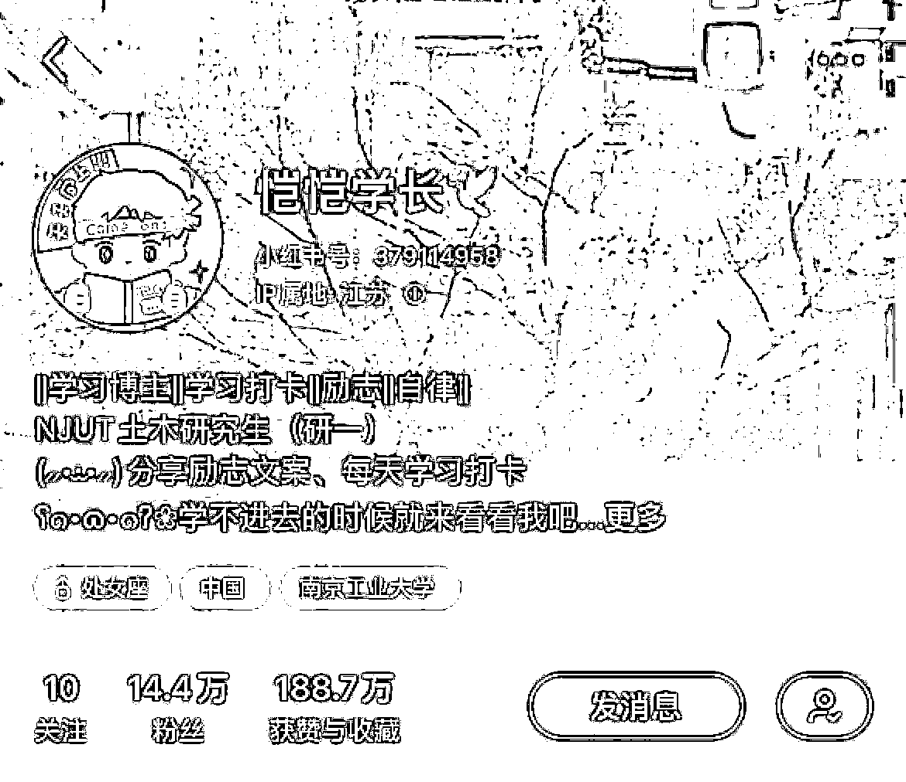

恺恺学长：一个正在看书学习，头上戴着加油的卡通形象，既可爱，又传递出努力学习的情绪

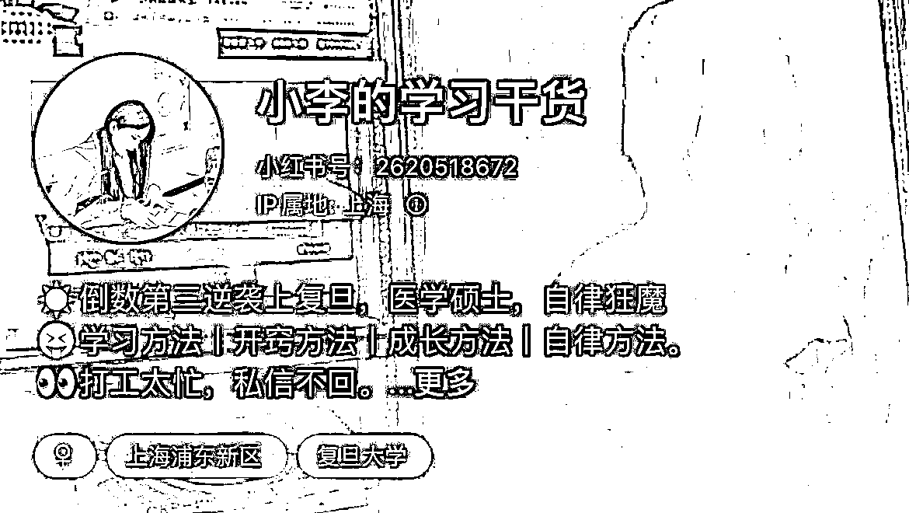

小李的学习干货：正在看书的真人拍摄图，拉近距离，和定位相符

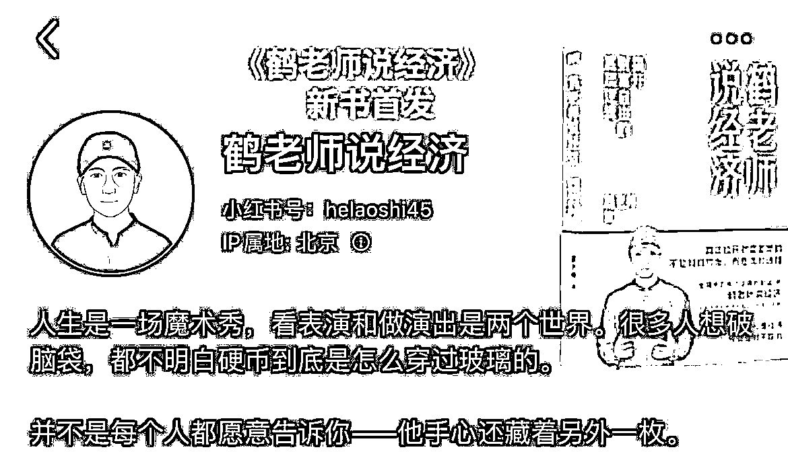

鹤老师说经济：鹤老师的卡通形象，也是视频钟一直保持的形象

## 3、 背景图像

昵称和头像是大家比较会注意到的，但是背景图像却被很多人忽略，其实背景图像有大作用，既能烘托氛围，形成风格，还能当广告位

如果你不太清楚背景图像该用什么图片，那接下来一定要认真听，我总结出了以下几个角度来给你提供思路：

1、个人生活风采照

增强ip感，营造美好生活、乐观向上的精神，拉近粉丝距离

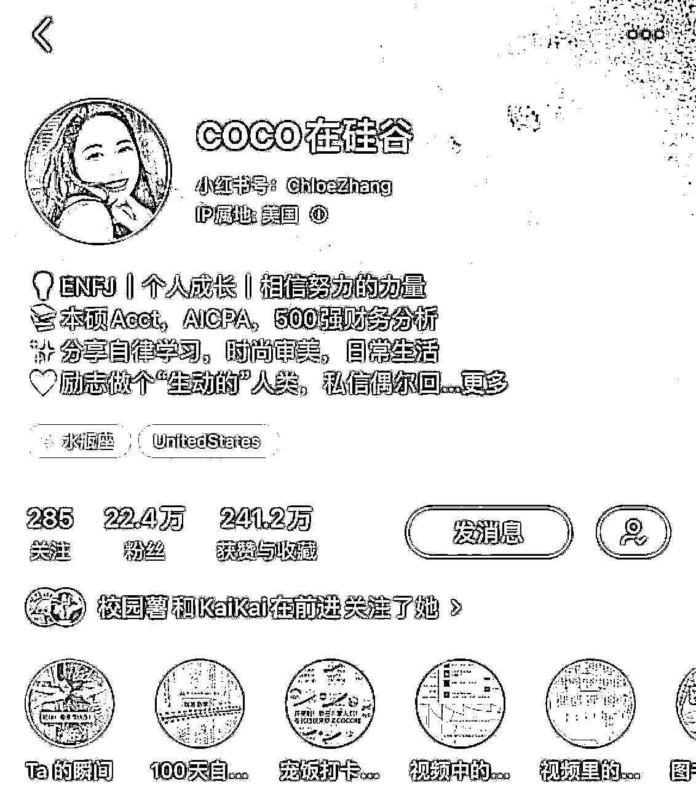

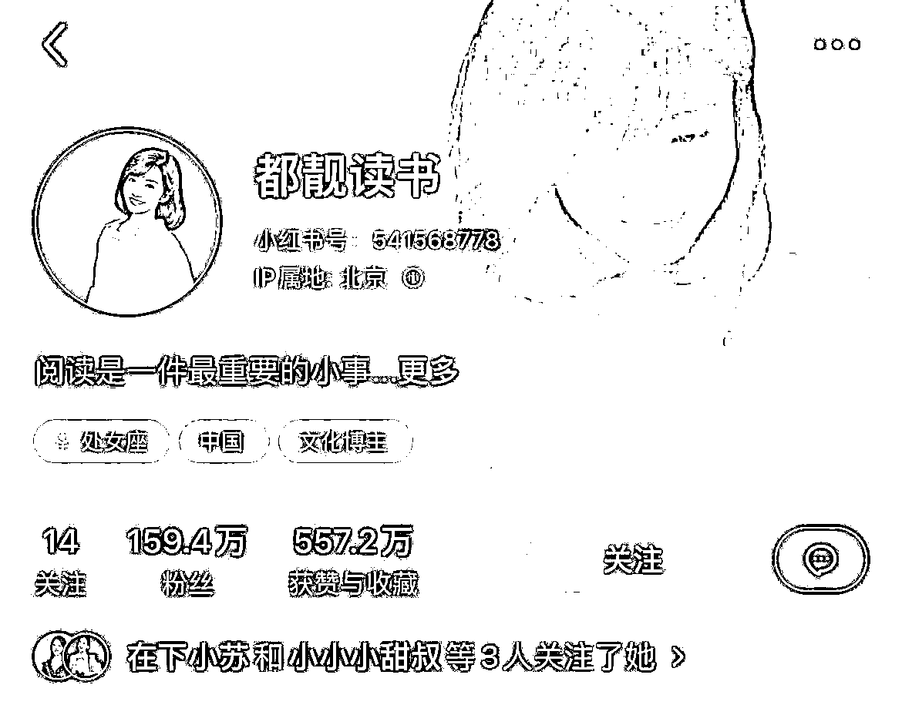

2、场景图片

放上符合身份和人设的场景

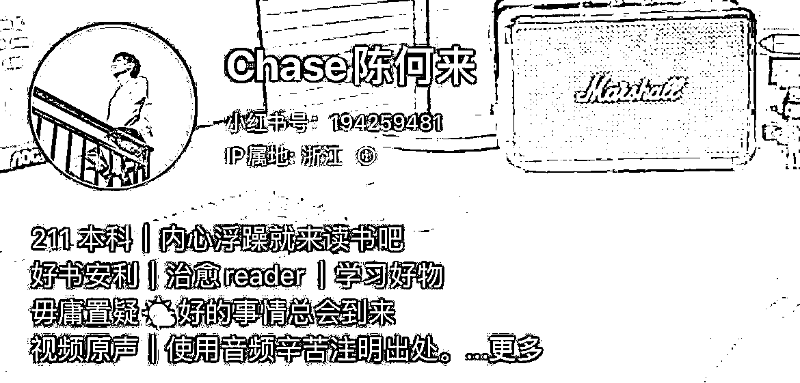

3、作品类

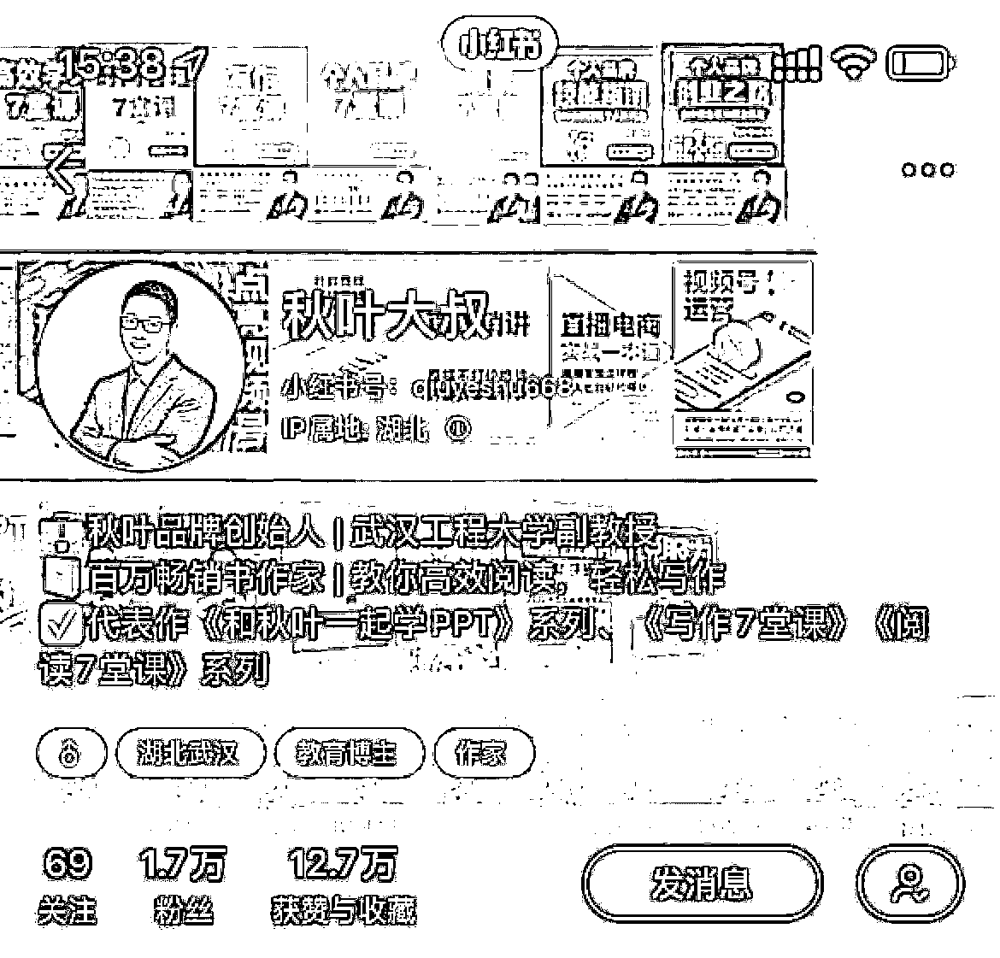

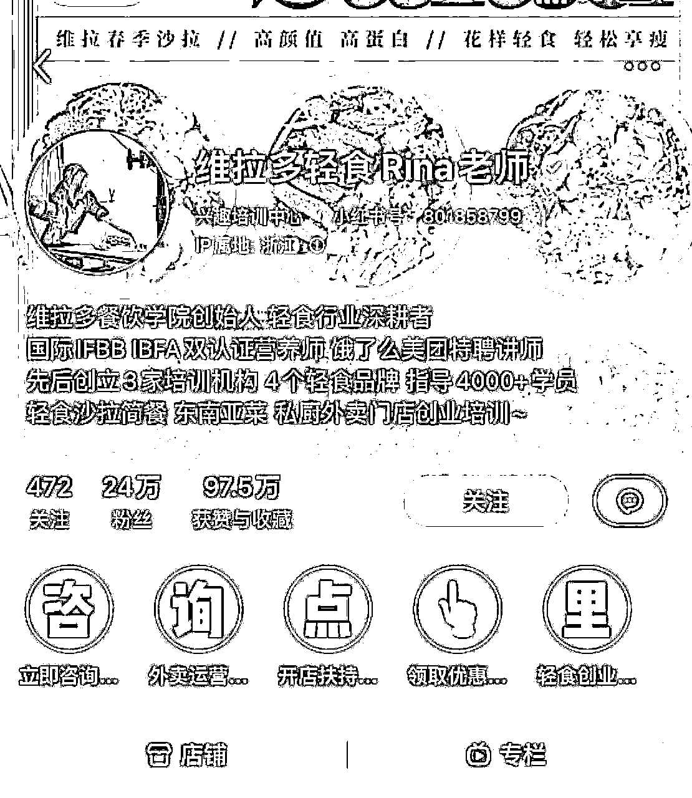

4、文字类

代表账号和个人定位的slogan

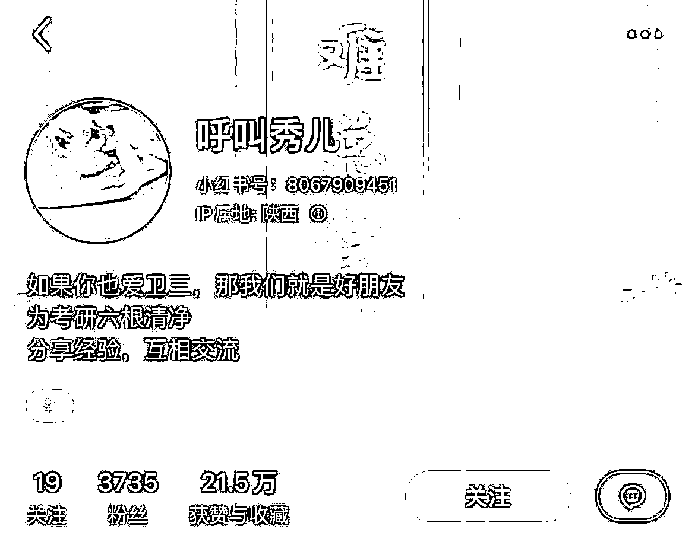

5、引导专注引流类（前期慎用）

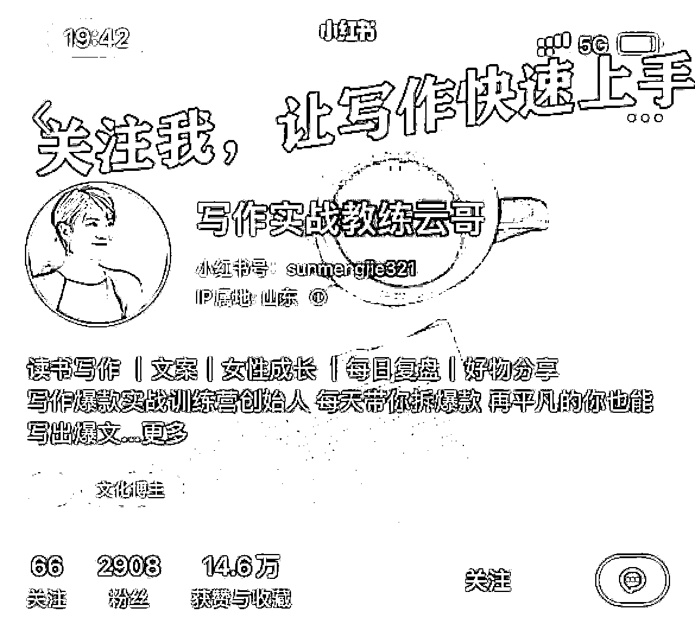

当时研究这一部分的时候，最大的感受就是，很多人总是给我埋怨，小红书不好做，小红书做不好，是不是限流了，没人关注我之类的。

但很多人在定位、昵称、头像、背景图这些被人看起来无足轻重的细节上，都很用心的在研究，在下功夫，所以他们做起来了，做的比较好。

我每次数据不好的时候都用这件事来激励自己，不是平台不行，是自己没有做到位。我们连这些都不去思考，不去研究的话，反倒是去怨天尤人，又怎么能做好小红书呢？

## 4、个人简介

### 4.1 个人简介的要素

我当时看了有超过100个账号的个人简介，总结下来，发现个人简介一般就包括一下这几个方面的内容：

1、我是谁，一句话自我介绍

一个普通的、持续成长的、野生系博主

2、我有哪些厉害的经历

数字化简洁表达：告诉别人我很厉害

3、我有哪些影响力和突出成就

数字化简洁表达：告诉别人我很专业

4、我有什么愿景

做这个账号的初心：一句话，清晰明了，用初心感动人

5、我能在什么地方帮助到你

提供价值感

6、账号内容简介

我这个账号每天都会发什么内容

用定位，提供利益点、兴奋点、痛点去抓人、吸引人

7、提供资源或者价值，引导专注

8、联系方式

### 4.2 不同账号的侧重点

个人简介的侧重点和注意点

1、个人IP类写法

如果你在你的领域已经有了一些收获和成就，那就突出第2点、第3点、第5点，即厉害的经历、影响力和突出成就，告诉别人：我很厉害、我很专业

2、内容类

如果你没有突出的成就，那就讲明白第4点、第6点、第5点

其中第五点也可以兼顾，因为你可以提供陪伴价值、搜集信息、传递信息、和大家交流的价值

3、以上元素可以搭配和侧重，并不是全都要写

4、个人简介可以排版，要多利用表情、回车，清晰明了>满满当当

# 四、用稿定设计设计笔记形式

## 1、确定笔记形式

做完以上工作之后，我开始思考，我用什么形式把我的内容展现出来呢，因为小红书是一个对审美要求比较高的平台，我前期尝试过很多种类，比如当时看到有个博主的封面和内容很好看，这类不用自己拍，也不需要修图，确定好形式之后，就可以无脑把内容放进去，一劳永逸。

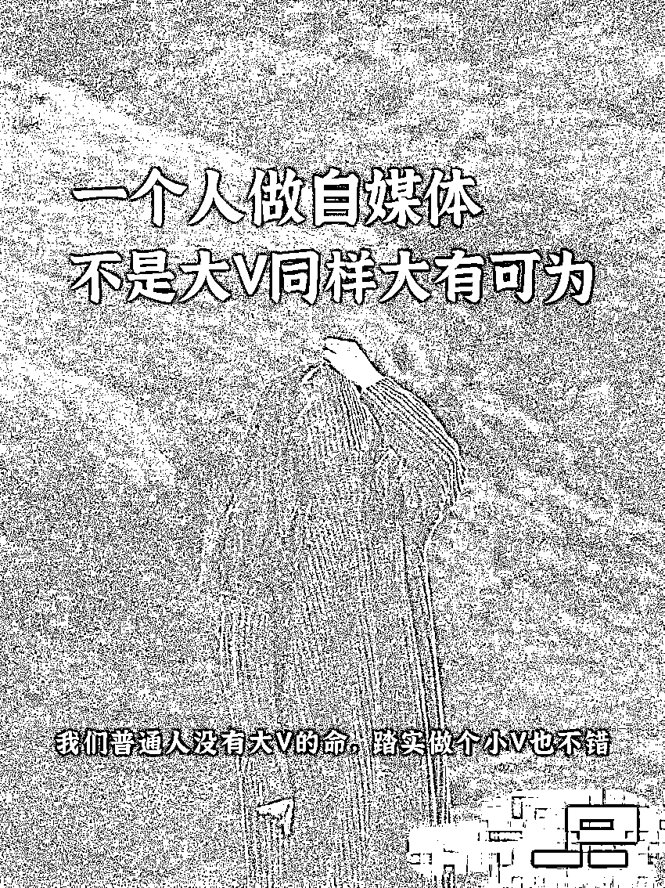

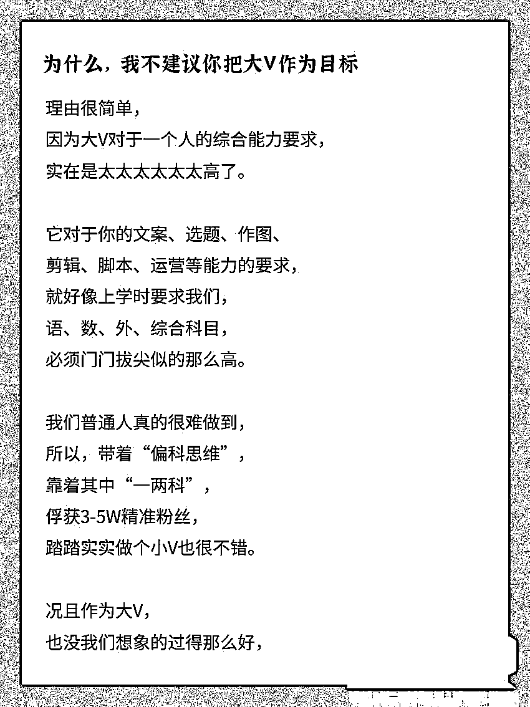

有了这个想法之后，我就开始尝试模仿这类笔记，我当时选用的工具是稿定设计，于是就开始了稿定设计的进修之路。

## 2、稿定设计的使用方法

从接触稿定设计到现在已经一年的时间了，发现做干货型笔记是真的好用，也不用充会员，当然，你充了会员会更方便，但我现在不用会员也能把小红书上面90%的干货型图文笔记模仿出来，朋友戏称我图文笔记卡卡西。

而我也的确尝试了很多种笔记形式，这里贴出来一些我早期的设计

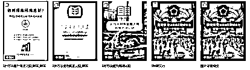

经过反复试验，最终确定了最后一种形式。

在这个过程中，我逐渐摸索稿定设计的使用技巧，现在我能用稿定设计做出来超过90%的小红书笔记风格。

基本上看到一篇笔记，我大概就知道他是怎么做出来的，如何模仿的大差不差。

对于自己创作一种笔记形式，这其实很难，我也不建议大家去这样做，你可以结合小红书主流的笔记形式，一点点去改变，加入自己的元素，形成自己的风格。

接下来我就分享一下我是怎么模仿拆解小红书笔记形式的。

### 2.1 拆解很重要

因为我是学习博主嘛，我最厉害的就是学习，如果你模仿一篇笔记，结果数据不好，你应该想的是不是你自己模仿的不到位，如果你能100%的复刻出来，然后再此基础上，加一些自己的创新，那成功的概率就会很大。

拆解要做到极致这一点很重要。

就拿上面这个笔记形式来举例

封面一般都是由文字和图片组成，这个封面元素超级简单，就是图片和标题。

#### ①首先我们在稿定设计种创建一个设计

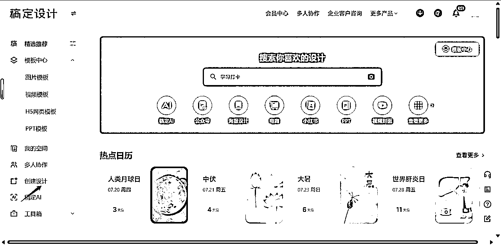

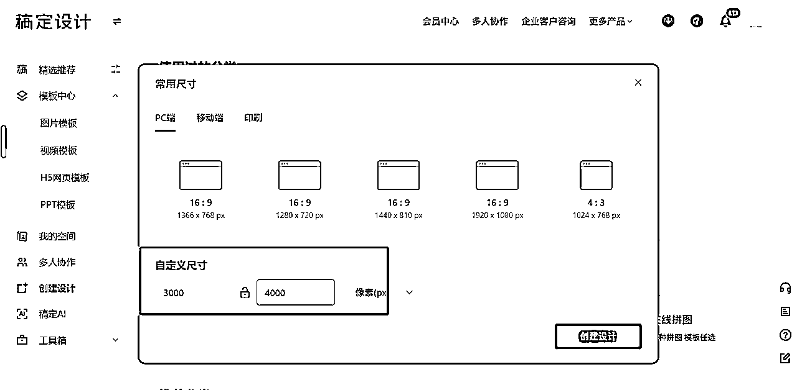

尺寸大小就设置成3000*4000，这样出来的图在3M-5M左右，如果觉得很大，可以把尺寸设置成1500*2000，这样出来的图片的大小就是2M，不大不小刚好。

#### ②寻找背景图片

这个风格的背景图片有个特点，就是很有感觉，有种静谧但有深邃的感觉，颜色偏暗，这种图片是在https://www.pexels.com/这个网站上拿到的，于是我就去这个网站上下载了一个差不多的图片，要的就是这个感觉。

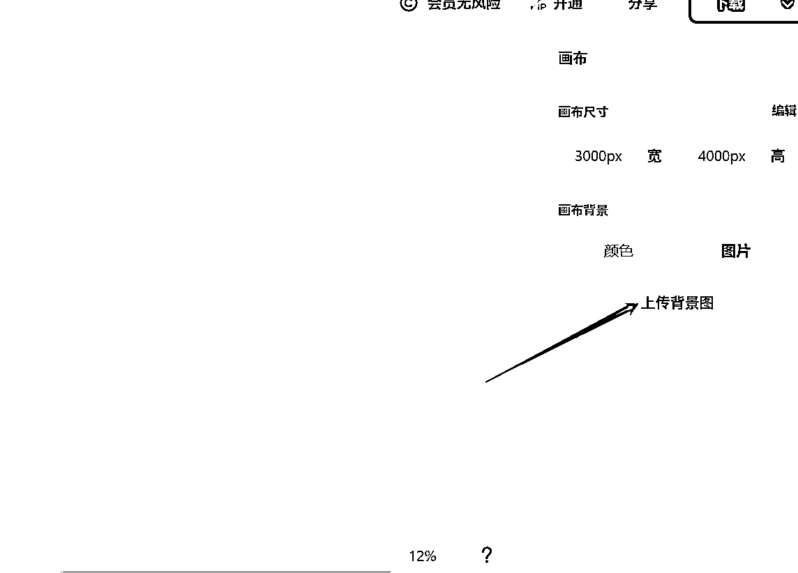

点击上传背景图，然后把下载好的图片上传上去，得到了这样的效果图

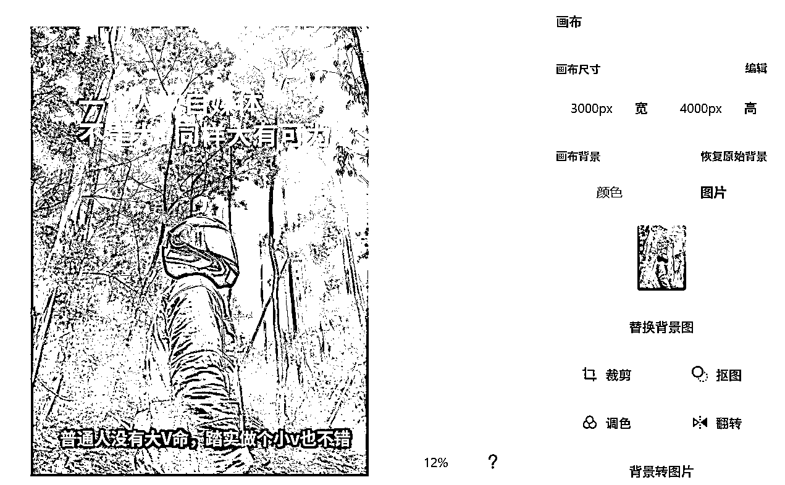

#### ③极致模仿参数

虽然大差不差，但其实感觉上差的很远。这就需要极致模仿，我当时走到这一步，也觉得，这不都差不多嘛，其实不是的，首先图片太亮，字不明显，字体大小、字体型号都不一样，这个封面的精髓都不一样。

接下来就需要极致的参数模仿。

首先把图片处理一下，我用醒图做了剪裁、把上半部分调暗，整体调暗，加了些颗粒感，让画面有了质感

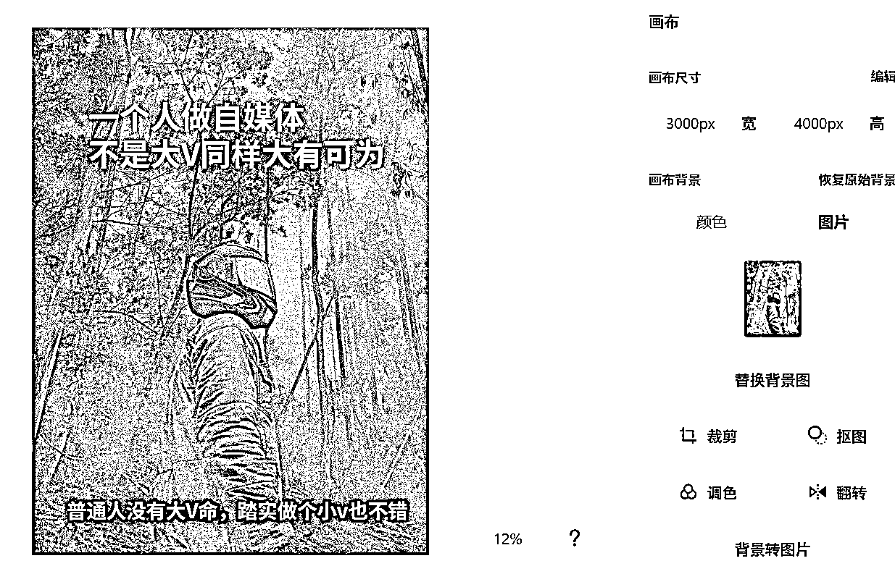

效果一下就不一样了，接着，我把字体换掉，首先就要知道本来的字体是什么，这时候借助识字体网

https://www.likefont.com/

把本来的封面上的字体截图，上传到识字体网

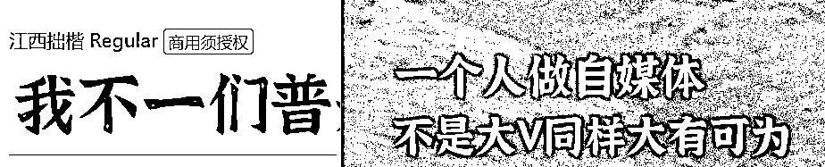

经过识别，找到江西拙楷这个字体（做演示，不商用）。如果稿定设计系统里有这个自己，就可以直接用，如果没有，就去网上找到这个字体，然后导入进稿定设计

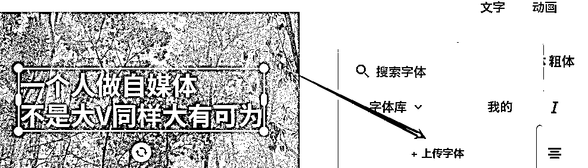

把字体调整好后，我们再来看一下这个效果

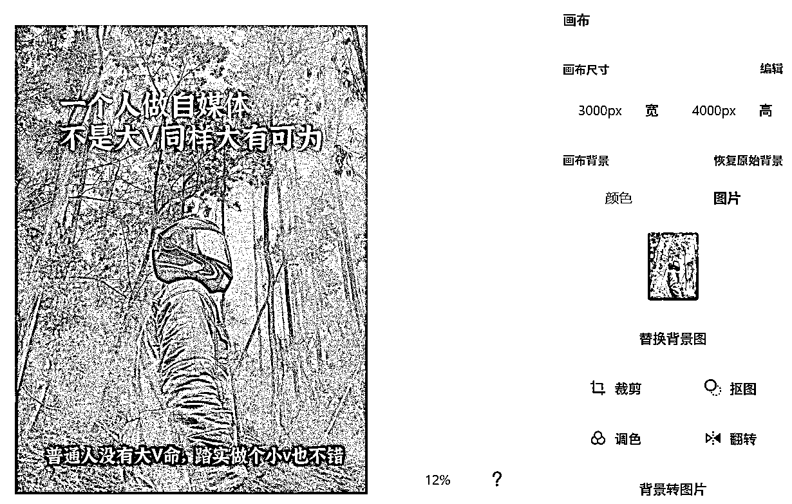

看起来差不多了，但是一些细节性的参数还没有调整，比如行间距、字体大小

这些该怎么调呢？我的方法是把原来的封面导入进来，然后放到一样大，一比一临摹，就可以找到合适的参数了。

#### ④制作内页

按照同样的方法做好内页，让我们看一下效果

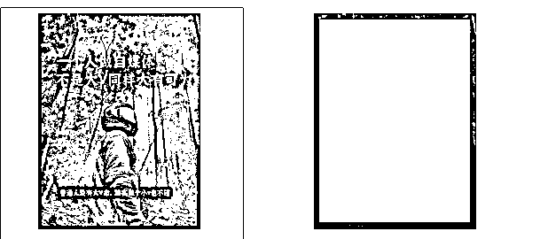

### 2.2 创新真的很重要

这些拆解模仿的过程让我熟悉了稿定设计的用法，于是就开始尝试寻找自己的风格

在经过了不断模仿和拆解之后，我找到了一个仿笔记类型的笔记形式，尝试第一篇就小小的爆了。

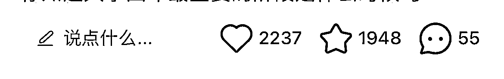

我又按照这种风格创作了很多笔记，都爆了，认识我的人都知道我的笔记风格，很多还那我的笔记风格去拆解，我就不在这里贴出来了，想要了解的盆友可以链接一下。

# 五、三个选题技巧

确定好笔记风格后，就要确定选题，我确定选题的方式有三种，我一一分享给大家

## 1、从自身定位出发去确认选题

我的定位是一个老学长，那我就要从学长的角度分享内容，我可以分享的内容有

这个方法就是要不断的挖自己的优势，不断地挖自己的经历，要把自己给挖投，让自己的成绩带动笔记数据

## 2、从受众人群出发去考虑选题

我的目标人群都是大学生，就要十分了解大学生

比如现在，准大一新生陆续拿到通知书，对大学很憧憬，大一大二比较关心暑假安排，大三暑假结束就要秋招

现在是计算机等级考试报名时间，到了12月份有四六级考试

这些节点都要十分清楚，然后根据大学生的状态去选题

## 3、利用爬虫去选题

借助后羿采集器、小红书笔记采集等工具，去爬一些关键次下的笔记，然后按照点赞量排序，选择前面几个选题，这种选题都是比较容易爆的。

后裔采集器官网：https://www.houyicaiji.com/

具体的使用方法可以参考圈友的这篇文章：https://articles.zsxq.com/id_mwdhb91cirg4.html

# 六、干货型图文的内容创作技巧

上面花了4000多字讲完了前期铺垫的内容，但是最重要的还是内容创作，很多人都夸我的内容很专业，加上我的背书，绝对是很干很干的博主。先上一波结果打个底：

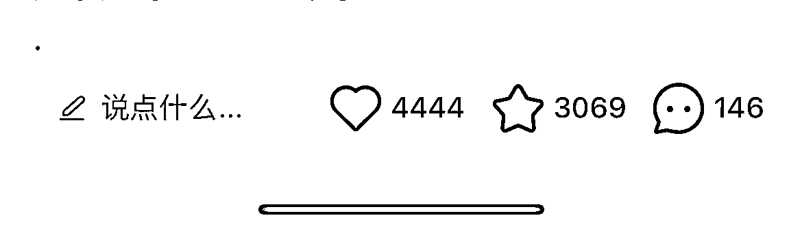

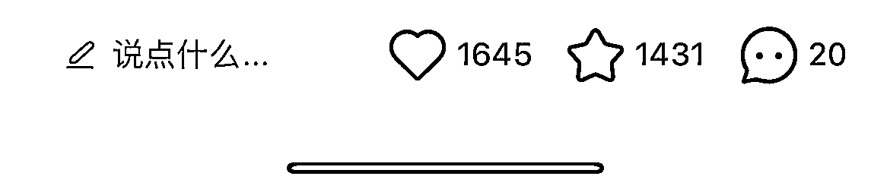

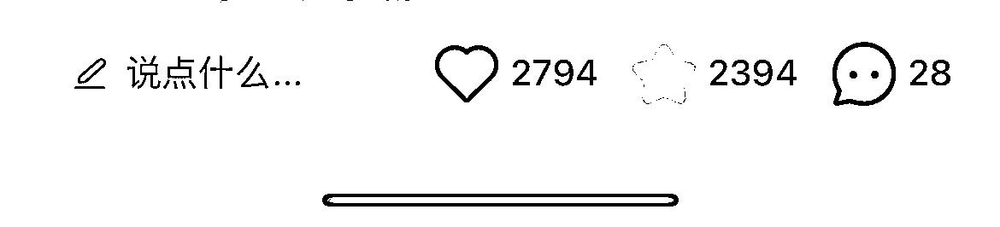

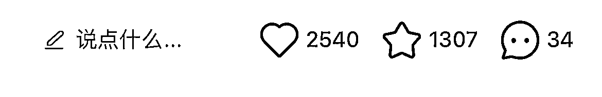

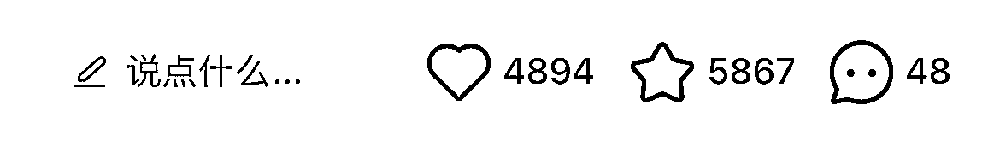

应该是在去年不到半年的时间内有20多篇千赞爆款，巅峰时期我连续4篇全是千赞爆款。

接下来就来分享我自己研究摸索出来的内容创作技巧。我把这套方法成为三板斧，特别简单，就算是新手小白看过也能上手，上手就有结果。

## 1、第一板斧：做好资源整理

无脑堆资源就行了：

《10部历史纪录片》

《100部高分电影》

《10部金融纪录片》

《看完就能自律的10本书》

《女性成长必须养成的100个小习惯》

这类内容创作极其容易，就是把别人发过的，结合几篇帖子整理一边，再加一些自己的理解，难度就是要换个角度，不能这么直白的去发，要找一个切入点，比如这一篇：

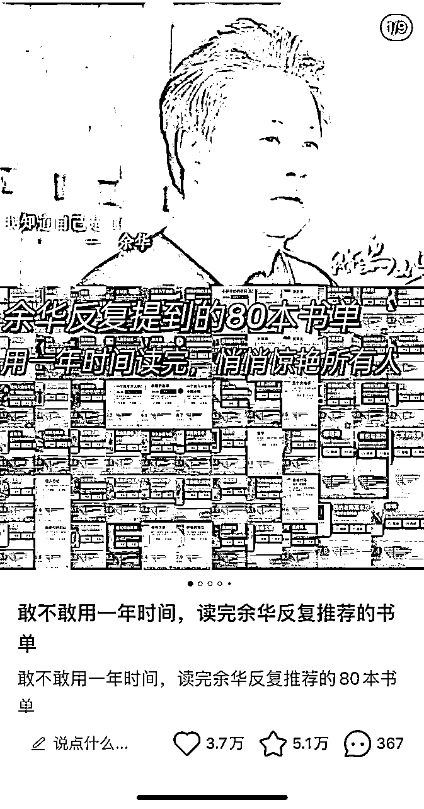

今年4月份发的，依然有接近4万赞，一下字就把号起来了。另外还有罗翔啊，辩论赛啊，这些都能去发。

## 2、第二板斧：做好道理列点文

《20个学习习惯》

《15条生存指南》

《30条信息差》

《20条潜规则》

《15条必备技能》

这个形式特别好创作

内容参考来源：小红书、知乎、公众号

把这些文章内的金句加上自己的理解，换种方式讲出来，加上自己的笔记形式，非常好出爆款

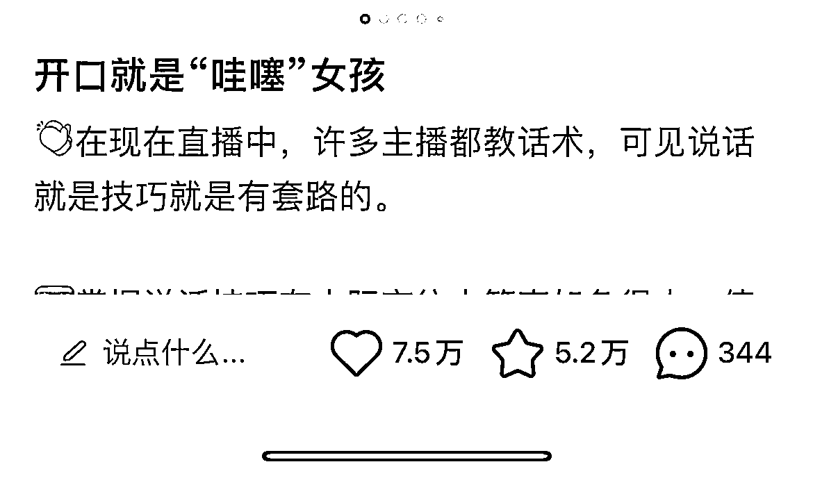

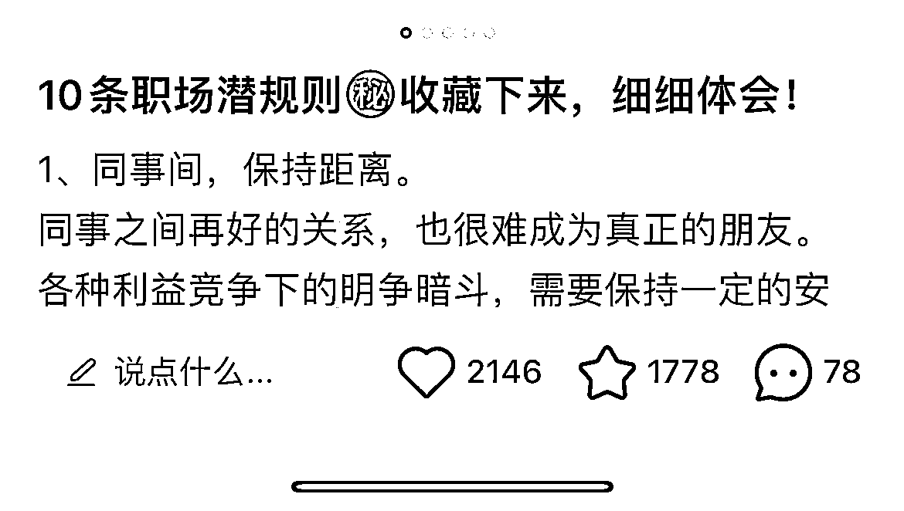

比如贴出来的两篇，一篇是与人聊天中的话术，一篇是职场潜规则，都是按照这种列点式的内容来呈现。我们要做的就是把这些内容换种表现形式，再换种应用场景就行了。

## 3、第三板斧：做好分论点式

分论点式就是总—分的结构，这个相比于前面两个复杂了点，但其实是前面两个的综合结果，比如我拆解的一篇笔记，这个账号目前起号正盛，我就不贴连接了，反正发了130篇，现在5万粉，有116万的咱藏。

我列一下拆解的结构：

这种结构就是把几个零散的干货拼接起来，而且这种结构复用率非常高，一张图片可以复用到很多笔记上，简直就是bug。

对于一个选题，上面三种形式都可以，但是可以体现人设感的，往往是第三种，因为第三种的信息密度比较大，比较多元，相应的，场景体现的机会也会更多。

# 七、总结和反思

做小红书一年来，我感觉干货型图文是最适合新手小白的，对场景和审美的要求都不高，而且笔记复用率很高，我极限的情况下20分钟就做完了一篇推广笔记，数据也很不错。

但是干货型笔记的一个缺点就是展示位比较少，plog是每张图片都能展示，但是PPT类型的图文笔记可能只能由2-3长图片来展示，这就意味着接到商单的机会变少了。

我最近也正在研究新的展示形式，能够让展示位变多的同时，还能让PPT类型的笔记变得简单。

等有新进展再来和大家汇报，我是多维，期待您的链接！