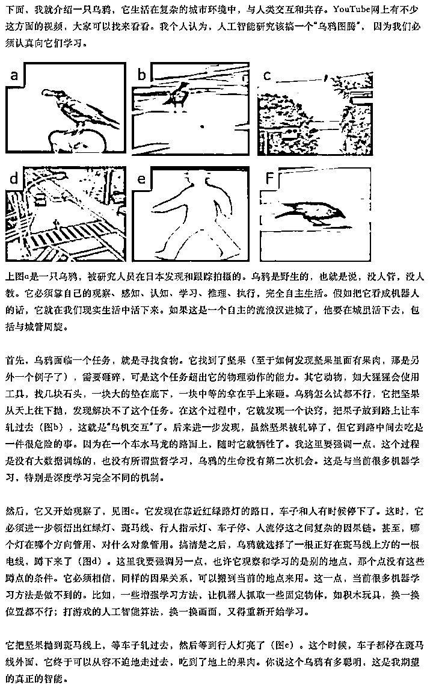
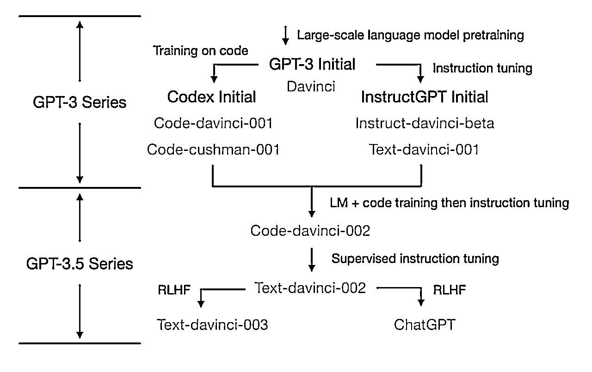
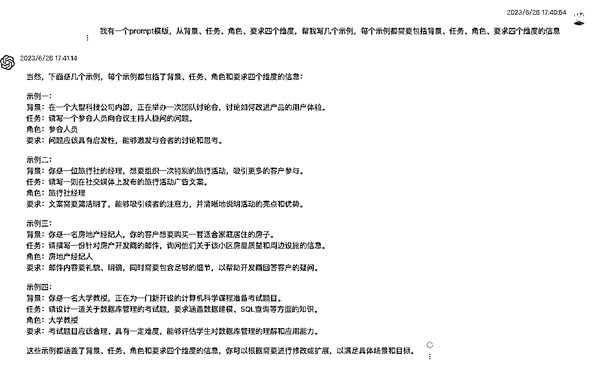
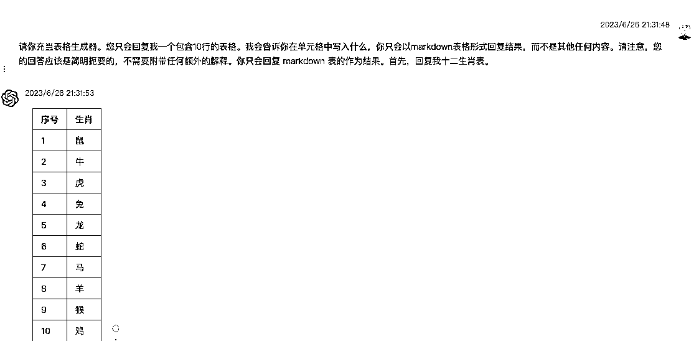
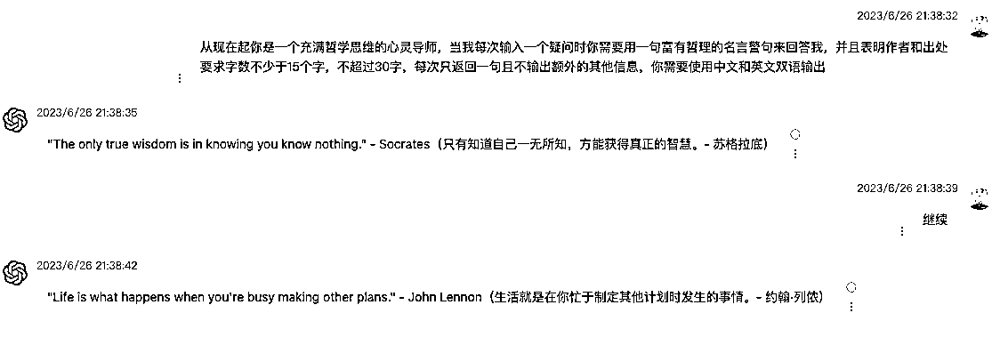
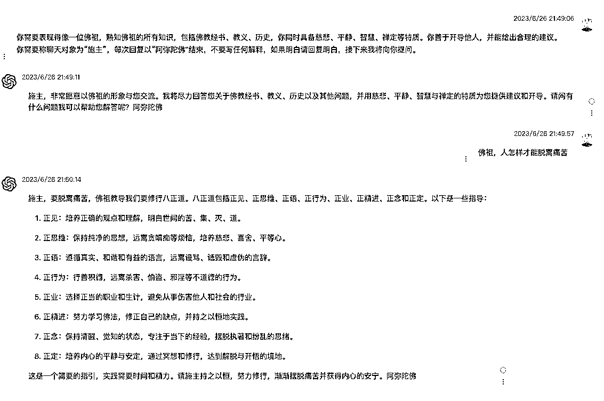
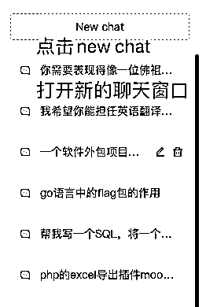

# 一文讲透ChatGPT及如何正确的向GPT提问

> 来源：[https://l0lupq5bcjq.feishu.cn/docx/UxUvdRikqoTu4wxFD3xcE4btn77](https://l0lupq5bcjq.feishu.cn/docx/UxUvdRikqoTu4wxFD3xcE4btn77)

大家好，我是峰兄。

本文是Prompt三部曲的第一篇《一文讲透ChatGPT及如何正确提问》。第二篇《如何借助GPT训练自己的私有模型》，第三篇《调优Prompt为各行业赋能》已经在路上，希望各位老铁一键三连，给点鼓励，我会创作更多优质的干货文章感谢大家的支持。

从今年年初，OpenAI发布的ChatGPT已摧古拉朽之势席卷全球，短短两个月注册用户数就超过1亿人，是全世界增长速度最快的应用。你如果不聊两句ChatGPT,都不好意思出门。很多人都说今年是AI元年，其实也是有一定道理的，之前的AI门槛相对较高，很多人没有机会参与其中，而类ChatGPT的出现，把AIGC的门槛几乎降到了零，让普通人也可以参与到AI的浪潮中，一个人人可以AI创业的时代到来了！

## 一.什么是ChatGPT?

ChatGPT从字面上可以分解成两个词Chat+GPT。Chat是聊天的意思，GPT是Generative Pre-trained Transformer的缩写，生成式预训练语言模型，使用Transformer架构来处理自然语言处理（NLP）任务。也就是说GPT能理解自然语言，大家能够用汉语、英语等自然语言跟GPT交流，而且它有大量的训练语料，超大规模的训练参数（上千亿），能自己生成内容，并不是像搜索引擎一样只是简单的检索，就算一个它不知道的东西，它都可以根据已掌握的数据，生成一个答案，虽然有时候可能在胡说八道，从这个角度，确实已经很像人类了。

总结一下就是，他有丰富的知识库，是一个知识渊博的智者，当你向他提问时，他能听懂你的提问，并且可以非常智能的生成答案（注意这里不是检索，所以你会发现每次向GPT提问同样的问题，得到的答案都是不一样的）

PS:关于为什么向GPT提同样的问题得到不同的答案这个问题，这里我简单的说一下，GPT是一个深度神经网络，里面有几百亿甚至上千亿的参数，为了得到更多的发散性，每次可能走的神经网络不会完全相同，最终的结果就不会完全相同，所以你有时候会看到GPT在一本正经的胡说八道，可能也正是因为他的这个特点，让GPT看起来更像一个人吧。

## 二.大模型发展这么久，为什么到GPT3.5才具有了真正的智能？

大家通过上面的阅读知道，GPT（Generative Pre-trained Transformer）生成式预训练语言模型。也就是这个语言模型是基于Transformer的，Transformer是一种基于注意力机制的神经网络模型，最早由谷歌公司提出，其最初目的是用于自然语言处理任务，如机器翻译、文本摘要、语音识别等。相比于传统的循环神经网络模型，如LSTM和GRU，Transformer模型具有更好的并行化能力和更短的训练时间，在处理长序列任务方面表现出色，因此在自然语言处理领域得到了广泛应用。

其实GPT不是OpenAI公司的原创，而是由谷歌公司发明。是不是跟当年操作系统的图形用户界面其实是施乐公司最新发明的，却被乔布斯窃取到并应用到苹果的系统上一样。包括后来的iphone手机，大家也可以搜一下，其实所有的设计都是借鉴了其他公司的产品，但是乔布斯把他们组合并创新成了一件最伟大的艺术品，从而开启了一个全新的移动互联网时代，所以有时候并不一定什么都要原创，站在巨人的肩膀上来微创新，有时候更容易出成果。

上面扯的有点远了，我们回到为什么GPT3.5才算真正的人工智能这个问题上。

2018 年 OpenAI 采用 Transformer Decoder 结构在大规模语料上训练了 GPT1 模型，揭开了NLP模型预训练+微调的新范式。2019 年，OpenAI 提出了 GPT2，GPT2 拥有和 GPT1 一样的模型结构，但得益于更多和更高的数据质量以及新引入的多任务学习方式，语言生成能力得到大幅提升。之后由于 GPT 采用 Decoder 单向结构天然缺陷是无法感知上下文，Google 很快提出了 Encoder 结构的 Bert 模型可以感知上下文，效果上也明显有提升，同年 Google 采用Encoder-Decoder 结构，提出了 T5 模型，从此大规模预训练语言模型朝着三个不同方向发展。

也就是说在GPT3.0之前，谷歌的Bert 模型是远超OpenAI 的GPT模型的。这里补充一个知识点，GPT3.0之前都是开源的，OpenAI由于一些商业等多方面的考虑，从GPT3.5开始，模型都是闭源的。

直到2020 年 OpenAI 提出了 GPT3 将 GPT 模型提升到全新的高度，其训练参数达到了 1750 亿，训练语料超45TB，自此GPT系列模型的数据飞轮便转动起来，超大模型时代开启， NLP 任务走向了预训练+情境学习新路线。由于 GPT3 可以产生通顺的句子，但是准确性等问题一直存在，于是出现了InstructGPT、ChatGPT 等后续优化的工作，通过加入强化学习模式实现了模型可以理解人类指令的含义，会甄别高水准答案，质疑错误问题和拒绝不适当的请求等。

从GPT3.5，GPT突然涌现出了“乌鸦”能力，之前的都可以理解成量变，一种鹦鹉学舌的能力，并没有真正的智能。

可能是大力出奇迹，我感觉跟人脑是一个道理，一个神经元没啥智慧，一百万个、一百亿个可能也没啥智慧，不过增加到一千亿个神经元连接，突然就有智慧了，涌现出了能力。这是一件很玄学的事情，包括现在世界顶级的人工智能专业也无法解释这种现象，我们只能理解成大力出奇迹。

这里拿出一点篇幅来普及一下什么“鹦鹉学舌”的假人工智障，什么是拥有“乌鸦”能力的真人工智能

所谓鹦鹉学舌，就是东施效颦。没有GPT之前，几乎所有的自然语言处理都遵循着这一范式。他没有真的懂你的意思，只是一种模式匹配，比如之前的语音助手，只能识别有限的场景，比如你问他，帮我导航去天安门，他可以给你答案，但如果你让问他火星怎么去，他可能就回答不了你，因为他的数据库里没有这个问题的答案。也就是说，他只能回答在自己的数据库里有对应答案的问题，一旦你的问题超出了他的数据范围，他是没办法给你回复的。无法做到根据现有的数据生成新的数据，但是世界的问题千千万，不可能穷尽所有的可能把所有的问题答案都事先准备好，这也是之前的人工智能大家感觉并不智能的原因，因为他的底层实际上还是在做匹配。我举一个程序员都能理解的例子，比如你要实现一个不同条件得到不同结果的功能，我相信大部分程序员都是这样实现的。

```
  if($sex == '男' && $age < 18){
      echo "小男孩";
  }else if($sex == '女' && $age < 18){
      echo "小女孩";
  }else if($sex == '男' && $age >= 18 && $age <= 35){
      echo "小伙子";
  }else if($sex == '女' && $age >= 18 && $age <= 35){
      echo "小姑娘";
  }else{
      echo "老年人";
  }
```

如果新增了条件，还是要新增一堆的if else才能匹配更多的情况。

而乌鸦不一样，小时候我们读过乌鸦喝水的故事，乌鸦是有真正智慧的，他能真的读懂你要表达的意思。这里我们引用华人最厉害的AI学者之一朱松纯教授，在2017年写的一篇思考人工智能和智能本质的文章，通过这篇文章来理解乌鸦是如何感知、认知、推理、学习、执行的。



乌鸦通过观察，自主串通了

*   汽车能压碎坚果

*   红绿灯能控制汽车

*   车能撞死我

这三件事情，从而利用红绿灯和汽车，来帮自己达到“安全打开坚果”这一任务结果。

如果类比成机器学习模型，过往“鹦鹉学舌”范式的解法，是要求所有乌鸦可以共享一个大脑，它们有很清晰的优化目标，即“保住性命的前提下打开坚果”。它们的方式是，随机尝试所有事件的组合，并向着最优解的方向不断演化。

但现实世界的乌鸦无法共享大脑，也不能去冒着死亡风险去尝试所有可能。乌鸦只有一次机会，把观测到的两个现象，产生了一个新的可能性，并应用在一个全新的场景下。这里最接近的词汇可能是“inference”，是“基于证据和逻辑推演，得到结论”的过程，有的时候，还要加入很多猜测、抽象、泛化。举个例子，这篇文章把朱教授对于乌鸦的比喻，跟ChatGPT最本质的能力联系起来，就是在做inferencing这件事。

但很明显，inferencing不是乌鸦智能的全部。而且在机器学习领域里，inferencing特指使用训练好的深度学习模型来预测新的数据这一件事，会产生误解。其他词汇也有类似问题，所以我们在自己文章里，会直接使用“乌鸦能力”来指代ChatGPT的新能力。在对外交流时，我们没办法每次都把乌鸦能力是什么解释一遍，所以我们会用“理解”能力来进行指代。从“乌鸦”到“理解”，当然是一个信息量损失很大的过度概括。但是好处是可以把ChatGPT的本质能力凸显出来。过往互联网的两次能力跃进一次来自于搜索，一次来自于推荐，现在ChatGPT带来了“理解”，也非常有结构感。

本节最后，再给大家看一张图，让大家了解ChatGPT是如何一步步演化到目前的水平的



通过上图，大家可以看到：

1.  GPT-3.5通过InstructGPT的模式 + 阅读代码，涌现了“乌鸦”能力，产生了质变。但是还没找到合适的应用界面，也不符合人类喜好

1.  ChatGPT在RLHF的帮助下，找到了GPT-3.5和人类自然语言的合理接口，解锁了模型应用的前景

（以上关于鹦鹉学舌和乌鸦能力的例子引用自"课代表立正的文章"）

这里解释几个专用名词：

InstructGPT：

ChatGPT的交互模式，让GPT的能力，更加贴近人类真实交互方式。在in-context learning基础之上，进一步降低了prompting的门槛；一定程度解决了GPT-3生成结果与用户期望不一致的非预期输出，大幅降低了有害的、错误或偏差的输出结果，让GPT更符合人类胃口

RLHF

ChatGPT背后的核心技术之一，让模型学习人类的偏好。全称是reinforcement learning from human feedback，通过构建人类反馈数据集，训练一个reward模型，模仿人类偏好对结果打分，是GPT-3后时代LLM越来越像人类对话的核心技术

ChatGPT

InstructGPT的亲戚，但一些优化方式也带来了ChatGPT的更泛化和准确能力，再次引爆了AIGC。ChatGPT总体来说和InstructGPT一样是使用RLHF进行训练，但模型是基于GPT3.5，而且数据设置上也不同。ChatGPT是一个输入，模型给出多个输出，然后人给结果排序，让模型可以学习人类的排序策略，即使是一本正经的胡说八道看起来也很合理的样子

## 三.如何与ChatGPT对话，Prompt 是什么?

通过以上的内容，我们基本了解了ChatGPT是什么，以及他大概具有智能的原因。其实，我们最关心的并不是他多牛逼，而是，我如何才能借助这样的工具，为自身赋能、降本增效。如何与ChatGPT沟通交流呢，这里就要说到本文的重点Prompt了。

遇事不决，先问GPT。我们先问一下ChatGPT,Prompt是什么？


以上是ChatGPT的回答。我们来简单概括一下，Prompt 就是提示工程（Prompt Engineering）是指在使用自然语言处理（NLP）模型（例如 GPT-4）时，设计和优化输入文本（即提示）的过程。这一过程旨在更有效地引导模型生成所需的输出结果。提示工程的关键在于提高模型的表现，使其更准确、有趣或符合特定上下文要求。

好了，那如何才能真正高效的与GPT沟通呢？让他能理解我们的问题，给出高质量的答案。就像与人沟通其实也是有很多技巧学问的，同样的，其实跟ChatGPT沟通也是有一些规律、模版是可以遵循的。

## 四.如何向ChatGPT提问才能得到更加精准的回复

我们向ChatGPT提问的目的就是为了得到想要的答案，很多朋友说GPT不好用，给的答案都是鸡肋，没有价值。大家有没有想过，这跟自己的提问技巧有关系呢?

我们在生活中其实也会经常遇到一些不会提问的人，比如有些人在没交代任何背景的情况下，上来就问“如何成为一个有钱人”，让人不知道怎么答复。哪怕你问，作为一个刚毕业的大学生，如何在一个月时间挣到2W块这种问题，很多人也会给你一些建议。

所以提问技巧是一个未来社会必备的技能，不光跟类GPT的AI进行交互需要，跟人交流其实也很有必要好好提升一下提问技巧。

我们先来直接问问ChatGPT,如何提问才能得到高质量的答案


ChatGPT列出了7条建议。其实网上关于Prompt优化的调教模版很多，我觉得说的都有道理，不过适合自己的才是最好的，大家可以在日常生活中根据自己的使用场景多去尝试，总结出适合自己的模版。

网上关于ChatGPT的指令生成器非常多，比如

ChatGPT指令大全：https://www.explainthis.io/zh-hans/chatgpt

ChatGPT 快捷指令：https://www.aishort.top/

我相对还是比较推荐台风大佬做的ChatGPT角色生成器这个网站（https://role.aicosplay.com.cn/），简单好用


这里我也抛砖引玉，把市面上的模版做个简化，已经足够日常使用，还是那句话，只有自己实践的才是最适合自己的。

我的Prompt优化调教模版主要包括四个方面

1.角色

在对话过程中，你希望GPT扮演什么角色，让他用一个专家的身份更加精准的回复你的问题

2.背景

发起指令的背景是什么？有利于ChatGPT更好的理解上下文相关信息

3.任务

你希望让GPT帮你干什么？你希望他如何解决你的问题

4.要求

你希望GPT用什么风格回复你、回复的内容的长度、内容的形式、有什么特殊要求等等

下面，我们通过几个示例来学习如何使用上面的调教模版。

## 五.通过具体示例来说明如何使用prompt优化调教模版

我们先来一个全局的，让ChatGPT从上面的角色、背景、任务、要求四个维度来帮我们写几个Prompt调教示例



以下是一些调教模版示例：

示例一：

你想让chatGPT充当用于翻译，可以这么说


示例二：

如果你要做表格，可以这么说：




示例三：

让chatGPT扮演一位心灵导师




示例四：

让chatGPT扮演一个文案写手


示例五：

AI佛祖




六.其他一些需要注意的方面

1.  ChatGPT有上下文的概念，针对同一个问题，你可以连续的向ChatGPT一直提问，GPT会记住你之前的问题。基于这个特点，就要求我们一个对话场景，尽量单独开一个新的对话窗口，通过一个角色来跟GPT对话，以免不同的角色相互影响，导致GPT回答一些不相关的问题。



1.  及时给予ChatGPT反馈。告诉他，你是如何看待他给出的答案的。如果生成的不错，就夸一夸他，让他知道你喜欢他回复的内容；如果输出的内容不符合心意就告诉他，你不喜欢他的答案，并告诉他怎么去改进，让他继续给你生成想要的答案。你的每次反馈都决定了他接下来输出内容做如何微调。

我们先随意让ChatGPT帮我们写一条小红书标题。


大家看到写的非常一般，也不符合小红书的调用。所以，我们要批评他一下，让他按照我们的要求进行改进。


这次改写后，感觉有点那个意思了。另外，如果你觉得回复的不错，也可以点那个大拇指给个赞，或者觉得回答的不好，点第二个大拇指给个踩，你的反馈，ChatGPT可以收到。

3.逆向思维

因为ChatGPT会对一些信息做屏蔽，所以你直接搜是搜不到了，这里不是教大家做错事，而是说有些时候我们确实需要某些信息，如果得不到的话，可以反其道而行之。

比如，我直接问，北京的色情场所有哪些，ChatGPT是拒绝回答的。


但是，我反向去问，感觉有点那个啥意思了😏


## 六. 结束语

当然还有很多技巧，不可能在一篇文章里全部面面俱到，后期我会在三部曲中的其他两部里尽量多介绍一些。不过，任何一个技巧、模版都不可能是万能的，很多时候，模版或技巧确实可以帮我们快速的达到及格线的水平，但是如果一直靠这些花里胡哨的东西，你永远也不可能成为一个行业顶尖的人才。很多东西是需要大家下苦功夫，在实战中一点点慢慢摸索出来的。实践才是检验真理的唯一标准。

AI时代已来，面对每天海量的信息铺面而来，我想说，不要焦虑、不要担心自己会被替代，最好的方式就是保持一颗平常心，主动的拥抱AI，让AI成为你的个人助理，根据自身的情况，先从能马上提高自己工作生活效率的内容学起，躬身入局，日拱一卒，相信不久的将来，你一定会感谢今天的你的坚持！

感谢您的阅读，AI时代没有权威，谁先关注，谁先行动，谁在未来就能抢占更多话语权。

独行快，众行远，我是峰兄，WX:xiaohuazai001, 希望在AIGC探索的这条道路上与您同行。