# 《RVC 保姆级教程》

> 来源：[https://xxsp96u00k.feishu.cn/docx/V43xdo3yXoVDEyx7YGIcud8KnEh](https://xxsp96u00k.feishu.cn/docx/V43xdo3yXoVDEyx7YGIcud8KnEh)

# 一、RVC 简介

RVC 项目是 B 站 UP 主花儿不哭开发的开源项目，同时 RVC 对电脑配置的要求要比 SVC 低很多，可以愉快的玩耍。

RVC 可以根据你的选择的模型进行实时变声【一般有几十到几百毫秒的的延迟，延迟决定因素有很多，比如电脑配置、你设置的 RVC 配置参数】

项目链接：https://github.com/RVC-Project/Retrieval-based-Voice-Conversion-WebUI

例子：

RVC 对电脑要求稍微低一些，1、显卡要求 GTX750Ti 以上即可，最好是 RTX 显卡【暂时不支持 N 卡】；2、CPU 越新越好；3、最好使用声卡麦克风【要求不高耳机就可以】

# 二、如何使用 RVC

## 2.1 下载软件包

花儿的整合包：链接：https://pan.baidu.com/s/1OUozYzYCSQ8vtqx1YppJmQ?pwd=nn13 提取码：nn13

入梦的整合包：链接：https://pan.baidu.com/s/1wjKVBC3SeOGRlxYBXEQrmw?pwd=2t5x 提取码：2t5x

下载完成后直接解压即可【安装路径不可以有中文】

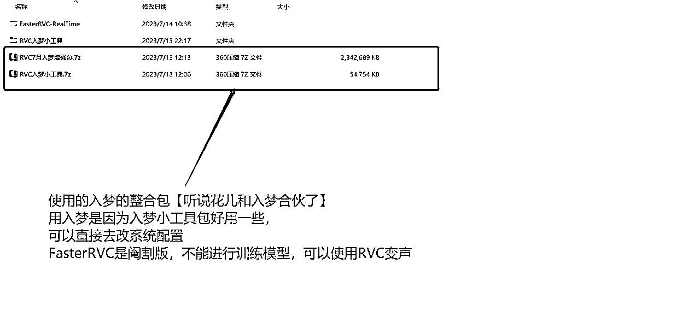

选择【RVCAL 变声器】打开应用

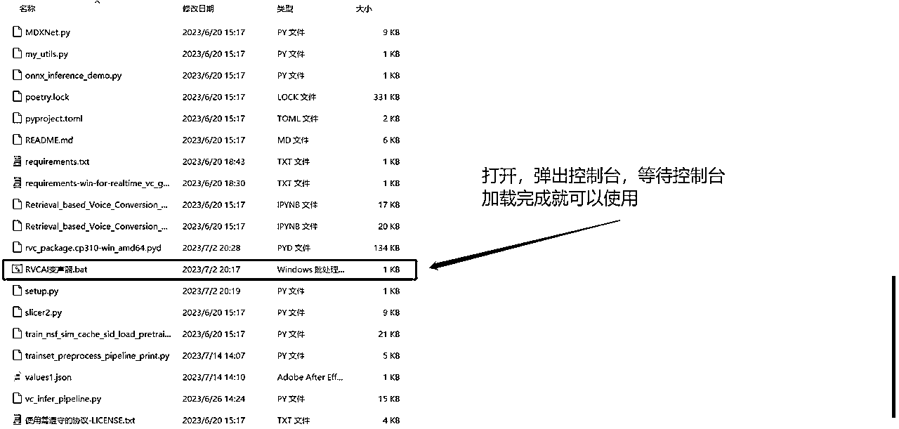

## 2.2 配置

### 2.1.1 声音路径

声源——RVC——虚拟声卡【也可以用声卡】——硬件

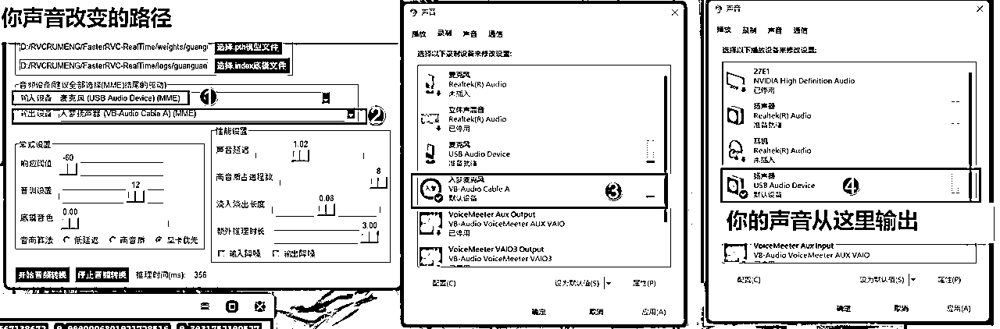

### 2.1.2 路径配置

第一步：

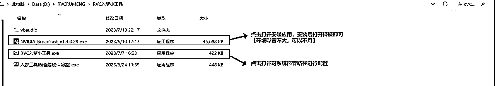

第二步：

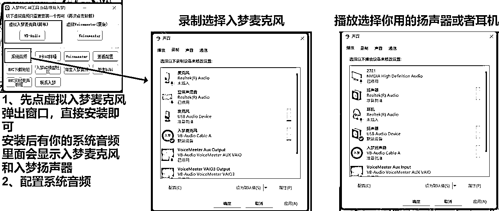

### 2.1.3RVC 配置

配置要素：

【建议除了音调其他的没必要改】

1.  响应阈值：越往左越好，往右会出现卡顿吞字的现象，会有一定的降噪效果

1.  音调设置：男变女调 12；女变男调 -12；不改调 0。向左向右调节粗细。

1.  底模音色：拉的越高越接近于推理源还有底模音色，说话清晰建议 0.2-0.5 左右

1.  音高算法：低延迟降低声音延迟；高音质延迟在几百左右，可以通过拉高高音质占进程数进行降低延迟。

1.  声音延迟：往右延迟高，往左延迟低，不要调到 0.5 以下，内存会爆

1.  淡入淡出长度：尾音长短，小的话容易断字，大的话容易不连贯而且会糊

1.  额外推理时长：拉动左边声音会清脆，声音会很干；拉到右边尾音加会长，声音不会很干。【建议调到 1】配置高直接拉满，提高咬字清晰度。

1.  输入降噪：降低麦克风噪音【不建议使用，建议使用 RTX 的 NVIDIA Broadcast，在工具包可以直接安装】

1.  输出降噪：降低输出噪音【不建议使用】

### 2.1.4 配置完后点击开始变音就可以使用了

配置常见问题：

1、输入设备、输出设备：选择设备时结尾一定要是 MME 才可以使用

2、播放和录制设备的格式要保持一致

你用的麦克风和扬声器、入梦扬声器和入梦麦克风，这四个要保持格式一致【44100 或 48000 选一个保持统一即可】

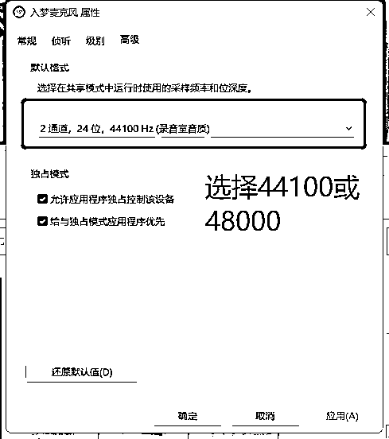

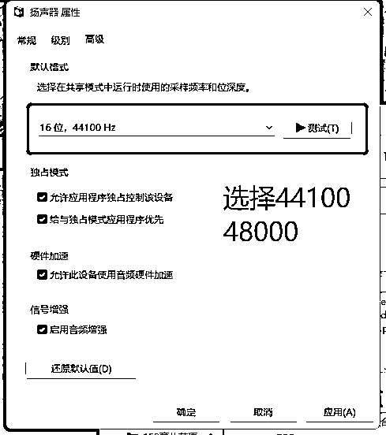

3、想要听自己的变声后的声音可以把侦听勾选上

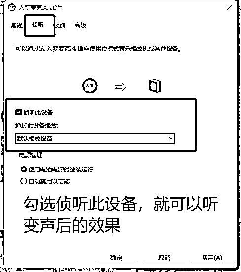

# 三、用大佬的整合包制作模型

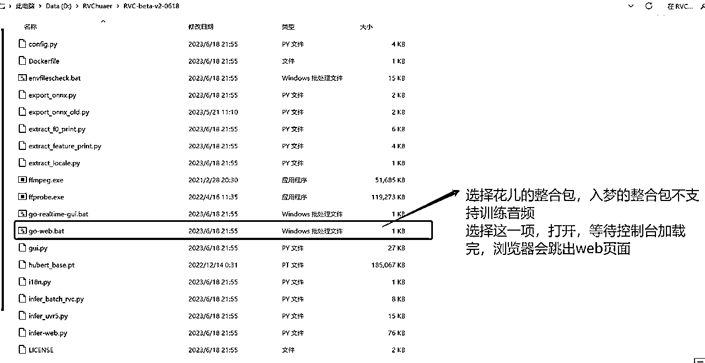

## 3.1.前提条件

电脑配置要求：>=四核 CPU；>=GTX1060 以上的 N 卡

## 3.2.训练模型

### 3.2.1 制作素材库

#### 3.2.1.1 收集素材

*   找素材【八仙过海各显神通，看大家的了】

*   素材要求：

1.  10 分钟语音即可，但建议录制时间长点，半小时左右

1.  录制音源时候普通话要标准，咬字清晰，不然效果会模糊

#### 3.2.1.2 处理素材

若音源有较大的噪音【背景音、伴奏之类的】，需要先把音源处理干净，直接使用整合包的内置插件即可。

第一步：选择路径

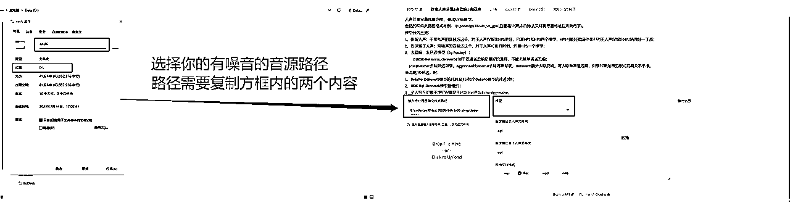

第二部：选择处理模型

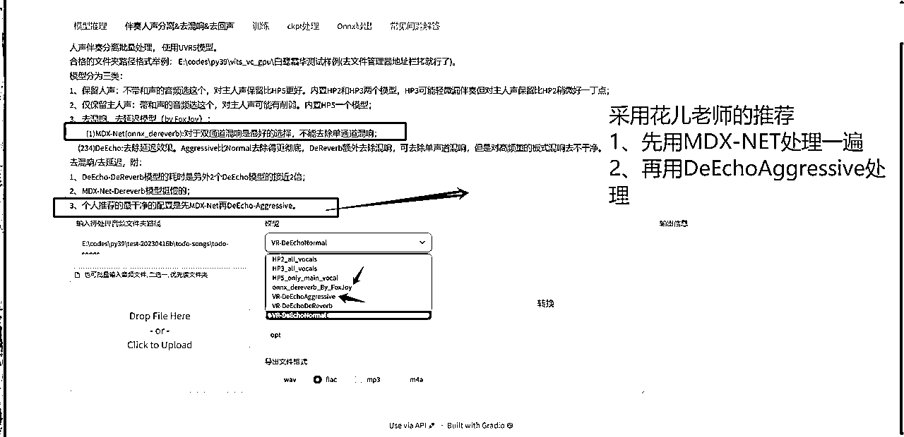

第三步：选择输出路径

第一次处理完，选择第一个文件夹

第二次处理完，选择第二个文件夹

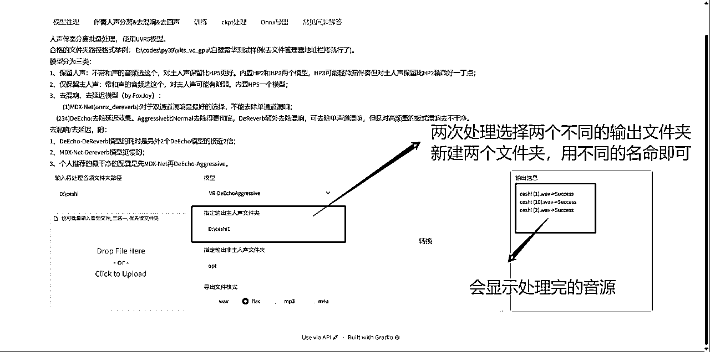

### 3.2.2 训练模型

#### 3.2.1.1 素材导入

把第二次处理的文件找到，并记录文件夹的位置【是文件夹的位置，不是音频的位置】

#### 3.2.1.2 设置训练参数

第一步：设置训练参数

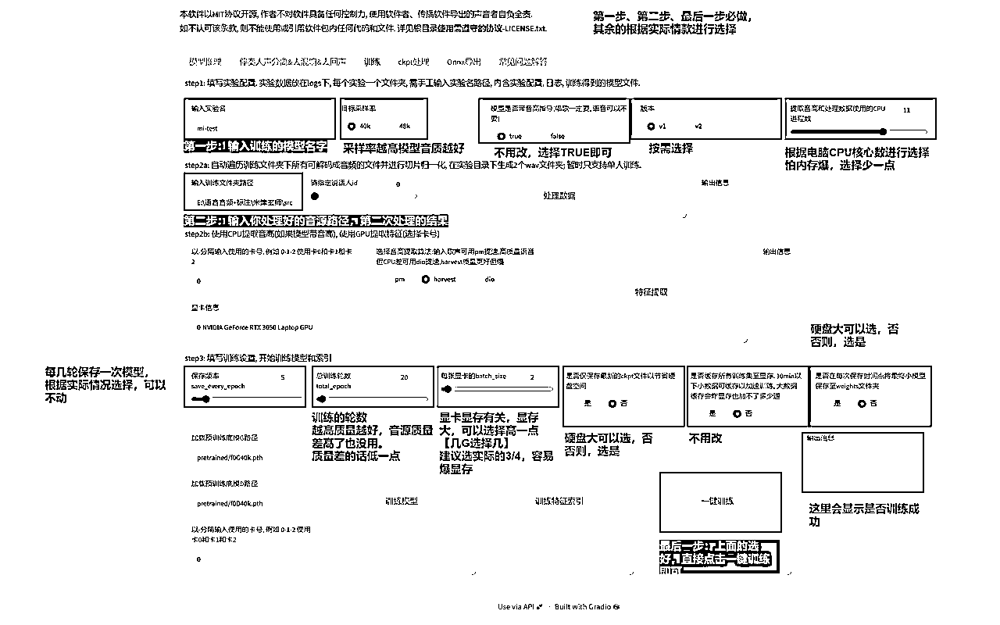

第二步：查看训练进程

点击一键训练后，控制台会显示详细进程。【训练过程别关闭控制台】

*   控制台看进程

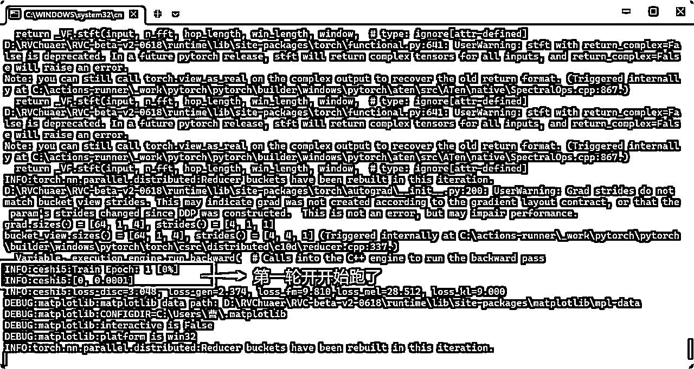

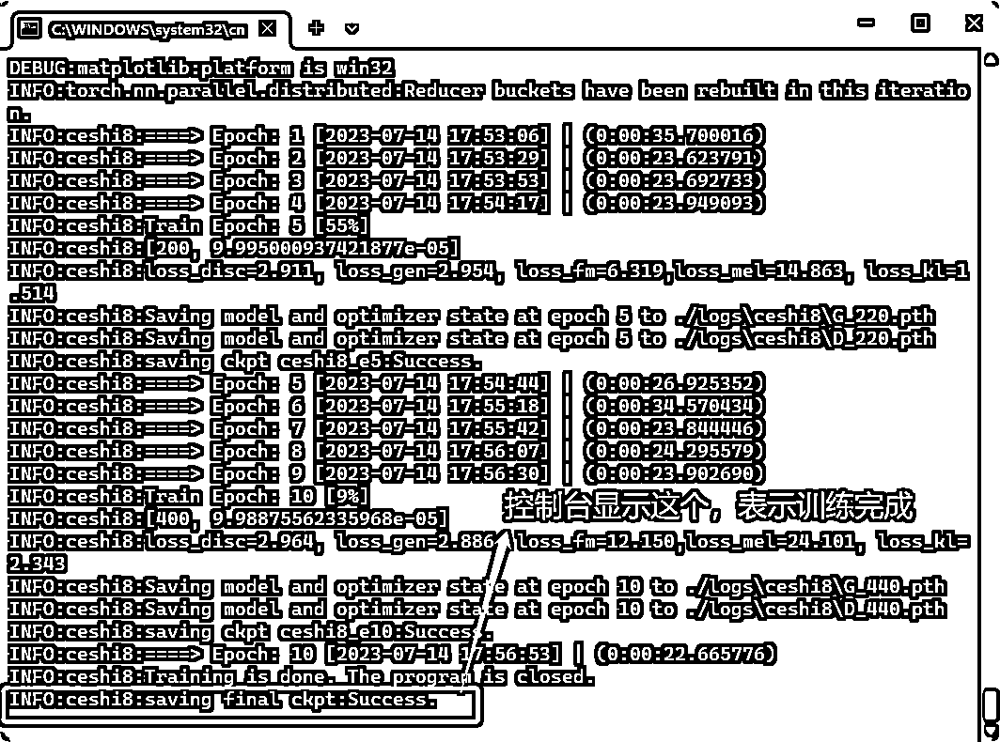

*   web 页面看进程

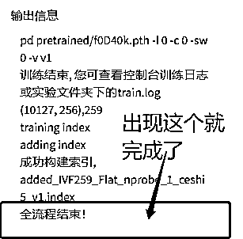

#### 3.2.1.3 找训练完成模型数据

第一步：进入你整合包，解压的文件夹内

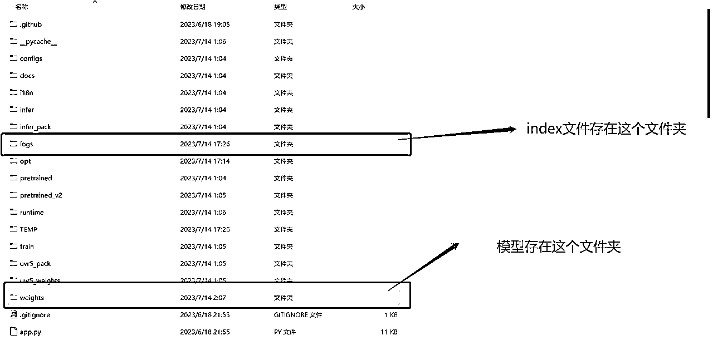

第二步：选择，logs 文件夹，找到 index 文件、npy 文件，保存

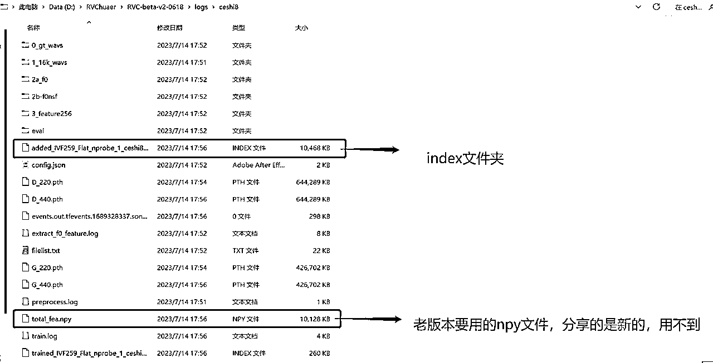

第三步：选择 weights 文件夹，找到最终的训练模型，保存下来

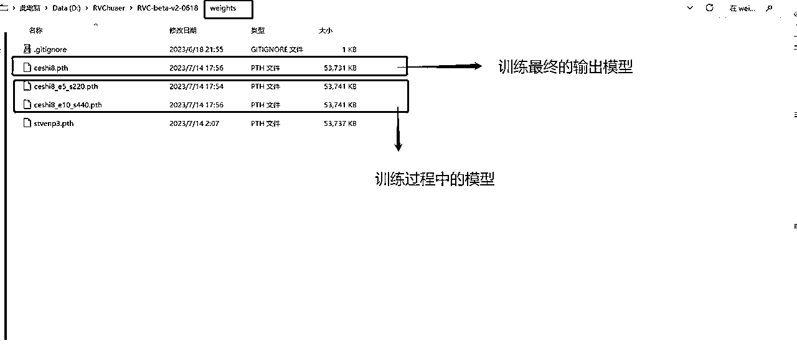

到这里模型训练结束

常见问题：

*   推荐使用 V1 训练，V2 训练可能会出现找不到训练完成模型的情况

*   推荐使用 40K，使用 48K，可能会出现电音

# 四、使用自己训练的模型

第一步：选择 path 文件

第二步：选择 index 文件

第三步：按照前面的步骤，设置 RVC 即可

第四步：点击开始音频转换

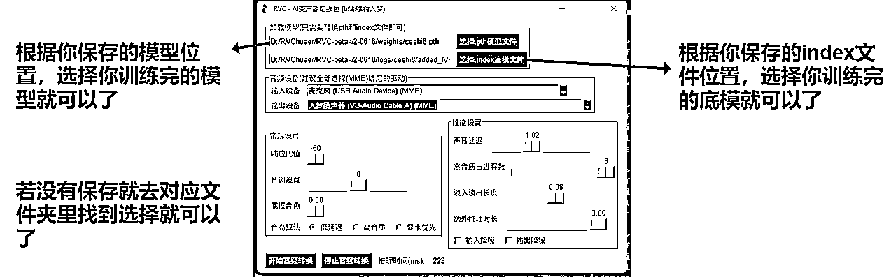

# 五、使用整合包转换音频

第一步：打开 web 端

第二步：设置参数

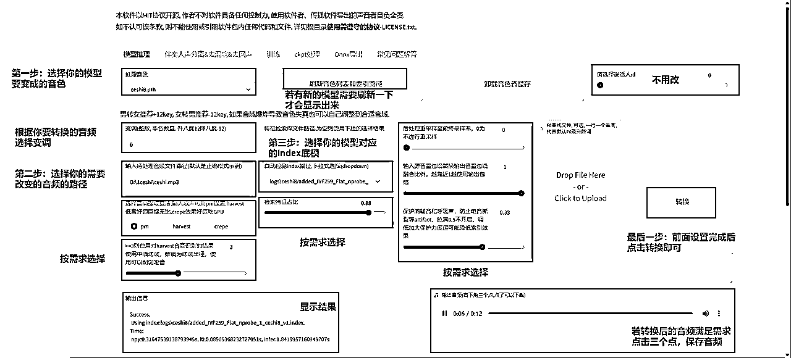

# 六、总结

教程到这里就结束了，大家可以去生成属于自己的模型了，可玩性极高！！！

希望这篇文章能帮助到大家！！！

整合包百度网盘链接：

花儿的整合包：链接：https://pan.baidu.com/s/1OUozYzYCSQ8vtqx1YppJmQ?pwd=nn13 提取码：nn13

入梦的整合包：链接：https://pan.baidu.com/s/1wjKVBC3SeOGRlxYBXEQrmw?pwd=2t5x 提取码：2t5x