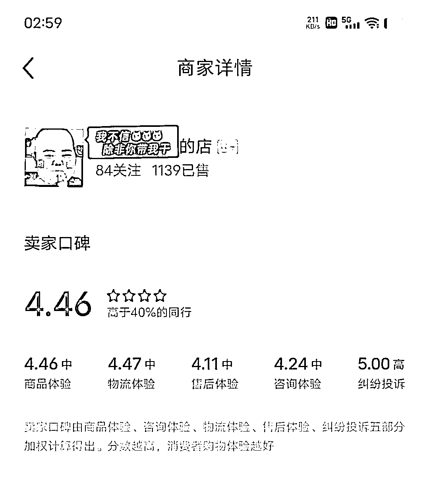

# 新人的意识觉醒之路，附赠1100+订单|小红书店铺航海之旅复盘

> 来源：[https://aea4xjvozr.feishu.cn/docx/VHMGdK5gPojcBDxU7vwcDyS1n1b](https://aea4xjvozr.feishu.cn/docx/VHMGdK5gPojcBDxU7vwcDyS1n1b)

大家好，我是丹丹，之前在一家少儿机构工作，小红书店铺是在职期间跟着航海做起来的。

其实航海结束那会就有朋友让我写复盘贴了，当时惊了一下，心想就这还不能够吧？ 于是便没有了下文。但后面又接陆续触了几位朋友，都有提到让我写，于是踢踢那么久，终于被踢动了，有了本文的产生。

下图是我的数据，利润在40%以上，数据并不漂亮，但对我来说做比较有意义的是做成这件事后个人自信心的一些增长。

# 本文适合观看人群：

*   1）和我一样需要增加自信的新人朋友。你看呐~ 就我这样都能成，你肯定也行！👍

*   希望我的文字能给你带来些力量❤️

*   2）做课程培训的老师。本文会真实一下没有基础的小朋友在接触一个新领域时会遇到哪些问题以及心路历程， 方便老师们做出更棒的，更适合新手的课程👍

*   3）工作之余想要消遣的朋友。本文内容不干，纯当个看客来乐呵下也不错呀~🤭

我将从以下维度与你们分享

# 一、我的起号经过

1、先是看了几天航海手册和生财各位高手的精华帖，把重要的内容以及没搞懂的知识点进行摘录

2、有一定认知基础后，开始在小红书闲逛看品，看到一个睡衣蛮可爱，于是去翻了下这个账号的内容形式、商品销量，在其它电商平台的价格，发现差价在十几块那样，感觉还可以，然后想着睡衣应该没穿出去的服装那么容易发生退款，于是便敲定了就做这一品类。

3、有目的性的刷睡衣这一品类，起初阶段会觉得这个账号内容形式可以模仿，那个也可以，这个品可以跟，那个也可以，看的头晕目眩，反而没有了头目。最后是觉得我不能贪，不能在这精挑细选，我要快，要先做起来。于是就圈定了几个风格相似，笔记内容相对简单，销量高的账号来作为对标。

没有按精华帖中说的粉丝少，销量多，时间短来找对标账号，因为刷的可能没那么多，看到的都是有一定粉丝基础的号。然后就是有些号数据虽然好，但我发现内容相似的素材不好找，于是我便没卡那么死了，选品的维度首先是看有无和对标笔记比较像的高清图片或视频素材供我使用，再然后是看利润空间、近期销量，后两者也符合我就觉得可以了。

4、依据教程开通店铺后，开始像素级的模仿。模仿对标号的头像、昵称、个性签名风格，笔记所打的标签。商品的标题、首图、其余几张图，详情页等，细致到图片是产品细节还是半身图全身图，以及图片的排序。这边要注意的是图片一定要高清，显得有质感。宁愿少传一两张，也不要传糊的。很多人就是直接的把别的平台的商详页搬过来就完事了，我是在这边多做了一步。

刷到过一个账号，卖的是小风扇，然后他的产品商详页就是很淘宝风，强调高科技的深蓝色海报。作为一个典型的受众女生，我觉得是这样子的：才不管你用的啥工艺啥科技呢，不用给我介绍那么多，好看就行~ 对，最主要的是要好看，然后产品效果能直观的展现出来就可以。

这个坑男生比较容易踩，直男们要不懂的话可以去观察或者问问表妹这些消费群体平常看的啥，然后就会清楚一些了。

因为我卖的是可爱风格的睡衣，所以我的头像是一个网红小朋友来着。个性签名也是奇奇怪怪的可爱风，文案风格，在客服窗口与她们的聊天语气等等，调性都是比较一致的。个人觉得这种风格就像一个亲切的姐妹，会很自然的与她们拉进距离，用户的防御心就没那么强了。

5、文案的生产 根据精华帖说的去做爆款文案的拼接，我先是去把对标账号高赞笔记全部摘录下来整理到飞书表格上作为参考。一开始笨笨的，是在手机发布窗口写文案，效率比较低。再然后是在表格一条一条写，写个5条再转发到手机。再然后写多写出感觉了，就知道是一个套路。

格式差不多是这样的：1）热门流行语标题 2）材质夸夸 3）图案夸夸 4）穿着场景 5）感叹喜欢，舍不得脱！买！！（最后一句“舍不得脱”好像是精髓，几乎每一篇对标笔记都有这句话，以及“一杯奶茶钱”

于是我就批量化的写了，比如先把标题：“这件xxxx我可以夸1000次！才xx💰"进行语序的变换，语气词的增减改写成多条标题，再然后批量介绍材质等等，来来回回也是那几句话，去进行一个语序变更，语气词变更，然后就快了很多。

标题挺重要的，用同样的封面，好的标题浏览量会高出很多。于是我把自己店铺浏览量好的标题进行回收，再一次改写，以及把自己当用户定期的去逛商品，找文案时品类是可以扩大，不用局限于自己卖的品，只要点赞高的能进行迁移的文案就行，收录过来改写重发。

然后我觉得很奇怪的是，6个样式不同，拍摄角度一样的品，有些明明长的也挺好看，后台销量也不差，但就是其中某一个样式当封面浏览量会更高。于是后面，我就固定用那张产品图作为封面了。

6、我是怎么破蛋的:

发现一家均价35-40的店铺有一款产品才十几块，销量有10w+件，我就想客单价低，估计比较容易卖，那我也卖这个产品好了。先破个蛋给自己找点信心

以及如下考量：

1）客单价低，如果因为质量或者别的翻车，对方也比较不会闹，就当练手了。（嗯，后面真的有翻车

2）客单价小容易出单，有销量账号就有权重，后面卖贵点的款式出单也会容易些。

3）退款率会比较低，且直接退了不找上家也是可以的，就几块钱成本

清楚记得我发布的第1条笔记，做的别款混剪，精益求精，包括搬运混剪写文案到上传用了一个休息日...发了两个就没发了。然后这款产品对标号用的是4张产品图配上文字，我想像素级模仿但又怕图片会被检测出搬运，且上班时间不是很充沛。于是为了保持日更就选择一键成片了，封面就用对标账号那张封面，加一个背景色还有加空格文字的动作。文案就按对标号风格来写。没想到这模式还真就起来了。

我觉得能起来的原因是这款家居服用一键成片观感还挺好的，我的品是可爱风，于是我选的模板会侧重曲风轻快可爱一些，或比较清新治愈的风格。尺寸不符、滤镜太重，或曲风不合适的我都会跳过。

一键成片选4-6张图，然后这些图还能变换顺序做排列组合，也可以拼图后重组，可以产出很多内容，重复的概率很低。

需要注意的是，生成的视频封面很像，比较难区分。在相册建立一个单独相册放进去后，每次上传一条视频就要及时的把这条视频删除，避免发重复或发新笔记时要校对，会很浪费时间。

整个航海过程我就用了3个工具app，剪映、龙猫去水印大师，还有用来传文件的互传app，安利互传，苹果安卓手机，电脑（有网页版）都可以用，传的速度很快，是原文件来着。

7、买家比较常问的问题及对应话术

1）店铺刚开，多多短信问题没处理好，客户怒气冲冲的来

宝，是这样的，我们产品在多渠道有卖哈 笑哭.jpg （这个笑抽是精髓，能让对方怒气减一大半）

都是我们家的

小红书这边店铺刚开，物流系统还没搭建好，所以用的多多第三方平台打单，非常不好意思，后面就不会这样啦~

您这边确认收货，给您退差价哈~

不同平台定价不一样，很正常的叻

一般听到这个理由还有退差价，客户气基本就消了，不会再怎么样。

2、这个电话号码是怎么回事？/这个地址是怎么回事？/怎么不发取件码？

物流系统那边出了点小问题，程序员正在修复中，非常不好意思，宝宝您收到货了吗？有收到货就好哈

还没取货的就把取件码发它，让她取到快递有问题随时联系

如果客户还再纠结说别的店铺都有取件码的话就说自己是专门的客服岗，也不清楚就可以了。

3、其它面料材质长度这些比较细致的问题一开始不清楚的话就去别的平台把自己当客户询问，然后复制粘贴就可以了。

常见问题答案可专门收录起来

手机商家端就可以直接编辑添加话术库，但个人感觉用起来没那么顺手，我都是直接放到讯飞输入法的常用语里，会更便捷。

# 二、我的一些动作及知识点

1、统计比较高频的点赞出单时间，笔记定时在反馈比较多的时间段发。比如我做家居服，根据数据统计 7:00 9:00 21:00 23:00 这些个时间点赞出单多，我就侧重的在早上和晚上发笔记。

2、看到高手说有的款式做一点改变和升级，也容易出单，要去关注相似款，于是我把类似的款式的也上架了，短款的裤子上架了长款，这些即使没有去带，也能偶尔出几单，意味着看一个知识点就多赚了这一笔钱。

3、没绑定身份证和手机号也是可以购物的，自己是可以买自己店铺产品然后匿名评价的。我给自己刷评后也让朋友在店铺下单，随便粘贴一个物流后让她们点确认收货，然后把编辑好的评语发给她们让她们帮忙评价。

4、对差评的处理 ：需要与买家协商，对方同意删评后截图进行申诉。 可以在评价里点击头像，关注对方账号引起注意，然后发私信。注意，对方没回复你的话私信只能发一条，且撤回后也不能重新发，记得道歉、理由、解决方案、私信理由一次全部表达清楚，态度一定要好。

5、我一般用本账号刷对标账号和笔记，然后私信到小号来关注，避免引起对标号的注意

其它知识点：

逸淘插件安装不了有可能是被杀毒软件拦截了，然后下载后要拖动到网页里的扩展

最近发实况图的那种笔记效果特别好，但该功能仅支持iPhone8及以上机型且IOS11以上版本，小红书为最新版时才可以使用，安卓手机不能实现。

安卓手机俯拍角度倾斜一些会变成横版

逸淘里有售后订单，可直接查看详情，在那边去上家退款，但有时会有疏漏，就比如我们去上家拍单了还没发货，然后买家这边退款了，需要去小红书商家后台去校对，还有就是逸淘的一个bug还是什么，不是很清楚。我的话客单价比较少，一般来说就直接不要了。

资金到账周期：买家/系统确认收货+7天无售后可算，系统确认收货时间为10天。 大约半个月

# 三、航海过程踩的坑

1、一开始定价定太低了，价格都写笔记标题上。不知道还有运费险啥的，扣掉后只有3元利润，且找的上家是pdd，本身定价就低，以致于很难找到合适的替代上家，于是只能改价，把原本笔记标题里的价格改过来，还好没什么影响，有照样出单。

2、短信问题 ，PDD平台升级了，即使通过逸淘软件把客户号码中间4位改成0，地址后面的电话改了很多很多，可还是会收到短信。一开始收到这个信息会心惊肉跳，但发现用了我上边写的话术基本没有问题。

有一次翻车比较厉害的是用户直接把这个事写到用户评价里了，吓的我呀，当时已经出600+单了，但也只能忍痛把那条链接下架了，重新上了一个一样的，然后把所有笔记的链接都改过来。单量的话，应该是有影响的，因为原本积累的销量和好评都没了。还好后面逸淘软件版本更新，出了一个付费的虚拟号码功能，设置了之后基本就没有短信问题。

值得一提的是这个功能刚出来时我没很重视，想着原本的也能用就没第一时间管它，下了挺多单后发现原本设置的虚拟号码没了，变成真实的号码。。。要用原本的功能的话需要重新设置一下。还有习惯在pdd下单，突然在1688下单会忘记付款 ，这提醒我有时要注意惯性思维，有新变化的话是需要警觉一下的。

3、一开始用低客单价产品带动店铺卖高价一些的产品思路是对的，店铺起来时有很多顾客问有没吊带，有没套装什么的，但我当时过于追求精细化，上一个款式，就想找出这个款式最显高级的图片作为商品图，要像素级模仿，要和小红书别家店铺看着一样，但又没有完全一样，于是在这花了特别多时间，错过挺多流量的。 下次就不能有从地基和精装修一步到位的思维了，要分清主次。

4、未经测试就做批量，当时看到奇杰老师的单人日产200条视频教程很心动，选定一个品后，找可对标的视频形式、拆解，素材收集等用了很多时间，但发布了几条视频发现数据并不好，于是便不了了之了。

5、刷笔记选品找对标是一个重要的工作环节，号起了也要做的。我当时对这事的态度居然是：我怎么还在逛啊，要赶紧搞号啊。 然后号做起来后就很做这个动作了。可实际上我出单出的不错的产品就是前期选品，找对标文案产出的结果。所以作为新手一开始即使做笔记做的很慢，也是要安排出一些时间来干这个的。还有看帖学习，我执行起来后就沉迷于写文案发笔记了，几乎没有去看帖，创新不够。

# 四、我的个人心得与收获

1、要懂得求助，利用好身边的一切资源，“专业的事交给专业的人来办”。记得刚开店铺想要利用下班时间上商品链接来着，却在安装插件上耗了非常多的时间，搞的很焦虑。第二次再遇到安装插件的场景，找了程序员哥哥咔咔几分钟就完事。这中间省下来的时间用来刷对标，写笔记可太香了。

2、在面对一件从未做过的事情时，会心生畏惧，把它想的很困难，进而产生拖延。但现实的困难并没有头脑中的大，只要硬着头皮去做了，就会渐入佳境的。

就如航海期间我手机的扬声器坏了，我就会觉得不能及时收到客户的信息了，店铺会扣分进而受到影响的，于是很焦虑，焦虑了两天，但实际行动起来十分钟就解决了，就是它虽然不能响，但还可以震动啊！

就比如我知道要实拍，但就会想着我像素不好，背景不好，拍照水平不好，我只有一件样品还是被我穿过的，拍的效果肯定不好，就这么想着，想的很难，于是一直拖拖拖，光没去做就算了，可心里又会因为一直想着这个痛苦万分，然后某天我在跟人闲聊，觉得有点无聊，于是我便在那瞎捣鼓了，把床单搞平整，把睡衣摆好，咔嚓咔嚓，然后，我想了很多天的实拍，就在这短短的一段闲聊时间里完成了... 虽然确实粗糙了一些，但就是踏出那一步了。后面我想精致些就买个背景布，装饰品这些就可以了。

再比如写这篇帖子，我一开始也是觉得好难好难，（对现在的我来说也还是挺难的）。于是拖了超级久，但现在不还是被我写出来了，虽然写的并不是很好。

就是说在面对一件你感到有挑战的事情时，你就对你头脑里一直在唧唧歪歪的小人大喊一声：食屎吧你！ 然后直接开干就行，慢慢的就会渐入佳境，变的没那么难了。

很高兴，以上我觉得有挑战的事我都去做了，下次就没那么怕了。

以上这几个发生在我身上的小事就是“想都是问题，做都是答案”的真实诠释吧。

3、请认真对待自己的每一次进步，不要视而不见，不要理所当然，应当给予自己肯定。比如我通过翻我的行动日记，我发现我在怎么开通店铺传商品，怎么使用软件拍单发货改号码，怎么找到差评买家联系方式，商品库存买家能不能看到这些琐碎都是花了不少力气的。第一次出单的那种不敢相信，觉得怎么可能。可当我熟悉后我却觉得这些操作就是一件很简单，是个人就要会的事。从惊喜变成了就出那么点单，还好意思说这样子的态度。忘了当初花的那一些力气。所以，请和自己说一声“谢谢，你超棒的！”吧，然后好好努力，创造更多的好棒！

4、对自己诚实一些，可不要说就是玩玩，没收获也没关系什么的，有关系。 说着说着可能就真的只是玩玩而没有收获了。 我为什么总喜欢这样子呢？因为害怕别人的期待，害怕失败后别人的目光。告诉自己，别人的看法不重要，专注在自己的目标上，你应该说，对，我就是要做这么一件事，在态度上我是认真的，我不害怕失败，不害怕因为失败，别人对我的看法。

然后想起某个晚上，我在专研某个东西，觉得自己实在愚笨，想东西太慢了。 我想起笑来老师书里的一段话，默默抄写了一遍，这边也分享给大家

“很多聪明的人都误以为自己很笨，因为他们深切的感受到自己想明白一件事所要花的力气（时间、注意力），而别人总是灵光一闪，就搞定一切的样子。 是因为人们无法看到发生在脑子里的事情，所以真正聪明但不是特别自信的人会误以为自己笨。 而看别人都是反应很快的样子，以为别人很聪明。” 于是我告诉自己，从今儿起，觉得自己笨，思考很慢之类的错误观念要从头脑里剔除，因为大多数人思考就是要花那么多力气的。

你只管去接受，是的我行动确实有点慢，改善一个东西会花费很大力气，偶尔会歇菜一两天， 但这都没关系的。 你只需要保持平静，聚焦，像饿狼盯住食物一样盯住目标就可以。

5、作为新手自己的判断有时并不准，还是要多尝试，就比如我同时发布多条视频笔记，有1个视频我一开始并不看好，甚至准备舍弃，但最后反而是那条数据最好。还有就是所有的坚持都是有意义的，就比如有些笔记是我很困，没有花太多时间发布的，却在不经意间开出了花，数据出奇的好。

6、发现新手更喜欢关注账号权重、有无限流（外因），高手关注内容质量、自己的选品能力、内容制作能力（内因），我在做账号前有一个动作，就是去统计对标账号总的发笔记数量，一条发多少条，目前销量多少，还有高手来做分享时我也会扒一下他之前的经历过往，这样当我前期发笔记却没出单时我就会知道说，是因为自己的付出远远还不够才没有出单的，然后就没有那么焦虑了。

7、对于高手的一些建议我觉得是非常对的，比如要多做几个号，要多上几个品，但就是执行不起来，本质原因是上架产品剪辑视频写文案不慢不熟练，还是需要一个积累的过程的。

8、看帖真的有用，真的可以让自己多赚到一些钱。

9、航海群里会有很多碎片化的知识，不要一个转发动作就误以为会了。 还是需要一字一字码下来，去过脑，真正去执行才算自己的，不要做无意义的动作。

10、为什么做一件事会那么难，很多人想要放弃？因为做着做着，会浮现出很多你之前不知道的需要解决的问题。表面看着只是上品，发笔记。可随后发现下载插件也需要学习，拍单软件要学习，一些细节问题要去确认处理，学习这些就要花很多时间了。

”赚钱是最好的修行“，这句话我是身体力行的懂一些些啦

# 最后，是一些感谢

感谢前辈们的鼓励，新人真的很需要肯定。

最先让我报名小红书店铺的是@蓝子鱼,当时的思维还停留在自己又没产品，又没玩过小红书的怎么可能的层面上，想着第一次来，报个精华共读或时间管理之类的就好了。是报名快结束时他又推了我一下，问我报名了没我才报上的。

感谢当时涛哥来厦门，本欧皇4.3进的生财4.20就抢到和涛哥见面的机会了

然后认识了些新朋友

@joey 说可以跟着航海走，先搞死一个号再说

@白露 说你就先假装自己很厉害，装着装着就变厉害了

聚会现场@涛哥 “大家都是写贴不看贴的”

(我：啥？不看？！我来生财就是为了看帖来着呀，还没想过自己写，这颗种子是涛哥最先播下的 ）

我们组的志愿者@富强大哥 丹丹，可以写一下复盘哈 后面认识的@书豪 不忙可以写写帖子 不管好不好，都发出去 对，想到就去做，做完就会很开心。

诶好多好多，一时都想不起来了，

总之，环境的浸泡很重要，看见很重要，相信很重要。要是没有这些朋友重复的点拨鼓励，我真不会往这方面想，也不敢想，进而就不可能产生行动了。

从一开始连报名的信心都没有到出单，再到只想作为消费者白嫖帖子到现在产出那么一篇文章，很多的不可能都变成可能了，这个经验告诉我，以后还是要去相信很多东西，要对自己有信心的，我生而有翼，对，就是这么一回事。

我是福建版丹丹，我在厦门，有生之年，欣喜相逢，感恩一切遇见，有机会一块玩呀~

以上以上，所有！ 哈哈哈